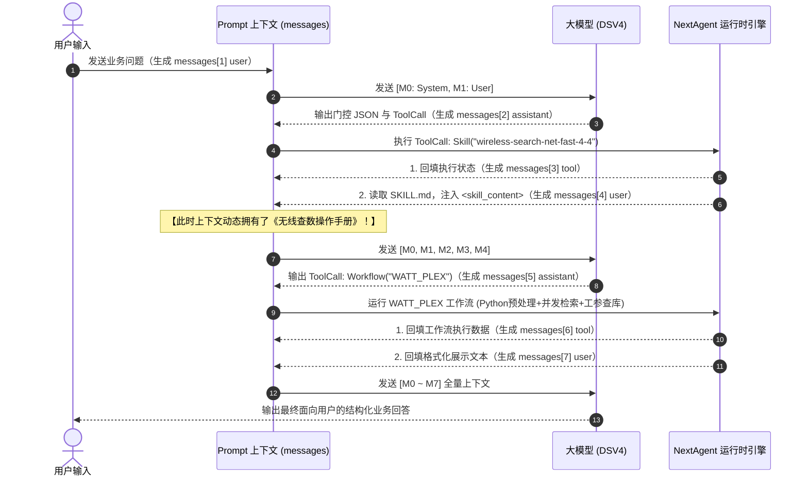

# AICOService Prompt 体系与上下文装配深度解析 Wiki

> **文档定位**：全景剖析 AICOService 在调用底层大模型（如 `dsv4` / DeepSeek-V4）时，**Prompt 的物理全貌、模块化组织机制、缓存分界标识符、动态技能与代理披露表格，以及多轮交互下的上下文延伸机制**。  
> **数据证据基准**：
> * 线上实际抓包日志：`aico_timedelay_test_report/dsv_modify_0814/dsv4_3_aico.jsonl`
> * 框架上下文规范：`nextagent/NextAgent/docs/developer/08-context-management.md` 与 `06-prompt-engineering.md`
> * 提示词资产目录：`aico_struct_code/aicoservice@27.68.169/agents/aico-agent-m/zh_CN/prompts/SYSTEM_PROMPT/`

---

## 目录

- [一、 Prompt 物理全貌：一次典型交互中的 Messages 数组](#一-prompt-物理全貌一次典型交互中的-messages-数组)
- [二、 System Prompt 的组织与装配机制](#二-system-prompt-的组织与装配机制)
  - [2.1 模块化解耦与 Manifest 清单驱动](#21-模块化解耦与-manifest-清单驱动)
  - [2.2 权威系统段落顺序（Predefined System Order）](#22-权威系统段落顺序predefined-system-order)
  - [2.3 编译期固化机制（Frozen Template Facts）](#23-编译期固化机制frozen-template-facts)
  - [2.4 稳定区段落功能分工概览](#24-稳定区段落功能分工概览)
- [三、 关键缓存标识符：---[CACHE_BOUNDARY]--- 深度剖析](#三-关键缓存标识符---cache_boundary----深度剖析)
  - [3.1 为什么存在这个标记？（KV-Cache 前缀复用原理）](#31-为什么存在这个标记kv-cache-前缀复用原理)
  - [3.2 框架定义与渲染契约（SYSTEM_PROMPT_CACHE_BOUNDARY_MARKER）](#32-框架定义与渲染契约system_prompt_cache_boundary_marker)
- [四、 System Prompt 的 Dynamic 动态变化区](#四-system-prompt-的-dynamic-动态变化区)
  - [4.1 动态环境与时间上下文](#41-动态环境与时间上下文)
  - [4.2 当前可用 Skill 列表全览（Available skills）](#42-当前可用-skill-列表全览available-skills)
  - [4.3 可用 Agent 列表全览（Available agents）](#43-可用-agent-列表全览available-agents)
  - [4.4 技能与代理的使用协议约束](#44-技能与代理的使用协议约束)
- [五、 对话上下文演进：多轮消息中的 Prompt 动态延伸](#五-对话上下文演进多轮消息中的-prompt-动态延伸)
  - [消息 1（user）：用户原始业务输入](#消息-1user用户原始业务输入)
  - [消息 2（assistant）：两阶段门控输出与 ToolCall](#消息-2assistant两阶段门控输出与-toolcall)
  - [消息 3（tool）：内核 Skill 加载确认帧](#消息-3tool内核-skill-加载确认帧)
  - [消息 4（user）：动态 Skill 正文伪装注入（<skill_content>）](#消息-4user动态-skill-正文伪装注入skill_content)
  - [消息 5 ~ 7：Workflow 调用、结果回填与最终总结](#消息-5--7workflow-调用结果回填与最终总结)
- [六、 运行时底座支撑：NextAgent 上下文引擎（Context Engine）机制](#六-运行时底座支撑nextagent-上下文引擎context-engine机制)
  - [6.1 assemble 与 render 两阶段流水线](#61-assemble-与-render-两阶段流水线)
  - [6.2 码点感知 Token 估算器（TokenEstimator）](#62-码点感知-token-估算器tokenestimator)
  - [6.3 窗口预算与三层上下文压缩机制（Compaction）](#63-窗口预算与三层上下文压缩机制compaction)
- [七、 总结速查：AICOService Prompt 构成要素全景清单](#七-总结速查aicoservice-prompt-构成要素全景清单)

---

## 一、 Prompt 物理全貌：一次典型交互中的 Messages 数组

在模型服务（如 OpenAI 协议、DeepSeek 接口）的交互规范中，所有输入大模型的 Prompt 均承载于 HTTP 请求体的 `messages` 数组中。

基于抓包日志 `aico_timedelay_test_report/dsv_modify_0814/dsv4_3_aico.jsonl`，一次完整的查数任务（问题：“帮我查一下深圳大梅沙D-HRH-2小区的经度、纬度和方位角”）在演进至终态时，其 `messages` 数组由以下 8 个部分依次构成：

```
+-------------------------------------------------------------------------------+
|                      AICOService Prompt 消息链全貌 (messages)                  |
|                                                                               |
| [messages[0]] role: "system"  (42,474 字符，730 行)                            |
|  ├─ 1. Stable 静态区 (行 1~681)                                               |
|  │   ├─ identity (身份定位与四大业务范围)                                       |
|  │   ├─ system (基本原则、用户偏好与相对时间处理)                                |
|  │   ├─ task_approach (56KB 巨型两阶段路由硬门控规则)                            |
|  │   ├─ communication_style (排版与表格输出规范)                               |
|  │   ├─ agent_delegation / tooling (委派与工具守则)                           |
|  │   ├─ action_safety (只读红线与敏感操作拦截)                                  |
|  │   ├─ context_management (上下文多轮状态规则)                                |
|  │   └─ workspace (沙箱目录边界)                                              |
|  ├─ 2. 缓存分界标识符: ---[CACHE_BOUNDARY]---                                  |
|  └─ 3. Dynamic 动态区 (行 683~729)                                            |
|      ├─ environment (动态模型名与执行宿主机日期)                                |
|      ├─ skill_disclosure (动态可见 Skill 列表与使用说明)                        |
|      ├─ agent_disclosure (动态可见 Agent 列表与说明)                           |
|      └─ locale hint (语言提示 zh-CN)                                          |
|                                                                               |
| [messages[1]] role: "user"                                                    |
|  └─ 用户原始自然语言提问（来自 A2A-T 接口）                                      |
|                                                                               |
| [messages[2]] role: "assistant"                                               |
|  └─ 第一阶段门控输出：纯文本 sub_questions 路由 JSON + ToolCall: Skill(...)       |
|                                                                               |
| [messages[3]] role: "tool"                                                    |
|  └─ Skill 工具执行握手响应（status: "loaded"）                                  |
|                                                                               |
| [messages[4]] role: "user" (动态技能正文注入)                                   |
|  └─ <skill_content name="..."> 标签包装的 SKILL.md 完整业务操作规范             |
|                                                                               |
| [messages[5]] role: "assistant"                                               |
|  └─ 读取到新规范后，第二阶段决策：ToolCall: Workflow("WATT_PLEX", ...)         |
|                                                                               |
| [messages[6]] role: "tool"                                                    |
|  └─ WATT_PLEX 工作流执行完毕返回的工参数据与状态                               |
|                                                                               |
| [messages[7]] role: "user" (结果回填)                                         |
|  └─ 将工作流产出的 Markdown 结构化展示文本注入作为上下文                        |
+-------------------------------------------------------------------------------+
```

---

## 二、 System Prompt 的组织与装配机制

在 AICOService 中，System Prompt 达到了 4.2 万字符的庞大规模。为了保证其工程可维护性与运行确定性，框架采用了高度严密的组织与装配流水线，而非由单一人工维护的长文本。

### 2.1 模块化解耦与 Manifest 清单驱动

整个 System Prompt 基于 **YAML Manifest 清单（`template.yaml`）+ 独立 Markdown 段落文件** 分离的架构组织：

* **组织载体**：位于 Agent 配置目录下的 `prompts/SYSTEM_PROMPT/template.yaml`；
* **解耦思想**：将系统所需的心智拆分为“身份定义”、“SOP工作法”、“输出风格”、“工具使用原则”、“安全底线”等独立段落，存放在各自的 `.md` 文件中；
* **团队协同**：网优业务专家只需专注打磨 `task-approach.md` 中的两阶段路由规则，安全合规团队独立维护 `action-safety.md`，前端团队维护 `communication-style.md`，彻底解决了单体 Prompt 维护时的版本冲突与相互干扰。

### 2.2 权威系统段落顺序（Predefined System Order）

在装配时，NextAgent 的上下文引擎（`agent-context-engine`）并不是机械地按照 YAML 文件中的声明次序无序罗列，而是遵循框架内置的**权威系统段落渲染顺序（Predefined System Section Order）**进行确定性组装：

```
+-------------------------------------------------------------------------+
|                  NextAgent 预定义 System Section 组装顺序               |
|                                                                         |
|  1. identity              (建立电信网优专家的第一人称角色认知)           |
|  2. system / behavior     (申明数据真实性、时间不换算与黑话映射等底座原则)|
|  3. task_approach         (注入核心业务 SOP，包含两阶段硬门控机制)       |
|  4. communication_style   (规约严谨客观的工程语言风格与 Markdown 排版)   |
|  5. agent_delegation      (规约跨 Agent 委派与任务分流标准)             |
|  6. tooling               (工具调用防伪造与防幻觉守则)                  |
|  7. action_safety         (只读安全红线与高危动作拦截)                  |
|  8. context_management    (上下文状态、偏好生命周期与多轮维护规范)       |
|  9. workspace             (文件沙箱与可操作目录边界定义)                |
+-------------------------------------------------------------------------+
```

这种强约束保证了大模型从宏观角色、基础原则，一步步递进到具体的业务执行细节，心智逻辑具备高度的确定性。

### 2.3 编译期固化机制（Frozen Template Facts）

为了极致的运行效率与确定性，NextAgent 并没有在每次接收到用户请求时都去磁盘实时读取这些 Markdown 文件或解析 YAML，而是通过**装配期固化**与**两层存储桶架构**实现零 I/O 开销与稳定的缓存复用：

#### 2.3.1 两层只读存储桶架构（Two-Tier Storage Buckets）
在底座注册中心（`DefaultPromptTemplateRegistry`）中，Prompt 事实被严格划分为两级不可变存储桶：
* **进程级内置桶（Process-scoped Builtin Bucket）**：由 NextAgent 框架底座全局提供（位于 `@nextagent/agent-context-engine/dist/prompt-templates/builtin/`）。在进程初始化启动时编译一次并常驻内存，包含通用的 `SYSTEM_PROMPT`、用于长会话压缩的 `SUMMARY_GENERATION` 以及提取长期记忆的 `MEMORY_EXTRACTION`。全进程单例共享，绝不为每个 Agent 冗余复制；
* **智能体业务桶（Agent-scoped Bucket）**：位于各业务智能体（如 `aico-agent-m` 网优意图座舱、`aico-agent-cn` 核心网智能体）包内的 `prompts/` 目录中。在同步 Agent Assembly 装配阶段被独立解析编译，并强绑定其受信的 `agentId` 与 `agentVersion`。

#### 2.3.2 分层覆盖与兜底机制（`agent > builtin`）
运行时的模板组装器（`PromptTemplateAssembler`）在两桶逻辑并集中按 **`agent > builtin`** 优先级与 `mergeSections` 算法完成拼装：
* **业务段落显式重写与覆盖**：针对电信垂直领域的严苛要求，`aico-agent-m` 在自身 `template.yaml` 中主动声明并完全重写了 `identity`（统一意图座舱 RAN Agent 角色）、`task_approach`（56KB 巨型两阶段路由硬门控规则）、`action_safety` 等业务段落，直接覆盖掉内置桶中的通用版本；
* **通用治理能力直接复用**：对于非业务类的系统治理功能（如多轮对话超长触发小模型压缩时的 `SUMMARY_GENERATION`、用户偏好抽取的 `MEMORY_EXTRACTION`），AICOService 无需重复编写模板，直接复用 Builtin 桶中的通用 Prompt；
* **段落级兜底（Section-level Fallback）**：若业务 Agent 在模板中未显式声明某一系统基础段落，框架会自动从 Builtin 模板中提取该段落作为兜底补充，防止系统级能力缺失。

#### 2.3.3 编译期安全门控与零 I/O 运行
* **启动期强类型校验（Fail-Closed）**：Prompt 编译器在装配时推断所有 `{{ variableName }}` 变量，仅允许受治理的合法系统变量（如 `enabledSkills`、`environment`、`workspaceDir`）。若包含未知或拼写错误的变量，在编译期直接报错拦截，杜绝将故障遗留到线上；
* **运行时零 I/O 与禁止 Lazy Compile**：在线请求处理路径（如 A2A-T 接口收到查数请求）严禁读取磁盘、严禁解析 YAML、严禁触发延迟编译。所有模板匹配直接通过内存指针查询已冻结的 Facts，实现接近 0ms 的 Prompt 组装时延；
* **字节级一致性保障 KV-Cache 稳定命中**：冻结事实消除了文件读写并发冲突、操作系统的换行符差异或动态格式化波动，确保稳定区文本字节级完全一致，使底层大模型（如 DSV4）的 Prefix KV-Cache 命中率达到极致。

### 2.4 稳定区段落功能分工概览

在缓存分界符之前的所有段落均属于**稳定区（Stable Sections）**，各个模块在体系中的职责划分如下：

| 模块标识 | 承载文件 | 职责定位与业务功能 |
|---|---|---|
| **identity** | `identity.md` | 明确为“统一意图座舱智能体 RAN Agent”，圈定知识问答、基础数据、特性数据及策略操作的管辖边界。 |
| **system** | `template.yaml` (内联) | 确立系统级底线：禁止捏造数据、相对时间保持原样不擅自换算、黑话与别名标准化。 |
| **task_approach** | `task-approach.md` | **核心业务资产**：规定不可违反的“两阶段硬门控”（先输出 `sub_questions` JSON，再发起工具调用）与静默处理原则。 |
| **communication_style** | `communication-style.md` | 统一输出格式，要求使用结构化 Markdown、指标加粗、表格排版，去除寒暄废话。 |
| **agent_delegation** | `agent-delegation.md` | 规定跨智能体委派的边界与参数透传协议，防止越权分流。 |
| **tooling** | `tooling.md` | 工具调用协议：入参严格对齐 Schema、严禁假装调工具、调用失败时的自愈策略。 |
| **action_safety** | `action-safety.md` | 安全红线：执行环境严格只读，禁止提供破坏性网元操作或配置修改步骤。 |
| **context_management** | `context-management.md` | 多轮历史维护准则：明确用户偏好生效周期，指引模型在上下文被压缩摘要时如何延续工作。 |
| **workspace** | `workspace.md` | 文件系统沙箱约束，限制执行代码只能在指定目录内读写。 |

装配引擎将上述稳定模块按序串联拼接为一个不可分割的稳定文本前缀，整体投递至下游。

---

## 三、 关键缓存标识符：---[CACHE_BOUNDARY]--- 深度剖析

在整个 System Prompt 中间，存在一行显式的特殊标记：

```markdown
Workspace root: workspace/. File system access is restricted to this directory and its subdirectories.

---[CACHE_BOUNDARY]---

  model=dsv4; date=2026-08-14
```

### 3.1 为什么存在这个标记？（KV-Cache 前缀复用原理）

在现代大模型服务（如 DeepSeek、Claude、OpenAI、vLLM）中，**Prompt Caching（前缀缓存）** 是一项关键的底层性能技术：
* 大模型在生成响应前，必须对输入的 Prompt 进行注意力计算以生成 KV-Cache；
* 如果 Prompt 的前序文本在多次请求间**完全一致**，模型推理引擎就可以直接复用显存中已计算好的 KV-Cache，而无需从头重新计算这数万个 Token；
* **痛点**：若 Prompt 开头包含动态变化的变量（如当前请求时间、动态会话 ID），会导致整个前缀计算哈希改变，使 4 万字的静态规则缓存彻底失效；
* **解法**：通过设立显式的缓存边界，将完全不变的通用规则固化在前半部分，所有随请求变化的动态变量强制后置。

### 3.2 框架定义与渲染契约（SYSTEM_PROMPT_CACHE_BOUNDARY_MARKER）

在 NextAgent 框架契约库 `packages/agent-contracts/src/context/index.ts` 中，对该标记进行了严格的规范定义：

```typescript
export const SYSTEM_PROMPT_CACHE_BOUNDARY_MARKER = '---[CACHE_BOUNDARY]---';
```

在 `agent-context-engine` 的渲染策略中，严格遵循以下契约：
1. **密封放置保护（Sealed Placement）**：`cache_boundary` 是框架受保护的内置分界，开发者禁止在自己的 YAML 模板中手动添加该 section，否则会在编译期直接抛出 `PROMPT_SYSTEM_SECTION_SEALED` 异常；
2. **前后隔离保证**：所有静态文件（identity、task-approach 等）**必须全部渲染在标记之前**；所有可变内容（环境日期、动态 Skill 清单等）**必须全部渲染在标记之后**；
3. **协议适配层对接**：下游的 Provider Adapter（如模型网关适配器）在发送请求前，会识别此标记并自动转换为具体模型协议的缓存端点（例如 Anthropic 协议的 `cache_control` 标记，或 DeepSeek 专用的前缀对齐切片）。

---

## 四、 System Prompt 的 Dynamic 动态变化区

位于 `---[CACHE_BOUNDARY]---` 之后的内容属于**动态区（Dynamic Sections）**。这部分内容随单次请求的环境、租户与可用工具动态生成：

### 4.1 动态环境与时间上下文
动态区首部注入了当前请求的物理运行环境参数：
* **当前系统日期**：动态传入宿主机基准日期（如 `date=2026-08-14`）；
* **运行内核与操作系统**：提供底层 OS 及体系架构标识，供特定沙箱脚本识别执行环境。

### 4.2 当前可用 Skill 列表全览（Available skills）

紧随其后的是由框架 `skillDisclosureProjection` 机制动态投影生成的 `### Available skills` 区块。在底层治理模型中，这些可用技能明确划分为**系统内置 Skill（System-level）**与**当前 Agent 业务 Skill（Agent-scoped）**两层：

* **系统内置 Skill（System Skills）**：由 NextAgent 运行时全局底座提供，负责开发运维与环境自自治能力；
* **当前 Agent 业务 Skill（Agent Skills）**：定义在当前业务智能体资产目录（`agents/aico-agent-m/zh_CN/skills/`）下，承载电信网优领域的垂直专业流程与查数规范。

为了防止 Prompt 膨胀并保持专注，此处**绝不展开 Skill 的几千字详细操作规范**，仅向外层模型披露最简炼的元数据摘要（名称与职责定位）：

| 划分类别 | Skill 标识名称 | 业务定位与功能范围简要说明 | 适用场景 |
|---|---|---|---|
| **系统内置 Skill** | **`skill-creator`** | **运行时本地技能创建与调优 Skill**。由 NextAgent 底座系统提供，用于辅助起草、编辑和校验本地 Skill 配置。 | 开发调试或系统维护阶段管理技能时调用。 |
| **当前 Agent 业务 Skill** | **`wireless-search-net-fast-4-4`** | **无线网络智能查数 Skill**。专用于查询无线历史数据、PM 性能指标、工参信息、告警及统计分析。 | 用户提问涉及小区、基站、下倾角、PRB、吞吐量等查数诉求时调用。 |
| **当前 Agent 业务 Skill** | **`knowledge-qa`** | **华为 ICT 领域理论知识问答 Skill**。用于解答无线、核心网、能源等概念原理、特性说明及排障流程。 | 纯理论、名词解释或概念咨询，不需要查实时现网数据时调用。 |
| **当前 Agent 业务 Skill** | **`topology-query`** | **网络拓扑信息查询 Skill**。用于获取网元上下游拓扑连接关系与物理组网结构。 | 用户需要了解站点上下级归属或物理连接拓扑时调用。 |

### 4.3 可用 Agent 列表全览（Available agents）

类似于 Skill 披露，当前环境中允许被委派的子智能体也会在此以精简列表形式呈现：

| Agent 标识名称 | 业务定位与职责简要说明 | 委派条件 |
|---|---|---|
| **`network-explorer`** | **网络证据只读收集智能体**。专职采集网络拓扑、告警列表、KPI 指标快照与工单上下文。 | 需要进行深入的多源证据链收集且当前 Agent 不宜直接承载时委派。 |

### 4.4 技能与代理的使用协议约束
在列表之后，动态区附带了内置的调用守则（`### How to use skills` 与 `### How to use agents`）：
* 明确规定模型仅在意图完全匹配时才可调用对应工具；
* 禁止在文本中只描述“我计划调用某技能”而不发出实际 ToolCall；
* 技能加载后必须严格服从技能注入的新指令，但不得违背更高优先级的系统级安全约束。
* 尾部附带语言环境提示（`Locale/language hint: zh-CN.`）。

---

## 五、 对话上下文演进：多轮消息中的 Prompt 动态延伸

除 System Prompt 外，`messages` 数组中的后续元素随着业务交互逐步扩展，形成了完整的执行闭环：



### 消息 1（user）：用户原始业务输入
从 A2A-T HTTP 接口（`POST /rest/naie/aicoservice/v1/a2at/task`）提取：
```
帮我查一下深圳大梅沙D-HRH-2小区的经度、纬度和方位角。
```

### 消息 2（assistant）：两阶段门控输出与 ToolCall
大模型严格遵守 `task-approach.md` 规则，输出两段内容：
1. **纯文本 `content`**：
   ```json
   {
     "sub_questions": [
       {
         "sub_question": "查询深圳大梅沙D-HRH-2小区的经度、纬度和方位角",
         "type": "基础数据查询",
         "strategy_intent": "工参数据查询",
         "scene": "优化"
       }
     ]
   }
   ```
2. **工具调用 `tool_calls`**：
   ```json
   {
     "id": "chatcmpl-tool-9d79a08f364a4ed8",
     "type": "function",
     "function": {
       "name": "Skill",
       "arguments": "{\"name\":\"wireless-search-net-fast-4-4\",\"args\":{\"question\":\"查询深圳大梅沙D-HRH-2小区的经度、纬度和方位角\"}}"
     }
   }
   ```

### 消息 3（tool）：内核 Skill 加载确认帧
由 NextAgent 内核的 `skill-tool.js` 返回，通知模型该技能已成功加载：
```json
{
  "name": "wireless-search-net-fast-4-4",
  "status": "loaded",
  "capabilityResult": { "metadata": { "agenticSkillLoaded": true } }
}
```

### 消息 4（user）：动态 Skill 正文伪装注入（<skill_content>）
这是理解 AICOService Prompt 机制的关键：**内核将磁盘中的 `SKILL.md` 正文包装后，伪装成一条 `user` 角色消息追加进历史！**

* **真实日志抓包切片（长度 2,598 字符）**：
  ```markdown
  <skill_content name="wireless-search-net-fast-4-4">
  # wireless-search-net-fast

  你是无线网络数据查询智能体。

  所有需要访问无线网络数据的请求，统一调用 Workflow recipe：
  ```text
  WATT_PLEX
  ```

  `WATT_PLEX` 负责完整业务流程，包括意图协商、任务规划、数据查询、数据处理和异常处理。画图功能由外层 Skill 调用 smartcanvas 处理。

  外层 Skill 负责：
  1. 根据对话上下文补全用户当前问题；
  2. 调用 `WATT_PLEX`；
  3. 判断是否有画图意图，若有则调用 smartcanvas 画图；
  4. 根据 Workflow 返回结果（及画图结果）进行响应。
  ...
  </skill_content>
  ```
* **业务价值**：在用户没问无线问题之前，这段 2.6KB 的规则完全不存在于上下文里；一旦问及，它立刻精准出现在消息末尾，以最高优先级指导大模型下一步调用 `WATT_PLEX`。

### 消息 5 ~ 7：Workflow 调用、结果回填与最终总结
* **Msg 5 (assistant)**：模型读到 Skill 指引，发出 `ToolCall: Workflow(recipeName="WATT_PLEX")`；
* **Msg 6 (tool)**：内核执行完工作流内部所有步骤（Python清洗、7路并发检索、工参查询）后，回填 `status: "succeeded"`；
* **Msg 7 (user)**：内核将查出的数据格式化后推入上下文：
  ```
  **深圳大梅沙D-HRH-2**小区的**经度**为**114.3056**，**纬度**为**22.6027**，**方位角**为**150.0**。
  ```
* **最终响应**：模型结合 Msg 7 输出最终面向用户的解答。

---

## 六、 运行时底座支撑：NextAgent 上下文引擎（Context Engine）机制

上述精巧的 Prompt 组织由 NextAgent 框架中的 `agent-context-engine` 模块提供坚固的工程底座支撑（详见文档 `nextagent/NextAgent/docs/developer/08-context-management.md`）。

### 6.1 assemble 与 render 两阶段流水线

在一次模型调用中，上下文引擎严格区分两个生命周期阶段：

```
ContextAssemblyRequest
        │
        ▼
[Step 1: assemble 阶段]  (src/assembly/assemble-context.ts)
  ├─ 1. 加载并固化 Agent Assembly (agent.yaml、能力清单、模型选择)
  ├─ 2. 编译模板生成 SystemPrompt (区分 stable 与 dynamic)
  ├─ 3. 历史候选筛选 (selectHistory: 解析当前轮次、合并前序完整轮次)
  ├─ 4. Micro-compact 微压缩检查 (清理旧工具结果)
  ├─ 5. Large-content guard (大内容截断与外置检查)
  └─ 6. 预算门控评估 (Token 估算与超额判定)
        │
        ▼ 产出 ContextAssembly
[Step 2: render 阶段]    (src/render/default-model-input-renderer.ts)
  ├─ 1. 单次批量从 MessageStore 加载选定的消息体 (禁止 N+1 查询)
  ├─ 2. 插入 SYSTEM_PROMPT_CACHE_BOUNDARY_MARKER
  ├─ 3. 应用外置内容占位符与截断预览
  └─ 4. 渲染为标准 ModelMessage[] 列表并对外下发
```

### 6.2 码点感知 Token 估算器（TokenEstimator）
为了避免调用昂贵的在线 Tokenizer API，框架内置了 `DefaultTokenEstimator`：
* 采用**码点感知（Code-point-aware）**加权算法：
  * CJK 汉字与全角符号权重：`× 1.5`
  * 增补平面字符：`× 2.0`
  * ASCII 英文字符：`× 0.25`
* 为每条消息自动附加协议帧基础开销（4 Tokens），确保估算误差在 5% 以内，防止物理溢出。

### 6.3 窗口预算与三层上下文压缩机制（Compaction）

当多轮会话累积、消息越来越长时，NextAgent 不会暴力截断，而是通过**三层互补防御线**动态守护 Prompt 窗口：

```
+-------------------------------------------------------------------------+
|                  三层上下文窗口压缩与外置防御体系                         |
|                                                                         |
|  [Layer 1: Micro-compact 微压缩]                                         |
|  - 纯本地规则，针对白名单工具 (bash/read/grep/glob/write/python)          |
|  - 累积工具结果 > 10 时触发，自动将最旧的超出部分替换为轻量占位符，保留最近 5 个|
|                                                                         |
|  [Layer 2: Large-content Truncation 大内容截断与外置]                    |
|  - 针对单个超大 CAPABILITY_RESULT (> 50KB)                              |
|  - 将原文外置为磁盘文件 tool-results/<refId>.txt                         |
|  - 提示词中仅保留 2KB 的 Bounded Preview，模型可通过 read 工具按需读回     |
|                                                                         |
|  [Layer 3: Summary Compression 主动摘要压缩]                             |
|  - 当上下文接近窗口上限 (达到 90%~92% Headroom) 时触发                   |
|  - 调用小模型将前序轮次压缩为单一 SUMMARY 消息，保留尾部最近一轮完整交互    |
+-------------------------------------------------------------------------+
```

---

## 七、 总结速查：AICOService Prompt 构成要素全景清单

| 组成要素 | 物理位置 / 角色 | 来源文件 / 机制 | 是否受 Cache 保护 | 核心业务功能与意义 |
|---|---|---|:---:|---|
| **Agent 身份** | `messages[0]` 稳定区 | `identity.md` | **是** | 建立无线网优专家角色认知与业务范围 |
| **系统基本原则** | `messages[0]` 稳定区 | `template.yaml` (内联) | **是** | 约束数据真实性、时间不换算、黑话映射 |
| **两阶段任务工作法** | `messages[0]` 稳定区 | `task-approach.md` (56KB) | **是** | 强制先出 `sub_questions` JSON 再调工具 |
| **沟通风格与安全** | `messages[0]` 稳定区 | `communication-style` 等 | **是** | 表格排版输出，只读红线防破坏 |
| **工作空间规范** | `messages[0]` 稳定区 | `workspace.md` | **是** | 限制文件操作沙箱范围 |
| **缓存分界符** | **`messages[0]` 分界线** | `SYSTEM_PROMPT_CACHE_BOUNDARY_MARKER` | **分界锚点** | **显式声明 KV-Cache 切片点，隔离静态与动态** |
| **运行时环境** | `messages[0]` 动态区 | `{{ environment? }}` 注入 | 否 | 注入真实物理日期（2026-08-14）与操作系统 |
| **可用技能摘要** | `messages[0]` 动态区 | `skillDisclosureProjection` | 否 | 仅披露 `wireless-search-net` 等元数据摘要 |
| **技能与委托守则** | `messages[0]` 动态区 | 内置 `skill-disclosure.md` | 否 | 规范工具调用的参数与错误处理协议 |
| **用户问题** | `messages[1]` (user) | A2A-T 接入层 | 否 | 用户的原始提问文本 |
| **门控响应帧** | `messages[2]` (assistant) | 模型第 1 轮自回归输出 | 否 | 结构化拆解结果与 `Skill(...)` 调用请求 |
| **动态技能正文** | **`messages[4]` (user)** | **`<skill_content>` 注入** | 否 | **将 `SKILL.md` 正文作为提示词推入上下文** |
| **工作流成果回填** | `messages[7]` (user) | `WATT_PLEX` 执行完成回填 | 否 | 注入格式化后的工参查询结论供模型作答 |

---

*（完）*
