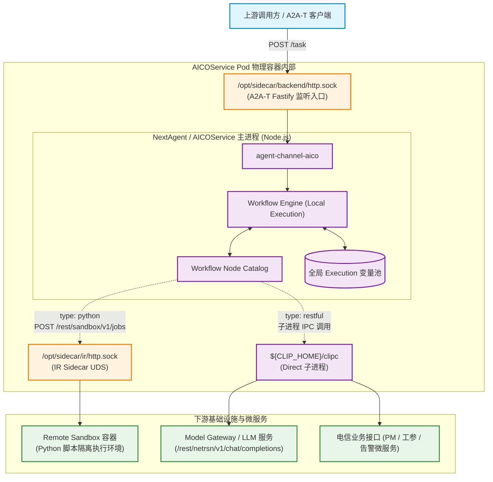
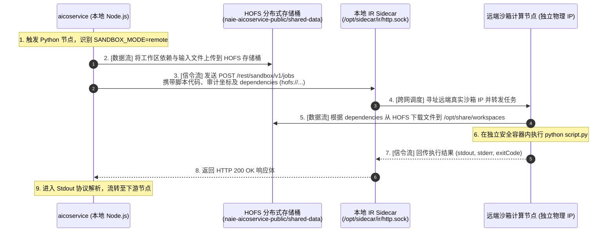
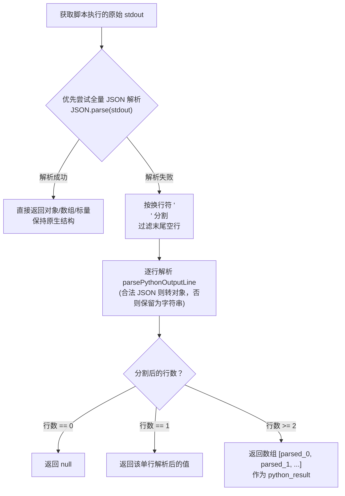
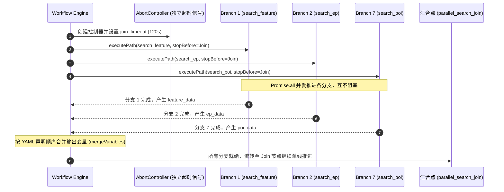
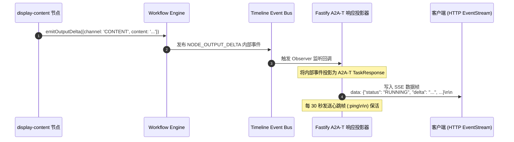

# AICOService Recipe 节点调用与执行机制深度解析

> **版本**：v1.0.0  
> **面向对象**：AICOService 核心开发人员、工作流编排工程师、底层框架（NextAgent）研发与运维人员  
> **核心基线**：`aicoservice@27.68.169` 本地完整运行包、`@nextagent/agent-workflow` 引擎实现、`WATT_PLEX.yaml` 真实拓扑
> 
> 💡 **姊妹篇导读**：若想深入了解工作流底座的**全层级标识体系（`executionId`/`toolCallId`）**、**节点生命周期状态机**及**全局上下文变量池解析与合并机制**，请参阅：**[AICOService_Recipe运行底座与数据流机制Wiki.md](file:///Users/zhangfan/project/aico_timedelay_report/AICOService_Recipe%E8%BF%90%E8%A1%8C%E5%BA%95%E5%BA%A7%E4%B8%8E%E6%95%B0%E6%8D%AE%E6%B5%81%E6%9C%BA%E5%88%B6Wiki.md)**。

---

## 目录

- [一、 Recipe 节点执行底座与架构全景](#一-recipe-节点执行底座与架构全景)
  - [1.1 从 DSL 到执行态：Recipe 的发现与轻量索引](#11-从-dsl-到执行态recipe-的发现与轻量索引)
  - [1.2 节点调度的系统架构与物理边界全景](#12-节点调度的系统架构与物理边界全景)
- [二、 Recipe 节点全景分类与速览（Node Taxonomy Overview）](#二-recipe-节点全景分类与速览node-taxonomy-overview)
  - [2.1 核心节点全貌汇总对照表](#21-核心节点全貌汇总对照表)
- [三、 流程生命周期节点（Lifecycle Nodes）](#三-流程生命周期节点lifecycle-nodes)
  - [3.1 start-event：入参注入与变量初始化](#31-start-event入参注入与变量初始化)
  - [3.2 end-event：终态收敛与输出变量提取](#32-end-event终态收敛与输出变量提取)
- [四、 脚本与计算节点：Python 节点的沙箱执行机制](#四-脚本与计算节点python-节点的沙箱执行机制)
  - [4.1 动态代码注入与 Preamble 组装协议](#41-动态代码注入与-preamble-组装协议)
  - [4.2 物理执行边界：Sidecar 边车架构与远端执行解耦](#42-物理执行边界sidecar-边车架构与远端执行解耦)
  - [4.3 双通道协同机制：信令通道与跨机数据流（HOFS 存储中转）](#43-双通道协同机制信令通道与跨机数据流hofs-存储中转)
  - [4.4 标准输出协议（Stdout Protocol）：全量 JSON 与多行数组解析](#44-标准输出协议stdout-protocol全量-json-与多行数组解析)
  - [4.5 运行时安全与防护（超时、内存与输出截断）](#45-运行时安全与防护超时内存与输出截断)
- [五、 外部能力与模型节点：RESTful / CLIP 调度机制](#五-外部能力与模型节点restful--clip-调度机制)
  - [5.1 为什么 RESTful 不是裸 HTTP：`api_name` 与 Capability 架构](#51-为什么-restful-不是裸-httpapi_name-与-capability-架构)
  - [5.2 物理执行边界：Direct CLIP 模式与 `clipc` 进程调用](#52-物理执行边界direct-clip-模式与-clipc-进程调用)
  - [5.3 大模型推理调用机制（规划模型与执行模型）](#53-大模型推理调用机制规划模型与执行模型)
  - [5.4 领域查询能力调用（工参、PM 性能指标、告警微服务桥接）](#54-领域查询能力调用工参pm-性能指标告警微服务桥接)
- [六、 控制流与网关调度节点：并发、分支与循环](#六-控制流与网关调度节点并发分支与循环)
  - [6.1 并发网关（parallel-gateway）：Promise 并发与 Fork-Join 汇合](#61-并发网关parallel-gatewaypromise-并发与-fork-join-汇合)
  - [6.2 条件分支与路由机制（inclusive-gateway 与条件后继）](#62-条件分支与路由机制inclusive-gateway-与条件后继)
  - [6.3 循环自愈与防死锁设计（ReAct Loop 与步数熔断控制）](#63-循环自愈与防死锁设计react-loop-与步数熔断控制)
- [七、 交互与展示节点：流式推送与协商退出机制](#七-交互与展示节点流式推送与协商退出机制)
  - [7.1 display-content 与 Timeline 事件总线](#71-display-content-与-timeline-事件总线)
  - [7.2 SSE（Server-Sent Events）流式投影机制](#72-sseserver-sent-events流式投影机制)
  - [7.3 协商分支的设计真相（为什么当前实现是结束而非原地暂停）](#73-协商分支的设计真相为什么当前实现是结束而非原地暂停)
- [八、 容错、重试与观测保障体系](#八-容错重试与观测保障体系)
  - [8.1 节点级超时（Scoped AbortSignal）与重试策略](#81-节点级超时scoped-abortsignal与重试策略)
  - [8.2 节点状态快照（Checkpoint）与追踪日志](#82-节点状态快照checkpoint与追踪日志)
- [九、 总结与最佳实践对照表](#九-总结与最佳实践对照表)

---

## 一、 Recipe 节点执行底座与架构全景

### 1.1 从 DSL 到执行态：Recipe 的发现与轻量索引

在 AICOService 中，Recipe 工作流并非动态在远端注册中心下拉执行，而是在服务启动阶段作为本地资产载入并由底座引擎调度：

1. **物理加载路径**：容器启动脚本 `start.sh` 将当前场景对应资产复制至 `/opt/share/agents/AICOServiceAgent/recipes/`。
2. **轻量索引构建**：`WorkflowRecipeDefinitionSource` 扫描目录下的 `.yaml/.yml` 文件，使用 `js-yaml` 进行轻量解析，提取 `recipeName`、`version` 及节点元数据建立内存索引。
3. **按需完整加载与缓存**：当请求触发某个 Recipe（如 `WATT_PLEX`）时，加载器完整解析节点树、规范化节点类型（将 YAML 类型映射为引擎内部核心枚举），并放入 `agentId + recipeName` 的内存缓存池（上限 100 条）。

```
YAML 文件 (WATT_PLEX.yaml)
  │ (readFileSync + js-yaml)
  ▼
WorkflowRecipeDefinition (AST / Graph)
  │ (Catalog 校验 & Normalization)
  ▼
Executable Recipe Context (节点目录、边关系、变量声明)
```

---

### 1.2 节点调度的系统架构与物理边界全景

在系统层面，一次 Recipe 节点的执行涉及跨进程与跨容器的复杂物理交互。整个系统的调度与物理调用边界如下图所示：



* **入口通道**：请求通过 `/opt/sidecar/backend/http.sock` 送入 Fastify。
* **引擎本体**：`workflow-execution` 配置为 `LOCAL`，这意味着 DAG 调度与状态流转完全在 **AICOService Node.js 主进程内** 运行。
* **脚本执行边界**：Python 节点不使用 Node.js 的 `vm` 或本地子进程，而是经由 `/opt/sidecar/ir/http.sock` 转发给远程沙箱服务（Remote Sandbox）。
* **能力调用边界**：RESTful 节点通过底座 Direct CLIP 机制，调用本地二进制 `clipc` 进程，由 `clipc` 完成对下游模型网关与电信微服务的请求。

---

## 二、 Recipe 节点全景分类与速览（Node Taxonomy Overview）

在深入探究各类节点的具体执行代码与物理边界之前，本章先对 AICOService 工作流（以典型业务基石 `WATT_PLEX.yaml` 为例）中涉及的节点进行**宏观分类与总体汇总**。

AICOService 中的节点在业务表现上多种多样（涵盖数据清洗、Prompt 构造、并发维表检索、大模型推理、工参查库、增益计算等），但在 NextAgent 底座引擎层面，它们被高度归一化抽象为 **5 大核心功能类别**：

### 2.1 核心节点全貌汇总对照表

| 节点类别 | DSL 配置类型 (`type`) | 典型代表节点 (`nodeId`) | 核心职责与业务功能 | 物理执行载体 / 调度边界 |
|---|---|---|---|---|
| **1. 流程生命周期节点**<br>*(Lifecycle)* | `start-event`<br>`end-event` | `start_node`<br>`end_node` | • 规范工作流的入口与出口<br>• 注入入参并初始化变量池（如 `${input_question}`）<br>• 汇总终态输出变量（`outputVariables`） | **AICOService 主进程内**<br>(脚手架节点，无独立沙箱或外部通信) |
| **2. 脚本计算与转换节点**<br>*(Scripting & Data)* | `python` | `preprocess`<br>`postprocess`<br>`build_nego_plan_messages`<br>`parse_nego_planner`<br>`calculate_gain` 等 | • 文本预处理与电信黑话映射清洗<br>• 动态拼装大模型 Prompt 消息体<br>• 复杂大模型 JSON 结果解析与合法性校验<br>• 数学分析与增益计算（如增长量/增长率） | **Remote Sandbox 隔离容器**<br>(通过 IR Sidecar UDS Socket 发起任务) |
| **3. 外部能力与模型调用节点**<br>*(Capability / RESTful)* | `restful` | `call_nego_plan_llm`<br>`call_exec_llm`<br>`call_param`<br>`call_pm`<br>`call_alarm` | • **模型推理**：调用规划模型与执行模型（`chat_completions`）<br>• **领域微服务查询**：调用工参（`queryEngineerParam`）、性能指标（`queryPerformanceData`）、告警（`queryAlarms`）等电信接口 | **Direct CLIP 模式**<br>(Node.js 子进程执行本地 `${CLIP_HOME}/clipc`) |
| **4. 控制流与网关调度节点**<br>*(Control Flow & Gateways)* | `parallel-gateway`<br>`inclusive-gateway`<br>条件后继 (`condition`) | `parallel_search`<br>`route_tool`<br>`UH -> BE` 循环边 | • **并发网关**：发起 7 路维表并发扫库与 Join 汇聚<br>• **条件路由**：根据意图判定或模型 tool_call 分流<br>• **循环推进**：驱动 ReAct 工具循环，并在达到 4 步熔断阈值时收敛退出 | **Workflow Engine 调度内核**<br>(Promise.all 协程并发调度、AST 表达式求值) |
| **5. 交互与展现节点**<br>*(Interaction & Display)* | `display-content` | `display_nego`<br>`display_exec_direct_answer`<br>`display_final_result`<br>`show_csv` | • 向用户展示阶段性结论或协商追问<br>• 渲染展示 CSV 文件下载路径与业务表格<br>• 产生前端可见内容增量事件 | **Timeline 事件总线 + Fastify SSE**<br>(实时投影为 A2A-T text/event-stream 长连接帧) |

---

## 三、 流程生命周期节点（Lifecycle Nodes）

流程生命周期节点是整个 DAG 的逻辑端点，属于脚手架节点（Scaffold Nodes），不产生独立的 `nodeExecutionId`。

```
[上游 A2A-T / Runtime]
         │
         ▼
  ┌──────────────┐
  │ start-event  │ ──> 注入 input_question / 初始化变量
  └──────────────┘
         │
     [DAG 流转]
         │
         ▼
  ┌──────────────┐
  │  end-event   │ ──> 提取最终 outputVariables / 产生执行终态
  └──────────────┘
         │
         ▼
[A2A-T 响应流投影]
```

### 3.1 start-event：入参注入与变量初始化

#### YAML 典型配置切片
```yaml
start_node:
  type: start-event
  inputs:
    input_question: ${input_question}
  next:
    preprocess:
      condition: ''
```

#### 底层执行机理
1. **输入参数挂载**：外部通过 Tool Call 调用 `Workflow({recipeName: "WATT_PLEX", inputText: "...", inputVariables: {...}})` 进入。
2. **变量初始化**：引擎在 `initializeVariables` 中，将 `inputVariables` 作为基座字典；如果存在 `inputText`，则自动将其赋值给全局变量 `input_question`。
3. **无缝透传**：`start-event` 的 handler 直接返回 `undefined`，不执行额外业务逻辑，立即根据 `next` 指向无条件触发第一个业务节点（如 `preprocess`）。

### 3.2 end-event：终态收敛与输出变量提取

#### YAML 典型配置切片
```yaml
end_node:
  type: end-event
  inputs:
    output_content: ${display_final_result_output}
  outputs:
    final_result: ${output_content}
```

#### 底层执行机理
1. **终止转移标记**：Handler 返回 `{ transition: { kind: 'TERMINAL' } }`，告知 `executePath` 调度循环停止继续向下游推进。
2. **终态结果捕获**：引擎将当前全局变量池中声明的 `outputs` 提取为 Recipe 的最终产物，并将工作流状态置为 `COMPLETED`。
3. **外层通道桥接**：在普通模型路径中，该输出作为 `Workflow` capability 的 tool result 返回给外层 Agent；在确定性路由（`executeRecipeRoute`）中，直接作为会话最终响应。

---

## 四、 脚本与计算节点：Python 节点的沙箱执行机制

Python 节点是 Recipe 中最灵活也是数量最多的节点类型之一（在 `WATT_PLEX` 中承担预处理、后处理、Prompt 构建、大模型 JSON 解析及数学增益计算等职责）。

### 4.1 动态代码注入与 Preamble 组装协议

开发者在 YAML 的 `script` 字段中编写的是纯粹的 Python 脚本，并直接使用变量名（如 `input_question`）。NextAgent 引擎在底层执行前，会自动完成**代码前置序言（Preamble）**的生成与注入。

```
YAML Inputs:                      底层引擎自动注入的代码 (Preamble):
┌──────────────────────────┐      ┌────────────────────────────────────────────────────────┐
│ input_question: "查小区" │ ───> │ input_question = '查小区'                              │
│ param_to_json_str: "true"│      │ tool_args = r'''{"entityNames":["cell_1"],"rat":"5G"}'''│
│ tool_args: ${tool_args}  │      └────────────────────────────────────────────────────────┘
└──────────────────────────┘                                   │
                                                               ▼ (与脚本拼接)
                                  ┌────────────────────────────────────────────────────────┐
                                  │ # 开发者编写的真实 Python 脚本                         │
                                  │ import json                                            │
                                  │ args = json.loads(tool_args)                           │
                                  │ ...                                                    │
                                  └────────────────────────────────────────────────────────┘
```

#### 变量前置生成规则（`executePythonNode`）
* **原生字面量模式（默认）**：调用 `toPythonLiteral(value)` 将 JS 变量转换为 Python 原生字面量（`null -> None`，`true -> True`，数字保持不变，对象通过 `JSON.stringify` 转换）。
* **JSON 字符串化模式（`param_to_json_str: "true"`）**：当处理包含换行、双引号、转义字符的复杂对象时，为了避免 Python 语法解析报错，引擎将变量序列化为 Raw 原始字符串：
  ```python
  variable_name = r'''<JSON_STRING>'''
  ```
  脚本内部只需通过 `json.loads(variable_name)` 即可安全还原。

---

### 4.2 物理执行边界：Sidecar 边车架构与远端执行解耦

在 AICOService 的生产配置（`default-system.yaml`）中，`sandbox` 的 `deploymentMode` 明确为 **`REMOTE`**。Python 代码**绝不会在 Node.js 主进程中直接执行**，而是交由物理隔离的远程沙箱集群调度。

#### 1. 架构真相：为什么生产环境不直接配置远程 IP？
在传统思维中，远程沙箱通常被想象为一个固定的微服务地址（例如 `http://10.x.x.x:8080/execute`）。但在云原生微服务集群（Kubernetes / 私有云 PaaS）中，直接写死远程 IP 会带来严重的工程隐患：
* **沙箱计算节点池的动态扩缩容与漂移**：远端的沙箱容器池（Worker Pool）处于高频动态调度状态，计算节点随时可能扩容、缩容或重启漂移，业务服务无法维护硬编码的静态 IP 列表。
* **安全证书与鉴权隔离**：跨集群调用沙箱需要携带机密的 mTLS 证书或鉴权 Token，业务容器不应感知这些底层安全基础设施细节。
* **网络性能优化（零网络栈开销）**：通过同 Pod 边车（Sidecar）共享内存通信，本地交接无需经过 TCP 握手与网络路由，降低毫秒级时延。

因此，系统将远程沙箱执行设计为**“两段式”架构**：

```mermaid
graph LR
    subgraph 本地业务 Pod (当前容器环境)
        AICO[aicoservice<br>业务容器 Node.js] -- "① 极速本地通信 (UDS)<br>/opt/sidecar/ir/http.sock" --> Sidecar[IR Sidecar 边车代理<br>基础设施组件]
    end

    subgraph 远端沙箱执行集群 (拥有物理 IP 的独立计算节点)
        Sidecar -- "② 跨网络 TCP/HTTP 转发<br>自动寻址远端真实 IP: 10.x.x.x" --> LB[沙箱网关 / 调度中心]
        LB --> Worker1[沙箱容器 Worker 1<br>(独立计算节点 IP-A)]
        LB --> Worker2[沙箱容器 Worker 2<br>(独立计算节点 IP-B)]
    end
```

* **第一段（本地交割）：Node.js ➔ `/opt/sidecar/ir/http.sock`**：
  业务容器不需要感知远端沙箱的具体 IP。它只需将执行请求通过 Unix Domain Socket（`.sock`）扔给同 Pod 内的“通信员”——IR Sidecar。由于共用内存卷，调用**不经过 TCP 网络协议栈，零网络损耗**。
* **第二段（远端调度）：IR Sidecar ➔ 远端真实沙箱 Worker IP**：
  Sidecar 依赖平台的服务发现与安全网关，通过物理网络（TCP/HTTP/gRPC）将任务分发给**真正拥有独立物理 IP 的沙箱计算节点池（TaskWorker）**。

#### 2. 底层代码对直连模式的原生支持（配置灵活性）
查看底层源码 `@nextagent/agent-platform-gateway-remote` 中的 `reference-remote-sandbox.js`，其接口设计完全具备直接对接远程 IP 的能力：
```typescript
// 1. 优先读取 options.endpoint，其次读取环境变量 SANDBOX_API_BASE_URL，兜底使用默认 UDS 路径
const endpoint = options.endpoint ?? getEnv('SANDBOX_API_BASE_URL', DEFAULT_SANDBOX_ENDPOINT);

// 2. 解析 URL 协议
const { baseUrl, unix } = parseSocketUrl(endpoint);

// 3. 智能分流
if (unix !== undefined) {
    // 生产模式：经由本地 Sidecar UDS 套接字转发 (/opt/sidecar/ir/http.sock)
    response = await requestUnixSocketHttp({ socketPath: unix, ... });
} else {
    // 直连模式：直接向远端 IP 或域名发起标准 HTTP fetch！
    response = await fetch(url, { method: 'POST', ... });
}
```
* **开发调试提示**：在非 K8s 本地独立测试环境中，只需在环境变量中注入 `SANDBOX_API_BASE_URL=http://10.20.30.40:8080`，引擎就会自动绕过 Sidecar，直接向远程 IP 发起 HTTP 调度。

---

### 4.3 双通道协同机制：信令通道与跨机数据流（HOFS 存储中转）

当沙箱在远端物理隔离的机器上运行时，面临一个现实挑战：
> **“远端沙箱机器根本读不到本地业务容器的磁盘文件，执行所需的 Python 脚本、输入数据、依赖文件如何跨机运送？产物又如何存回？”**

AICOService 通过 Kubernetes `deployment.yaml` 注入的环境变量，构建了一套**“信令通道”与“数据通道”**双流协同机制：

#### 1. 核心环境变量全景对照

| 环境变量名 | 生产环境注入值 | 通道类型 | 核心业务作用 |
|---|---|---|---|
| **`SIDECAR_SOCKET`** | `/opt/sidecar/ir/http.sock` | **信令通道** | 解决“指令怎么发”。Node.js 向该本地 UDS 套接字发送 `POST /rest/sandbox/v1/jobs` 调度命令。 |
| **`SANDBOX_MODE`** | `remote` | **控制策略** | 运行模式开关。声明为 `remote` 时，沙箱适配器在执行前会自动触发远程数据同步与依赖解析逻辑。 |
| **`SANDBOX_HOFS_BUCKET`** | `naie-aicoservice-public` | **数据通道** | 解决“跨机网盘中转”。本地业务容器与远端沙箱节点共享的高性能分布式对象存储桶（HOFS）。 |
| **`SANDBOX_HOFS_PREFIX`** | `shared-data` | **数据通道** | 存储桶内的专属文件夹/命名空间。隔离存放本次沙箱所需的输入文件，避免污染桶内其他微服务数据。 |
| **`SANDBOX_WORKSPACE_MOUNT_POINT`** | `/opt/share/workspaces` | **数据通道** | 解决“远端机器落脚点”。远端沙箱容器将 HOFS 文件下载后，解压并挂载至该目录作为 Python 执行的当前工作目录（`cwd`）。 |

#### 2. 端到端执行时序图（信令 + 数据双流闭环）



* **相对路径无感兼容**：正是因为有了 `SANDBOX_WORKSPACE_MOUNT_POINT` 目录映射，开发者在 Python 脚本中书写的相对路径（例如 `open('./data.json')`），在远端执行时依然能精准读取到上传的数据，实现无缝透明执行。

---

### 4.4 标准输出协议（Stdout Protocol）：全量 JSON 与多行数组解析

Python 执行完毕后，沙箱返回执行过程中的标准输出（`stdout`）。NextAgent 的 `resolvePythonResult` 函数遵循一套极具设计感的**自动自适应解析协议**：



#### 经典工程设计印证：为什么 `preprocess` 能够输出 8 个变量？
在 `preprocess` 节点中，Python 脚本最后连续执行了 8 次 `print(json.dumps(...))`：
```python
print(json.dumps(feature_body, ensure_ascii=False))
print(json.dumps(ep_body, ensure_ascii=False))
...
print(question)
```
由于整段 `stdout` 包含了多个 JSON 字符串并由 `\n` 分隔，`JSON.parse(stdout)` 必然报错。引擎自动回退至**逐行解析模式**，将 8 行输出解析为一个长度为 8 的数组，并注入到 `python_result`。因此，节点的 outputs 声明可以精准按索引取值：
```yaml
outputs:
  feature_body: ${python_result[0]}
  ep_body: ${python_result[1]}
  ...
  input_question: ${python_result[7]}
```

---

### 4.5 运行时安全与防护（超时、内存与输出截断）

为了防止用户输入恶意脚本或死循环导致容器崩溃，Python 执行受到四重物理级安全约束：
1. **执行超时熔断**：节点级 `timeout`（未指定时默认 **30,000 ms**），超时触发底层 Docker/cgroup 强制 kill。
2. **输出流大小截断**：`stdoutLimitBytes` 与 `stderrLimitBytes` 严格限制为 **1,000,000 字节（约 1MB）**，超出即截断，防止内存溢出。
3. **网络与文件系统隔离**：Remote Sandbox 处于独立网络 Namespace 中，阻断非法外联。
4. **异常格式化回传**：若 Python 脚本抛出 SyntaxError 或未捕获异常，stderr 被封装为标准 `AgentError`，标记为 `category: 'INTERNAL'` 并阻断后续分支。

---

## 五、 外部能力与模型节点：RESTful / CLIP 调度机制

### 5.1 为什么 RESTful 不是裸 HTTP：`api_name` 与 Capability 架构

在常见的低代码引擎中，RESTful 节点通常直接配置 `url: http://api.xxx.com`、`method: POST`。但在电信级工业架构 AICOService 中，这种做法存在重大隐患：**接口地址硬编码、缺乏统一鉴权、无服务发现与容灾能力**。

因此，AICOService 的 `type: restful` 节点本质上是 **NextAgent Capability 框架的代理调用**：
* 开发者在 YAML 中只需声明 `api_name`（如 `queryEngineerParam` 或 `chat_completions`）。
* 节点 Handler 将 `api_name` 作为系统的 `capabilityId`，由底座 Capability 路由总线寻找对应的 Provider。

```yaml
call_param:
  type: restful
  inputs:
    api_name: "queryEngineerParam"
    entityNames: ${tool_args.entityNames}
    fields: ${tool_args.fields}
    filters: ${tool_args.filters}
  outputs:
    tool_result: ${api_response}
```

---

### 5.2 物理执行边界：Direct CLIP 模式与 `clipc` 进程调用

底座能力系统支持多种模式。在当前 `aicoservice@27.68.169` 部署中，未开启 `CLIPMode: SANDBOX`，因此系统激活的是 **Direct CLIP 模式**。

```
RESTful 节点调度 (NextAgent)
  │
  ▼ executeRestfulNode
capabilityInvocation.invoke(capabilityId, args)
  │
  ▼ DirectClipCommandRunner
组装命令参数 (clipc execute <capabilityId> --input-json ...)
  │
  ▼ DirectClipcPort (Node.js child_process.spawn)
执行底层二进制: ${CLIP_HOME}/clipc  (shell: false)
  │
  ▼ IPC / 进程输出捕获
获取 stdout 响应并反序列化挂载至 ${api_response}
```

* **执行实体**：Node.js 底座通过直接子进程调用容器内的二进制程序 `${CLIP_HOME}/clipc`。
* **安全规约**：启动参数中显式设置 `shell: false`，杜绝任何 Shell 注入攻击风险。
* **CLIP 的职责**：`clipc` 是电信内部的能力客户端，由它负责根据 `api_name` 读取局点网关配置、注入安全凭据、发起真实网络通信。

---

### 5.3 大模型推理调用机制（规划模型与执行模型）

在 `WATT_PLEX` 拓扑中，有两个至关重要的推理节点：
1. **`call_nego_plan_llm`**：协商规划模型（负责意图完整性校验与生成工具调用步骤）。
2. **`call_exec_llm`**：执行模型（负责 ReAct 循环中的工具派发或给出直接回复）。

从底层执行视角看，**它们在实现上完全是普通的 RESTful 节点，其 `api_name` 均为 `chat_completions`**：

```yaml
call_exec_llm:
  type: restful
  inputs:
    api_name: "chat_completions"
    messages: ${messages}
    tools: ${tools}
    temperature: 0.1
  outputs:
    exec_llm_output: ${api_response.choices[0].message}
```
* **Prompt 组装**：调用前由前面的 Python 节点（如 `build_exec_messages`）将聊天上下文、用户问题、历史工具结果拼接成标准的 `messages` 数组。
* **调用派发**：底层经由 CLIP 进程或 Model Gateway UDS（`/opt/sidecar/ir/http.sock`）向模型服务发起推理。
* **结果捕获**：响应返回标准 OpenAI 格式的 Response 对象，绑定至 `${api_response}`，随后下游提取 `choices[0].message` 进行解析。

---

### 5.4 领域查询能力调用（工参、PM 性能指标、告警微服务桥接）

执行模型决定调用查库工具时，请求被路由至对应的领域查询 RESTful 节点：

| 节点名称 (`nodeId`) | 映射的能力名 (`api_name`) | 对应的电信微服务领域 | 典型入参字段 |
|---|---|---|---|
| `call_param` | `queryEngineerParam` | **工参微服务**（基站经纬度、下倾角、方位角等） | `entityNames`, `ratTypes`, `fields`, `filters` |
| `call_pm` | `queryPerformanceData` | **性能微服务**（PRB 利用率、吞吐量、时序指标） | `timeParams`, `metrics`, `granularity` |
| `call_alarm` | `queryAlarms` | **告警微服务**（活动告警、历史故障记录） | `alarmLevel`, `startTime`, `siteIds` |

* **参数过滤与清洗**：在调用这些节点前，Python 解析节点会校验模型输出的 arguments。例如：若发现模型漏填 `dataPath` 且 `entityNames` 为空，脚本会自动剔除多余维度参数，避免下游微服务报错。
* **大体量数据支持（CSV 路径引用）**：当下游接口查询出成千上万条记录时，响应体通常不会携带全部 JSON，而是返回一个生成的 CSV 文件路径（如 `/opt/share/export/xxx.csv`）。该路径将作为后续增益计算或前端下载展示的输入凭证。

---

## 六、 控制流与网关调度节点：并发、分支与循环

### 6.1 并发网关（parallel-gateway）：Promise 并发与 Fork-Join 汇合

在无线查数场景中，用户输入一个名称，可能是基站、小区、区域或指标。串行查询极其缓慢，必须使用并发网关。

```yaml
parallel_search:
  type: parallel-gateway
  inputs:
    join_node: "parallel_search_join"
    join_timeout: "120"
    join_on_failure: "wait"
  next:
    search_feature:
      condition: ''
    search_ep:
      condition: ''
    search_cell:
      condition: ''
    search_site:
      condition: ''
    search_region:
      condition: ''
    search_grid:
      condition: ''
    search_poi:
      condition: ''
```

#### 底层引擎调度机理（`executeConcurrentForkJoin`）



1. **并行派发（Fork）**：引擎为各分支分配相同的输入变量镜像，通过 `input.branchNodeIds.map(...)` 启动并发任务。
2. **汇合阻塞（Join）**：各分支执行至 `stopBeforeNodeId: joinNodeId` 处暂停，等待所有分支 Promise 结算。
3. **容错与合并策略（`join_on_failure`）**：
   * `wait`（默认模式）：即使某个检索分支发生异常，其余分支仍然继续执行。只要至少一个分支到达汇合点，流程即按声明顺序合并变量并继续。
   * `break`：一旦任何分支失败，立即调用 `branchController.abort()` 中止全部兄弟分支。
4. **超时熔断（`join_timeout`）**：DSL 中配置为秒级字符串（如 `"120"`），引擎在解析时乘以 1000 转换为毫秒定时器。超时后立即 abort 分支上下文。

---

### 6.2 条件分支与路由机制（inclusive-gateway 与条件后继）

在条件判定节点（如意图判断 `parse_nego_planner` 之后的分流，或工具派发 `route_tool`），引擎执行分支转移计算：

```yaml
# 条件后继配置示例
next:
  display_nego:
    condition: "nego_res == 'need_nego'"
  init_tool_history:
    condition: "nego_res == 'intent_complete'"
  error_handler:
    condition: ''   # 末尾空字符串作为 Fallback 兜底
```

#### 转移计算逻辑（`resolveWorkflowBranchTransition`）
* **顺序匹配**：引擎按 YAML 中声明的边顺序依次求值 `condition` 表达式。
* **首个命中即转移**：只要计算结果为 `true`，立即选择该分支作为 `nextNodeId`。
* **Fallback 兜底保护**：若所有条件均不满足，引擎检查最后一条边是否为“空条件”（`isEmptyCondition`）。若是，则作为默认 Fallback 分支进入，避免抛出 `WORKFLOW_EXCLUSIVE_GATEWAY_NO_MATCH` 致命异常。

---

### 6.3 循环自愈与防死锁设计（ReAct Loop 与步数熔断控制）

执行模型与工具调用之间构成了经典的大模型 ReAct（Reasoning + Acting）闭环：

```mermaid
flowchart TD
    BE["build_exec_messages<br>(构造 messages + tools)"] --> EL["call_exec_llm<br>(执行模型推理)"]
    EL --> PE["parse_exec_response<br>(解析 tool_calls 或最终答案)"]
    
    PE -->|有 tool_call| RT{"route_tool<br>(条件分流)"}
    PE -->|无 tool_call| DA["display_exec_direct_answer<br>(直答用户)"] --> DF[display_final_result]
    
    RT -->|命中工参| CP[call_param]
    RT -->|命中PM| CPM[call_pm]
    RT -->|命中告警| CA[call_alarm]
    RT -->|命中增益| CG[calculate_gain]
    
    CP & CPM & CA & CG --> CSV[extract_tool_csv]
    CSV --> UH["update_tool_history<br>① 追加本轮工具记录<br>② loop_count += 1<br>③ 检查 loop_count >= 4"]
    
    UH --> CheckLoop{"reached_max_loop == 'yes' ?"}
    CheckLoop -->|否 (继续循环)| BE
    CheckLoop -->|是 (步数熔断)| ForceSummary["强制 tool_choice = 'none'<br>注入总结 Prompt 指令"] --> BE
```

#### 防死锁双重保障机制：
1. **静态图允许循环**：DAG 引擎支持边向前回指（`UH -> BE`），每次循环生成全新的 `nodeExecutionId`，历史变量安全追加至 `tool_history` 列表中。
2. **步数熔断控制（Max Loop Cutoff）**：
   * 业务在 `update_tool_history` 脚本中维护 `loop_count`，上限阈值硬编码为 **4 次**。
   * 当 `loop_count >= 4` 时，脚本输出 `reached_max_loop = 'yes'`。
   * 下一轮 `build_exec_messages` 检测到该标记后，强制将传递给大模型的 `tool_choice` 参数由 `auto` 改为 `none`，并在 System Prompt 追加：“已达到最大尝试次数，请根据现有查到的部分信息给出总结”。从而彻底杜绝死循环风险。

---

## 七、 交互与展示节点：流式推送与协商退出机制

### 7.1 display-content 与 Timeline 事件总线

`display-content` 节点是 Recipe 中专门负责将中间结论、表格或追问暴露给调用方的节点。

#### 节点配置切片
```yaml
display_nego:
  type: display-content
  inputs:
    content: ${nego_question}
    channel: "CONTENT"
  outputs:
    display_nego_output: ${content}
  next:
    end_node:
      condition: ''
```

#### 执行机理（`executeDisplayContentNode`）
1. 节点提取 `inputs.content` 并解析为展示文本。
2. 引擎触发 `emitNodeOutputDelta`，向会话的 **Timeline Observer** 发布带有 `channel: "CONTENT"` 和内容增量的事件。
3. 节点同时将内容映射为 `outputVariables`，供后续节点或 Recipe 终态使用。

---

### 7.2 SSE（Server-Sent Events）流式投影机制

客户端（如 Web 前端或外部集成系统）通过 A2A-T 接口保持长连接（`Accept: text/event-stream`）。节点产生的事件是如何变成 SSE 帧的？



* 这一机制确保了即使整个查数流水线耗时达到 30~60 秒，前端用户也能实时看到“正在并发检索维表”、“正在查询工参数据”等中间进展，极大优化了交互体验。

---

### 7.3 协商分支的设计真相（为什么当前实现是结束而非原地暂停）

在 `WATT_PLEX` 中，当协商规划模型发现用户意图不完整（例如用户只说了“查下倾角”，未指明哪个基站或区域）时，流程会走向 `display_nego`。

**业界很多工作流设计在此处会使用 `user-check` 或 `interrupt` 节点挂起引擎，等待用户补充。但当前 AICOService 的实现有着重大区别：**

```
当前实现的分支拓扑：
[parse_nego_planner] ──(need_nego)──> [display_nego] ──> [end_node] ──> 【本次 Workflow 彻底结束】
                                             │
                                             ▼ 打上 <Finished> 标记并返回反问文本
```

#### 为什么做这种设计？
1. **无状态与资源解耦**：如果工作流在 Node.js 进程内部长久挂起等待用户输入，在大规模并发下会严重占用内存会话句柄与沙箱资源。
2. **两级编排协同**：AICOService 采用“外层 Agent + 内部 Recipe”的双层架构。当前工作流输出追问后正常结束（Status: `COMPLETED`），外层模型或通道捕获该文本并吐给用户。当用户第二轮回复：“我说的是 apo_test 区域”时，外层 Agent 结合历史对话将问题重写补全为完整句子，重新发起一次全新的 Workflow 执行。
3. **架构事实**：当前 `WATT_PLEX.yaml` 中没有任何 `type: user-check` 节点，因此绝不能将协商过程误解为“引擎在单次执行中暂停等待”。

---

## 八、 容错、重试与观测保障体系

### 8.1 节点级超时（Scoped AbortSignal）与重试策略

在复杂网络环境中，任何一个底层 API 或微服务均可能出现偶发抖动。NextAgent 在节点执行器中内置了精细的超时与重试控制：

```
                    节点调用超时与重试控制 (executeNode)
                                     │
           ┌─────────────────────────┴─────────────────────────┐
           ▼                                                   ▼
【超时控制 (Scoped AbortSignal)】                 【重试策略 (WorkflowRetryPolicy)】
  • 节点级配置: node.timeout                        • 节点级配置: node.retry / retryPolicy
  • 缺省安全兜底: 30,000 ms                         • 默认策略: maxRetries = 0 (网关节点不重试)
  • 派生级联 AbortController:                       • 触发条件: 捕获可重试异常 (retryable: true)
    parentSignal ──> scopedSignal                   • 退避算法: 指数退避 (Backoff with Jitter)
    (父流程中止或本节点超时均触发 abort)              • 状态追踪: attemptPredecessors 记录每次重试
```

---

### 8.2 节点状态快照（Checkpoint）与追踪日志

为了确保全链路可观测以及未来支持故障恢复，每个节点执行完毕后都会经历快照与审计日志记录：
1. **Checkpoint 保存（`saveNodeCheckpoint`）**：每次节点正常结算后，引擎将当前的 `executionId`、`nodeId`、最新的 `variables` 字典序列化并归档。
2. **审计日志追踪（Audit Trail）**：
   * `workflow.node.started`：记录节点入参 Keys、执行 Attempt 次数、时间戳。
   * `workflow.node.completed`：记录执行耗时、产出的 outputVariables 字段摘要。
   * `workflow.node.failed`：记录具体的错误码（如 `WORKFLOW_NODE_FAILED`、`WORKFLOW_PYTHON_TIMEOUT`）及安全上下文。

---

## 九、 总结与最佳实践对照表

下表全面总结了 AICOService Recipe 中 5 大类节点的特性、底层执行机制与最佳实践考量：

| 节点分类 | 代表性节点实例 | 底层执行器 / 运行时边界 | 数据输入 / 输出特征 | 核心设计注意事项与最佳实践 |
|---|---|---|---|---|
| **1. 流程生命周期** | `start_node`, `end_node` | 进程内脚手架 (`START`/`END`) | 接收 `input_question`；汇总 `outputVariables` | 作为 DAG 的端点，规范出入参，不承担重计算逻辑。 |
| **2. 脚本计算转换** | `preprocess`, `postprocess`, `calculate_gain` | Remote Sandbox (通过 IR Sidecar UDS 隔离运行) | 自动注入 Preamble 代码；从 `stdout` 解析对象或数组 | 复杂对象务必使用 `param_to_json_str: "true"`；多值输出利用多行 `print` 生成数组索引。 |
| **3. 外部能力调用** | `call_exec_llm`, `call_param`, `call_pm` | Direct CLIP (通过本地子进程执行 `clipc`) | 声明 `api_name`；返回体绑定至 `${api_response}` | 切忌在 YAML 中硬编码网络 URL；调用前利用前置 Python 节点清洗剔除不合法参数。 |
| **4. 控制流与网关** | `parallel_search`, `route_tool` | 进程内调度 (`Promise.all` / AST Condition) | 无独立输出；控制 `nextNodeId` 转移与变量合并 | 并行分支必须配置合理的 `join_timeout` 与汇合容错；循环必须设置步数上限（如 4 步熔断）。 |
| **5. 交互与流式展现** | `display_nego`, `display_final_result` | Timeline Observer -> Fastify SSE 响应流 | 发射 Delta 事件；将内容挂载至变量池 | 适时推送中间进度，优化端到端等待体验；理解协商分支的彻底结束逻辑，避免无效等待。 |

---

> **结语**：AICOService 的 Recipe 编排机制绝非简单的脚本拼装，而是一套融合了**“确定性控制流调度、远程沙箱安全隔离、Direct CLIP 能力解耦、以及流式事件总线”**的高可靠分布式工作流架构。深入理解各类节点的调用边界与执行原理，是进行业务扩展、性能压降（如降低 60s 查数端到端时延）以及故障排查的核心基石。
