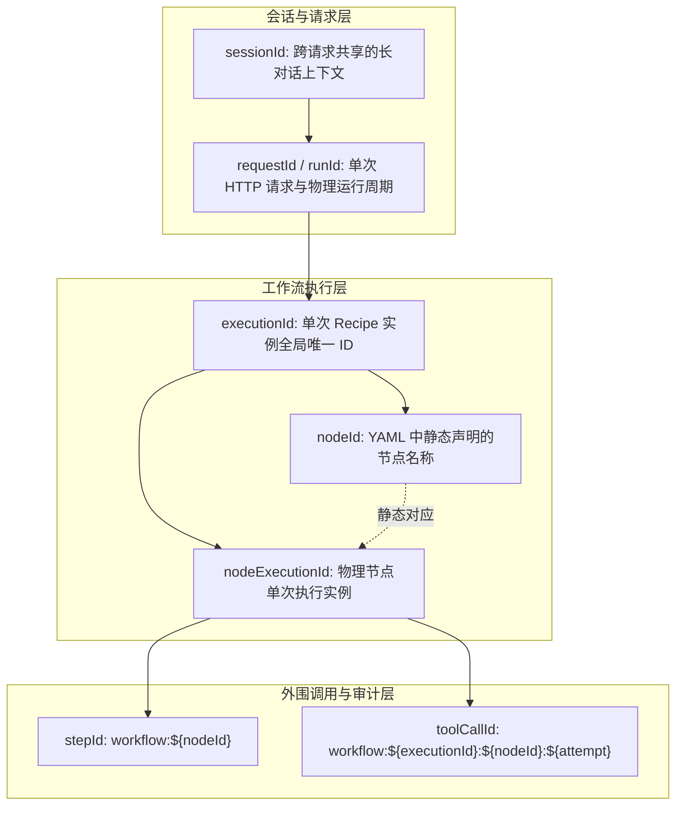
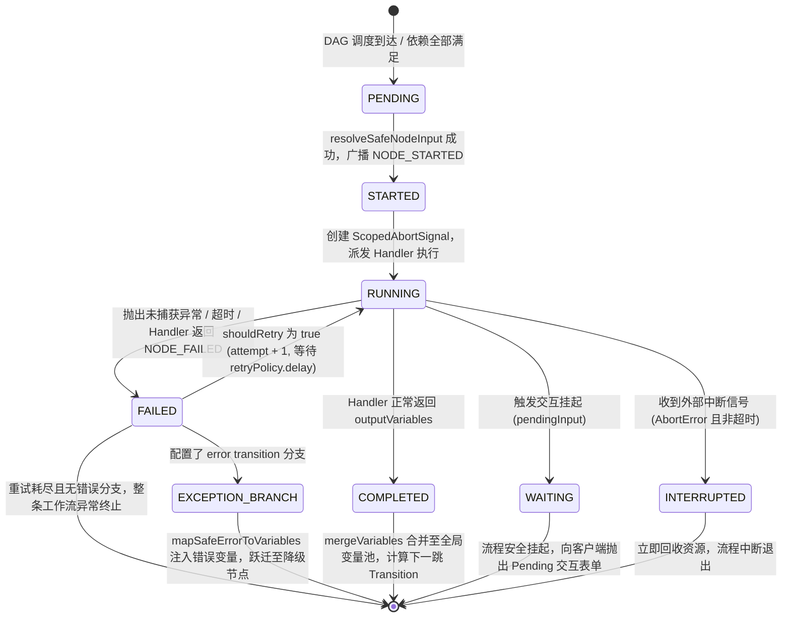
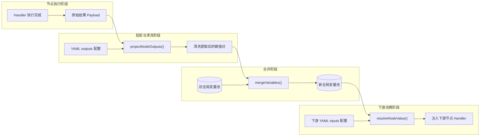
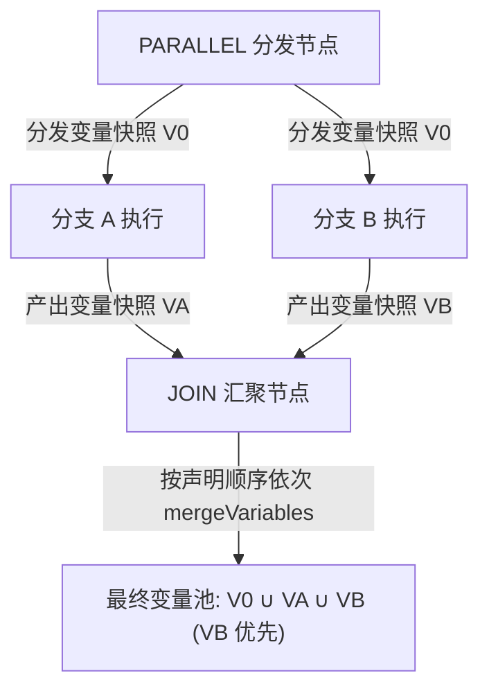
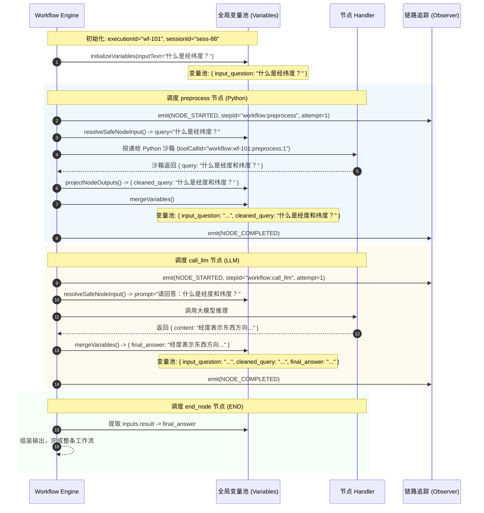

# AICOService Recipe 运行底座与数据流机制 Wiki

> **文档定位**：本 Wiki 专门解析 AICOService / NextAgent 工作流引擎的**底层中枢逻辑与数据流转基础设施**。它涵盖**全层级标识与追踪体系**、**节点生命周期状态机**、**全局上下文变量池（Variable Pool）**以及**复杂控制流下的数据合并与冲突裁决机制**。
>
> 💡 **协同阅读指南**：
> * **本 Wiki（运行底座与数据流机制）**：聚焦于工作流的**“中枢神经与数据血液”**——回答“引擎如何识别一次执行”、“节点状态如何迁移”、“变量如何流转与解析”。
> * **[AICOService_Recipe节点调用与执行机制Wiki.md](file:///Users/zhangfan/project/aico_timedelay_report/AICOService_Recipe%E8%8A%82%E7%82%B9%E8%B0%83%E7%94%A8%E4%B8%8E%E6%89%A7%E8%A1%8C%E6%9C%BA%E5%88%B6Wiki.md)**：聚焦于工作流的**“具体物理器官与外设调用”**——回答“各个具体节点（Python 沙箱、RESTful、LLM、网关等）是如何具体执行的”。

---

## 目录

- [一、 全层级标识与链路追踪体系（Telemetry & Identity Hierarchy）](#一-全层级标识与链路追踪体系telemetry--identity-hierarchy)
  - [1.1 为什么需要分层标识？](#11-为什么需要分层标识)
  - [1.2 核心标识全貌对照表](#12-核心标识全貌对照表)
  - [1.3 标识在跨组件与物理边界的流动（Context 穿透）](#13-标识在跨组件与物理边界的流动context-穿透)
- [二、 节点生命周期状态机与调度中枢（Lifecycle State Machine）](#二-节点生命周期状态机与调度中枢lifecycle-state-machine)
  - [2.1 引擎单步调度流程剖析（`executeNode` 核心主循环）](#21-引擎单步调度流程剖析executenode-核心主循环)
  - [2.2 节点状态机全景图](#22-节点状态机全景图)
  - [2.3 状态语义详解与迁移条件](#23-状态语义详解与迁移条件)
  - [2.4 智能容错、重试与因果链继承（`predecessorNodeExecutionIds`）](#24-智能容错重试与因果链继承predecessornodeexecutionids)
  - [2.5 节点级检查点持久化与中断控制（`AbortSignal` 级联）](#25-节点级检查点持久化与中断控制abortsignal-级联)
- [三、 全局上下文变量池与数据流管道（Variable Pipeline）](#三-全局上下文变量池与数据流管道variable-pipeline)
  - [3.1 变量池设计理念与生命周期](#31-变量池设计理念与生命周期)
  - [3.2 数据流动流水线（`projectNodeOutputs` -> `mergeVariables` -> `resolveNodeValue`）](#32-数据流动流水线projectnodeoutputs---mergevariables---resolvenodevalue)
  - [3.3 变量表达式取值与解析内核](#33-变量表达式取值与解析内核)
  - [3.4 敏感数据自动脱敏机制（Secrets Redaction）](#34-敏感数据自动脱敏机制secrets-redaction)
- [四、 复杂控制流中的数据合并与冲突裁决](#四-复杂控制流中的数据合并与冲突裁决)
  - [4.1 线性流动与顺序覆盖策略](#41-线性流动与顺序覆盖策略)
  - [4.2 条件分支的表达式求值机制（Condition Parsing）](#42-条件分支的表达式求值机制condition-parsing)
  - [4.3 并发分支（`FORK_JOIN`）的数据分叉与按序折叠（Sequential Folding）](#43-并发分支fork_join的数据分叉与按序折叠sequential-folding)
  - [4.4 循环迭代（`LOOP`）的状态累积与作用域隔离](#44-循环迭代loop的状态累积与作用域隔离)
- [五、 端到端实战串联追踪（End-to-End Trace Walkthrough）](#五-端到端实战串联追踪end-to-end-trace-walkthrough)
  - [5.1 典型 Recipe 业务场景设定](#51-典型-recipe-业务场景设定)
  - [5.2 全程追踪：标识生成、状态跳变与变量池演进](#52-全程追踪标识生成状态跳变与变量池演进)
- [六、 总结与开发避坑指南](#六-总结与开发避坑指南)

---

## 一、 全层级标识与链路追踪体系（Telemetry & Identity Hierarchy）

### 1.1 为什么需要分层标识？
在生产环境的智能体系统中，单次对话不仅涉及前端 HTTP 请求，还包含后台 Recipe 工作流执行、多次 LLM 调用、外部 HTTP API 交互、以及 Python 沙箱隔离执行。
如果仅用一个简单的 `trace_id`，在遇到**“循环节点多次执行”**、**“失败重试（Retry）”**、**“并发分支（Parallel）”**时，日志与审计中心将无法分辨哪条日志属于哪次重试、哪段代码属于哪次循环。

NextAgent 建立了**严格正交、从宏观到微观的分层标识体系**：



### 1.2 核心标识全貌对照表

| 标识字段 | 作用域与生命周期 | 典型取值示例 | 源码生成方式 / 规则 | 核心业务价值 |
|---|---|---|---|---|
| **`sessionId`** | 用户业务长会话 | `session-b357b3d1-419b-449e` | 上游网关/客户端传入 | 关联同一多轮对话历史上下文与跨请求记忆。 |
| **`requestId`** / **`runId`** | 单次 HTTP 请求 | `req-9850aa55-6c70-4bc3` | HTTP 入口中间件生成 | 标识一次物理网络请求的完整耗时与调用边界。 |
| **`executionId`** | 单次 Recipe 工作流实例 | `wf-4a1e9b2c-882d-41fe` | `WorkflowExecutionEngine.execute()` 时生成 | 绑定该次 Recipe 从 `START` 到 `END` 的完整生命周期与变量池。 |
| **`nodeId`** | 静态图节点 Key | `preprocess`, `call_exec_llm` | YAML 配置中直接声明 | 静态 DAG 拓扑路由的锚点。在循环中保持不变。 |
| **`nodeExecutionId`** | 动态节点单次执行实例 | `wfn-8f3a1d9c-11ef-42aa` | `this.createNodeExecutionId()` 动态生成 | **区分循环与重试的关键**。在 ReAct 循环中，同一个 `nodeId` 每次循环都会生成全新的 `nodeExecutionId`。*(注：脚手架节点 `START`/`END` 不分配)* |
| **`predecessorNodeExecutionIds`** | 因果依赖链（DAG 前驱） | `["wfn-8f3a...", "wfn-2c1b..."]` | 记录上一完成节点的 `nodeExecutionId` | 精准还原运行期的物理因果依赖拓扑（Causal Lineage），非静态连线。 |
| **`stepId`** | 跨系统抽象步骤 | `workflow:preprocess` | 格式：`workflow:${nodeId}` | 供外部追踪平台（如 APM/LangSmith）聚合展示宏观节点。 |
| **`toolCallId`** | 外部工具/沙箱审计粒度 | `workflow:wf-4a1:preprocess:1` | 格式：`workflow:${executionId}:${nodeId}:${attempt}` | **物理审计终极坐标**。精确指示该代码/请求由哪个实例、哪个节点、第几次重试产生。 |
| **`attempt`** | 单节点物理执行轮次 | `1`, `2`, `3` | 从 1 开始，每次 retry 递增 | 区分首次调用与重试调用的资源消耗与响应结果。 |

### 1.3 标识在跨组件与物理边界的流动（Context 穿透）

当 Recipe 节点调用外部资源时，引擎会将这些 ID 严密打包并下发。以调用**Python 沙箱节点**为例：

```typescript
// 引擎在 capability-nodes.js 中组装并穿透给 SandboxExecutionPort
const result = await options.sandboxExecution.runPython(
  {
    code: fullCode,
    timeoutMs: nodeTimeoutMs(context.node, 30_000),
    stdoutLimitBytes: 1_000_000,
    stderrLimitBytes: 1_000_000,
  },
  {
    identityContext: context.request.identityContext,
    agentId: context.request.agentId,
    sessionId: context.request.sessionId,
    requestId: context.request.requestId,
    runId: context.request.runId,
    stepId: `workflow:${context.nodeId}`,
    toolCallId: `workflow:${context.executionId}:${context.nodeId}:${context.attempt}`, // 审计穿透
    timeoutMs: nodeTimeoutMs(context.node, 30_000),
  },
  context.signal // 取消信号穿透
);
```

* **安全反查**：若外部沙箱探测到死循环、暴力内存申请或非法系统调用，安全网关能直接凭 `toolCallId` 锁定出事的准确 Agent、Recipe 实例与节点。
* **链路染色**：RESTful 网关将 `requestId` 与 `executionId` 放入 HTTP Header，实现端到端的分布式 Trace 串联。

---

## 二、 节点生命周期状态机与调度中枢（Lifecycle State Machine）

### 2.1 引擎单步调度流程剖析（`executeNode` 核心主循环）

在 NextAgent 源码中（`@nextagent/agent-workflow/src/engine/index.ts`），`executeNode` 负责单个节点的生命周期管控。其执行逻辑是一个**严密的防御式控制循环**：

```
1. 校验前驱依赖 (assertDependenciesSatisfied)
2. 动态分配物理标识 (createNodeExecutionId，脚手架节点除外)
3. 解析与脱敏节点输入 (resolveSafeNodeInput -> redactSecretsFromValue)
4. 广播开始事件 (emitWorkflowEvent('NODE_STARTED'))
5. 构建带超时的子取消信号 (createScopedAbortSignal)
6. 派发对应类型的 Handler 执行 (nodeCatalog.handlers[node.type])
7. 捕获输出 / 触发流式推送 (emitNodeOutputDelta)
8. 处理异常与重试 (shouldRetry 判定 -> 指数退避 -> attempt+1 循环)
9. 判决终态与分支跃迁 (normalizeTransition / resolveErrorTransition)
10. 持久化检查点 (saveNodeCheckpoint)
```

### 2.2 节点状态机全景图



### 2.3 状态语义详解与迁移条件

1. **`PENDING`（就绪）**：
   - 上游依赖节点均已执行完毕（`assertDependenciesSatisfied` 检查通过）。
   - 引擎正在为当前节点准备输入参数与环境变量。
2. **`STARTED`（已启动）**：
   - 输入参数解析完成，已通过 `createNodeExecutionId()` 分配了唯一的物理运行实例 ID（脚手架节点跳过）。
   - 广播 `NODE_STARTED` 事件，链路监控开始计时。
3. **`RUNNING`（执行中）**：
   - 对应的 Handler（如 Python 沙箱调用、LLM 流式调用、RESTful 请求等）正在执行。
   - 绑定专属的 `nodeSignal`，若超过节点配置的 `timeout`（秒），将触发超时熔断。
4. **`COMPLETED`（已完成）**：
   - 节点逻辑成功结束。
   - 节点的输出字段经由 `projectNodeOutputs` 提取，并调用 `mergeVariables` 合并入全局变量池。
5. **`NODE_WAITING`（挂起等待输入）**：
   - 常见于人机交互节点（如审批、追问、澄清确认）。
   - 节点返回 `pendingInput` 载荷，工作流执行安全暂停，向前端推送交互卡片，等待用户提交后 Resume。
6. **`FAILED`（执行失败）**：
   - 遇到物理异常（网络断开、沙箱崩溃、超时等）或 Handler 显式返回 soft failure。
   - 若命中重试策略则进入自愈循环；否则尝试进入错误降级分支（`resolveErrorTransition`）。
7. **`INTERRUPTED`（主动中断）**：
   - 客户端断开连接或用户主动点击“停止生成”。引擎级联取消子任务，安全释放底层资源。

### 2.4 智能容错、重试与因果链继承（`predecessorNodeExecutionIds`）

当节点发生错误时，引擎会执行重试判定：
```typescript
if (shouldRetry(error, attempt, retryPolicy, nodeSignal.didTimeout) && !isCapabilityFailure) {
  if (nodeExecutionId !== undefined) {
    attemptPredecessors = [nodeExecutionId]; // 关键：将前一次失败的实例作为重试实例的前驱
  }
  await delay((retryPolicy.delay ?? 0) * 1000, input.signal);
  continue; // 递增 attempt，重新发起物理调用
}
```

* **因果链保持（Lineage Continuity）**：每一次重试都生成全新的 `nodeExecutionId`，同时通过 `attemptPredecessors` 指向前一次失败的执行 ID。这使得在全链路追踪平台上，可以清晰看到一条完整的因果链：`Attempt 1 (Failed: 504 Timeout)` ──> `Attempt 2 (Success)`。
* **网关节点零重试**：`START`、`END`、`CONDITION`、`PARALLEL` 等网关节点强制 `maxRetries = 0`，避免无谓的控制流自旋。

### 2.5 节点级检查点持久化与中断控制（`AbortSignal` 级联）

每次节点成功执行后，引擎都会无缝执行检查点保存：
```typescript
if (input.skipCheckpoint !== true) {
  await this.saveNodeCheckpoint({
    executionId: input.executionId,
    request: input.request,
    recipe: input.recipe,
    nodeId: currentNodeId,
    node,
    variables, // 保存当前最新的全局变量快照
  });
}
```
* **断点恢复能力**：长流程在挂起（`WAITING`）或服务意外重启后，可凭 `executionId` 和 `resumeState` 直接从断点节点继续调度，无需重新执行耗时的前置节点。
* **级联取消**：利用 `createScopedAbortSignal`，父流程取消会瞬间传导到具体节点，并穿透给底层远程沙箱容器与 HTTP Client，防止后台僵尸进程消耗算力。

---

## 三、 全局上下文变量池与数据流管道（Variable Pipeline）

### 3.1 变量池设计理念与生命周期

在 Recipe 运行期，数据**不在节点之间进行点对点硬连线传递**，而是全部读写一个统一的内存黑板——**全局上下文变量池（Execution Variables Pool）**。

* **存储形态**：引擎内部为一个只读冻结的 `JsonObject`（`Object.freeze({...})`），保证纯函数式的状态不可变性（Immutability）。
* **生命周期**：
  1. **初始化**：在 `WorkflowExecutionEngine.execute()` 时创建，调用 `initializeVariables()` 将用户的请求参数与输入文本注入：
     ```typescript
     function initializeVariables(request: WorkflowExecutionRequest): JsonObject {
       return request.inputText === undefined || request.inputText.length === 0
         ? request.inputVariables
         : Object.freeze({ ...request.inputVariables, input_question: request.inputText });
     }
     ```
  2. **演进迭代**：随 DAG 路径推进，每个节点输出通过 `mergeVariables()` 生成新的变量池快照。
  3. **终态提取**：工作流执行至 `END` 节点时，从变量池中提取最终的 `outputVariables` 返回给业务层。

### 3.2 数据流动流水线（`projectNodeOutputs` -> `mergeVariables` -> `resolveNodeValue`）



#### 关键源码机制：
1. **输出投影（`projectNodeOutputs`）**：
   * 若 YAML 中**没有定义 `outputs`**，则默认将 Handler 返回的全部 bindings 直接透传。
   * 若 YAML **声明了 `outputs`**，引擎仅提取声明的字段，并执行表达式计算：
     ```yaml
     outputs:
       cleaned_query: ${python_result.query}
       top_score: ${search_result.hits[0].score}
     ```
2. **安全合并（`mergeVariables`）**：
   * 采用浅拷贝合并，新输出覆盖同名旧变量。
   * **控制层脱敏剥除**：强制剔除内部控制标识 `output_parser`，防止控制元数据污染业务变量池：
     ```typescript
     function mergeVariables(base: JsonObject, patch: JsonObject): JsonObject {
       const { output_parser: _stripped, ...rest } = patch;
       return Object.freeze({ ...base, ...rest });
     }
     ```

---

### 3.3 变量表达式取值与解析内核

NextAgent 在 `@nextagent/agent-workflow/src/nodes/shared.ts` 中实现了一套高性能变量解析器，其核心规则如下：

#### 1. 原生类型保持（Type Preserving）vs 混合字符串插值
这是 Recipe 开发者最容易产生困惑的关键特性：

```typescript
export function interpolateString(template: string, scope: JsonObject): unknown {
  // 规则 1：精确全匹配表达式（如 "${api_response}"）
  const exact = /^\$\{([^}]+)\}$/u.exec(template.trim());
  if (exact !== null) {
    return resolveVariablePath(scope, exact[1]!.trim()); // 原生返回 Object/Array/Number/Boolean
  }
  // 规则 2：混合内联字符串（如 "Bearer ${token}" 或 "Query: ${q}, Limit: ${n}"）
  return template.replace(/\$\{([^}]+)\}/gu, (_, rawPath: string) => {
    const resolved = resolveVariablePath(scope, rawPath.trim());
    return resolved === undefined ? '' : stringifyScalar(resolved); // 标量转换为字符串拼接
  });
}
```

* **单变量原生引用 `${variable}`**：
  若模板为纯 `${search_result}`，解析后直接保留原始数据类型（`object` 或 `array`），**绝不会将其序列化为 `"[object Object]"` 字符串**。
* **混合内联插值 `Prefix ${variable} Suffix`**：
  若模板包含额外文本（如 `Bearer ${token}`），则强制触发标量转换拼接；若引用的变量不存在（`undefined`），引擎安全替换为空字符串 `""`，避免报空指针异常。

#### 2. 全能路径分词器（`parsePathSegments`）
引擎能无缝兼容点操作符、数组下标与字典下标语法：
```typescript
function parsePathSegments(path: string): Array<string | number> {
  // 将 [0] 转换为 .0，将 ['key'] 转换为 .key
  const normalized = path.replace(/\[(\d+)\]/gu, '.$1').replace(/\[['"]([^'"]+)['"]\]/gu, '.$1');
  return normalized
    .split('.')
    .filter((segment) => segment.length > 0)
    .map((segment) => (/^\d+$/u.test(segment) ? Number(segment) : segment));
}
```

**支持的常用取值范式对照表**：
| 表达式语法 | 内部解析路径 | 取值含义 |
|---|---|---|
| `${input_question}` | `["input_question"]` | 获取根节点标量 |
| `${python_result.plan.step}` | `["python_result", "plan", "step"]` | 多层级对象属性寻址 |
| `${recall_list[0]}` | `["recall_list", 0]` | 数组第 0 位元素（保持原类型） |
| `${api_res.data.items[0].id}` | `["api_res", "data", "items", 0, "id"]` | 深度混合对象数组寻址 |
| `${filters['dimension']}` | `["filters", "dimension"]` | 字典中括号语法 |

---

### 3.4 敏感数据自动脱敏机制（Secrets Redaction）

在节点准备输入时，引擎调用 `resolveSafeNodeInput()`：
1. 解析出完整的输入变量字典。
2. 扫描并替换其中的 Secret 引用（如 `${secrets.API_KEY}`）。
3. **日志与事件广播脱敏**：调用 `redactSecretsFromValue`，将真实的密码替换为 `***REDACTED***` 后，才广播 `NODE_STARTED` 事件和打印 Debug 日志，确保机密信息绝不会泄露至 APM 或日志系统。

---

## 四、 复杂控制流中的数据合并与冲突裁决

在包含分支判断、并发执行或循环迭代的高级 Recipe 中，变量池的状态迁移遵循严谨的裁决算法。

### 4.1 线性流动与顺序覆盖策略
对于普通的单链工作流（`A -> B -> C`）：
* 变量池单调递增累积：`Pool_C = Pool_Base ∪ Out_A ∪ Out_B`。
* 若下游节点产生了与上游同名的变量键，**下游覆盖上游**。

### 4.2 条件分支的表达式求值机制（Condition Parsing）

在 `CONDITION`（网关）或节点连线（`next`）上的 `condition: "${score > 0.8 && status == 'SUCCESS'}"`，由底层的词法分析器 `tokenizeCondition` 与语法树求值器驱动：
* 剔除外层 `${...}` 包装后，提取 `identifier`、`string`、`number`、`boolean`、`null` 与运算符。
* 支持的关系与逻辑运算符：`==`, `!=`, `<`, `<=`, `>`, `>=`, `&&`, `||`, `()`。
* **空值安全保护**：若表达式中引用的变量在当前变量池中未定义，求值为 `undefined`，参与逻辑比较时不会崩溃，而是按非真值处理。

### 4.3 并发分支（`FORK_JOIN`）的数据分叉与按序折叠（Sequential Folding）

当工作流触发并发网关（`PARALLEL`）并发执行多条分支（如并行调用搜索与知识库）时：



#### 核心源码逻辑（`executeConcurrentForkJoin`）：
1. **快照隔离并发**：各分支同时启动，均以 fork 时刻的 `variables` 快照作为初始输入，彼此内存隔离，互不干扰。
2. **顺序折叠合并（Sequential Folding）**：
   ```typescript
   let mergedVariables = input.variables;
   for (const result of branchResults) {
     if (result !== null) {
       mergedVariables = mergeVariables(mergedVariables, result.variables);
     }
   }
   ```
   * **冲突裁决规则**：若分支 A 与分支 B **修改了同一个变量名**，引擎按照 **YAML 中分支声明的物理前后顺序** 依次执行 `mergeVariables`。**排在后面的分支输出将最终覆盖先声明分支的值**。
3. **容错与汇聚控制 (`join_on_failure`)**：
   * `break`：任一并发分支失败，立即通过 `branchController.abort()` 中断其余分支，整体判负。
   * `wait`：容忍部分失败；只要有至少一个分支成功到达 Join 节点，汇聚即为成功。

### 4.4 循环迭代（`LOOP`）的状态累积与作用域隔离

在 ReAct 或批处理循环场景中：
* **跨轮次状态累积**：变量池在每次迭代完成时回写主上下文。上一轮输出的 `thought` 或 `observation` 会在下一轮直接作为输入可见。
* **物理实例隔离**：同一静态节点 `nodeId: "call_llm"` 在第 1 轮循环中生成的 ID 为 `wfn-001`，第 2 轮为 `wfn-002`，确保每一次迭代的 Trace 日志和指标完全独立。

---

## 五、 端到端实战串联追踪（End-to-End Trace Walkthrough）

为了直观展现**标识体系**、**状态机**与**变量池**在真实 Recipe 中的协同过程，我们追踪一个典型智能体对话任务：

### 5.1 典型 Recipe 结构
```yaml
flowGraph:
  nodes:
    start_node:
      type: START
      next: { preprocess: {} }
    preprocess:
      type: python
      inputs: { query: "${input_question}" }
      outputs: { cleaned_query: "${python_result.query}" }
      next: { call_llm: {} }
    call_llm:
      type: llm
      inputs: { prompt: "请回答：${cleaned_query}" }
      outputs: { final_answer: "${llm_result.content}" }
      next: { end_node: {} }
    end_node:
      type: END
      inputs: { result: "${final_answer}" }
```

### 5.2 全程追踪：标识生成、状态跳变与变量池演进



---

## 六、 总结与开发避坑指南

| 场景 / 痛点 | 底层设计机制 | 开发者黄金准则 / 避坑建议 |
|---|---|---|
| **提取复杂对象字段** | `resolveNodeValue` 精确全匹配 `${xxx}` 保持原生类型 | 提取对象/数组时，**切勿写成外加引号的混合字符串**（如 `"${data}"` 是原生对象，`"Result: ${data}"` 会被强转为字符串）。 |
| **重试日志难以排查** | `nodeExecutionId` 每次重试重新生成，前驱指向旧实例 | 在日志分析中，请以 `toolCallId` 或 `nodeExecutionId` 为聚合主键，不要仅看静态的 `nodeId`。 |
| **并发分支变量覆盖** | 并发分支执行完毕后，按 YAML 声明顺序依次执行 `mergeVariables` | 并发分支中**严禁不同分支向同名变量写入不同语义的数据**；建议各分支使用独立前缀（如 `branchA_res`、`branchB_res`），在 Join 节点后再统一加工。 |
| **敏感凭据泄露** | `resolveSafeNodeInput` 结合 `redactSecretsFromValue` 脱敏 | 凡是涉密凭据，务必通过 `${secrets.KEY}` 引用，引擎会自动在事件与控制台日志中打上掩码。 |
| **长时间运行任务取消** | `createScopedAbortSignal` 级联监听与穿透 | 编写自定义扩展节点或调用外部长链路时，务必将 `context.signal` 传递给底层请求客户端，避免产生后台孤儿进程。 |

---

> 📖 **进一步阅读**：
> 欲了解 Python 沙箱、RESTful 节点、LLM 节点以及各类控制流网关的具体配置与执行实现，请参阅：
> **[AICOService_Recipe节点调用与执行机制Wiki.md](file:///Users/zhangfan/project/aico_timedelay_report/AICOService_Recipe%E8%8A%82%E7%82%B9%E8%B0%83%E7%94%A8%E4%B8%8E%E6%89%A7%E8%A1%8C%E6%9C%BA%E5%88%B6Wiki.md)**
