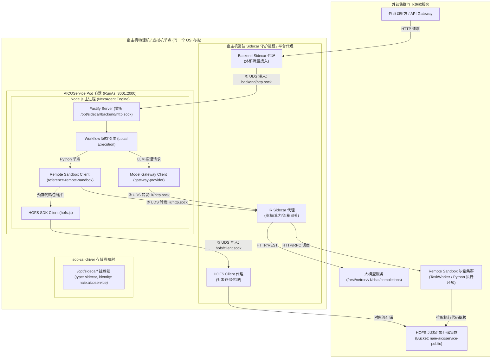

# AICOService UDS 通信、Sidecar 架构与部署落地全景 Wiki

> **文档版本**：v1.0  
> **更新时间**：2026-09-08  
> **适用对象**：AICOService / NextAgent 研发、运维及架构人员  
> **涉及核心技术**：Unix Domain Socket (UDS)、Sidecar 架构模式、华为 CloudSOP / `sop-csi-driver`、IR 算力网关、Remote Sandbox、HOFS 对象存储

---

## 目录

1. [架构全景与拓扑总览](#1-架构全景与拓扑总览)
2. [底层通信基石：Unix Domain Socket (UDS)](#2-底层通信基石unix-domain-socket-uds)
   - 2.1 什么是 UDS 与为什么不用 TCP Loopback
   - 2.2 UDS 通信的绝对物理边界：同操作系统内核
   - 2.3 UDS 与传统管道（Pipe/FIFO）的本质区别
3. [架构设计模式：Sidecar 的角色与物理形态](#3-架构设计模式sidecar-的角色与物理形态)
   - 3.1 逻辑定位：业务与“外部世界”的法定分界线
   - 3.2 两种物理落地形态对比（Pod 容器 vs 宿主机 Daemon）
   - 3.3 为什么华为 CloudSOP 采用“宿主机常驻 + 目录穿透”
4. [物理编排与部署落地（以 Deployment 为例）](#4-物理编排与部署落地以-deployment-为例)
   - 4.1 CSI 驱动挂载机制（`sop-csi-driver` 核心参数解析）
   - 4.2 容器环境变量与路径映射
   - 4.3 启动脚本中的权限初始化（`start.sh`）
5. [AICOService 三大 Sidecar Socket 深度剖析](#5-aicoservice-三大-sidecar-socket-深度剖析)
   - 5.1 入口网关专线：`backend/http.sock`
   - 5.2 算力与推理专线：`ir/http.sock`
   - 5.3 大文件存储专线：`hofs/client.sock`
6. [端到端业务场景串联](#6-端到端业务场景串联)
   - 场景 A：外部用户请求接入与调度
   - 场景 B：Python 脚本远程沙箱（Remote Sandbox）安全调度
   - 场景 C：大模型推理（Model Gateway）调用
   - 场景 D：大文件产物外置存储与受控代理下载
7. [常见运维排查与故障处理手册](#7-常见运维排查与故障处理手册)

---

## 1. 架构全景与拓扑总览

在 `AICOService` 系统中，主业务容器（Node.js / Fastify）专注于业务编排与 Agent 工作流状态管理，所有涉及网络出入、外部算力、代码沙箱执行、非结构化文件存取的操作，均由 **Sidecar 架构** 接管。

业务容器与 Sidecar 之间不依赖 TCP 网络端口，而是全部通过挂载的共享卷 `/opt/sidecar/`，利用 **Unix Domain Socket (UDS)** 建立微秒级低延迟的内存直通通道。



---

## 2. 底层通信基石：Unix Domain Socket (UDS)

### 2.1 什么是 UDS 与为什么不用 TCP Loopback
**Unix Domain Socket (UDS)** 是 POSIX 操作系统提供的原生进程间通信（IPC）机制。

虽然在编程体验上与网络 Socket（如 `http://127.0.0.1:8080`）高度相似（均使用 `socket`、`bind`、`listen`、`accept`、`connect` 等标准 API），但在底层传输机制上有本质区别：

| 维度 | 本地网络回环 (`127.0.0.1:port`) | Unix Domain Socket (`.sock`) |
| :--- | :--- | :--- |
| **底层路径** | 经由完整 TCP/IP 协议栈：IP 封装、分包、计算 TCP Checksum、ACK 确认应答、Window 滑动窗口、Loopback 虚拟网卡 | **绕过整个网络协议栈**：系统调用进入内核，内核直接通过内存缓冲区进行进程间数据拷贝 |
| **通信延迟** | 毫秒级 / 亚毫秒级（受协议栈处理与系统负载影响） | **微秒级（μs）**，纯内存拷贝开销 |
| **CPU 消耗** | 较高（协议封包、解包、软中断处理） | **极低**（仅触发内核上下文切换与内存拷贝） |
| **寻址体系** | IP 地址 + 端口号（例如 `127.0.0.1:3000`） | **文件系统路径**（例如 `/opt/sidecar/ir/http.sock`） |
| **端口管理** | 易产生端口抢占冲突（Port Conflict）与端口耗尽 | 只要文件路径不同即可共存，无需分配或管理端口 |
| **安全控制** | 防火墙规则、IPTables、应用层 Token | **原生集成 Linux 文件权限体系（chmod/chown/POSIX ACL）** |

### 2.2 UDS 通信的绝对物理边界：同操作系统内核
UDS 通信的核心前提是：**通信双方必须运行在同一个操作系统内核（OS Kernel）下**。
* **支持场景**：
  1. 同一台物理宿主机上的不同普通进程；
  2. 同一台主机/虚拟机上、共享同一宿主机内核的**不同容器**（如同一 Pod 内的容器，或通过 Bind Mount 挂载同一宿主机目录的不同容器）。
* **不支持场景**：
  1. 跨物理服务器通信；
  2. 同一台物理服务器上的**两台不同虚拟机（VM）**之间（两台 VM 各自拥有独立的内核与虚拟内存空间，无法走 UDS，必须走虚拟网卡网络通信或专用的 `vsock`）。

### 2.3 UDS 与传统管道（Pipe/FIFO）的本质区别
UDS 经常被比作“高级管道”，但相比 Linux 传统管道（匿名管道 `pipe`、命名管道 `FIFO`），UDS 具有四大压倒性的工程优势：
1. **全双工双向通信**：管道天生是单向（半双工）的，双向对话需创建两条管道；UDS 建立后天然支持双向并发读写。
2. **支持完整的 C/S 并发模型**：命名管道通常只能一对一通信；UDS 支持标准的 `listen()` 与 `accept()`，一个服务端可同时接入成百上千个独立的并发客户端连接，并为每个客户端分配专有通道。
3. **无缝复用成熟网络协议栈（HTTP / gRPC over UDS）**：
   应用层现有的 HTTP Client（如 Axios、cURL、Go `http.Client`）可零改动直接将 Target 改为 `unix:///path/to.sock`。**既拥有标准 HTTP 的报文规范与框架生态，又享受管道级的极致内存性能**。
4. **支持传递文件描述符（FD Passing）**：
   UDS 可通过 `sendmsg` 的 `SCM_RIGHTS` 辅助数据在进程间零拷贝传递已打开的文件句柄、Socket 连接等。

---

## 3. 架构设计模式：Sidecar 的角色与物理形态

### 3.1 逻辑定位：业务与“外部世界”的法定分界线
在 `AICOService` 体系中，微服务遵循严格的“单一职责”原则：
* **业务容器**：负责大模型 Prompt 拼装、Workflow 算子图执行、意图解析等核心业务。
* **Sidecar 代理**：接管鉴权凭证刷新、租户打标（`X-Hofs-Projectid`）、沙箱任务调度、大文件上传流控、网络重试熔断等底层机制。
* **分界线**：**Sidecar Socket** 就是这道边界。业务代码只要将请求推入 Socket，即完成了对外部世界的受控调用。

### 3.2 两种物理落地形态对比
在 Kubernetes 体系中，Sidecar 模式存在两种主流落地形式：

| 模式 | 形态 A：Pod 内双容器（Classic Sidecar） | 形态 B：宿主机守护进程 + CSI 挂载（Node-level Sidecar） |
| :--- | :--- | :--- |
| **物理拓扑** | 每个 Pod 内声明 2 个容器（业务容器 + Sidecar 容器） | 宿主机节点常驻 1 个 Sidecar 进程/DaemonSet，通过 CSI 卷穿透挂载进各 Pod |
| **资源消耗** | 随 Pod 数量线性膨胀（$O(N)$），浪费大量 CPU 与基础内存 | 全节点共享单例进程（$O(1)$），极度节省资源 |
| **升级运维** | Sidecar 更新需重启并重新发布所有业务 Pod | 平台侧独立热升级宿主机 Daemon，业务容器完全无感、免重启 |
| **通信机制** | Pod 内 `emptyDir` 共享卷中的 UDS 文件 | CSI 驱动 Bind Mount 挂载的宿主机 UDS 文件 |
| **适用场景** | 公有云标准 K8s、轻量小规模部署 | **电信级私有云、大型 PaaS 平台（如华为 CloudSOP）** |

### 3.3 为什么华为 CloudSOP 采用“宿主机常驻 + 目录穿透”
在华为电信云场景中，单台高性能服务器通常运行几十上百个微服务 Pod：
1. **防止资源雪崩**：避免上百个 Pod 各自运行重复的 Python/Java/Go Sidecar 进程。
2. **统一平台管控**：将 HOFS 存储连接池、IR 策略判定点（PDP）、模型网关鉴权集中管理，避免各微服务各自为战。
3. **极致性能**：业务容器通过 CSI 目录直通宿主机 Sidecar，全链路保持 UDS 内存级零损耗。

---

## 4. 物理编排与部署落地（以 Deployment 为例）

### 4.1 CSI 驱动挂载机制（`sop-csi-driver`）
查看生产配置文件 [`deployment.yaml`](file:///Users/zhangfan/project/aico_timedelay_report/aico_struct_code/aicoservice_import/deployment.yaml#L359-L364)：

```yaml
volumes:
  - csi:
      driver: sop-csi-driver
      volumeAttributes:
        identity: naie.aicoservice
        type: sidecar
    name: sidecar
```

* **`driver: sop-csi-driver`**：声明使用华为自研的 CloudSOP 容器存储接口插件。
* **`type: sidecar`**：通知驱动此卷并非分配普通块存储或网络 NAS，而是执行**“Sidecar 管道挂载操作”**，将宿主机上的 Sidecar 守护进程 Socket 目录投影绑定到容器。
* **`identity: naie.aicoservice`**：传递当前微服务的身份标识。
  1. 驱动据此自动为挂载目录配置对应属主（UID: `3001`，GID: `2000`），避免容器无权限访问；
  2. 宿主机 Sidecar 可据此识别请求来源，进行配额统计、租户隔离与安全审计。

### 4.2 容器环境变量与路径映射
在 [`deployment.yaml`](file:///Users/zhangfan/project/aico_timedelay_report/aico_struct_code/aicoservice_import/deployment.yaml#L76-L177) 中，容器挂载点与环境变量紧密绑定：

```yaml
volumeMounts:
  - mountPath: /opt/sidecar/
    name: sidecar

env:
  - name: SIDECAR_ROOT
    value: /opt/sidecar
  - name: UDS_ADDRESS
    value: /opt/sidecar/backend/http.sock       # 入口监听地址
  - name: SIDECAR_SOCKET
    value: /opt/sidecar/ir/http.sock            # 出口能力调用地址
  - name: MODEL_GATEWAY_SOCKET_PATH
    value: /opt/sidecar/ir/http.sock            # 模型推理调用地址
  - name: SANDBOX_MODE
    value: remote                               # 声明沙箱为远程模式
```

### 4.3 启动脚本中的权限初始化
在主程序运行前，入口脚本 [`bin/start.sh`](file:///Users/zhangfan/project/aico_timedelay_report/aico_struct_code/aicoservice_import/bin/start.sh#L37-L38) 确保挂载目录满足安全权限基线：

```bash
# 创建入口 backend 目录并调整权限
mkdir -p /opt/sidecar/backend
chown -R 3001:2000 /opt/sidecar/
```

---

## 5. AICOService 三大 Sidecar Socket 深度剖析

容器内部挂载的 `/opt/sidecar/` 目录组织了三条职责明确的专用 UDS 通信专线：

```text
/opt/sidecar/
├── backend/
│   └── http.sock        # 【入口专线】接收外部/上游 HTTP 请求
├── ir/
│   └── http.sock        # 【算力专线】发起 Model 推理、Remote Sandbox 调度与 PDP 鉴权
└── hofs/
    └── client.sock      # 【存储专线】读写 HOFS 对象存储的大文件与附件
```

### 5.1 入口网关专线：`backend/http.sock`
* **角色**：**Inbound（流入）**
* **监听方**：AICOService 主容器进程（基于 Fastify 框架创建的 HTTP Server）。
* **客户端**：集群接入网关或 Backend Sidecar 代理。
* **机制**：外部上游发来的 A2A-T 协议请求，先打到网关代理，网关代理通过本地 UDS 直连将请求注入 Node.js 进程。
* **优势**：容器无需对宿主机开放对外的 HTTP 监听端口，完全在主机内部闭环，杜绝了容器端口被非授权扫描的风险。

### 5.2 算力与推理专线：`ir/http.sock`
* **角色**：**Outbound（流出）**
* **监听方**：宿主机 IR Sidecar 守护进程。
* **客户端**：AICOService 内部的各类网关适配器。
* **主要承载能力**：
  1. **大模型推理（Model Gateway）**：向 `POST /rest/netrsn/v1/chat/completions` 发送请求，Sidecar 负责补齐认证、路由到实际 LLM 集群并流式返回 Token。
  2. **代码沙箱执行（Remote Sandbox）**：向 `POST /rest/sandbox/v1/jobs` 发起任务执行指令。
  3. **权限决策判定（PDP Client）**：请求权限引擎校验当前操作是否合规。

### 5.3 大文件存储专线：`hofs/client.sock`
* **角色**：**Outbound（流出）**
* **监听方**：宿主机 HOFS Sidecar 客户端进程。
* **客户端**：`@nextagent/agent-channel-aico` 中的 `hofs.js` 模块。
* **主要承载能力**：
  * 基于 RESTful HTTP over UDS 进行对象操作（`PUT`、`GET`、`DELETE`、`HEAD`）。
  * 自动携带 `X-Hofs-Projectid` 租户请求头，对接华为内部分布式对象文件存储。

---

## 6. 端到端业务场景串联

### 场景 A：外部用户请求接入与调度
1. 用户在前端或上游发起任务请求；
2. 接入网关解包后，通过 UDS 将请求写入 `/opt/sidecar/backend/http.sock`；
3. Fastify 触发路由分发，将任务送入 `Workflow Engine`；
4. 引擎根据 Recipe 定义，解析节点算子图并分配变量池。

### 场景 B：Python 脚本远程沙箱（Remote Sandbox）安全调度
* **设计意图**：不可信的 Python 脚本严禁在 Node.js 主进程直接使用 `child_process` 运行，必须隔离外置。
* **两阶段调用链**：
  ```text
  [AICOService 进程]
          │
          │ 1. 上传工作区依赖文件 (通过 UDS /opt/sidecar/hofs/client.sock)
          ▼
  [HOFS 远端存储] (保存文件至 naie-aicoservice-public)
          │
          │ 2. 发起作业 (通过 UDS /opt/sidecar/ir/http.sock, 带上 hofs:// 坐标)
          ▼
  [IR Sidecar 代理]
          │ 跨网络调度
          ▼
  [Remote Sandbox 容器] (拉取 HOFS 文件 -> 执行 Python -> 捕获 stdout/stderr -> 返回结果)
  ```

### 场景 C：大模型推理（Model Gateway）调用
1. Agent 决定调用大模型决策；
2. `gateway-provider.js` 构造符合 OpenAI / 华为微调格式的请求 Payload；
3. 请求通过 `/opt/sidecar/ir/http.sock` 派发给 IR 代理；
4. IR 代理维护真实的上游模型连接，将结果以 Server-Sent Events (SSE) 流式推回主进程。

### 场景 D：大文件产物外置存储与受控代理下载
1. 沙箱执行产出几百 KB 或数 MB 的分析表格（`.xlsx`）；
2. 沙箱通过 HOFS 接口将文件写入对象存储，并在退出时将文件 Object Name（如 `aicoservice/answer/{sessionId}/result.xlsx`）作为结构化事件输出；
3. 模型只在事件流中传递轻量级 Object Name，前端渲染专有的文件卡片；
4. 用户点击下载时，触发 `GET /api/v1/sessions/:sessionId/files/download?path=...`，后端鉴权后通过 `BlobStoreGateway` 从 HOFS 拉取流式回传，避免将真实存储暴露在公网。

---

## 7. 常见运维排查与故障处理手册

### 7.1 `pub.hofs_sync_failed` / `HttpError: 403`
* **现象**：业务日志频繁打印 `pub.hofs_sync_failed`，状态码 `403`。
* **排查方向**：
  1. 检查环境变量 `NAMESPACE` 是否正确设置为当前所属工程（如 `sop`）；
  2. 检查请求头是否正确注入 `X-Hofs-Projectid`；
  3. 确认目标 Bucket（如 `naie-aicoservice-public`）是否在 HOFS 后台对当前服务租户开通读写授权。

### 7.2 Socket 缺失 / `ENOENT` / `ECONNREFUSED`
* **现象**：服务启动时抛出 `connect ENOENT /opt/sidecar/ir/http.sock`。
* **排查方向**：
  1. **检查 CSI 卷状态**：执行 `kubectl describe pod <pod-name>`，确认 `sop-csi-driver` 的 Volume 是否成功挂载；
  2. **检查宿主机 Sidecar 状态**：确认宿主机节点上的 IR Sidecar 守护进程是否存活并正常监听；
  3. **时序竞争问题**：若业务容器启动速度快于宿主机 Socket 文件的创建，在启动脚本中增加对 Socket 存在的探活重试（Wait-for-Socket 循环）。

### 7.3 文件访问权限拒绝 / `EACCES`
* **现象**：Node.js 报错 `EACCES: permission denied, open '/opt/sidecar/backend/http.sock'`。
* **排查方向**：
  1. 检查 Pod 的 `securityContext`：确认当前运行用户（UID: `3001`，GID: `2000`）；
  2. 检查 `start.sh` 是否成功执行 `chown -R 3001:2000 /opt/sidecar/`；
  3. 确认 CSI 驱动传递的 `identity: naie.aicoservice` 是否匹配当前部署环境的用户组策略。

---

*(本文档由自动化架构解析与生产部署配置分析综合归纳生成，旨在沉淀 AICOService 通信与部署标准架构规范)*
