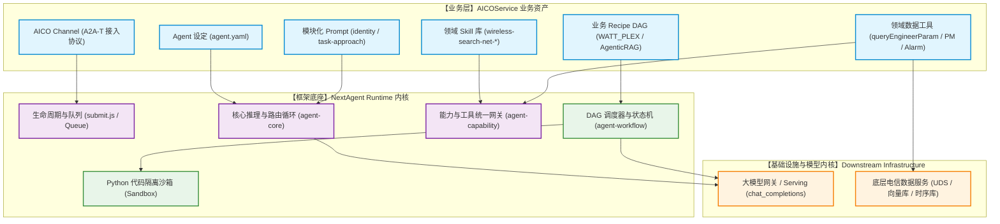
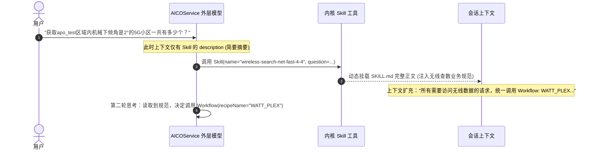
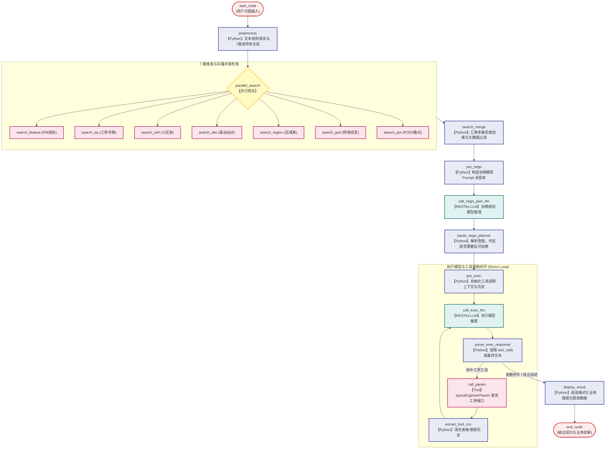
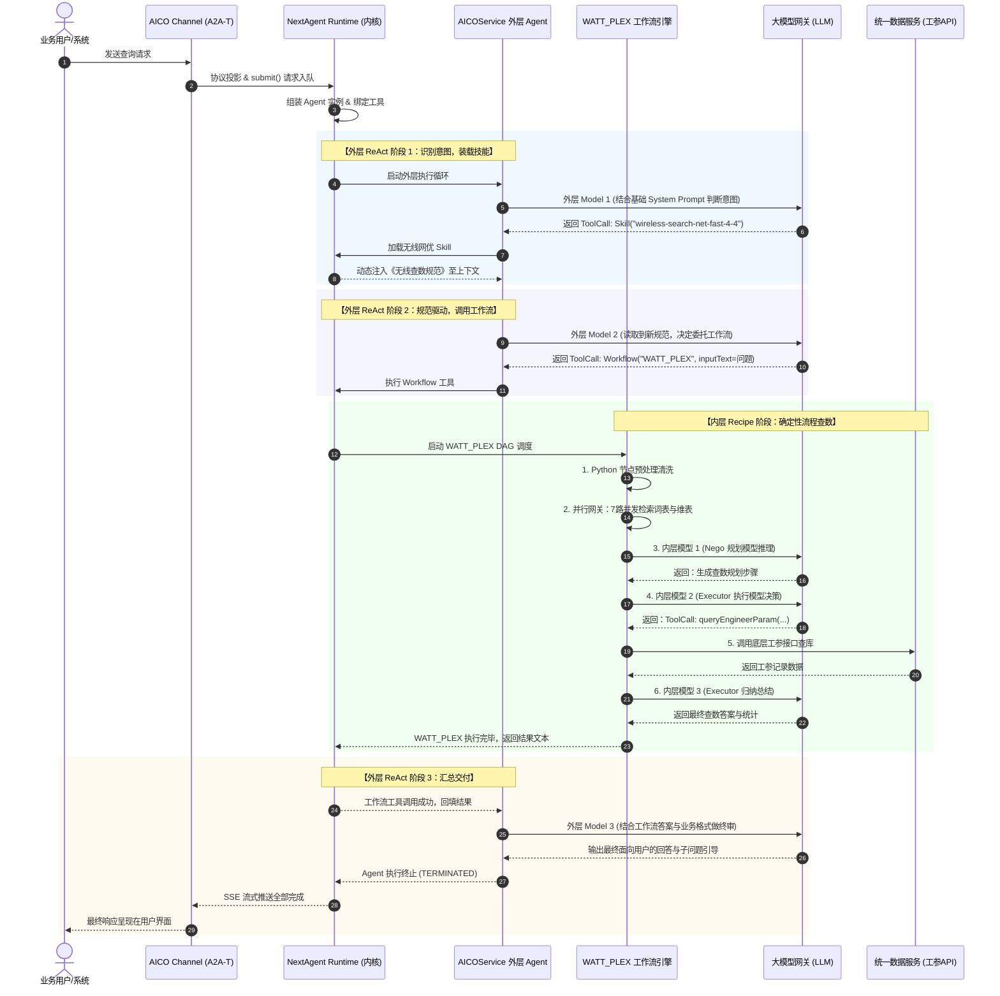
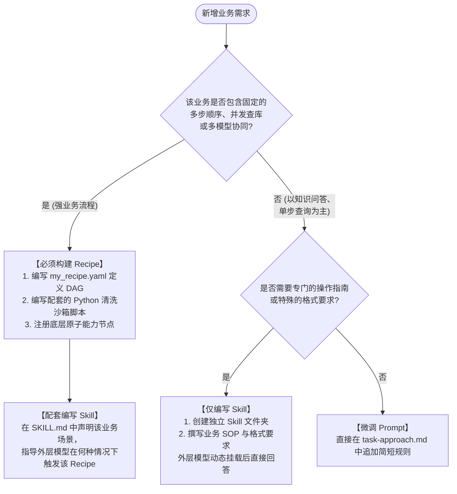

# AICOService 业务运行框架与调用逻辑深度解析

> **版本**：v1.0.0  
> **面向对象**：AICOService 业务开发人员、架构师、性能调优与运维工程师  
> **核心案例**：无线网优智能查数业务（`wireless-search-net-fast-4-4` Skill + `WATT_PLEX` Recipe）

---

## 目录

- [一、 业务全景与“业务四件套”架构](#一-业务全景与业务四件套架构)
  - [1.1 业务背景与问题定位](#11-业务背景与问题定位)
  - [1.2 核心业务资产：业务四件套模型](#12-核心业务资产业务四件套模型)
  - [1.3 业务资产与 NextAgent 运行底座的分层关系](#13-业务资产与-nextagent-运行底座的分层关系)
- [二、 Prompt 业务心智与动态组装机制](#二-prompt-业务心智与动态组装机制)
  - [2.1 模块化拼装骨架（template.yaml）](#21-模块化拼装骨架templateyaml)
  - [2.2 核心规则切片：任务工作法与安全规约](#22-核心规则切片任务工作法与安全规约)
  - [2.3 动态上下文与环境变量注入](#23-动态上下文与环境变量注入)
  - [2.4 业务技能的“按需即插即用”（Dynamic Skill Loading）](#24-业务技能的按需即插即用dynamic-skill-loading)
- [三、 Recipe 确定性流水线与节点流转深度拆解](#三-recipe-确定性流水线与节点流转深度拆解)
  - [3.1 为什么复杂业务必须走向 Recipe（Prompt vs 确定性 DAG）](#31-为什么复杂业务必须走向-recipeprompt-vs-确定性-dag)
  - [3.2 WATT_PLEX 完整业务拓扑与数据流向](#32-watt_plex-完整业务拓扑与数据流向)
  - [3.3 关键节点调用机制与真实配置切片](#33-关键节点调用机制与真实配置切片)
    - [【预处理】Python 节点：业务清洗与检索体生成](#预处理python-节点业务清洗与检索体生成)
    - [【并发网关】Parallel Gateway：多路维表并发扫库](#并发网关parallel-gateway多路维表并发扫库)
    - [【方案规划】协商规划模型节点（Nego LLM）](#方案规划协商规划模型节点nego-llm)
    - [【落地执行】执行模型（Executor LLM）与循环自愈](#落地执行执行模型executor-llm与循环自愈)
    - [【底层查询】call_param 映射 queryEngineerParam](#底层查询call_param-映射-queryengineerparam)
  - [3.4 跨节点的数据流转管道（Context Variable Pipeline）](#34-跨节点的数据流转管道context-variable-pipeline)
- [四、 NextAgent 底座运行内核的支撑视角](#四-nextagent-底座运行内核的支撑视角)
  - [4.1 请求准入与排队：A2A-T 与 runtime.submit()](#41-请求准入与排队a2a-t-与-runtimesubmit)
  - [4.2 双层编排机制（Two-Tier Orchestration）：“Workflow 也是一种 Tool”](#42-双层编排机制two-tier-orchestrationworkflow-也是一种-tool)
  - [4.3 Python 隔离沙箱与外部能力桥接](#43-python-隔离沙箱与外部能力桥接)
  - [4.4 流式透传（SSE Event Bus）与终态投影](#44-流式透传sse-event-bus与终态投影)
- [五、 端到端调用时序与耗时全景分析](#五-端到端调用时序与耗时全景分析)
  - [5.1 端到端调用时序全景图](#51-端到端调用时序全景图)
  - [5.2 典型 60 秒查数请求的耗时剖析与瓶颈定位](#52-典型-60-秒查数请求的耗时剖析与瓶颈定位)
- [六、 业务扩展与开发实践指引](#六-业务扩展与开发实践指引)
  - [6.1 新增业务场景决策：选 Skill 还是选 Recipe？](#61-新增业务场景决策选-skill-还是选-recipe)
  - [6.2 最佳实践原则总结](#62-最佳实践原则总结)

---

## 一、 业务全景与“业务四件套”架构

### 1.1 业务背景与问题定位
在电信网络运维（Network Operations）与优化领域，工程师日常需要处理海量的异构数据查询与诊断，涵盖：
* **工程参数（EP, Engineering Parameters）**：基站经纬度、天线挂高、机械/电子下倾角、方位角、频段配置等。
* **性能指标（PM, Performance Management）**：PRB 利用率、小区吞吐率、RRC 连接数、掉话率、切换成功率等时序指标。
* **故障告警（FM/Alarm）**：基站断站、射频通道异常、VSWR 驻波比告警等。

由于电信领域专业术语繁多（“黑话”如高负荷、重叠覆盖、倒下倾）、数据表与物理模型极其庞杂，如果仅靠一个通用大模型“裸奔”回答，必然会出现严重幻觉、参数构造错误或 SQL 查不准。

**AICOService** 应运而生。它不是一个简单的单体 Prompt 包装，而是基于领域专业知识，构建了一套兼具**“发散性意图理解”**与**“确定性流程控制”**的电信 AI 应用。

### 1.2 核心业务资产：业务四件套模型

在业务视角下，AICOService 的业务逻辑由四个核心概念紧密协同构成：

```
+-------------------------------------------------------------------------+
|                        AICOService 业务四件套                            |
|                                                                         |
|  +-------------------+        +--------------------------------------+  |
|  |     1. Agent      | <----> |              2. Prompt               |  |
|  |   (总控与路由枢纽)  |        |      (全局业务心智、角色与SOP工作法)     |  |
|  +-------------------+        +--------------------------------------+  |
|           |                                       |                     |
|           | 按需唤醒 / 意图分流                      | 动态注入上下文       |
|           v                                       v                     |
|  +-------------------+        +--------------------------------------+  |
|  |     3. Skill      | -----> |              4. Recipe               |  |
|  | (即插即用领域技能卡)|        |       (强约束、高确定性业务流水线)    |  |
|  +-------------------+        +--------------------------------------+  |
+-------------------------------------------------------------------------+
```

1. **Agent（总控枢纽，如 `AICOServiceAgent`）**：
   * 业务大脑入口，定义了当前智能体的服务范围、默认大模型、挂载的记忆机制（Memory）及路由策略。
2. **Prompt（业务心智）**：
   * 规定了 Agent 思考问题的准则、电信专家的表达口吻以及敏感操作的边界。
3. **Skill（按需技能卡，如 `wireless-search-net-fast-4-4`）**：
   * 解决垂直领域的专业知识管理。外层 Agent 不必一开始就背诵所有规范，只有识别到特定领域意图时，才**按需调阅**该技能卡。
4. **Recipe（确定性业务流水线，如 `WATT_PLEX`）**：
   * 用工程化 DAG（有向无环图）固化电信领域标准的查数与分析流程（预处理 → 多路并发检索 → 协商规划 → 执行循环 → 工具查库）。

### 1.3 业务资产与 NextAgent 运行底座的分层关系

在系统架构中，业务资产与底层技术引擎的边界分明：**AICOService 负责“业务策略怎么定”，NextAgent 负责“这些策略怎么高效安全地跑起来”**。



* **业务开发者的交付物**：编写 Markdown 提示词、声明 YAML 流程图、实现 Python 业务清洗脚本。
* **NextAgent 提供的底层保障**：HTTP/SSE 长连接管理、ReAct 自主思考循环、多分支并发等待、变量跨节点自动注入、Python 沙箱隔离保护。

---

## 二、 Prompt 业务心智与动态组装机制

在传统的简单对话系统中，Prompt 通常是一大串硬编码的长文本。而在 AICOService 中，业务 Prompt 采用了高度模块化、多层级组装的设计，以应对复杂的电信运维要求。

### 2.1 模块化拼装骨架（template.yaml）

在 `agents/aico-agent-m/zh_CN/prompts/SYSTEM_PROMPT/template.yaml` 中，业务将系统提示词拆解为相互独立的乐高积木：

```yaml
content:
  - id: identity
    file: identity.md              # 1. 角色身份与基本价值观
  - id: task_approach
    file: task-approach.md         # 2. 核心工作法 (56KB 巨型业务 SOP)
  - id: communication_style
    file: communication-style.md   # 3. 语言风格与排版格式
  - id: agent_delegation
    file: agent-delegation.md      # 4. 任务委派与工作流调用指导
  - id: tooling
    file: tooling.md               # 5. 工具调用原则
  - id: action_safety
    file: action-safety.md         # 6. 安全操作红线
  - id: context_management
    file: context-management.md    # 7. 上下文记忆管理规范
  - id: workspace
    file: workspace.md             # 8. 工作空间规范
  - id: runtime
    inline: |                      # 9. 动态运行环境变量注入
      {{ runtime? }}
  - id: environment
    inline: |                      # 10. 部署环境与租户上下文注入
      {{ environment? }}
```

**业务价值**：
* **关注点解耦**：安全团队专门审核维护 `action-safety.md`，前端交互团队负责维护 `communication-style.md`，网优业务专家集中打磨 `task-approach.md`。
* **避免提示词污染**：不同模块权责明确，修改某一条业务规则不会意外破坏整体格式或角色设定。

### 2.2 核心规则切片：任务工作法与安全规约

其中体量最大的是 `task-approach.md`（超过 56KB），它沉淀了网优专家多年的经验闭环：
1. **意图澄清与补全规则**：用户输入简短词汇（如“机械倾角 2 度 5G”）时，如何结合上下文补全小区或区域范围。
2. **场景分流指导**：明确指导大模型在何时应该直接回答（Quick-QA），何时该调取 Skill，何时必须委派给工作流（Recipe）。
3. **电信黑话映射**：常见缩写与物理含义映射（如“下倾角 = 机械倾角 + 电子倾角”）。

### 2.3 动态上下文与环境变量注入

在模板末尾保留的 `{{ runtime? }}` 与 `{{ environment? }}` 占位符，由 NextAgent 在运行时动态渲染：
* **当前系统时间戳**：精准解析用户口中的“今天”、“昨天同期”、“上周三”等相对时间概念。
* **租户与地域信息**：标识当前请求所处的局点或省份，避免查错数据源。
* **用户记忆召回（Memory Recall）**：配置中的 `user-query-memory-recall` Hook 会在模型调用前（`BEFORE_MODEL_INVOKE`）触发，从向量记忆中捞取用户先前的偏好并注入上下文。

### 2.4 业务技能的“按需即插即用”（Dynamic Skill Loading）

如果把查无线数据、查核心网数据、分析告警、基站节能等数十个业务领域的操作细则全部写在 System Prompt 中，会造成三大问题：
1. **上下文超限 / 成本飙升**：Prompt 轻易膨胀到数十万 Token；
2. **大模型注意力涣散（Attention Dilution）**：规则过多导致模型顾此失彼；
3. **业务更新运维困难**：新增一个小业务需要重新测试全部提示词。

为此，AICOService 采用了**动态 Skill 机制**。

#### 业务 Skill 元数据注册
每个 Skill 是一个独立的文件夹，包含一份 `SKILL.md`：
```yaml
---
name: wireless-search-net-fast-4-4
description: 无线网络问数Skill。用于查询无线网络历史数据、PM指标、工程参数、告警情况和统计分析结果，支持小区/站点/区域，支持PRB、吞吐、流量、RRC、切换、掉话、接通率、VoLTE、干扰、覆盖、能耗等指标及黑话映射。
user-invocable: true
metadata:
   version: "2.0.0"
   lang: zh
   zh-name: 智能查数
---
```

#### 动态挂载时序


**业务收益**：外层 Agent 就像一个总前台，通过极轻量的摘要判断分类；只有在接待具体业务时，才“把专业的业务操作手册抽出来翻看”，既精准又轻便。

---

## 三、 Recipe 确定性流水线与节点流转深度拆解

### 3.1 为什么复杂业务必须走向 Recipe（Prompt vs 确定性 DAG）

很多初学者容易产生疑问：*“大模型既然已经能做 Tool Call 了，为什么不让模型直接一步一步查库？”*

在真实的电信业务场景中，纯模型驱动（Autonomous Agent）有致命缺陷：
* **难以约束执行时序**：用户问“下倾角为 2° 的小区”，模型可能直接去扫全表，而漏掉了先查小区维度字典、先校验区域名称合法性的必要步骤。
* **并发效率低下**：模型单步循环很难实现并发 7-8 路并行检索。
* **重试与容错不可控**：如果工参接口返回字段格式有细微偏差，纯模型容易进入死循环或胡乱捏造字段。

因此，AICOService 的核心设计哲学是：
> **“开放式意图理解交给外层 Agent，垂直领域的数据获取与复杂分析交给确定性 Recipe 工作流。”**

Recipe 本质上是一个工业级的 DAG 业务流引擎，它保证无论模型怎么变，业务流程的骨架是 100% 确定且经过工程验证的。

### 3.2 WATT_PLEX 完整业务拓扑与数据流向

以无线查数的基石工作流 `WATT_PLEX.yaml` 为例，其内部业务节点拓扑如下：



### 3.3 关键节点调用机制与真实配置切片

#### 【预处理】Python 节点：业务清洗与检索体生成
在进入任何并发检索前，先用轻量级的 Python 脚本做业务规则对齐：
```yaml
preprocess:
  type: python
  description: 预处理：清洗历史对话，构建查询文本
  next:
    parallel_search:
      condition: ''
  inputs:
    input_question: ${input_question}
    script: |-
      import re
      import json

      question = input_question
      # 业务经验规则对齐：电信问答中“经纬度”往往需要分别匹配经度和纬度字段
      if "经纬度" in question:
          question = question.replace("经纬度", "经度和纬度")

      # 提前为各维度构造好标准化的检索请求体 (Body)
      feature_body = {
          "query": input_question,
          "max_num_results": 50,
          "filters": {"type": "and", "filters": [{"key": "metadata.dimension", "value": "PM", "type": "equals"}]}
      }
      ep_body = { ... "value": "EP" ... }
      cell_body = { ... "value": "0" ... }
      ...
      print(json.dumps(feature_body, ensure_ascii=False))
      print(json.dumps(ep_body, ensure_ascii=False))
      ...
  outputs:
    feature_body: ${python_result[0]}
    ep_body: ${python_result[1]}
    cell_body: ${python_result[2]}
    ...
```
* **业务意义**：不把算力浪费在模型对拼写小瑕疵的推导上，直接用确定性代码前置搞定。

#### 【并发网关】Parallel Gateway：多路维表并发扫库
电信查数最大的痛点是“不知道用户的实体属于哪张表”。用户提到一个名字，它可能是区域（Region）、小区名（Cell）、基站号（Site）还是网格（Grid）？
```yaml
parallel_search:
  type: parallel-gateway
  description: 并行发起7路检索（PM/EP/CELL/SITE/REGION/GRID/POI）
  next:
    search_feature:
      condition: ''
    search_ep:
      condition: ''
    search_cell:
      condition: ''
    search_site:
      condition: ''
    search_region:
      condition: ''
    search_grid:
      condition: ''
    search_poi:
      condition: ''
```
* **底层机制**：NextAgent 引擎在此处将任务派发至 7 个并发协程执行，通过向量数据库与全文检索索引并行匹配。
* **业务收益**：如果这 7 路串行调用，检索耗时将达数秒甚至十几秒；并行网关将其压制在最慢一路检索的耗时内（通常数百毫秒）。

#### 【方案规划】协商规划模型节点（Nego LLM）
检索结果汇聚后，很多时候用户的问题存在歧义或缺少必要条件（例如：“查一下昨天的掉话率”，但没说哪个区域）。此时通过协商规划模型进行任务分解：
```yaml
call_nego_plan_llm:
  type: restful
  description: 调用 LLM (协商规划) 通过 RESTful API
  next:
    parse_nego_planner:
      condition: ''
  inputs:
    api_name: "chat_completions"
    model: ${classify_result.model}
    messages: ${classify_result.messages}
    temperature: 0.2
  outputs:
    classify_response: ${api_response}
    classify_llm_output: ${api_response.choices[0].message.content}
```
* 如果判定需要反问，则跳转到 `display_nego` 直接向用户提问；
* 如果信息完整，规划器会输出标准的执行计划，推进到执行阶段。

#### 【落地执行】执行模型（Executor LLM）与循环自愈
执行模型进入真正的工具决策循环：
```yaml
call_exec_llm:
  type: restful
  description: 调用 executor LLM
  inputs:
    api_name: "chat_completions"
    model: ${exec_result.model}
    messages: ${exec_result.messages}
    tools: ${exec_result.tools}          # 下发允许调用的业务工具定义列表
    tool_choice: ${exec_result.tool_choice}
  outputs:
    exec_response: ${api_response}
  next:
    parse_exec_response:
      condition: ''
```

#### 【底层查询】call_param 映射 queryEngineerParam
当执行模型判定需要查询工参时，产生 Tool Call，工作流跳转至具体的工参查询能力：
```yaml
call_param:
  type: restful
  description: 调用工参查询 API（unifieddataservice/engineerparam）
  next:
    extract_tool_csv:
      condition: ''
  inputs:
    api_name: "queryEngineerParam"
    entityNames: ${tool_args.entityNames}
    dimension: ${tool_args.dimension}
    ratTypes: ${tool_args.ratTypes}
    fields: ${tool_args.fields}          # 如查询 ["cell_name", "mech_tilt"]
    filters: ${tool_args.filters}        # 如过滤条件 {"mech_tilt": 2}
  outputs:
    tool_result: ${api_response}
```
* 查询结果随后通过 `extract_tool_csv` 进行数据清洗，格式化为模型可读的上下文，回填至 `messages` 再次进入 `call_exec_llm`。
* **业务闭环**：模型读取到真实查询返回（例如包含 1 个符合条件的小区），确认任务完成，不再发起工具调用，输出结构化答案。

### 3.4 跨节点的数据流转管道（Context Variable Pipeline）

在 YAML 配置中，大量出现的 `${variable}` 表达式构成了 Recipe 内部的数据输送管网：
* **输入引用**：`${input_question}` 绑定启动工作流时外层传入的用户问题。
* **节点输出引用**：`${search_cell.output}` 直接引用小区检索节点返回的 JSON 对象。
* **脚本执行结果捕获**：`${python_result[0]}` 获取 Python 沙箱标准输出或返回值中指定的索引项。
* **状态持久性**：Recipe 在单次运行期间拥有私有的全局变量池（Scope Context），所有节点在统一命名空间下读写，既保证了数据透明，又完全与外层 Agent 复杂的对话历史隔离开来。

---

## 四、 NextAgent 底座运行内核的支撑视角

前面展示了业务层精巧的 Prompt 与 Recipe 设计，但这些配置在底层是如何被解释并驱动起来的？NextAgent 提供了坚固的运行时底座。

### 4.1 请求准入与排队：A2A-T 与 runtime.submit()

一次业务请求并非直接同步砸向大模型，而是严格经历**“接入校验 → 状态固化 → 入队排期 → 异步派发”**四部曲：

1. **接口层（`agent-channel-aico`）**：
   * 监听 `POST /rest/naie/aicoservice/v1/a2at/task`。
   * 完成 Token 鉴权、租户身份提取，将 AICO 的外部协议投影为标准 `UserMessage`。
2. **内核受理层（`agent-runtime/submit.js`）**：
   * 生成三大全局坐标系：**Session ID**（多轮会话）、**Request ID**（单次交互）、**Run ID**（当前轮次的执行轨迹）。
   * 固化 Agent 装配（Assembly）：将此时生效的 `agent.yaml`、Prompt、绑定的 Tools 打包为当前 Run 的静态镜像（保证执行期间不受热更新干扰）。
   * 保存初始状态为 `QUEUED`，向调用方立即发出 `REQUEST_ACCEPTED` 事件，随后推送入内部执行队列。

### 4.2 双层编排机制（Two-Tier Orchestration）：“Workflow 也是一种 Tool”

在 NextAgent 内核中，最精妙的解耦机制在于**“将庞大的 Workflow 封装为一种标准 Capability（工具）”**。

```
[外层 ReAct 循环]
       |
       | 1. LLM 决定调用 "Workflow" 工具
       v
+-------------------------------------------------------------+
| agent-capability: Builtin Workflow Tool                     |
|  - 校验 recipeName="WATT_PLEX" 是否在 Agent 允许范围内      |
|  - 通过 workflow-tool-port 寻找 Recipe 定义文件             |
+-------------------------------------------------------------+
       |
       | 2. 实例化并委托给内层引擎
       v
[内层 agent-workflow DAG 调度引擎]
  - 启动 WATT_PLEX 独立执行上下文
  - 跑完预处理、7路并发检索、内层 Nego/Exec 模型、调查数接口
  - 产出最终文本结果
       |
       | 3. 作为 ToolResult 打包返回
       v
[外层 ReAct 循环] 接收到 Workflow 的返回结果，继续外层最终收尾
```

* **统一心智**：对于外层模型来说，调用一个 2600 行复杂 DAG 工作流，和调用一个“计算器工具”在协议上毫无区别（都是入参 JSON、出参 String）。
* **故障隔离**：工作流内部无论发生多少次内部重试、工具错误，全部封口在 Recipe 内部消化，不会直接导致外层 Agent 崩溃。

### 4.3 Python 隔离沙箱与外部能力桥接

* **安全沙箱（`sandboxExecution.runPython`）**：
  * Recipe 中嵌入了大量 Python 脚本（预处理、过滤清洗、数据提取）。NextAgent 将其放入受限沙箱进程中运行，限制了无限制的文件系统访问与危险系统调用，保障了高密部署下的宿主机安全。
* **能力桥接（Capability Invocation）**：
  * 当工作流节点声明 `type: restful, api_name: "queryEngineerParam"` 时，NextAgent 的能力网关通过统一注册表将逻辑 API 映射到底层微服务的物理端点（REST/UDS），自动完成鉴权注入与超时熔断控制。

### 4.4 流式透传（SSE Event Bus）与终态投影

在漫长的查数过程中（如 30~50 秒），如果前端一直转圈等待，用户体验将极差。NextAgent 内核拥有全局统一的事件总线（Event Hub）：
* 当外层模型吐字、工作流内部节点启动、工具开始查询、状态变更时，内核均会发布标准的内部生命周期事件。
* A2A-T 路由监听这些事件，通过 SSE（Server-Sent Events）通道实时打包为业务帧推向前端。
* 执行结束时，内核在 `submit.js` 统一触发终态沉淀，向前端推送终止事件并平稳关闭连接。

---

## 五、 端到端调用时序与耗时全景分析

### 5.1 端到端调用时序全景图

以用户提问真实案例：**“获取apo_test区域内机械下倾角是2°的5G小区一共有多少个？”** 为例，整个系统在业务与内核之间的端到端时序如下：



### 5.2 典型 60 秒查数请求的耗时剖析与瓶颈定位

基于线上典型请求（总耗时约 59.8 秒）的真实追踪数据，我们可以清晰揭示各业务节点的耗时分布：

| 执行阶段 | 涉及模型/组件 | 耗时(秒) | 占总时长比 | 业务说明与分析 |
|---|---|---:|---:|---|
| **外层 Model 1** | netmo-deepseek-v4-flash | **6.98s** | 11.7% | 意图识别，决策加载无线查数 Skill |
| **Skill 加载** | 内核 Skill Tool | **0.03s** | <0.1% | 纯内存文件加载与上下文拼接，近乎瞬时 |
| **外层 Model 2** | netmo-deepseek-v4-flash | **9.70s** | 16.2% | 读取 Skill 规则后，决策触发 `WATT_PLEX` 工作流 |
| **内层 Workflow** | **WATT_PLEX 整体流水线** | **37.02s** | **61.9%** | **主要耗时区间**（包含多模型与数据交互，见下方明细） |
| ├ 并发检索 | 7 路并行向量/全文检索 | ~0.50s | 0.8% | 并行机制生效，耗时取决于最慢单路 |
| ├ Nego 模型 | 协商规划 LLM | 10.97s | 18.3% | 复杂意图拆解与查数方案规划 |
| ├ Exec 模型(1) | 执行模型 LLM | 5.95s | 10.0% | 决定调用 `queryEngineerParam` |
| ├ 工参查库 | `queryEngineerParam` | 0.15s | 0.3% | 底层真实数据库/微服务物理查询，极为迅速 |
| └ Exec 模型(2) | 执行模型 LLM | 14.67s | 24.5% | 拿到数据后的提炼、校验与结构化生成 |
| **外层 Model 3** | netmo-deepseek-v4-flash | **5.30s** | 8.9% | 接收工作流成果，生成最终话术与引导建议 |
| **框架调度/网络** | NextAgent / UDS / 队列 | **0.84s** | 1.4% | 排队、状态持久化、序列化及网络微弱开销 |
| **总计** | **全链路** | **59.87s** | **100%** | 一次典型的复杂两层调用完整生命周期 |

#### 性能分析核心洞察：
1. **耗时的大头绝大部分在大模型推理上**：
   * 全链路 6 次大模型调用（外层 3 次 + 内层 3 次）合计耗时 **53.57 秒**，占据了总耗时的 **89.5%**！
   * 框架内部调度、Python 沙箱执行、底层工参数据库查询物理耗时合计不足 2 秒。
2. **“能力耗时”指标计算的常见误区**：
   * 运营报表有时会显示“能力调用耗时 73 秒”，大于总耗时 59 秒。这是因为工作流本身被统计为一次 Tool（37s），而工作流内部的各子能力（31s 模型 + 0.15s 工具）又被重复累加了。分析性能时必须看清**嵌套层次**，切忌机械相加。
3. **优化方向指引**：
   * 要想大幅压降端到端耗时，代码层优化的空间非常有限，真正的空间在**业务架构重构**：
     * 是否能将“外层 Model 1 调 Skill + Model 2 调 Workflow”通过路由策略或预判合二为一？（直接省去 7~10 秒）。
     * 内层 Nego 模型在确定性高的场景下是否可以降级为更轻量的规则或小模型？

---

## 六、 业务扩展与开发实践指引

### 6.1 新增业务场景决策：选 Skill 还是选 Recipe？

当业务团队计划在 AICOService 中接入一个全新的电信功能（例如：“5G 基站智能节能方案推荐”）时，应遵循以下决策逻辑：



### 6.2 最佳实践原则总结

1. **Prompt 保持整洁克制（Keep Prompts Lean）**：
   * 牢记 System Prompt 是“宪法”，只写根本原则与全局规范；具体业务细则一律下沉到各个独立的 Skill 中。
2. **Recipe 坚持“小而确定”（Deterministic & Bounded）**：
   * 不要试图在一个 Recipe 里用纯循环解决一切未知问题。每个 Recipe 应该针对特定的业务命题（如查数、做排障、做容量预警），将步骤固化在 5~10 个节点内，确保每一步的输入输出边界可预期。
3. **数据预处理优先于模型处理**：
   * 善用 Python 预处理节点。用几行简单的正则表达式或规则脚本，就能避免大模型在拼写规范、日期格式转换上的翻车，大幅提升鲁棒性。
4. **指标与排障认准四级坐标系**：
   * 日常排查线上问题时，请务必向运维提供四个核心字段：`sessionId`（找会话）、`requestId`（找单次交互）、`runId`（找这次执行轨迹）、`capabilityInvocationId`（找具体是哪个工具/模型节点），即可在数秒内精确定位瓶颈根因。

---

*（完）*
