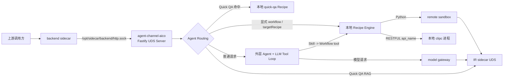
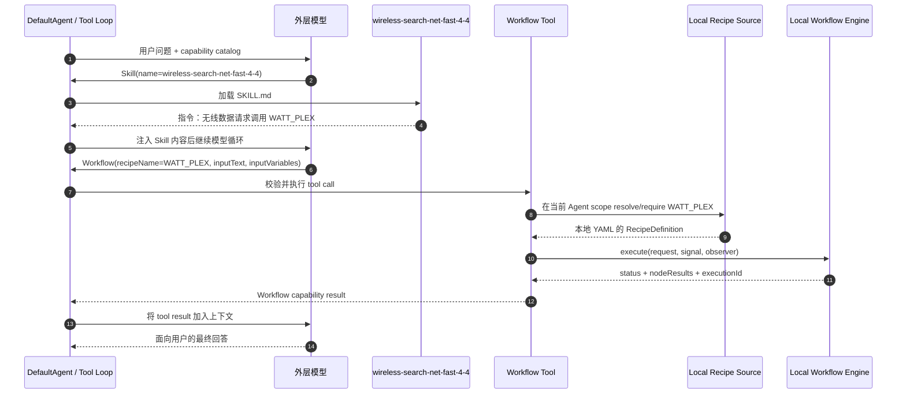
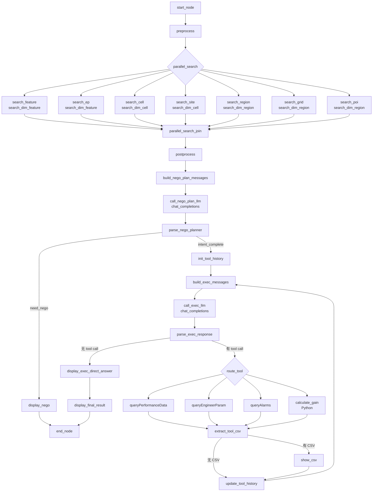

# AICOService 调用链与 WATT_PLEX 工作原理还原

更新时间：2026-09-01
分析对象：`aicoservice@27.68.169` 本地完整运行包、Deployment、历史模型请求与运行日志。

## 1. 新包带来的关键修正

完整包证明，先前“Recipe 只存在于外部注册中心、Pod 不读取本地 YAML”的判断不成立。当前版本的真实情况是：

| 问题 | 当前代码能确认的答案 |
|---|---|
| `WATT_PLEX` 放在哪里？ | 包内有真实文件；启动时复制到 `/opt/share/agents/AICOServiceAgent/recipes/WATT_PLEX.yaml`。 |
| 如何找到它？ | `WorkflowRecipeDefinitionSource` 扫描当前 Agent 的本地 `recipes/` 目录，以 YAML 中的 `recipeName` 建索引。 |
| 如何触发它？ | 正常模型路径中，外层 LLM 发出 `Workflow({recipeName: "WATT_PLEX", ...})`；也可由路由约束直接执行。调用方不传文件路径。 |
| 在哪里执行？ | 当前 `workflow-execution` 配置为 `LOCAL`，由 AICOService 进程内的 workflow engine 执行。 |
| Python 节点在哪里跑？ | workflow engine 负责调度，脚本通过 remote sandbox 边界，经 IR sidecar UDS 执行。 |
| RESTful 节点怎么跑？ | `api_name` 被解析为 CLIP capability，当前为 direct `clipc` 命令执行模式；CLIP 后面的具体服务路由不在本包 JS 中。 |
| 外层模型怎么调用？ | `model-gateway` provider 经 `/opt/sidecar/ir/http.sock` 请求 `/rest/netrsn/v1/chat/completions`。 |
| 是否每个请求都进 WATT_PLEX？ | 否。Quick QA 命中时直接执行 `quick-qa`；只有模型判断、显式指令或 `targetRecipe` 指向它时才执行 `WATT_PLEX`。 |

因此，“按注册名调用”与“Recipe 的物理来源”要分开理解：模型只传 `recipeName`，但 AICOService 会在进程内按该名称定位并读取本地 YAML。

---

## 2. 当前部署的整体结构



这里有两个容易混淆的 Unix Socket：

- `/opt/sidecar/backend/http.sock`：AICOService 的 Fastify 监听地址，也是 A2A-T 请求进入 Node.js 进程的入口。配置见 [`default-system.yaml`](../aicoservice@27.68.169/config/default-system.yaml#L38-L43)。
- `/opt/sidecar/ir/http.sock`：模型、sandbox、RAG、远程 API 等 IR 能力的 sidecar 通道。Deployment 中的 `SIDECAR_SOCKET` 与 `MODEL_GATEWAY_SOCKET_PATH` 都指向它，见 [`deployment.yaml`](./deployment.yaml#L108-L109) 和 [`deployment.yaml`](./deployment.yaml#L168-L177)。

`NEXTAGENT_DEPLOYMENT_MODE=remote` 不代表所有子系统都远程执行。各 gateway 自己还有独立的 `deploymentMode`；当前 workflow 明确是 `LOCAL`，sandbox、RAG、SkillHub、api-call 等则是 `REMOTE`，见 [`default-system.yaml`](../aicoservice@27.68.169/config/default-system.yaml#L60-L127)。

---

## 3. 启动阶段

### 3.1 软件包挂载与进程入口

Deployment 将 CSI 包挂载到 `/opt/pkgs`，并设置：

```text
APP_ROOT=/opt/pkgs/aicoservice@27.68.169
PRODUCT_SCENE=MAE-M
OSS_LANG=zh_CN
```

容器最终执行：

```text
c-init ... msctl start -t normal -- ${APP_ROOT}/bin/start.sh
```

证据：[`deployment.yaml`](./deployment.yaml#L53-L81)、[`deployment.yaml`](./deployment.yaml#L184-L197)、[`deployment.yaml`](./deployment.yaml#L317-L336)。

### 3.2 Agent 目录不是静态挂载，而是启动时复制

`PRODUCT_SCENE=MAE-M` 时，`start.sh` 选择 `aico-agent-m`，然后执行等价于：

```text
${APP_ROOT}/agents/aico-agent-m/zh_CN/*
  -> /opt/share/agents/AICOServiceAgent/
```

所以包内的：

```text
agents/aico-agent-m/zh_CN/recipes/WATT_PLEX.yaml
```

运行时会变成：

```text
/opt/share/agents/AICOServiceAgent/recipes/WATT_PLEX.yaml
```

证据：[`start.sh`](../aicoservice@27.68.169/bin/start.sh#L43-L64)。

### 3.3 Node.js 主入口

`start.sh` 启动：

```text
node ${APP_ROOT}/node_modules/@nextagent/agent-channel-aico/dist/entrypoints/start.js
```

见 [`start.sh`](../aicoservice@27.68.169/bin/start.sh#L66-L80)。入口完成数据库/发布同步初始化，注册 A2A-T、配置、BI 等路由，再启动 Remote Runtime Package 和 SkillHub 同步，见 [`start.js`](../aicoservice@27.68.169/node_modules/@nextagent/agent-channel-aico/dist/entrypoints/start.js#L37-L75)。

应用生命周期最终删除旧 socket 并在配置的 UDS 地址监听，而不是连接一个同名的远程 Workflow 服务，见 [`app-lifecycle-composition.js`](../aicoservice@27.68.169/node_modules/@nextagent/agent-app/dist/composition/app-lifecycle-composition.js#L148-L156)。

---

## 4. Recipe 如何被发现、校验和缓存

Recipe 加载器已经给出完整实现：

1. `agentRoot` 配置为 `/opt/share/agents`。
2. 当前 Agent ID 是 `AICOServiceAgent`。
3. `recipeDirectory(agentId)` 拼成 `${agentRoot}/${agentId}/recipes`。
4. 加载器递归收集 `.yaml/.yml`，用 `readFileSync(..., 'utf8')` 读取并用 `js-yaml` 解析。
5. 首先建立轻量索引；真正执行时再完整加载、规范化并校验定义。
6. 完整定义按 `agentId + recipeName` 放入内存缓存，单 Agent 上限 100 条。

核心证据：

- provider 固定为 `local-recipes / LOCAL_DIRECTORY`：[`workflow-recipe-loader.js`](../aicoservice@27.68.169/node_modules/@nextagent/agent-workflow/dist/workflow-recipe-loader.js#L13-L16)
- 按名称查缓存、扫描目录并加载定义：[`workflow-recipe-loader.js`](../aicoservice@27.68.169/node_modules/@nextagent/agent-workflow/dist/workflow-recipe-loader.js#L17-L76)
- 读取 YAML 建索引：[`workflow-recipe-loader.js`](../aicoservice@27.68.169/node_modules/@nextagent/agent-workflow/dist/workflow-recipe-loader.js#L137-L176)
- Recipe 被发布为 `kind=WORKFLOW` 的 capability descriptor：[`workflow-recipe-loader.js`](../aicoservice@27.68.169/node_modules/@nextagent/agent-workflow/dist/workflow-recipe-loader.js#L89-L135)

错误文案里的“registered workflow recipe”在当前实现中表示“已进入当前 Agent 的 capability catalog”，其来源就是本地 Recipe 目录，不足以证明另有外部 Registry。

仓库中的 `convert_recipe_yaml.py` 仍说明系统曾有 Recipe 导入/转换流程，但它不是这版 AICOService 运行时解析 `WATT_PLEX` 的必经路径。

---

## 5. 请求入口与返回通道

A2A-T 主入口是：

```http
POST /rest/naie/aicoservice/v1/a2at/task
Content-Type: application/json
Accept: text/event-stream
```

处理过程为：

1. 校验 `A2atTaskRequestSchema` 和消息内容。
2. 将请求投影成 `SUBMIT` 或 `ANSWER_PENDING`。
3. 新请求调用 `runtime.submit(...)`；补充用户输入调用 `runtime.answerPendingInput(...)`。
4. 从 session 事件流读取状态，并投影为 A2A-T `TaskResponse`。
5. 通过 SSE 返回，30 秒发送一次 heartbeat；终态或 `USER_INPUT_REQUIRED` 时结束本次流。

真实实现见 [`task-forward.js`](../aicoservice@27.68.169/node_modules/@nextagent/agent-channel-aico/dist/a2at/routes/task-forward.js#L58-L133) 和 [`task-forward.js`](../aicoservice@27.68.169/node_modules/@nextagent/agent-channel-aico/dist/a2at/routes/task-forward.js#L158-L215)。

新请求投影还会从消息中抽取文本，并增加来源标记 `[来源]是A2A-T`，见 [`a2at-request.js`](../aicoservice@27.68.169/node_modules/@nextagent/agent-channel-aico/dist/a2at/projections/a2at-request.js#L31-L53)。

---

## 6. 路由层：并非所有问题都走外层 LLM

`quick-qa-policy` 的优先级是：

1. `$skill:<name>` 或 `$workflow:<name>` 显式指令。
2. 上游给出的 `targetRecipe` 约束。
3. Quick QA：先读配置，再请求 RAG；第一条结果 `vsScore > 0.8` 且有知识文本时，写入 `quick_qa_answer` 并直接选择 `quick-qa` Recipe。
4. 未命中、关闭、无结果或异常时，回退 `MODEL_DRIVEN_LOOP`。

见 [`quick-qa-policy/index.js`](../aicoservice@27.68.169/config/plugins/quick-qa-policy/index.js#L220-L323)。`DefaultAgent.executeRun` 对带 `recipeName` 的 `DETERMINISTIC_FLOW` 直接调用 `executeRecipeRoute`，不会先让外层模型生成 `Workflow` tool call，见 [`default-agent.js`](../aicoservice@27.68.169/node_modules/@nextagent/agent-core/dist/agent/default-agent.js#L32-L46)。

因此存在三条实际路径：

```text
Quick QA 命中
  -> quick-qa Recipe
  -> 直接展示 quick_qa_answer

显式 $workflow:WATT_PLEX 或 targetRecipe=WATT_PLEX
  -> DefaultAgent.executeRecipeRoute
  -> 本地 Workflow Engine

普通无线查询且 Quick QA 未命中
  -> 外层 LLM
  -> Skill
  -> Workflow tool
  -> 本地 Workflow Engine
```

`quick-qa.yaml` 本身只有 `start -> display-content -> end`，见 [`quick-qa.yaml`](../aicoservice@27.68.169/agents/aico-agent-m/zh_CN/recipes/quick-qa.yaml#L1-L20)。

---

## 7. 普通无线查询：Skill 到 Workflow 的精确调用链

正常模型路径中，执行顺序如下：



### 7.1 Skill 只负责告诉模型“该调用什么”

当前包内 Skill 明确规定：所有无线数据请求调用 `WATT_PLEX`，参数包括 `recipeName`、`inputText`、`inputVariables`。见 [`SKILL.md`](../aicoservice@27.68.169/agents/aico-agent-m/zh_CN/skills/wireless-search-net-fast-4-4/SKILL.md#L16-L35) 和 [`SKILL.md`](../aicoservice@27.68.169/agents/aico-agent-m/zh_CN/skills/wireless-search-net-fast-4-4/SKILL.md#L92-L104)。

历史模型记录也确实出现：先加载该 Skill，再输出：

```json
{
  "name": "Workflow",
  "arguments": {
    "recipeName": "WATT_PLEX",
    "inputText": "查询……",
    "inputVariables": {}
  }
}
```

代表性记录：[`dsv4_212_1_aico.jsonl`](../../aico_timedelay_test_report/deepseek0731/dsv4_212_1_aico.jsonl)。

### 7.2 Workflow Tool 是直接触发点

内建 `Workflow` tool 会：

1. 校验 `recipeName/inputText/inputVariables`。
2. 通过 capability resolver 确认当前 Agent scope 中存在同名 `WORKFLOW` capability。
3. 调用受控的 `workflowExecution.execute(...)`。

见 [`workflow-tool.js`](../aicoservice@27.68.169/node_modules/@nextagent/agent-capability/dist/builtins/workflow/workflow-tool.js#L4-L49)。

随后 `createWorkflowToolPort` 再次通过 `agentId + recipeName` 取本地定义，将 session、request、run、identity 等上下文组装成执行请求，并把 engine 结果映射为 `SUCCEEDED/FAILED/waiting` tool result，见 [`workflow-tool-port.js`](../aicoservice@27.68.169/node_modules/@nextagent/agent-workflow/dist/workflow-tool-port.js#L5-L49) 和 [`workflow-tool-port.js`](../aicoservice@27.68.169/node_modules/@nextagent/agent-workflow/dist/workflow-tool-port.js#L128-L195)。

### 7.3 运行日志交叉验证

静态代码与历史运行日志能够闭环：同一份日志中先出现 `workflow.execution.started`，其中 `recipeName=WATT_PLEX` 且生成 `workflow-...` execution ID；紧接着出现 `tool_loop.streaming.bridge`，`capabilityId=Workflow`。日志还记录了本地 Skill `wireless-search-net-fast-4-4` 被发现。见 [`nextagent-operational.log.2.jsonl`](../../e2e_delay/1/nextagent-operational.log.2.jsonl#L2-L4) 和 [`nextagent-operational.log.2.jsonl`](../../e2e_delay/1/nextagent-operational.log.2.jsonl#L72-L74)。

日志中的 `aico_channel.registered, mode=remote` 描述的是整个 remote runtime package/channel 模式，不能覆盖 gateway 级别的 `workflow-execution=LOCAL` 选择；二者处于不同配置层级。

---

## 8. 为什么能确定是本地 Workflow Engine

配置选择的是：

```json
{
  "gatewayId": "local-workflow",
  "gatewayKind": "workflow-execution",
  "deploymentMode": "LOCAL"
}
```

见 [`default-system.yaml`](../aicoservice@27.68.169/config/default-system.yaml#L103-L107)。

`composeWorkflowExecutionLayer` 只有在 gateway 是 `REMOTE` 或显式 mode 为 `remote` 时才创建 `createRemoteWorkflowExecutionService`；否则调用 `createWorkflowExecutionService`，当前配置进入后者，见 [`workflow-composition.js`](../aicoservice@27.68.169/node_modules/@nextagent/agent-app/dist/composition/workflow-composition.js#L52-L69)。

本地 engine 的职责包括：

- 生成 `workflow-<uuid>` execution ID；
- 按 `recipeName/version` 解析定义；
- 初始化变量，并在未显式提供时把 `inputText` 注入 `input_question`；
- 从 start node 开始按 `next + condition` 推进；
- 并行分支用 Promise 并发执行，再按分支顺序合并；
- 为节点生成 started/completed/failed 等事件，处理 retry、WAITING 和终态。

实现见 [`engine/index.js`](../aicoservice@27.68.169/node_modules/@nextagent/agent-workflow/dist/engine/index.js#L51-L129)、[`engine/index.js`](../aicoservice@27.68.169/node_modules/@nextagent/agent-workflow/dist/engine/index.js#L135-L239) 和 [`engine/index.js`](../aicoservice@27.68.169/node_modules/@nextagent/agent-workflow/dist/engine/index.js#L1023-L1029)。

包里确实也带有 remote workflow adapter，但那是可切换实现；当前 `LOCAL` 配置没有走它。不能因为整体部署模式叫 `remote` 就把 workflow execution 也判为远程。

---

## 9. 不同节点类型的真实执行边界

| Recipe 节点 | Engine 中的处理 | 当前实际边界 |
|---|---|---|
| `start-event` / `end-event` | 建立或结束 execution | AICOService 进程内 |
| `parallel-gateway` | 并行运行多个分支并汇合 | AICOService 进程内调度 |
| `inclusive-gateway` | 条件分流/汇合 | AICOService 进程内 |
| `display-content` | 生成可见事件和输出 | AICOService 进程内，随后投影到 SSE |
| `python` | 解析变量，调用 `sandboxExecution.runPython` | remote sandbox，经 IR UDS |
| `restful` | 将 `api_name + inputs` 交给 capability invocation | 当前解析到 CLIP capability，并执行 `clipc` |

### 9.1 Python 节点

Python handler 在存在 `sandboxExecution` 时调用 `runPython({code, timeout...})`，见 [`capability-nodes.js`](../aicoservice@27.68.169/node_modules/@nextagent/agent-workflow/dist/nodes/capability-nodes.js#L283-L339)。Workflow sandbox port 再映射到 sandbox gateway，见 [`workflow-sandbox-execution-port.js`](../aicoservice@27.68.169/node_modules/@nextagent/agent-capability/dist/workflow-sandbox-execution-port.js#L1-L13)。

当前 sandbox 配置为 remote；reference client 对 Unix endpoint 通过 socketPath POST `/rest/sandbox/v1/jobs`，见 [`reference-remote-sandbox.js`](../aicoservice@27.68.169/node_modules/@nextagent/agent-platform-gateway-remote/dist/sandbox/reference-remote-sandbox.js#L9-L18) 和 [`reference-remote-sandbox.js`](../aicoservice@27.68.169/node_modules/@nextagent/agent-platform-gateway-remote/dist/sandbox/reference-remote-sandbox.js#L140-L175)。

### 9.2 RESTful/CLIP 节点

RESTful handler 不直接调用任意 URL，而是要求 `api_name`，再执行 `capabilityInvocation.invoke(...)`，见 [`capability-nodes.js`](../aicoservice@27.68.169/node_modules/@nextagent/agent-workflow/dist/nodes/capability-nodes.js#L87-L132)。

当前 Agent 未配置 `CLIPMode: SANDBOX`，因此 capability composition 选择 direct mode，见 [`capability-composition.js`](../aicoservice@27.68.169/node_modules/@nextagent/agent-app/dist/composition/capability-composition.js#L32-L38)。CLIP executor 最终调用 runner，runner 使用 `clipc list/describe/execute`，见 [`clip-tool-source.js`](../aicoservice@27.68.169/node_modules/@nextagent/agent-capability/dist/clip/clip-tool-source.js#L224-L282) 和 [`direct-clip-command-runner.js`](../aicoservice@27.68.169/node_modules/@nextagent/agent-capability/dist/clip/direct-clip-command-runner.js#L13-L92)。底层以 `shell: false` 启动 `${CLIP_HOME}/clipc`，见 [`direct-clipc-port.js`](../aicoservice@27.68.169/node_modules/@nextagent/agent-platform-gateway-local/dist/sandbox/direct-clipc-port.js#L5-L20)。

所以，对 WATT_PLEX 而言可以确认到的边界是：

```text
RESTFUL node
-> capability resolver
-> CLIP descriptor/executor
-> 本地 clipc 进程
-> CLIP 自己解析 api_name 并访问下游
```

`chat_completions` 也是 WATT_PLEX 的一个 `api_name`，因此 Recipe 内部的两次 LLM 调用先跨越 CLIP 边界。它最终是否与外层模型复用同一 model gateway socket，需要 CLIP 配置或流量日志才能确认，不能只凭本包的 Node.js 代码下结论。

### 9.3 外层 Agent 模型

外层 Agent 的模型调用则能明确确认：model gateway provider 请求 `/rest/netrsn/v1/chat/completions`，并使用 `MODEL_GATEWAY_SOCKET_PATH=/opt/sidecar/ir/http.sock`，见 [`gateway-provider.js`](../aicoservice@27.68.169/node_modules/@nextagent/agent-platform-gateway-remote/dist/model/gateway-provider.js#L21-L50) 和 [`gateway-provider.js`](../aicoservice@27.68.169/node_modules/@nextagent/agent-platform-gateway-remote/dist/model/gateway-provider.js#L102-L144)。

配置中的 `remote-api-call` 是内建 `ApiCall` tool 的远程端口，不能与 WATT_PLEX 的 `restful -> CLIP` 路径混为一谈。

---

## 10. 当前包内 WATT_PLEX 的实际 DAG

本次应以软件包里的 [`WATT_PLEX.yaml`](../aicoservice@27.68.169/agents/aico-agent-m/zh_CN/recipes/WATT_PLEX.yaml) 为准。它是 `version: 0.0.1`，共 31 个节点：

- 1 个 `start-event`
- 10 个 `python`
- 1 个 `parallel-gateway`
- 12 个 `restful`
- 1 个 `inclusive-gateway`
- 5 个 `display-content`
- 1 个 `end-event`

真实主流程为：



有几处与旧分析不同：

- 当前文件是 **7 个并行检索节点**，不是 8 个；它们落到 3 个逻辑检索 API：`search_dim_feature/cell/region`。见 [`WATT_PLEX.yaml`](../aicoservice@27.68.169/agents/aico-agent-m/zh_CN/recipes/WATT_PLEX.yaml#L113-L297)。
- Executor 实际只路由 4 类动作：PM、工参、告警、增益。当前 Recipe 内没有 SmartCanvas 节点；SmartCanvas 规则位于外层 Skill。见 [`WATT_PLEX.yaml`](../aicoservice@27.68.169/agents/aico-agent-m/zh_CN/recipes/WATT_PLEX.yaml#L2227-L2313)。
- 工具循环的 `reached_max_loop` 阈值是 **4**，不是旧稿中的 10。见 [`WATT_PLEX.yaml`](../aicoservice@27.68.169/agents/aico-agent-m/zh_CN/recipes/WATT_PLEX.yaml#L2602-L2645)。
- 协商信息不完整时，当前图是 `display_nego -> end_node`，没有 `user-check` 节点，因此该 execution 会结束并把追问内容返回；下一轮用户输入会产生新的 Agent run，而不是在同一个 WATT_PLEX execution 内原地恢复。见 [`WATT_PLEX.yaml`](../aicoservice@27.68.169/agents/aico-agent-m/zh_CN/recipes/WATT_PLEX.yaml#L1614-L1728)。

YAML 顶部描述仍写“5工具”，与当前实际路由的 4 个动作不一致，应视为元数据/注释未同步，而不是第五个节点被引擎隐式注入。

---

## 11. 结果怎样回到用户

Workflow engine 返回 `executionId/status/nodeResults` 后，`mapWorkflowResult`：

- `COMPLETED` -> tool 状态 `SUCCEEDED`，携带安全过滤后的 `outputVariables`、answer previews 和 metadata；
- `WAITING` -> 返回 `status: waiting` 和 pending input；
- `FAILED/INTERRUPTED` -> 映射安全错误；
- metadata 中保留 `executionId` 和 `nodeResultCount`。

见 [`workflow-tool-port.js`](../aicoservice@27.68.169/node_modules/@nextagent/agent-workflow/dist/workflow-tool-port.js#L128-L202)。

在普通模型路径中，这个结果先作为 `Workflow` tool result 回到外层模型，模型再生成最终用户答复；在 deterministic Recipe 路径中，`DefaultAgent` 直接把 Recipe 可见输出投影到 run timeline。最终两者都由 A2A-T response projector 转成 TaskResponse 并通过 SSE 返回。

---

## 12. 已确认事实与剩余边界

### 已由本地完整包确认

- Pod 启动的真实入口、Agent 复制逻辑和 UDS 监听位置。
- `WATT_PLEX.yaml` 是当前软件包内的本地 Recipe 文件。
- Recipe provider 是 `LOCAL_DIRECTORY`，并真实执行 `readFileSync + js-yaml`。
- `Workflow` tool 按 `recipeName` 在当前 Agent scope 解析本地 Recipe。
- 当前 workflow execution 使用本地 engine，而不是 remote workflow gateway。
- Python 节点走 remote sandbox；RESTful 节点走 CLIP/`clipc`。
- Quick QA、显式 Recipe、模型驱动三条路由路径。
- 当前 WATT_PLEX 的真实 31 节点结构、7 路并行检索、4 类执行动作和最多 4 轮工具循环。

### 仍需外部材料才能确认

- `clipc` 针对每个 `api_name` 最终映射到哪个服务 URL/UDS、鉴权和重试策略。
- Recipe 内 `chat_completions` 是否最终复用外层 model gateway。
- backend/IR sidecar 在 Pod 之外继续转发到哪些微服务。
- 生产运行 Pod 中 `/opt/share/agents/AICOServiceAgent/recipes/WATT_PLEX.yaml` 是否与本次本地包逐字节一致；启动逻辑说明它应来自同版本包，但运行中仍可能被升级流程替换。

---

## 13. 一句话链路

```text
上游 A2A-T 请求
-> backend UDS 上的 agent-channel-aico
-> Quick QA / direct Recipe / model loop 路由
->（普通路径）外层模型加载 Skill 并产生 Workflow(WATT_PLEX)
-> 当前 Agent 的本地 recipes 目录按名称加载 YAML
-> 进程内 Workflow Engine 调度 31 个节点
-> Python 走 remote sandbox，RESTful 走 clipc
-> Workflow 结果回到外层模型或 deterministic route
-> timeline 投影为 A2A-T SSE 返回
```
