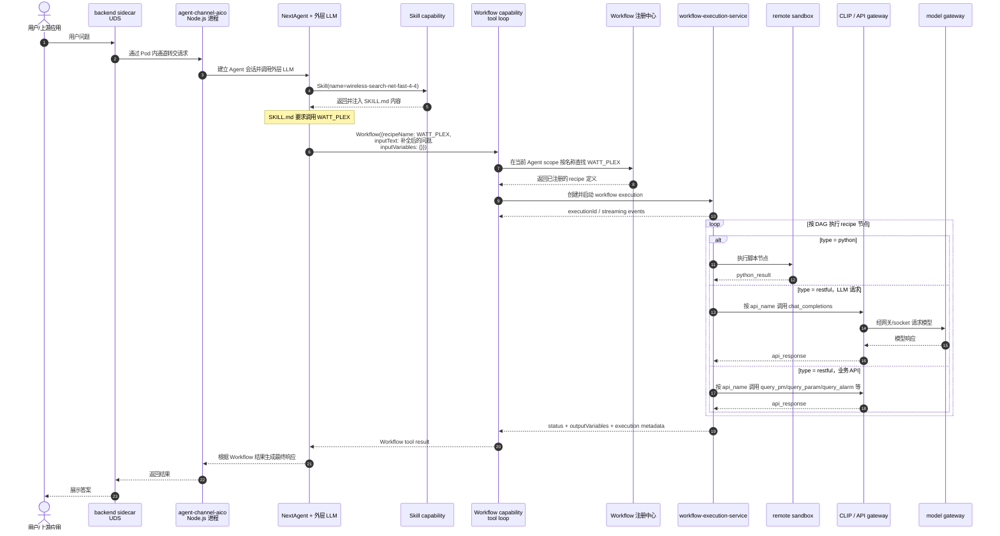
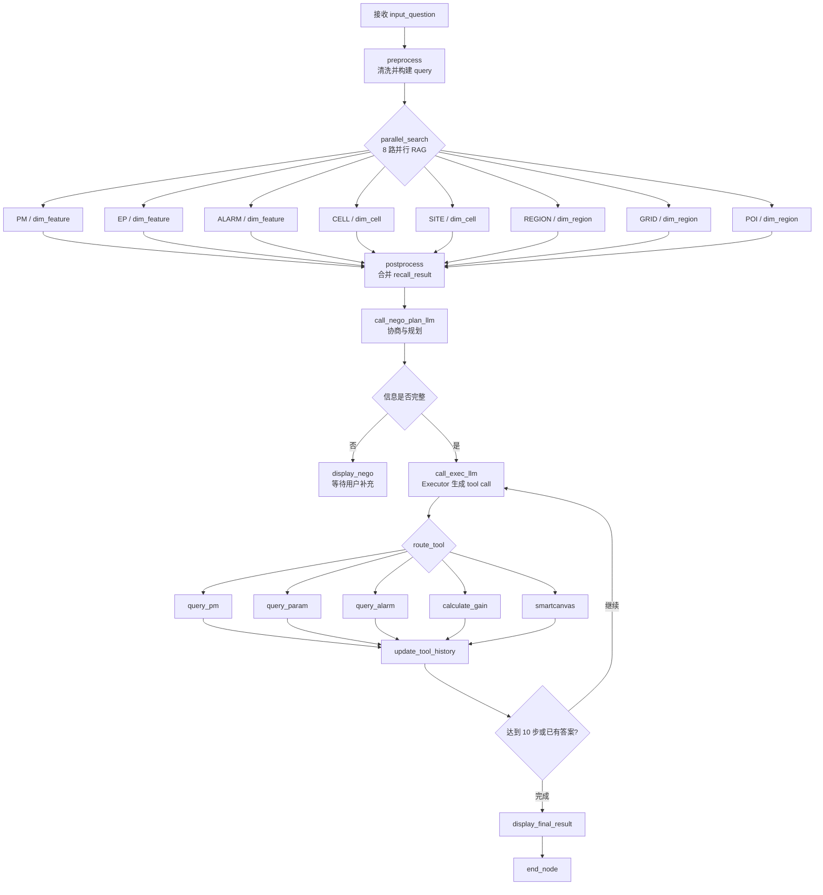

# Pod 内 Recipe 的实际调用过程

## 1. 结论先行

在真实 Pod 中，AICOService **不是通过文件路径直接读取并执行** `recipe.yaml`。

实际链路是：

1. `WATT_PLEX` 的 YAML 事先被导入 Workflow 注册中心；
2. Pod 启动 AICOService/NextAgent Node.js 进程，并为 Agent 注册 `Skill`、`Workflow` 等能力；
3. 用户请求进入 Agent 后，外层 LLM 先加载无线问数 Skill；
4. `SKILL.md` 告诉 LLM 生成一个结构化的 `Workflow` tool call；
5. Pod 内的 tool loop 接住该调用，按照 `recipeName: WATT_PLEX` 从当前 Agent scope 查找已注册的 recipe；
6. Workflow execution service 创建 `executionId`，解析 recipe 节点并调度执行；
7. Python 节点交给 sandbox，RESTful 节点交给 CLIP/API 网关，LLM 节点通过 model gateway 调用模型；
8. recipe 的最终输出作为 `Workflow` tool result 返回外层 Agent，再由外层 Agent 返回用户。

最关键的一点是：

> `SKILL.md` 只是提示 LLM “应该调用哪个 Workflow”；真正启动 recipe 的是 Pod 内的 `Workflow` capability、tool loop 和 workflow execution service。

---

## 2. 启动阶段：Pod 如何把 AICOService 跑起来

### 2.1 CSI 将运行包挂载到 Pod

Deployment 使用 `sop-csi-driver` 把软件包挂载到 `/opt/pkgs/`，主要版本包括：

- `upkg.aicoservice: 27.68.169`
- `npkg.clip: 27.68.167`
- `npkg.nodejs: 27.66.12`
- `npkg.python: 27.66.12`
- `npkg.pythonruntime: 27.66.12`
- `npkg.agentsanbox: 27.68.167`

Deployment 将：

```text
APP_ROOT=/opt/pkgs/aicoservice@27.68.169
```

并执行：

```text
c-init ... msctl start -t normal -- $(APP_ROOT)/bin/start.sh
```

证据：[`deployment.yaml`](./deployment.yaml#L55-L81)、[`deployment.yaml`](./deployment.yaml#L258-L261)、[`deployment.yaml`](./deployment.yaml#L317-L337)。

### 2.2 start.sh 准备 Agent 并启动 Node.js 服务

当前 Deployment 设置：

```text
PRODUCT_SCENE=MAE-M
OSS_LANG=zh_CN
```

因此 `start.sh` 选择 `aico-agent-m`，把对应语言的 Agent 内容复制到：

```text
/opt/share/agents/AICOServiceAgent/
```

随后执行真正的 Node.js 入口：

```text
node ${APP_ROOT}/node_modules/@nextagent/agent-channel-aico/dist/entrypoints/start.js
```

证据：[`bin/start.sh`](./bin/start.sh#L43-L64)、[`bin/start.sh`](./bin/start.sh#L66-L79)。

### 2.3 运行时关键连接

Deployment 中和本链路直接相关的环境变量有：

| 环境变量 | 值 | 作用判断 |
|---|---|---|
| `UDS_ADDRESS` | `/opt/sidecar/backend/http.sock` | AICOService 与 backend sidecar 的 Unix Domain Socket 通道 |
| `SIDECAR_SOCKET` | `/opt/sidecar/ir/http.sock` | Pod 内 IR/网关 sidecar 通道 |
| `MODEL_GATEWAY_USE` | `true` | LLM 请求使用 model gateway |
| `MODEL_GATEWAY_SOCKET_PATH` | `/opt/sidecar/ir/http.sock` | model gateway 的 socket |
| `CLIP_HOME` | `/opt/pkgs/clip@27.68.167/bin` | CLIP 执行组件位置 |
| `SANDBOX_MODE` | `remote` | Python 节点使用 remote sandbox |
| `NEXTAGENT_DEPLOYMENT_MODE` | `remote` | NextAgent 以 remote 模式运行 |

证据：[`deployment.yaml`](./deployment.yaml#L76-L109)、[`deployment.yaml`](./deployment.yaml#L168-L197)、[`bin/start.sh`](./bin/start.sh#L73-L79)。

---

## 3. Recipe 在调用之前放在哪里

`WATT_PLEX` 不需要作为 Deployment 的 ConfigMap 或普通文件挂载到容器中。仓库里的转换脚本表明，recipe YAML 会被包装为导入请求：

```json
{
  "ownerService": "test",
  "recipeContentList": [
    {
      "recipeContent": "<完整 YAML 文本>",
      "type": "yaml",
      "lang": "zh"
    }
  ]
}
```

也就是说，`recipe.yaml` 是**部署前注册的 Workflow 资源**。运行时只通过 `recipeName` 查找它，而不是传递其磁盘路径。

API YAML 也类似，会以 `ownerId + action: ADD + yamlContent` 的形式导入 API/CLIP 注册体系。Recipe 中的 `api_name` 因而可以按逻辑名称找到相应 API 定义。

证据：[`convert_recipe_yaml.py`](../convert_recipe_yaml.py#L5-L22)、[`convert_api_yaml.py`](../convert_api_yaml.py#L18-L35)。

> 当前材料只展示了“导入数据的格式”，没有包含真实环境中的注册接口地址、数据库表或注册中心实现。

---

## 4. 一次用户请求在 Pod 内的完整时序



### 关于第 7 步“按名称查找”的边界

工具描述明确要求：

```text
recipeName must be a registered workflow recipe in the current Agent scope
```

因此可以确认它是“按注册名和 Agent scope 查找”。但由于当前目录缺失完整的 `node_modules/@nextagent/...` 源码，尚不能确认实际函数名、类名、缓存方式，以及 Registry 请求走 HTTP 还是 UDS。

---

## 5. 真正触发 Recipe 的那一刻

外层 LLM 最终生成的结构化调用如下：

```json
{
  "name": "Workflow",
  "arguments": {
    "recipeName": "WATT_PLEX",
    "inputText": "查询深圳大梅沙D-HRH-2小区的经度、纬度和方位角",
    "inputVariables": {}
  }
}
```

这段 JSON 才是 recipe 的**直接触发点**。

它不是 Kubernetes API 调用，也不是 shell 命令，更不是：

```text
open("/some/path/recipe.yaml")
```

而是外层模型输出的一个 function/tool call。Node.js 进程中的 tool loop 识别 `name=Workflow` 后，将参数交给 Workflow capability。

实际模型请求记录完整呈现了以下过程：

1. assistant 调用 `Skill(name=wireless-search-net-fast-4-4)`；
2. tool 返回 `status=loaded`，并将 Skill 内容加入后续模型上下文；
3. assistant 调用 `Workflow(recipeName=WATT_PLEX, ...)`；
4. tool 返回 `status=succeeded`、`outputVariables`、`executionId` 和 `nodeResultCount`。

代表性记录：[`dsv4_212_1_aico.jsonl`](../../aico_timedelay_test_report/deepseek0731/dsv4_212_1_aico.jsonl#L1-L3)。

对应 Skill 里的明确指令：[`new_tool/SKILL.md`](../930LUI/new_tool/SKILL.md#L83-L95)。

---

## 6. Pod 接到 Workflow 调用后做了什么

下面的伪代码只用于表达已观察到的逻辑关系，**不是从 AICOService 源码中反编译出的真实函数名**：

```javascript
async function handleWorkflowToolCall(args, agentScope) {
  const recipe = await workflowRegistry.find({
    name: args.recipeName,
    scope: agentScope,
  });

  return workflowExecutionService.start({
    recipe,
    inputs: {
      input_question: args.inputText,
      ...args.inputVariables,
    },
  });
}
```

可以确认的运行时事件包括：

- `skill.discovery.registered`：注册 `wireless-search-net-fast-4-4`；
- `tool_loop.streaming.bridge`，`capabilityId=Workflow`：tool loop 已接入 Workflow 的流式事件；
- `workflow.execution.started`：Workflow execution service 启动 `WATT_PLEX`；
- 事件中生成独立的 `executionId`、`runId` 和 `traceId`；
- `aico_channel.registered` 且 `mode=remote`；
- `workflow_rag_gateway_resolved`：Workflow/RAG 网关已解析。

证据：[`nextagent-operational.log.2.jsonl`](../../e2e_delay/1/nextagent-operational.log.2.jsonl#L2-L3)、[`nextagent-operational.log.2.jsonl`](../../e2e_delay/1/nextagent-operational.log.2.jsonl#L74)、[`nextagent-operational.log.2.jsonl`](../../e2e_delay/1/nextagent-operational.log.2.jsonl#L10964)、[`nextagent-operational.log.2.jsonl`](../../e2e_delay/1/nextagent-operational.log.2.jsonl#L11081)。

---

## 7. WATT_PLEX 内部如何执行

当前 `workflow/recipe.yaml` 的主要 DAG 如下：



主要节点证据：

- recipe 名称与入口：[`workflow/recipe.yaml`](../930LUI/new_tool/workflow/recipe.yaml#L1-L18)
- 8 路并行检索：[`workflow/recipe.yaml`](../930LUI/new_tool/workflow/recipe.yaml#L55-L80)
- 协商规划 LLM：[`workflow/recipe.yaml`](../930LUI/new_tool/workflow/recipe.yaml#L911-L939)
- Executor LLM 和 tool call 解析：[`workflow/recipe.yaml`](../930LUI/new_tool/workflow/recipe.yaml#L1425-L1499)
- 工具路由：[`workflow/recipe.yaml`](../930LUI/new_tool/workflow/recipe.yaml#L1515-L1531)
- PM/工参/告警调用：[`workflow/recipe.yaml`](../930LUI/new_tool/workflow/recipe.yaml#L1534-L1604)
- 增益与 SmartCanvas：[`workflow/recipe.yaml`](../930LUI/new_tool/workflow/recipe.yaml#L1606-L1619)、[`workflow/recipe.yaml`](../930LUI/new_tool/workflow/recipe.yaml#L1837-L1853)
- 最多循环 10 步并输出：[`workflow/recipe.yaml`](../930LUI/new_tool/workflow/recipe.yaml#L1855-L1930)

### 不同节点由谁执行

| Recipe 节点类型 | 实际执行方 | 典型数据流 |
|---|---|---|
| `python` | Workflow engine 调度的 remote sandbox | `inputs -> script -> python_result -> outputs` |
| `restful` + `chat_completions` | CLIP/API 执行层，再经 model gateway | `api_name + model/messages -> api_response` |
| `restful` + 业务 API | CLIP/API 执行层 | `api_name + 查询参数 -> api_response` |
| `display-content` | Workflow runtime | 生成过程展示或最终 `display_content` |
| `parallel-gateway` | Workflow runtime | 并发启动多个分支并在 join node 汇合 |
| `end-event` | Workflow runtime | 结束 execution |

日志中出现过 `call_exec_llm` 节点的 `type=RESTFUL` 和 `CLIP_EXECUTION_UNAVAILABLE`，这从失败路径反向证明了 RESTful 节点需要经过 CLIP execution boundary，而不是由 YAML 自己直接发请求。

---

## 8. Recipe 结果怎样回到用户

成功时，`Workflow` tool result 的核心结构类似：

```json
{
  "recipeName": "WATT_PLEX",
  "status": "succeeded",
  "outputVariables": {
    "display_content": "<最终答案>"
  },
  "capabilityResult": {
    "metadata": {
      "executionId": "workflow-...",
      "nodeResultCount": 37
    }
  }
}
```

这个结果返回的方向是：

```text
workflow execution service
  -> Workflow capability/tool loop
  -> 外层 LLM 的 tool result
  -> agent-channel-aico
  -> sidecar/上游调用方
  -> 用户
```

如果 recipe 返回协商状态，外层 Agent 将问题转交用户；如果成功，则基于 `display_content` 返回；如果失败，则按 Skill 中的规则决定是否重试一次。

---

## 9. 哪些是已确认的，哪些仍是推断

### 已确认

- Pod 的真正业务入口是 `@nextagent/agent-channel-aico/dist/entrypoints/start.js`。
- 无线问数 Skill 在运行时被注册和加载。
- Skill 明确要求外层模型调用 `WATT_PLEX`。
- 外层模型确实生成了 `Workflow` function/tool call。
- Workflow tool loop 确实启动了名为 `WATT_PLEX` 的 execution。
- execution 具有独立的 `executionId`，并把结果作为 tool result 返回。
- RESTful 节点依赖 CLIP/API execution boundary。
- 当前 Deployment 启用了 model gateway 和 remote sandbox。

### 高可信推断

- 运行时采用的是注册式/网关式 recipe，而不是按照本地 YAML 路径调用。
- `workflow/recipe.yaml` 比直连版 `WATT_PLEX.yaml` 更符合该 Deployment：前者使用 `query_pm`、`query_param`、`query_alarm` 等逻辑 API 名，Deployment 同时启用了 CLIP 和 model gateway。

### 当前无法从已有材料确认

- Node.js 内部处理 `Workflow` tool call 的真实函数、类与源文件。
- Workflow Registry 的实际服务地址、持久化方式和缓存机制。
- Registry 查找是否最终通过 HTTP、UDS 或内部 SDK 完成。
- 生产环境当前注册的 `WATT_PLEX` 与本地 `workflow/recipe.yaml` 是否逐字节一致。
- 因两个本地 recipe 文件都叫 `WATT_PLEX`，仅凭运行日志无法确定生产 Registry 中具体注册了哪一份或哪个修订版本。

若要把上述最后一段也精确还原，需要从运行 Pod 只读复制以下内容：

```text
/opt/pkgs/aicoservice@27.68.169/node_modules/@nextagent/
/opt/pkgs/aicoservice@27.68.169/config/
/opt/share/agents/AICOServiceAgent/
```

并导出当前 Agent scope 中 `WATT_PLEX` 的注册记录或内容摘要。

---

## 10. 一句话记忆

```text
Pod 启动 NextAgent
-> LLM 加载 Skill
-> Skill 促使 LLM 发出 Workflow tool call
-> tool loop 按 recipeName 从 Registry 找到 WATT_PLEX
-> workflow engine 调度 YAML 节点
-> sandbox / CLIP / model gateway 完成实际计算与查询
-> 结果作为 tool result 回到用户
```
