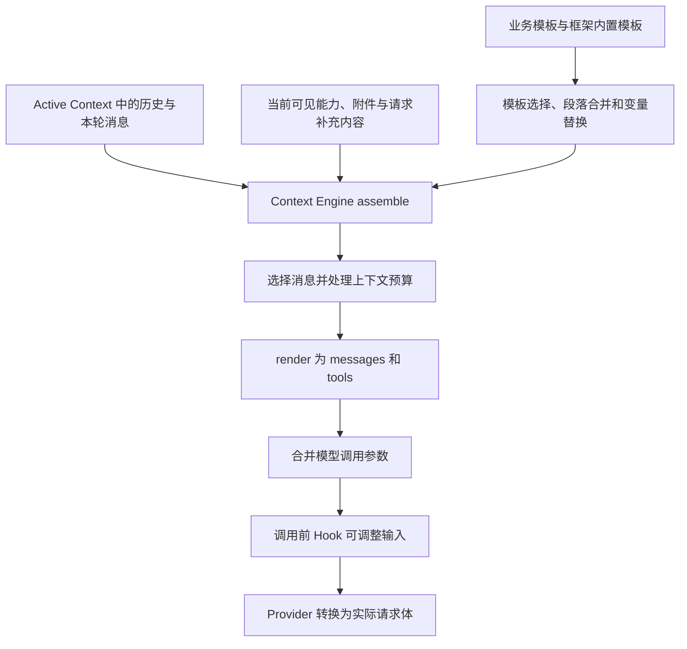

# AICOService 的模型输入如何形成：从 Prompt 模板到实际请求

本文解释当前 AICOService 中，模型实际接收的指令、问题、历史和工具结果如何形成。重点是内容从哪里来、在哪里变化、最终以什么结构送入模型，以及怎样用日志核对。

配套阅读：[用户问题如何通过 Recipe Workflow 完成执行][WIKI2]。本文负责解释模型“看到了什么”，另一篇负责解释业务流程如何推进、节点如何执行及结果如何返回。

## 1. 阅读基线与证据范围

本文以本地 `aicoservice@27.68.169` 运行包中的业务配置及 `node_modules/@nextagent` 实现为主要依据，分析对象是 `aico-agent-m/zh_CN`。不把另外一份 NextAgent 源码仓库直接视为该运行包的同版本实现。

证据分为三类：

| 证据 | 可以说明什么 | 使用边界 |
|---|---|---|
| 本地运行包及本次离线模板渲染 | 当前文件定义的组装规则、消息结构和字段转换 | 不代表线上某次请求的全部配置与实际内容 |
| 2026-08-26 原始 operational 日志、模型请求 recorder | 当时真实记录的消息序列和 HTTP 请求体片段 | 是早期运行，不能替代 9 月 4 日样本 |
| 2026-09-04 无线查数样本导出 | Skill、Workflow 的输入输出及外层模型结果 | 导出没有保留该样本的模型输入，不能据此还原完整 prompt |

本次静态渲染与原始日志定位见[核对记录][EVIDENCE]，9 月 4 日样本见[样本摘录][SAMPLE]。已知该样本加载的 Skill 正文与本地文件部分不同，涉及真实运行时优先引用样本中记录的内容。

## 2. AICOService 中存在两种主要的模型输入形成路径

在无线查数场景里，外层 Agent 和 WATT_PLEX 内部都会调用模型，但输入来源不同。

| 模型调用位置 | 指令和业务内容来源 | 历史来源 | 工具描述来源 |
|---|---|---|---|
| 外层 Agent | Agent 的 SYSTEM_PROMPT 模板、框架补充段落、当前问题、已加载 Skill 等 | 当前会话的 active context，以及本次请求产生的消息 | 当前 Agent 可见的能力目录，经筛选后形成 `tools` |
| WATT_PLEX 协商规划节点 | recipe 内嵌 Python 构造的 `planner_prompt` | 不自动携带外层完整聊天历史；使用传入的问题与检索结果 | 当前定义不为该模型节点传递 `tools` |
| WATT_PLEX 执行模型节点 | recipe 内嵌 Python 构造的执行规则、计划、候选指标及确认信息 | recipe 自己维护的 `tool_history` | Python 内定义的四个 function schema |

外层的主要处理过程如下：



WATT_PLEX 则先运行 `build_nego_plan_messages` 或 `build_exec_messages`，得到包含 `messages` 等字段的对象，再由 `restful` 节点把这些字段交给 `chat_completions` 能力。不能假定这些节点会自动套上外层 Agent 的 SYSTEM_PROMPT。[P01][P02][R01]

这里的“prompt”需要同时看两部分：`messages` 决定模型看到的文本和对话，`tools` 决定模型拿到哪些函数描述与参数 schema。工具定义通常是请求体中的独立字段，不是把工具说明全部拼进一段字符串。

## 3. 外层 System Prompt：业务文件如何变成一条 SYSTEM 消息

### 3.1 模板清单决定哪些业务文件参与组装

本地业务模板位于 `agents/aico-agent-m/zh_CN/prompts/SYSTEM_PROMPT/template.yaml`，它声明了以下 section：[P03]

| Section ID | 本地声明 | 主要内容 |
|---|---|---|
| `identity` | `identity.md` | RAN Agent 身份、业务范围 |
| `task_approach` | `task-approach.md` | 意图分类、问题拆分、Skill 路由和输出要求 |
| `communication_style` | `communication-style.md` | 中文、简洁、专业的回复方式 |
| `agent_delegation` | `agent-delegation.md` | 按业务意图使用已定义 Skill |
| `tooling` | `tooling.md` | Skill 和工具使用要求 |
| `action_safety` | `action-safety.md` | 业务操作范围 |
| `context_management` | `context-management.md` | 上下文和用户偏好的使用要求 |
| `workspace` | `workspace.md` | 工作目录说明 |
| `runtime` | inline `{{ runtime? }}` | 选定模型和当前日期 |
| `environment` | inline `{{ environment? }}` | 平台、时区、日期等运行环境信息 |

目录里存在一个 Markdown 文件，并不等于它自动进入 prompt。例如，本地有 `skill-disclosure.md`，但业务 `template.yaml` 没有列出 `skill_disclosure` section。实际内容需要继续追踪模板注册和内置 section 补齐过程。

### 3.2 业务模板优先，缺失 section 从框架模板补齐

模板 registry 保存框架内置模板和按 `agentId + agentVersion` 注册的业务模板。组装时按 purpose、Agent、语言、模型及模板声明的 flow variable 条件进行匹配；匹配到业务模板时优先使用业务层。[P04][P05]

业务模板与内置模板并不是简单地二选一。`mergeSections()` 会保留业务模板已有的 section，并补入业务模板没有声明的内置 section；已有同名 section 的内容由业务模板提供。

本地内置 SYSTEM_PROMPT 清单比业务清单多出三个相关 section：

- `system_behavior`：通用输出行为要求。
- `memory`：长期记忆使用说明，只有对应记忆能力可见时才进入。
- `skill_disclosure`：可用 Skill 的披露内容，只有披露列表非空时才进入。

因此，仅打开业务目录的十项模板清单，不能看到完整 SYSTEM 内容。[P05][P06]

本次用运行包自带的 assembler 做了离线渲染：显式使用示例模型 `example-model`、开启 memory gate、提供一个示例 Skill 披露条目，实际得到 13 个非空 section，验证了上述补齐规则。这个验证只用于说明组装行为；渲染出的本机环境信息和示例能力不是线上请求的证据。[EVIDENCE]

### 3.3 内容顺序还会经过框架整理

SYSTEM_PROMPT 有固定的 section 顺序。组装器先按该顺序排列，renderer 再把 section 分成相对稳定内容与动态内容：

- 稳定部分包括身份、业务处理规则、工具使用和上下文管理等。
- 动态部分包括运行信息、环境信息、Skill 披露以及存在时的动态上下文等。
- 两部分都非空时，在中间插入框架定义的 cache boundary marker。

最后还可能追加可用 Agent、延迟加载的 CLIP 工具提示、附件信息、附件内容或降级说明，并追加语言提示。是否追加取决于本次 assembly 的实际数据。[P06][P07]

这个 marker 只能说明请求内容设置了一个缓存边界标记，不能单凭它推断模型服务实际命中了缓存。

### 3.4 变量替换有明确的数据来源

`{{ runtime? }}`、`{{ environment? }}` 等变量由框架的变量 resolver 计算，不是模型生成的。当前实现中：[P08]

| 变量 | 来源 |
|---|---|
| `runtime` | 选中的模型 ID，加服务执行时的日期 |
| `environment` | 平台、系统版本、时区、日期 |
| `workspaceDir` | 渲染上下文中的工作目录说明 |
| `skillDisclosureList` | 当前可披露 Skill 的 ID 和描述 |
| `networkEnvironment` | 允许进入模板的 flow variable |

模板支持的是预定义变量名，并不是任意对象路径都能用。`?` 表示允许变量解析失败时省略；未知变量名仍会报错。业务 YAML 中的 `${tool_args.fields}` 则属于 workflow 的变量引用机制，两者不能混用。

### 3.5 当前业务规则确实包含大量意图分类内容

`task-approach.md` 不只是“你是一个助手”之类的身份描述。它包含意图拆分、`type` 分类、场景判断、细分意图库、Skill 选择，以及输出 `sub_questions` JSON 的要求。本地离线渲染中该 section 为 26,042 个字符，明显大于多数其他业务段落；这是字符数，不是 token 数。[P09][EVIDENCE]

这解释了为什么理解外层输入时必须查看业务模板正文。只知道调用了某个大模型，无法理解模型依据什么业务分类规则选择 Skill。

同时，prompt 中写了某项要求，并不代表模型实际遵守了它。比如 9 月 4 日样本的最终回复出现了 `sub_questions` JSON，但第一轮模型结果是直接调用 Skill。能确认本地模板存在这类输出要求、样本存在这样的结果；由于缺少该样本的完整输入，不能据此断言所有模板内容与执行顺序都得到验证。

## 4. Context Engine assemble：选择本次模型能看到的内容

外层 Agent 在每个模型轮次调用 `contextEngine.assemble()`，传入 session、request、run、Agent、当前 step、语言、允许使用的 flow variables，以及能力执行产生的补充消息和 context patch。[P01]

assemble 的工作不只是拼接字符串，而是形成一次模型调用的上下文集合：[P02]

1. 读取当前 active context，以及本次 Agent 的 assembly。
2. 解析可用且可向模型披露的能力，选择模型配置。
3. 组装 System Prompt。
4. 从 active context 引用中选择历史和当前请求消息。
5. 收集相关附件信息，处理旧工具结果、超大内容和输入预算。
6. 返回选中的消息引用、system sections、能力描述、模型选项和相关证据。

### 4.1 模型看到的历史不等于数据库中全部历史

历史选择器基于 `ActiveContextView` 的消息引用读取内容，不扫描完整会话流水。它区分此前完整可见的轮次，以及当前请求中必须保留的用户消息、模型工具调用和工具结果；被重试替代的旧执行消息也会受到过滤。[P10]

所以，需要分清三件事：

| 对象 | 作用 |
|---|---|
| 持久化会话消息 | 保存发生过的对话和执行事实 |
| Active Context | 指定当前可用于后续推理的消息集合 |
| 本次 rendered messages | 在 active context 基础上，经过预算处理、结构转换和补充后的具体模型输入 |

用户能在界面上翻到某段历史，不保证下一次模型仍接收那段原文。反过来，模型可以接收页面没有作为普通聊天正文展示的工具结果，例如已加载 Skill 的正文。

### 4.2 上下文可能被压缩或替换为预览

当前实现包含旧工具结果的 micro-compaction、超大工具结果预览替换，以及接近窗口预算时的摘要压缩。原始工具结果可仍保存在消息存储中，但进入模型的内容已经缩短。[P02]

这几个机制对业务理解的影响不同：旧结果可能只剩占位或预览，过去多轮对话可能以摘要形式进入，而本轮正在执行的调用与结果还必须保持可解释的配对关系。

不能用“数据库中原文还在”证明“模型完整看到了原文”，也不能把摘要压缩描述成每轮必然发生。9 月 4 日选定样本没有足够证据证明发生了哪种压缩。

## 5. render：从上下文对象到 messages 和 tools

assemble 选中消息引用后，render 再读取其内容、应用对应的内容替换，并调用 `DefaultModelInputRenderer` 构造模型输入。[P02][P07]

外层框架使用的中间消息结构如下。下面是结构示意，省略了大段正文和其他可选消息，不是某次生产请求的完整抓包：

```json
{
  "messages": [
    {"role": "SYSTEM", "content": [{"type": "text", "text": "组装后的系统指令"}]},
    {"role": "USER", "content": [{"type": "text", "text": "用户问题"}]},
    {"role": "ASSISTANT", "content": [{"type": "tool-call", "toolCall": {
      "toolCallId": "call_example", "toolName": "Skill", "arguments": {"name": "wireless-search-net-fast-4-4"}
    }}]},
    {"role": "TOOL", "content": [{"type": "tool-result", "toolCallId": "call_example", "toolName": "Skill", "output": {
      "name": "wireless-search-net-fast-4-4", "status": "loaded", "body": "Skill 正文"
    }}]}
  ],
  "tools": [
    {"capabilityId": "Workflow", "name": "Workflow", "description": "工作流执行入口的说明", "inputSchema": {"type": "object"}}
  ]
}
```

`CAPABILITY_RESULT` 会被转换成 `TOOL` 消息。存储中的模型工具调用 JSON 会被转换成 `tool-call` 内容块，相应工具结果会变成 `tool-result` 内容块。renderer 会检查调用和结果的 ID、顺序是否配对，孤立或缺失的工具结果不能直接进入正常模型输入。[P07][P11]

### 5.1 Skill 正文是在调用结果中进入模型的

加载之前，模型可以看到 Skill 的名称、描述及调用入口。执行 `Skill` 后，本地实现返回：

```text
structuredPayload.name   = Skill 名称
structuredPayload.status = loaded
structuredPayload.body   = 包装在 <skill_content ...> 中的正文
generatedMessages        = []
```

该 payload 被保存为工具结果，后续模型通过对应的 `TOOL` 消息读取正文。当前 renderer 不再从这个结果额外重建一份独立的 Skill USER 消息，以免重复注入。[P12][P07]

因此，“Skill 调用成功”在此处表示执行说明已加载。后续模型读到“无线数据请求交给 WATT_PLEX”的说明后，再发出 Workflow 调用。Skill 加载本身没有完成数据查询。

### 5.2 不是全部能力都进入 tools

renderer 只为符合披露条件、具有输入 schema 的 `TOOL` 能力生成工具描述。Skill 目录和 Workflow recipe 描述不等于同名函数 schema；例如外层调用的是通用 `Workflow` 工具，recipe 名称放在 `recipeName` 参数里。[P07]

工具搜索或能力调用还可能通过 context patch 改变后续轮次的可见工具集合。因此一次会话的 `tools` 不一定从第一轮到最后一轮保持完全相同。

## 6. render 后还有两步：Hook 和 Provider 转换

### 6.1 调用前 Hook 仍可能补充消息

`flattenModelRequest()` 把 rendered messages、tools、模型配置和请求级选项放入模型调用对象。随后模型服务包装层执行 `BEFORE_MODEL_INVOKE` Hook，可以得到调整后的 `effectiveRequest` 再调用 provider。[P13][P14]

本地 Agent 配置启用了 `user-query-memory-recall`。该 Hook 在符合条件的初始模型调用中读取当前用户问题，尝试召回长期记忆和用户特征，经预算准入后将补充消息插在最后一条 USER 消息之前。坐标不完整、不是初始调用、没有匹配记忆或预算不足等情况下，会跳过或不补充。[P15]

这里要区分：System Prompt 的 `memory` section 是“如何使用记忆”的规则，Hook 加入的是本次实际召回的内容。启用 Hook 不代表每次请求一定有记忆内容，也不代表这些补充自动成为 workflow 内部模型的历史。

### 6.2 中间模型对象不等于最终 HTTP body

本地默认模型 profile 使用 `model-gateway`。对应远端 gateway provider 的 `buildRequestBody()` 会将中间对象转换成服务接口需要的字段：[P16]

| 中间结构 | Gateway 请求体 |
|---|---|
| `modelId` | `model` |
| `SYSTEM / USER / ASSISTANT / TOOL` | 小写 `system / user / assistant / tool` |
| text 内容块 | 消息的 `content` 字符串 |
| `tool-call` | `assistant.tool_calls`，参数序列化成 JSON 字符串 |
| `tool-result` | `tool` 消息的 `content` 和 `tool_call_id` |
| 工具 `inputSchema` | `tools[].function.parameters` |
| `maxOutputTokens`、`topP` | `max_tokens`、`top_p` |

参数也必须追到这一层。例如，本地该 provider 在 tools 非空时直接写 `tool_choice: auto`；不能只因为上游调用对象有 `toolChoice` 就断言它原样到达下游。这里记录的是本地代码行为，未据此推断某次线上请求的异常。

## 7. WATT_PLEX 内部模型的输入是怎样形成的

### 7.1 规划模型：问题与领域检索结果一起进入

`postprocess` 把检索结果整理为 `recall_result`，包括 PM、EP 候选，精确匹配的指标与对象，候选小区、站点、区域、网格、POI，以及黑话映射。

`build_nego_plan_messages` 读取这些字段，用 Python f-string 构造 `planner_prompt`。其中既有固定的协商和规划规则，也有本次问题及候选信息。当前定义在构造时对 PM、EP 候选各取最多 50 项，对各类对象名称各取最多 20 项。[R01]

其输出结构为：

```text
classify_result
  messages = [{role: "user", content: planner_prompt}]
  model = netmo-deepseek-v4-flash
  max_tokens = 10000
  temperature = 0.1
  top_p = 0.7
  enable_thinking = false
```

`call_nego_plan_llm` 将这些字段传给 `chat_completions`。注意，这里的规则文本使用 `role: user`，并不是外层框架的 SYSTEM 消息。模型名称及参数是本地 recipe 的配置值，不是 9 月 4 日内部模型型号的实测结论。

### 7.2 执行模型：计划、领域规则与工具历史一起进入

规划完成后，`build_exec_messages` 读取：

- `input_question`：传入 workflow 后的当前问题。
- `current_plan`：规划模型结果经解析后的计划。
- `nego_show_user_content`：确认或协商内容。
- `candidate_pms / candidate_eps / candidate_alias`：领域名称和映射。
- `tool_history`、`loop_count`、`reached_max_loop`：本次 workflow 的执行进度。

脚本中的变量虽然名为 `executor_system`，实际也是作为一条 `role: user` 消息放入 `_msgs`。文本包含任务、计划、当前时间、字段填写规则、空结果处理规则和结果总结要求。[R01]

与规划模型不同，执行模型还得到四个 function schema：`query_pm`、`query_param`、`query_alarm`、`calculate_gain`。它们由 recipe 内的 Python 定义，随后通过 `exec_result.tools` 传给模型，不是外层能力目录的整体复制。

第一次执行时 `tool_history` 为空；一次工具执行结束后，下一次输入会根据历史重建以下结构：

```text
USER       执行规则 + 用户任务 + 计划 + 候选信息
ASSISTANT  tool_calls: query_param，arguments: 上次实际记录的参数
TOOL       tool_call_id: 与上项对应，content: 上次工具结果
……         其他已执行步骤
```

历史中的 `step` 用于构造 `call_1` 等配对 ID。内部模型因此能依据已经查到的数据决定继续调用工具还是输出答案。外层完整聊天记录并不会因共享 sessionId 而自动复制进来；需要继承的信息主要由外层补全到 `inputText`，或显式作为变量传递。

构造结果中有某字段，也不代表下游节点一定传递它。例如 Python 构造的 `exec_result` 含 `stream: true`，但本地 `call_exec_llm.inputs` 没有引用这个字段。仅凭构造脚本不能断言该次 HTTP 调用实际采用流式请求，仍需检查能力处理和实际请求体。

### 7.3 Python 输出、变量解析和模型输入的衔接

Python 节点并不是直接把 Python 内存对象交给下一个节点。脚本 `print(json.dumps(result))` 后，节点实现解析沙箱返回的 stdout：优先按完整 JSON 解析，失败时按行解析。结果成为 `python_result`，再按 `outputs` 映射到 workflow 变量。[R02][R03]

例如：

```yaml
outputs:
  exec_result: ${python_result}
```

下游的 `${exec_result.messages}` 是完整变量引用，会保留数组类型；`${exec_result.tools}` 同样保留工具 schema 数组。只有将变量嵌入较长的字符串时，才需要转换成文本。

一些节点设置 `param_to_json_str: "true"`，因此入参以 JSON 字符串注入 Python，脚本需要先 `json.loads()`。这解释了为什么代码中明明传的是对象，却又要做一次 JSON 解析。

## 8. 用真实日志核对模型输入

### 8.1 原始 operational 日志显示三轮内容如何增加

早期原始日志中，run `run-adadcc73-774e-45b1-b09a-92fd2507bbfe` 的三个 `model.payload.input_captured` 事件有以下消息结构：[L01][EVIDENCE]

| 原始文件行号 | Step | `modelInput.messages` 中的角色序列 | 本轮已能读取的工具结果 |
|---|---|---|---|
| 522 | `turn-1` | USER | 无 |
| 612 | `turn-2` | USER、ASSISTANT、TOOL | Skill |
| 2905 | `turn-3` | USER、ASSISTANT、TOOL、ASSISTANT、TOOL | Skill、Workflow |

这不是单纯的调用链：它直接展示了后一次模型输入比前一次多了什么。第二轮能读取 Skill 执行说明，第三轮能读取 Workflow 的返回值。

不过，这三条日志都没有 SYSTEM，并不表示模型没收到 System Prompt。该字段本身就不记录 SYSTEM。

### 8.2 `modelInput` 不是完整请求抓包

本地 `RunBoundModelInvocation.localModelInput()` 明确只记录过滤掉 `SYSTEM` 后的 `messages`；日志 writer 又执行一次相同过滤，并有长度、数组项等限制。[P17][P18]

它有三个关键边界：

1. 没有 System Prompt，也没有完整 `tools` 和推理选项。
2. 采集位于 core 调用 `model.stream()` 之前；下游调用前 Hook 还可能修改输入。
3. 记录的是框架中间消息结构，provider 之后仍会转换成实际 HTTP body。

所以，核对一份“完整模型输入”时，需要同时检查模板和 section、历史选择、工具披露、Hook 后的有效请求，以及 provider 请求体。单独拿到一条 `modelInput` 日志，证据还不完整。

### 8.3 HTTP recorder 可以核对 workflow 的具体 messages

早期 `recipe-model-request-recorder.jsonl` 第 16 行记录了一次 2026-08-26 的实际请求：[L02]

- `request_body.messages` 只有一条 `user` 消息。
- 正文以无线问数意图协商与任务规划规则开头，末尾包含用户问题、精确匹配和候选列表。
- 此请求没有 `tools`。
- recorder 中的 `model` 为 `ds-v4-flash-w8a8-code`，与本地 recipe 的配置名称不同。

这条证据支持“规划输入是规则加本次检索内容”的实际形态，但不证明它属于 9 月 4 日样本，也不用于推断当前模型别名映射。

### 8.4 9 月 4 日样本能确认到哪一步

该样本的问题是“获取 apo_test 区域内机械下倾角是 2° 的 5G 小区一共有多少个？”。导出能看到模型调用 Skill、Skill 返回正文、模型调用 WATT_PLEX，以及 Workflow 返回的结果。[SAMPLE]

导出对模型输入给出的信息是“日志中未记录……原因：内容过长”。因此，本文不提供一份冒充该样本原始输入的完整 prompt，也不编造它的 `recall_result`、`current_plan` 或查询参数。

## 9. 阅读一次请求时，如何定位内容来源

| 想理解的内容 | 优先检查的位置 |
|---|---|
| 身份、意图分类规则从哪里来 | 业务 template 清单及对应 Markdown，尤其 `task-approach.md` |
| 业务没写的 system 规则为什么出现 | 内置模板、同名 section 覆盖和缺失 section 补齐 |
| Skill 正文何时出现 | Skill 工具结果的 `body`，及下一轮 TOOL 消息 |
| 为什么某段历史没进入模型 | Active Context、选中的消息引用、压缩和预览处理 |
| 为什么出现用户偏好或记忆 | 调用前 memory recall Hook 的诊断与有效输入 |
| 模型能调用哪些工具 | 本次实际 `tools`；区分外层目录与内部 recipe schema |
| 规划器如何理解指标和区域 | `recall_result` 与 `classify_result.messages` |
| 执行器是否看到了查询结果 | `tool_history` 与下一次 `exec_result.messages` |
| 最终发给模型的字段是什么 | Hook 后请求及 provider / API 请求体，不能只看模板 |

## 10. 源码与材料索引

以下均指向本文核对过的本地文件；源码行号以当前运行包为准。

| 编号 | 内容 |
|---|---|
| [P01] | 外层模型轮次与 `render()` 调用 |
| [P02] | Context Engine assemble / render |
| [P03] | 业务 SYSTEM_PROMPT 清单 |
| [P04] | 模板注册与内置模板加载 |
| [P05] | 模板选择、section 补齐、变量渲染 |
| [P06] | section 顺序与稳定/动态内容整理 |
| [P07] | 消息与工具 renderer |
| [P08] | Prompt 变量来源与替换规则 |
| [P09] | 业务意图分类及 Skill 路由规则 |
| [P10] | Active Context 历史选择 |
| [P11] | 工具结果的持久化消息格式 |
| [P12] | Skill 加载结果 |
| [P13] | 模型调用参数展开 |
| [P14] | 模型调用前后的 Hook 包装 |
| [P15] | 初始调用的记忆召回 Hook |
| [P16] | Model Gateway 请求体转换 |
| [P17] | 外层输入日志采集边界 |
| [P18] | 日志字段过滤与限制 |
| [R01] | WATT_PLEX 的规划、执行消息构造 |
| [R02] | Python / RESTful 节点执行 |
| [R03] | stdout 解析与节点变量映射 |
| [L01] | 早期外层模型原始 operational 日志 |
| [L02] | 早期 workflow 模型请求 recorder |

[WIKI2]: /Users/zhangfan/project/aico_timedelay_report/aico_struct_code/aicoservice_workflow_wiki.md
[EVIDENCE]: /Users/zhangfan/project/aico_timedelay_report/outputs/aicoservice_wiki_evidence_20260907.json
[SAMPLE]: /Users/zhangfan/project/aico_timedelay_report/outputs/aico_request_sample_20260904.json
[P01]: /Users/zhangfan/project/aico_timedelay_report/aico_struct_code/aicoservice@27.68.169/node_modules/@nextagent/agent-core/dist/agent/default-agent.js:973
[P02]: /Users/zhangfan/project/aico_timedelay_report/aico_struct_code/aicoservice@27.68.169/node_modules/@nextagent/agent-context-engine/dist/assembly/assemble-context.js:94
[P03]: /Users/zhangfan/project/aico_timedelay_report/aico_struct_code/aicoservice@27.68.169/agents/aico-agent-m/zh_CN/prompts/SYSTEM_PROMPT/template.yaml
[P04]: /Users/zhangfan/project/aico_timedelay_report/aico_struct_code/aicoservice@27.68.169/node_modules/@nextagent/agent-context-engine/dist/prompt-shaping/prompt-template-registry.js
[P05]: /Users/zhangfan/project/aico_timedelay_report/aico_struct_code/aicoservice@27.68.169/node_modules/@nextagent/agent-context-engine/dist/prompt-shaping/prompt-template-assembler.js
[P06]: /Users/zhangfan/project/aico_timedelay_report/aico_struct_code/aicoservice@27.68.169/node_modules/@nextagent/agent-context-engine/dist/prompt-shaping/prompt-template-purpose-policy.js
[P07]: /Users/zhangfan/project/aico_timedelay_report/aico_struct_code/aicoservice@27.68.169/node_modules/@nextagent/agent-context-engine/dist/prompt-shaping/model-input-renderer.js
[P08]: /Users/zhangfan/project/aico_timedelay_report/aico_struct_code/aicoservice@27.68.169/node_modules/@nextagent/agent-context-engine/dist/prompt-shaping/variable-resolver.js
[P09]: /Users/zhangfan/project/aico_timedelay_report/aico_struct_code/aicoservice@27.68.169/agents/aico-agent-m/zh_CN/prompts/SYSTEM_PROMPT/task-approach.md
[P10]: /Users/zhangfan/project/aico_timedelay_report/aico_struct_code/aicoservice@27.68.169/node_modules/@nextagent/agent-context-engine/dist/assembly/active-context-selector.js
[P11]: /Users/zhangfan/project/aico_timedelay_report/aico_struct_code/aicoservice@27.68.169/node_modules/@nextagent/agent-core/dist/tools/capability-result-projection.js
[P12]: /Users/zhangfan/project/aico_timedelay_report/aico_struct_code/aicoservice@27.68.169/node_modules/@nextagent/agent-capability/dist/builtins/skill-tool.js:230
[P13]: /Users/zhangfan/project/aico_timedelay_report/aico_struct_code/aicoservice@27.68.169/node_modules/@nextagent/agent-core/dist/model/model-request-builder.js
[P14]: /Users/zhangfan/project/aico_timedelay_report/aico_struct_code/aicoservice@27.68.169/node_modules/@nextagent/agent-model/dist/invocation/lifecycle-hook-wrapper.js
[P15]: /Users/zhangfan/project/aico_timedelay_report/aico_struct_code/aicoservice@27.68.169/node_modules/@nextagent/agent-app/dist/composition/user-query-memory-recall-hook.js
[P16]: /Users/zhangfan/project/aico_timedelay_report/aico_struct_code/aicoservice@27.68.169/node_modules/@nextagent/agent-platform-gateway-remote/dist/model/gateway-provider.js:117
[P17]: /Users/zhangfan/project/aico_timedelay_report/aico_struct_code/aicoservice@27.68.169/node_modules/@nextagent/agent-core/dist/model/run-bound-model-invocation.js:95
[P18]: /Users/zhangfan/project/aico_timedelay_report/aico_struct_code/aicoservice@27.68.169/node_modules/@nextagent/agent-log/dist/operational-writer.js:1034
[R01]: /Users/zhangfan/project/aico_timedelay_report/aico_struct_code/aicoservice@27.68.169/agents/aico-agent-m/zh_CN/recipes/WATT_PLEX.yaml:599
[R02]: /Users/zhangfan/project/aico_timedelay_report/aico_struct_code/aicoservice@27.68.169/node_modules/@nextagent/agent-workflow/dist/nodes/capability-nodes.js
[R03]: /Users/zhangfan/project/aico_timedelay_report/aico_struct_code/aicoservice@27.68.169/node_modules/@nextagent/agent-workflow/dist/nodes/shared.js
[L01]: /Users/zhangfan/project/aico_timedelay_report/e2e_delay/1/nextagent-operational.log.1.jsonl:522
[L02]: /Users/zhangfan/project/aico_timedelay_report/e2e_delay/1/recipe-model-request-recorder.jsonl:16
