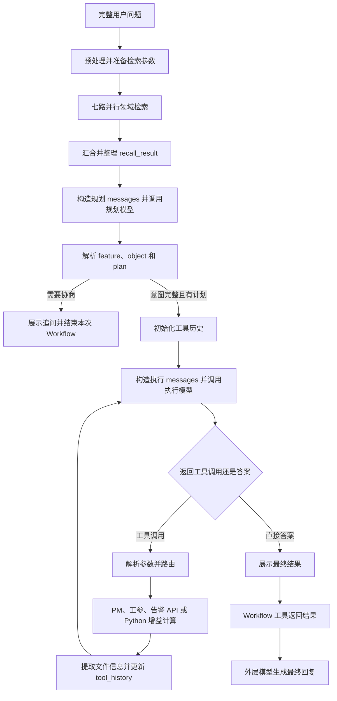

# AICOService 的业务请求如何执行：从用户问题到 Recipe Workflow 与最终回复

本文以无线查数业务的 WATT_PLEX 为主线，解释当前 AICOService 如何把用户问题变成查询任务，如何运行模型、沙箱和 API 节点，如何在分支与循环中传递数据，以及执行结果如何返回用户。

本文关注当前实现怎样运作，不讨论架构选型或设计动机，也不涉及 K8s 和部署。模型输入的详细组成见配套文章：[从 Prompt 模板到实际模型请求][WIKI1]。

## 1. 分析对象与真实样本

主要代码基线是本地 `aicoservice@27.68.169` 运行包，业务定义位于 `agents/aico-agent-m/zh_CN`。执行机制以运行包内的 NextAgent 实现为准，不直接用另一份框架源码仓库替代。

贯穿本文的运行样本来自 2026-09-04 的导出材料：[SAMPLE]

| 项目 | 值 |
|---|---|
| 用户问题 | 获取 apo_test 区域内机械下倾角是 2° 的 5G 小区一共有多少个？ |
| Session | `session-b357b3d1-7cc8-42ce-a48d-e8418b63a0eb` |
| Request | `request-9850aa55-00bc-4428-bb31-3f079fb5dd75` |
| Run | `run-d395669d-ec3c-4638-9831-3d200fedc672` |
| 可观察的主要行为 | 外层加载 Skill，调用 WATT_PLEX；内部规划、执行、调用工参查询，再返回结果 |

本文区分“本地实现”和“样本观察”。导出没有该请求的入站 HTTP、完整模型输入、内部查询参数、查询响应原文和逐帧 SSE；本地 Skill 与样本 Skill 还存在部分差异。因此，用样本说明实际走过哪些阶段，用本地代码解释这些阶段的机制，不把缺失字段补写成真实值。

## 2. 请求进入后，先决定采用哪种执行方式

### 2.1 Runtime 受理与 Agent 业务处理是两个阶段

本地 AICO Channel 提供 `POST /rest/naie/aicoservice/v1/a2at/task` 入口。它把请求转换成 Runtime 命令，交给 `runtime.submit()`；Runtime 准备会话、请求和执行标识，保存用户消息并排队，调度到请求后再执行 Agent。[S01][S02]

这部分只需要理解一个运行事实：收到请求并返回“已受理”，不等于模型或 workflow 已经开始执行。具体业务分支由 Agent 的路由逻辑决定。

本次样本没有入站记录，不能仅根据后续轨迹断言它一定来自上述接口。

### 2.2 本地路由策略的选择顺序

业务 Agent 注册了 `quick-qa-policy`。当前策略按以下优先级处理：[S03][S04]

| 顺序 | 条件 | 结果 |
|---|---|---|
| 1 | 问题包含有效的 `$skill:...` 或 `$workflow:...` 指令 | 指定 Skill 或 Workflow；无效、歧义或被禁止的指令可以被拒绝 |
| 2 | 可信路由约束中有 `targetRecipe` | 直接选择该 recipe |
| 3 | Quick QA 配置开启，检索有结果，首条 `vsScore > 0.8`，且知识正文非空 | 选择 `quick-qa` recipe，并写入 `quick_qa_answer` |
| 4 | Quick QA 未开启、未命中或发生策略内捕获的异常 | 进入 `MODEL_DRIVEN_LOOP` |

`quick-qa` recipe 本地只有开始、展示答案、结束三个节点，直接展示检索得到的答案。[S05]

### 2.3 直接执行 recipe 与模型选择 Workflow 的区别

`DefaultAgent` 收到带 `recipeName` 的确定性路由后，直接调用 `executeRecipeRoute()`；正常结果由 workflow 结果投影为 Agent 结果，不必先进入外层模型循环。指定 Skill 的情况则是先加载对应 Skill，随后继续模型执行。[S06]

在模型驱动路径中，每轮外层模型读入当前上下文，可能返回工具调用，也可能直接给出答案。返回工具调用时，框架执行相应工具并记录结果，然后继续下一轮模型。

9 月 4 日样本能看到模型选择 Skill、再选择 Workflow，所以它属于可观察的模型驱动调用路径。但没有 routing reason，无法进一步断言它是因为 Quick QA 的哪一个条件未命中。

这里还有一种容易混淆的“路由”：外层业务 prompt 中也写有意图分类及 Skill 选择规则。Quick QA 策略是模型调用前由代码运行的分支判断；prompt 中的业务分类则是模型收到输入后执行的任务。模型输出的 `sub_questions` JSON 也不能直接等同于路由策略的执行结果。

## 3. 用户原始问题怎样变成 Workflow 的输入

### 3.1 外层模型根据 Skill 说明补全业务问题

本地无线查数 Skill 要求：需要获取新无线数据时调用 WATT_PLEX；调用前结合聊天上下文，把本轮问题补全为能够独立理解的问题。可继承的信息包括对象、时间、指标、筛选和统计口径，本轮明确修改的条件覆盖历史条件。[S07]

例如，以下是 Skill 中的业务示例，不是本文样本的实际对话：

```text
上一轮已经查到：昨天上行 PRB 利用率最高的三个小区为 x1、x2、x3。
本轮问题：看看它们的下行吞吐率。
传给 Workflow 的问题：查询 x1、x2、x3 这些小区昨天的下行吞吐率。
```

这一步由加载说明后的外层模型完成，Skill 工具本身返回的是说明正文，不是一个自动执行“问题补全”的 Python 函数。也不能仅凭 Skill 文本要求，就断言某次模型一定正确补全了所有信息。

本文样本原问题已经相对完整。导出中实际的 Workflow 入参是：

```json
{
  "recipeName": "WATT_PLEX",
  "inputText": "获取apo_test区域内机械下倾角是2°的5G小区一共有多少个？",
  "inputVariables": {}
}
```

这一步没有观察到问题改写。[SAMPLE]

### 3.2 Workflow 工具怎样找到对应的 recipe

通用 `Workflow` 工具校验 `recipeName`、`inputText`、`inputVariables`，确认当前 Agent 范围内存在该 WORKFLOW 能力，然后调用 workflow execution port。[S08]

执行端口按当前 `agentId + recipeName` 查找定义，并传递原请求的身份、Agent 版本、session、request、run 等上下文。recipe loader 读取和规范化 YAML，校验后缓存定义；workflow 引擎还会核对请求绑定的 recipe version。[S09][S10]

引擎新建本次 workflow 的 `executionId`。初始变量由 `inputVariables` 构造，存在 `inputText` 时将它写入 `input_question`。因此外层 `inputText` 与 recipe 中常见的 `${input_question}` 是通过初始化逻辑连接起来的。[S11]

要区分这几种标识：

| 标识 | 关联范围 |
|---|---|
| `sessionId` | 一段会话 |
| `requestId / runId` | 本次请求及其执行 |
| Workflow `executionId` | 这一次 recipe 执行 |
| `nodeId` | recipe 里定义的节点名称，可在循环中重复运行 |
| `nodeExecutionId` | 某次具体的节点执行实例 |

所以，看到两条相同 `nodeId=call_exec_llm` 的记录，不代表日志重复；它们可能是两次正常的循环调用。

## 4. 先看 WATT_PLEX 的实际业务过程

本地 WATT_PLEX 有 31 个节点。下图按业务阶段概括真实定义，其中检索分支和工具分支做了合并展示；完整节点类型与连接已在[静态核对记录][EVIDENCE]中保存。[R01]



最后两步适用于本文样本的模型驱动路径。直接 recipe 路由的终态处理见第 2 节，不能把“再调用一次外层模型”推广为所有 workflow 的固定动作。

## 5. 领域检索与规划：业务含义怎样被整理出来

### 5.1 预处理先准备检索请求

`preprocess` 是 Python 节点，读取 `input_question`，构造七组检索参数：PM、EP、小区、站点、区域、网格和 POI。每组设置查询文本、返回数量、检索策略和维度过滤条件。[R02]

该节点通过多次 `print()` 输出七个 JSON 请求体和一条问题文本。Python 节点将 stdout 逐行解析成数组后，按如下声明写回变量：

```yaml
outputs:
  feature_body: ${python_result[0]}
  ep_body: ${python_result[1]}
  cell_body: ${python_result[2]}
  site_body: ${python_result[3]}
  region_body: ${python_result[4]}
  grid_body: ${python_result[5]}
  poi_body: ${python_result[6]}
  input_question: ${python_result[7]}
```

当前脚本还把问题中的“经纬度”替换成“经度和纬度”后写回 `input_question`；七组检索 body 的 `query` 使用的是替换前输入。这个细节说明，理解内容传递时必须看实际赋值，不能只看节点描述中的“清洗历史对话”。

### 5.2 实际执行七路检索

`parallel_search` 的实际 `next` 有七条边：[R02]

| 节点 | `api_name` | 本次检索的数据类别 |
|---|---|---|
| `search_feature` | `search_dim_feature` | PM |
| `search_ep` | `search_dim_feature` | EP |
| `search_cell` | `search_dim_cell` | 小区 |
| `search_site` | `search_dim_cell` | 站点 |
| `search_region` | `search_dim_region` | 区域 |
| `search_grid` | `search_dim_region` | 网格 |
| `search_poi` | `search_dim_region` | POI |

recipe 顶部描述写过“三路”，节点描述又写“8 路”，都不能作为实际分支数；以 `next` 和节点定义为准。当前没有在这里看到独立的告警检索分支，但后续存在告警查询工具。

这些检索为模型提供标准名称、候选对象及领域知识。它们与后面真正查询工参、PM 或告警数据的 API 节点承担不同工作：检索命中“某区域名称”并不意味着已经得到该区域小区数量。

### 5.3 汇合后的处理产出 `recall_result`

七路结果在 `parallel_search_join` 汇合，再交给 `postprocess`。该 Python 脚本从返回内容的 properties 和 metadata 中提取字段，构造候选名称列表、精确匹配结果和黑话映射。[R03]

其中的业务处理包括：

- 读取指标及对象候选名称，保持对应分类。
- 对问题文本和候选项做匹配，得到 `exact_features`、`exact_cell`、`exact_region` 等。
- 使用脚本内定义的黑话映射，把匹配的别名转换为标准 KPI 名称。
- 将映射结果补入相关精确匹配，并去重。

输出的 `recall_result` 是规划模型的业务上下文。具体每个候选值来自本次检索，不能由源码中“有这个字段”推断其运行值。

### 5.4 规划模型输出还要经 Python 解析才能驱动分支

`build_nego_plan_messages` 根据问题与 `recall_result` 构造消息，`call_nego_plan_llm` 调用 `chat_completions`，模型正文保存在 `classify_llm_output`。详细 prompt 见第一篇。[R04]

`parse_nego_planner` 尝试解析模型返回的 JSON，包括普通 JSON、代码块内 JSON，以及文本中的 JSON 对象；然后检查：

1. `nego.feature` 和 `nego.object` 是否需要且已经匹配。
2. 是否存在非空 `plan`。

满足条件才输出 `nego_res=intent_complete` 和 `current_plan`。否则输出 `nego_res=need_nego`，清空计划，并准备协商文本。[R05]

这意味着模型生成一段看起来合理的计划，并不直接等于流程会执行；真正驱动下游的是解析后的字段与条件。

### 5.5 当前协商分支会结束这次 Workflow

需要协商时，流程为 `display_nego → end_node`。解析脚本会给协商文本加上一个 `<Finished>` 标记；展示节点输出文本，然后 workflow 到达结束节点。[R05]

本地这条分支没有配置 `user-check` 等等待节点，因此不能描述成“在此暂停，等待用户后原地继续”。它是在业务上要求用户补充，但本次 workflow 执行已经结束。后续用户回复需要由后续请求、外层上下文和新的调用继续处理。

框架支持的 `WAITING` 状态与这里“展示协商问题后结束”的业务行为是两回事。

## 6. Recipe 中的节点究竟怎样运行

### 6.1 每个节点都有输入、执行、输出和下一步

引擎持有当前变量集合。执行一个节点时，按照类型查找 handler，以当前变量解析节点 inputs，运行 handler，再把 outputs 合并回变量集合，最后计算 `next` 分支。[S11][S12]

YAML 的节点类型在加载时会先转换成引擎内部类型。例如：[S10]

| YAML 类型 | 内部类型 | 执行含义 |
|---|---|---|
| `start-event` / `end-event` | `START` / `END` | 流程入口 / 终止 |
| `python` | `PYTHON` | 沙箱脚本执行 |
| `restful` | `RESTFUL` | 调用指定能力 |
| `display-content` | `DISPLAY` | 形成展示内容和输出变量 |
| `parallel-gateway` / `inclusive-gateway` | `PARALLEL` | 本地实现统一处理这两种声明；具体分流和汇合由连接及 join 配置决定 |

同一加载过程还会把写在 `outputs` 里的旧式 `output_parser` 提取为节点级展示配置。因此它虽然在原 YAML 中位于 outputs 下，作用仍是控制展示格式，并不是普通查询数据。

可以用工参节点理解这四个部分：

```yaml
call_param:
  type: restful
  inputs:
    api_name: "queryEngineerParam"
    entityNames: ${tool_args.entityNames}
    ratTypes: ${tool_args.ratTypes}
    fields: ${tool_args.fields}
    filters: ${tool_args.filters}
  outputs:
    tool_result: ${api_response}
  next:
    extract_tool_csv:
      condition: ''
```

这是原定义的简化摘录，省略了 timeout、dimension 等字段。它表达的是：从变量 `tool_args` 取参数，调用能力，把响应保存为 `tool_result`，然后继续处理文件信息；这些名称都具有明确的数据流作用。

`${tool_args.filters}` 这样的完整引用保持对象类型；`${api_response.choices[0].message.content}` 支持路径和数组下标。outputs 并不一定把 handler 的全部返回值暴露给后续节点，而是按配置做映射。合并时同名变量被后一次输出覆盖，例如每次执行后的 `tool_result`。[S12]

对普通节点的多个 `next`，当前引擎按声明顺序选择首个条件命中的分支，末尾空条件可作为后备；这不表示所有后继都会一起执行。并行节点另有分支处理逻辑。

### 6.2 模型节点：当前 WATT_PLEX 使用 RESTful 能力调用

业务上把 `call_nego_plan_llm` 和 `call_exec_llm` 称为模型节点，但它们在 YAML 中都是 `type: restful`，`api_name` 都是 `chat_completions`。[R04][R06]

`executeRestfulNode()` 解析 inputs 后，把 `api_name` 作为 capability ID，将其余经过处理的参数交给统一能力调用端口。返回 payload 被绑定到 `api_response`，再按 outputs 投影。[S13]

NextAgent 也有其他直接调用模型的节点实现，但当前 WATT_PLEX 这两处走的是上述路径。因此不能根据“这是一个模型节点”，就断言它经过外层 Context Engine 或使用外层工具目录。

### 6.3 API 节点：模型工具名和业务 API 名不是同一个名称

执行模型拿到的函数名，由 recipe 显式映射为不同节点：[R06][R07]

| 执行模型返回的函数名 | 路由到的节点 | 节点实际动作 |
|---|---|---|
| `query_pm` | `call_pm` | RESTful 能力 `queryPerformanceData` |
| `query_param` | `call_param` | RESTful 能力 `queryEngineerParam` |
| `query_alarm` | `call_alarm` | RESTful 能力 `queryAlarms` |
| `calculate_gain` | `call_gain` | 执行 recipe 内的 Python 增益计算代码 |

例如，模型返回 `query_param` 后，并不是框架直接拿这个名字访问某个 URL。recipe 先解析参数、执行条件路由，再由 `call_param` 选择 `queryEngineerParam`。

能力端口负责继续解析能力描述、校验参数并交给 provider。运行包提供了 CLIP 能力发现与执行实现，但仅凭本地 recipe 的 `api_name` 还无法还原某次线上调用的最终服务地址、全部动态 schema 或远端内部逻辑；这些需要相应能力描述及实际调用记录核对。[S14]

### 6.4 Python 节点：通过沙箱执行，并从 stdout 取结果

Python 节点不仅用于计算，还用于构造 prompt、解析模型结果和更新历史。[S13][S15]

具体过程是：

1. 解析节点 inputs 中的变量引用。
2. 为脚本生成变量赋值前缀，与 YAML 中的 `script` 组合。
3. 经 `sandboxExecution.runPython()` 传递代码、超时、输出大小限制及当前请求坐标。
4. 沙箱执行端口准备脚本执行、工作目录和 gateway 请求，取得 stdout、stderr、退出信息等。
5. 节点解析 stdout 为 `python_result`，再按 outputs 映射回 workflow 变量。

没有注入专门的 sandbox execution port 时，节点实现还存在调用 `Python` 能力的后备路径。本地 app composition 会把 capability subsystem 提供的 workflow sandbox port 接入节点目录。[S16]

当前节点默认沙箱执行超时为 30 秒，输出上限由 handler 传入；这与 RESTful 节点请求参数中的 `timeout`、workflow 的整体超时以及外层请求超时并不是同一处配置。

脚本多次打印结果时，stdout 可能被解析成数组；打印一个完整 JSON 对象时，则得到对象。`param_to_json_str: "true"` 会让变量以 JSON 字符串形式注入，所以脚本先调用 `json.loads()`。这些是节点输入输出协议的一部分，不是多余的格式转换。

### 6.5 并行检索怎样汇合

本地引擎对 fork/join 的处理是：各分支从同一组输入变量开始并发运行，到指定 join 节点之前停下；等分支结束后，按分支声明顺序合并变量，继续执行 join 后的流程。[S11]

WATT_PLEX 指定 `join_node=parallel_search_join` 和 `join_timeout="120"`。各检索分支使用不同结果变量，如 `feature_data`、`cell_data`、`region_data`，供后处理统一读取。

失败策略也影响结果：引擎默认 `joinOnFailure=wait`，允许部分分支失败且至少一条到达 join 时继续；`break` 策略则会在分支失败时中止其他分支。WATT_PLEX 没有在该节点显式设置 break。继续执行不等于七路结果都完整，后续代码仍需要面对缺失数据。

本文样本导出只列出了并行入口、汇合及后处理，没有各检索子分支的完整记录。因此，不能把导出中的两个 gateway 耗时当成七路检索的总耗时。

## 7. 执行模型怎样把计划落实成查询

### 7.1 第一次执行输入由计划构成

`init_tool_history` 初始化：

```json
{"loop_count": 0, "tool_history": [], "reached_max_loop": "no"}
```

随后 `build_exec_messages` 将计划、问题、确认信息、指标候选、当前时间和工具 schema 放入执行模型请求。[R06]

对本文样本，业务上需要理解的元素包括：

| 问题中的表达 | 需要落实的业务含义 | 本地查询接口的相关参数 |
|---|---|---|
| apo_test 区域 | 查询范围与对象 | `entityNames`、`dimension` 等 |
| 5G 小区 | 制式范围 | `ratTypes` |
| 机械下倾角是 2° | 字段条件与取值 | `filters` |
| 一共有多少个 | 结果的计数与最终表达 | 需结合查询响应中的明确结论，不能仅数展示列表 |

这张表解释参数的业务意义，并非该样本实际填参。字段标准名称、比较符号、单位处理和范围选择，都应以实际模型输出与 API 输入为准；现有导出不足以还原这些值。

### 7.2 模型输出经过解析和修正，才交给 API 节点

`parse_exec_response` 检查 `choices[0].message`：有可用 tool calls 时读取第一个调用，否则提取 `content` 作为直接回答。[R06]

工具调用会被解析为：

```text
exec_has_tool_call = yes
tool_name         = 模型返回的函数名
tool_args         = 解析后的 arguments 对象
tool_display_text = 展示用说明
```

当前实现只取 `tool_calls[0]`，不能把它描述成自动执行模型一次返回的全部工具调用。

这里还存在明确的业务参数修正：如果函数是 `query_param`，而 `dataPath` 和 `entityNames` 都为空，解析脚本会删除 `dimension`。因此“模型原始 arguments”与“API 最终使用的参数”不一定相同。

`route_tool` 根据 `tool_name` 的条件选择后续节点。虽然附近注释称它为 exclusive gateway，本地 YAML 的实际类型是 `display-content`；它利用普通节点的条件后继完成分流，不能按注释误写节点类型。

### 7.3 查询响应怎样回到下一次模型输入

API 查询结果写入 `tool_result` 后，流程进入 `extract_tool_csv`：它检查结果中是否包含 CSV 路径，有路径则经过 `show_csv` 生成 FILE 展示输出，无路径则直接更新历史。[R08]

`update_tool_history` 将以下内容追加到列表：

```json
{
  "step": 1,
  "tool_name": "query_param",
  "tool_args": {"示意": "本次解析和修正后的参数"},
  "tool_result": {"示意": "本次接口返回内容"}
}
```

这是结构示意。历史记录保留查询的名称、参数和响应，`loop_count` 加一，然后回到 `build_exec_messages`。后者把历史转换成 assistant tool call / tool result 消息对，执行模型据此决定继续还是结束。

业务数据较多时，返回体可能只展示部分记录，全量数据保存在 CSV；本地 executor prompt 明确要求总数依据工具的明确结论，不能把 Top5 展示条数当成总数。CSV 路径也可能作为后续调用的 `dataPath`，因此文件既可能是给用户的结果，也可能是下一步执行的输入引用。

### 7.4 循环次数与重试要求分别在哪里生效

本地 `update_tool_history` 在已执行工具次数达到 4 时把 `reached_max_loop` 设为 `yes`；下一次消息构造把 `tool_choice` 从 `auto` 改为 `none`，并添加要求输出部分总结的反馈。[R06][R08]

这里的 4 统计的是已经记入历史的工具步骤，不是外层模型轮数，也不是 workflow 所有节点数；初始化和构造消息等 Python 节点不会按这个计数累加。

还需要区分三种机制：

| 机制 | 当前所在位置 | 含义 |
|---|---|---|
| 工具执行后的业务循环 | recipe 的 `next` 和 `tool_history` | 一次查询结束，再让模型判断下一步 |
| 模型受到的重试要求 | executor prompt，例如异常最多尝试 3 次、空结果不重试 | 文本要求，实际是否遵守需要轨迹核对 |
| 引擎节点重试 | 节点或 recipe 的 retry 配置及引擎判断 | 执行层机制；未配置时本地引擎默认 `maxRetries=0` |

不能看到 prompt 中“最多 3 次”，就把它写成所有 API 都自动重试三次。能力失败也有独立的错误处理边界，不能仅按普通节点重试次数推断实际下游请求数。[S11][S13]

本次样本只观察到一次业务查询后再次调用 executor，没有验证达到四次上限时的完整行为。

## 8. Workflow 结果如何成为用户看到的回答

### 8.1 展示事件与函数返回值是两条通道

当 executor 返回直接答案时，recipe 先经过 `display_exec_direct_answer`，再经过 `display_final_result`，最后进入 `end_node`。[R08]

`display-content` handler 会解析 content 和 output parser，按类型发出可见输出事件，同时形成 `display_content_result`、`display_content` 等输出变量。[S17]

因此，一个展示节点可能同时产生：

- 执行过程中的展示事件，供上层投影给调用方。
- 节点结果和 workflow 变量，供流程结束后的结果提取。

看到两个展示节点都处理同一段内容，不足以直接断言页面一定重复展示两次；还要检查事件投影和消费行为。本文样本没有逐帧 SSE，不判断用户端的准确展示顺序。

### 8.2 Workflow 工具提取答案，而不是把全部变量原样交给模型

Workflow 执行完成后，`mapWorkflowResult()` 从答案节点或末尾可用节点结果中提取答案内容，形成工具返回值：[S09]

```text
structuredPayload
  recipeName
  status
  outputVariables
  answerPreviews
metadata
  executionId
  nodeResultCount
```

它不是简单地把全流程变量集合全部转发出去。`answerPreviews` 只取可识别的答案字段，并有 4,000 字符预览上限。recipe 内部的检索候选、整段规划 prompt、每个 Python 临时值，并不会仅因为存在于 workflow 变量中就全部成为外层模型上下文。

本地 mapper 还支持把答案正文形成 `generatedMessages`；本文样本导出该字段实际为空。对这个样本，可以明确依赖的是工具 `structuredPayload` 中的 `answerPreviews` 和 `outputVariables`，不能额外假定还注入了一条独立 USER 消息。

### 8.3 执行状态与业务结果要分开理解

| 情况 | 执行层面的可能状态 | 业务含义 |
|---|---|---|
| 正常查询到数据并结束 | `COMPLETED`，工具映射为 `succeeded` | 已获得可用结果 |
| 查询正常完成但结果为空 | 流程仍可正常完成 | 空结果，不自动等于执行异常 |
| 展示协商问题后进入 end | 本地 WATT_PLEX 这条分支可正常结束 | 仍需用户补充，业务问题尚未解决 |
| 真正等待输入的交互节点 | 引擎 `WAITING`，工具 payload 可为 `waiting` | 等待外部输入；与前一行不同 |
| 节点异常导致失败 | `FAILED` 及 safeError | 技术执行失败，需要根据具体错误解释 |

Workflow 工具调用本身的 `SUCCEEDED` 也不总等于业务已完成：mapper 对具有可用待输入信息的 `WAITING` 可以返回工具层成功，并在 payload 中保留 `status=waiting`。读结果时必须连同内层状态和内容一起看。[S09]

本地 Skill 要求外层根据协商、完成、失败分别处理；这些是外层模型收到的业务说明。是否重试、是否正确保留数值和统计口径，仍需检查实际调用和最终回答。

### 8.4 模型驱动路径在 Workflow 后还会继续一轮

框架把 Workflow payload 保存为工具结果。下一轮外层模型通过上下文读取这个结果，并生成最终回复；本文样本确实观察到了这一步。[S18][SAMPLE]

之后 Runtime 提交请求终态，AICO Channel 将 Runtime 事件投影到响应流。这个过程说明了两层完成的区别：workflow 结束，意味着内部 recipe 结束；整个用户请求结束，还取决于外层 Agent 和 Runtime 的后续处理。

对“只解释已经得到的结果”等请求，本地 Skill 允许外层直接处理，不必重新获取数据；有画图意图时，本地 Skill 还指示在 WATT_PLEX 之外使用 smartcanvas。因此不能把每个用户追问都理解成再次完整执行 WATT_PLEX。[S07]

## 9. 把真实样本放回上述机制中

### 9.1 这次实际走过的阶段

以下内容来自导出轨迹和会话步骤，不是根据源码推测出来的执行顺序：[SAMPLE]

| 阶段 | 样本观察 | 对应的运行含义 |
|---|---|---|
| 外层 Model 1 | 返回 `Skill(wireless-search-net-fast-4-4)` | 请求加载无线查数说明 |
| Skill | 返回 `status=loaded` 和正文 | 说明内容进入后续模型可见结果 |
| 外层 Model 2 | 返回 `Workflow(WATT_PLEX)` | 按原问题启动 recipe |
| 前处理与检索阶段 | 有 preprocess、并行入口、汇合、postprocess | 进入领域上下文准备；子分支细节未完整导出 |
| 规划阶段 | 一次 `call_nego_plan_llm`，随后进入 `init_tool_history` | 实际继续执行，没有走展示协商分支 |
| 执行模型第 1 次 | 随后经过 `parse_exec_response`、`route_tool` 和 `call_param` | 选择了工参执行分支；具体模型参数缺失 |
| 查询结束 | `extract_tool_csv`、`update_tool_history` | 结果进入内部工具历史；未列出 show_csv |
| 执行模型第 2 次 | 后续为两个答案展示节点 | 得到可直接展示的答案 |
| Workflow 返回 | `succeeded`，返回“数量为 0”的说明 | 内部流程结束并向外层提供结果 |
| 外层 Model 3 | 输出最终内容，没有新工具调用 | 整个 Agent 的本次问答进入收尾 |

这次有三次外层模型调用，加三次 workflow 内模型节点执行：一次规划、两次 executor。它们不是六轮外层 Agent 循环，也不能在缺少更下游记录时宣称已经核实所有实际 HTTP 请求、重试或辅助调用次数。

### 9.2 为什么需要同时看外层和内部耗时

| 外层步骤 | 耗时 |
|---|---:|
| Model 1 | 6.984 秒 |
| Skill | 0.029 秒 |
| Model 2 | 9.699 秒 |
| Workflow WATT_PLEX | 37.016 秒 |
| Model 3 | 5.301 秒 |

Workflow 内三个模型节点耗时分别为 10.969、5.949、14.674 秒，合计 31.592 秒，已经包含在 37.016 秒之中，不能再加到外层串行总和上。

外层串行步骤合计 59.029 秒，会话表总时长为 59.87 秒，测试端为 59.671 秒。三者采集口径不同，不能把差值直接解释成网络或排队耗时。本文使用这些数字是为了说明执行层次和包含关系，不做专项性能归因。

### 9.3 本样本证明了执行过程，不证明答案正确

Workflow 与最终回答给出的数量为 0，而测试参考答案为 1；最终回复还包含 `sub_questions` JSON。这些差异在导出材料中可以直接观察到。

但现有材料没有 `queryEngineerParam` 的真实入参、返回体和当时数据快照。不能判断数量差异来自对象识别、参数转换、底层数据还是模型总结，也不能把 `succeeded` 理解成业务答案经过正确性验证。

如果要继续分析这类问题，应沿实际数据变化核对：原问题 → 补全问题 → recall_result → 规划结果 → 模型原始参数 → recipe 修正后的参数 → API 原始响应 → 内部总结 → 外层最终回复。每一步都能说明数据在哪一层发生了变化。

## 10. 按业务现象定位对应环节

| 观察到的现象 | 对应检查位置 |
|---|---|
| 请求没有进入 WATT_PLEX | 路由策略结果、外层模型输出和 Workflow 工具入参 |
| 追问时对象、时间或筛选条件丢失 | 外层历史输入与实际 `inputText` |
| 指标名称或区域理解不符合预期 | 检索参数、各分支结果、`recall_result` 与规划 messages |
| 明明生成了计划却进入协商 | `parse_nego_planner` 对 feature、object 和 plan 的判断 |
| API 参数与模型输出不一样 | `parse_exec_response` 修正、节点 inputs 映射和能力层处理 |
| 看不懂 Python 的输出为何是数组 | 脚本 print 次数、stdout JSON 解析和 outputs 下标 |
| 模型重复查询或提前结束 | `tool_history`、本轮 executor 输入、响应及 `reached_max_loop` |
| 有数据文件但回答不完整 | API 结论、展示记录与 CSV 引用、内部与外层总结 |
| Workflow 成功但用户问题未解决 | 区分协商结束、空结果、实际查询成功和答案正确性 |

## 11. 源码与材料索引

| 编号 | 内容 |
|---|---|
| [S01] | AICO 请求入口及响应流 |
| [S02] | Runtime 受理与调度 |
| [S03] | 业务 Agent 配置 |
| [S04] | Quick QA 与指定能力路由策略 |
| [S05] | quick-qa recipe |
| [S06] | Agent 路由、模型循环、直接 recipe 执行 |
| [S07] | 无线查数 Skill 的业务说明 |
| [S08] | Workflow 工具入口 |
| [S09] | Workflow 执行端口和结果映射 |
| [S10] | Recipe 定义加载和规范化 |
| [S11] | Workflow 引擎、变量初始化、并行与节点重试 |
| [S12] | 节点变量解析及输出映射 |
| [S13] | RESTful 与 Python 节点 |
| [S14] | CLIP 能力发现和执行 |
| [S15] | Python 沙箱执行端口 |
| [S16] | Workflow 执行依赖组装 |
| [S17] | 展示节点输出与事件 |
| [S18] | 外层工具结果写入 |
| [R01] | WATT_PLEX 完整定义 |
| [R02] | 预处理、七路检索和汇合 |
| [R03] | 检索结果整理 |
| [R04] | 规划模型输入及调用 |
| [R05] | 规划解析和协商分支 |
| [R06] | executor 输入、调用及输出解析 |
| [R07] | 工具名到具体执行节点的映射 |
| [R08] | 文件展示、历史更新与最终结果 |

[WIKI1]: /Users/zhangfan/project/aico_timedelay_report/aico_struct_code/aicoservice_prompt_wiki.md
[SAMPLE]: /Users/zhangfan/project/aico_timedelay_report/outputs/aico_request_sample_20260904.json
[EVIDENCE]: /Users/zhangfan/project/aico_timedelay_report/outputs/aicoservice_wiki_evidence_20260907.json
[S01]: /Users/zhangfan/project/aico_timedelay_report/aico_struct_code/aicoservice@27.68.169/node_modules/@nextagent/agent-channel-aico/dist/a2at/routes/task-forward.js:158
[S02]: /Users/zhangfan/project/aico_timedelay_report/aico_struct_code/aicoservice@27.68.169/node_modules/@nextagent/agent-runtime/dist/lifecycle/submit.js:652
[S03]: /Users/zhangfan/project/aico_timedelay_report/aico_struct_code/aicoservice@27.68.169/agents/aico-agent-m/zh_CN/agent.yaml
[S04]: /Users/zhangfan/project/aico_timedelay_report/aico_struct_code/aicoservice@27.68.169/config/plugins/quick-qa-policy/index.js:221
[S05]: /Users/zhangfan/project/aico_timedelay_report/aico_struct_code/aicoservice@27.68.169/agents/aico-agent-m/zh_CN/recipes/quick-qa.yaml
[S06]: /Users/zhangfan/project/aico_timedelay_report/aico_struct_code/aicoservice@27.68.169/node_modules/@nextagent/agent-core/dist/agent/default-agent.js:32
[S07]: /Users/zhangfan/project/aico_timedelay_report/aico_struct_code/aicoservice@27.68.169/agents/aico-agent-m/zh_CN/skills/wireless-search-net-fast-4-4/SKILL.md
[S08]: /Users/zhangfan/project/aico_timedelay_report/aico_struct_code/aicoservice@27.68.169/node_modules/@nextagent/agent-capability/dist/builtins/workflow/workflow-tool.js
[S09]: /Users/zhangfan/project/aico_timedelay_report/aico_struct_code/aicoservice@27.68.169/node_modules/@nextagent/agent-workflow/dist/workflow-tool-port.js
[S10]: /Users/zhangfan/project/aico_timedelay_report/aico_struct_code/aicoservice@27.68.169/node_modules/@nextagent/agent-workflow/dist/workflow-recipe-loader.js
[S11]: /Users/zhangfan/project/aico_timedelay_report/aico_struct_code/aicoservice@27.68.169/node_modules/@nextagent/agent-workflow/dist/engine/index.js
[S12]: /Users/zhangfan/project/aico_timedelay_report/aico_struct_code/aicoservice@27.68.169/node_modules/@nextagent/agent-workflow/dist/nodes/shared.js
[S13]: /Users/zhangfan/project/aico_timedelay_report/aico_struct_code/aicoservice@27.68.169/node_modules/@nextagent/agent-workflow/dist/nodes/capability-nodes.js
[S14]: /Users/zhangfan/project/aico_timedelay_report/aico_struct_code/aicoservice@27.68.169/node_modules/@nextagent/agent-capability/dist/clip/clip-tool-source.js
[S15]: /Users/zhangfan/project/aico_timedelay_report/aico_struct_code/aicoservice@27.68.169/node_modules/@nextagent/agent-capability/dist/builtins/sandbox/sandbox-execution-port.js
[S16]: /Users/zhangfan/project/aico_timedelay_report/aico_struct_code/aicoservice@27.68.169/node_modules/@nextagent/agent-app/dist/composition/workflow-composition.js
[S17]: /Users/zhangfan/project/aico_timedelay_report/aico_struct_code/aicoservice@27.68.169/node_modules/@nextagent/agent-workflow/dist/nodes/interaction-nodes.js
[S18]: /Users/zhangfan/project/aico_timedelay_report/aico_struct_code/aicoservice@27.68.169/node_modules/@nextagent/agent-core/dist/tools/capability-result-projection.js
[R01]: /Users/zhangfan/project/aico_timedelay_report/aico_struct_code/aicoservice@27.68.169/agents/aico-agent-m/zh_CN/recipes/WATT_PLEX.yaml
[R02]: /Users/zhangfan/project/aico_timedelay_report/aico_struct_code/aicoservice@27.68.169/agents/aico-agent-m/zh_CN/recipes/WATT_PLEX.yaml:18
[R03]: /Users/zhangfan/project/aico_timedelay_report/aico_struct_code/aicoservice@27.68.169/agents/aico-agent-m/zh_CN/recipes/WATT_PLEX.yaml:310
[R04]: /Users/zhangfan/project/aico_timedelay_report/aico_struct_code/aicoservice@27.68.169/agents/aico-agent-m/zh_CN/recipes/WATT_PLEX.yaml:599
[R05]: /Users/zhangfan/project/aico_timedelay_report/aico_struct_code/aicoservice@27.68.169/agents/aico-agent-m/zh_CN/recipes/WATT_PLEX.yaml:1614
[R06]: /Users/zhangfan/project/aico_timedelay_report/aico_struct_code/aicoservice@27.68.169/agents/aico-agent-m/zh_CN/recipes/WATT_PLEX.yaml:1729
[R07]: /Users/zhangfan/project/aico_timedelay_report/aico_struct_code/aicoservice@27.68.169/agents/aico-agent-m/zh_CN/recipes/WATT_PLEX.yaml:2227
[R08]: /Users/zhangfan/project/aico_timedelay_report/aico_struct_code/aicoservice@27.68.169/agents/aico-agent-m/zh_CN/recipes/WATT_PLEX.yaml:2540
