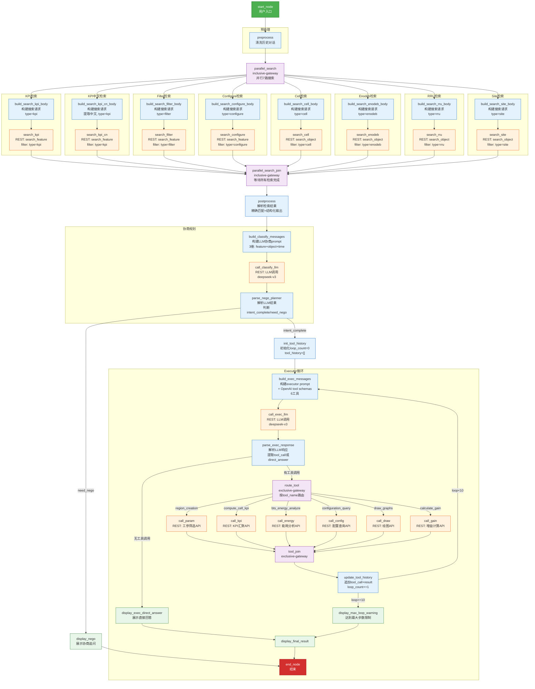
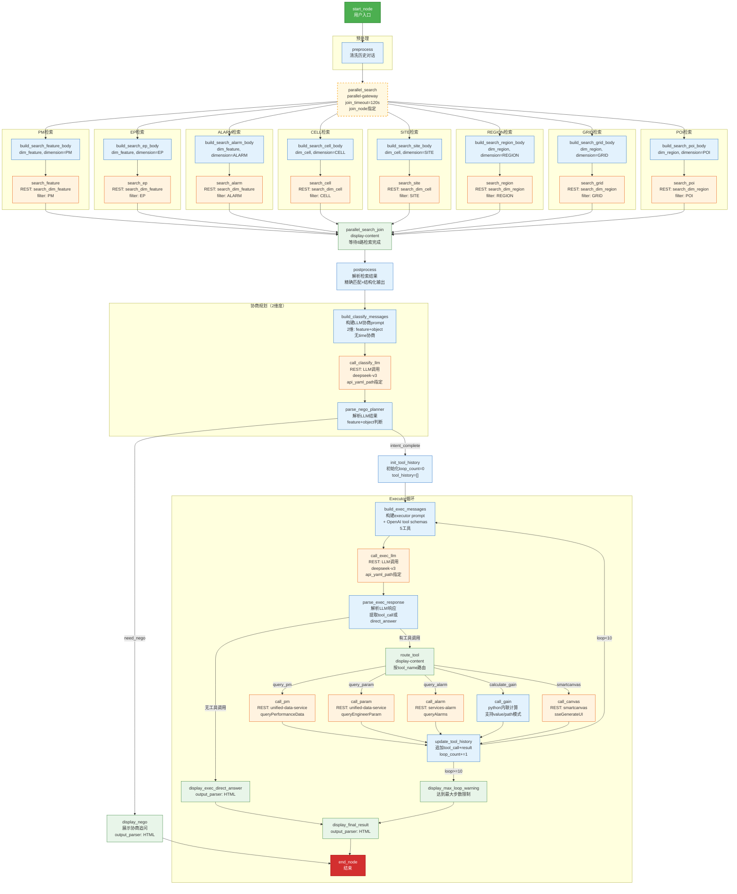

# Recipe 工作流 Mermaid 流程图

> 注意：本文件比较的是 `930LUI/old_tool` 与 `930LUI/new_tool` 下的历史草稿，不代表 `aicoservice@27.68.169` 运行包中的 Recipe。完整包内当前版本实际为 31 个节点、7 个并行检索调用、4 类 Executor 动作、最多 4 轮工具循环；请以 [`aicoservice_import/pod-recipe-invocation.md`](./aicoservice_import/pod-recipe-invocation.md) 和包内 [`WATT_PLEX.yaml`](./aicoservice@27.68.169/agents/aico-agent-m/zh_CN/recipes/WATT_PLEX.yaml) 为准。

## 1. old_tool/old_recipe.yaml（WATT_Old_Tool_Test_v1）

---

## 2. new_tool/new_tool/WATT_PLEX.yaml（WATT_PLEX）

## 主要差异对比

| 特性 | old_tool | new_tool |
|------|----------|----------|
| **并行网关** | `inclusive-gateway`（无超时） | `parallel-gateway`（有 join_timeout + join_node） |
| **搜索路数** | 8 路（含 kpi_cn） | 8 路（PM/EP/ALARM/CELL/SITE/REGION/GRID/POI） |
| **协商维度** | 3 维（feature + object + time） | 2 维（feature + object，无 time） |
| **Executor 工具数** | 6 工具 | 5 工具 |
| **工具架构** | 旧老 API（独立 yaml） | 统一数据服务 unified-data-service |
| **新增功能** | — | 告警查询、区域/网格/POI 搜索、smartcanvas 画图 |
| **去除功能** | — | 配置查询、BTS 能耗分析、独立绘图 |
| **路由节点** | `exclusive-gateway` | `display-content` |
| **api_yaml_path** | 无 | 每个 REST 调用显式指定 |
| **output_parser** | 仅部分节点 | display 节点更多使用 HTML output_parser |
