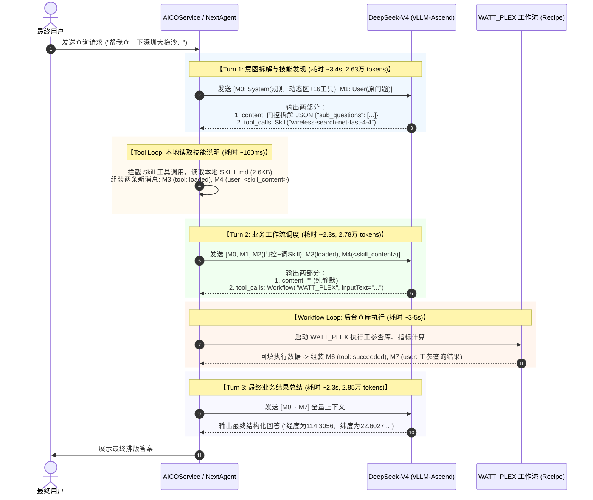

# AICOService Prompt 架构性能分析与 Prefix Cache 优化实践 Wiki

> **文档版本**：v1.0  
> **生效时间**：2026-09-10  
> **适用范围**：AICOService 意图座舱（RAN Agent）、NextAgent 上下文引擎、vLLM-Ascend（DSV4 推理集群）  
> **关联文档**：
> - [AICOService_Prompt架构设计与工程实践Wiki.md](./AICOService_Prompt架构设计与工程实践Wiki.md)
> - [AICOService_Recipe节点调用与执行机制Wiki.md](./AICOService_Recipe节点调用与执行机制Wiki.md)

---

## 一、 概述与背景

AICOService 统一意图座舱智能体（RAN Agent）底层依托 **DeepSeek-V4 (dsv4)** 模型，并在华为昇腾 NPU 集群上通过 **vLLM-Ascend**（版本 `vllm-0.25.1-tp8-ep-6a86046c`）对外提供推理服务。

在工参问数与网络排障等核心业务链路中，Prompt 的组装范式与底层大模型的 **前缀缓存机制（Prefix Cache / APC）** 强相关。本文基于 `deepseek0731` 与 `dsv_modify_0814` 两期现网压测真实日志，深入剖析：
1. **多轮对话的物理组装与逐层回填方式**；
2. **各轮次（Turn 1 / Turn 2 / Turn 3）在模型输入输出层面的详细内容组成**；
3. **当前 Prompt 组织形式中限制性能与破坏缓存的 5 大瓶颈**；
4. **端到端节省 3 秒时延、最大化发挥 Prefix Cache 的架构重构方案**。

---

## 二、 当前 Prompt 与多轮对话的物理组装全景

在 AICOService 中，一次典型的工参问数任务（如用户询问 *“帮我查一下深圳大梅沙D-HRH-2小区的经度、纬度和方位角”*）需要经历 **3 轮大模型调用（Turn 1 $\to$ Turn 2 $\to$ Turn 3）**。

### 2.1 多轮对话流转时序全景



---

### 2.2 Turn 1 / Turn 2 / Turn 3 内容组成细节拆解

#### 1. Turn 1：意图拆解与技能加载发起
* **输入 Prompt 结构（共 2 条消息 + 顶层 Tools）**：
  * **`messages[0]` (system，42,474 字符)**：
    * **稳定区（39,175 字符，约 24,000 tokens）**：包含 `identity`（RAN Agent 身份）、`system`（行为底座）、`task_approach`（56KB 任务 SOP，强制输出 `sub_questions`）、`communication_style`、`action_safety` 等 100% 静态不变的内容；
    * **分界符**：`---[CACHE_BOUNDARY]---`（普通字符串）；
    * **动态区（3,299 字符，约 800 tokens）**：注入 `date=2026-08-14`、操作系统内核版本字符串，以及 `skill_disclosure`（简要列出 `wireless-search-net-fast-4-4`、`knowledge-qa`、`skill-creator` 3 个技能的元数据）与子代理 `network-explorer` 声明；
  * **`tools`（顶层参数，共 38,318 字符，约 2,500 tokens）**：
    * 包含 16 个工具的完整 JSON Schema（`Read`, `Write`, `Glob`, `Grep`, `Bash`, `Python`, `Edit`, `Rag`, `Skill`, `AskUserQuestion`, `Agent`, `ToolSearch`, `TodoWrite`, `Workflow`, `ApiCall`, `Cron`）；
    * **Tokenizer 物理排布**：经 Chat Template 渲染后，工具 Schema 被自动转换为 `## Tools` 章节，**拼接在 `messages[0]` 之后、用户提问之前**。
  * **`messages[1]` (user，约 30 字符)**：
    * 用户原始提问，如：*“帮我查一下深圳大梅沙D-HRH-2小区的经度、纬度和方位角。”*
* **模型输出**：
  * `content`（约 115 字符）：输出标准化的门控 JSON：
    ```json
    {"sub_questions":[{"sub_question":"查询深圳大梅沙D-HRH-2小区的经度、纬度和方位角","type":"基础数据查询","strategy_intent":"","scene":""}]}
    ```
  * `tool_calls`：调用框架元工具 `Skill`：
    ```json
    {"name": "Skill", "arguments": "{\"name\": \"wireless-search-net-fast-4-4\", \"args\": {\"question\": \"查询深圳大梅沙D-HRH-2小区的经度、纬度和方位角\"}}"}
    ```

#### 2. Turn 2：业务工作流触发
在 Turn 1 完成后，NextAgent 拦截 `Skill` 调用，在本地读取 `SKILL.md`（共 2,598 字符），在 160ms 内完成上下文组装并触发 Turn 2。
* **输入 Prompt 结构（共 5 条消息）**：
  * **`messages[0]` (system)**：与 Turn 1 **100% 完全相同**（42,474 字符）；
  * **`tools`**：与 Turn 1 **100% 完全相同**（38,318 字符）；
  * **`messages[1]` (user)**：与 Turn 1 **100% 完全相同**（用户原始问题）；
  * **`messages[2]` (assistant)**【Turn 2 新增】：Turn 1 模型的完整输出（门控拆解 JSON + `Skill` 工具调用入参）；
  * **`messages[3]` (tool)**【Turn 2 新增】：内核工具确认帧：
    ```json
    {"name":"wireless-search-net-fast-4-4","status":"loaded","capabilityResult":{"metadata":{"agenticSkillLoaded":true}}}
    ```
  * **`messages[4]` (user)**【Turn 2 新增】：**内核将 2.6KB 的《无线查数操作手册》伪装成 `user` 角色硬塞进上下文**：
    ```markdown
    <skill_content name="wireless-search-net-fast-4-4">
    # wireless-search-net-fast
    你是无线网络数据查询智能体。
    所有需要访问无线网络数据的请求，统一调用 Workflow recipe: WATT_PLEX
    ...
    </skill_content>
    ```
* **模型输出**：
  * `content`：`""`（完全静默，不输出多余自然语言）；
  * `tool_calls`：模型读完手册，发起真正的工参查询工具调用：
    ```json
    {"name": "Workflow", "arguments": "{\"recipeName\": \"WATT_PLEX\", \"inputText\": \"查询深圳大梅沙D-HRH-2小区的经度、纬度和方位角\", \"inputVariables\": {}}"}
    ```

#### 3. Turn 3：最终结果总结
底座 WATT_PLEX 工作流执行完毕后，回填 `messages[5]`（assistant 调用记录）、`messages[6]`（tool 执行状态 `status: succeeded`）和 `messages[7]`（user 角色回填的工参数据）。
* **输入 Prompt 结构**：共 8 条消息（M0 ~ M7 全量上下文，约 28,485 tokens）。
* **模型输出**：
  * `tool_calls`：无（`count = 0`）；
  * `content`：最终面向用户的 Markdown 业务排版回答（结合经度、纬度、方位角指标）。

---

### 2.3 真实日志量化对照矩阵（dsv4_3 基准）

| 轮次 (Turn) | 消息数 (Msgs) | 输入 Prompt 规模 | TTFT 均值 | TTFT 中位数 | 总耗时均值 | 模型产生动作 |
| :--- | :---: | :---: | :---: | :---: | :---: | :--- |
| **Turn 1** | 2 条 | 26,369 tokens | **1832.2 ms** | 1828.3 ms | **3404.7 ms** | 门控 JSON + 调 `Skill`（元操作） |
| **Turn 2** | 5 条 | 27,819 tokens | **1632.6 ms** | 1599.8 ms | **2273.9 ms** | 调 `Workflow`（实操作，查工参） |
| **Turn 3** | 8 条 | 28,485 tokens | **1655.2 ms** | 1638.0 ms | **2476.3 ms** | 最终自然语言总结回答 |

> **关键数据发现**：
> - Turn 2 与 Turn 3 相比 Turn 1 输入增加了 1,500 ~ 2,100 tokens，但 **TTFT 反而下降了约 200ms**（皮尔逊相关系数 $r = -0.6018$）；
> - **原因**：单会话内，Turn 2 严格继承了 Turn 1 的前缀（`messages[0..1]`），vLLM 只需对新增的 1,400 tokens 做增量 Prefill，完全复用了前序的 KV-Cache。

---

## 三、 当前 Prompt 组织模式的性能瓶颈与根因分析

结合日志与底层推理引擎机制，当前设计在以下 5 个方面存在显著的性能损耗和架构硬伤：

### 1. 动态时间戳“夹心”陷阱（跨天 / 跨节点缓存雪崩）

#### 物理错位原理
在进入 Tokenizer 的渲染文本中，顺序为：
```text
[稳定区 24,000 tokens] 
       ↓
[---[CACHE_BOUNDARY]---]  （普通字符串）
       ↓
[date=2026-08-14; linux 6.6.0...]  <──【动态断裂点！】
       ↓
[16 个工具的完整 JSON Schema (38KB，约 2,500 tokens)]  <──【静态工具，被动陪葬】
       ↓
[用户问题]
```
#### 影响：
* vLLM 的 Automatic Prefix Caching (APC) 是从 Token 0 开始严格逐词比对的“拉链式”匹配；
* **跨天时**：当系统时间从 `2026-08-14` 跨越到 `2026-08-15`，`date` 产生首个不同 Token。这直接导致**排在 `date` 之后的 38KB（约 2,500 tokens）工具定义全部遭遇 Cache Miss**，白白浪费数千 Token 的 Prefill 算力；
* **跨节点调度时**：环境字符串中包含操作系统内核和时区（`linux 6.6.0... America/Chicago`）。若容器集群将请求轮询分发到不同镜像或时区的 Pod，缓存命中率会产生严重抖动。

---

### 2. Turn 1 与 Turn 2 两阶段串联导致的“无谓空转时延”

#### 事实分析：
在当前全部 60 道工参测试题目中，**100% 的题目全部唯一指向 `wireless-search-net-fast-4-4`**。
* 在 Turn 1 中，模型并没有去查任何数据，它跑完 2.6 万 tokens 的推理，仅仅是为了发出一句 `Skill("wireless-search-net-fast-4-4")` 让框架去磁盘读文档；
* 底座花了 160ms 把文档塞进上下文，模型在 Turn 2 又重新推理一遍，才真正发起 `Workflow("WATT_PLEX")`；
* **代价**：为了这套“动态按需加载”的形式主义，**每次查询平白无故多消耗了一整轮 LLM 交互，增加约 3.4 秒的端到端时延！**

---

### 3. 同一模型实例混跑导致的 KV-Cache 频繁逐出（Cache Thrashing）

#### 日志实测证明（07:26:22 ~ 07:26:40 时间线）：
单台 `dsv4` 实例同时挂载了 AICO Agent 和 Workflow Recipe，两者请求频繁交织：
```text
[07:26:22] AICO Turn 1   (吃掉 26,300 tokens 显存块)
[07:26:25] AICO Turn 2   (吃掉 27,800 tokens 显存块)
[07:26:29] RECIPE # 任务 ──► 【插队】写入 3,500 tokens 无 System 的全新前缀！
[07:26:36] AICO Turn 3   (试图读取 Turn 2 缓存)
[07:26:38] RECIPE 问题推荐 ─► 【持续 4.1s】强行塞入 10,000 tokens 全新上下文！
[07:26:39] AICO 下一题 Turn 1 ──► 遭遇显存不足与排队，TTFT 飙升至 1824ms！
```
* **影响**：AICO 单次请求就吃掉近 2.8 万 tokens 的 KV-Cache，显存池本就紧张。Recipe 节点高频插队完全不相干的大请求，极易触发 vLLM 的 **LRU 缓存逐出机制**，导致 AICO 的缓存前缀被反复冲刷。

---

### 4. 高频技能手册跨会话无法共享 Prefix Cache

* 2.6KB 的《无线查数手册》（`wireless-search-net-fast-4-4`）是在 Turn 2 中通过 `messages[4]`（user 角色）追加在用户提问之后的；
* **跨题目对比**：
  * 题目 1 的 Turn 2：`[M0] -> [M1: 查大梅沙] -> [M2..M3] -> [M4: 2.6KB 查数手册]`
  * 题目 2 的 Turn 2：`[M0] -> [M1: 看天麓八区] -> [M2..M3] -> [M4: 2.6KB 查数手册]`
* **因为题目 1 和题目 2 的用户问题不同，Token 序列在 `M1` 就彻底分叉断裂了！**
* **后果**：这篇在 60 道题里一字不差的 2.6KB 静态规则，在每一道题的 Turn 2 里，都被底层 NPU **从头冷算（Prefill）了整整 60 遍**。

---

### 5. 工具定义清单严重冗余（38KB 的显存包袱）

* 系统在 `request_body.tools` 中全量注册了 16 个工具，描述极其冗长（仅 `Bash`、`Cron`、`AskUserQuestion` 三个工具的描述就突破 9,000 字符，总计 38,318 字符，占约 2,500 tokens）；
* **在实际工参问数业务中，模型 100% 只会用到 `Skill` 和 `Workflow`，其余 14 个工具从未被调用**；
* 这 2,500 tokens 的无关工具 Schema，白白挤占了有限的 NPU 显存池，降低了单卡的并发承载力，加剧了 Cache 逐出风险。

---

## 四、 架构重构与性能优化落地方案

针对上述痛点，提出以下 4 项“低改造成本、极高收益”的优化方案：

### 方案 1：高频技能前置内联，单轮直调（立减 3.4 秒，推荐度：极高）

#### 重构思路：
在网优意图座舱中，将高频的无线查数业务与理论问答规则**直接扁平化内联写入 System Prompt 稳定区（`messages[0]`）**，模型遇到查数直接发起 `Workflow("WATT_PLEX")`。

#### 改造前后对比：
```text
【原 3 轮流程】
User 提问 ──► Turn 1 (调Skill读文档, 3.4s) ──► Turn 2 (调Workflow查数, 2.3s) ──► Turn 3 (总结, 2.3s) = 总计 ~8.0s

【新 2 轮流程】
User 提问 ──► Turn 1 (直接调Workflow查数, 2.8s) ─────────────────────────────► Turn 2 (总结, 2.3s) = 总计 ~5.1s
```

#### System Prompt 扁平化注入示例（写入 `task_approach`）：
```markdown
# 业务执行与工具路由规范

根据用户提问，先输出 sub_questions 意图拆解 JSON，然后按以下规则直接调用工具：

### 1. 现网数据/工参/指标查询（核心业务）
当用户查询小区、基站、经纬度、方位角、下倾角、PRB利用率、告警等现网数据时：
- 严格调用工具: `Workflow`
- 参数规范:
  - `recipeName`: "WATT_PLEX"
  - `inputText`: 结合上下文补全后的独立查询问题
  - `inputVariables`: {}

### 2. 理论知识问答（非实时数据）
当用户询问 ICT 概念、设备原理、排障流程说明时：
- 严格调用工具: `Rag` 检索知识库，严禁调用 Workflow。
```

#### 收益：
1. **端到端模型耗时立减 3.4 秒**（缩短近 40% 的模型时延）；
2. **2.6KB 技能正文转为全局永久缓存**：从 `M4` 前移到了 `M0`（User 提问之前），全天跨会话 100% 命中 Prefix Cache；
3. **完全保留业务规范**：模型在 Turn 1 依然同时吐出 `sub_questions` JSON，业务契约零破坏。

---

### 方案 2：消除“变量夹心”，动态环境变量沉底

#### 重构思路：
将 `date`、操作系统信息等动态内容，从 System Prompt 中间移至最尾部。

```text
【改造前】
[24k 稳定区] ──► [date/OS (动态)] ──► [38KB 工具 Schema (静态)] ──► [User 提问]
                                       └── 跨天时被连累，全量 Cache Miss

【改造后】
[24k 稳定区] ──► [38KB 工具 Schema (静态)] ──► [date/OS (动态)] ──► [User 提问]
                 └─────────────────────────┘
                      形成 26.5k 永久连续前缀，跨天/跨环境 100% 缓存命中！
```
* **实施细节**：甚至可以将系统日期转换为用户消息末尾的只读标签：
  ```markdown
  帮我查一下深圳大梅沙D-HRH-2小区的经度、纬度和方位角。
  <system-context date="2026-08-14"/>
  ```
* **收益**：彻底消除每日零点的冷启动时延尖刺。

---

### 方案 3：工具 Schema 按需裁剪（Prompt 瘦身 2,500 tokens）

* **做法**：在网优座舱对应的 `agent.yaml` 中，对工具清单执行白名单过滤；
* **动作**：仅为 RAN Agent 保留 `Workflow`、`Skill`、`Rag`、`AskUserQuestion` 4 个必要工具，**剔除 `Bash`、`Python`、`Cron`、`TodoWrite` 等 12 个无关工具**；
* **收益**：单次请求直接精简约 **2,000 ~ 2,500 tokens**，大幅释放 NPU 显存，显著降低并发时的 Cache Eviction 概率。

---

### 方案 4：模型 Serving 实例物理隔离（保障 Cache 纯度）

* **做法**：将 AICO 主会话与 Recipe 工作流的推理请求分离到不同的后端实例（或不同的 vLLM 模型名 / 路由策略）；
* **收益**：AICO 独享 2.6 万 tokens 的专属 Prefix Cache 空间，彻底避免被 Recipe 节点的无关请求插队冲刷。

---

## 五、 总结与改造收益预估

| 优化维度 | 改造前现状 | 改造后预期 | 性能提升与核心收益 |
| :--- | :--- | :--- | :--- |
| **交互轮次** | 3 轮（调Skill $\to$ 调Workflow $\to$ 总结） | **2 轮**（直调Workflow $\to$ 总结） | **模型总时延由 ~8.0s 降至 ~5.1s（立省 3 秒左右）** |
| **Prefix Cache 范围** | 仅覆盖前 24,000 tokens（被 date 截断） | **覆盖超 26,500 tokens**（稳定区+核心技能+工具） | **跨天、跨会话 100% 命中静态前缀，消除冷启动抖动** |
| **显存块有效利用率** | 16 个冗余工具 + 混跑冲刷 | 4 个核心工具 + 实例隔离 | **单请求节省 2,000+ tokens 显存，杜绝 Cache 块频繁逐出** |
| **业务协议兼容性** | 满足硬门控 `sub_questions` | **完全保留** `sub_questions` 输出 | **前端与监控大盘零改造，无缝平滑升级** |
