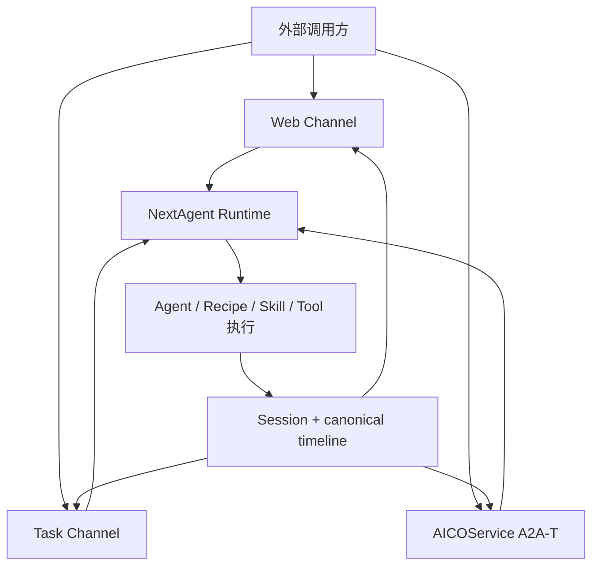
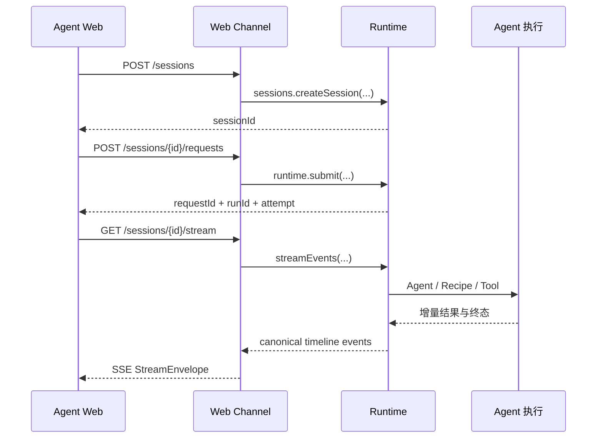
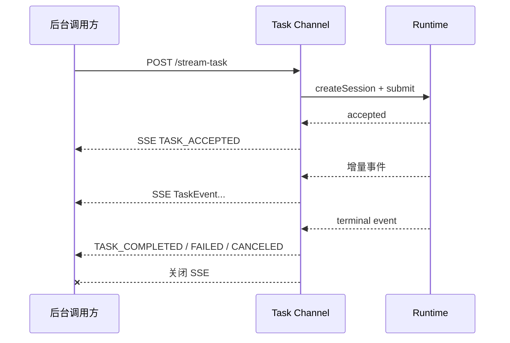
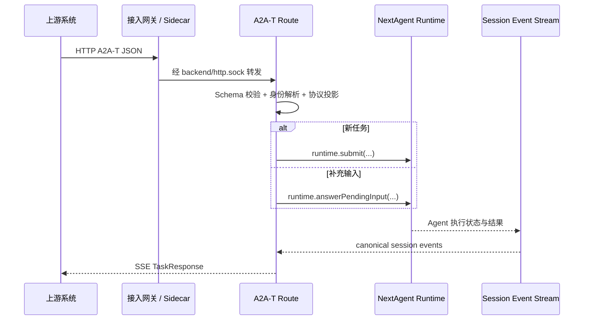

# NextAgent Agent Runtime 对外接口全景：Web Channel、Task Channel 与 A2A-T

> 文档版本：v1.0  
> 更新时间：2026-09-09  
> 适用对象：NextAgent / AICOService 开发、集成、测试与运维人员  
> 源码基线：`kelinbruce/aico_timedelay_anaylse`，commit `e9d205347ceb7dd56f4d5e73242bc76bfb5f6f34`

## 1. 先给结论

NextAgent Runtime 是 Agent 请求的**统一执行内核**；Web Channel、Task Channel 和 AICOService A2A-T 是位于 Runtime 外围的三种**协议接入适配器**。

- **Web Channel**：主要服务浏览器和交互式前端，采用“控制请求与事件订阅分离”的方式。客户端先提交请求，再通过 SSE 或 WebSocket 订阅 Session 事件。
- **Task Channel**：主要服务网管、告警、编排等后台系统，提供两种交付模式：POST 后直接返回 SSE 的 Stream Task，以及 JSON 控制响应加异步 callback 的 Async Task。
- **A2A-T**：AICOService 面向上游系统暴露的任务协议入口。A2A-T 是业务协议，HTTP 是传输载体，JSON Body 承载请求数据，SSE 返回 `TaskResponse` 事件。
- 三种 Channel 都只负责身份解析、参数校验、协议转换和安全投影，**不拥有 request lifecycle、canonical timeline、Session 真值或 terminal commit**；这些由 `agent-runtime` 负责。

最简化的整体关系如下：



一句话概括：

> Channel 决定“外部请求怎么进来、结果以什么协议出去”；Runtime 决定“请求如何排队、执行、暂停、重试、取消和提交终态”。

---

## 2. Agent Runtime 到底是什么

### 2.1 普通理解

可以把 Agent Runtime 理解成 NextAgent 的“任务操作系统”。它不是单个 HTTP 服务，也不是某个 Agent，而是负责管理一次 Agent 请求完整生命周期的执行底座。

外部系统不能把“调用某个 URL”直接等同于“执行 Agent”。URL 先进入某个 Channel，Channel 再调用 Runtime 的内部接口，Runtime 才真正接管任务。

### 2.2 工程实现

Runtime 的核心职责包括：

- 接受请求并固化 request/run 身份；
- 按 Session 管理请求排队和同会话并发；
- 维护 cancel、retry、edit、pending input 等状态转换；
- 驱动 Agent Core、Recipe、Skill、Tool 和 Model 调用；
- 写入 checkpoint、Session 状态和 canonical timeline；
- 完成 terminal commit，形成 `COMPLETED`、`FAILED`、`CANCELED`、`SUPERSEDED` 等终态；
- 向 Channel 提供事件订阅和历史读取能力。

Runtime 不负责浏览器 Cookie、A2A-T 报文、SSE framing 或 callback URL 投递。这些都是 Channel 的工作。

### 2.3 代码对应关系

| 模块 | 在链路中的位置 | 主要职责 |
| --- | --- | --- |
| `agent-channel-web` | Web 接入层 | HTTP 路由、SSE/WS、Web DTO 与安全投影 |
| `agent-channel-task` | 通用机机接入层 | Stream Task、Async Task、callback、Task DTO |
| AICOService A2A-T 路由 | AICOService 交付适配层 | A2A-T 校验、协议转换、`TaskResponse` SSE |
| `agent-runtime` | 生命周期内核 | submit、调度、取消、重试、checkpoint、终态提交、timeline |
| `agent-core` | Agent 编排层 | Agent 内部路由与推理编排 |
| `agent-session` | 会话领域层 | Session、Message 和 history read model |
| `agent-channel-common` | Channel 公共层 | 共享事件投影、identity context 等 |

典型内部调用不是直接访问数据库，而是通过 Runtime-facing port：

```text
HTTP route
  -> schema validation
  -> trusted identity / agent scope
  -> runtime.submit() / cancel() / retryLatest() / editLatest()
  -> runtime lifecycle
  -> canonical timeline
  -> channel projection
  -> HTTP JSON / SSE / WebSocket / callback
```

---

## 3. 三类接口的定位与差异

| 维度 | Web Channel | Task Channel | AICOService A2A-T |
| --- | --- | --- | --- |
| 主要消费者 | 浏览器、Agent Web、交互式用户 | 网管、告警、编排、后台服务 | AICOService 上游平台或 Agent 系统 |
| 接口前缀 | `/api/v1/...`；机机子集为 `/api/v1/ir/...` | `/api/v1/stream-task`、`/api/v1/async-tasks`、`/api/v1/tasks` | `/rest/naie/aicoservice/v1/a2at/...` |
| 请求输入 | REST JSON，附件先暂存 | JSON；部分 Stream Task 支持 multipart | A2A-T JSON Body |
| 流式返回 | 单独 GET SSE 或 WebSocket 订阅 | Stream Task 的 POST 直接返回 SSE | Task POST 直接返回 SSE |
| 非流式控制 | submit/cancel/retry/edit 等返回 JSON | Async Task 与公共控制端点返回 JSON | 以 A2A-T Task 交互为主 |
| 异步结果交付 | 客户端保持 SSE/WS 订阅或查询历史 | callback delivery | 当前已确认实现使用 SSE `TaskResponse` |
| Session 使用方式 | 显式创建/复用 Session，也有便捷提交入口 | create 时 Channel 自动创建 Session | Session 是内部执行状态载体 |
| 对外 ID | `sessionId`、`requestId`、`runId` 等 Web DTO | `taskId` 映射 runtime `requestId`，另保留 `sessionId` | 对外投影为 A2A-T Task/TaskResponse 坐标 |
| 内部执行入口 | Runtime-facing ports | Runtime-facing ports | `nextAgentApp.runtime` |
| 是否拥有执行生命周期 | 否 | 否 | 否 |

三者的差异主要来自**调用方和交付语义**，而不是存在三套 Agent 执行引擎。

---

## 4. Web Channel

### 4.1 普通理解

Web Channel 是为“人在网页里持续对话”设计的。浏览器需要维护会话、展示历史、实时渲染 token 和工具调用过程，还要支持取消、重试、编辑、附件、分享、收藏、记忆管理等 UI 能力。

因此它把一次交互拆成两条通道：

1. **命令通道**：用 REST 提交、取消、重试、编辑请求；
2. **事件通道**：用 SSE 或 WebSocket 持续接收 Runtime 事件。

### 4.2 主请求链路



关键点是：`POST .../requests` 成功只代表 Runtime 已接受请求，并不代表任务已经执行完成。真正的增量输出从 Stream 接口获得。

### 4.3 核心接口

#### Runtime 与健康检查

| 方法 | 路径 | 用途 |
| --- | --- | --- |
| GET | `/api/v1/runtime/bootstrap` | 获取前端应使用的 transport，例如 `SSE` 或 `WEBSOCKET` |
| GET | `/health`、`/health/deep` | 服务健康检查 |
| POST | `/api/v1/auth/local/login` | 本地认证登录并设置 Cookie |
| POST | `/api/v1/auth/local/logout` | 退出本地认证 |

#### Session 与请求控制

| 方法 | 路径 | 用途 |
| --- | --- | --- |
| GET / POST | `/api/v1/sessions` | 查询或创建 Session |
| PUT / DELETE | `/api/v1/sessions/{sessionId}/title`、`/api/v1/sessions/{sessionId}` | 修改标题、删除 Session |
| POST | `/api/v1/sessions/{sessionId}/requests` | 向已有 Session 提交请求 |
| POST | `/api/v1/requests` | 便捷提交；不传 `sessionId` 时先创建 Session |
| POST | `/api/v1/sessions/{sessionId}/cancel` | 取消最新请求 |
| POST | `/api/v1/sessions/{sessionId}/retry` | 重试最新请求 |
| POST | `/api/v1/sessions/{sessionId}/requests/latest/edit` | 编辑最新输入并重新执行 |
| POST | `/api/v1/sessions/{sessionId}/pending-inputs/{pendingInputId}/answer` | 回答运行中产生的补充问题 |

#### 流与历史

| 方法 | 路径 | 用途 |
| --- | --- | --- |
| GET | `/api/v1/sessions/{sessionId}/stream` | SSE 订阅 Session timeline |
| WS | `/api/v1/sessions/{sessionId}/ws` | WebSocket 订阅，同一 `StreamEnvelope` 语义 |
| GET | `/api/v1/sessions/{sessionId}/conversation` | 查询对话历史 |
| GET | `/api/v1/sessions/{sessionId}/conversation/preview` | 查询会话预览标记 |
| GET | `/api/v1/sessions/{sessionId}/runs/{runId}/events` | 查询某次 run 的事件历史 |

SSE 支持 `lastSeenSequence`，用于断线后从已消费 sequence 之后恢复；还可用 `requestId`、`runId` 限定订阅范围。Channel 只把 Runtime 的 canonical event 投影成安全的 `StreamEnvelope`，不保存一份平行的生命周期真值。

### 4.4 Web Channel 的扩展资源接口

Web Channel 还聚合了以下 UI/管理类能力：

- 文件上传、临时文件删除和下载；
- Skill、分类问题、高频问题和问题联想查询；
- 长期记忆的查询、新增、搜索、共享、复制、发布和删除；
- Cron Task、Background Task；
- Session 分享、运行标注、收藏；
- Session Activity SSE/WS 与 consume。

这些接口虽然都通过 Web Channel 暴露，但其领域状态仍由对应 Runtime-facing port 或领域服务拥有，Channel 只负责输入边界和 DTO 投影。

### 4.5 Web Channel 的 IR surface

Web Channel 还可将一组最小接口注册到 `/api/v1/ir`，供外部系统以 trusted header 方式调用：

```text
POST /api/v1/ir/sessions
POST /api/v1/ir/sessions/{sessionId}/requests
GET  /api/v1/ir/sessions/{sessionId}/stream
POST /api/v1/ir/sessions/{sessionId}/cancel
POST /api/v1/ir/sessions/{sessionId}/retry
POST /api/v1/ir/sessions/{sessionId}/pending-inputs/{pendingInputId}/answer
```

IR surface 与普通 Web ER surface 复用相同 DTO、Runtime port 和事件语义，但认证入口不同：

- ER 主要使用 Cookie；
- IR 读取上游网关注入的 `x-tenant-id`、`x-subject-id`、`x-display-name`；
- `agentId` 不允许由客户端 Header 或 Body 覆盖。

> 注意：这里的 `/api/v1/ir` 是**入站 HTTP 路由前缀**，不是 `/opt/sidecar/ir/http.sock`。

---

## 5. Task Channel

### 5.1 普通理解

Task Channel 是给系统调用系统使用的“任务接口”。它不要求调用方模拟浏览器会话页面，而是围绕 task 的创建、编辑、重试、取消、查询和补充输入组织协议。

当前实现包含 9 个端点，分成三棵路由树：

```text
/api/v1/stream-task   -> POST 直接返回 SSE
/api/v1/async-tasks   -> 先返回 JSON，事件随后 callback
/api/v1/tasks         -> cancel / query / pending-input answer
```

### 5.2 Stream Task

| 方法 | 路径 | 用途 |
| --- | --- | --- |
| POST | `/api/v1/stream-task` | 创建单个 task，直接返回 SSE |
| POST | `/api/v1/stream-task/{taskId}/edit` | 编辑任务输入，直接返回 SSE |
| POST | `/api/v1/stream-task/{taskId}/retry` | 重试任务，直接返回 SSE |

这三个接口把“命令提交”和“结果订阅”合并在同一个 HTTP 请求中：



与 Web Channel 最明显的区别是：

- Web：`POST submit` 返回 JSON，然后 `GET stream` 二次订阅；
- Stream Task：`POST` 的 response body 本身就是 SSE，无需二次订阅。

### 5.3 Async Task

| 方法 | 路径 | 用途 |
| --- | --- | --- |
| POST | `/api/v1/async-tasks` | 异步批量创建 task |
| POST | `/api/v1/async-tasks/edit` | 异步批量编辑 task |
| POST | `/api/v1/async-tasks/retry` | 异步批量重试 task |

Async Task 的交互分成两步：

1. 接口先返回 JSON 控制结果，例如 task 是否已接受；
2. Runtime 事件产生后，由 `TaskCallbackDeliveryPort` 以固定 POST JSON 协议投递到 `callbackTarget`。

Async Task 适用于：

- 任务耗时较长，不希望调用方维持长连接；
- 调用方已有 webhook/callback 接收能力；
- 需要一次批量提交多个任务；
- 需要之后通过 query 进行对账恢复。

如果 callback delivery 未配置，异步入口返回 `503 ASYNC_CALLBACK_UNAVAILABLE`，不会伪装成已具备异步交付能力。

### 5.4 公共控制端点

| 方法 | 路径 | 用途 |
| --- | --- | --- |
| POST | `/api/v1/tasks/cancel` | 批量取消任务 |
| POST | `/api/v1/tasks/query` | 批量查询状态和终态结果 |
| POST | `/api/v1/tasks/pending-inputs/answer` | 批量回答 pending input |

批量端点允许单项失败而不阻塞其他项；只有全部项失败时整体返回 HTTP 400，但响应仍保留每一项的处理结果。

### 5.5 Task 与 Runtime 身份的映射

Task Channel 对外使用的 `taskId` 实际映射 Runtime 的 `requestId`。它同时保留 `sessionId`，但不暴露 `runId`、`contextId` 等内部诊断坐标。

```text
Task Channel taskId  == Runtime requestId
Task Channel sessionId == Runtime sessionId
```

create 时由 Channel 自动创建新的 Session，不接受调用方传入 `sessionId`；后续 edit/retry/cancel/query/answer 使用 `sessionId` 定位已有任务所属 Session。

内部调用关系大致为：

| 外部操作 | Runtime-facing 调用 |
| --- | --- |
| create | `sessions.createSession(...)` + `runtime.submit(...)` |
| edit | `runtime.editLatest(...)` |
| retry | `runtime.retryLatest(...)` |
| cancel | `runtime.cancel(...)` |
| answer pending input | `runtime.answerPendingInput(...)` |

### 5.6 TaskEvent

Stream SSE 和 Async callback 共享统一的 `TaskEvent` 结构，核心字段包括：

```text
eventId
eventType
sessionId
taskId
sequence
createdAt
payload
```

常见事件：

- `TASK_ACCEPTED`
- `THINKING_DELTA`
- `CONTENT_DELTA`
- `CAPABILITY_STARTED`
- `CAPABILITY_RESULT_DELTA`
- `CAPABILITY_COMPLETED`
- `USER_INPUT_REQUIRED`
- `TASK_COMPLETED`
- `TASK_FAILED`
- `TASK_CANCELED`
- `TASK_SUPERSEDED`

其中 `TASK_COMPLETED`、`TASK_FAILED`、`TASK_CANCELED`、`TASK_SUPERSEDED` 是终态事件。Stream Task 在发送终态事件后关闭 SSE。

Channel 会过滤 `BACKGROUND_TASK_STARTED`、`BACKGROUND_TASK_COMPLETED`、`BACKGROUND_TASK_FAILED` 和 `OUTPUT_GUARD_BLOCKED` 这四类内部事件，不向 Task 消费方投影。

---

## 6. AICOService A2A-T

### 6.1 A2A-T 是什么

A2A-T 是 AICOService 对外的任务型协议入口。它不是第二套 Runtime，也不是独立的 Agent 执行服务。

需要区分四个概念：

| 概念 | 含义 |
| --- | --- |
| A2A-T | 外部任务协议和业务报文语义 |
| HTTP POST | 承载 A2A-T 请求的传输方式 |
| JSON Body | 实际的 A2A-T 请求数据 |
| SSE | 持续返回 A2A-T `TaskResponse` 的响应方式 |

已确认的主入口为：

```http
POST /rest/naie/aicoservice/v1/a2at/task
Content-Type: application/json
Accept: text/event-stream
```

取消路由由 `registerA2atTaskCancelRoute(...)` 注册，对外交付路径为：

```http
POST /rest/naie/aicoservice/v1/a2at/task/cancel
```

具体请求字段应以当前交付包中的 `A2atTaskRequestSchema` 和 cancel schema 为准，不应根据通用 Task Channel DTO 猜测。

### 6.2 A2A-T 的内部请求链路



路由内部核心步骤为：

1. 使用 A2A-T Schema 校验 HTTP Body；
2. 把请求投影为内部 `SUBMIT` 或 `ANSWER_PENDING` 操作；
3. 新任务调用 `runtime.submit(...)`；
4. 补充输入调用 `runtime.answerPendingInput(...)`；
5. 订阅 Session 事件流；
6. 将内部事件投影为 A2A-T `TaskResponse`；
7. 通过 SSE 返回，并约每 30 秒发送一次 heartbeat；
8. 到达终态或 `USER_INPUT_REQUIRED` 时结束本次流。

`USER_INPUT_REQUIRED` 结束本次 SSE 并不表示任务失败，而是当前 run 已进入等待外部补充输入的阻塞点；调用方提交答案后，Runtime 从 pending 状态继续推进。

### 6.3 `nextAgentApp.runtime` 怎么理解

AICOService `start.js` 中会构造类似依赖：

```js
const a2atDependencies = {
  runtime: nextAgentApp.runtime,
  sessions: nextAgentApp.runtime,
  identityResolver,
  defaultAgentId: 'AICOServiceAgent',
  executionCorrelation,
};
```

这里不是重新启动一个 Runtime，而是把已经创建好的 Runtime 对象注入 A2A-T 路由：

- `runtime`：提供 submit、cancel、answer 等执行入口；
- `sessions`：同一个对象还实现 Session 查找、状态读取和事件订阅接口；
- `identityResolver`：提供 tenant/subject/displayName；
- `defaultAgentId`：请求未指定 Agent 时使用 `AICOServiceAgent`；
- `executionCorrelation`：把外部任务、Session、日志和 Trace 关联起来。

因此应把它理解为**一个对象实现多个 Runtime-facing port，并通过依赖注入供路由调用**。

### 6.4 `start.js` 在 A2A-T 链路中的位置

`start.js` 是 AICOService 的进程启动入口和装配中心。典型启动与注册顺序是：

```text
start.sh
  -> node start.js
  -> startRemoteRuntimePackage(...)
  -> beforeStart(nextAgentApp)
       -> 初始化数据库、日志、Trace、同步服务
       -> registerA2atTaskForwardRoute(...)
       -> registerA2atTaskCancelRoute(...)
       -> registerPubRoute(...)
  -> HTTP/UDS Server 开始监听
```

`start.js` 负责“把 Runtime、依赖和路由装起来”，不负责在文件内亲自执行 Agent 推理。

### 6.5 A2A-T 与通用 Task Channel 不是一回事

二者都面向任务型机机调用，也都最终进入 Runtime，因此非常容易混淆。但它们属于不同的外部契约：

| 维度 | 通用 Task Channel | AICOService A2A-T |
| --- | --- | --- |
| 实现位置 | `agent-channel-task` | AICOService 交付适配包中的 A2A-T routes |
| 路径 | `/api/v1/stream-task`、`/async-tasks`、`/tasks` | `/rest/naie/aicoservice/v1/a2at/...` |
| 对外事件 | `TaskEvent` | A2A-T `TaskResponse` |
| 异步模式 | SSE 或 callback | 当前已确认链路为 SSE |
| Schema | Task Channel DTO | `A2atTaskRequestSchema` 等 A2A-T Schema |
| Runtime | 同一个 NextAgent Runtime | 同一个 NextAgent Runtime |

不能拿通用 Task Channel 的请求 JSON 直接调用 A2A-T，也不能只替换 URL 就认为协议兼容。

---

## 7. UDS 与接口路径的关系

在 SOP 部署中，AICOService 使用 UDS 与平台 Sidecar 通信。需要区分入口和出口：

| Socket | 方向 | 谁监听 | 主要用途 |
| --- | --- | --- | --- |
| `/opt/sidecar/backend/http.sock` | 入站 | AICOService Fastify/HTTP Server | 网关把 Web/A2A-T 等外部 HTTP 请求送入业务进程 |
| `/opt/sidecar/ir/http.sock` | 出站 | IR Sidecar | AICOService 调用 Model Gateway、Remote Sandbox 等平台能力 |

因此，一次 A2A-T 请求可能形成下面的链路：

```text
外部调用方
  -> 平台接入网关
  -> /opt/sidecar/backend/http.sock
  -> A2A-T HTTP route
  -> runtime.submit()
  -> Agent / Recipe
  -> Model 或 Sandbox 调用
  -> /opt/sidecar/ir/http.sock
  -> 平台下游服务
```

UDS 只改变同节点进程之间的寻址和传输方式，不改变上层 HTTP method、URL path、JSON 或 SSE 的协议语义。也就是说，A2A-T 仍然是 HTTP/A2A-T 请求，只是网关到 AICOService 这一跳通过 Unix Domain Socket 传输。

---

## 8. OpenAPI / Swagger 文件如何理解

### 8.1 `index.yaml` 是什么

`docs/apis/swagger/index.yaml` 是 Swagger 2.0 的**聚合入口文件**。它负责声明：

- API 标题、版本、host、basePath、scheme；
- tag 分类；
- 全部公开 path；
- 公共 definition；
- 通过 `$ref` 引用拆分后的 YAML 文件。

它可以理解成整个接口文档的“目录和总装配文件”，而不是执行 HTTP 请求的代码。

当前 `index.yaml` 不只描述浏览器页面需要的接口，它还把通用 Task Channel 的 9 个端点聚合进同一份 Swagger。AICOService 交付特有的 `/rest/naie/aicoservice/v1/a2at/...` 并不在这份通用 NextAgent Web Swagger 中。

### 8.2 模块文件分工

```text
docs/apis/swagger/index.yaml
├── runtime.yaml          # bootstrap、health
├── auth.yaml             # 本地认证
├── session.yaml          # Session create/list/title/delete/fork
├── request-command.yaml  # submit/cancel/retry/edit/pending input
├── stream.yaml           # Session SSE StreamEnvelope
├── conversation.yaml     # 对话、preview、run event history
├── attachment.yaml       # 上传、临时文件、下载
├── memory.yaml           # 长期记忆管理
├── skill.yaml            # Skill catalog
├── question.yaml         # 分类/高频/联想问题
├── annotation.yaml       # 标注、收藏
├── background-task.yaml  # 后台任务
├── cron-task.yaml        # 定时任务
├── share.yaml            # 会话分享
├── session-activity.yaml # 跨会话活动流
├── task-channel.yaml     # Stream/Async/Control Task API
└── common.yaml           # 公共结构
```

`index.yaml` 中的引用形如：

```yaml
/api/v1/sessions/{sessionId}/requests:
  $ref: ./request-command.yaml#/paths/~1api~1v1~1sessions~1{sessionId}~1requests
```

含义是：总入口声明这个 path，但具体 method、请求字段、响应和错误结构放在 `request-command.yaml` 中维护。

### 8.3 YAML 与运行代码的关系

```text
OpenAPI YAML
  -> 描述“对外承诺什么”

packages/agent-channel-*/src/routes*.ts
  -> 实现“收到请求后怎么做”

packages/agent-channel-*/src/schemas/*.ts
  -> 运行时校验“输入输出是否符合契约”

contract / documentation alignment tests
  -> 防止文档、Schema 和实现发生漂移
```

所以不能只修改 `index.yaml` 就认为接口已经实现，也不能只改 route 而不更新 OpenAPI 契约。

---

## 9. 三条典型端到端链路

### 9.1 浏览器聊天

```text
Agent Web
  -> POST /api/v1/sessions
  -> POST /api/v1/sessions/{sessionId}/requests
  -> runtime.submit()
  -> Runtime / Agent / Recipe
  -> canonical timeline
  -> GET /api/v1/sessions/{sessionId}/stream
  -> SSE StreamEnvelope
```

### 9.2 告警平台发起后台任务

```text
Alarm Platform
  -> POST /api/v1/async-tasks
  -> createSession + runtime.submit()
  -> JSON TASK_ACCEPTED
  -> Runtime 执行
  -> TaskCallbackDeliveryPort
  -> callbackTarget 接收 TaskEvent
  -> POST /api/v1/tasks/query 对账
```

### 9.3 AICOService A2A-T

```text
上游 Agent / 平台
  -> POST /rest/naie/aicoservice/v1/a2at/task
  -> A2A-T route 校验与转换
  -> runtime.submit() / answerPendingInput()
  -> AICOServiceAgent / Recipe / Skill
  -> Session events
  -> A2A-T TaskResponse projection
  -> SSE 返回
```

---

## 10. 身份、作用域与安全边界

### 10.1 Owner Scope

Owner Scope 表示请求属于哪个租户和用户，必须来自可信 Channel/Auth 边界：

- Web ER：认证 Cookie；
- Web IR / Task Channel：网关注入的 `x-tenant-id`、`x-subject-id`、`x-display-name`；
- A2A-T：AICOService 注入的 `identityResolver`。

客户端 Body 不能覆盖 `tenantId` 或 `subjectId`。

### 10.2 Agent Scope

Agent Scope 决定使用哪个 Agent 配置、Prompt、Model Profile、Capability Binding 和 Agent-owned 数据。它来自可信 app composition、hosted-agent selection 或已持久化的 `Session.agentId`，不能由客户端 Header/Body 随意指定。

AICOService A2A-T 的默认 Agent 为 `AICOServiceAgent`。

### 10.3 安全投影

Channel 返回的是对外 DTO，不是 Runtime 内部对象的原样序列化。安全投影需要防止泄露：

- raw provider error；
- stack trace；
- prompt、模型原始输出或隐藏消息；
- credential、token、内部路径；
- Runtime 私有状态和数据库 Record。

这也是为什么 Web `StreamEnvelope`、Task `TaskEvent` 和 A2A-T `TaskResponse` 是三种独立的外部结构。

---

## 11. 常见误区

### 11.1 “AICOService 在执行，还是 NextAgent 在执行？”

AICOService 是运行在 NextAgent 框架上的业务应用；AICOService 提供 Agent、Prompt、Skill、Recipe 和 A2A-T 适配，NextAgent Runtime 承载生命周期和执行。二者是业务层与运行底座的关系，不是二选一。

### 11.2 “A2A-T URL 就是 Runtime 吗？”

不是。URL 是协议入口；`runtime.submit(...)` 才是进入内部执行生命周期的入口。

### 11.3 “Web、Task、A2A-T 各启动了一个 Runtime 吗？”

不是。它们可以被同一个应用装配，并共享同一个 Runtime 实例和 canonical Session/timeline。

### 11.4 “SSE 就是模型 token 流吗？”

不完全是。SSE 是传输方式，流中除了文本增量，还可以包含请求接受、能力调用、pending input、降级、失败和终态事件。

### 11.5 “Session 就是一条聊天记录吗？”

不只是。Session 还是请求归属、事件序列、运行状态、pending input 和历史读取的主要坐标。对话文本只是 Session 中的一类可见投影。

### 11.6 “`index.yaml` 是 Web 代码入口吗？”

不是。它是 Swagger/OpenAPI 文档入口；真正注册路由的是 `agent-channel-web`、`agent-channel-task` 或 AICOService 适配包中的 TypeScript/JavaScript 代码。

### 11.7 “`/api/v1/ir` 和 `/opt/sidecar/ir/http.sock` 是一回事吗？”

不是。前者是入站 URL 前缀，后者是 AICOService 调用模型、沙箱等平台能力时使用的出站 UDS。

---

## 12. 接口选型建议

| 场景 | 建议入口 | 原因 |
| --- | --- | --- |
| 浏览器聊天、持续展示过程 | Web Channel | Session/历史/UI 能力完整，支持 SSE/WS |
| 后台系统希望一个请求内持续收事件 | Stream Task | POST response 直接是 SSE，接入简单 |
| 长耗时批量任务、调用方支持 webhook | Async Task | 不维持长连接，支持 callback 和 query 对账 |
| AICOService 与上游平台按既有 A2A-T 契约集成 | A2A-T | 保持 A2A-T Schema 与 TaskResponse 语义 |
| 外部系统只需最小 Session/submit/stream 能力 | Web IR surface | 复用 Web DTO 和 Runtime 语义，接口集合受限 |

选型的核心不是“哪个接口性能更高”，而是调用方需要哪一种**会话模型、连接模型和结果交付模型**。

---

## 13. 源码阅读路径

### 13.1 Web Channel

```text
docs/apis/swagger/index.yaml
docs/apis/agent-web-api-list.md
openspec/designs/modules/agent-channel-web.md
packages/agent-channel-web/src/routes/requests.ts
packages/agent-channel-web/src/routes/stream.ts
packages/agent-channel-web/src/projections/stream-envelope.ts
packages/agent-channel-web/src/schemas/
```

### 13.2 Task Channel

```text
docs/apis/task-channel-api.md
docs/apis/swagger/task-channel.yaml
openspec/designs/modules/agent-channel-task.md
packages/agent-channel-task/src/routes.ts
packages/agent-channel-task/src/task-status.ts
packages/agent-channel-task/src/task-message.ts
packages/agent-channel-task/src/task-callback.ts
packages/agent-channel-task/src/http-task-callback.ts
```

### 13.3 AICOService A2A-T

在当前 AICOService 交付包中继续搜索：

```bash
rg -n "registerA2atTaskForwardRoute|registerA2atTaskCancelRoute" .
rg -n "A2atTaskRequestSchema|TaskResponse" .
rg -n "runtime\.submit|answerPendingInput" .
rg -n "UDS_ADDRESS|backend/http\.sock|ir/http\.sock" .
```

建议按以下顺序阅读：

1. `entrypoints/start.js`：看 Runtime 如何启动、路由如何装配；
2. `registerA2atTaskForwardRoute`：看 method、path、Schema 和依赖；
3. `task-forward.js`：看请求如何转换成 Runtime 调用；
4. `runtime.submit()`：看 request lifecycle；
5. Session event 与 `TaskResponse` projector：看内部状态如何变成对外事件。

---

## 14. 总结

理解 NextAgent 对外接口，最重要的是始终分清四层：

1. **传输层**：HTTP、UDS、SSE、WebSocket、callback；
2. **协议与 Channel 层**：Web DTO、TaskEvent、A2A-T TaskResponse；
3. **Runtime 生命周期层**：submit、cancel、retry、edit、pending input、timeline、terminal commit；
4. **Agent 执行层**：Agent、Prompt、Recipe、Skill、Tool、Model。

完整的一句话描述是：

> 外部请求先通过 Web Channel、Task Channel 或 A2A-T 进入服务；Channel 完成身份解析、Schema 校验与协议转换后调用 NextAgent Runtime；Runtime 驱动 AICOService Agent/Recipe/Skill 执行，并把产生的 canonical Session 事件交回 Channel，最终投影为 JSON、SSE、WebSocket 或 callback 响应。

## 参考资料

- `docs/apis/swagger/index.yaml`
- `docs/apis/agent-web-api-list.md`
- `docs/apis/task-channel-api.md`
- `docs/apis/swagger/task-channel.yaml`
- `openspec/designs/modules/agent-channel-web.md`
- `openspec/designs/modules/agent-channel-task.md`
- `packages/agent-channel-web/README.md`
- `packages/agent-channel-task/README.md`
- AICOService `start.js`、A2A-T route 与 SOP Deployment 配置的既有分析记录
