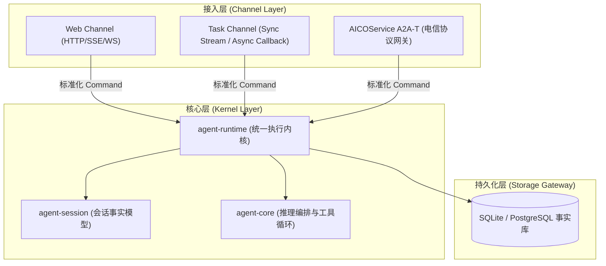
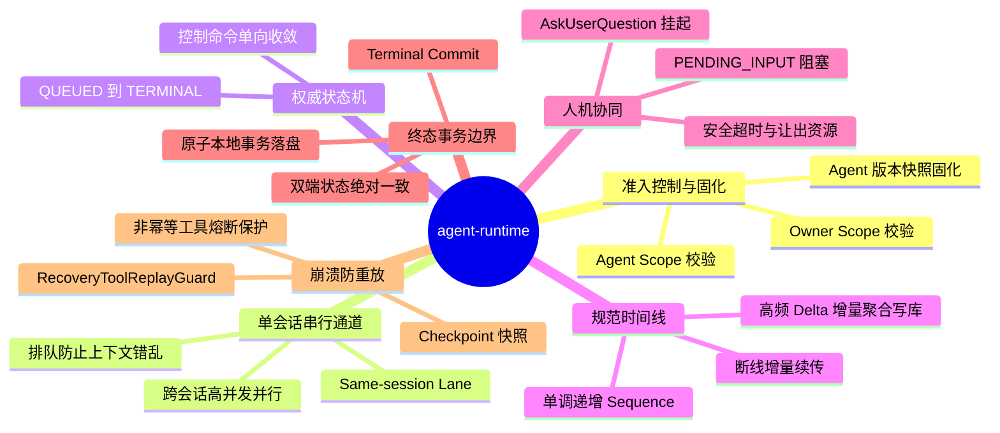
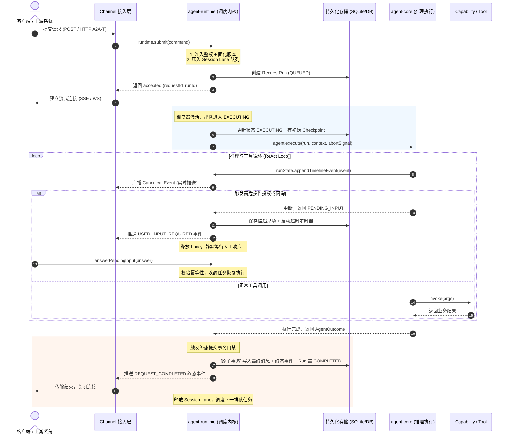
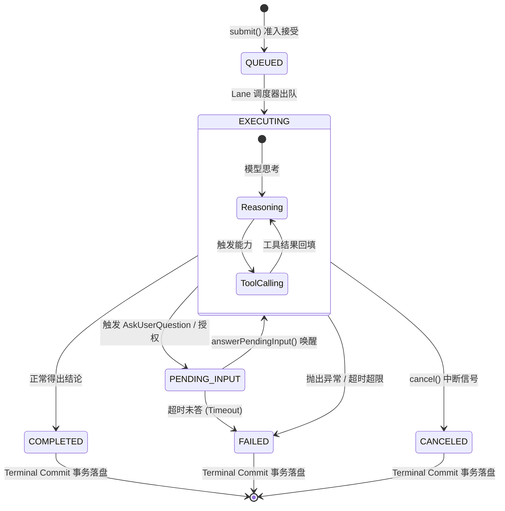

# NextAgent Agent Runtime 核心功能、工作机制与规格设计 Wiki

> **文档版本**：v1.0.0  
> **适用对象**：NextAgent / AICOService 架构师、系统设计人员、核心开发者与集成测试人员  
> **源码基线**：`nextagent/NextAgent/packages/agent-runtime`  
> **关联规格**：`openspec/designs/architecture/runtime-boundaries.md` ｜ `openspec/designs/architecture/runtime-recovery.md`

---

## 目录

- [一、 模块定位与架构本质](#一-模块定位与架构本质)
  - [1.1 核心定义：Agent 的“任务操作系统内核”](#11-核心定义agent-的任务操作系统内核)
  - [1.2 架构边界：Channel、Session 与 Runtime 的职责正交划分](#12-架构边界channelsession-与-runtime-的职责正交划分)
- [二、 Agent Runtime 七大核心功能全景](#二-agent-runtime-七大核心功能全景)
  - [2.1 准入控制与 Agent 版本固化](#21-准入控制与-agent-版本固化)
  - [2.2 单会话串行调度通道 (Same-session Lane)](#22-单会话串行调度通道-same-session-lane)
  - [2.3 权威生命周期状态机](#23-权威生命周期状态机)
  - [2.4 规范时间线与流式增量聚合 (Canonical Timeline)](#24-规范时间线与流式增量聚合-canonical-timeline)
  - [2.5 人机协同与阻塞态唤醒 (Pending Input & HITL)](#25-人机协同与阻塞态唤醒-pending-input--hitl)
  - [2.6 终态事务持久化边界 (Terminal Commit Boundary)](#26-终态事务持久化边界-terminal-commit-boundary)
  - [2.7 面向崩溃的高危工具防重放保护 (Tool Replay Guard)](#27-面向崩溃的高危工具防重放保护-tool-replay-guard)
- [三、 端到端工作机制与运行流转](#三-端到端工作机制与运行流转)
  - [3.1 请求生命周期的六阶段流转](#31-请求生命周期的六阶段流转)
  - [3.2 运行态关键状态迁移图](#32-运行态关键状态迁移图)
  - [3.3 信号分发与硬超时控制](#33-信号分发与硬超时控制)
- [四、 OpenSpec 规格设计与架构哲学](#四-openspec-规格设计与架构哲学)
  - [4.1 Spec-Driven 开发心智：代码是投影，规格是本质](#41-spec-driven-开发心智代码是投影规格是本质)
  - [4.2 必须坚守的四大架构不变式 (Invariants)](#42-必须坚守的四大架构不变式-invariants)
  - [4.3 契约优于实现：用 RFC 2119 消除工程模糊性](#43-契约优于实现用-rfc-2119-消除工程模糊性)
- [五、 关键工程实体与代码骨架速查](#五-关键工程实体与代码骨架速查)
  - [5.1 核心数据契约 (Contracts)](#51-核心数据契约-contracts)
  - [5.2 核心实现构件 (Key Classes & Functions)](#52-核心实现构件-key-classes--functions)
- [六、 总结与架构启示](#六-总结与架构启示)

---

## 一、 模块定位与架构本质

### 1.1 核心定义：Agent 的“任务操作系统内核”

在大模型（LLM）驱动的智能体系统开发中，最容易产生的误区是：把 Agent 简单当成一个不断收发文本的“聊天对话框”。

在电信运维、企业级后台自动化等工业场景中，**`agent-runtime` 从不将自己定位为“对话管理器”，而是定位为整个系统的“任务操作系统（Task OS）与统一调度内核”**。

* **大语言模型（LLM）** 是系统中的 **CPU**（负责执行推理算力与逻辑判断）。
* **`agent-core`** 是运行在系统中的 **用户态应用程序**（负责执行具体的业务算法与 ReAct 循环）。
* **`agent-runtime`** 则是底层的 **操作系统内核（OS Kernel）**——为不可靠的大模型推理和高危工具执行提供**进程管理、并发互斥、I/O 挂起、信号中断、故障恢复与事务落盘**等核心保障。

### 1.2 架构边界：Channel、Session 与 Runtime 的职责正交划分

系统在架构分层上严格贯彻单一职责原则（Single Responsibility）：

* **Channel 层（外部接入）**：决定“请求怎么进来、结果以什么协议返回”。只负责身份校验、参数反序列化与安全投影，**严禁拥有生命周期状态机**。
* **`agent-session`（会话领域）**：负责“会话与历史消息模型”。管理会话标题、消息列表（`SessionMessage`）、历史读模型与会话收藏。
* **`agent-runtime`（生命周期内核）**：负责“作业执行的确定性与韧性”。掌控任务排队、执行调度、现场断点、中断取消与终态提交。

---

## 二、 Agent Runtime 七大核心功能全景

### 2.1 准入控制与 Agent 版本固化
* **双 Scope 严格校验**：请求进入时，首先校验调用者身份是否满足 **Owner Scope**（租户 `tenantId`、用户 `subjectId`）与 **Agent Scope**（绑定的智能体作用域），防止越权操作。
* **装配快照固化（Assembly Snapshot）**：请求一旦被接受（Accepted），当前 Run 所绑定的 `agentId`、`agentVersion` 及配置立刻固化至 `RequestContext`。即便后续运维人员对全局配置进行热更新，正在运行的 Run 依旧按照启动时的装配版本稳定执行，杜绝运行期环境漂移。

### 2.2 单会话串行调度通道 (Same-session Lane)
* **并发痛点**：在弱网或用户频繁点击时，同一个会话可能并发进入多条指令。如果让多条指令同时向模型灌入上下文，将导致推理上下文完全错乱。
* **Runtime 机制**：以 `(tenantId, subjectId, agentId, sessionId)` 四元组唯一确定一条 **Session Lane**。
  * **同会话严格排队**：同一 Lane 内同时最多只有一个 Run 处于 `EXECUTING` 状态，后续请求排队进入 `pendingLaneWork`。
  * **跨会话完全并行**：不同 Session 之间互不干扰，支持高并发伸缩。

### 2.3 权威生命周期状态机
Runtime 拥有唯一的作业运行状态机，状态流转具有单向性与权威性：
$$\text{QUEUED} \longrightarrow \text{EXECUTING} \longrightarrow \begin{cases} \text{PENDING\_INPUT (挂起等待)} \longrightarrow \text{EXECUTING} \\ \text{TERMINAL (终态: COMPLETED / FAILED / CANCELED / SUPERSEDED)} \end{cases}$$
外部系统严禁直接修改状态，所有交互必须收敛为标准命令：
* `submit()`：创建并提交任务。
* `cancel()`：请求取消最新任务。
* `retryLatest()` / `editLatest()`：基于前序上下文重放或修改重试。
* `answerPendingInput()`：回答补充问题并唤醒执行。

### 2.4 规范时间线与流式增量聚合 (Canonical Timeline)
* **单调序列号（Monotonic Sequence）**：为会话内所有事件打上唯一的递增整数序列号，前端重连只需携带 `lastSeenSequence`，即可实现零丢失、无重复的历史回放。
* **高频增量合并聚合（Structured Delta Accumulator）**：针对模型 Token 流和工具结构化输出（DSL/PIU），Runtime 在内存中做有界聚合，只有在达到大小阈值或工具执行结束时才批量写盘，**既保证前端获得丝滑打字机体验，又避免了频繁单条写库将数据库打垮**。

### 2.5 人机协同与阻塞态唤醒 (Pending Input & HITL)
* **安全让出资源**：遇到高危操作授权或信息不全（`AskUserQuestion`）时，Runtime 将 Run 切换为 `PENDING_INPUT` 状态并落盘 Checkpoint，同时启动超时看门狗定时器。
* **唤醒接续**：此时当前 Lane 被安全释放，不占用服务器常驻计算资源；直到外部提交有效答案（`answerPendingInput`），Runtime 校验幂等性后唤醒并接续执行。

### 2.6 终态事务持久化边界 (Terminal Commit Boundary)
* 拒绝“通过网络把终态推给用户，再去写数据库”的不一致做法。
* **严格事务门禁**：终态事件（`REQUEST_COMPLETED` / `FAILED` / `CANCELED`）必须且只能在完成以下本地原子数据库事务后，才对网络流可见：
  $$\text{写入最终 Checkpoint} + \text{持久化 SessionMessage 消息表} + \text{更新 Run 为终态} \Longrightarrow \text{发布终态网络事件并断开连接}$$

### 2.7 面向崩溃的高危工具防重放保护 (Tool Replay Guard)
* **工业级安全底线**：在基站退服、下发网络配置等高危场景下，若服务器在工具执行中途发生断电或 Pod 重启，盲目重跑会导致严重生产事故。
* **防重放看门狗（`RecoveryToolReplayGuard`）**：
  * 重启后自动扫描中断任务；
  * 根据工具声明的 `CapabilityReplayPolicy`（是否幂等）：
    * 若历史已有持久化返回值，执行 **`REUSE_RESULT`（复用结果）**，不重复调用接口；
    * 若明确声明只读/幂等，执行 **`REPLAY_ALLOWED`（安全重放）**；
    * 若工具非幂等且状态不明，**直接 Fail-Closed 熔断报错**，杜绝二次调用。

---

## 三、 端到端工作机制与运行流转

### 3.1 请求生命周期的六阶段流转

### 3.2 运行态关键状态迁移图

### 3.3 信号分发与硬超时控制
* **取消信号树（AbortController Tree）**：每个进入 `EXECUTING` 的 Run 都会挂载独立的 `AbortController`。当客户端触发 `cancel` 或系统发生异常时，Runtime 广播 `signal.abort()`，该信号穿透整个调用栈，立即中断正在建立的底层大模型 HTTP 连接及沙箱中的子进程。
* **看门狗超时兜底**：每个 Agent 装配声明了 `requestTimeoutMs`。Runtime 设置高精度定时器，超时强制触发 abort，防止不可控的死循环和模型挂死耗尽系统资源。

---

## 四、 OpenSpec 规格设计与架构哲学

在深入理解 NextAgent 时，必须树立的核心工程理念是：  
> **代码只是暂时的实现消耗品，OpenSpec 中严密定义的规格才是系统永恒的核心资产。**

### 4.1 Spec-Driven 开发心智：代码是投影，规格是本质
1. **消除隐性假设**：普通开发习惯做“乐观假设”（假设网络不掉线、假设数据库秒写、假设工具调用都是安全的）。OpenSpec 的本质是**强制把所有失败场景、边界条件、竞态条件摆在台面上明确裁决**。
2. **语言无关性**：一旦 OpenSpec 中的不变式（Invariants）与契约敲定，系统无论用 TypeScript、Rust、还是 Go 实现，其运行行为、并发调度与崩溃恢复逻辑都是数学等价的。

### 4.2 必须坚守的四大架构不变式 (Invariants)

在 NextAgent 的 `runtime-boundaries.md` 等 OpenSpec 设计文档中，确立了以下不可动摇的设计铁律：

| 不变式 (Invariant) | 规格核心阐述 | 违反该规格的灾难后果 |
| :--- | :--- | :--- |
| **铁律 1：唯一所有权 (Single Ownership)** | *TS runtime 是 request lifecycle 的唯一 owner。外围 Channel 与底层 Core 严禁维护平行的生命周期状态机。* | 状态分裂：前端认为取消了而后端还在扣费跑模型；或后端跑完了前端卡死在等待流。 |
| **铁律 2：排他性会话车道 (Lane Isolation)** | *同一个 Session 内的请求必须严格串行排队。同一 Lane 同一时刻最多只有一个 Run 处于 EXECUTING。* | 上下文污染：并发两轮提问交织，大模型拿到混乱的记忆切片，产生严重幻觉。 |
| **铁律 3：面向崩溃的安全防御 (Fail-Closed Recovery)** | *工具不默认幂等。系统重启恢复时，未声明可幂等重放的工具必须安全熔断，禁止盲目重复调用。* | 生产事故：高危下发脚本在重启后被二次触发，导致网络设备重复退服或破坏配置。 |
| **铁律 4：终态落盘先于可见 (Durable-write Gate)** | *终态事件只能在本地持久化写入完全成功后，才对客户端可见。* | 薛定谔状态：前端显示已完成，刷新网页后记录丢失；或网络断了后端其实跑完了却无法对账。 |

### 4.3 契约优于实现：用 RFC 2119 消除工程模糊性
在编写相关 OpenSpec 时，避免使用“应该”、“尽量”等模糊字眼，严格遵循 RFC 2119 标准语义：
* **`MUST`（必须）**：如 *“Submit MUST provide a non-empty canonical `idempotencyKey`.”*
* **`MUST NOT`（严禁）**：如 *“`agent-runtime` MUST NOT import implementation packages of `agent-core` or `agent-model`.”*
* **`FAIL CLOSED`（安全闭门熔断）**：凡是遇到不确定的中间态，一律拒绝执行，绝不静默放行。

---

## 五、 关键工程实体与代码骨架速查

为帮助开发者在必要时能够“对号入座”，以下梳理了规格在具体代码中的映射实体（只记骨架，不拘泥细节）：

### 5.1 核心数据契约 (Contracts)

| 契约类型 | 核心字段 / 含义 | 对应规格定位 |
| :--- | :--- | :--- |
| **`SubmitRequestCommand`** | `tenantId`, `subjectId`, `sessionId`, `agentId`, `input`, `idempotencyKey` | 统一请求输入标准指令，屏蔽各 Channel 差异 |
| **`RequestRunRecord`** | `requestId`, `runId`, `status`, `agentVersion`, `attempt` | 任务在数据库中的物理事实卡片（进程 PCB） |
| **`RunTimelineEvent`** | `sequence`, `type`, `inlinePayload`, `createdAt` | 规范时间线事件，单调自增序列号 |
| **`AgentOutcome`** | `status: COMPLETED \| FAILED \| PENDING_INPUT` | Agent 业务循环结束后的收场决议 |

### 5.2 核心实现构件 (Key Classes & Functions)

* **`RequestLifecycleCoordinator` (`lifecycle/submit.ts`)**  
  Runtime 的中枢协调器，实现了 `RuntimeCommandPort`、`RuntimeEventStreamPort`，内部维护 `pendingLaneWork` 队列与调度循环。
* **`AgentInstanceManager` (`lifecycle/agent-instance-manager.ts`)**  
  根据 `agentId:agentVersion` 缓存并动态构建隔离的 Agent 执行实例。
* **`commitTerminalOutcome` (`terminal/terminal-commit.ts`)**  
  终态提交事务边界的实现函数，执行最终 Checkpoint 写入、消息落盘与 Run 终态置位。
* **`RecoveryToolReplayGuard` (`recovery/tool-replay-guard.ts`)**  
  崩溃恢复看门狗，根据工具重放策略输出 `REUSE_RESULT` 或 `REPLAY_ALLOWED`。
* **`StructuredDeltaPersistenceAccumulator` (`timeline/structured-delta-persistence-accumulator.ts`)**  
  增量流数据合并聚合器，在内存中汇聚 Token/DSL 碎片以削减写库 QPS。

---

## 六、 总结与架构启示

理解 NextAgent 的 `agent-runtime`，最关键的不是背诵其 7000 行的具体代码，而是掌握其背后的系统工程世界观：

1. **软件工程的重心已经从“写代码”进化为“定规格”**：只要把实体所有权、状态流转、并发互斥与灾难恢复在 OpenSpec 中定义得毫无歧义，高质量的代码产出只是自然结果。
2. **为不可靠的 AI 注入高可靠的执行秩序**：大模型的输出和网络环境是充满随机性和不可靠的，而 `agent-runtime` 的使命就是用冰冷、严格的单向车道与事务边界，让 AI Agent 在最严苛的企业级场景下依然安全、可控、可恢复地运行。
