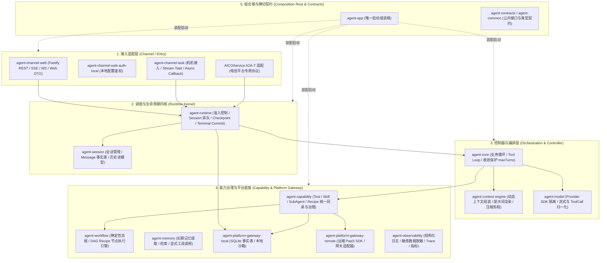
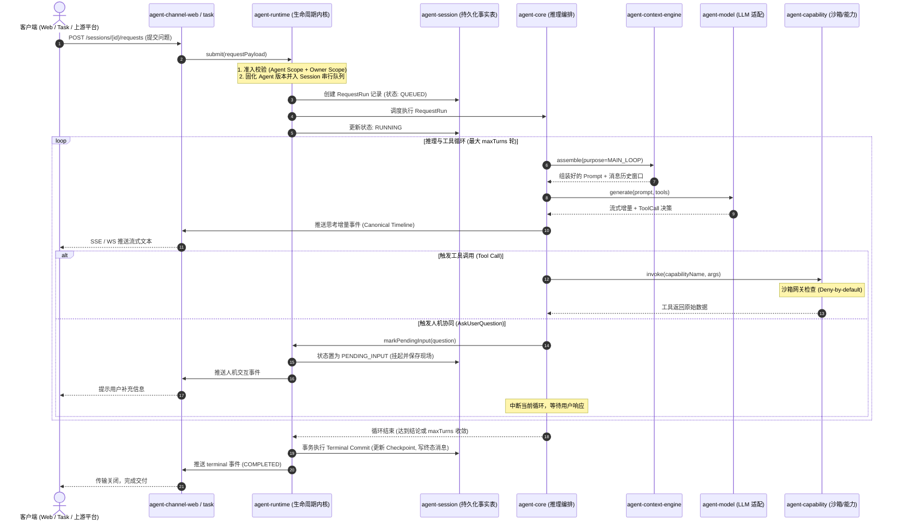

# NextAgent 框架核心架构与快速理解指南 Wiki

> **文档版本**：v1.0.0  
> **适用对象**：NextAgent / AICOService 架构师、系统开发人员、测试工程师与业务集成人员  
> **代码基线**：`nextagent/NextAgent`（26 packages TS monorepo）  
> **关联文档**：[NextAgent README](file:///Users/zhangfan/project/aico_timedelay_report/nextagent/NextAgent/README.md) ｜ [架构概览](file:///Users/zhangfan/project/aico_timedelay_report/nextagent/NextAgent/docs/developer/02-architecture.md) ｜ [接口全景 Wiki](file:///Users/zhangfan/project/aico_timedelay_report/developer_read/NextAgent_Agent_Runtime_对外接口全景_Wiki.md)

---

## 目录

- [一、 架构愿景与定位：30秒读懂 NextAgent](#一-架构愿景与定位30秒读懂-nextagent)
  - [1.1 为什么不做通用 Chat Demo？](#11-为什么不做通用-chat-demo)
  - [1.2 核心理念：收敛至一条可验证、可恢复的权威主路径](#12-核心理念收敛至一条可验证可恢复的权威主路径)
  - [1.3 双层体系：通用内核与智能体装配](#13-双层体系通用内核与智能体装配)
- [二、 全景分层架构与 26 个 Package 职责地图](#二-全景分层架构与-26-个-package-职责地图)
  - [2.1 整体四层架构模型](#21-整体四层架构模型)
  - [2.2 接入适配层（Channel Layer）](#22-接入适配层channel-layer)
  - [2.3 调度与生命周期内核（Runtime Kernel）](#23-调度与生命周期内核runtime-kernel)
  - [2.4 控制器与编排层（Orchestration Layer）](#24-控制器与编排层orchestration-layer)
  - [2.5 能力治理与平台底座（Capability & Gateway）](#25-能力治理与平台底座capability--gateway)
- [三、 核心开发心智：“两棵树”解耦模型](#三-核心开发心智两棵树解耦模型)
  - [3.1 平台源码仓库树 vs 开发者配置根目录（configRoot）](#31-平台源码仓库树-vs-开发者配置根目录configroot)
  - [3.2 为什么业务二开不需要修改 Runtime 源码？](#32-为什么业务二开不需要修改-runtime-源码)
  - [3.3 关键配置分层逻辑](#33-关键配置分层逻辑)
- [四、 端到端请求生命周期与流转全景](#四-端到端请求生命周期与流转全景)
  - [4.1 请求执行的六阶段流转图](#41-请求执行的六阶段流转图)
  - [4.2 阶段剖析：从准入到终态提交](#42-阶段剖析从准入到终态提交)
- [五、 必须坚守的五大架构设计铁律](#五-必须坚守的五大架构设计铁律)
  - [5.1 铁律 1：双 Scope 严格隔离](#51-铁律-1双-scope-严格隔离)
  - [5.2 铁律 2：能力治理严控（注册 ≠ 授权 ≠ 激活）](#52-铁律-2能力治理严控注册--授权--激活)
  - [5.3 铁律 3：控制命令单向收敛](#53-铁律-3控制命令单向收敛)
  - [5.4 铁律 4：持久化真值源驱动](#54-铁律-4持久化真值源驱动)
  - [5.5 铁律 5：受控沙箱安全（Deny-by-Default）](#55-铁律-5受控沙箱安全deny-by-default)
- [六、 智能体开发者的四大扩展入口](#六-智能体开发者的四大扩展入口)
  - [6.1 扩展点 1：Prompt 提示词模板](#61-扩展点-1prompt-提示词模板)
  - [6.2 扩展点 2：业务 Tool 与 Skill 开发](#62-扩展点-2业务-tool-与-skill-开发)
  - [6.3 扩展点 3：工作流 Recipe 编排](#63-扩展点-3工作流-recipe-编排)
  - [6.4 扩展点 4：插件与生命周期 Hook](#64-扩展点-4插件与生命周期-hook)
- [七、 快速上手与工程实践路线图](#七-快速上手与工程实践路线图)
  - [7.1 环境搭建与启动](#71-环境搭建与启动)
  - [7.2 最小 API 闭环验证](#72-最小-api-闭环验证)
  - [7.3 进阶实战四步走](#73-进阶实战四步走)

---

## 一、 架构愿景与定位：30秒读懂 NextAgent

### 1.1 为什么不做通用 Chat Demo？
在电信网络运维（Network Operations）场景中，Agent 面临着严苛的工业级挑战：
* **任务长、状态复杂**：一次针对“基站掉话率突增”或“重叠覆盖根因定位”的诊断，可能涉及多轮指标拉取、拓扑下钻、脚本分析，甚至需要等待运维工程师授权关键操作。
* **高可靠与容错**：网络抖动、模型超时、偶发中断不可避免，任务必须支持断点恢复（Checkpoint）、幂等重试（Idempotency）与取消（Cancellation）。
* **高安全风险**：大模型生成代码（Python/Shell）直接在生产服务器执行可能引发灾难性后果，必须有沙箱边界与严格的最小权限管控。

因此，NextAgent **不是**一个简单的通用聊天 Demo 或 LangChain/LlamaIndex 的胶水层包装，而是**面向电信网络智能体的 TypeScript 企业级后端框架**。

### 1.2 核心理念：收敛至一条可验证、可恢复的权威主路径
NextAgent 的设计核心，是把模型调用、会话生命周期、能力治理、受控沙箱、人机协同（Pending Input）、可观测审计和平台集成，全部收敛到同一条**权威执行主路径**上：
* **统一调度**：所有请求统一通过 `agent-runtime` 进行准入排队与生命周期维护。
* **状态持久化**：以底层数据库实体作为唯一真值源（Ground Truth），拒绝依赖不可靠的前端缓存或 SSE 流重放。
* **终态保证**：只有当所有持久化写入事务完全成功后，终态（`COMPLETED` / `FAILED` / `CANCELED`）才正式对客户端可见（Terminal Commit）。

### 1.3 双层体系：通用内核与智能体装配
框架清晰划分为两层：
1. **通用智能体内核（Generic Agent Kernel）**：TS 编写的底层基座，包含 26 个 packages。管理请求生命周期、调度排队、上下文组装、模型调用、能力治理与可观测性。
2. **智能体装配层（Network Agent Assembly）**：开发者主战场。通过 `agent.yaml` + Prompt 模板 + Skill/Tool 配置文件，无需修改内核代码即可快速组装针对具体电信领域的专属 Agent。

---

## 二、 全景分层架构与 26 个 Package 职责地图

### 2.1 整体四层架构模型

NextAgent 采用严格的单向依赖与职责分层架构：



### 2.2 接入适配层（Channel Layer）
- **`agent-channel-web`**：面向浏览器和前端交互，提供 Fastify 路由、SSE/WebSocket 流式投影及 DTO 转换。
- **`agent-channel-task`**：面向网管、告警、工作流编排等后台机机（M2M）系统，支持同步 Stream Task 与异步带 Webhook 回调的 Async Task。
- **核心铁律**：Channel 仅负责协议解析、鉴权与结果投影，**严禁拥有生命周期状态机或直接操作底层持久化**。

### 2.3 调度与生命周期内核（Runtime Kernel）
- **`agent-runtime`**：整个系统的“任务操作系统”。
  - **准入控制（Admission Control）**：校验 Agent Scope 与 Owner Scope。
  - **Same-session Lane**：同一个 Session 内的请求严格串行调度，避免多并发请求污染上下文。
  - **生命周期状态机**：管理 `QUEUED` $\rightarrow$ `RUNNING` $\rightarrow$ `PENDING_INPUT` $\rightarrow$ `TERMINAL` 等状态。
  - **Terminal Commit**：负责终态事务提交与 Checkpoint 保存。
- **`agent-session`**：负责 Session、消息模型及历史查询，以数据库内 `SessionMessage` 作为真值源。

### 2.4 控制器与编排层（Orchestration Layer）
- **`agent-core`**：驱动智能体业务循环（ReAct 模式）。解析模型输出中的 `tool_use`，交由 Capability 执行，并将结果回填继续循环。通过 `maxTurns` 进行绝对收敛保护。
- **`agent-context-engine`**：负责模型调用前 Context 的动态拼接。根据当前 Purpose（主推理、摘要生成等）加载对应的 Prompt 模板，并基于 Token 窗口进行智能裁剪（Compaction）。
- **`agent-model`**：屏蔽第三方模型厂商 SDK 差异（如 OpenAI 协议、MiniMax、Qwen 等），提供统一的流式事件与工具调用格式归一化。

### 2.5 能力治理与平台底座（Capability & Gateway）
- **`agent-capability`**：统一治理 Tool、Skill、SubAgent 和 Workflow Recipe。遵循“注册 $\neq$ 授权 $\neq$ 激活”原则。
- **`agent-workflow`**：轻量级确定性编排引擎，支持并发分支、条件分支、LLM 节点与 Python 节点的混合编排。
- **`agent-platform-gateway-local`**：基于 `node:sqlite` 的单机零外部依赖存储，持久化核心事实表；并提供受控本地沙箱。
- **`agent-observability`**：全链路日志脱敏（屏蔽 Token、Prompt 敏感字段）、分布式 Trace 和 Prometheus 指标导出。

---

## 三、 核心开发心智：“两棵树”解耦模型

快速理解 NextAgent 的一个绝招，是建立**“两棵树”**的心智模型：

```text
框架源码树 (Framework Engine)              开发者配置根目录 (configRoot)
NextAgent/                                my-telecom-agent/
├── packages/ (26个通用内核包)               ├── application.yaml (覆盖默认系统配置)
│   ├── agent-runtime/                    ├── agents/
│   ├── agent-core/                       │   └── aico-agent/
│   ├── agent-capability/                 │       ├── agent.yaml (模型/能力/运行时配置)
│   └── agent-app/ (唯一组合根)             │       └── prompts/ (提示词模板库)
├── frontend/agent-web/                   │           └── SYSTEM_PROMPT/template.yaml
└── docs/                                 ├── skills/ (业务操作知识手册)
                                          └── plugins/ (本地自定义插件)
```

### 3.1 为什么业务二开不需要修改 Runtime 源码？
NextAgent 采用了高内聚、低耦合的设计。在大部分电信业务落地场景中，开发者只需关注右侧的 **`configRoot` 业务资产树**，框架内核通过动态加载与依赖注入自动解析配置。

### 3.2 关键配置分层逻辑

| 配置层级 | 载体文件 | 核心职责 | 典型配置项 |
| :--- | :--- | :--- | :--- |
| **应用组合层 (App Level)** | `application.yaml`<br>*(覆盖 default-system.yaml)* | 声明系统级基础设施与模型池 | 模型 Provider（API Key、BaseUrl）、数据库路径、沙箱白名单、插件路径 |
| **智能体装配层 (Agent Level)** | `agents/{agentId}/agent.yaml` | 定义具体 Agent 的个性化边界 | 绑定模型范围 (`modelIds`)、挂载能力 (`capabilityBindings`)、最大循环轮次 (`maxTurns`) |
| **提示词工程层 (Prompt Level)** | `prompts/{PURPOSE}/template.yaml` | 结构化管理提示词资产 | 意图解析、工作流规则切片、上下文占位符、防幻觉约束 |
| **能力与知识层 (Capability Level)** | `skills/{skillId}/SKILL.md`<br>`recipes/{recipeId}.yaml` | 固化运维经验与确定性流程 | SOP 标准操作步骤、数据查询 DAG 流水线、参数映射规则 |

---

## 四、 端到端请求生命周期与流转全景

### 4.1 请求执行的六阶段流转图



### 4.2 阶段剖析：从准入到终态提交
1. **准入与固化**：请求进来时，Runtime 立即将请求锁入当前的 `Session Lane`，并固化本次运行所使用的 `agentId` 和 `agentVersion`。即使后续系统全局配置热修改，也不会影响正在执行的 Run。
2. **动态上下文拼装**：`Context Engine` 从数据库加载历史记录，结合 Prompt 模板动态渲染，遇到过长历史时执行智能折叠与截断，保证不超出模型窗口限制。
3. **安全受控执行**：`agent-capability` 在真正执行底层 Tool（如 Python 计算、SQL 查询、CLI 指令）时，调用本地沙箱边界，只有在白名单内的命令才允许放行。
4. **状态安全接续**：当遇到需要人工参与确认（如大网写操作授权、模糊意图澄清）时，通过 `AskUserQuestion` 进入 `PENDING_INPUT` 状态，安全让出计算资源，等用户回复后无缝恢复执行。
5. **终态权威提交**：所有持久化操作必须在同一个数据库事务或原子写入步骤中完成，确保任何时候系统崩溃重启后均可判定明确状态。

---

## 五、 必须坚守的五大架构设计铁律

在理解、二次开发或检视 NextAgent 时，以下 5 条铁律是整个系统的基石，任何代码与配置均不得突破：

### 5.1 铁律 1：双 Scope 严格隔离
* **定义**：每一次运行必须受控于 **Owner Scope**（当前操作用户身份）和 **Agent Scope**（当前绑定的智能体边界）。
* **规约**：请求 Payload、大模型推理输出、Tool 返回参数，**绝对不能越权**修改当前 Run 所属的身份、租户或 Agent 类型。

### 5.2 铁律 2：能力治理严控（注册 ≠ 授权 ≠ 激活）
* **定义**：系统中存在某个工具实现，不等于 Agent 能随意调用。
* **规约**：
  1. 系统必须装配（Register）该 Capability；
  2. Agent 必须在 `agent.yaml` 的 `capabilityBindings` 中显式绑定（Authorize）；
  3. Runtime 在当前请求阶段根据上下文和权限决定是否呈现给模型（Activate）。

### 5.3 铁律 3：控制命令单向收敛
* **定义**：系统的所有控制动作（`submit` 提交、`cancel` 取消、`retry` 重试、`edit` 编辑）**必须且只能**经由 `agent-runtime` 的核心接口。
* **规约**：任何 Channel、Plugin、外部脚本严禁绕过 Runtime 直接操作持久化数据库修改状态。

### 5.4 铁律 4：持久化真值源驱动
* **定义**：会话真实历史与状态以数据库中的 `SessionMessage` 事实记录为唯一真值源。
* **规约**：前端展示的聊天记录、重连恢复、断点排障，统一通过 Session 读模型获取，严禁依赖不可靠的前端 LocalStorage 或客户端内存中的 SSE 流录制。

### 5.5 铁律 5：受控沙箱安全（Deny-by-Default）
* **定义**：动态执行（Shell、Python、自动化脚本）严禁在宿主机进程中以裸权限执行。
* **规约**：必须通过 `sandbox gateway boundary`，默认策略为全部拒绝（Deny-by-default）。仅在系统配置显式放行指定安全命令后方可执行。

---

## 六、 智能体开发者的四大扩展入口

对于需要基于 NextAgent 开发业务的工程师，推荐的扩展方式如下：

```text
┌─────────────────────────────────────────────────────────────┐
│                    四大业务扩展入口                           │
├───────────────────┬─────────────────────────────────────────┤
│ 1. 提示词工程     │ prompts/{PURPOSE}/template.yaml         │
│                   │ 声明角色定位、业务约束、SOP 与输出规约  │
├───────────────────┼─────────────────────────────────────────┤
│ 2. 工具与 Skill   │ skills/{id}/SKILL.md 或 自定义 Tool SPI │
│                   │ 封装领域运维知识手册，提供标准化操作集  │
├───────────────────┼─────────────────────────────────────────┤
│ 3. 工作流编排     │ recipes/{recipeId}.yaml                 │
│                   │ 用确定性 DAG 承载多步骤清洗、并发查数   │
├───────────────────┼─────────────────────────────────────────┤
│ 4. 插件与 Hook    │ packages/agent-plugin-sdk               │
│                   │ 介入请求生命周期的拦截、审计与上下文注入│
└───────────────────┴─────────────────────────────────────────┘
```

### 6.1 扩展点 1：Prompt 提示词模板
在 `agents/{agentId}/prompts/` 目录下按 Purpose 组织。例如在 `SYSTEM_PROMPT/template.yaml` 中编写业务角色的思考方法、专业术语解释和防幻觉指引。

### 6.2 扩展点 2：业务 Tool 与 Skill 开发
* **Skill**：采用 Markdown 形式（`SKILL.md`）描述运维知识库、指标计算公式与分析路径，模型在需要时通过内置的 `Skill` 工具按需动态加载（Dynamic Skill Loading）。
* **Tool**：继承 Capability SPI 编写强类型工具类，声明入参 JSON Schema 并实现具体网络查询逻辑。

### 6.3 扩展点 3：工作流 Recipe 编排
当业务流程高度固定（例如“先根据小区名查物理参数，再并发拉取 24 小时 KPI，最后计算差值”），自由发散的 LLM Tool Loop 容易超时或不稳定，此时可沉淀为 **Recipe DAG**。Recipe 在 NextAgent 中被视为一种特殊的超级 Tool，兼具确定性与灵活性。

### 6.4 扩展点 4：插件与生命周期 Hook
通过 `@nextagent/agent-plugin-sdk` 编写 `LifecycleHook`，在系统启动期（Startup-only）挂载并冻结。可在请求开始前、模型调用前后、能力执行前后注入自定义的审计打点、鉴权校验或参数重写。

---

## 七、 快速上手与工程实践路线图

### 7.1 环境搭建与启动

**基础环境**：Node.js `>= 22`，Git，npm。

```bash
# 1. 切换到 NextAgent 仓库根目录
cd nextagent/NextAgent

# 2. 安装工作区全部依赖
npm install

# 3. 启动开发模式 (默认后端 3000 端口，前端 5173 端口)
npm run dev:watch
```

### 7.2 最小 API 闭环验证

```bash
BASE=http://127.0.0.1:3000

# Step 1: 创建 Session
SESSION_ID=$(curl -s -X POST "$BASE/api/v1/sessions" \
  -H "Content-Type: application/json" \
  -d '{"locale":"zh-CN"}' | jq -r '.sessionId')

# Step 2: 提交分析请求
REQ_ID=$(curl -s -X POST "$BASE/api/v1/sessions/$SESSION_ID/requests" \
  -H "Content-Type: application/json" \
  -d '{"inputText":"分析基站小区掉话原因","idempotencyKey":"test-001"}' | jq -r '.requestId')

# Step 3: 订阅 SSE 事件流
curl -N "$BASE/api/v1/sessions/$SESSION_ID/stream?requestId=$REQ_ID"
```

### 7.3 进阶实战四步走

1. **第一步：看懂一份配置**  
   先阅读内置的默认配置：[default-agent/agent.yaml](file:///Users/zhangfan/project/aico_timedelay_report/nextagent/NextAgent/packages/agent-core/src/builtin-agents/default-agent/agent.yaml) 与 [default-system.yaml](file:///Users/zhangfan/project/aico_timedelay_report/nextagent/NextAgent/packages/agent-app/config/default-system.yaml)，理解模型池与能力是如何挂载的。
2. **第二步：修改与调优 Prompt**  
   根据 [提示词工程指南](file:///Users/zhangfan/project/aico_timedelay_report/nextagent/NextAgent/docs/developer/06-prompt-engineering.md)，尝试调整提示模板中的工作流约束，观察模型思维链变化。
3. **第三步：编写第一个业务 Skill**  
   参考 [Skill 与 Tool 开发文档](file:///Users/zhangfan/project/aico_timedelay_report/nextagent/NextAgent/docs/developer/04-skill-tool-development.md)，编写一个针对指标诊断的操作手册并验证按需触发。
4. **第四步：接入复杂工作流**  
   结合实际业务需求，参考 [AICOService Recipe Wiki](file:///Users/zhangfan/project/aico_timedelay_report/developer_read/AICOService_Recipe运行底座与数据流机制Wiki.md)，实现多步骤并发查数与模型总结。
