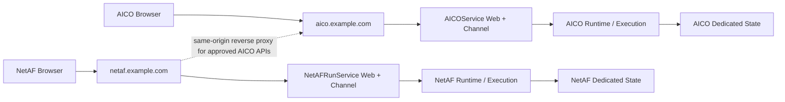

# AICOService 与 NetAFRunService 双完整服务冲突分析及解决建议

## 1. 场景前提

AICOService 与 NetAFRunService 都基于当前 NextAgent 代码构建，分别运行在独立进程中，并且两者都具备完整能力：

- 独立 Web 页面、静态资源和 PIU；
- 独立 Web channel、Task channel、IR channel、SSE/WebSocket；
- 各自拥有完整的 Session、Request、Runtime、Capability 和执行链路；
- **Agent 配置根和 Skill 配置根已经按服务独立**；
- 除 Agent、Skill 配置外，端口、route prefix、workspace、数据库、日志、身份、模型、下游依赖和可观测等配置均沿用相同默认值。

因此，本方案不再假设任一服务是 backend-only，也不把 Web 或 Runtime 收敛为单一 owner。分析重点是：在 Agent/Skill 已隔离、其他配置值相同的前提下，判断相同配置最终是否映射到同一个物理端口、目录、数据库、origin 或下游资源。

## 2. 总体结论

独立 Agent/Skill 配置已经消除了能力定义、装配目录和热加载互相覆盖的问题；独立进程则只隔离进程内内存。二者都不能自动隔离以下资源：

- 监听端口、UDS 和回调 socket；
- 公网 URL、SPA fallback、静态资源、PIU 和 API；
- Cookie、CSRF、localStorage、sessionStorage 和浏览器全局对象；
- SQLite、workspace、blob、附件、Memory、幂等键和调度状态；
- 外部 Capability provider、模型配额、下游 namespace 和业务副作用；
- 日志、audit、metric、trace、健康检查和发布物。

相同默认配置是否冲突，必须按最终资源位置判断：

| 默认配置 | 独立容器/工作目录/volume 后 | 同一主机、同一配置基准目录下 |
| --- | --- | --- |
| `channel.port: 3000` | 不同 network namespace 内可同时使用 | 同一 network namespace 直接端口冲突 |
| `workspaceRoot: workspaces` | 相对路径解析到不同容器文件系统或 volume 时不冲突 | 解析到同一真实目录时，全部 SQLite、execution、shared-data 冲突 |
| `logDirectory: logs` | 解析到不同文件系统或 volume 时不冲突 | 解析到同一真实目录时日志、轮转和清理冲突 |
| `channel.routePrefix: /` | 不同 hostname/origin 时不冲突 | 同一公网 origin 下 Web、API、Channel 和静态资源冲突 |
| `localAuth.enabled: false` | 默认未启用，本地认证 Cookie 冲突当前不触发 | 后续启用且同 origin 时，固定 Cookie 名和 `Path=/` 会冲突 |
| `activeAgentId: default-agent` | Agent inventory 已独立时不构成直接冲突 | 只有请求路由错误、共享 registry/store 或跨服务 locator 缺少 owner 时才产生歧义 |
| tracing `serviceName: nextagent` | 即使进程和存储隔离，汇聚到同一观测后端仍然混淆 | 同样混淆 |

基于当前前提，冲突状态分为三类：

- **已排除**：Agent 配置根共享、Skill 配置根共享、两服务因本地 Capability ID 同名而互相覆盖。
- **条件冲突**：端口、相对 workspace、日志、Web 路由、Cookie、storage、数据库和 callback；是否触发取决于 network namespace、路径解析基准、volume 和公网 origin。
- **隔离部署后仍需治理**：`serviceName`、共享模型凭据/配额、远端 Tool/RAG/SkillHub namespace、外部副作用幂等、跨服务 locator，以及 NetAF Web 中残留的 AICO 产品语义。

推荐顺序如下：

1. **首选：两个独立 origin/hostname。** 两个服务都可保留完整 `with-frontend + channel + runtime`，浏览器天然按 origin 隔离 Cookie、Web Storage、根页面和固定静态路径。这是当前代码改动最少、风险最低的方案。
2. **次选：同一 origin 下使用两个完整 service base。** 例如 `/aicoservice/**` 和 `/netafrunservice/**`。这要求页面、静态资源、PIU、API、Cookie 和 Web Storage 全部 service-scoped；当前 `routePrefix` 只覆盖 `/api/v1`，尚不足以支持该方案。
3. **同一宿主页面同时加载两套 PIU 是单独的高风险场景。** 当前两份 bundle 都注册 `window.Prel`、`AICOPIU` 和相同 window event，不能仅通过 URL 前缀解决。若产品允许，最小隔离方案是让两套 Web 分别运行在不同 origin 的 iframe 中；若必须运行在同一 JS realm，才需要重构 PIU registry 和实例状态。

## 3. 部署场景与风险等级

| 场景 | Web/Channel/Runtime | 主要冲突 | 当前可用性 |
| --- | --- | --- | --- |
| 不同 hostname，独立容器/数据根 | 两套完整 | 可观测标识、外部依赖、模型配额和业务副作用仍可能竞争 | **推荐**；相同端口和相对路径可以保留，但必须验证物理隔离 |
| 同一主机、同一配置基准目录 | 两套完整 | 默认端口、workspace、SQLite、execution、shared-data 和日志重叠 | **当前阻塞** |
| 同一 hostname，不同 path | 两套完整 | 页面、静态资源、Cookie、storage、PIU、登录和 SPA fallback | **当前阻塞**；只有 API prefix，不是完整 service prefix |
| 同一页面同时加载两套 PIU | 两套完整或嵌入式 | `window.Prel`、`AICOPIU`、全局事件、CSS、活动容器状态 | **当前阻塞** |
| 不同进程但共享 workspace/SQLite | 两套完整 | 生命周期、数据、幂等、调度和文件混写 | **禁止** |
| 不同进程但共享远端数据库 namespace | 两套完整 | 同名 ID、owner/agent scope、调度和迁移相互影响 | **禁止，除非规范明确建模 service scope** |
| 独立数据但共享外部模型/工具/业务系统 | 两套完整 | 配额、限流、回调和重复副作用 | 条件可用；必须做容量与幂等隔离 |

## 4. 当前代码中的关键事实

### 4.1 每个完整 composition 都注册同形 channel

每个 `agent-app` composition 都会创建 Fastify server，并注册主 Web、Task 和 IR channel。两套服务使用默认配置时，都会暴露同形 `/api/v1/**`。

参考：

- `packages/agent-app/src/composition/channel-composition.ts:82-141`
- `packages/agent-app/src/composition/channel-composition.ts:383-400`
- `packages/agent-app/src/composition/channel-composition.ts:411-449`

### 4.2 `routePrefix` 只覆盖 API 树

当前 `channel.routePrefix=P` 会生成：

- `${P}/api/v1/**` 主 Web channel；
- `${P}/api/v1/**` Task channel；
- `${P}/api/v1/ir/**` IR channel；
- `${P}/api/v1/auth/local/**` local auth；
- `${P}/api/v1/health` 和 deep health。

页面、静态资源和 SPA 路由不跟随该前缀。

参考：

- `packages/agent-channel-web/src/routes/requests.ts:244-259`
- `packages/agent-channel-task/src/routes.ts:244-258`
- `openspec/changes/add-web-api-route-prefix/specs/web-channel-api-contract/spec.md:5-7`
- `openspec/changes/add-web-api-route-prefix/specs/app-config-schema/spec.md:5-7`

### 4.3 Web artifact 和特殊资源仍占用根路径

当前 artifact manifest 固定 `routeBase: '/'`，托管插件固定使用：

- `/febs/v1/assets/prelude-loader`；
- `/piu/AIAgentPIU.js`；
- `/piu/AIAgentPIU.css`；
- 根 route base 下的 SPA fallback。

参考：

- `scripts/assemble-agent-web-artifact.mjs:25-30`
- `packages/agent-app-frontend-hosting/src/index.ts:37-70`

### 4.4 PIU 使用固定浏览器全局名称

前端固定使用 `window.Prel`，PIU 名称固定为 `AICOPIU`，并注册固定事件 `nextagent:piu-display-change`。注册实现还维护 module-level active container/root 状态。

参考：

- `frontend/agent-web/src/host/prel.ts:35-51`
- `frontend/agent-web/src/piu/registerAIAgentPIU.tsx:23-42`
- `packages/agent-app-frontend-hosting/src/index.ts:228-320`

### 4.5 Cookie 和浏览器状态没有 service namespace

local auth 启用后固定使用 `nextagent_local_auth; Path=/`，每个进程独立随机生成签名密钥；当前默认 `localAuth.enabled=false`，因此 Cookie 冲突属于启用后的条件风险，而不是默认启动即触发的冲突。Web Storage 仍包含固定 key：

- `AICOConfig`；
- `nextagent:AICOPIU:activeSessionId`；
- `draft-{sessionId}` 和 `draft-__new__`；
- request-control idempotency key；
- session-list、theme、locale 和 user-input timestamp。

参考：

- `packages/agent-channel-web-auth-local/src/index.ts:34`
- `packages/agent-channel-web-auth-local/src/index.ts:96`
- `packages/agent-channel-web-auth-local/src/index.ts:325-330`
- `frontend/agent-web/src/aico-config/loadSessionStorageAICOConfig.ts:4-14`
- `frontend/agent-web/src/piu/activeSessionStorage.ts:1-38`
- `frontend/agent-web/src/state/requestStore.ts:72-84`
- `frontend/agent-web/src/state/requestStore.ts:566-624`
- `frontend/agent-web/src/features/chat/hooks/useChatComposerController.ts:39-107`

### 4.6 当前 Web 语义包含 AICOService 专属绑定

同一份 `agent-web` 固定使用权限 `AICOService.View`、`AICOService.Write`，并直接调用 `/rest/naie/aicoservice/**`。API client 默认携带 Cookie、CSRF 和 identity headers；上传还明确拒绝跨 origin credential request。

参考：

- `frontend/agent-web/src/features/auth/authEnums.ts:1-3`
- `frontend/agent-web/src/services/biReportService.ts:10-18`
- `frontend/agent-web/src/services/apiClient.ts:32-62`
- `frontend/agent-web/src/services/apiClient.ts:297-320`
- `frontend/agent-web/src/config/runtimeConfig.ts:173-190`

这意味着 NetAFRunService 虽然可以构建同一份 Web，但会继承 AICO 权限和 AICO 外部 API 语义。若这不是产品有意共享的契约，就属于服务语义冲突，而不仅是路径冲突。

### 4.7 默认运行路径和可观测标识相同

默认值包括：

- `workspaceRoot: workspaces`；
- `logDirectory: logs`；
- `channel.port: 3000`；
- tracing `serviceName: nextagent`；
- `activeAgentId: default-agent`。

`workspaceRoot` 会派生 working-memory、long-term-memory、主 SQLite、execution 和 shared-data 路径。

这里的“相同”首先是配置文本相同，不必然表示物理资源相同。`workspaceRoot`、`logDirectory`、`agentRoot` 和 `skillRoot` 都会相对各实例的配置路径基准解析：若两个服务位于不同发布目录、容器文件系统或独立 volume，默认相对值可以解析为不同真实路径；若两个进程从同一配置基准目录启动，则会解析到同一真实路径。部署验收必须比较解析后的绝对路径，不能只比较 YAML 文本。

本场景已明确 `agentRoot` 和 `skillRoot` 分别绑定到各服务自己的配置，因此这两项不再作为待解决冲突。`activeAgentId` 即使都叫 `default-agent`，只要各自的 Agent inventory、持久化和入口归属独立，也不会导致一个进程选择另一个进程的 assembly；更名只改善诊断可读性，不是正确性前提。

参考：

- `packages/agent-app/config/default-system.yaml:3-47`
- `packages/agent-app/src/config/paths.ts:28-38`
- `openspec/specs/app-config-schema/spec.md:216-277`

## 5. 当前执行冲突内容列表

本节只描述会影响 request 接受、runtime 生命周期、Capability 调用、持久化、文件执行、回调和 terminal truth 的冲突。它不假设冲突一定发生：不同 origin、不同状态根和不同下游 namespace 可以消除相应条件；仅启动两个独立进程不能消除这些条件。

### 5.1 请求接入与执行归属

| 编号 | 当前冲突 | 触发条件 | 直接后果 |
| --- | --- | --- | --- |
| E01 | Web channel 路由重叠 | 两服务在同一入口使用默认 `/api/v1/**` | 请求进入错误服务 |
| E02 | Task channel 路由重叠 | 两服务暴露同形 task submit/edit/retry/cancel/status 接口 | Task 被错误 runtime 接受或控制 |
| E03 | IR channel 路由重叠 | 两服务都暴露 `/api/v1/ir/**` | IR 请求进入错误 Agent/runtime |
| E04 | runtime bootstrap 错配 | Web 获取另一服务的 bootstrap | transport、上传限制和 stream 地址错误 |
| E05 | SSE 订阅错配 | session stream URL 未体现服务归属 | 订阅错误 timeline 或持续返回 404 |
| E06 | WebSocket 错配 | upgrade 与 HTTP 使用不同 service matcher | WS 连接到错误 runtime |
| E07 | trusted identity 串用 | 两服务无差别接受相同可信身份头 | 身份跨服务重放，Owner Scope 错误 |
| E08 | Agent Scope 错配 | 入口把请求送到错误服务，或服务未绑定自己的 Agent inventory/assembly | 请求使用错误模型、Prompt、Capability 和策略；仅 `activeAgentId` 同名不会触发 |
| E09 | Session locator 缺少服务归属 | 外部只携带 `sessionId` | 查询、分享、回放进入错误服务 |
| E10 | Request/Run locator 缺少服务归属 | 控制请求只有 session/request/run ID | cancel、edit、retry 作用于错误运行实例 |

### 5.2 Runtime 生命周期

| 编号 | 当前冲突 | 触发条件 | 直接后果 |
| --- | --- | --- | --- |
| E11 | 同一业务请求被两个服务接受 | 网关重试、双写或客户端分别提交到两个入口 | 两套独立 run 同时执行 |
| E12 | same-session lane 被拆分 | 同一业务 session 同时存在于两个 runtime | 两边各自串行，整体实际并发 |
| E13 | cancellation 归属错误 | cancel 请求进入非执行 owner | 原执行继续运行，客户端误判已取消 |
| E14 | edit/retry 归属错误 | edit/retry 进入另一服务 | 找不到原 run 或误操作同名 run |
| E15 | terminal commit 重复 | 两服务分别完成同一业务操作 | 重复消息、timeline 和业务结果 |
| E16 | checkpoint 分裂 | 同一业务流程在两个服务分别保存 checkpoint | 恢复路径不一致，canonical truth 不唯一 |
| E17 | stream 与 terminal truth 分裂 | stream 来自 A，history/terminal 查询进入 B | 实时结果无法在历史中找到 |
| E18 | callback correlation 冲突 | callback 只使用 sessionId/requestId | 回调归入错误服务或 run |
| E19 | Task callback socket 冲突 | 两服务复用 callback `socketPath` | callback 被错误进程接收 |
| E20 | callback URL/audience 冲突 | callback target 没有服务路径或 audience | 完成、失败、待输入事件投递错误 |

### 5.3 持久化、并发与调度

| 编号 | 当前冲突 | 触发条件 | 直接后果 |
| --- | --- | --- | --- |
| E21 | 主 SQLite 共享 | 两进程使用相同 `workspaceRoot` | session、request、timeline、task 混写 |
| E22 | working-memory SQLite 共享 | 两服务打开相同文件 | 当前上下文跨服务串用 |
| E23 | long-term-memory SQLite 共享 | 两服务打开相同文件 | 记忆召回跨产品、跨 Agent |
| E24 | schema migration 竞争 | 不同版本进程操作同一数据库 | migration、索引和表结构相互破坏 |
| E25 | 幂等键冲突 | 两服务共享 store，key 没有 service scope | 一服务返回另一服务的首次写结果 |
| E26 | CAS/version 冲突 | 两进程推进同一 session/run 状态 | version conflict、终态竞争或部分失败 |
| E27 | cron store 共享 | 两套 scheduler 读取相同任务 | 定时任务重复触发 |
| E28 | background queue 共享 | 两服务使用相同 topic/consumer group | 重复执行或错误抢占任务 |
| E29 | maintenance owner 重复 | 两服务维护同一 Memory/store | 重复 aging、cleanup 或 compaction |
| E30 | 共享数据缺少服务 namespace | 两服务共用远端库且没有独立 database/schema/store namespace | 两产品事实混写，既有 Agent Scope 和 Owner Scope 无法替代部署隔离 |

### 5.4 执行文件、附件与 sandbox

| 编号 | 当前冲突 | 触发条件 | 直接后果 |
| --- | --- | --- | --- |
| E31 | execution workspace 重叠 | 两服务使用相同 `workspaceRoot/execution` | shell/python 输出和临时文件互相覆盖 |
| E32 | cleanup 误删 | 两服务生成重叠的 temp/run 路径 | 一个服务删除另一服务正在使用的文件 |
| E33 | attachment staging 重叠 | 两服务共享附件暂存目录 | 附件引用错误或被提前清理 |
| E34 | blob namespace 冲突 | 两服务使用相同 blob store 和 object key | 文件覆盖或下载错误内容 |
| E35 | HOFS object name 冲突 | 两服务都写 `aicoservice/...` 等固定前缀 | 文件 owner 不可区分 |
| E36 | artifact locator 串用 | A 的 locator 被发送给 B | 404，或共享存储下越权读取 |
| E37 | sandbox workspace 冲突 | 两服务共享 sandbox root/sidecar | 执行文件、进程和权限边界串用 |
| E38 | sandbox/sidecar UDS 冲突 | 两服务使用相同 socket 但策略不同 | 请求进入错误策略或 credential 上下文 |

### 5.5 Agent、Capability 与外部副作用

| 编号 | 冲突点 | 当前状态/触发条件 | 直接后果 |
| --- | --- | --- | --- |
| E39 | Agent 配置根共享 | **已排除**：本场景明确两服务使用独立 Agent 配置 | 无跨服务热加载覆盖；仍需在部署验收中验证解析后的真实路径 |
| E40 | Skill 根目录共享 | **已排除**：本场景明确两服务使用独立 Skill 配置 | 无跨服务 Skill 版本覆盖；仍需保证发布绑定不串包 |
| E41 | `activeAgentId` 默认值重复 | **不是直接冲突**：各进程拥有独立 Agent inventory 时，相同本地 ID 可并存 | 只有共享 registry/store、入口错路由或 locator 缺少服务 owner 时才会产生歧义 |
| E42 | Capability ID 同名异义 | **进程内已排除**；仅在两服务共享外部 registry 且 ID 无服务/版本 namespace 时触发 | 绑定错误 provider |
| E43 | Tool/Skill/Workflow provider 串用 | 独立 Skill 定义仍引用同一外部 provider/endpoint，且下游未区分服务 | 执行进入错误工具、工作流或数据 namespace |
| E44 | 外部业务副作用重复 | 两服务都接受同一业务请求 | 重复配置网络、工单或报告 |
| E45 | 下游幂等 namespace 冲突 | 两服务向同一下游发送相同幂等键 | 一服务调用被当成另一服务的重复请求 |
| E46 | 模型 credential/配额竞争 | 两服务共享默认 provider credential 和限流桶 | 一方耗尽另一方 token、并发或预算 |
| E47 | Tool/sandbox 容量竞争 | 两服务共享执行池且没有配额隔离 | 排队、饥饿和故障相互放大 |
| E48 | RAG/SkillHub/remote gateway 竞争 | 两服务共享默认远端 namespace 或容量池 | 内容串用、版本错配或限流竞争 |

### 5.6 进程和执行诊断

| 编号 | 当前冲突 | 触发条件 | 直接后果 |
| --- | --- | --- | --- |
| E49 | TCP 监听端口冲突 | 两服务在同一 network namespace 均使用 `127.0.0.1:3000` | 后启动进程失败；独立容器内可同时使用相同内部端口 |
| E50 | 服务 UDS 路径冲突 | 两服务配置相同 `channel.udsPath` | 启动删除同一路径，另一服务中断 |
| E51 | 相对 `workspaceRoot` 冲突 | 两服务以相同配置基准解析 `workspaces`，最终真实路径相同 | SQLite、execution、shared-data 全部重叠 |
| E52 | 日志/audit/metric 文件冲突 | 两服务的默认 `logs` 解析到同一真实目录 | 文件交错、轮转和清理竞争 |
| E53 | tracing serviceName 冲突 | 两服务都使用 `nextagent` | 无法判断执行属于哪个服务 |
| E54 | 运行状态/发布 evidence 冲突 | 两运行包复用 evidence/run-state 目录 | PID、启动证明和健康证据覆盖 |

## 6. 全量冲突点交叉索引

以下清单是本文的总体冲突列表。每一项都给出：冲突出现的运行背景、形成冲突的直接原因、可观察影响和最小解决建议。不同 hostname 可以消除部分浏览器和公网路径冲突，但不会消除后端状态、外部依赖和运维冲突。

### 6.1 进程、监听与网关

| 编号 | 冲突点 | 背景 | 原因 | 影响 | 解决建议 |
| --- | --- | --- | --- | --- | --- |
| N01 | TCP 端口 | 两个完整服务进程运行在同一 network namespace，均沿用默认 `127.0.0.1:3000` | 同一 IP、协议和端口只能被一个监听者占用，独立进程不提供端口 namespace | 后启动进程失败 | 同机进程分配不同端口；独立容器可保留相同内部端口，但 host port/Service 必须独立 |
| N02 | 服务 UDS | 两服务启用 UDS，并把 `channel.udsPath` 配置成同一文件 | UDS 文件路径本身就是监听地址，启动清理和 bind 都没有服务 owner | 启动时删除同一路径、连接错投或互相中断 | 每服务使用唯一 UDS 文件；路径包含服务名，启动前校验文件归属 |
| N03 | Task callback socket | 两套 Task 执行链路复用同一个 callback `socketPath` | callback 只依赖共享 socket 寻址，无法确定目标 runtime owner | 回调进入错误服务 | callback socket 按服务隔离，并在 callback correlation 中校验服务身份 |
| N04 | 公网 host/path | 两套 Web、Channel 和 Runtime 同时挂载到同一 ingress host 和根路径 | 入口路由缺少可唯一选择服务的 hostname 或完整 service base | 路由命中顺序不确定，请求可能进入错误服务 | 首选独立 hostname；必须同域时使用覆盖页面、静态资源和全部 Channel 的完整 service base |
| N05 | HTTP 与 WS 路由不一致 | 网关只为普通 HTTP 配置服务 path，没有同步 WebSocket upgrade 规则 | HTTP 与 upgrade 使用不同 matcher 或 upstream 选择逻辑 | REST 正常、WebSocket 失败或串服务 | HTTP、SSE、WebSocket 共用同一 service routing rule，并做 upgrade 负向测试 |
| N06 | SSE 代理策略 | 两服务的 stream 都经过通用反向代理默认策略 | 默认响应缓冲和短连接超时不适合长时间、增量输出的 SSE | stream 延迟、批量到达或提前断连 | 每服务配置长连接超时、禁用 SSE 缓冲，并验证断线重连 |
| N07 | session affinity | 每个服务扩展到多副本，连接仍可能依赖进程内瞬态状态 | 负载均衡未绑定连接，而 runtime truth 又未完全支持跨副本恢复 | reconnect 或控制请求进入不同实例 | 以可恢复 canonical runtime truth 为主；仅对确有进程亲和要求的阶段配置 affinity |
| N08 | forwarded identity headers | 两服务都从 ingress 接收 tenant、subject 等身份头 | 网关未清除客户端伪造值，或两个服务对可信代理和 audience 的校验规则不一致 | Owner Scope 可被伪造，身份可能跨服务重放 | 网关统一删除外部同名头并重新注入可信身份；两个服务分别校验 audience |
| N09 | CORS/Origin | 为隔离服务而把 Web 和其 API 拆到不同 origin，仅修改客户端 URL | 浏览器同源、Cookie、CSRF、credentialed request 和 WS Origin 约束未同步设计 | Cookie、CSRF、上传或 WS 握手失败 | 保持每套 Web 与其 API 同 origin；跨服务访问通过当前服务的同源网关代理 |
| N10 | health 路由 | 两个服务都暴露同形 `/api/v1/health`，探针或 ingress 未绑定明确 upstream | 健康 URL 缺少服务级路由 owner，部署配置可把探针指向另一服务 | 编排系统误判服务健康并执行错误发布动作 | 在独立 hostname 或完整 service base 下设置独立探针，并校验响应服务身份 |

### 6.2 Web 页面、静态资源与前端构建

| 编号 | 冲突点 | 背景 | 原因 | 影响 | 解决建议 |
| --- | --- | --- | --- | --- | --- |
| W01 | 根页面 `/` | 两套完整 Web 部署在同一 origin，并都把 `/` 作为应用入口 | 一个 URL 只能由一个前端 artifact 和 SPA owner 响应 | 只能访问其中一套页面，或页面随路由顺序漂移 | 首选独立 hostname；必须同域时分别使用完整 `/aicoservice/`、`/netafrunservice/` service base |
| W02 | SPA fallback | 两个托管插件都为根空间注册 not-found handler | fallback 没有限定服务 base，且可能把 API 未命中请求当成前端 deep link | API 404 被错误返回为另一服务的 HTML | 每个 fallback 只处理自身 service base；所有 API protected prefix 在 fallback 前明确拒绝 |
| W03 | Vite asset base | 两个前端构建物都按默认 `/assets/**` 发布 JS、CSS 和图片 | asset URL 没有服务 namespace，浏览器和代理无法区分制品 owner | JS/CSS 版本串用、缓存污染或页面白屏 | 每服务使用独立 origin；同域时为 Vite 和托管端配置一致的完整静态 base |
| W04 | artifact `routeBase` | 同域 path 部署时，artifact manifest 仍固定声明 `routeBase: '/'` | 构建 base、manifest route base 与服务器静态查找不是同一配置事实 | deep link、静态文件查找和 fallback 错误 | 让 artifact manifest、Vite `base` 和托管查找共同使用一个 service base 事实 |
| W05 | Prel loader 路径 | 两套 Web 都发布 `/febs/v1/assets/prelude-loader` | loader 是固定根路径，未包含服务或制品版本坐标 | 加载到错误服务或错误版本的 Prelude | 独立 origin；必须同域时前缀化路径并把实际地址写入各自 manifest |
| W06 | PIU JS/CSS 路径 | 两套 Web 都发布 `/piu/AIAgentPIU.js` 和 `/piu/AIAgentPIU.css` | PIU 资源名称和路径固定，没有产品 namespace | bundle/CSS 串版本，运行时行为与页面不匹配 | 独立 origin；必须同域时使用 service-scoped PIU 路径和独立缓存键 |
| W07 | CDN/cache key | 两服务灰度版本经过只按 host/path 缓存的 CDN，文件名可能相同 | cache key 未包含服务或不可变内容版本 | 灰度期间加载混合版本，回滚后仍命中旧资源 | hostname、path、version 至少形成唯一组合，静态资源使用内容哈希和正确缓存策略 |
| W08 | deep link | 两套 Web 都生成 `/session/{id}` 等根级分享或恢复链接 | locator 只包含本地资源 ID，没有携带服务 origin/base | 分享、收藏或刷新后进入错误服务 | deep link 必须携带 service origin/base；服务端再校验资源的 Agent Scope 和 Owner Scope |
| W09 | API build prefix | 两产品复用同一前端 artifact，但它们的后端 API base 不同 | API prefix 是构建/运行绑定事实，单一 artifact 无法同时代表两个 owner | 一套 Web 请求另一套 Channel 或全部请求 404 | 分别构建并版本配对 artifact；每个 artifact 固化自己的 API base |
| W10 | runtime config/bootstrap | 页面、代理缓存或静态制品可能取得另一服务的 runtime bootstrap | bootstrap URL 和缓存键缺少服务/版本身份，客户端又以它选择 transport 和限制 | transport、上传限制或 backend base 错配 | bootstrap 由当前 service base 唯一提供，返回 service identity/version，并禁止跨服务缓存复用 |
| W11 | `/rest/**` 外部调用 | NetAF Web 复用 AICO Web 功能，仍调用 `/rest/naie/aicoservice/**` | 前端产品能力未分 profile，固定 URL 的真实 owner 仍是 AICO 集成 | NetAF 功能 404、越权或意外操作 AICO 系统 | 明确产品决策：在 NetAF 同源网关代理到授权 owner，或从 NetAF profile 移除该功能 |
| W12 | credentialed cross-origin upload | 某套 Web 直接把附件上传指向另一服务 origin | 浏览器 credential、Origin 和 CSRF 安全约束要求请求回到可信同源 owner | 客户端主动拒绝，或放宽策略后形成安全缺口 | 使用各自同源附件 API；跨服务传输由服务端受控转发，不在浏览器绕过限制 |
| W13 | 前端功能 profile | 相同代码需要构建 AICO 与 NetAF 两个产品，但菜单、权限和依赖能力不同 | 产品差异没有权威 profile，UI 只能隐式继承 AICO 默认语义 | 显示不可用功能、调用错误 owner 或授权语义混乱 | 通过 OpenSpec 定义 AICO/NetAF 产品 profile，构建期确定能力并做各自 E2E |
| W14 | 错误页/登录页 | 两套应用在同一 origin 使用固定 `/login-url` 和根错误入口 | 登录、退出和错误跳转未跟随服务 base | 用户被送到另一服务登录页或错误页 | 登录、退出、错误入口和回跳地址都跟随 service base；首选独立 origin |

### 6.3 浏览器 Cookie、Storage 和同页面全局对象

| 编号 | 冲突点 | 背景 | 原因 | 影响 | 解决建议 |
| --- | --- | --- | --- | --- | --- |
| B01 | local-auth Cookie 名 | 后续启用 local auth，且两服务部署在同一 origin | 两边都写固定名称 `nextagent_local_auth`，浏览器 Cookie jar 不区分后端进程 | 后写覆盖前写 | 首选独立 hostname；必须同域时按服务区分 Cookie 名，并补登录切换测试 |
| B02 | Cookie Path | 两服务在同域不同 path 下启用 local auth | Cookie 固定 `Path=/`，浏览器会向两个 service base 都发送 | 凭证跨服务携带，认证 owner 不清 | Cookie Path 限制到各自 service base，并设置匹配的 SameSite/Secure 策略 |
| B03 | Cookie 签名密钥 | 两个进程各自随机生成密钥，却接收同一个 Cookie 名 | 一个进程签发的值无法被另一个进程验证，同名 Cookie 又会在浏览器中交替覆盖 | 请求在两个服务之间交替出现 401 | 每服务使用独立 Cookie namespace；同一服务多副本共享受管密钥 |
| B04 | CSRF token | 同一 document 或 JS realm 中同时操作两个服务 | 客户端只维护一个 module-level token，没有按 service/instance 分区 | 请求可能携带另一服务的 CSRF token | 最小方案是每个 Web document 只绑定一个服务；同页多实例时 token store 必须实例化并带 service scope |
| B05 | identity header 状态 | 同页双 bundle 或错误 bootstrap 复用同一个 apiClient module | tenant、subject、displayName 保存在 module-level 可变状态中 | 客户端身份投影串用，并可能掩盖服务端路由错误 | 不在同一 JS realm 运行两套未隔离 client；服务端仍必须从可信边界重建并校验身份 |
| B06 | `AICOConfig` | AICO 和 NetAF 页面处于同一 origin | 两边使用相同 sessionStorage key `AICOConfig` | 产品配置互相覆盖，NetAF 继承 AICO 配置 | storage key 增加稳定 service namespace；同时决定 NetAF 是否应继续使用 AICO 配置 shape |
| B07 | active session | 两套 PIU 共用同一 origin 的 active-session 存储 | key 没有服务坐标，而 sessionId 只保证服务内意义 | 打开 A 页面可能恢复到 B 的 sessionId | key 必须包含 service identity 和 host/instance 必要坐标 |
| B08 | composer draft | 两服务存在相同 sessionId，或都使用 `draft-__new__` | draft key 只按 sessionId/新会话标识命名 | 草稿内容跨产品显示或被覆盖 | draft key 包含 service identity 和 sessionId；迁移旧 key 时不得跨服务猜测 |
| B09 | request-control idempotency | 两服务出现同名 session/request/action | 浏览器生成的控制幂等 key 没有服务 namespace | cancel/edit/retry 可能复用另一服务的幂等结果 | key 包含 service identity；服务端幂等仍以自己的可信 scope 为准 |
| B10 | locale/theme/session-list | 两产品在同一 origin 保存固定 preference 和列表状态 key | 浏览器存储按 origin 隔离，不会自动按产品隔离 | 一服务修改另一服务 UI 偏好或列表缓存 | 先明确哪些偏好有意共享；独立产品状态默认按 service namespace 隔离 |
| B11 | user-input timestamp | 两个服务可能产生同名 requestId | timestamp key 只使用 requestId，缺少服务 owner | 时延展示和输入状态串数据 | storage key 加 service identity，并在 terminal cleanup 时只清理当前服务记录 |
| B12 | `window.Prel` | 同一页面加载 AICO 和 NetAF 两套 Prelude | 两套代码使用单一全局 `window.Prel`，后加载方无法建立独立 registry | 后加载跳过初始化或错误复用前一套 registry | 首选不同 origin iframe；必须同 realm 时先定义支持多服务的宿主 registry contract |
| B13 | PIU 名称 `AICOPIU` | 同一个 Prelude registry 注册两套 PIU | PIU package identity 固定同名，registry 无法区分产品实现 | 只保留或复用其中一个 PIU | PIU package identity 必须按服务唯一，并定义对应宿主查找规则 |
| B14 | PIU module-level active root | 同一 bundle/realm 装载多个 PIU 实例 | active container/root 是 module-level 单例，不属于具体实例 | 一个实例挂载、卸载或更新会覆盖另一个实例 | runtime state 改为 instance-scoped；每个实例持有自己的 root 和清理生命周期 |
| B15 | window custom event | 两套 PIU 都监听 `nextagent:piu-display-change` | event name 和 payload 没有 service/instance selector | 一次事件同时改变两套 UI | event name 或 detail 携带 service/instance scope，监听方严格匹配后处理 |
| B16 | 全局 CSS/DOM id | 同一 document 原生嵌入两套 PIU | CSS selector、z-index 和 DOM id 共用全局命名空间 | 样式覆盖、容器选择错误和交互层级异常 | 使用 Shadow DOM 或严格 CSS namespace、唯一容器 ID，并执行同页组合 E2E |

### 6.4 Channel、API 和身份契约

| 编号 | 冲突点 | 背景 | 原因 | 影响 | 解决建议 |
| --- | --- | --- | --- | --- | --- |
| C01 | 主 Web channel | 两个完整服务在同一 origin 都暴露 `/api/v1/sessions/**`、`/api/v1/requests/**` 等接口 | 当前 route shape 相同，入口没有服务级 owner 坐标 | session/request 请求进入错误服务 | 独立 hostname；必须同域时为整个 API 树设置不同 service base |
| C02 | Task channel | AICO 与 NetAF 都注册同形 task stream、async 和 control 路由 | Task channel 与主服务入口没有共同的唯一服务选择事实 | task submit/edit/cancel/status 串服务 | Task 路由必须跟随同一个 service base，并覆盖 submit、stream 和全部控制接口 |
| C03 | IR channel | 两服务都注册 `/api/v1/ir/**` | IR 路径固定且没有产品 namespace | IR 请求进入错误 Agent/runtime | IR 跟随各自 service base，并验证选择的 Agent inventory 属于当前服务 |
| C04 | runtime/bootstrap | 两服务以同一路径提供客户端 runtime bootstrap | bootstrap 响应本身缺少可验证的服务身份，缓存或路由错误后客户端无法发现 | Web 获得错误 transport、上传限制或后端配置 | bootstrap 由 service base 唯一提供，并返回和校验 service identity/version |
| C05 | auth-local routes | 后续启用 local auth，两个服务仍使用同形 login/logout 路径 | auth 路由和 Cookie namespace 都未按服务区分 | 登录另一服务、Cookie 覆盖或持续 401 | 首选独立 origin；同域时 auth 路由、Cookie name/path 和回跳地址一起隔离 |
| C06 | health/deep health | 两服务注册相同 health/deep-health channel 路径 | 路径和观测标签都无法表达具体服务 owner | 探针、告警和发布判断串服务 | 使用独立路由，并在响应和 metric resource 上提供稳定低基数 service identity |
| C07 | SSE stream | sessionId 可以在两个独立服务内重复，stream URL 又只携带 session locator | URL 没有服务 owner，网关无法唯一选择 canonical timeline 所在 runtime | 订阅错误 timeline、404 或长期等待 | stream URL 必须包含 service origin/base，并保证重连仍回到同一服务 owner |
| C08 | WebSocket stream | HTTP 路由正确，但 upgrade 或 sticky rule 单独配置 | WebSocket 握手绕过普通 HTTP matcher，或由不同 upstream 选择器处理 | 连接错误 runtime、握手失败或控制与事件分裂 | upgrade 与 HTTP 使用完全相同的 service matcher 和身份校验 |
| C09 | Task callback target | 外部执行者根据 callback URL/socket 回传结果，两服务配置相同 target 或 allowlist | target 和 correlation 缺少服务 audience | callback 投递到错误实例，原 run 无法完成 | callback target 包含 service base；allowlist、签名和 correlation 都按服务校验 |
| C10 | public DTO/版本 | 两服务独立发布，Web artifact 与后端版本可能交叉配对 | public DTO 虽同源于一套代码，但不同发布时点可能形成 schema/语义差异 | runtime schema validation 失败或展示语义漂移 | 每服务做 Web/API contract version pairing，灰度和回滚保持成对发布 |
| C11 | 权限名 | NetAF Web 当前仍沿用 `AICOService.View/Write` | 权限 vocabulary 绑定 AICO 产品，未定义 NetAF 是共享还是独立 IAM 语义 | NetAF 授权被错误绑定到 AICO 角色 | 明确共享 IAM 决策；否则先通过 OpenSpec 定义 NetAF 权限再修改实现 |
| C12 | trusted identity audience | 同一个网关注入身份头可被两个服务无差别接受 | trusted identity 只表达用户/租户，没有绑定目标服务 audience | token/header 被跨服务重放，Owner Scope 越界 | 身份凭证或可信网关注入包含 service audience，服务端严格验证后再建立 Owner Scope |
| C13 | Agent Scope | 请求可能进入错误服务，或 hosted-agent selection 未绑定该服务自己的 Agent inventory | Agent Scope 的可信来源是入口/composition；若入口 owner 错误，独立 Agent 配置也无法纠正 | 请求进入错误 assembly、model、prompt 和 capability | 每服务冻结自己的 active Agent 和 assembly，accepted 后不重选；本地 Agent ID 同名本身不构成冲突 |
| C14 | 错误响应/SPA fallback | 同域部署时，未匹配 API 可能继续落到另一服务的 SPA fallback | fallback 优先级和 protected API prefix 不完整 | 客户端收到 `200 text/html` 而不是结构化 JSON 404 | protected prefixes 覆盖两个 service base，API 先返回正确 404，并增加负向路由测试 |

### 6.5 Runtime、执行与持久化

| 编号 | 冲突点 | 背景 | 原因 | 影响 | 解决建议 |
| --- | --- | --- | --- | --- | --- |
| R01 | `workspaceRoot` | 两服务沿用相对默认值 `workspaces`，并可能从同一配置基准目录启动 | 相对路径解析结果相同，而该根目录同时拥有数据库、execution 和 shared-data | 所有派生状态重叠 | 使用不同绝对 workspaceRoot 或独立 volume，并在启动验收中比较规范化真实路径 |
| R02 | working-memory SQLite | 两服务的 workspace 最终指向同一 working-memory 文件 | SQLite 文件没有额外的服务 namespace，进程隔离不能隔离文件内容 | 上下文和短期记忆串服务 | 每服务使用独立文件/数据库 namespace，并验证连接串解析结果 |
| R03 | long-term-memory SQLite | 两服务复用相同长期记忆 store | 长期记忆查询仅在所连接 store 内执行 Agent/Owner Scope，无法弥补部署层接错 store | 记忆召回跨产品或维护任务互相影响 | 每服务独立 store；跨服务共享必须作为显式授权能力定义 owner、查询和审计规则 |
| R04 | 主 SQLite | 两服务打开同一个 `nextagent.sqlite` | session、request、timeline、task 等业务事实共用同一物理表和迁移生命周期 | 数据混写、同名事实碰撞和事务竞争 | 禁止两个服务共享本地 SQLite；使用独立文件或独立远端 schema |
| R05 | schema migration | AICO 与 NetAF 可能以不同版本同时连接同一数据库 | 两个发布单元都认为自己是 schema lifecycle owner | migration、索引和表版本互相破坏 | 数据库实例或 schema namespace 按服务隔离；每个 schema 只允许一个迁移 owner |
| R06 | Session/Request/Run ID | ID 只要求在各自服务范围内唯一，外部链接和控制请求却可能只携带 ID | locator 丢失服务 owner，无法从相同形状的 ID 推导目标 runtime | 分享链接、取消、重试和 callback 找错 owner | 外部 locator 携带 service origin/base；进入服务后再使用既有 Agent/Owner Scope 校验，不扩散到全部核心 DO |
| R07 | idempotency key | 两服务调用同一个 store 或外部系统，并生成相同幂等 key | 下游唯一约束没有包含稳定服务坐标 | 一服务返回另一服务首次写结果，或合法调用被当成重复 | 优先独立 store；必须共享时，下游幂等键加入稳定 service scope 和业务操作坐标 |
| R08 | terminal commit | 网关重试、双写或客户端误操作把同一业务请求提交给两个服务 | 两个 runtime 都认为自己是 request lifecycle owner，服务内 CAS 无法跨服务互斥 | 重复 timeline、消息或外部业务副作用 | 入口先确定唯一服务 owner；服务内继续使用 scoped idempotency、CAS 和单一 terminal commit |
| R09 | cancellation/edit/retry | 用户控制命令可能被路由到没有执行原请求的服务 | 控制 locator 缺少服务归属，两个 runtime 的 request namespace 相互独立 | 无法取消原任务，或误操作同名 request | 控制 URL、浏览器状态和 callback 全部绑定同一 service locator |
| R10 | same-session lane | 同一业务会话被复制或分别提交到 AICO、NetAF 两个 runtime | same-session lane 只保证单个 runtime 内串行，跨服务没有共享 scheduler owner | 两边各自串行但整体并发，顺序和终态不再唯一 | 禁止跨服务共用 runtime session；需要协作时由显式上层 workflow 编排两个独立 session |
| R11 | execution workspace | 两服务的 `workspaceRoot/execution` 解析到同一目录 | 运行文件和 cleanup 路径没有服务级文件系统边界 | shell/python 输出、临时文件互相覆盖或删除 | 隔离 workspaceRoot/volume，并在启动和 cleanup 前校验规范化路径不重叠 |
| R12 | attachment staging | 两服务共享 temp、staging 或 blob 根目录 | 附件 locator 和清理策略只在单服务生命周期内成立 | 附件引用串用、提前 cleanup 或内容泄露 | attachment root、staging 和 blob namespace 按服务隔离；下载继续校验 Agent/Owner Scope |
| R13 | HOFS object name | 两服务可能写入同一对象存储，并复用 `aicoservice/...` 等固定前缀 | object key 首段不能真实表达 NetAF owner，key 唯一性也未覆盖服务维度 | 文件覆盖、归档错误或下载到错误 owner 内容 | 对象名首段使用稳定 service namespace；明确迁移既有 AICO 前缀的 owner |
| R14 | artifact/download | 浏览器或跨服务调用把 AICO 的 artifact locator 发送给 NetAF | locator 没有服务 origin，且共享存储可能让错误服务仍能读到对象 | 返回 404，或在共享存储下形成越权读取 | locator/URL 携带 service base；接收端同时校验 service、Agent Scope 和 Owner Scope |
| R15 | cron scheduler | 两服务连接同一 cron store，或独立配置里加载了同一任务定义 | 两个 scheduler 都认为自己拥有相同 schedule | 定时任务重复触发并产生重复副作用 | 每服务独立 cron store；任务声明和幂等事实包含明确 service owner |
| R16 | background worker | 两服务订阅相同 queue/topic/consumer group | 队列拓扑没有表达任务 owner，竞争消费语义与产品预期不一致 | 重复执行、错误抢占或终态竞争 | queue、topic、consumer group 按服务隔离；共享总线时使用明确路由键和 audience |
| R17 | maintenance/aging | 两个服务都对同一 Memory/store 运行 cleanup、aging 或 compaction | maintenance owner 没有按 store 唯一确定 | 重复老化、清理或压缩，甚至删除正在使用的数据 | 每个 store 指定唯一 maintenance owner；共享存储需定义租约或分区所有权 |
| R18 | Agent/Skill 根目录 | 当前前提已经为两服务提供独立 Agent 和 Skill 配置 | 正常情况下没有冲突；只有部署绑定错误或规范化真实路径意外重叠才会重新共享 | 一服务发布或热更新影响另一服务执行 | 保持现有独立配置；发布和启动时验证真实路径、版本、只读属性及服务绑定 |
| R19 | `activeAgentId` | 两个独立 inventory 内都可以存在本地 ID `default-agent` | 同名本身安全；只有共享 registry/store、入口错路由或跨服务 locator 缺少 owner 才产生歧义 | 请求可能选择错误 Agent，诊断信息也不易区分 | 每服务验证自己的 inventory 和 assembly；可用产品化 ID 改善诊断，但不得用改名代替资源隔离 |
| R20 | capability/tool ID | 本地 Capability registry 已随 Agent/Skill 配置隔离，但外部 registry 仍可能共享 | 外部发布坐标只使用 capability/tool ID，同名能力可能代表不同 provider 或版本 | 绑定错误 provider 或执行错误语义 | 共享 registry 的 namespace/发布坐标包含服务和版本；服务内继续按各自配置绑定 |
| R21 | sandbox/sidecar UDS | 两服务调用同一个 sandbox sidecar/socket，但需要不同策略和 credential | 单一 socket 没有显式多租户协议，sidecar 无法可靠恢复调用方服务上下文 | 执行越过服务边界，文件和权限串用 | sidecar 实例、socket、credential 和 policy 按服务隔离；共享前必须先规范化多租户 contract |
| R22 | 外部业务副作用 | 相同用户意图可能同时被 AICO 和 NetAF 接受并调用网络、工单或报告系统 | 服务内幂等不能覆盖另一个服务生成的独立 request/run | 重复配置网络、重复工单或重复报告 | 入口路由唯一；共享下游的幂等键包含服务与稳定业务操作坐标，并明确真正的业务 owner |
| R23 | 模型/provider 配额 | 两服务沿用相同模型 profile、credential、限流桶和预算 | provider 以 credential/project 聚合容量，不识别本地进程或 Agent/Skill 配置隔离 | 一服务耗尽另一服务 token、并发或预算 | credential、quota、rate limit、预算和熔断指标按服务配置；确需共享时做显式配额分片 |
| R24 | Tool/remote gateway 配额 | 两服务共享 sandbox、RAG、SkillHub 或远端执行资源 | 公共容量池没有服务级并发、队列和故障舱壁 | 饥饿、长排队和故障相互放大 | 容量池、并发上限、队列、熔断和观测标签按服务隔离 |
| R25 | callback correlation | 异步回调只用 sessionId/requestId 查找原请求 | ID 只在单服务内有意义，correlation 缺少服务 identity/audience | 回调归入错误服务或无法匹配原 run | correlation 包含 service identity，目标 URL/socket 唯一，接收端校验 audience 后再查找 request |

### 6.6 可观测、配置、打包与发布

| 编号 | 冲突点 | 背景 | 原因 | 影响 | 解决建议 |
| --- | --- | --- | --- | --- | --- |
| O01 | operational log 文件 | 两进程的默认 `logs` 解析到同一真实目录，并使用固定日志文件族 | 文件 sink 没有服务 namespace，两个进程还会独立执行轮转和保留 | 日志交错，轮转或清理互相影响 | 每服务使用独立日志目录；集中采集时增加标准 service resource identity |
| O02 | audit 文件 | AICO 与 NetAF 把审计记录写入同一 audit family | 审计事实没有唯一服务 owner，归档任务也可能并发管理相同文件 | 审计归属不清、证据链混合和归档竞争 | audit sink/目录按服务隔离；查询面保留稳定服务标签和访问控制 |
| O03 | metric history 文件 | 两服务复用同一 metrics history 目录或固定文件名 | 文件级 metric 存储不识别写入进程和产品边界 | 指标混合，文件维护和保留策略竞争 | 每服务独立目录，并在集中指标中设置低基数 service resource labels |
| O04 | tracing `serviceName` | 两服务都沿用 tracing 默认值 `nextagent`，trace 汇聚到同一后端 | OpenTelemetry 资源身份相同，后端无法按服务区分 span | trace、错误率和时延无法归属到具体产品 | 分别设置 `aicoservice`、`netafrunservice` 等稳定 `service.name`，并保留 deployment/version 属性 |
| O05 | metric label | 两套服务上报同形 metric，但缺少低基数 service identity | 聚合维度只表达指标名或共享默认值 | 容量、告警和 SLO 计算聚合错误 | 使用标准 `service.name`/deployment labels；禁止用 sessionId 等高基数字段替代服务标签 |
| O06 | health/readiness evidence | 两发布物复用 candidate、run-state 或 evidence 目录 | 发布证明以固定路径命名，没有服务/候选版本坐标 | PID、健康证据和验证结果相互覆盖 | candidateId、run state 和 evidence root 按服务及版本隔离 |
| O07 | 包名/镜像名 | 两个产品从同一代码构建，输出默认同名压缩包、镜像或 manifest | 制品 identity 只表达框架版本，没有表达产品服务 owner | 仓库或部署系统覆盖错误制品 | artifact、image、manifest 和 candidateId 同时包含服务名与版本，并保留可追溯 commit |
| O08 | 配置文件 | Agent/Skill 已独立，但其他默认配置可能由同一 ConfigMap、文件或启动参数绑定 | 部署层只区分进程，没有为端口、路径、身份和下游连接建立服务级覆盖 | 两服务解析到共享资源或使用错误依赖 | 保持 Agent/Skill 独立 binding，并为运行资源提供明确服务级配置和启动时有效配置摘要 |
| O09 | Secret/credential | 两服务默认引用同一个模型、Tool、数据库或外部系统 secret | secret owner 和最小权限边界没有按服务拆分 | 权限范围扩大、一方泄漏影响双方、无法独立吊销 | 按服务签发最小权限 credential；共享 credential 必须有明确 owner、配额和轮换影响评估 |
| O10 | PVC/volume mount | 两个 Deployment 挂载同一读写卷及相同子路径 | 容器文件系统虽隔离，但共享 volume 重新合并了 SQLite、workspace 和日志 namespace | 数据混写、锁竞争和 cleanup 误删 | 使用独立 PVC；受控共享时使用独立且启动校验的子卷，SQLite 不跨 Pod 共享 |
| O11 | Kubernetes resource name | 两套部署清单复用 Deployment、Service、Ingress、label selector 或 port name | Kubernetes 资源和 selector 在 namespace 内要求唯一、稳定归属 | 资源被覆盖，Service selector 串到另一组 Pod | 所有资源名、label、selector、ServiceAccount 和 port name 按服务唯一 |
| O12 | 灰度发布 | Web 和后端独立滚动，两个产品又可能复用路由或缓存 | 流量没有按服务和兼容版本配对，灰度窗口出现交叉组合 | Web/API 短时不兼容，失败难以回滚定位 | 每服务独立灰度；Web/API contract 成对发布，静态缓存版本化并支持单服务回滚 |
| O13 | 容量基线 | 两服务沿用相同并发、内存、stream 和队列默认上限 | AICO 与 NetAF 的请求形态和能力成本不同，共享节点/下游又没有资源舱壁 | 一方过载抢占另一方 CPU、内存、连接或配额 | 分别压测并设置 resource request/limit、并发、队列、超时和熔断阈值 |
| O14 | 告警与 SLO | dashboard 和告警仍按默认 `nextagent` 汇总 | 服务身份、流量和错误预算没有按产品拆分 | 无法判断哪个产品故障，告警路由和责任人错误 | 每服务建立独立 SLI/SLO、dashboard 和告警路由，同时保留共享依赖的单独视图 |

## 7. 当前执行冲突解决建议

### 7.1 唯一推荐主路径

在没有“必须同域”或“必须同一 JS realm 加载双 PIU”的硬约束时，采用以下唯一主路径：

1. AICOService 与 NetAFRunService 都保留完整 Web、Channel、Runtime 和执行能力。
2. 两服务使用不同 hostname/origin；每套 Web 只访问自己同 origin 的 channel。
3. 保持现有独立 Agent/Skill 配置；两服务分别使用独立 network namespace 或监听、绝对 `workspaceRoot`/volume、数据库、blob、queue、callback socket 和 credential。
4. 外部链接、callback 和跨服务编排在集成边界携带明确的 service locator；不为了双服务隔离修改 frozen Session/Request 核心语义。
5. 只有确需共享的下游服务才共享；共享时必须具备 service-scoped audience、quota 和 idempotency namespace。

这条路径优先利用 origin 和部署资源进行隔离，避免为了一个部署问题把 `serviceId` 扩散到所有核心 DO/DTO/Record。

### 7.2 按冲突域解决

| 措施 | 覆盖冲突 | 当前建议 |
| --- | --- | --- |
| S01 入口和监听隔离 | E01-E06、E49-E50 | 分配独立 hostname、port、UDS；HTTP、SSE、WebSocket、Task、IR、bootstrap 和 health 使用同一个服务路由 owner |
| S02 身份与执行 locator | E07-E10、E18-E20 | 网关清除外部伪造身份头并注入带 audience 的可信身份；分享链接、callback target 和控制 URL 携带 service origin/base |
| S03 lifecycle 单 owner | E11-E17 | 一个业务请求只能被一个服务接受；接受后所有 stream、cancel、edit、retry、checkpoint、history 和 terminal commit 固定回到该服务 |
| S04 persistence 和调度隔离 | E21-E30、E51 | 使用不同数据库/schema、SQLite、Memory store、cron store、queue/topic/consumer group；禁止共享本地 SQLite |
| S05 文件和 sandbox 隔离 | E31-E38 | 独立 workspace、temp、attachment、blob、HOFS prefix、sandbox root 和 sidecar socket；启动时验证真实路径不重叠 |
| S06 Agent/Capability 边界确认 | E39-E43 | Agent/Skill 独立已满足；验证真实路径和发布绑定不重叠。`activeAgentId` 可同名；共享外部 registry/provider 时另加服务/版本 namespace |
| S07 下游副作用和容量隔离 | E44-E48 | 下游幂等键加入稳定服务坐标；模型、Tool、RAG、SkillHub 和 sandbox 使用独立 credential、quota、队列和熔断统计 |
| S08 执行诊断隔离 | E52-E54 | 分离 log/audit/metric/evidence 目录；使用 `aicoservice`、`netafrunservice` 等不同 serviceName 和 candidate identity |

### 7.3 两服务配置基线

| 项目 | AICOService | NetAFRunService |
| --- | --- | --- |
| 公网 origin | 独立 AICO hostname | 独立 NetAF hostname |
| 内部监听 | 同机时 AICO 专属 port/UDS；独立容器内可使用默认 3000 | 同机时 NetAF 专属 port/UDS；独立容器内可使用默认 3000 |
| `channel.routePrefix` | 独立 origin 下可为 `/`；同域时 `/aicoservice` | 独立 origin 下可为 `/`；同域时 `/netafrunservice` |
| `workspaceRoot` | AICO 专属绝对路径 | NetAF 专属绝对路径 |
| SQLite/远端 schema | AICO 专属 | NetAF 专属 |
| blob/HOFS | `aicoservice/...` 或明确 AICO namespace | `netafrunservice/...` |
| Agent/Skill 根 | AICO 版本化只读产物 | NetAF 版本化只读产物 |
| `activeAgentId` | 绑定 AICO 自己的 Agent inventory；允许本地 ID 为 `default-agent` | 绑定 NetAF 自己的 Agent inventory；允许本地 ID 为 `default-agent` |
| Task callback | AICO 专属 URL/socket/audience | NetAF 专属 URL/socket/audience |
| scheduler/worker | AICO 专属 store/queue | NetAF 专属 store/queue |
| model/tool credential | AICO 最小权限 credential/quota | NetAF 最小权限 credential/quota |
| tracing serviceName | `aicoservice` | `netafrunservice` |
| log/audit/metric/evidence | AICO 专属目录 | NetAF 专属目录 |

### 7.4 落地顺序

1. **部署资源先隔离**：保留既有 Agent/Skill 独立配置；隔离 hostname、network namespace/host port、UDS、workspace/volume、数据库、日志和 credential。该阶段不改核心 contract。
2. **入口与 locator 收敛**：确保浏览器 URL、分享链接、Task callback 和跨服务编排能唯一确定服务 owner。
3. **下游隔离**：为模型、Tool、RAG、sandbox 和业务系统建立独立 quota、队列与幂等 namespace。
4. **补黑盒验证**：同时启动两个完整服务，实际触发 submit、stream、cancel、retry、callback、terminal commit、cron 和附件下载的正反用例。
5. **按需扩展同域能力**：只有确认必须同域时，才实施完整 service base；只有确认必须同页双 PIU 时，才实施 PIU registry/instance 隔离。

## 8. 推荐方案一：独立 origin，保留两套完整服务

这是当前代码下的首选方案。

### 8.1 建议配置差异

| 配置项 | AICOService | NetAFRunService |
| --- | --- | --- |
| 公网 origin | `https://aico.example.com` | `https://netaf.example.com` |
| Web | 完整独立 Web | 完整独立 Web |
| Channel | 完整独立 channel | 完整独立 channel |
| Runtime/执行 | 完整独立 | 完整独立 |
| 内部监听 | 独立 port/UDS | 独立 port/UDS |
| API path | origin 内可保留 `/api/v1/**` | origin 内可保留 `/api/v1/**` |
| Web build | 绑定 AICO origin/API/profile | 绑定 NetAF origin/API/profile |
| AICO `/rest` | 本服务直接拥有 | 如保留相关 UI，由 NetAF origin 反向代理到 AICO；浏览器仍同源访问 |
| Cookie/storage | 由 AICO origin 隔离 | 由 NetAF origin 隔离 |
| workspace/database | AICO 专属 | NetAF 专属 |
| Agent/Skill/config | AICO 专属版本 | NetAF 专属版本 |
| serviceName | `aicoservice` | `netafrunservice` |
| credential/quota | AICO 专属 | NetAF 专属 |

不同 origin 已隔离 Cookie、Storage 和根静态路径，但如果两个 PIU 必须同时嵌入第三方同一页面，仍需处理第 6.3 节的 PIU global/instance 冲突；仅更换后端 hostname 不够。使用不同 origin 的 iframe 可以隔离浏览器 global；同一 JS realm 的原生双 PIU 则必须改造当前注册机制。

## 9. 方案二：同一 origin 下的完整 service base

如果外部平台强制使用同一 origin，必须引入完整 service base，而不是只设置当前 `channel.routePrefix`。

### 9.1 路由目标

| 资源 | AICOService | NetAFRunService |
| --- | --- | --- |
| 页面/SPA | `/aicoservice/**` | `/netafrunservice/**` |
| 静态资源 | `/aicoservice/assets/**` | `/netafrunservice/assets/**` |
| Web/Task API | `/aicoservice/api/v1/**` | `/netafrunservice/api/v1/**` |
| IR | `/aicoservice/api/v1/ir/**` | `/netafrunservice/api/v1/ir/**` |
| SSE/WS | 跟随 `/aicoservice/api/v1/**` | 跟随 `/netafrunservice/api/v1/**` |
| auth/bootstrap | `/aicoservice/api/v1/auth/**`、`/aicoservice/api/v1/runtime/**` | `/netafrunservice/api/v1/auth/**`、`/netafrunservice/api/v1/runtime/**` |
| health | `/aicoservice/api/v1/health**` | `/netafrunservice/api/v1/health**` |
| Prel | `/aicoservice/febs/**` | `/netafrunservice/febs/**` |
| PIU | `/aicoservice/piu/**` | `/netafrunservice/piu/**` |
| Cookie | 独立 name，`Path=/aicoservice` | 独立 name，`Path=/netafrunservice` |
| Storage key | `aicoservice:<key>` | `netafrunservice:<key>` |

### 9.2 当前缺失能力

当前代码只完成 API 前缀的一部分，尚缺：

1. artifact manifest `routeBase` 参数化；
2. Vite `base`、manifest route base 和 Fastify static lookup 使用同一事实；
3. Prel、PIU JS/CSS、登录页和 SPA deep link 全部跟随 service base；
4. Cookie name、Cookie Path、CSRF/bootstrap 按服务隔离；
5. 所有 Web Storage key 按服务隔离；
6. PIU package name、window event 和 instance state 隔离；
7. 两套 service base 的网关、SSE、WebSocket、404 negative case 和 E2E；
8. AICO/NetAF 权限和外部 `/rest` API 的产品 profile 边界。

在这些能力通过 OpenSpec 和测试前，不能把“两个 API prefix 可用”等同于“两个完整服务可同域部署”。

## 10. 解决措施优先级

### P0：上线前必须解决

1. 选择独立 origin 或完整 service base，禁止两个完整服务共享根 URL。
2. 隔离 `workspaceRoot`、全部 SQLite/远端 schema namespace、blob、附件和 execution root。
3. 隔离身份 audience、Cookie、CSRF 和 trusted header 注入规则。
4. 保证 session/request/run/control/callback 始终携带可确定服务 owner 的 locator。
5. 隔离 cron、background worker、maintenance 和外部副作用幂等 namespace。
6. 若同页加载两套 PIU，重构 `window.Prel`、`AICOPIU` 和单例 runtime state；当前实现不可直接上线。

### P1：联调前必须解决

1. 分别构建和版本配对两套 Web/API artifact。
2. 明确 NetAF Web 是否继续使用 `AICOService.View/Write` 和 AICO `/rest` API；不能保持隐式耦合。
3. 配置 HTTP、SSE、WebSocket、Task callback 和 health 的一致路由。
4. 验证 Agent/Skill 独立配置的真实路径和发布绑定；隔离外部 gateway 和 model credential/quota。`activeAgentId` 同名不作为阻塞项。
5. 隔离 log/audit/metric 文件、trace serviceName 和发布 evidence。

### P2：生产门禁

1. 分别建立容量基线、SLO、告警和故障演练。
2. 验证一套服务滚动升级、过载或停止时不会影响另一套服务。
3. 验证 CDN/cache、deep link、浏览器多 tab 和灰度版本不会串服务。

## 11. 需要建立或收敛的 OpenSpec

建议不要在现有 `add-web-api-route-prefix` 中继续堆叠所有双服务能力。按唯一职责拆分为：

1. **现有 route-prefix change 收尾**：只保证 NextAgent `/api/v1` API prefix 正确、一致、严格校验。
2. **新增完整 service-base hosting change**：定义页面、静态资源、Prel、PIU、SPA fallback、Cookie 和 Web Storage 的 service namespace。
3. **新增双产品 profile change**：定义 AICOService 与 NetAFRunService 各自的 Web 功能、权限、外部 API、Agent/Capability 和构建物差异。
4. **如需同页双 PIU，再单独新增 multi-PIU isolation change**：定义 PIU identity、registry、instance state、event 和 CSS 隔离。

现有 route-prefix change 还存在以下一致性问题：

- `app-config-schema` delta 一处使用 `PREFIX_PATH`，实现和其他文档使用 `VITE_API_URL_PREFIX`；
- 规格要求拒绝尾斜杠、`//` 和空路径段，当前后端 regex 仍会接受其中部分非法形态；
- Vite 示例可传 `--base /Talon/`，但 integrated artifact manifest 仍固定 `routeBase: '/'`；
- 当前测试没有覆盖双完整服务、双 Web、Cookie/storage、同页 PIU、共享外部依赖和数据根隔离。

## 12. 验收清单

### 12.1 进程和数据

- [ ] 两进程可同时启动，port、UDS、callback socket 不重叠。
- [ ] workspace、SQLite、blob、附件、execution、Memory 和日志真实路径不重叠。
- [ ] 两服务的 Agent/Skill 配置解析到各自真实路径，热更新和发布绑定不会跨服务生效。
- [ ] 两服务的同名 session/request/idempotency key 不会互相可见或互相控制。
- [ ] cron、background 和 maintenance 不会重复消费另一服务的任务。
- [ ] 外部 Tool、模型和业务操作具有独立配额及可验证的幂等边界。

### 12.2 Web 和浏览器

- [ ] 两套 Web 页面、静态资源、deep link、404 和 SPA fallback 均进入正确服务。
- [ ] 两套 Web 分别访问自己的 Web/Task/IR/bootstrap/health API。
- [ ] SSE 和 WebSocket 可同时连接、取消和重连，且不会串 session。
- [ ] Cookie、CSRF、localStorage 和 sessionStorage 不会串服务。
- [ ] NetAF Web 的 AICO 权限与 `/rest` API 依赖已有明确产品决策。
- [ ] 如同页加载两套 PIU，PIU identity、全局 registry、event、CSS 和 active root 已通过组合测试。

### 12.3 身份、安全和运维

- [ ] 网关清除客户端伪造 identity headers，并为两个服务分别注入和校验可信 audience。
- [ ] Agent Scope、Owner Scope 和 service owner 在 persistence/query/control 路径上同时成立。
- [ ] 日志、audit、metric、trace、health、SLO 和发布证据能明确区分两个服务。
- [ ] 任一服务停止、升级、过载或回滚时，不影响另一服务的 readiness 和执行终态。

### 12.4 必要验证

- [ ] `openspec validate --all --strict`。
- [ ] 两服务各自的后端 build、unit、contract 和 architecture tests。
- [ ] 两服务各自的前端 build、mode build 和 focused tests。
- [ ] 不同 origin 双服务 E2E。
- [ ] 如支持同域，再执行双 service-base E2E 和 route negative tests。
- [ ] 如支持同页 PIU，再执行同一浏览器 document 的双 PIU E2E。
- [ ] 双进程 persistence/path/callback 隔离测试。
- [ ] 双服务容量、故障、滚动升级和回滚验证。

## 13. 最终判断

在 Agent 和 Skill 配置已经分别独立、其他配置保持默认的前提下，当前代码能否支撑两个完整服务，取决于这些相同默认值最终映射到哪里：

- **同一主机、同一 network namespace、同一配置基准目录**：当前阻塞。默认 `127.0.0.1:3000`、`workspaces` 和 `logs` 会直接冲突。
- **独立容器/工作目录/volume，但共用同一公网 origin**：后端端口和文件可隔离，Web、Channel、Cookie、Storage、静态资源和 PIU 仍冲突。
- **独立容器/数据根/hostname**：基本可用；仍必须区分 tracing `serviceName`，并治理共享模型、Tool、RAG、SkillHub、业务副作用和跨服务 locator。

Agent/Skill 配置根共享冲突已经排除；两个进程都使用本地 `activeAgentId: default-agent` 也不是直接冲突。不得再用修改 Agent ID 代替入口、状态和下游资源隔离。

当前代码尚不能直接支撑以下两种形态：

1. 两套完整服务在同一 origin 下仅靠不同 `channel.routePrefix` 隔离；
2. 两套 `AICOPIU` 在同一页面中同时加载。

若没有同域或同页的硬性产品要求，最符合 KISS 的唯一实施路径是：**保留现有独立 Agent/Skill 配置；AICOService 和 NetAFRunService 使用不同 hostname/origin、独立运行状态和持久化，并为共享下游建立明确的服务级配额、幂等和可观测边界。**
