# NextAgent 测试特性树

> **测试文档入口**：本文保留 2026-07-09 的系统能力追溯快照，用于回答“系统有哪些待覆盖领域”，不再承担当前版本的执行手册职责。测试人员应先阅读 [NextAgent 测试特性文档规划](./NextAgent测试特性文档规划.md)，再按专题进入当前实现的可执行说明。第一批专题为 [对话交互](./NextAgent测试特性-对话交互.md)。
>
> | 文档 | 用途 | 当前性 |
> |---|---|---|
> | 本文 | 系统能力分类、历史规格追溯和覆盖盘点 | 历史快照 |
> | [测试特性文档规划](./NextAgent测试特性文档规划.md) | 文档体系、发布节奏、准入与维护规则 | 持续维护 |
> | [对话交互](./NextAgent测试特性-对话交互.md) | 用户输入后的执行、答案、工具状态、三档配置、场景数据和 live/history 测试 | 当前实现专题 |

> 本文档合并黑盒测试规格分析与 R27A 规格符合性对比报告，以功能领域一二级分类为基础，映射补充 R27A 内容。
> 每个二级分类保留：接口信息、涉及spec（spec→change追溯链）、符合性（双维度）、缺失/偏差说明、业务流程图。
>
> **快照边界**：本文是生成于 2026-07-09 的测试追溯快照，不是当前 API、前端行为或 Stable Spec 的事实源。当前接口以 [agent-web API 清单](./apis/agent-web-api-list.md) 为准，当前前端说明见[前端文档](./frontend/README.md)，稳定契约以 [`openspec/specs/`](../openspec/specs/) 为准。

## 文档信息

| 项目 | 内容 |
|---|---|
| 数据来源 | 黑盒测试规格分析（openspec/changes/archive 175变更）+ R27A规格符合性对比报告 |
| 功能领域数 | 9（功能测试）+ 5（DFX测试） |
| 生成时间 | 2026-07-09 |

# 功能测试

> 本章的接口信息保留生成时的测试追溯形态，不能作为当前请求/响应契约使用；请改查 [agent-web API 清单](./apis/agent-web-api-list.md) 和对应 Stable Spec。

## 1 流量接入

> 接入方式总览、流式传输和流恢复

### 1.1 多端接入

> Web(SSE/WS)/A2A-T/任务中心接入方式总览与流式传输

**接口信息**

> 涉及接口：SSE `/api/v1/sessions/:sessionId/stream`、WS `/api/v1/sessions/:sessionId/ws`
**SSE /api/v1/sessions/:sessionId/stream** — SSE 流式读取会话 timeline envelope

**参数规格**

| 参数 | 必填 | 描述 |
|---|---|---|
| sessionId | 是 | 会话 ID（path parameter） |
| lastSeenSequence | 否 | 已消费的最后 sequence，用于断点续传 |
| requestId | 否 | 限定请求 ID |
| runId | 否 | 限定运行 ID |

**响应体**

```json
SSE: text/event-stream，每条事件 data 为 StreamEnvelope JSON

{
  "eventId": "evt_1",
  "sessionId": "sess_123",
  "requestId": "req_1",
  "runId": "run_1",
  "sequence": 12,
  "eventType": "LLM_CONTENT_DELTA",
  "timelineEventRef": "timeline_12",
  "transportHints": {},
  "payload": {
    "text": "初步判断"
  },
  "createdAt": 1719878400000
}
```

**WS /api/v1/sessions/:sessionId/ws** — WebSocket 流式读取会话 timeline envelope

**参数规格**

| 参数 | 必填 | 描述 |
|---|---|---|
| sessionId | 是 | 会话 ID（path parameter） |
| lastSeenSequence | 否 | 已消费的最后 sequence，用于断点续传 |
| requestId | 否 | 限定请求 ID |
| runId | 否 | 限定运行 ID |

**响应体**

```json
WS: 每个 text frame 是一个 StreamEnvelope JSON（结构同 SSE）
```


**涉及 spec**

| spec | 变更 | 场景类型 |
|---|---|---|
| ts-core-contracts | 2026-05-29-establish-ts-core-contracts | 功能 |
| ts-minimal-agent-kernel | 2026-06-02-ship-ts-minimal-agent-kernel | 功能 |
| ts-run-status-visibility | 2026-06-09-add-ts-run-status-visibility | 功能/安全 |
| ts-stream-resume-replay | 2026-07-02-fix-ts-session-stream-live-tail | 功能 |
| ts-web-sse-ws-transports | 2026-06-09-add-ts-web-sse-ws-transports | 功能/安全 |

**符合性**

| 评估维度 | 结果 |
|---|---|
| AF系统规格基线 | ⚠️ 部分符合 |
| spec | ts-web-sse-ws-transports / ts-minimal-agent-kernel |
| spec来源 | specs/ts-web-sse-ws-transports/spec.md; specs/ts-minimal-agent-kernel/spec.md |
| spec change覆盖度 | 有（5条映射） |
| 交叉结论 | AF系统规格基线部分覆盖，change已覆盖 |

**缺失/偏差说明**

**流量接入/多端接入**: - A2A-T 北向协议：openspec 未规格化A2A-T协议，仅有Web channel(SSE/WS)，属有意后置(D类边界)
- 任务中心(含定时任务)接入：仅见 ScheduledMaintenanceGatewayPort 内部维护口，未见面向任务中心的接入规格

**

**流量接入/自定义接入**: - 无（自定义接入方对接RuntimeCommandPort标准接口即可）

**

**业务流程图**

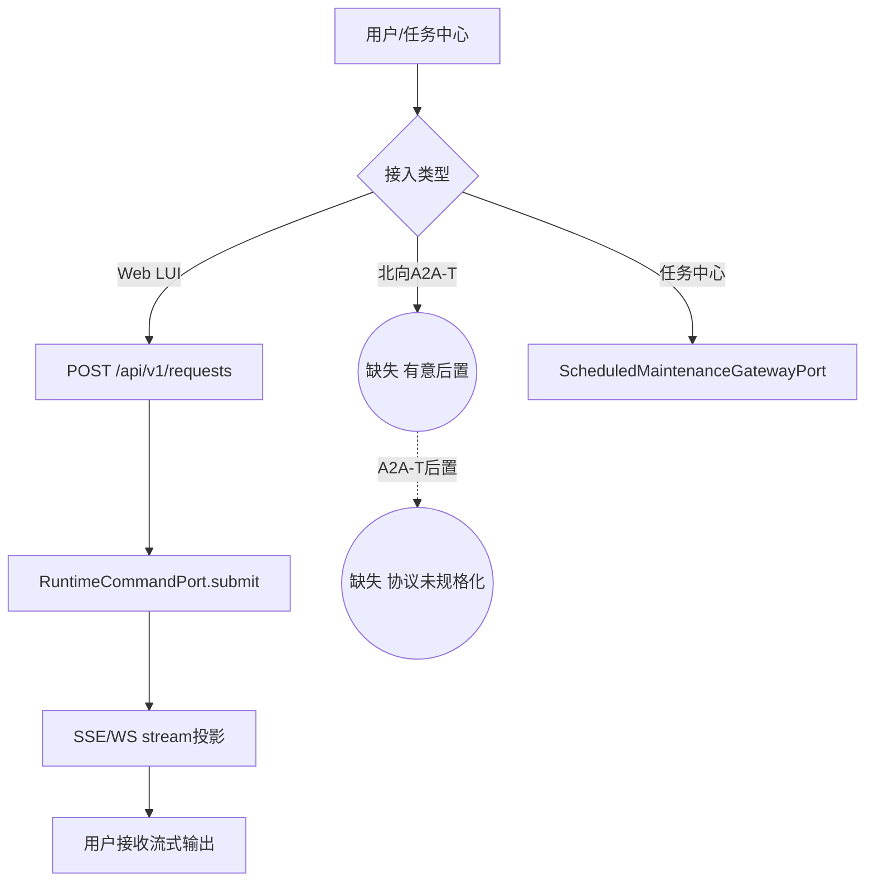
```mermaid
flowchart TD
  A[用户/任务中心] --> B{接入类型}
  B -- Web LUI --> C["POST /api/v1/requests"]
  B -- 北向A2A-T --> D((缺失 有意后置))
  B -- 任务中心 --> E["ScheduledMaintenanceGatewayPort"]
  C --> F["RuntimeCommandPort.submit"]
  F --> G["SSE/WS stream投影"]
  G --> H[用户接收流式输出]
  D -.A2A-T后置.-> I((缺失 协议未规格化))
```

**流程要点**：Web(SSE/WS)已规格化且等价投影；A2A-T北向与任务中心接入属有意后置/缺失。

#### 1.1.1 Web接入(SSE/WS)

> SSE/WS流式输出timeline envelope

**符合性**

| 评估维度 | 结果 |
|---|---|
| AF系统规格基线 | ⚠️ 部分符合 |
| spec | ts-web-sse-ws-transports / ts-minimal-agent-kernel |
| spec来源 | specs/ts-web-sse-ws-transports/spec.md; specs/ts-minimal-agent-kernel/spec.md |

**缺失/偏差说明**

A2A-T北向协议和任务中心接入缺失(详见1.1.2/1.1.3)
#### 1.1.2 A2A-T北向接入

> 北向协议接入(有意后置)

**符合性**

| 评估维度 | 结果 |
|---|---|
| AF系统规格基线 | N/A |

**缺失/偏差说明**

openspec未规格化A2A-T协议，仅有Web channel(SSE/WS)，属有意后置(D类)
#### 1.1.3 任务中心接入

> 定时任务/任务中心接入(缺失)

**符合性**

| 评估维度 | 结果 |
|---|---|
| AF系统规格基线 | N/A |

**缺失/偏差说明**

仅见ScheduledMaintenanceGatewayPort内部维护口，未见面向任务中心的接入规格

---

### 1.2 流恢复与重放

> 断点续传、conversation bootstrap、冷启动

**接口信息**

> 涉及接口：SSE `/api/v1/sessions/:sessionId/stream`
**SSE /api/v1/sessions/:sessionId/stream** — 携带 lastSeenSequence 断线重连，从 sequence > lastSeenSequence 重放后继续 live

**参数规格**

| 参数 | 必填 | 描述 |
|---|---|---|
| sessionId | 是 | 会话 ID（path parameter） |
| lastSeenSequence | 否 | 已消费的最后 sequence，省略时 live-tail，显式 0 时全量 replay |
| requestId | 否 | 限定请求 ID（bounded recovery） |
| runId | 否 | 限定运行 ID（bounded recovery） |

**响应体**

```json
同流式传输响应结构，从 sequence > lastSeenSequence 开始重放后继续 live
```


**涉及 spec**

| spec | 变更 | 场景类型 |
|---|---|---|
| ts-core-contracts | 2026-05-29-establish-ts-core-contracts | 功能 |
| ts-minimal-agent-kernel | 2026-06-02-ship-ts-minimal-agent-kernel | 功能 |
| ts-stream-resume-replay | 2026-07-02-fix-ts-session-stream-live-tail | 功能/可靠性 |

**符合性**

| 评估维度 | 结果 |
|---|---|
| AF系统规格基线 | N/A |
| spec change覆盖度 | 有（3条映射） |
| 交叉结论 | AF系统规格基线未覆盖，change已覆盖 |


---

## 2 会话管理

> 会话全生命周期管理

### 2.1 会话创建

> 创建空会话并返回最小元数据

**接口信息**

> 涉及接口：POST `/api/v1/sessions`
**POST /api/v1/sessions** — 创建 owner+agent scoped 空会话

**请求体**

```json
{
  "locale": "zh-CN"
}

locale 可省略。
```

**响应体**

```json
{
  "sessionId": "sess_123",
  "displayTitle": "Untitled session",
  "lastActivityAt": 1719878400000
}
```


**涉及 spec**

| spec | 变更 | 场景类型 |
|---|---|---|
| session-fork-from-message | 2026-07-07-add-ts-session-fork-from-message | 功能/可靠 |
| session-lane-scheduling | 2026-06-09-add-ts-session-lane-scheduling | 功能 |
| ts-minimal-agent-kernel | 2026-06-02-ship-ts-minimal-agent-kernel | 功能 |
| ts-minimal-agent-kernel | 2026-07-02-add-ts-session-delete | 功能 |

**符合性**

| 评估维度 | 结果 |
|---|---|
| AF系统规格基线 | N/A |
| spec change覆盖度 | 有（4条映射） |
| 交叉结论 | AF系统规格基线未覆盖，change已覆盖 |


---

### 2.2 会话查看

> 查询会话列表（分页）和搜索

**接口信息**

> 涉及接口：GET `/api/v1/sessions`
**GET /api/v1/sessions** — 查询会话列表，支持 offset/limit 分页和搜索过滤

**参数规格**

| 参数 | 必填 | 描述 |
|---|---|---|
| offset | 否 | 非负整数，默认 0 |
| limit | 否 | 正整数；普通列表默认 50；搜索场景默认 20 且最大 50 |
| q | 否 | 问题搜索文本，trim 后 ASCII 至少 3 个字符，非 ASCII 至少 2 个字符，最大 50 个字符 |
| createdFrom | 否 | epoch milliseconds；必须和 createdTo 同时提供 |
| createdTo | 否 | epoch milliseconds；必须大于等于 createdFrom，范围不超过 90 天 |

**响应体**

```json
{
  "entries": [
    {
      "sessionId": "sess_123",
      "displayTitle": "基站故障诊断",
      "lastActivityAt": 1719878400000,
      "lastRunStatus": "COMPLETED",
      "hasInFlightRequest": false
    }
  ],
  "offset": 0,
  "limit": 50,
  "hasMore": false
}
```

**GET /api/v1/sessions** — 携带 q/createdFrom/createdTo 参数搜索会话

**参数规格**

| 参数 | 必填 | 描述 |
|---|---|---|
| q | 是 | 问题搜索文本，trim 后 ASCII 至少 3 个字符，非 ASCII 至少 2 个字符，最大 50 个字符 |
| createdFrom | 否 | epoch milliseconds；必须和 createdTo 同时提供 |
| createdTo | 否 | epoch milliseconds；必须大于等于 createdFrom，范围不超过 90 天 |
| offset | 否 | 非负整数，默认 0 |
| limit | 否 | 正整数；搜索场景默认 20 且最大 50 |

**响应体**

```json
同会话列表响应结构，entries 只含匹配会话
```


**涉及 spec**

| spec | 变更 | 场景类型 |
|---|---|---|
| session-history-search | 2026-07-01-add-ts-session-history-search | 功能/安全 |
| session-history-search | 2026-07-02-add-ts-session-delete | 功能 |
| session-history-search | 2026-07-02-refine-ts-session-history-time-filter | 功能 |

**符合性**

| 评估维度 | 结果 |
|---|---|
| AF系统规格基线 | N/A |
| spec change覆盖度 | 有（3条映射） |
| 交叉结论 | AF系统规格基线未覆盖，change已覆盖 |


---

### 2.3 会话删除

> 删除当前 scope 下会话及从属

**接口信息**

> 涉及接口：DELETE `/api/v1/sessions/:sessionId`
**DELETE /api/v1/sessions/:sessionId** — 删除当前身份和 Agent Scope 下的会话

**参数规格**

| 参数 | 必填 | 描述 |
|---|---|---|
| sessionId | 是 | 会话 ID（path parameter） |

**响应体**

```json
无响应体，成功返回 204 No Content
```


**涉及 spec**

| spec | 变更 | 场景类型 |
|---|---|---|
| conversation-annotation | 2026-07-02-add-ts-session-delete | 功能/安全 |
| session-delete | 2026-07-02-add-ts-session-delete | 功能/安全 |
| session-history-search | 2026-07-02-add-ts-session-delete | 功能 |
| ts-minimal-agent-kernel | 2026-07-02-add-ts-session-delete | 功能 |

**符合性**

| 评估维度 | 结果 |
|---|---|
| AF系统规格基线 | N/A |
| spec change覆盖度 | 有（4条映射） |
| 交叉结论 | AF系统规格基线未覆盖，change已覆盖 |


---

### 2.4 会话预览与导航

> 预览标记页和消息定位

**接口信息**

> 涉及接口：GET `/api/v1/sessions/:sessionId/conversation`
**GET /api/v1/sessions/:sessionId/conversation** — 读取会话消息页，支持 cursor 翻页和锚点导航

**参数规格**

| 参数 | 必填 | 描述 |
|---|---|---|
| sessionId | 是 | 会话 ID（path parameter） |
| limit | 否 | 正整数，默认 50 |
| cursor | 否 | before cursor，用于向历史方向翻页 |
| newerCursor | 否 | after cursor，用于加载更新消息 |
| anchorMessageId | 否 | 锚点消息 ID |
| includeCapabilityResults | 否 | 字符串 "true" 时包含 capability result；其他值视为 false |

**响应体**

`nextCursor`（更旧方向下一页）与 `newerCursor`（更新方向下一页）出现规则（`cursor`/`newerCursor`/`anchorMessageId` 三者互斥）：

| 请求参数 | `nextCursor` | `newerCursor` |
|---|---|---|
| 无 cursor（首屏） | 有更旧消息时返回 | 不返回（首屏已是最新） |
| `cursor`（向历史翻页） | 有更旧消息时返回 | 不返回 |
| `newerCursor`（向更新翻页） | 不返回 | 有更新消息时返回 |
| `anchorMessageId`（锚点取前后页） | 锚点前有更旧消息时返回 | 锚点后有更新消息时返回 |

> 单方向翻页只返回该方向 cursor；需双向 cursor 用 `anchorMessageId`。cursor 值为裸 `messageId`（如 `msg_9`），不带 `before:`/`after:` 前缀。

示例响应（`anchorMessageId` 场景，前后均有更多消息，故同时返回两个 cursor）：

```json
{
  "items": [
    {
      "messageId": "msg_1",
      "sessionId": "sess_123",
      "requestId": "req_1",
      "runId": "run_1",
      "role": "USER",
      "sequence": 1,
      "content": "分析小区掉话率升高原因",
      "contentType": "TEXT",
      "metadata": {},
      "createdAt": 1719878400000,
      "visible": true
    }
  ],
  "nextCursor": "msg_1",
  "newerCursor": "msg_9",
  "activeRun": {
    "requestId": "req_2",
    "runId": "run_2",
    "status": "RUNNING"
  }
}
```


**涉及 spec**

| spec | 变更 | 场景类型 |
|---|---|---|
| session-conversation-preview | 2026-07-01-add-ts-conversation-preview-navigation | 功能/安全 |
| ts-minimal-agent-kernel | 2026-06-02-ship-ts-minimal-agent-kernel | 功能 |

**符合性**

| 评估维度 | 结果 |
|---|---|
| AF系统规格基线 | N/A |
| spec change覆盖度 | 有（2条映射） |
| 交叉结论 | AF系统规格基线未覆盖，change已覆盖 |


---

### 2.5 会话标题

> 自动生成和手动更新标题

**接口信息**

> 涉及接口：PUT `/api/v1/sessions/:sessionId/title`
**PUT /api/v1/sessions/:sessionId/title** — 更新会话标题，设置 titleSource=manual 阻止自动覆盖

**参数规格**

| 参数 | 必填 | 描述 |
|---|---|---|
| sessionId | 是 | 会话 ID（path parameter） |

**请求体**

```json
{
  "title": "基站故障诊断"
}

title trim 后 4-100 字符；空标题清除 title。
```

**响应体**

```json
{
  "sessionId": "sess_123",
  "title": "基站故障诊断"
}
```


**涉及 spec**

| spec | 变更 | 场景类型 |
|---|---|---|
| session-title-generation | 2026-06-10-add-ts-session-title-generation | 功能 |
| session-title-update | 2026-06-10-add-ts-session-title-update | 功能/安全 |

**符合性**

| 评估维度 | 结果 |
|---|---|
| AF系统规格基线 | N/A |
| spec change覆盖度 | 有（2条映射） |
| 交叉结论 | AF系统规格基线未覆盖，change已覆盖 |


---

### 2.6 会话标注

> 对话标注 upsert 和收藏

**接口信息**

> 涉及接口：POST `/api/v1/sessions/:sessionId/runs/:runId/annotations`、GET `/api/v1/favorites`、GET `/api/v1/sessions/:sessionId/annotations`
**POST /api/v1/sessions/:sessionId/runs/:runId/annotations** — upsert 对话标注，owner scope 来自 IdentityResolver，agent scope 来自 session 绑定

**参数规格**

| 参数 | 必填 | 描述 |
|---|---|---|
| sessionId | 是 | 会话 ID（path parameter） |
| runId | 是 | 被标注的 request run ID（path parameter） |

**请求体**

```json
{
  "sentiment": "UP",
  "isFavorited": true,
  "comment": "很有帮助"
}

sentiment 可选（"UP"/"DOWN"/null）；isFavorited 可选（boolean）；comment 可选（string|null，最长 1000 字符）。至少提供其一。sentiment=null 且 isFavorited=false 时物理删除该行。
```

**响应体**

```json
{
  "annotationId": "ann_1",
  "sessionId": "sess_123",
  "requestRunId": "run_1",
  "sentiment": "UP",
  "isFavorited": true,
  "comment": "很有帮助",
  "createdAt": 1719878400000
}

删除时返回 200 和空状态 { sentiment: null, isFavorited: false, comment: null }
```

**GET /api/v1/favorites** — 分页列出当前 owner+agent scope 下 isFavorited=true 的会话

**参数规格**

| 参数 | 必填 | 描述 |
|---|---|---|
| offset | 否 | 非负整数，默认 0 |
| limit | 否 | 正整数，默认 50，上限 100 |

**响应体**

```json
{
  "entries": [
    {
      "sessionId": "sess_123",
      "favoriteCount": 3
    }
  ],
  "offset": 0,
  "limit": 50,
  "hasMore": false
}
```

**GET /api/v1/sessions/:sessionId/annotations** — 列出指定会话内所有标注记录，按 createdAt 升序排列

**参数规格**

| 参数 | 必填 | 描述 |
|---|---|---|
| sessionId | 是 | 会话 ID（path parameter） |

**响应体**

```json
{
  "annotations": [
    {
      "annotationId": "ann_1",
      "requestRunId": "run_1",
      "sentiment": "UP",
      "isFavorited": false,
      "comment": null,
      "createdAt": 1719878400000
    }
  ]
}
```


**涉及 spec**

| spec | 变更 | 场景类型 |
|---|---|---|
| conversation-annotation | 2026-06-27-add-ts-conversation-annotation | 功能/安全/可靠性/可观测性 |

**符合性**

| 评估维度 | 结果 |
|---|---|
| AF系统规格基线 | N/A |
| spec change覆盖度 | 有（1条映射） |
| 交叉结论 | AF系统规格基线未覆盖，change已覆盖 |


---

### 2.7 会话分享

> 创建分享链接和只读查看

**接口信息**

> 涉及接口：POST `/api/v1/sessions/:sessionId/shares`、GET `/api/v1/shares/:shareId/conversation`
**POST /api/v1/sessions/:sessionId/shares** — 为会话中的指定 run 创建分享链接

**参数规格**

| 参数 | 必填 | 描述 |
|---|---|---|
| sessionId | 是 | 会话 ID（path parameter） |

**请求体**

```json
{
  "runIds": [
    "run_1"
  ],
  "originUrl": "http://127.0.0.1:3000/session/sess_123",
  "expiresIn": "7d",
  "allowedOps": [
    "view"
  ]
}

runIds 必填（非空数组）；originUrl 必填（非空 URL）；expiresIn 必填（"24h"/"7d"/"30d"/"permanent"）；allowedOps 必填（string 数组或 null）。
```

**响应体**

```json
{
  "shareId": "share_1",
  "shareUrl": "http://127.0.0.1:3000/share/share_1"
}
```

**GET /api/v1/shares/:shareId/conversation** — 读取分享会话内容，可通过 X-Viewer-Ops header 传入 viewer ops

**参数规格**

| 参数 | 必填 | 描述 |
|---|---|---|
| shareId | 是 | 分享 ID（path parameter） |

**响应体**

```json
{
  "sessionId": "sess_123",
  "messages": [
    {
      "messageId": "msg_1",
      "sessionId": "sess_123",
      "requestId": "req_1",
      "runId": "run_1",
      "role": "USER",
      "content": "分析小区掉话率升高原因",
      "contentType": "TEXT",
      "metadata": {},
      "visible": true,
      "createdAt": 1719878400000
    }
  ],
  "createdAt": 1719878400000
}

分享过期或不存在返回 403/404/410，错误码如 SHARE_EXPIRED
```


**涉及 spec**

| spec | 变更 | 场景类型 |
|---|---|---|
| conversation-share | 2026-06-28-add-ts-conversation-share | 功能/安全/可靠性 |
| conversation-share | 2026-07-02-add-ts-session-delete | 功能/安全 |

**符合性**

| 评估维度 | 结果 |
|---|---|
| AF系统规格基线 | N/A |
| spec change覆盖度 | 有（2条映射） |
| 交叉结论 | AF系统规格基线未覆盖，change已覆盖 |


---

### 2.8 历史读取与一致性

> 历史消息翻页和 stream-history 一致性

**接口信息**

> 涉及接口：GET `/api/v1/sessions/:sessionId/conversation`
**GET /api/v1/sessions/:sessionId/conversation** — 读取会话历史消息，默认返回最近 visible 窗口

**参数规格**

| 参数 | 必填 | 描述 |
|---|---|---|
| sessionId | 是 | 会话 ID（path parameter） |
| limit | 否 | 正整数，默认 50 |
| cursor | 否 | before cursor，用于向历史方向翻页 |
| includeCapabilityResults | 否 | 字符串 "true" 时包含 capability result；其他值视为 false |

**响应体**

```json
同会话预览与导航响应结构
```


**涉及 spec**

| spec | 变更 | 场景类型 |
|---|---|---|
| large-content-references | 2026-06-11-add-ts-large-content-references | 功能 |
| local-session-store | 2026-06-10-add-ts-local-session-store | 功能 |
| ts-core-contracts | 2026-05-29-establish-ts-core-contracts | 功能 |
| ts-minimal-agent-kernel | 2026-06-02-ship-ts-minimal-agent-kernel | 功能 |

**符合性**

| 评估维度 | 结果 |
|---|---|
| AF系统规格基线 | N/A |
| spec change覆盖度 | 有（4条映射） |
| 交叉结论 | AF系统规格基线未覆盖，change已覆盖 |


---

## 3 请求管理

> 请求提交、取消、重试、调度、路由和幂等

### 3.1 请求提交

> 提交请求，响应时长≤500ms，命令幂等

**接口信息**

> 涉及接口：POST `/api/v1/requests`、POST `/api/v1/sessions/:sessionId/requests`
**POST /api/v1/requests** — 便捷提交，可不携带 sessionId 自动创建会话

**请求体**

```json
{
  "inputText": "分析小区掉话率升高原因",
  "idempotencyKey": "idem-001",
  "locale": "zh-CN",
  "routingConstraints": {
    "targetSkill": "network-diagnosis"
  }
}

字段约束：inputText 必填（非空）；idempotencyKey 必填（非空）；locale 可选；routingConstraints 可选；attachments 可选（JSON 模式只允许空数组，非空附件用 multipart）。
```

**响应体**

```json
{
  "sessionId": "sess_123",
  "requestId": "req_1",
  "runId": "run_1",
  "attempt": 1
}
```

**POST /api/v1/sessions/:sessionId/requests** — session-scoped 提交问答请求，进入 same-lane 排队

**参数规格**

| 参数 | 必填 | 描述 |
|---|---|---|
| sessionId | 是 | 会话 ID（path parameter） |

**请求体**

```json
同便捷提交请求体
```

**响应体**

```json
同便捷提交响应体
```


> 涉及接口：POST `/api/v1/requests`
**POST /api/v1/requests** — 便捷提交，使用相同 idempotencyKey 重复提交返回首次结果

**请求体**

```json
同请求提交请求体，使用相同 idempotencyKey
```

**响应体**

```json
返回首次 accepted run 结果，不创建重复副作用
```


**涉及 spec**

| spec | 变更 | 场景类型 |
|---|---|---|
| frequent-question-api | 2026-07-03-add-ts-high-frequency-question | 功能 |
| fullstack-packaging-boundary | 2026-06-04-refine-ts-fullstack-packaging-boundary | 功能 |
| large-content-references | 2026-06-11-add-ts-large-content-references | 功能 |
| session-lane-scheduling | 2026-06-09-add-ts-session-lane-scheduling | 功能 |
| ts-core-contracts | 2026-05-29-establish-ts-core-contracts | 功能 |
| ts-core-contracts | 2026-06-22-add-ts-agent-tool | 功能/安全 |
| ts-core-contracts | 2026-07-08-add-ts-request-model-thinking-control | 可靠 |
| ts-minimal-agent-kernel | 2026-06-02-ship-ts-minimal-agent-kernel | 功能 |
| ts-minimal-agent-kernel | 2026-07-08-add-ts-request-model-thinking-control | 功能 |
| ts-web-command-idempotency | 2026-06-10-add-ts-web-command-idempotency | 功能 |
| user-question-activity | 2026-07-03-add-ts-high-frequency-question | 功能/可靠 |
| ts-attachment-intake | 2026-06-23-add-ts-attachment-intake | 功能 |

**符合性**

| 评估维度 | 结果 |
|---|---|
| AF系统规格基线 | ⚠️ 部分符合 |
| spec | ts-minimal-agent-kernel |
| spec来源 | specs/ts-minimal-agent-kernel/spec.md; designs/architecture/core-contracts.md:1935 |
| spec change覆盖度 | 有（12条映射） |
| 交叉结论 | AF系统规格基线部分覆盖，change已覆盖 |

**缺失/偏差说明**

**请求管理/提交请求**: - <=500ms 响应时长SLO：openspec未将量化时延写入行为spec，属B类（量化SLO不入spec）

**

**业务流程图**

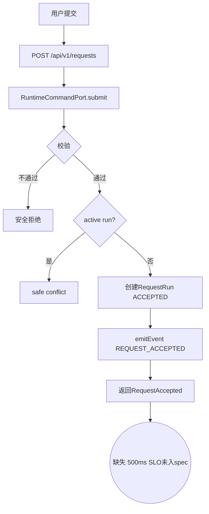
```mermaid
flowchart TD
  A[用户提交] --> B["POST /api/v1/requests"]
  B --> C["RuntimeCommandPort.submit"]
  C --> D{校验}
  D -- 不通过 --> E[安全拒绝]
  D -- 通过 --> F{active run?}
  F -- 是 --> G[safe conflict]
  F -- 否 --> H["创建RequestRun ACCEPTED"]
  H --> I["emitEvent REQUEST_ACCEPTED"]
  I --> J["返回RequestAccepted"]
  J --> K((缺失 500ms SLO未入spec))
```

**流程要点**：提交流程与accept事件已规格化；500ms量化SLO未入spec（B类）。


---

### 3.2 请求取消

> 执行中请求取消，级联取消

**接口信息**

> 涉及接口：POST `/api/v1/sessions/:sessionId/cancel`
**POST /api/v1/sessions/:sessionId/cancel** — 取消会话中最新请求

**参数规格**

| 参数 | 必填 | 描述 |
|---|---|---|
| sessionId | 是 | 会话 ID（path parameter） |

**请求体**

```json
{
  "expectedLatestRequestId": "req_1",
  "action": "CANCEL_LATEST",
  "idempotencyKey": "idem-cancel-001"
}

字段约束：expectedLatestRequestId 必填；action 可选（"CANCEL"/"CANCEL_LATEST"）；idempotencyKey 必填。
```

**响应体**

```json
{
  "sessionId": "sess_123",
  "targetRequestId": "req_1",
  "action": "CANCEL",
  "idempotencyKey": "idem-cancel-001"
}
```


**涉及 spec**

| spec | 变更 | 场景类型 |
|---|---|---|
| request-cancel | 2026-06-09-add-ts-request-cancel | 功能/安全 |
| ts-minimal-agent-kernel | 2026-06-02-ship-ts-minimal-agent-kernel | 功能 |

**符合性**

| 评估维度 | 结果 |
|---|---|
| AF系统规格基线 | ✅ 符合 |
| spec | request-cancel |
| spec来源 | specs/request-cancel/spec.md; designs/architecture/core-contracts.md:1936,1951,1455,1459 |
| spec change覆盖度 | 有（2条映射） |
| 交叉结论 | AF系统规格基线已覆盖，change已覆盖 |

**缺失/偏差说明**

**请求管理/取消请求**: - 无

**

**业务流程图**

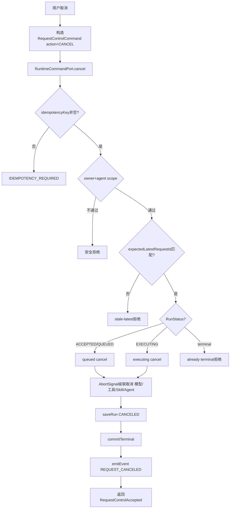
```mermaid
flowchart TD
  A[用户取消] --> B["构造RequestControlCommand action=CANCEL"]
  B --> C["RuntimeCommandPort.cancel"]
  C --> D{idempotencyKey非空?}
  D -- 否 --> E[IDEMPOTENCY_REQUIRED]
  D -- 是 --> F{owner+agent scope}
  F -- 不通过 --> G[安全拒绝]
  F -- 通过 --> H{expectedLatestRequestId匹配?}
  H -- 否 --> I[stale-latest拒绝]
  H -- 是 --> J{RunStatus?}
  J -- ACCEPTED/QUEUED --> K[queued cancel]
  J -- EXECUTING --> L[executing cancel]
  J -- terminal --> M[already terminal拒绝]
  K --> N["AbortSignal级联取消 模型/工具/Skill/Agent"]
  L --> N
  N --> O["saveRun CANCELED"]
  O --> P["commitTerminal"]
  P --> Q["emitEvent REQUEST_CANCELED"]
  Q --> R["返回RequestControlAccepted"]
```

**流程要点**：cancel作用于latest可取消run；级联通过AbortSignal传播；终态run不可取消。


---

### 3.3 请求重试

> 已结束请求重试，同一请求最多5次

**接口信息**

> 涉及接口：POST `/api/v1/sessions/:sessionId/retry`
**POST /api/v1/sessions/:sessionId/retry** — 重试会话中最新请求，创建新 run

**参数规格**

| 参数 | 必填 | 描述 |
|---|---|---|
| sessionId | 是 | 会话 ID（path parameter） |

**请求体**

```json
{
  "expectedLatestRequestId": "req_1",
  "idempotencyKey": "idem-retry-001"
}
```

**响应体**

```json
{
  "sessionId": "sess_123",
  "requestId": "req_2",
  "runId": "run_2",
  "attempt": 2
}
```


**涉及 spec**

| spec | 变更 | 场景类型 |
|---|---|---|
| request-retry | 2026-06-09-add-ts-request-retry | 功能 |

**符合性**

| 评估维度 | 结果 |
|---|---|
| AF系统规格基线 | ⚠️ 部分符合 |
| spec | request-retry |
| spec来源 | specs/request-retry/spec.md; designs/architecture/core-contracts.md:1937 |
| spec change覆盖度 | 有（1条映射） |
| 交叉结论 | AF系统规格基线部分覆盖，change已覆盖 |

**缺失/偏差说明**

**请求管理/请求重试**: - 最多5次重试上限：openspec未规定maxRetry上限，attempt递增无上限校验（B类：量化SLO不入spec + C类：数量上限未规格化）

**

**业务流程图**

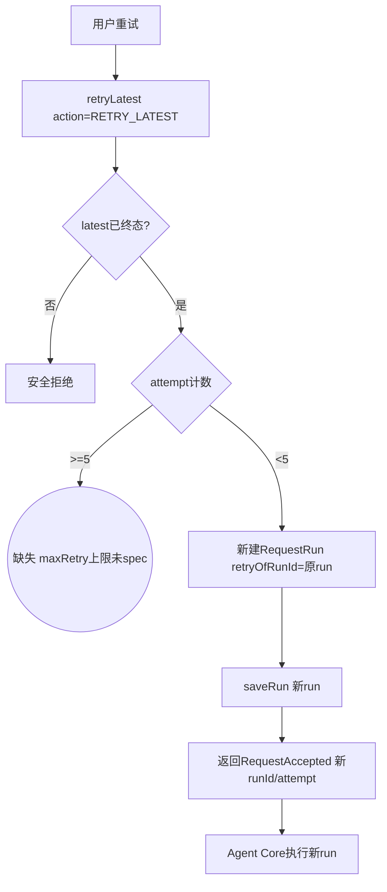
```mermaid
flowchart TD
  A[用户重试] --> B["retryLatest action=RETRY_LATEST"]
  B --> C{latest已终态?}
  C -- 否 --> D[安全拒绝]
  C -- 是 --> E{attempt计数}
  E -- ">=5" --> F((缺失 maxRetry上限未spec))
  E -- "<5" --> G["新建RequestRun retryOfRunId=原run"]
  G --> H["saveRun 新run"]
  H --> I["返回RequestAccepted 新runId/attempt"]
  I --> J[Agent Core执行新run]
```

**流程要点**：retryLatest作用于latest已终态请求；maxRetry=5上限未在spec规定（缺失）。


---

### 3.4 请求调度

> 单session 1活动请求、新请求抢占、优先级调度

**接口信息**

> 涉及接口：POST `/api/v1/sessions/:sessionId/requests`
**POST /api/v1/sessions/:sessionId/requests** — session-scoped 提交进入 same-lane 排队

**参数规格**

| 参数 | 必填 | 描述 |
|---|---|---|
| sessionId | 是 | 会话 ID（path parameter） |

**请求体**

```json
同请求提交请求体
```

**响应体**

```json
同请求提交响应体
```


**涉及 spec**

| spec | 变更 | 场景类型 |
|---|---|---|
| agent-tool | 2026-06-22-add-ts-agent-tool | 性能 |
| session-lane-scheduling | 2026-06-09-add-ts-session-lane-scheduling | 功能 |
| ts-minimal-agent-kernel | 2026-06-02-ship-ts-minimal-agent-kernel | 功能 |

**符合性**

| 评估维度 | 结果 |
|---|---|
| AF系统规格基线 | ⚠️ 部分符合 |
| spec | session-lane-scheduling |
| spec来源 | specs/session-lane-scheduling/spec.md; designs/architecture/core-contracts.md:302 |
| spec change覆盖度 | 有（3条映射） |
| 交叉结论 | AF系统规格基线部分覆盖，change已覆盖 |

**缺失/偏差说明**

**请求管理/请求调度**: - 新请求抢占：openspec明确"不创建queued run、不创建replacement、不创建terminal-pending dispatch protection"，即ts-minimal内核阶段不支持抢占，仅单session单active run拒绝并发（D类：行为规格与基线冲突/有意后置）
- 最多5个新请求抢占：未规格化（C类）
- 优先级调度：priority字段已定义但排队优先级调度逻辑在minimal内核阶段未实现（A类后置）

**

**业务流程图**

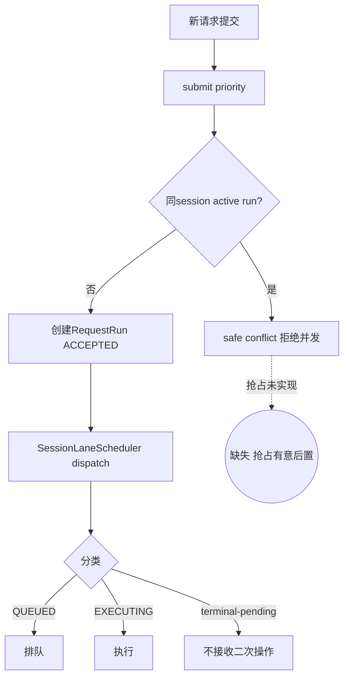
```mermaid
flowchart TD
  A[新请求提交] --> B["submit priority"]
  B --> C{同session active run?}
  C -- 是 --> D[safe conflict 拒绝并发]
  C -- 否 --> E["创建RequestRun ACCEPTED"]
  E --> F["SessionLaneScheduler dispatch"]
  F --> G{分类}
  G -- QUEUED --> H[排队]
  G -- EXECUTING --> I[执行]
  G -- terminal-pending --> J[不接收二次操作]
  D -.抢占未实现.-> K((缺失 抢占有意后置))
```

**流程要点**：minimal内核为单session单active run拒绝并发模型；抢占/优先级排队属有意后置。


---

### 3.5 请求路由

> 基于规则路由、自定义路由策略

**接口信息**（来自R27A）

| 对外接口 | 接口说明 | 接口层级 | 输入参数 | 输入参数详情(含约束) | 输出参数 | 输出参数详情 |
|---|---|---|---|---|---|---|
| `AgentRoutingPolicy` | 路由策略决策 | 内部 | request+assembly facts | frozen core contract facts | AgentRoutingPolicyResult | 路由目标决策 |
| `RuntimeCommandPort.submit(routingConstraints)` | 提交携带路由约束 | 对外 | routingConstraints? | RoutingConstraints可选 | RequestAccepted | accepted坐标 |
| `Routing evidence` | 路由证据记录 | 内部 | safe outcomes | evidence | evidence record | 非新公共DTO |

**

**涉及 spec**

| spec | 变更 | 场景类型 |
|---|---|---|
| agent-routing-core | 2026-06-21-add-ts-agent-routing-core | 功能/安全 |
| agent-routing-core | 2026-06-30-refine-ts-agent-routing | 功能/安全/可靠性 |
| routing-constraint-validation | 2026-06-21-add-ts-routing-constraint-validation | 功能/安全 |
| routing-evidence-and-fallback | 2026-06-21-add-ts-routing-evidence-and-fallback | 功能 |
| targeted-skill-routing | 2026-06-21-add-ts-targeted-skill-routing | 功能/安全 |
| ts-core-contracts | 2026-06-21-refine-ts-routing-constraints-contract | 功能/安全 |

**符合性**

| 评估维度 | 结果 |
|---|---|
| AF系统规格基线 | ⚠️ 部分符合 |
| spec | agent-routing-core / routing-evidence-and-fallback |
| spec来源 | specs/agent-routing-core/spec.md; specs/routing-evidence-and-fallback/spec.md; designs/architecture/core-contracts.md:1024 |
| spec change覆盖度 | 有（6条映射） |
| 交叉结论 | AF系统规格基线部分覆盖，change已覆盖 |

**缺失/偏差说明**

**请求管理/请求路由**: - recipe执行/agent loop/指定Skill执行/拒答 四种路由目标：openspec有routing policy但未明确这四种路由目标枚举（D类：行为规格空白）
- 50ms路由时延SLO：未入spec（B类）
- 自定义请求路由策略：routingConstraints已有但自定义策略规约未完整（A类后置）

**

**业务流程图**

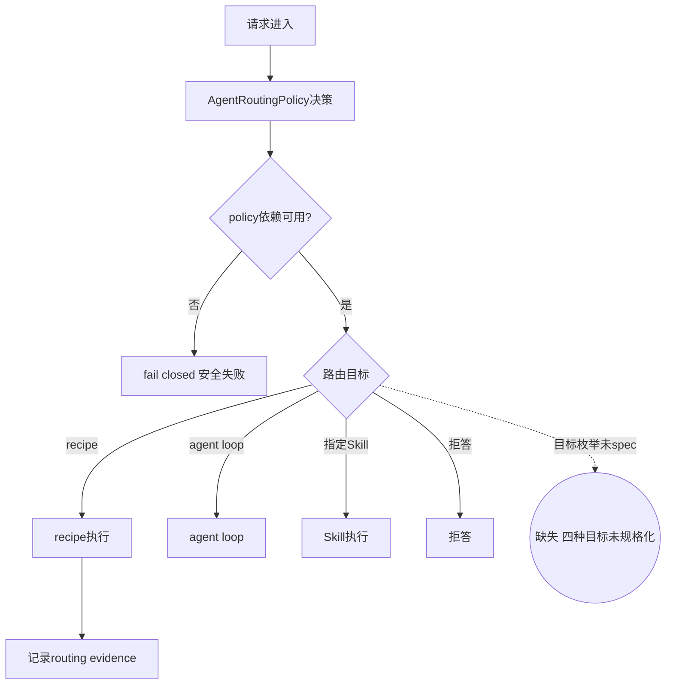
```mermaid
flowchart TD
  A[请求进入] --> B["AgentRoutingPolicy决策"]
  B --> C{policy依赖可用?}
  C -- 否 --> D[fail closed 安全失败]
  C -- 是 --> E{路由目标}
  E -- recipe --> F[recipe执行]
  E -- agent loop --> G[agent loop]
  E -- 指定Skill --> H[Skill执行]
  E -- 拒答 --> I[拒答]
  E -.目标枚举未spec.-> J((缺失 四种目标未规格化))
  F --> K[记录routing evidence]
```

**流程要点**：routing policy框架已规格化但四种路由目标枚举未明确；50ms SLO未入spec。


---

### 3.6 自定义接入

> 对接标准runtime接口

**接口信息**（来自R27A）

| 对外接口 | 接口说明 | 接口层级 | 输入参数 | 输入参数详情(含约束) | 输出参数 | 输出参数详情 |
|---|---|---|---|---|---|---|
| `RuntimeCommandPort.submit` | 标准runtime提交口 | 对外 | SubmitRequestCommand | identityContext/inputText/attachmentIds/locale/idempotencyKey必填；sessionId?/agentId?/priority? | RequestAccepted | sessionId/requestId/runId/attempt |
| `RuntimeCommandPort.cancel` | 标准runtime取消口 | 对外 | RequestControlCommand | sessionId/identityContext/expectedLatestRequestId/action/idempotencyKey | RequestControlAccepted | targetRequestId/action/idempotencyKey |
| `RuntimeCommandPort.retryLatest` | 标准runtime重试口 | 对外 | RequestControlCommand | action=RETRY_LATEST | RequestAccepted | 新runId/attempt |

**

**涉及 spec**

无

**符合性**

| 评估维度 | 结果 |
|---|---|
| AF系统规格基线 | ✅ 符合 |
| spec | ts-minimal-agent-kernel |
| spec来源 | specs/ts-minimal-agent-kernel/spec.md; designs/architecture/core-contracts.md:1934 |
| spec change覆盖度 | 无 |
| 交叉结论 | AF系统规格基线已覆盖/部分覆盖，change未覆盖 |

**缺失/偏差说明**

**流量接入/自定义接入**: - 无（自定义接入方对接RuntimeCommandPort标准接口即可）

**

**业务流程图**

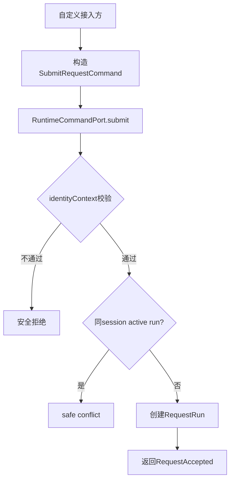
```mermaid
flowchart TD
  A[自定义接入方] --> B["构造SubmitRequestCommand"]
  B --> C["RuntimeCommandPort.submit"]
  C --> D{identityContext校验}
  D -- 不通过 --> E[安全拒绝]
  D -- 通过 --> F{同session active run?}
  F -- 是 --> G[safe conflict]
  F -- 否 --> H["创建RequestRun"]
  H --> I["返回RequestAccepted"]
```

**流程要点**：RuntimeCommandPort为稳定对外runtime接口，自定义接入方直接对接即可。


---

## 4 模型管理

> 模型调用、配置、多模型接入和fallback

### 4.1 模型调用与配置

> provider调用、profile、多模型接入、context window

**接口信息**（来自R27A）

| 对外接口 | 接口说明 | 接口层级 | 输入参数 | 输入参数详情(含约束) | 输出参数 | 输出参数详情 |
|---|---|---|---|---|---|---|
| `ModelInvocationService.complete` | 模型调用(非流式) | 内部 | ModelInvocationRequest,signal | model profile+messages | ModelFinalResult | 最终结果 |
| `ModelInvocationService.stream` | 模型调用(流式) | 内部 | ModelInvocationRequest,signal | model profile+messages | AsyncIterable<ModelStreamDelta|ModelFinalResult> | 流式delta |
| `ProviderAdapter(internal)` | provider适配 | 内部 | reviewed invocation inputs | SDK internal to agent-model | raw results | 不跨边界 |
| `ModelProfileRegistry` | 启动加载profile | 内部 | config | startup stabilize | stable runtime profile registry | 闭集provider kinds |

**

**涉及 spec**

| spec | 变更 | 场景类型 |
|---|---|---|
| context-engine | 2026-06-10-add-ts-context-history-selection | 功能 |
| model-invocation-contract | 2026-06-09-add-ts-model-invocation-contract | 功能/安全 |
| model-provider-adapter | 2026-07-08-add-ts-request-model-thinking-control | 功能 |
| model-provider-configuration | 2026-06-09-add-ts-model-provider-configuration | 功能 |
| traceable-summary-generation | 2026-06-11-add-ts-traceable-summary-generation | 安全 |
| ts-core-contracts | 2026-06-25-add-model-invocation-scope-headers | 功能/安全 |

**符合性**

| 评估维度 | 结果 |
|---|---|
| AF系统规格基线 | ⚠️ 部分符合 |
| spec | model-provider-adapter / model-provider-configuration |
| spec来源 | specs/model-provider-adapter/spec.md; specs/model-provider-configuration/spec.md; designs/architecture/core-contracts.md:1975 |
| spec change覆盖度 | 有（6条映射） |
| 交叉结论 | AF系统规格基线部分覆盖，change已覆盖 |

**缺失/偏差说明**

**多模型/多模型接入**: - 具体厂商DS/Qwen/Mistral/GLM/MiniMax：openspec选择provider-agnostic设计，不规格化具体厂商（E类：厂商生态差异）
- OpenAI/A公司两种协议：未规格化具体协议适配（E类）
- 商用模型仅DS/Qwen/Mistral：商用边界未在spec（E类）

**

**业务流程图**

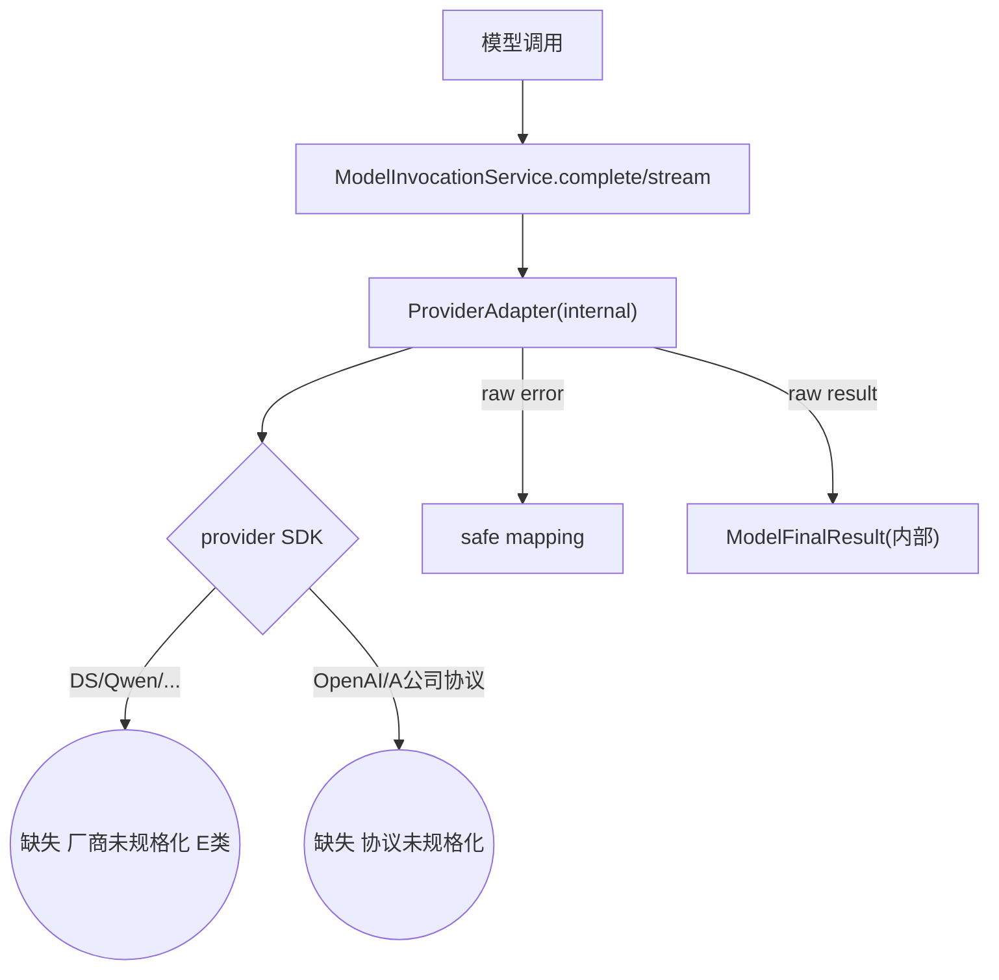
```mermaid
flowchart TD
  A[模型调用] --> B["ModelInvocationService.complete/stream"]
  B --> C["ProviderAdapter(internal)"]
  C --> D{provider SDK}
  D -- DS/Qwen/... --> E((缺失 厂商未规格化 E类))
  D -- OpenAI/A公司协议 --> F((缺失 协议未规格化))
  C -- raw error --> G[safe mapping]
  C -- raw result --> H["ModelFinalResult(内部)"]
```

**流程要点**：provider-agnostic设计；具体厂商与协议适配未规格化（E类厂商生态差异）。


---

### 4.2 流归一化与Fallback

> 流式归一化、provider错误映射

**接口信息**（来自R27A）

| 对外接口 | 接口说明 | 接口层级 | 输入参数 | 输入参数详情(含约束) | 输出参数 | 输出参数详情 |
|---|---|---|---|---|---|---|
| `Agent Core orchestration` | 显式编排fallback | 内部 | stabilized candidates,safe failure facts | future fallback evaluation | fallback decision | routing evidence |
| `Routing evidence` | fallback证据记录 | 内部 | fallback facts | evidence owned by Agent orchestration | evidence record | 非用户可见默认 |

**

**涉及 spec**

| spec | 变更 | 场景类型 |
|---|---|---|
| model-fallback-semantics | 2026-06-09-add-ts-model-fallback-semantics | 功能 |
| model-stream-normalization | 2026-06-09-add-ts-model-stream-normalization | 功能 |
| provider-error-safe-mapping | 2026-06-09-add-ts-provider-error-safe-mapping | 功能 |
| routing-evidence-and-fallback | 2026-06-21-add-ts-routing-evidence-and-fallback | 功能 |

**符合性**

| 评估维度 | 结果 |
|---|---|
| AF系统规格基线 | ⚠️ 部分符合 |
| spec | model-fallback-semantics / routing-evidence-and-fallback |
| spec来源 | specs/model-fallback-semantics/spec.md; specs/routing-evidence-and-fallback/spec.md |
| spec change覆盖度 | 有（4条映射） |
| 交叉结论 | AF系统规格基线部分覆盖，change已覆盖 |

**缺失/偏差说明**

**多模型/模型调用失败fallback**: - 指定fallback模型/自定义fallback策略：openspec明确fallback不由model invocation边界拥有，未来fallback编排消耗stabilized candidates，当前阶段fallback策略规约未完整（A类后置 + D类行为空白）

**

**业务流程图**

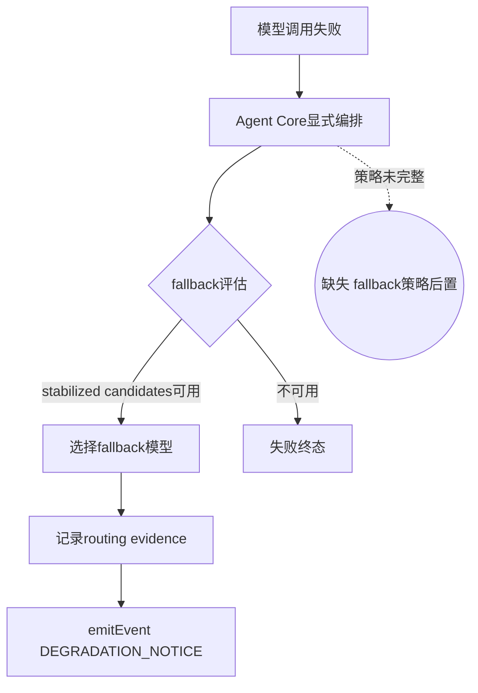
```mermaid
flowchart TD
  A[模型调用失败] --> B["Agent Core显式编排"]
  B --> C{fallback评估}
  C -- stabilized candidates可用 --> D[选择fallback模型]
  C -- 不可用 --> E[失败终态]
  D --> F["记录routing evidence"]
  F --> G["emitEvent DEGRADATION_NOTICE"]
  B -.策略未完整.-> H((缺失 fallback策略后置))
```

**流程要点**：fallback由Agent Core显式编排非model边界；指定/自定义fallback策略规约未完整。


---

### 4.3 模型选择

> 指定主模型/prompt定制/skill定制/subagent指定

**接口信息**（来自R27A）

| 对外接口 | 接口说明 | 接口层级 | 输入参数 | 输入参数详情(含约束) | 输出参数 | 输出参数详情 |
|---|---|---|---|---|---|---|
| `ModelInvocationRequest` | 模型调用请求 | 内部 | modelProfile,messages,options | profile指定模型+参数 | - | - |
| `PromptTemplateAssembly` | prompt装配模型+参数 | 内部 | purpose,context | 按purpose装配 | RenderedModelInput | 含model options |
| `AgentAssembly(agent模型)` | agent指定模型 | 内部 | agent assembly | assembly编译 | agent model profile | - |
| `Skill(fork agent模型)` | skill指定fork agent | 内部 | skill manifest agent hint | fork执行agent选择 | agent | - |

**

**涉及 spec**

无

**符合性**

| 评估维度 | 结果 |
|---|---|
| AF系统规格基线 | ✅ 符合 |
| spec | model-profile-contracts / prompt-template-assembly |
| spec来源 | specs/model-profile-contracts/spec.md; specs/prompt-template-assembly/spec.md; designs/architecture/core-contracts.md:679 |
| spec change覆盖度 | 无 |
| 交叉结论 | AF系统规格基线已覆盖/部分覆盖，change未覆盖 |

**缺失/偏差说明**

**多模型/模型选择**: - 无（主模型/prompt/skill/subagent模型选择均有契约承载）

**

**业务流程图**

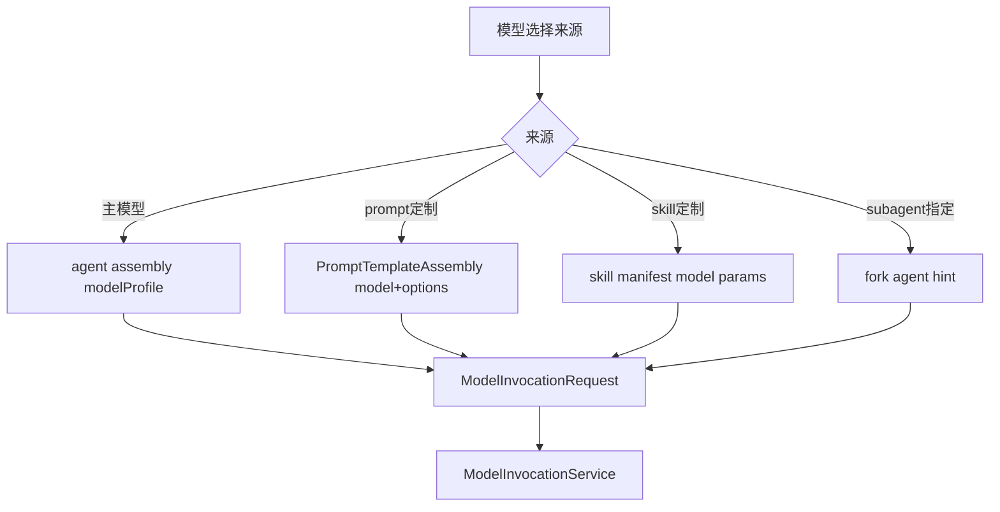
```mermaid
flowchart TD
  A[模型选择来源] --> B{来源}
  B -- 主模型 --> C["agent assembly modelProfile"]
  B -- prompt定制 --> D["PromptTemplateAssembly model+options"]
  B -- skill定制 --> E["skill manifest model params"]
  B -- subagent指定 --> F["fork agent hint"]
  C --> G["ModelInvocationRequest"]
  D --> G
  E --> G
  F --> G
  G --> H["ModelInvocationService"]
```

**流程要点**：主模型/prompt/skill/subagent四个层级模型选择均有契约承载。


---

## 5 上下文管理

> 上下文窗口、压缩、缓存和保护

### 5.1 上下文窗口自适应

> 128K-1M，自定义上下文策略

**接口信息**（来自R27A）

| 对外接口 | 接口说明 | 接口层级 | 输入参数 | 输入参数详情(含约束) | 输出参数 | 输出参数详情 |
|---|---|---|---|---|---|---|
| `ContextEnginePort.assemble` | 上下文装配 | 内部 | ContextAssemblyRequest | request+session+active context | ContextAssembly | selectedMessageRefs+budget evidence |
| `ContextEnginePort.render` | 渲染模型输入 | 内部 | ContextAssembly | assembly | RenderedModelInput | 渲染后模型输入 |
| `Budget evidence` | 预算可解释性 | 内部 | assembly | budget计算 | budget evidence | render前计算 |

**

**涉及 spec**

无

**符合性**

| 评估维度 | 结果 |
|---|---|
| AF系统规格基线 | ✅ 符合 |
| spec | context-engine / context-token-estimator |
| spec来源 | specs/context-engine/spec.md; specs/context-token-estimator/spec.md; designs/architecture/core-contracts.md:559,1970 |
| spec change覆盖度 | 无 |
| 交叉结论 | AF系统规格基线已覆盖/部分覆盖，change未覆盖 |

**缺失/偏差说明**

**上下文管理/模型上下文窗口自适应**: - 128K-1M具体数值范围：属配置/实现承载，未入行为spec（B类）；自定义上下文策略由配置承载

**

**业务流程图**

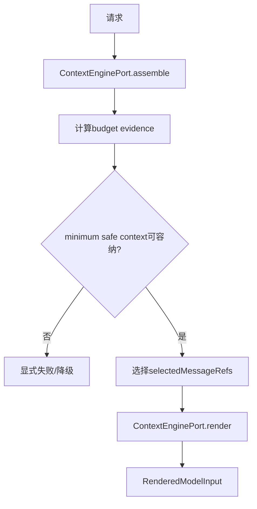
```mermaid
flowchart TD
  A[请求] --> B["ContextEnginePort.assemble"]
  B --> C["计算budget evidence"]
  C --> D{minimum safe context可容纳?}
  D -- 否 --> E[显式失败/降级]
  D -- 是 --> F["选择selectedMessageRefs"]
  F --> G["ContextEnginePort.render"]
  G --> H["RenderedModelInput"]
```

**流程要点**：上下文装配/渲染/budget可解释性已规格化；128K-1M数值范围由配置承载。


---

### 5.2 工具调用结果压缩

> 大结果摘要+转储

**接口信息**（来自R27A）

| 对外接口 | 接口说明 | 接口层级 | 输入参数 | 输入参数详情(含约束) | 输出参数 | 输出参数详情 |
|---|---|---|---|---|---|---|
| `Large-content offload` | 大内容转储 | 内部 | fresh tool result | largest fresh blocks first | persisted preview | 替换为引用 |
| `Micro-compaction` | 旧工具结果微压缩 | 内部 | eligible prior capability results | whitelisted older tool results | compacted replacement | owner-scoped幂等 |
| `ActiveContextStoreGateway` | 持久化压缩状态 | 内部 | ActiveContextItemRecord | owner scoped | record | - |

**

**涉及 spec**

无

**符合性**

| 评估维度 | 结果 |
|---|---|
| AF系统规格基线 | ✅ 符合 |
| spec | context-engine / large-content-references |
| spec来源 | specs/context-engine/spec.md; specs/large-content-references/spec.md |
| spec change覆盖度 | 无 |
| 交叉结论 | AF系统规格基线已覆盖/部分覆盖，change未覆盖 |

**缺失/偏差说明**

**上下文管理/工具调用结果压缩**: - 无（大结果摘要+转储、微压缩均已规格化）

**

**业务流程图**

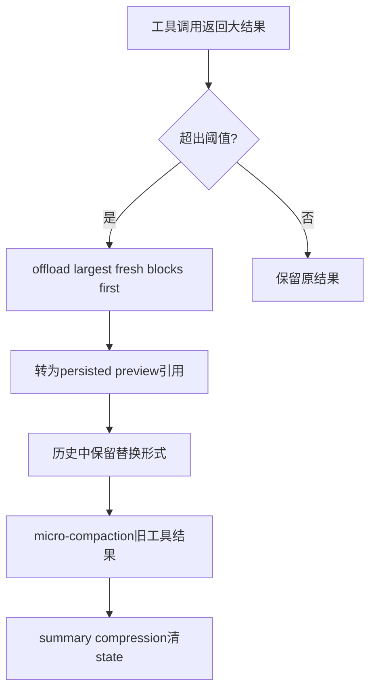
```mermaid
flowchart TD
  A[工具调用返回大结果] --> B{超出阈值?}
  B -- 是 --> C["offload largest fresh blocks first"]
  B -- 否 --> D[保留原结果]
  C --> E["转为persisted preview引用"]
  E --> F[历史中保留替换形式]
  F --> G["micro-compaction旧工具结果"]
  G --> H[summary compression清state]
```

**流程要点**：大结果转储为preview引用+微压缩旧工具结果，已规格化。


---

### 5.3 历史对话压缩

> 模型生成摘要

**接口信息**（来自R27A）

| 对外接口 | 接口说明 | 接口层级 | 输入参数 | 输入参数详情(含约束) | 输出参数 | 输出参数详情 |
|---|---|---|---|---|---|---|
| `Summary compression orchestration` | 摘要压缩编排 | 内部 | prior history | requires compression | summary | 模型生成摘要 |
| `Cancellable summary port` | 可取消摘要生成 | 内部 | summary request | cancellable | summary draft | 可取消/无效处理 |
| `Compression commit` | 压缩提交 | 内部 | summary draft | 由compression commit | committed summary | summary message |

**

**涉及 spec**

| spec | 变更 | 场景类型 |
|---|---|---|
| traceable-summary-generation | 2026-06-11-add-ts-traceable-summary-generation | 功能/安全 |

**符合性**

| 评估维度 | 结果 |
|---|---|
| AF系统规格基线 | ✅ 符合 |
| spec | context-engine |
| spec来源 | specs/context-engine/spec.md |
| spec change覆盖度 | 有（1条映射） |
| 交叉结论 | AF系统规格基线已覆盖，change已覆盖 |

**缺失/偏差说明**

**上下文管理/历史对话压缩**: - 无（摘要生成与压缩提交分离已规格化）

**

**业务流程图**

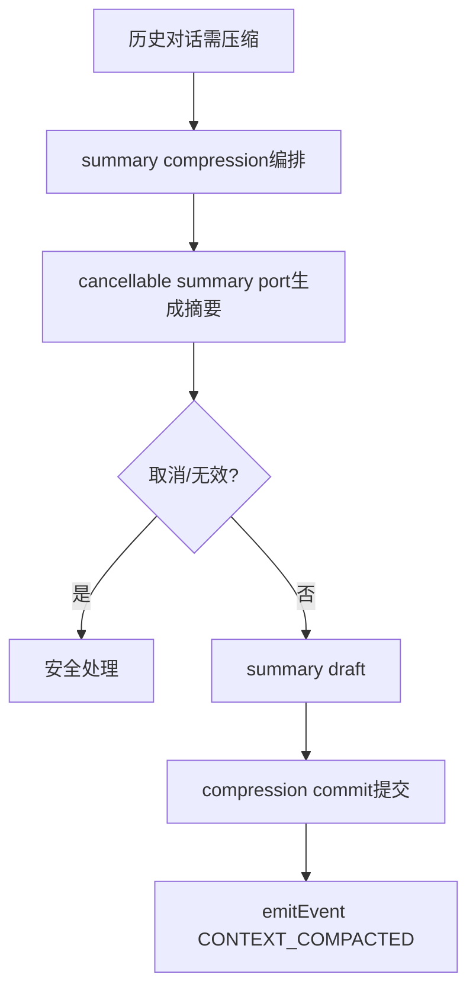
```mermaid
flowchart TD
  A[历史对话需压缩] --> B["summary compression编排"]
  B --> C["cancellable summary port生成摘要"]
  C --> D{取消/无效?}
  D -- 是 --> E[安全处理]
  D -- 否 --> F["summary draft"]
  F --> G["compression commit提交"]
  G --> H["emitEvent CONTEXT_COMPACTED"]
```

**流程要点**：摘要生成与压缩提交分离；模型生成摘要可取消。


---

### 5.4 自动压缩

> 3级压缩机制、无限轮、失败重试

**接口信息**（来自R27A）

| 对外接口 | 接口说明 | 接口层级 | 输入参数 | 输入参数详情(含约束) | 输出参数 | 输出参数详情 |
|---|---|---|---|---|---|---|
| `Summary compression` | 摘要压缩(主) | 内部 | prior history | 触发条件:上下文窗口使用 | summary | - |
| `Micro-compaction` | 微压缩(级1) | 内部 | older tool results | whitelisted | compacted | - |
| `Large-content offload` | 大内容转储(级) | 内部 | fresh large result | 阈值 | preview引用 | - |

**

**涉及 spec**

| spec | 变更 | 场景类型 |
|---|---|---|
| context-compression | 2026-06-11-add-ts-context-compression | 功能 |
| context-engine | 2026-06-11-add-ts-context-budget-explainability | 功能 |
| context-engine | 2026-06-11-add-ts-context-compression | 功能 |
| context-engine | 2026-06-23-add-ts-context-micro-compact | 功能 |
| prompt-template-assembly | 2026-06-22-add-ts-prompt-template-assembly | 功能 |
| query-policy | 2026-06-11-add-ts-context-budget-explainability | 功能 |

**符合性**

| 评估维度 | 结果 |
|---|---|
| AF系统规格基线 | ⚠️ 部分符合 |
| spec | context-engine |
| spec来源 | specs/context-engine/spec.md |
| spec change覆盖度 | 有（6条映射） |
| 交叉结论 | AF系统规格基线部分覆盖，change已覆盖 |

**缺失/偏差说明**

**上下文管理/自动压缩**: - 3级压缩机制：openspec有micro-compaction/large-content offload/summary compression多种机制，但未明确"3级"分级定义（D类：行为规格空白）
- 失败重试最多3次、缩小窗口最多2次：量化重试次数未入spec（B类+C类）
- 128K/1000轮、1M/无限轮档位：量化档位未入spec（B类）

**

**业务流程图**

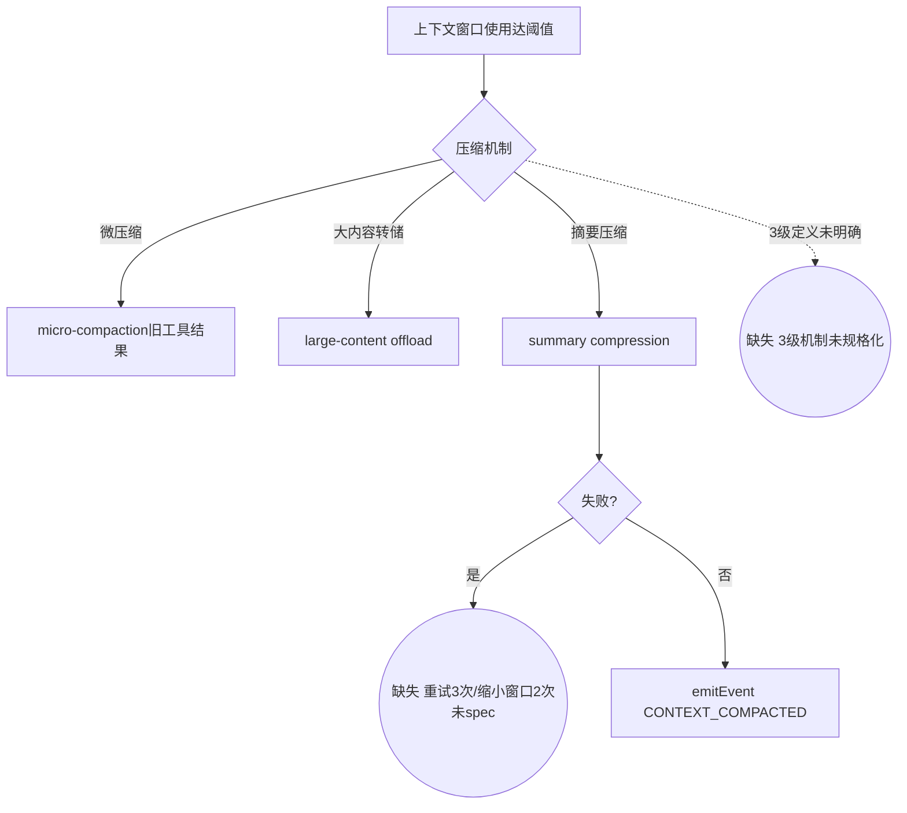
```mermaid
flowchart TD
  A[上下文窗口使用达阈值] --> B{压缩机制}
  B -- 微压缩 --> C["micro-compaction旧工具结果"]
  B -- 大内容转储 --> D["large-content offload"]
  B -- 摘要压缩 --> E["summary compression"]
  E --> F{失败?}
  F -- 是 --> G((缺失 重试3次/缩小窗口2次未spec))
  F -- 否 --> H["emitEvent CONTEXT_COMPACTED"]
  B -.3级定义未明确.-> I((缺失 3级机制未规格化))
```

**流程要点**：多种压缩机制存在但"3级"未明确；重试/窗口量化未入spec。


---

### 5.5 上下文缓存

> system prompt缓存优先100%

**接口信息**（来自R27A）

| 对外接口 | 接口说明 | 接口层级 | 输入参数 | 输入参数详情(含约束) | 输出参数 | 输出参数详情 |
|---|---|---|---|---|---|---|
| `PromptTemplateAssembly` | prompt装配 | 内部 | purpose,context | system prompt装配 | RenderedModelInput | - |

**

**涉及 spec**

无

**符合性**

| 评估维度 | 结果 |
|---|---|
| AF系统规格基线 | ❌ 缺失 |
| spec | context-engine / prompt-template-assembly |
| spec来源 | specs/context-engine/spec.md; specs/prompt-template-assembly/spec.md |
| spec change覆盖度 | 无 |
| 交叉结论 | AF系统规格基线缺失，change未覆盖 |

**缺失/偏差说明**

**上下文管理/上下文缓存**: - system prompt缓存优先策略/100%缓存：openspec无system prompt缓存机制规格，prompt装配只负责模板选择与渲染，缓存属provider/实现层未规格化（D类：行为规格空白）

**

**业务流程图**

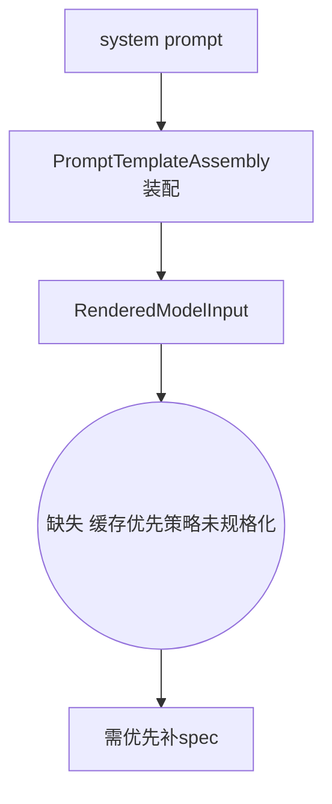
```mermaid
flowchart TD
  A[system prompt] --> B["PromptTemplateAssembly装配"]
  B --> C["RenderedModelInput"]
  C --> D((缺失 缓存优先策略未规格化))
  D --> E["需优先补spec"]
```

**流程要点**：system prompt缓存优先100%未规格化，需优先补spec。


---

### 5.6 上下文保护

> 最新5轮对话保护、skill保护

**接口信息**（来自R27A）

| 对外接口 | 接口说明 | 接口层级 | 输入参数 | 输入参数详情(含约束) | 输出参数 | 输出参数详情 |
|---|---|---|---|---|---|---|
| `Minimum safe current-request context` | 最新请求最小安全上下文保护 | 内部 | latest request | protected | protected context | - |
| `ActiveContextView` | model-visible历史权威 | 内部 | active context | history bounded by active context | view | - |
| `Current request protection` | 当前请求不可静默丢弃 | 内部 | current request | remains required | - | - |

**

**涉及 spec**

| spec | 变更 | 场景类型 |
|---|---|---|
| context-compression | 2026-06-11-add-ts-context-compression | 功能 |
| context-engine | 2026-06-11-add-ts-context-budget-explainability | 功能 |
| context-engine | 2026-06-11-add-ts-context-compression | 功能 |
| context-engine | 2026-06-23-add-ts-context-micro-compact | 功能 |
| request-attachments | 2026-06-23-add-ts-attachment-request-context-flow | 功能 |

**符合性**

| 评估维度 | 结果 |
|---|---|
| AF系统规格基线 | ⚠️ 部分符合 |
| spec | context-engine |
| spec来源 | specs/context-engine/spec.md |
| spec change覆盖度 | 有（5条映射） |
| 交叉结论 | AF系统规格基线部分覆盖，change已覆盖 |

**缺失/偏差说明**

**上下文管理/上下文保护**: - 最近完整5轮对话保护(可配置)：openspec保护"latest request minimum safe context"与"current request"，但未明确"5轮"量化与可配置（C类：数量未规格化）
- 正在使用的skill保护：未见专门skill上下文保护spec（D类）
- 关键上下文(待办等)还原：未见专门spec（D类）

**

**业务流程图**

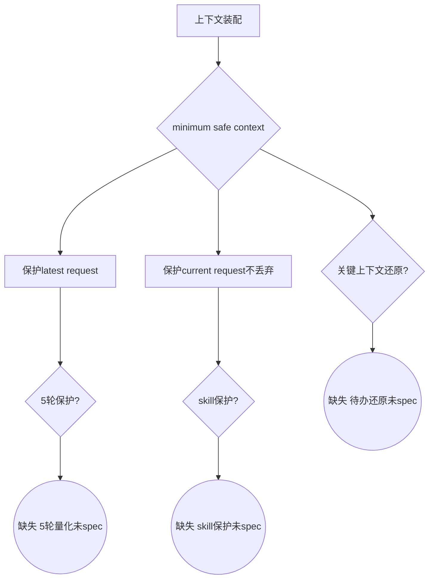
```mermaid
flowchart TD
  A[上下文装配] --> B{minimum safe context}
  B --> C[保护latest request]
  B --> D[保护current request不丢弃]
  C --> E{5轮保护?}
  E --> F((缺失 5轮量化未spec))
  D --> G{skill保护?}
  G --> H((缺失 skill保护未spec))
  B --> I{关键上下文还原?}
  I --> J((缺失 待办还原未spec))
```

**流程要点**：latest/current request保护已规格化；5轮量化、skill保护、关键上下文还原未规格化。


---

## 6 内置工具

> 内置工具、Provider、自定义工具和渐进式加载

### 6.1 文件工具

> read/write/edit/glob/grep

**接口信息**

内部工具，通过 CapabilityInvocationPort.invoke(TOOL kind) 调用

| 工具 | 说明 |
|---|---|
| read | 读取文件内容 |
| write | 写入文件 |
| edit | 编辑文件指定行 |
| glob | 文件模式匹配 |
| grep | 文本搜索 |

**涉及 spec**

| spec | 变更 | 场景类型 |
|---|---|---|
| builtin-tool-framework | 2026-06-07-add-ts-builtin-tool-framework | 功能 |
| capability-catalog | 2026-06-04-add-ts-capability-core-governance | 功能/安全 |
| edit-tool | 2026-06-21-add-ts-edit-tool | 功能/安全 |
| glob-tool | 2026-06-11-add-ts-glob-tool | 功能/安全 |
| grep-tool | 2026-06-20-add-ts-grep-tool | 功能/安全 |
| skill-resource-access | 2026-06-16-add-ts-skill-resource-access | 功能 |
| ts-minimal-agent-kernel | 2026-06-02-ship-ts-minimal-agent-kernel | 功能/安全 |
| ts-minimal-agent-kernel | 2026-06-10-add-ts-bash-tool | 功能 |
| write-tool | 2026-06-11-add-ts-write-tool | 功能/安全 |

**符合性**

| 评估维度 | 结果 |
|---|---|
| AF系统规格基线 | N/A |
| spec change覆盖度 | 有（9条映射） |
| 交叉结论 | AF系统规格基线未覆盖，change已覆盖 |


---

### 6.2 Bash工具

> sandbox执行、命令allowlist

**接口信息**

内部工具，通过 CapabilityInvocationPort.invoke(TOOL kind) 调用，经 SandboxGatewayPort 提交执行

| 工具 | 说明 |
|---|---|
| bash | 执行shell命令，sandbox隔离 |

**涉及 spec**

| spec | 变更 | 场景类型 |
|---|---|---|
| bash-tool | 2026-06-10-add-ts-bash-tool | 功能/安全 |
| bash-tool | 2026-06-22-add-ts-bash-timeout-compat | 功能 |
| bash-tool | 2026-06-22-refine-ts-bash-nonzero-exit-degraded | 功能 |
| bash-tool | 2026-06-23-refine-ts-local-shell-mode-when-sandbox-disabled | 功能 |
| bash-tool | 2026-06-25-delegate-bash-policy-to-sandbox | 功能 |
| bash-tool | 2026-06-27-fix-ts-bash-unclosed-quote-hint | 功能 |
| bash-tool | 2026-07-01-refine-ts-sandbox-strict-shell-support | 功能/安全 |
| skill-resource-access | 2026-06-16-add-ts-skill-resource-access | 功能 |
| ts-minimal-agent-kernel | 2026-06-10-add-ts-bash-tool | 功能 |

**符合性**

| 评估维度 | 结果 |
|---|---|
| AF系统规格基线 | N/A |
| spec change覆盖度 | 有（9条映射） |
| 交叉结论 | AF系统规格基线未覆盖，change已覆盖 |


---

### 6.3 Python工具

> sandbox执行

**接口信息**

内部工具，通过 CapabilityInvocationPort.invoke(TOOL kind) 调用，经 SandboxGatewayPort 提交执行

| 工具 | 说明 |
|---|---|
| python | 执行Python脚本，sandbox隔离 |

**涉及 spec**

| spec | 变更 | 场景类型 |
|---|---|---|
| python-tool | 2026-06-11-add-ts-python-tool | 功能/安全 |
| python-tool | 2026-06-25-delegate-bash-policy-to-sandbox | 功能 |
| python-tool | 2026-07-08-refine-ts-python-bash-capability-failure-unification | 功能/可靠 |

**符合性**

| 评估维度 | 结果 |
|---|---|
| AF系统规格基线 | N/A |
| spec change覆盖度 | 有（3条映射） |
| 交叉结论 | AF系统规格基线未覆盖，change已覆盖 |


---

### 6.4 API工具

> askUser、agent、skill、search等

**接口信息**

内部工具，通过 CapabilityInvocationPort.invoke(TOOL kind) 调用

| 工具 | 说明 |
|---|---|
| AskUserQuestion | 面向用户提问 |
| Agent | 调用子Agent |
| Skill | 调用Skill |
| ToolSearch | 搜索工具 |
| TodoWrite | 待办管理 |
| Memory | 记忆操作 |

**涉及 spec**

| spec | 变更 | 场景类型 |
|---|---|---|
| api-backed-tool-source | 2026-06-11-add-ts-api-backed-tool-source | 功能/安全 |
| tool-search-tool | 2026-06-23-add-ts-clipc-tool-search-lazy-loading | 功能 |
| tool-search-tool | 2026-06-23-add-ts-tool-search-tool | 功能/安全 |

**符合性**

| 评估维度 | 结果 |
|---|---|
| AF系统规格基线 | N/A |
| spec change覆盖度 | 有（3条映射） |
| 交叉结论 | AF系统规格基线未覆盖，change已覆盖 |


---

### 6.5 工具执行规格

> 执行框架、超时、取消、Provider、自定义工具和渐进式加载

**接口信息**（来自R27A）

| 对外接口 | 接口说明 | 接口层级 | 输入参数 | 输入参数详情(含约束) | 输出参数 | 输出参数详情 |
|---|---|---|---|---|---|---|
| `defineTool` | 工具定义框架 | 内部 | metadata,impl | provider-neutral metadata | Tool | - |
| `Tool catalog registration` | 工具注册 | 内部 | trusted config | explicit registration | CapabilityDescriptor TOOL | structured output schema |
| `CapabilityInvocationPort.invoke` | 工具调用 | 内部 | CapabilityInvocationRequest,signal | TOOL kind | CapabilityInvocationResult | status |

**

**涉及 spec**

| spec | 变更 | 场景类型 |
|---|---|---|
| builtin-tool-framework | 2026-06-27-support-parallel-tool-calls | 功能/安全 |
| builtin-tool-framework | 2026-06-30-refine-ts-builtin-tool-descriptions | 功能 |
| capability-catalog | 2026-06-04-add-ts-capability-core-governance | 功能 |
| cross-platform-executable-semantics | 2026-06-11-add-ts-cross-platform-executable-semantics | 安全 |
| large-content-readback | 2026-06-25-add-large-tool-result-paged-readback | 功能/安全/可靠性 |
| large-content-readback | 2026-07-02-refine-ts-readback-single-call-budget | 功能 |
| large-content-references | 2026-06-11-add-ts-large-content-references | 功能 |
| large-content-references | 2026-06-25-add-large-tool-result-paged-readback | 功能 |
| large-content-references | 2026-07-02-refine-ts-large-content-tool-result-offload | 功能/可靠性 |
| tool-loop | 2026-06-27-refine-ts-tool-loop-repeat-failure-guard | 可靠性/可观测性 |
| ts-attachment-cleanup | 2026-06-22-add-ts-attachment-cleanup | 功能/可靠性 |
| ts-attachment-intake | 2026-06-23-add-ts-attachment-intake | 功能/可靠性 |
| ts-core-contracts | 2026-06-04-add-ts-capability-core-governance | 安全 |
| ts-minimal-agent-kernel | 2026-06-02-ship-ts-minimal-agent-kernel | 功能 |
| ts-minimal-agent-kernel | 2026-06-10-add-ts-bash-tool | 功能 |
| ts-minimal-agent-kernel | 2026-06-27-support-parallel-tool-calls | 功能/可靠性/性能/可观测性 |
| ts-minimal-agent-kernel | 2026-07-02-refine-ts-tool-loop-fallback-round-limit | 功能/可靠性 |
| builtin-tool-framework | 2026-06-07-add-ts-builtin-tool-framework | 功能 |
| capability-source-configuration | 2026-06-09-add-ts-capability-source-configuration | 功能 |
| tool-search-tool | 2026-06-23-add-ts-tool-search-tool | 功能 |
| tool-search-tool | 2026-06-23-add-ts-clipc-tool-search-lazy-loading | 功能/安全 |

**符合性**

| 评估维度 | 结果 |
|---|---|
| AF系统规格基线 | ✅ 符合 |
| spec | builtin-tool-framework / 各工具spec |
| spec来源 | specs/builtin-tool-framework/spec.md; specs/bash-tool/spec.md; specs/python-tool/spec.md; specs/write-tool/spec.md; specs/edit-tool/spec.md; specs/grep-tool/spec.md; specs/glob-tool/spec.md; specs/ask-user-question-tool/spec.md; specs/tool-search-tool/spec.md; specs/memory-tools/spec.md; specs/skill-tool/spec.md; specs/agent-tool/spec.md |
| spec change覆盖度 | 有（21条映射） |
| 交叉结论 | AF系统规格基线已覆盖，change已覆盖 |

**缺失/偏差说明**

**工具调用/内置全局工具**: - 无（14种工具均有对应spec：read/write/edit/grep/glob/bash/python/skill/agent/askUser/todo/search/toolSearch/memory）

**

**工具调用/禁用内置工具**: - 显式"禁用builtin工具"配置项spec：通过registration/availability承载，但未见专门的disable builtin配置spec（D类：行为规格空白）

**

**工具调用/自定义本地工具**: - 无（CUSTOM provider kind + defineTool承载自定义本地工具）

**

**工具调用/自定义工具Provider**: - 无（CUSTOM provider kind承载ToolBank等自定义provider）

**

**工具调用/工具渐进式加载**: - 无（toolSearch动态搜索+deferred加载已规格化）

**

**业务流程图**

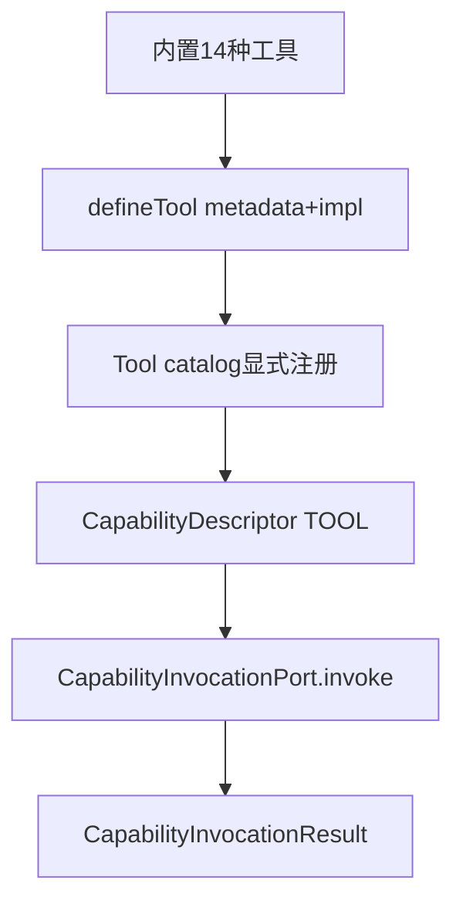
```mermaid
flowchart TD
  A[内置14种工具] --> B["defineTool metadata+impl"]
  B --> C["Tool catalog显式注册"]
  C --> D["CapabilityDescriptor TOOL"]
  D --> E["CapabilityInvocationPort.invoke"]
  E --> F["CapabilityInvocationResult"]
```

**流程要点**：14种内置工具均有spec；统一通过Tool框架+CapabilityInvocationPort调用。

#### 6.5.1 内置全局工具

> 14种内置工具

**涉及 spec**

| spec |
|---|
| builtin-tool-framework |

**符合性**

| 评估维度 | 结果 |
|---|---|
| AF系统规格基线 | ✅ 符合 |
| spec | builtin-tool-framework / 各工具spec |
| spec来源 | specs/builtin-tool-framework/spec.md; specs/bash-tool/spec.md; specs/python-tool/spec.md; specs/write-tool/spec.md; specs/edit-tool/spec.md; specs/grep-tool/spec.md; specs/glob-tool/spec.md; specs/ask-user-question-tool/spec.md; specs/tool-search-tool/spec.md; specs/memory-tools/spec.md; specs/skill-tool/spec.md; specs/agent-tool/spec.md |

**缺失/偏差说明**

无（14种工具均有对应spec）
#### 6.5.2 禁用内置工具

> 禁用builtin的14种工具

**涉及 spec**

| spec |
|---|
| builtin-tool-framework |
| capability-source-configuration |

**符合性**

| 评估维度 | 结果 |
|---|---|
| AF系统规格基线 | ⚠️ 部分符合 |
| spec | builtin-tool-framework / capability-source-configuration |
| spec来源 | specs/builtin-tool-framework/spec.md; specs/capability-source-configuration/spec.md |

**缺失/偏差说明**

通过registration/availability承载，但未见专门的disable builtin配置spec(D类)
#### 6.5.3 自定义本地工具

> 自定义本地函数工具

**涉及 spec**

| spec |
|---|
| builtin-tool-framework |
| capability-source-configuration |

**符合性**

| 评估维度 | 结果 |
|---|---|
| AF系统规格基线 | ✅ 符合 |
| spec | builtin-tool-framework / capability-source-configuration |
| spec来源 | specs/builtin-tool-framework/spec.md; specs/capability-source-configuration/spec.md; designs/architecture/core-contracts.md:819 |

**缺失/偏差说明**

无（CUSTOM provider kind + defineTool承载）
#### 6.5.4 自定义工具Provider

> 如NCE ToolBank

**涉及 spec**

| spec |
|---|
| capability-source-configuration |
| capability-catalog |

**符合性**

| 评估维度 | 结果 |
|---|---|
| AF系统规格基线 | ✅ 符合 |
| spec | capability-source-configuration / capability-catalog |
| spec来源 | specs/capability-source-configuration/spec.md; designs/architecture/core-contracts.md:237,819 |

**缺失/偏差说明**

无（CUSTOM provider kind承载ToolBank等自定义provider）
#### 6.5.5 工具渐进式加载

> 万级工具toolSearch动态搜索

**涉及 spec**

| spec |
|---|
| tool-search-tool |
| capability-catalog |

**符合性**

| 评估维度 | 结果 |
|---|---|
| AF系统规格基线 | ✅ 符合 |
| spec | tool-search-tool / capability-catalog |
| spec来源 | specs/tool-search-tool/spec.md; specs/capability-catalog/spec.md |

**缺失/偏差说明**

无（toolSearch动态搜索+deferred加载已规格化）

---

## 7 框架能力

> Skill系统、RAG、长期记忆、Agent编排和人工接管

### 7.1 Skill系统

> Skill发现、manifest、调用、资源访问

**接口信息**（来自R27A）

| 对外接口 | 接口说明 | 接口层级 | 输入参数 | 输入参数详情(含约束) | 输出参数 | 输出参数详情 |
|---|---|---|---|---|---|---|
| `LocalSkillSource(EAGER)` | 系统级EAGER来源 | 内部 | configRoot | 系统保留provider identity | Skill descriptor | builtin/system级 |
| `LocalSkillSource(SEARCH)` | agent-owned SEARCH来源 | 内部 | workspaceRoot | agent-owned | Skill descriptor | agent级 |
| `SKILL.md manifest` | skill清单 | 内部 | SKILL.md | authoritative input | SkillCapabilityMetadata | typed metadata |

**

**涉及 spec**

| spec | 变更 | 场景类型 |
|---|---|---|
| agent-scoped-plugin-composition | 2026-07-08-add-ts-agent-scoped-plugin-composition | 功能/安全 |
| builtin-skill-source | 2026-06-10-add-ts-builtin-skill-source | 功能/安全 |
| category-question-api | 2026-07-03-add-ts-category-question | 功能 |
| category-question-source | 2026-07-03-add-ts-category-question | 功能 |
| extension-registration | 2026-07-03-refine-ts-extension-registration | 功能 |
| frequent-question-api | 2026-07-03-add-ts-high-frequency-question | 功能 |
| local-skill-source | 2026-06-09-add-ts-local-skill-source | 功能/安全 |
| question-association-api | 2026-07-04-add-ts-question-association | 功能/安全 |
| skill-manifest-contract | 2026-06-05-add-ts-skill-manifest-contract | 功能 |
| skill-resource-access | 2026-06-16-add-ts-skill-resource-access | 功能/安全 |
| skill-resource-access | 2026-06-18-allow-dot-prefixed-skill-resource-directories | 功能/安全 |
| skill-selector-ui | 2026-06-25-add-ts-specify-skill-execution | 功能 |
| skill-tool | 2026-06-10-add-ts-skill-tool | 功能 |
| skillhub-source | 2026-06-21-add-ts-skillhub-source | 功能/安全 |
| web-skill-catalog | 2026-06-25-add-ts-specify-skill-execution | 功能/安全/可靠性 |

**符合性**

| 评估维度 | 结果 |
|---|---|
| AF系统规格基线 | ✅ 符合 |
| spec | local-skill-source / skill-manifest-contract |
| spec来源 | specs/local-skill-source/spec.md; specs/skill-manifest-contract/spec.md; designs/architecture/core-contracts.md:237 |
| spec change覆盖度 | 有（15条映射） |
| 交叉结论 | AF系统规格基线已覆盖，change已覆盖 |

**缺失/偏差说明**

**Skill调用/本地Skill接入**: - 无（builtin/system/agent三级通过EAGER/SEARCH+agent-owned优先承载）

**

**Skill调用/远端Skill接入**: - 无（SkillHub通过SKILL_HUB provider kind+remote gateway承载）

**

**Skill调用/Skill渐进式加载**: - "分级加载"明确定义：渐进式(元数据/内容/资源)已规格化，但"分级"具体分级规约未明确（D类：行为规格空白）

**

**Skill调用/Skill工具渐进式加载**: - 工具数量<=20：openspec未规定skill作用域工具数量上限（C类：数量上限未规格化）
- 激活时禁用部分工具：未见专门spec（D类）

**

**Skill调用/Skill执行**: - 无（inline/fork+fork agent hint+用户指定均规格化；明确不提供远端执行）

**

**Skill调用/定制模型参数**: - 无（skill manifest可定制模型+推理参数，注入ModelInvocationRequest）

**

**业务流程图**

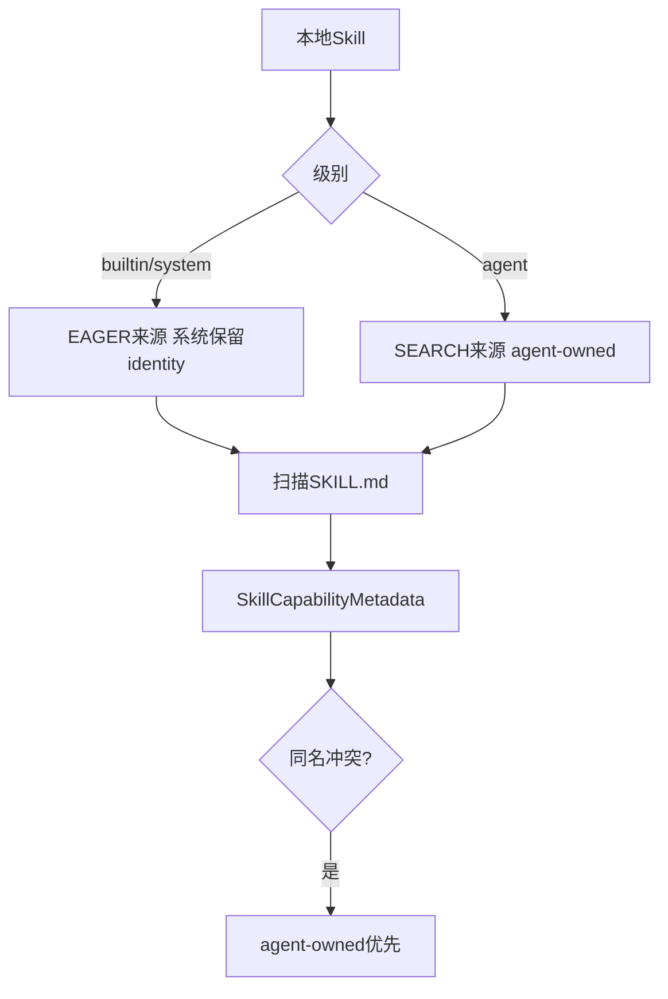
```mermaid
flowchart TD
  A[本地Skill] --> B{级别}
  B -- builtin/system --> C["EAGER来源 系统保留identity"]
  B -- agent --> D["SEARCH来源 agent-owned"]
  C --> E["扫描SKILL.md"]
  D --> E
  E --> F["SkillCapabilityMetadata"]
  F --> G{同名冲突?}
  G -- 是 --> H[agent-owned优先]
```

**流程要点**：builtin/system(EAGER)+agent(SEARCH)三级；agent-owned优先于系统级。


---

### 7.2 RAG检索

> 知识库检索

**接口信息**

内部工具，通过 CapabilityInvocationPort.invoke(TOOL kind) 调用

| 工具 | 说明 |
|---|---|
| Rag | 检索知识库 |

**涉及 spec**

| spec | 变更 | 场景类型 |
|---|---|---|
| app-config-schema | 2026-06-27-refine-rag-default-index-flow | 功能 |
| rag-knowledge-governance | 2026-06-23-add-ts-rag-knowledge-governance | 功能/安全/可靠性 |
| rag-knowledge-governance | 2026-06-27-fix-ts-rag-workspace-scoped-local-index | 功能/安全/可靠性 |
| rag-tool | 2026-06-23-add-ts-rag-tool | 功能/安全/可靠性/可观测性 |
| rag-tool | 2026-06-27-refine-rag-default-index-flow | 功能/安全/可靠性 |

**符合性**

| 评估维度 | 结果 |
|---|---|
| AF系统规格基线 | N/A |
| spec change覆盖度 | 有（5条映射） |
| 交叉结论 | AF系统规格基线未覆盖，change已覆盖 |


---

### 7.3 长期记忆

> 持久化、抽取、融合、老化

**接口信息**

内部工具，通过 CapabilityInvocationPort.invoke(TOOL kind) 调用

| 工具 | 说明 |
|---|---|
| search_memory | L1检索长期记忆 |
| get_memory_detail | 获取L2完整内容 |
| add_memory | 写入记忆 |

**涉及 spec**

| spec | 变更 | 场景类型 |
|---|---|---|
| core | 2026-06-24-add-ts-memory-core | 功能/安全/可靠性 |
| memory-aging | 2026-06-24-add-ts-memory-aging | 功能/安全/可靠性/可观测性 |
| memory-aging | 2026-07-02-refine-ts-memory-lifecycle-reliability | 功能/可靠性 |
| memory-configuration | 2026-06-24-add-ts-memory-configuration | 功能/安全/可靠性/可观测性 |
| memory-configuration | 2026-07-02-refine-memory-default-enabled | 功能/安全 |
| memory-core | 2026-06-27-refine-memory-procedural-text-content | 功能 |
| memory-extraction | 2026-06-24-add-ts-memory-extraction | 功能/安全/可靠性/可观测性 |
| memory-extraction | 2026-06-27-refine-memory-extraction-idempotent-evidence | 功能/可靠性 |
| memory-extraction | 2026-06-27-refine-memory-procedural-text-content | 功能 |
| memory-extraction | 2026-07-02-refine-ts-memory-lifecycle-reliability | 可靠性 |
| memory-tools | 2026-06-24-add-ts-memory-tools | 功能/安全/可靠性 |
| memory-tools | 2026-06-27-refine-memory-procedural-text-content | 功能 |
| prompt-template-assembly | 2026-06-30-add-ts-system-prompt-memory-guidance | 功能 |
| task-trajectory | 2026-06-24-add-ts-task-trajectory | 功能/安全/可靠性 |

**符合性**

| 评估维度 | 结果 |
|---|---|
| AF系统规格基线 | N/A |
| spec change覆盖度 | 有（14条映射） |
| 交叉结论 | AF系统规格基线未覆盖，change已覆盖 |


---

### 7.4 Agent编排

> 子Agent调用、路由分发

**接口信息**（来自R27A）

| 对外接口 | 接口说明 | 接口层级 | 输入参数 | 输入参数详情(含约束) | 输出参数 | 输出参数详情 |
|---|---|---|---|---|---|---|
| `agent(tool)` | 调用subagent | 内部 | agent invocation | AGENT capability | CapabilityInvocationResult | status |
| `AgentAssemblyRegistry` | agent装配 | 内部 | assembly | compile | AgentAssembly | - |
| `CapabilityInvocationPort.invoke` | agent调用 | 内部 | CapabilityInvocationRequest,signal | AGENT kind | CapabilityInvocationResult | - |

**

**涉及 spec**

| spec | 变更 | 场景类型 |
|---|---|---|
| agent-tool | 2026-06-22-add-ts-agent-tool | 功能 |
| ask-user-question-trigger-policy | 2026-06-23-refine-ask-user-question-trigger-policy | 功能/安全 |
| invoked-agent-discovery | 2026-06-22-add-ts-invoked-agent-discovery | 功能 |
| ts-core-contracts | 2026-06-21-refine-ts-routing-constraints-contract | 功能/安全 |

**符合性**

| 评估维度 | 结果 |
|---|---|
| AF系统规格基线 | ⚠️ 部分符合 |
| spec | agent-tool / invoked-agent-discovery |
| spec来源 | specs/agent-tool/spec.md; specs/invoked-agent-discovery/spec.md; designs/architecture/core-contracts.md:236,960 |
| spec change覆盖度 | 有（4条映射） |
| 交叉结论 | AF系统规格基线部分覆盖，change已覆盖 |

**缺失/偏差说明**

**agent调用/subagent**: - 2级agent(主+subagent)层级限制：openspec有agent调用但未明确"2级"层级限制（C类）
- subagent数量<=10：未规格化（C类：数量上限未规格化）

**

**agent调用/subagent继承上下文**: - 继承/不继承父上下文的显式选择规约：parentSessionId/parentRunId坐标已定义但"继承/不继承"选择机制未见专门spec（D类：行为规格空白）

**

**agent调用/subagent会话关联**: - 无（parentSessionId/parentRunId/parentRequestId已定义表达父子会话关联）

**

**agent调用/agent接入**: - 无（远端registry+本地配置agent均有契约承载，与#17同）

**

**上下文管理/agent接入**: - 无（远端registry+本地配置agent均有契约承载）

**

**业务流程图**

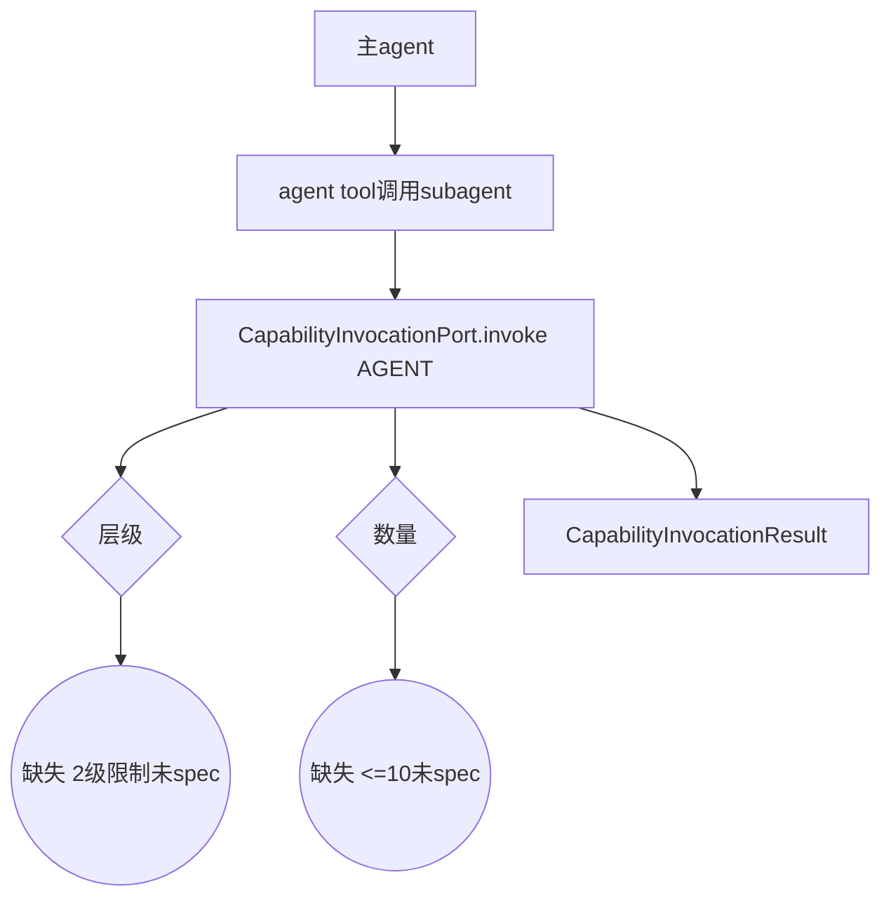
```mermaid
flowchart TD
  A[主agent] --> B["agent tool调用subagent"]
  B --> C["CapabilityInvocationPort.invoke AGENT"]
  C --> D{层级}
  D --> E((缺失 2级限制未spec))
  C --> F{数量}
  F --> G((缺失 <=10未spec))
  C --> H["CapabilityInvocationResult"]
```

**流程要点**：agent调用已规格化；2级层级与<=10数量上限未规格化。


---

### 7.5 人工接管

> pending input、推荐问题

**接口信息**

> 涉及接口：POST `/api/v1/sessions/:sessionId/requests/:requestId/suggested-questions`
**POST /api/v1/sessions/:sessionId/requests/:requestId/suggested-questions** — 获取已完成请求的下一步推荐问题，owner scope 来自 identity resolver，agent scope 来自 session 绑定

**参数规格**

| 参数 | 必填 | 描述 |
|---|---|---|
| sessionId | 是 | 会话 ID（path parameter） |
| requestId | 是 | 请求 ID（path parameter） |

**响应体**

```json
{
  "questions": [
    "切换失败的原因有哪些？",
    "如何优化邻区配置？",
    "切换成功率受哪些因素影响？"
  ]
}

terminal status 非 COMPLETED 时返回 { questions: [] }
```


**涉及 spec**

| spec | 变更 | 场景类型 |
|---|---|---|
| ask-user-question-tool | 2026-06-23-add-ts-ask-user-question-tool | 功能/安全 |
| ask-user-question-trigger-policy | 2026-06-23-refine-ask-user-question-trigger-policy | 功能/安全 |
| authorization-pending-input | 2026-06-23-add-ts-authorization-pending-input | 功能/安全 |
| confirmation-pending-input | 2026-06-23-add-ts-confirmation-pending-input | 功能/安全 |
| human-handoff | 2026-06-23-add-ts-human-handoff | 功能/安全 |
| human-pending-input-core | 2026-06-23-add-ts-human-pending-input-core | 功能/安全/可靠性 |
| human-pending-input-timeout | 2026-06-23-add-ts-human-pending-input-timeout | 功能/安全/可靠性/可观测性 |
| lifecycle-hook-execution | 2026-06-21-add-ts-lifecycle-hook-execution | 功能 |
| question-pending-input | 2026-06-23-add-ts-question-pending-input | 功能/安全 |
| question-recommendation | 2026-06-27-add-ts-question-recommend | 功能/安全/可观测性 |
| ts-core-contracts | 2026-05-29-establish-ts-core-contracts | 功能 |
| ts-core-contracts | 2026-06-23-refine-ts-pending-input-contracts | 功能/安全/可靠性 |

**符合性**

| 评估维度 | 结果 |
|---|---|
| AF系统规格基线 | N/A |
| spec change覆盖度 | 有（12条映射） |
| 交叉结论 | AF系统规格基线未覆盖，change已覆盖 |


---

## 8 二次开发

> Hook点位、自定义Policy、全局Tool和Prompt模版

### 8.1 Hook点位与执行

> 9个hook点位、同点位≤8、执行机制

**接口信息**

> 涉及接口：POST `/api/v1/requests`
**POST /api/v1/requests** — 便捷提交，使用相同 idempotencyKey 重复提交返回首次结果

**请求体**

```json
同请求提交请求体，使用相同 idempotencyKey
```

**响应体**

```json
返回首次 accepted run 结果，不创建重复副作用
```


**涉及 spec**

| spec | 变更 | 场景类型 |
|---|---|---|
| ts-attachment-intake | 2026-06-23-add-ts-attachment-intake | 功能 |

**符合性**

| 评估维度 | 结果 |
|---|---|
| AF系统规格基线 | ⚠️ 部分符合 |
| spec | lifecycle-hook-execution |
| spec来源 | specs/lifecycle-hook-execution/spec.md; designs/architecture/core-contracts.md:1744,226 |
| spec change覆盖度 | 有（1条映射） |
| 交叉结论 | AF系统规格基线部分覆盖，change已覆盖 |

**缺失/偏差说明**

**二次开发/hook点位**: - 9个具体点位(BEFORE_REQUEST_ACCEPT/BEFORE_PLANNING/BEFORE_MODEL_INVOKE/AFTER_MODEL_RESULT/BEFORE_CAPABILITY_INVOKE/AFTER_CAPABILITY_RESULT/BEFORE_CONTEXT_COMPACT/AFTER_CONTEXT_COMPACT/BEFORE_AGENT_TERMINAL)：openspec有lifecycle hook机制但未明确这9个点位枚举，CheckpointTriggerReason有8个相近trigger但非hook点位（D类：行为规格空白）

**

**二次开发/同一个点位hook数量**: - 同一点位hook数量<=8上限：openspec有"hook definitions and Agent bindings remain separate and bounded"但未规定<=8数量上限（C类：数量上限未规格化）

**

**业务流程图**

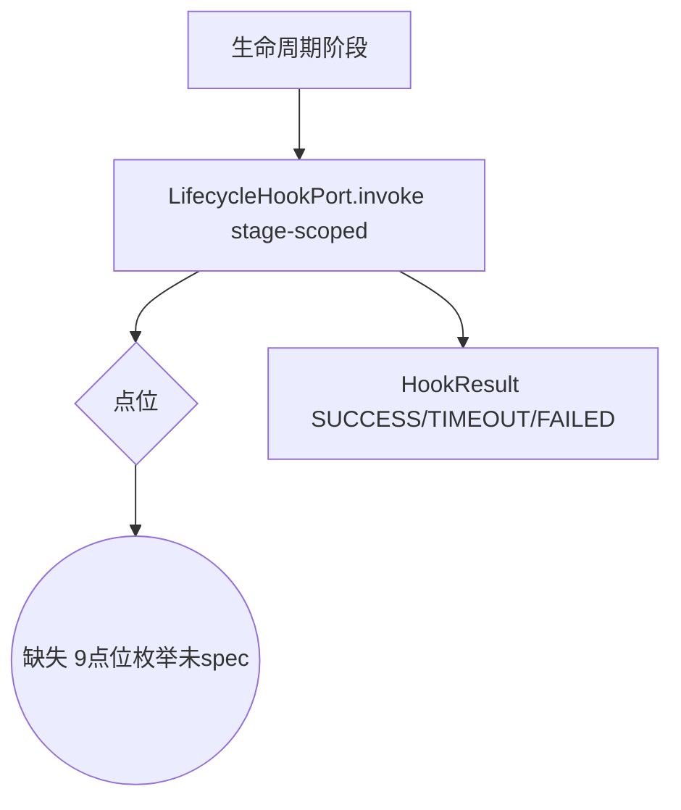
```mermaid
flowchart TD
  A[生命周期阶段] --> B["LifecycleHookPort.invoke stage-scoped"]
  B --> C{点位}
  C --> D((缺失 9点位枚举未spec))
  B --> E["HookResult SUCCESS/TIMEOUT/FAILED"]
```

**流程要点**：hook机制已规格化；9个具体点位枚举未明确。


---

### 8.2 插件组合与自定义Policy

> Agent-scoped插件、自定义policy

**接口信息**（来自R27A）

| 对外接口 | 接口说明 | 接口层级 | 输入参数 | 输入参数详情(含约束) | 输出参数 | 输出参数详情 |
|---|---|---|---|---|---|---|
| `AgentRoutingPolicy` | 路由策略(可自定义) | 内部 | request+assembly facts | controlled input/output contracts | AgentRoutingPolicyResult | 路由决策 |
| `RiskPolicyEnforcement` | 风险策略 | 内部 | policy | - | enforcement | - |

**

**涉及 spec**

| spec | 变更 | 场景类型 |
|---|---|---|
| agent-scoped-plugin-composition | 2026-07-08-add-ts-agent-scoped-plugin-composition | 功能/安全 |

**符合性**

| 评估维度 | 结果 |
|---|---|
| AF系统规格基线 | ✅ 符合 |
| spec | agent-routing-core / risk-policy-enforcement |
| spec来源 | specs/agent-routing-core/spec.md; specs/risk-policy-enforcement/spec.md; designs/architecture/core-contracts.md:1024 |
| spec change覆盖度 | 有（1条映射） |
| 交叉结论 | AF系统规格基线已覆盖，change已覆盖 |

**缺失/偏差说明**

**二次开发/自定义policy**: - 无（routing policy+risk policy通过controlled contracts承载自定义policy）

**

**业务流程图**

```mermaid
flowchart TD
  A[自定义policy] --> B["AgentRoutingPolicy controlled contracts"]
  B --> C["AgentRoutingPolicyResult"]
  C --> D{依赖可用?}
  D -- 否 --> E[fail closed]
  D -- 是 --> F[应用决策]
```

**流程要点**：自定义policy通过routing/risk policy controlled contracts承载。


---

### 8.3 自定义全局Tool

> 通过启动贡献注册全局Tool

**接口信息**（来自R27A）

| 对外接口 | 接口说明 | 接口层级 | 输入参数 | 输入参数详情(含约束) | 输出参数 | 输出参数详情 |
|---|---|---|---|---|---|---|
| `defineTool` | 工具定义 | 内部 | metadata,impl | provider-neutral | Tool | - |
| `Tool catalog registration` | 全局注册 | 内部 | trusted config | explicit registration | CapabilityDescriptor | 全局可用 |
| `CUSTOM provider` | 自定义provider | 内部 | CustomProviderOptions | CUSTOM kind | factory inputs | - |

**

**涉及 spec**

| spec | 变更 | 场景类型 |
|---|---|---|
| extension-registration | 2026-07-03-refine-ts-extension-registration | 功能 |

**符合性**

| 评估维度 | 结果 |
|---|---|
| AF系统规格基线 | ✅ 符合 |
| spec | builtin-tool-framework / capability-source-configuration |
| spec来源 | specs/builtin-tool-framework/spec.md; specs/capability-source-configuration/spec.md; designs/architecture/core-contracts.md:819 |
| spec change覆盖度 | 有（1条映射） |
| 交叉结论 | AF系统规格基线已覆盖，change已覆盖 |

**缺失/偏差说明**

**二次开发/自定义全局Tool**: - 无（defineTool+全局registration+CUSTTOM provider承载自定义全局Tool）

**

**业务流程图**

```mermaid
flowchart TD
  A[自定义全局Tool] --> B["defineTool metadata+impl"]
  B --> C["Tool catalog显式全局注册"]
  C --> D["CapabilityDescriptor全局可用"]
  D --> E["CapabilityInvocationPort.invoke"]
```

**流程要点**：自定义全局Tool通过defineTool+显式注册承载。


---

### 8.4 自定义Prompt模版

> 跨purpose模板装配

**接口信息**（来自R27A）

| 对外接口 | 接口说明 | 接口层级 | 输入参数 | 输入参数详情(含约束) | 输出参数 | 输出参数详情 |
|---|---|---|---|---|---|---|
| `PromptTemplateAssembly` | prompt模板装配 | 内部 | purpose,context | 按purpose装配 | RenderedModelInput | - |
| `Template sources` | 模板源编译 | 内部 | template sources | request path前编译 | compiled templates | - |
| `Governed variables` | 受控模板变量 | 内部 | variables,substitutions? | governed | rendered prompt | - |

**

**涉及 spec**

| spec | 变更 | 场景类型 |
|---|---|---|
| context-compression | 2026-06-11-add-ts-context-compression | 功能 |
| context-engine | 2026-06-11-add-ts-context-budget-explainability | 功能 |
| context-engine | 2026-06-11-add-ts-context-compression | 功能 |
| context-engine | 2026-06-23-add-ts-context-micro-compact | 功能 |
| prompt-template-assembly | 2026-06-22-add-ts-prompt-template-assembly | 功能 |
| query-policy | 2026-06-11-add-ts-context-budget-explainability | 功能 |
| request-attachments | 2026-06-23-add-ts-attachment-request-context-flow | 功能 |
| traceable-summary-generation | 2026-06-11-add-ts-traceable-summary-generation | 功能/安全 |

**符合性**

| 评估维度 | 结果 |
|---|---|
| AF系统规格基线 | ✅ 符合 |
| spec | prompt-template-assembly |
| spec来源 | specs/prompt-template-assembly/spec.md |
| spec change覆盖度 | 有（8条映射） |
| 交叉结论 | AF系统规格基线已覆盖，change已覆盖 |

**缺失/偏差说明**

**二次开发/自定义prompt模版**: - 无（prompt模板装配+模板源编译+受控变量承载自定义prompt模板）

**

**业务流程图**

```mermaid
flowchart TD
  A[自定义prompt模板] --> B["模板源编译 request path前"]
  B --> C["PromptTemplateAssembly按purpose"]
  C --> D["governed variables+substitutions"]
  D --> E["RenderedModelInput"]
```

**流程要点**：自定义prompt模板通过模板源编译+按purpose装配+受控变量承载。


---

## 9 界面测试

> 前端UI布局、交互、导航、权限和多宿主
>
> 本章是生成时的 UI 测试快照，不是当前前端行为清单；请改查[前端文档](./frontend/README.md)和对应 Stable Spec。

### 9.1 视觉与布局

> UI布局、颜色、尺寸、主题

**接口信息**

前端UI渲染，无独立外部接口

**涉及 spec**

| spec | 变更 | 场景类型 |
|---|---|---|
| agent-web-chat-pane-styles | 2026-07-02-agent-web-ui-change | 功能 |
| agent-web-composer-button-styles | 2026-07-02-agent-web-ui-change | 功能 |
| agent-web-high-frequency-questions | 2026-07-02-agent-web-ui-change | 功能 |
| agent-web-process-panel | 2026-07-02-agent-web-ui-change | 功能 |
| agent-web-right-pane-styles | 2026-07-02-agent-web-ui-change | 功能 |
| agent-web-skill-selector-styles | 2026-07-02-agent-web-ui-change | 功能 |
| agent-web-welcome-block-styles | 2026-07-02-agent-web-ui-change | 功能 |
| category-question-ui | 2026-07-03-add-ts-category-question | 功能 |
| high-frequency-question-ui | 2026-07-03-add-ts-high-frequency-question | 功能 |
| question-association-ui | 2026-07-04-add-ts-question-association | 功能 |
| ts-run-status-visibility | 2026-06-23-add-ts-capability-result-view-stream | 功能 |

**符合性**

| 评估维度 | 结果 |
|---|---|
| AF系统规格基线 | N/A |
| spec change覆盖度 | 有（11条映射） |
| 交叉结论 | AF系统规格基线未覆盖，change已覆盖 |


---

### 9.2 对话交互

> UI交互逻辑、状态切换

**接口信息**

> 涉及接口：POST `/api/v1/sessions/:sessionId/requests/:requestId/suggested-questions`
**POST /api/v1/sessions/:sessionId/requests/:requestId/suggested-questions** — 前端收到 REQUEST_COMPLETED 事件后自动调用，获取推荐问题并渲染为可点击组件

**参数规格**

| 参数 | 必填 | 描述 |
|---|---|---|
| sessionId | 是 | 会话 ID（path parameter） |
| requestId | 是 | 请求 ID（path parameter） |

**响应体**

```json
{
  "questions": [
    "问题1",
    "问题2",
    "问题3"
  ]
}
```


**涉及 spec**

| spec | 变更 | 场景类型 |
|---|---|---|
| category-question-ui | 2026-07-03-add-ts-category-question | 功能 |
| high-frequency-question-ui | 2026-07-03-add-ts-high-frequency-question | 功能 |
| question-association-ui | 2026-07-04-add-ts-question-association | 功能 |
| question-recommendation | 2026-06-27-add-ts-question-recommend | 功能 |
| telecom-bilingual-output | 2026-06-23-add-ts-bilingual-telecom-output | 功能 |
| ts-run-status-visibility | 2026-06-23-add-ts-capability-result-view-stream | 功能 |

**符合性**

| 评估维度 | 结果 |
|---|---|
| AF系统规格基线 | N/A |
| spec change覆盖度 | 有（6条映射） |
| 交叉结论 | AF系统规格基线未覆盖，change已覆盖 |


---

### 9.3 会话导航与搜索

> 侧边栏导航、快速定位

**接口信息**

> 涉及接口：GET `/api/v1/sessions`、POST `/api/v1/sessions/:sessionId/shares`、GET `/api/v1/shares/:shareId/conversation`

**涉及 spec**

| spec | 变更 | 场景类型 |
|---|---|---|
| conversation-share | 2026-06-28-add-ts-conversation-share | 功能 |
| session-history-search | 2026-07-01-add-ts-session-history-search | 功能 |

**符合性**

| 评估维度 | 结果 |
|---|---|
| AF系统规格基线 | N/A |
| spec change覆盖度 | 有（2条映射） |
| 交叉结论 | AF系统规格基线未覆盖，change已覆盖 |


---

### 9.4 权限控制

> 前端权限、scope隔离UI

**接口信息**

> 涉及接口：GET `/api/v1/runtime/bootstrap`（ops权限投影）、POST `/api/v1/auth/local/login`、POST `/api/v1/auth/local/logout`

**涉及 spec**

| spec | 变更 | 场景类型 |
|---|---|---|
| agent-web-auth-control | 2026-06-29-agent-web-auth-control | 功能/安全 |

**符合性**

| 评估维度 | 结果 |
|---|---|
| AF系统规格基线 | N/A |
| spec change覆盖度 | 有（1条映射） |
| 交叉结论 | AF系统规格基线未覆盖，change已覆盖 |


---

### 9.5 多宿主模式

> 多宿主UI行为和配置

**接口信息**

> 涉及接口：GET `/api/v1/runtime/bootstrap`（transportKind/ops/site context）

**涉及 spec**

| spec | 变更 | 场景类型 |
|---|---|---|
| agent-web-multi-host-modes | 2026-06-12-add-agent-web-multi-host-modes | 功能/安全 |

**符合性**

| 评估维度 | 结果 |
|---|---|
| AF系统规格基线 | N/A |
| spec change覆盖度 | 有（1条映射） |
| 交叉结论 | AF系统规格基线未覆盖，change已覆盖 |


---

# DFX测试

## 1 安全

> 身份隔离、沙箱执行、脱敏和认证

### 1.1 身份隔离

> owner/agent scope隔离

**接口信息**（来自R27A）

| 对外接口 | 接口说明 | 接口层级 | 输入参数 | 输入参数详情(含约束) | 输出参数 | 输出参数详情 |
|---|---|---|---|---|---|---|
| `IdentityContext(tenantId/subjectId)` | 多租多用户身份 | 对外 | identityContext | trusted boundary注入,非请求体 | - | - |
| `OwnerScoped` | owner作用域 | 内部 | tenantId/subjectId | 所有record/query | owner scoped | - |

**

**涉及 spec**

| spec | 变更 | 场景类型 |
|---|---|---|
| agent-scoped-plugin-composition | 2026-07-08-add-ts-agent-scoped-plugin-composition | 安全 |
| authorization-pending-input | 2026-06-23-add-ts-authorization-pending-input | 安全 |
| category-question-api | 2026-07-03-add-ts-category-question | 安全 |
| confirmation-pending-input | 2026-06-23-add-ts-confirmation-pending-input | 安全 |
| conversation-share | 2026-06-28-add-ts-conversation-share | 安全 |
| extension-registration | 2026-07-03-refine-ts-extension-registration | 安全 |
| frequent-question-api | 2026-07-03-add-ts-high-frequency-question | 安全 |
| invoked-agent-discovery | 2026-06-22-add-ts-invoked-agent-discovery | 安全 |
| local-checkpoint-store | 2026-06-10-add-ts-local-checkpoint-store | 安全 |
| local-run-timeline-store | 2026-06-10-add-ts-local-run-timeline-store | 安全 |
| local-runtime-recovery | 2026-06-09-add-ts-local-runtime-recovery | 安全 |
| local-session-store | 2026-06-10-add-ts-local-session-store | 安全 |
| local-skill-source | 2026-06-09-add-ts-local-skill-source | 安全 |
| request-cancel | 2026-06-09-add-ts-request-cancel | 安全 |
| request-retry | 2026-06-09-add-ts-request-retry | 安全 |
| session-fork-from-message | 2026-07-07-add-ts-session-fork-from-message | 安全 |
| session-lane-scheduling | 2026-06-09-add-ts-session-lane-scheduling | 安全 |
| ts-attachment-cleanup | 2026-06-22-add-ts-attachment-cleanup | 安全 |
| ts-attachment-intake | 2026-06-23-add-ts-attachment-intake | 安全 |
| ts-core-contracts | 2026-05-29-establish-ts-core-contracts | 安全 |
| ts-local-configured-auth | 2026-06-09-add-ts-local-configured-auth | 安全 |
| ts-minimal-agent-kernel | 2026-06-02-ship-ts-minimal-agent-kernel | 安全 |
| ts-security-test-gate | 2026-06-27-add-ts-security-test-gate | 安全 |

**符合性**

| 评估维度 | 结果 |
|---|---|
| AF系统规格基线 | ✅ 符合 |
| spec | ts-minimal-agent-kernel / owner-scope-security |
| spec来源 | specs/ts-minimal-agent-kernel/spec.md; designs/architecture/owner-scope-security.md; designs/architecture/core-contracts.md:250,258 |
| spec change覆盖度 | 有（23条映射） |
| 交叉结论 | AF系统规格基线已覆盖，change已覆盖 |

**缺失/偏差说明**

**安全/多租多用户**: - 无（tenantId/subjectId owner scope已规格化，请求体不可覆盖身份）

**

**安全/会话隔离**: - 无（session/message/attachment/blob均owner scoped隔离）

**

**业务流程图**

```mermaid
flowchart TD
  A[请求] --> B{identityContext from trusted boundary}
  B --> C["tenantId/subjectId owner scope"]
  C --> D{请求体含owner字段?}
  D -- 是 --> E[schema validation fail]
  D -- 否 --> F[owner scoped处理]
  F --> G{跨owner?}
  G -- 是 --> H[safe not-found]
```

**流程要点**：tenantId/subjectId owner scope已规格化；身份只来自可信边界。


---

### 1.2 沙箱执行

> deny-by-default、sandbox gateway

**接口信息**（来自R27A）

| 对外接口 | 接口说明 | 接口层级 | 输入参数 | 输入参数详情(含约束) | 输出参数 | 输出参数详情 |
|---|---|---|---|---|---|---|
| `SandboxGatewayPort.execute` | 沙箱执行 | 内部 | SandboxExecutionRequest | pre-execution validation | SandboxExecutionResult | - |
| `SandboxExecutionRequest` | 沙箱请求 | 内部 | command,filesystem layout | unified boundary | - | - |
| `bash/python tool` | 工具经沙箱 | 内部 | tool invocation | cross sandbox gateway | result | - |

**

**涉及 spec**

| spec | 变更 | 场景类型 |
|---|---|---|
| agent-tool | 2026-06-22-add-ts-agent-tool | 安全 |
| app-config-schema | 2026-06-23-refine-ts-local-shell-mode-when-sandbox-disabled | 功能/安全 |
| bash-tool | 2026-06-13-enable-controlled-clipc-bash-command | 安全 |
| bash-tool | 2026-06-16-allow-local-sandbox-validation-disable | 安全 |
| bash-tool | 2026-06-25-delegate-bash-policy-to-sandbox | 安全 |
| builtin-tool-framework | 2026-06-07-add-ts-builtin-tool-framework | 安全 |
| lifecycle-hook-execution | 2026-06-22-add-ts-hook-directory-loading | 安全 |
| local-runtime-package | 2026-06-09-add-ts-local-runtime-package | 安全 |
| risk-policy-enforcement | 2026-06-22-add-ts-risk-policy-enforcement | 安全 |
| sandbox-deny-by-default-adapter | 2026-06-11-add-ts-sandbox-deny-by-default-adapter | 安全 |
| sandbox-runtime | 2026-06-11-add-ts-executable-tool-sandbox-runtime | 安全 |
| sandbox-runtime | 2026-06-23-refine-ts-local-shell-mode-when-sandbox-disabled | 功能 |
| sandbox-runtime | 2026-06-23-refine-ts-sandbox-rejection-mapping | 功能/安全/可靠性/可观测性 |
| sandbox-runtime | 2026-06-25-delegate-bash-policy-to-sandbox | 安全/可靠性 |
| sandbox-runtime | 2026-07-01-refine-ts-sandbox-strict-shell-support | 安全 |
| skill-resource-access | 2026-06-16-add-ts-skill-resource-access | 安全 |
| ts-core-contracts | 2026-06-22-refine-ts-risk-policy-contract | 功能/安全 |
| ts-security-test-gate | 2026-06-27-add-ts-security-test-gate | 安全 |

**符合性**

| 评估维度 | 结果 |
|---|---|
| AF系统规格基线 | ✅ 符合 |
| spec | sandbox-runtime / bash-tool / python-tool |
| spec来源 | specs/sandbox-runtime/spec.md; specs/bash-tool/spec.md; specs/python-tool/spec.md; designs/architecture/core-contracts.md:1762,1799 |
| spec change覆盖度 | 有（18条映射） |
| 交叉结论 | AF系统规格基线已覆盖，change已覆盖 |

**缺失/偏差说明**

**安全/沙箱运行**: - 无（sandbox gateway统一边界+pre-validation+不泄露host细节已规格化）

**

**业务流程图**

```mermaid
flowchart TD
  A[bash/python工具调用] --> B["cross SandboxGatewayPort"]
  B --> C["pre-execution validation"]
  C --> D{校验通过?}
  D -- 否 --> E[显式拒绝]
  D -- 是 --> F["SandboxGatewayPort.execute"]
  F --> G{执行}
  G -- 失败/超限 --> H[显式failure/resource limits]
  G -- 成功 --> I["SandboxExecutionResult 不泄露host细节"]
```

**流程要点**：bash/python经sandbox gateway统一边界+pre-validation+不泄露host细节。


---

### 1.3 脱敏与安全错误

> redaction policy、safe error

**接口信息**

无独立外部接口，为跨切面行为。脱敏在 observation 边界同步执行，safe error 统一映射。

**涉及 spec**

| spec | 变更 | 场景类型 |
|---|---|---|
| agent-scoped-plugin-composition | 2026-07-08-add-ts-agent-scoped-plugin-composition | 安全 |
| api-backed-tool-source | 2026-06-11-add-ts-api-backed-tool-source | 安全 |
| app-config-schema | 2026-06-09-add-ts-app-config-schema | 安全 |
| ask-user-question-tool | 2026-06-23-add-ts-ask-user-question-tool | 安全 |
| bash-tool | 2026-06-10-add-ts-bash-tool | 安全 |
| builtin-skill-source | 2026-06-10-add-ts-builtin-skill-source | 安全 |
| builtin-tool-framework | 2026-06-07-add-ts-builtin-tool-framework | 安全 |
| capability-source-configuration | 2026-06-09-add-ts-capability-source-configuration | 安全 |
| category-question-api | 2026-07-03-add-ts-category-question | 安全 |
| cross-platform-executable-semantics | 2026-06-11-add-ts-cross-platform-executable-semantics | 安全 |
| frequent-question-api | 2026-07-03-add-ts-high-frequency-question | 安全 |
| human-handoff | 2026-06-23-add-ts-human-handoff | 安全 |
| local-runtime-package | 2026-06-09-add-ts-local-runtime-package | 安全 |
| local-runtime-release | 2026-06-09-harden-ts-local-runtime-release | 安全 |
| local-skill-source | 2026-06-09-add-ts-local-skill-source | 安全 |
| model-provider-adapter | 2026-06-09-add-ts-model-invocation-contract | 安全 |
| model-provider-configuration | 2026-06-09-add-ts-model-provider-configuration | 安全 |
| provider-error-safe-mapping | 2026-06-09-add-ts-provider-error-safe-mapping | 安全 |
| query-policy | 2026-06-11-add-ts-context-budget-explainability | 安全 |
| question-association-api | 2026-07-04-add-ts-question-association | 安全 |
| redaction-policy | 2026-06-12-add-ts-redaction-policy | 功能/安全 |
| redaction-policy | 2026-06-13-add-observability-debug-logging | 安全 |
| request-attachments | 2026-06-23-add-ts-attachment-request-context-flow | 安全 |
| risk-policy-enforcement | 2026-06-22-add-ts-risk-policy-enforcement | 安全 |
| runtime-recovery-idempotency-guard | 2026-06-09-add-ts-runtime-recovery-idempotency-guard | 安全 |
| sandbox-runtime | 2026-06-11-add-ts-executable-tool-sandbox-runtime | 安全 |
| secret-configuration-boundary | 2026-06-09-add-ts-secret-configuration-boundary | 安全 |
| session-fork-from-message | 2026-07-07-add-ts-session-fork-from-message | 安全 |
| session-title-generation | 2026-06-10-add-ts-session-title-generation | 安全 |
| skill-manifest-contract | 2026-06-05-add-ts-skill-manifest-contract | 安全 |
| skill-tool | 2026-06-10-add-ts-skill-tool | 安全 |
| system-health-check | 2026-06-12-add-ts-health-check | 安全 |
| tool-search-tool | 2026-06-23-add-ts-clipc-tool-search-lazy-loading | 安全 |
| trace-log-linking | 2026-06-12-add-ts-trace-log-linking | 安全 |
| ts-attachment-cleanup | 2026-06-22-add-ts-attachment-cleanup | 安全 |
| ts-attachment-intake | 2026-06-23-add-ts-attachment-intake | 安全 |
| ts-backend-architecture | 2026-05-29-establish-ts-backend-architecture | 安全 |
| ts-core-contracts | 2026-05-29-establish-ts-core-contracts | 安全 |
| ts-core-contracts | 2026-06-22-refine-ts-risk-policy-contract | 安全 |
| ts-local-configured-auth | 2026-06-09-add-ts-local-configured-auth | 安全 |
| ts-minimal-agent-kernel | 2026-06-02-ship-ts-minimal-agent-kernel | 安全 |
| ts-run-status-visibility | 2026-06-11-add-ts-context-budget-explainability | 安全 |
| ts-run-status-visibility | 2026-06-23-add-ts-capability-result-view-stream | 安全 |
| ts-security-test-gate | 2026-06-27-add-ts-security-test-gate | 安全 |
| ts-web-sse-ws-transports | 2026-06-09-add-ts-web-sse-ws-transports | 安全 |

**符合性**

| 评估维度 | 结果 |
|---|---|
| AF系统规格基线 | N/A |
| spec change覆盖度 | 有（45条映射） |
| 交叉结论 | AF系统规格基线未覆盖，change已覆盖 |


---

### 1.4 本地认证

> 本地配置认证模式

**接口信息**

> 涉及接口：POST `/api/v1/auth/local/login`、POST `/api/v1/auth/local/logout`
**POST /api/v1/auth/local/login** — 本地配置认证模式登录，成功后设置 HttpOnly Cookie

**请求体**

```json
{
  "username": "admin",
  "password": "***"
}
```

**响应体**

```json
设置 signed HttpOnly cookie（fixed TTL、SameSite=Strict、Path=/），返回安全身份摘要
```

**POST /api/v1/auth/local/logout** — 本地配置认证模式退出登录，清理本地认证 Cookie

**响应体**

```json
清除 local auth cookie，不删除用户数据
```


**涉及 spec**

| spec | 变更 | 场景类型 |
|---|---|---|
| ts-local-configured-auth | 2026-06-09-add-ts-local-configured-auth | 安全 |

**符合性**

| 评估维度 | 结果 |
|---|---|
| AF系统规格基线 | N/A |
| spec change覆盖度 | 有（1条映射） |
| 交叉结论 | AF系统规格基线未覆盖，change已覆盖 |


---

## 2 可靠可用性

> 故障恢复、启动就绪、事务冲突、幂等、集群和流控

### 2.1 Checkpoint恢复

> 进程重启恢复、replay幂等

**接口信息**（来自R27A）

| 对外接口 | 接口说明 | 接口层级 | 输入参数 | 输入参数详情(含约束) | 输出参数 | 输出参数详情 |
|---|---|---|---|---|---|---|
| `CheckpointStoreGateway.saveCheckpoint` | 保存checkpoint | 内部 | CheckpointRecord,{idempotencyKey} | - | CheckpointRecord | - |
| `CheckpointStoreGateway.loadCheckpoint` | 加载checkpoint | 内部 | LoadCheckpointRequest | owner scoped | CheckpointRecord|undefined | - |
| `Recovery pass` | 启动恢复 | 内部 | bounded recovery | durable facts分类 | recovered runs | queued/executing/terminal |
| `CapabilityReplayPolicy` | 工具幂等性 | 内部 | - | NON_IDEMPOTENT/IDEMPOTENT 默认非幂等 | - | - |

**

**涉及 spec**

| spec | 变更 | 场景类型 |
|---|---|---|
| agent-package-assembly | 2026-06-11-add-ts-agent-package-assembly | 功能 |
| context-compression | 2026-06-11-add-ts-context-compression | 功能 |
| context-engine | 2026-06-10-add-ts-context-history-selection | 功能 |
| context-engine | 2026-06-23-add-ts-context-micro-compact | 可靠性 |
| context-engine | 2026-06-27-tune-auto-compact-threshold | 可靠性 |
| large-content-references | 2026-06-11-add-ts-large-content-references | 功能 |
| local-checkpoint-store | 2026-06-10-add-ts-local-checkpoint-store | 功能 |
| local-run-timeline-store | 2026-06-10-add-ts-local-run-timeline-store | 功能 |
| local-runtime-recovery | 2026-06-09-add-ts-local-runtime-recovery | 功能 |
| local-session-store | 2026-06-10-add-ts-local-session-store | 功能 |
| local-skill-source | 2026-06-09-add-ts-local-skill-source | 功能 |
| memory-extraction | 2026-07-02-refine-ts-memory-lifecycle-reliability | 可靠性 |
| runtime-recovery-idempotency-guard | 2026-06-09-add-ts-runtime-recovery-idempotency-guard | 功能 |
| sandbox-deny-by-default-adapter | 2026-06-11-add-ts-sandbox-deny-by-default-adapter | 功能 |
| sandbox-runtime | 2026-06-11-add-ts-executable-tool-sandbox-runtime | 功能 |
| session-lane-scheduling | 2026-06-09-add-ts-session-lane-scheduling | 功能 |
| session-title-generation | 2026-06-10-add-ts-session-title-generation | 功能 |
| skill-resource-access | 2026-06-16-add-ts-skill-resource-access | 功能 |
| structured-logging | 2026-06-13-add-observability-debug-logging | 功能 |
| ts-core-contracts | 2026-06-22-add-ts-agent-tool | 可靠性 |
| ts-minimal-agent-kernel | 2026-06-02-ship-ts-minimal-agent-kernel | 功能 |
| idempotency-contract | 2026-06-12-add-ts-capability-idempotency-contract | 功能/安全 |

**符合性**

| 评估维度 | 结果 |
|---|---|
| AF系统规格基线 | ✅ 符合 |
| spec | local-runtime-recovery / runtime-recovery-idempotency-guard |
| spec来源 | specs/local-runtime-recovery/spec.md; specs/runtime-recovery-idempotency-guard/spec.md; designs/architecture/core-contracts.md:226,244,1549 |
| spec change覆盖度 | 有（25条映射） |
| 交叉结论 | AF系统规格基线已覆盖，change已覆盖 |

**缺失/偏差说明**

**可靠可用性/checkpoint恢复**: - 无（checkpoint恢复+幂等性声明+默认非幂等+故障时非幂等失败退出均已规格化）

**

**业务流程图**

```mermaid
flowchart TD
  A[启动] --> B["bounded recovery pass"]
  B --> C["durable facts分类"]
  C --> D{run状态}
  D -- queued --> E[重建scheduler work]
  D -- executing --> F["claim+checkpoint重建context"]
  D -- terminal --> G[幂等终态]
  F --> H{工具幂等?}
  H -- IDEMPOTENT stable key --> I[replay继续]
  H -- 非幂等/无stable key --> J["recovery failed terminal"]
```

**流程要点**：checkpoint恢复+幂等性声明(默认非幂等)+故障非幂等失败退出均已规格化。


---

### 2.2 高并发

> 所有持久化操作支持幂等

**接口信息**（来自R27A）

| 对外接口 | 接口说明 | 接口层级 | 输入参数 | 输入参数详情(含约束) | 输出参数 | 输出参数详情 |
|---|---|---|---|---|---|---|
| `IdempotencyKey` | 幂等键 | 内部 | IdempotencyKey | 非空必填 | - | - |
| `CheckpointStoreGateway.saveCheckpoint` | 幂等checkpoint | 内部 | record,{idempotencyKey} | - | CheckpointRecord | - |
| `TerminalCommit(commitTerminal)` | 幂等终态提交 | 内部 | TerminalCommitRequest | - | TerminalCommitRecordResult | committed/already_committed |

**

**涉及 spec**

| spec | 变更 | 场景类型 |
|---|---|---|
| context-engine | 2026-06-23-add-ts-context-micro-compact | 可靠性 |
| idempotency-contract | 2026-06-12-add-ts-capability-idempotency-contract | 功能/安全 |
| local-checkpoint-store | 2026-06-10-add-ts-local-checkpoint-store | 功能 |
| local-run-timeline-store | 2026-06-10-add-ts-local-run-timeline-store | 功能 |

**符合性**

| 评估维度 | 结果 |
|---|---|
| AF系统规格基线 | ✅ 符合 |
| spec | idempotency-contract / runtime-recovery-idempotency-guard |
| spec来源 | specs/idempotency-contract/spec.md; specs/runtime-recovery-idempotency-guard/spec.md; designs/architecture/core-contracts.md:298,1550 |
| spec change覆盖度 | 有（4条映射） |
| 交叉结论 | AF系统规格基线已覆盖，change已覆盖 |

**缺失/偏差说明**

**可靠可用性/高并发**: - 无（IdempotencyKey+幂等checkpoint+幂等终态提交已规格化）

**

**业务流程图**

```mermaid
flowchart TD
  A[持久化操作] --> B["携带IdempotencyKey非空"]
  B --> C{重复idempotencyKey?}
  C -- 是 --> D["返回首次结果/already_committed"]
  C -- 否 --> E[执行写入]
  E --> F[幂等保证]
```

**流程要点**：IdempotencyKey+幂等checkpoint+幂等终态提交保证持久化幂等。


---

### 2.3 集群部署

> 支持集群部署

**接口信息**（来自R27A）

| 对外接口 | 接口说明 | 接口层级 | 输入参数 | 输入参数详情(含约束) | 输出参数 | 输出参数详情 |
|---|---|---|---|---|---|---|
| `-` | - | - | - | - | - | - |

**

**涉及 spec**

无

**符合性**

| 评估维度 | 结果 |
|---|---|
| AF系统规格基线 | ❌ 缺失 |
| spec | - |
| spec来源 | - |
| spec change覆盖度 | 无 |
| 交叉结论 | AF系统规格基线缺失，change未覆盖 |

**缺失/偏差说明**

**可靠可用性/集群部署**: - 集群部署：openspec为local runtime设计，集群部署协议未规格化（F类：集群/远端协议后置）；timeline sequence多实例协调"核心契约不规定具体协调机制"已预留边界

**

**业务流程图**

```mermaid
flowchart TD
  A[集群部署] --> B((缺失 集群协议未spec F类))
  B --> C["timeline sequence多实例协调 已预留边界未规约"]
  C --> D["需补spec"]
```

**流程要点**：集群部署协议未规格化（F类后置）；多实例timeline协调已预留边界。


---

### 2.4 流控

> 1C2G 30并发 30排队

**接口信息**（来自R27A）

| 对外接口 | 接口说明 | 接口层级 | 输入参数 | 输入参数详情(含约束) | 输出参数 | 输出参数详情 |
|---|---|---|---|---|---|---|
| `SessionLaneScheduler` | session lane调度 | 内部 | owner+agent scoped session | same-lane execution gate | dispatch | queued/executing/terminal-pending |

**

**涉及 spec**

无

**符合性**

| 评估维度 | 结果 |
|---|---|
| AF系统规格基线 | ❌ 缺失 |
| spec | session-lane-scheduling |
| spec来源 | specs/session-lane-scheduling/spec.md |
| spec change覆盖度 | 无 |
| 交叉结论 | AF系统规格基线缺失，change未覆盖 |

**缺失/偏差说明**

**可靠可用性/流控**: - 30并发/30排队量化流控：openspec为单session单active run拒绝并发模型，未规格化30并发/30排队量化流控（B类+C类；minimal内核阶段不创建queued run）

**

**业务流程图**

```mermaid
flowchart TD
  A[流控 30并发/30排队] --> B((缺失 量化流控未spec B+C类))
  B --> C["minimal内核:单session单active run拒绝并发"]
  C --> D["不创建queued run"]
```

**流程要点**：量化流控未spec；minimal内核为单active run拒绝并发模型。


---

### 2.5 启动就绪

> 启动校验、ready gate、配置冻结

**接口信息**

> 涉及接口：GET `/health`、GET `/health/deep`、GET `/api/v1/runtime/bootstrap`
**GET /health** — 轻量健康检查，返回 status 和 components

**响应体**

```json
{
  "status": "UP",
  "components": { ... }
}
```

**GET /health/deep** — 深度健康检查，返回与 /health 相同结构

**响应体**

```json
同 /health 响应结构
```

**GET /api/v1/runtime/bootstrap** — 获取运行时启动配置，投影 transportKind 选择流式传输方式

**响应体**

```json
{
  "transportKind": "SSE"
}
```


**涉及 spec**

| spec | 变更 | 场景类型 |
|---|---|---|
| app-config-schema | 2026-06-09-add-ts-app-config-schema | 功能 |
| app-config-schema | 2026-07-02-add-ts-workflow-yaml-parsing | 功能/可靠性 |
| builtin-skill-source | 2026-06-10-add-ts-builtin-skill-source | 功能 |
| capability-source-configuration | 2026-06-09-add-ts-capability-source-configuration | 功能 |
| extension-registration | 2026-07-03-refine-ts-extension-registration | 功能/安全 |
| local-runtime-package | 2026-06-09-add-ts-local-runtime-package | 功能 |
| local-runtime-release | 2026-06-09-harden-ts-local-runtime-release | 功能 |
| secret-configuration-boundary | 2026-06-09-add-ts-secret-configuration-boundary | 功能/安全 |

**符合性**

| 评估维度 | 结果 |
|---|---|
| AF系统规格基线 | N/A |
| spec change覆盖度 | 有（8条映射） |
| 交叉结论 | AF系统规格基线未覆盖，change已覆盖 |


---

### 2.6 事务与冲突

> CAS失败、事务回滚、active run冲突

**接口信息**

无独立外部接口，为runtime内部行为。terminal commit 使用 PENDING->COMMITTED CAS + idempotency 防双终态。

**涉及 spec**

| spec | 变更 | 场景类型 |
|---|---|---|
| conflict-resolution | 2026-06-12-add-ts-capability-conflict-resolution | 功能/安全 |
| context-compression | 2026-06-11-add-ts-context-compression | 功能 |
| extension-registration | 2026-07-03-refine-ts-extension-registration | 安全 |
| ts-attachment-cleanup | 2026-06-22-add-ts-attachment-cleanup | 可靠性 |
| ts-minimal-agent-kernel | 2026-06-02-ship-ts-minimal-agent-kernel | 功能 |

**符合性**

| 评估维度 | 结果 |
|---|---|
| AF系统规格基线 | N/A |
| spec change覆盖度 | 有（5条映射） |
| 交叉结论 | AF系统规格基线未覆盖，change已覆盖 |


---

## 3 可观测性

> 日志、运行状态可见性、指标与审计

### 3.1 日志与诊断

> 结构化日志、调用链

**接口信息**（来自R27A）

| 对外接口 | 接口说明 | 接口层级 | 输入参数 | 输入参数详情(含约束) | 输出参数 | 输出参数详情 |
|---|---|---|---|---|---|---|
| `LOG surface(observation stream)` | 统一observation stream | 内部 | observation | 受控映射 | StructuredLogEntry | schema-stable |
| `StructuredLogEntry` | 结构化日志条目 | 内部 | observation | schema-stable | log entry | - |
| `Runtime logger contract` | runtime日志 | 内部 | runtime logs | separate from observability logs | runtime logs | - |

**

**涉及 spec**

| spec | 变更 | 场景类型 |
|---|---|---|
| agent-execution-trajectory | 2026-06-30-add-ts-agent-execution-trajectory-observability | 安全/可靠性/可观测性 |
| app-config-schema | 2026-06-13-add-observability-debug-logging | 功能 |
| app-config-schema | 2026-06-27-add-debug-raw-tool-input-logging | 安全/可观测性 |
| internal-lifecycle-observability | 2026-06-12-add-ts-internal-lifecycle-observability | 可靠 |
| invoked-agent-discovery | 2026-06-22-add-ts-invoked-agent-discovery | 可观测性 |
| lifecycle-hook-execution | 2026-06-21-add-ts-lifecycle-hook-execution | 功能 |
| lifecycle-hook-execution | 2026-06-29-complete-ts-lifecycle-hook-capabilities | 可观测性 |
| otel-observability-adapter | 2026-06-24-add-ts-otel-observability-adapter | 安全/可靠性/可观测性 |
| prompt-template-assembly | 2026-06-22-add-ts-prompt-template-assembly | 可观测性 |
| risk-policy-enforcement | 2026-06-22-add-ts-risk-policy-enforcement | 可观测性 |
| runtime-logging | 2026-06-30-add-ts-agent-execution-trajectory-observability | 可观测性 |
| skill-resource-access | 2026-06-16-add-ts-skill-resource-access | 功能 |
| structured-logging | 2026-06-12-add-ts-structured-logging | 功能/安全/可靠 |
| structured-logging | 2026-06-13-add-observability-debug-logging | 功能 |
| structured-logging | 2026-06-30-add-ts-agent-execution-trajectory-observability | 可观测性 |
| trace-log-linking | 2026-06-12-add-ts-trace-log-linking | 功能/安全/可靠 |
| trace-log-linking | 2026-06-30-add-ts-agent-execution-trajectory-observability | 可观测性 |
| ts-attachment-cleanup | 2026-06-22-add-ts-attachment-cleanup | 可观测性 |
| ts-attachment-intake | 2026-06-23-add-ts-attachment-intake | 可观测性 |
| ts-minimal-agent-kernel | 2026-06-27-add-debug-raw-tool-input-logging | 安全 |

**符合性**

| 评估维度 | 结果 |
|---|---|
| AF系统规格基线 | ✅ 符合 |
| spec | structured-logging / runtime-logging |
| spec来源 | specs/structured-logging/spec.md; specs/runtime-logging/spec.md |
| spec change覆盖度 | 有（20条映射） |
| 交叉结论 | AF系统规格基线已覆盖，change已覆盖 |

**缺失/偏差说明**

**可观测/结构化日志**: - "输出到日志文件"具体sink：openspec定义LOG surface但日志文件sink属实现承载（D类细节）

**

**可观测/调用链**: - "上报北斗"具体后端：openspec有otel-observability-adapter但北斗上报属厂商生态差异（E类）

**

**业务流程图**

```mermaid
flowchart TD
  A[请求/会话/模型/工具/Skill/Agent/hook/policy/fallback] --> B["observation stream"]
  B --> C["LOG surface受控映射"]
  C --> D["StructuredLogEntry schema-stable"]
  D --> E[日志文件sink]
```

**流程要点**：LOG surface统一observation stream；结构化日志schema-stable。


---

### 3.2 运行状态可见性

> run status投影、pending input可见性

**接口信息**（来自R27A）

| 对外接口 | 接口说明 | 接口层级 | 输入参数 | 输入参数详情(含约束) | 输出参数 | 输出参数详情 |
|---|---|---|---|---|---|---|
| `RunTimelineEvent` | timeline事件 | 内部 | - | runtime拥有唯一观测事实 | TimelineEventType | 事件类型 |
| `AgentRunStatePort.emitEvent` | 发出事件 | 内部 | run,context,event | - | void | - |

**

**涉及 spec**

| spec | 变更 | 场景类型 |
|---|---|---|
| context-compression | 2026-06-11-add-ts-context-compression | 功能 |
| query-policy | 2026-06-11-add-ts-context-budget-explainability | 功能 |
| ts-core-contracts | 2026-06-22-add-ts-agent-tool | 可观测性 |
| ts-run-status-visibility | 2026-06-11-add-ts-context-budget-explainability | 功能 |

**符合性**

| 评估维度 | 结果 |
|---|---|
| AF系统规格基线 | ✅ 符合 |
| spec | ts-minimal-agent-kernel / trace-log-linking |
| spec来源 | specs/ts-minimal-agent-kernel/spec.md; specs/trace-log-linking/spec.md; designs/architecture/core-contracts.md:203 |
| spec change覆盖度 | 有（4条映射） |
| 交叉结论 | AF系统规格基线已覆盖，change已覆盖 |

**缺失/偏差说明**

**可观测/event**: - 无（TimelineEventType覆盖思考LLM_THINKING_DELTA、执行工具CAPABILITY_STARTED/COMPLETED、进度等事件）

**

**业务流程图**

```mermaid
flowchart TD
  A[智能体操作/状态变化] --> B["AgentRunStatePort.emitEvent"]
  B --> C["RunTimelineEvent"]
  C --> D["TimelineEventType"]
  D --> E["思考/工具/Skill/进度事件"]
```

**流程要点**：TimelineEventType覆盖思考/工具/Skill/进度等事件。


---

### 3.3 指标与审计

> metrics、audit event、health检查

**接口信息**（来自R27A）

| 对外接口 | 接口说明 | 接口层级 | 输入参数 | 输入参数详情(含约束) | 输出参数 | 输出参数详情 |
|---|---|---|---|---|---|---|
| `agent-runtime-metrics` | runtime监控指标 | 内部 | runtime | - | metrics | - |
| `otel-observability-adapter` | otel适配 | 内部 | metrics | - | otel metrics | - |

**

**涉及 spec**

| spec | 变更 | 场景类型 |
|---|---|---|
| agent-runtime-metrics | 2026-06-12-add-ts-runtime-metrics | 功能/安全/可靠 |
| agent-runtime-metrics | 2026-06-24-add-ts-otel-observability-adapter | 可观测性 |
| audit-event-contract | 2026-06-12-add-agent-id-to-audit-event | 功能/安全 |
| audit-sink | 2026-06-12-add-ts-audit-sink | 功能/安全 |
| invocation-audit | 2026-06-12-add-ts-capability-invocation-audit | 功能/安全 |
| otel-observability-adapter | 2026-06-24-add-ts-otel-observability-adapter | 可靠性/可观测性 |
| routing-evidence-and-fallback | 2026-06-21-add-ts-routing-evidence-and-fallback | 功能 |
| session-title-generation | 2026-06-10-add-ts-session-title-generation | 功能 |
| session-title-update | 2026-06-10-add-ts-session-title-update | 功能 |
| skill-resource-access | 2026-06-16-add-ts-skill-resource-access | 功能 |
| system-health-check | 2026-06-12-add-ts-health-check | 功能/安全/可靠 |
| ts-core-contracts | 2026-06-04-add-ts-capability-core-governance | 功能 |

**符合性**

| 评估维度 | 结果 |
|---|---|
| AF系统规格基线 | ⚠️ 部分符合 |
| spec | agent-runtime-metrics / otel-observability-adapter |
| spec来源 | specs/agent-runtime-metrics/spec.md; specs/otel-observability-adapter/spec.md |
| spec change覆盖度 | 有（12条映射） |
| 交叉结论 | AF系统规格基线部分覆盖，change已覆盖 |

**缺失/偏差说明**

**可观测/监控**: - "上报北斗"具体后端：属厂商生态差异（E类）；系统资源监控具体指标未完整（D类）

**

**可观测/审计**: - "上报审计服务"具体后端：AuditSink为抽象，具体审计服务上报属实现/厂商承载（E类）

**

**业务流程图**

```mermaid
flowchart TD
  A[会话/对话/工具/Skill/Agent/模型/系统资源] --> B["agent-runtime-metrics"]
  B --> C["otel-observability-adapter"]
  C -.北斗.-> D((缺失 北斗上报未spec E类))
  C -.系统资源.-> E((缺失 系统资源指标未完整))
```

**流程要点**：runtime metrics+otel adapter已规格化；北斗上报与系统资源指标未完整。


---

## 4 兼容性

> 跨平台、部署模式

### 4.1 部署模式

> 本地/沉浸式/协作式部署

**接口信息**

> 涉及接口：GET `/health`、GET `/health/deep`、GET `/api/v1/runtime/bootstrap`

**涉及 spec**

| spec | 变更 | 场景类型 |
|---|---|---|
| agent-web-multi-host-modes | 2026-06-12-add-agent-web-multi-host-modes | 功能 |
| fullstack-packaging-boundary | 2026-06-04-refine-ts-fullstack-packaging-boundary | 功能/安全 |
| fullstack-packaging-boundary | 2026-06-10-add-ts-dev-watch-mode | 功能 |
| fullstack-packaging-boundary | 2026-06-12-add-agent-web-multi-host-modes | 功能 |

**符合性**

| 评估维度 | 结果 |
|---|---|
| AF系统规格基线 | N/A |
| spec change覆盖度 | 有（4条映射） |
| 交叉结论 | AF系统规格基线未覆盖，change已覆盖 |


---

## 5 性能

> 资源占用、多agent共部署、首字时延

### 5.1 资源占用

> 1C2G支持30并发

**接口信息**（来自R27A）

| 对外接口 | 接口说明 | 接口层级 | 输入参数 | 输入参数详情(含约束) | 输出参数 | 输出参数详情 |
|---|---|---|---|---|---|---|
| `-` | - | - | - | - | - | - |

**

**涉及 spec**

无

**符合性**

| 评估维度 | 结果 |
|---|---|
| AF系统规格基线 | ❌ 缺失 |
| spec | e2e-non-functional |
| spec来源 | specs/e2e-non-functional/spec.md |
| spec change覆盖度 | 无 |
| 交叉结论 | AF系统规格基线缺失，change未覆盖 |

**缺失/偏差说明**

**性能/资源占用**: - 1C2G/30并发资源占用SLO：openspec无量化资源占用规格，属B类（量化SLO不入spec）；"与AgentCore持平"无spec依据

**

**业务流程图**

```mermaid
flowchart TD
  A[资源占用 1C2G/30并发] --> B((缺失 量化SLO未入spec B类))
  B --> C["需补spec或由配置承载"]
```

**流程要点**：资源占用量化SLO未入spec（B类）。


---

### 5.2 多Agent共部署

> 单实例5个agent共部署

**接口信息**（来自R27A）

| 对外接口 | 接口说明 | 接口层级 | 输入参数 | 输入参数详情(含约束) | 输出参数 | 输出参数详情 |
|---|---|---|---|---|---|---|
| `SubmitRequestCommand(agentId)` | agentid路由 | 对外 | agentId? | Runtime内部Agent Scope resolver | RequestAccepted | - |
| `Agent Scope resolver` | agent作用域解析 | 内部 | trusted | agentId由Runtime内部解析 | agent scope | - |

**

**涉及 spec**

无

**符合性**

| 评估维度 | 结果 |
|---|---|
| AF系统规格基线 | ⚠️ 部分符合 |
| spec | agent-web-multi-host-modes / ts-minimal-agent-kernel |
| spec来源 | specs/agent-web-multi-host-modes/spec.md; specs/ts-minimal-agent-kernel/spec.md; designs/architecture/core-contracts.md:291 |
| spec change覆盖度 | 无 |
| 交叉结论 | AF系统规格基线已覆盖/部分覆盖，change未覆盖 |

**缺失/偏差说明**

**性能/多agent共部署**: - 单实例5个agent共部署上限：agentid路由已规格化但5个上限未规格化（C类）；默认1个未spec

**

**业务流程图**

```mermaid
flowchart TD
  A[多agent共部署] --> B["agentId由Runtime内部resolver"]
  B --> C["按agentId路由"]
  C --> D{数量}
  D --> E((缺失 5个上限未spec))
  D --> F((缺失 默认1个未spec))
```

**流程要点**：agentid路由已规格化；5个上限与默认1个未spec。


---

### 5.3 首字时延

> 框架首字时延≤1s

**接口信息**（来自R27A）

| 对外接口 | 接口说明 | 接口层级 | 输入参数 | 输入参数详情(含约束) | 输出参数 | 输出参数详情 |
|---|---|---|---|---|---|---|
| `-` | - | - | - | - | - | - |

**

**涉及 spec**

无

**符合性**

| 评估维度 | 结果 |
|---|---|
| AF系统规格基线 | ❌ 缺失 |
| spec | e2e-non-functional |
| spec来源 | specs/e2e-non-functional/spec.md |
| spec change覆盖度 | 无 |
| 交叉结论 | AF系统规格基线缺失，change未覆盖 |

**缺失/偏差说明**

**性能/首字时延**: - 框架首字时延<=1s SLO：openspec无量化时延规格，属B类（量化SLO不入spec）

**

**业务流程图**

```mermaid
flowchart TD
  A[框架首字时延<=1s] --> B((缺失 量化SLO未入spec B类))
  B --> C["需补spec或由SLO承载"]
```

**流程要点**：首字时延量化SLO未入spec（B类）。


---

# 附录一：R27A 总体符合性汇总

## 汇总章节

### 一、总体符合性汇总表

| 类别 | 规格项数 | ✅符合 | ⚠️部分符合 | ❌缺失 | 符合率 |
|---|---|---|---|---|---|
| 流量接入 | 2 | 1 | 1 | 0 | 50% |
| 请求管理 | 5 | 1 | 4 | 0 | 20% |
| 多模型 | 3 | 1 | 2 | 0 | 33% |
| 上下文管理 | 7 | 4 | 2 | 1 | 57% |
| 工具调用 | 6 | 4 | 2 | 0 | 67% |
| Skill调用 | 6 | 4 | 2 | 0 | 67% |
| agent调用 | 5 | 2 | 2 | 1 | 40% |
| 二次开发 | 5 | 4 | 1 | 0 | 80% |
| 可观测 | 5 | 2 | 3 | 0 | 40% |
| 性能 | 3 | 0 | 1 | 2 | 0% |
| 可靠/可用性 | 4 | 2 | 0 | 2 | 50% |
| 安全 | 3 | 3 | 0 | 0 | 100% |
| **合计** | **54** | **28** | **20** | **6** | **52%** |

> 注：基线原文 55 条中"agent接入"在"上下文管理"与"agent调用"两处重复出现，按唯一规格项去重后为 54 条独立规格项；上表各类别项数之和(54)=去重后独立规格项总数。若按基线原文逐行计数(含重复)，则为 55 条。

### 二、缺失原因分类汇总表

| 原因类别 | 缺失项数 | 涉及规格 | 原因说明 | 修改建议 |
|---|---|---|---|---|
| A. 有意后置（设计决策） | 3 | 请求调度(抢占/优先级排队)、请求路由(自定义策略)、模型调用失败fallback(策略规约) | openspec声明该能力在后续阶段实现，当前阶段不覆盖 | 与维护方确认是否当前必须 |
| B. 量化SLO不入spec（设计习惯） | 7 | 提交请求(500ms)、请求路由(50ms)、自动压缩(3级/重试3次/窗口2次/档位)、上下文保护(5轮)、性能/资源占用(1C2G/30并发)、性能/首字时延(1s)、流控(30并发/30排队) | openspec把数字指标放配置/实现，不写进行为spec | 若强制补量化WHEN/THEN requirement |
| C. 容量/数量上限未规格化 | 6 | 请求重试(5次)、请求调度(抢占5个)、subagent(<=10)、remote agent(<=10)、同点位hook(<=8)、多agent共部署(5个) | 行为机制有spec，但具体数量上限未规定 | 补数量上限requirement |
| D. 行为规格空白（真遗漏） | 9 | 多端接入(A2A-T/任务中心)、请求路由(四种目标枚举)、自动压缩(3级定义)、上下文缓存(缓存优先)、上下文保护(skill保护/关键上下文)、内置Tool Provider(CLIP)、禁用内置工具(配置)、Skill渐进式加载(分级)、subagent继承上下文(选择机制)、hook点位(9点位枚举) | openspec应补未补，行为本身没有spec覆盖 | 优先补spec，补完即可提测试用例 |
| E. 厂商生态差异（架构选择） | 5 | 多模型接入(DS/Qwen/Mistral/GLM/MiniMax/协议)、可观测/调用链(北斗)、可观测/监控(北斗/系统资源)、可观测/审计(审计服务)、多模型接入(商用边界) | openspec选择provider-agnostic设计，不规格化具体厂商 | 补厂商adapter spec或确认由配置承载 |
| F. 集群/远端协议后置 | 2 | remote agent(agentlink协议)、集群部署(集群协议) | 设计已预留边界，但具体协议/完整规格未规格化 | 补协议spec，与维护方确认阶段 |

### 三、测试专家结论

- **总体符合率**：约 52%（54 条独立规格项中 28 条符合、20 条部分符合、6 条缺失）。
- **可测项**：28 条符合项可直接提测试用例，覆盖流量接入(Web)、请求管理(submit/cancel/retry)、上下文管理(装配/压缩/工具结果压缩/历史摘要/agent接入)、工具调用(14内置工具/自定义/渐进式加载)、Skill调用(本地/远端/执行/模型参数)、agent调用(subagent会话关联/agent接入)、二次开发(policy/Tool/prompt模版)、可观测(日志/event)、可靠可用性(checkpoint/幂等)、安全(全部)。
- **不可测/需补spec项**：6 条缺失项（上下文缓存、性能/资源占用、性能/首字时延、集群部署、流控、remote agent/agentlink）须优先补 spec 后才能提测；另有大量部分符合项的量化指标（500ms/50ms/1s/30并发/5次/<=10/<=8/5个）需确认是否强制，若强制须补量化 requirement。
- **推进测试建议**：
  1. 优先对 28 条符合项编写契约测试与端到端测试，覆盖 RuntimeCommandPort(submit/cancel/retryLatest)、CapabilityCatalog/InvocationPort、ContextEnginePort、ModelInvocationService、SandboxGatewayPort、LifecycleHookPort、owner scope 隔离等核心契约。
  2. 对 9 条 D 类（真遗漏）项优先补 spec，补完即纳入测试范围。
  3. 对量化 SLO 项（B 类）与数量上限项（C 类）与维护方确认是否强制；强制则补 requirement 后提测。
  4. 对厂商生态项（E 类，北斗/审计服务/具体模型厂商）确认由配置承载还是补 adapter spec。
  5. 对集群/agentlink（F 类）确认阶段，非本阶段则记录为后置。

# 附录二：R27A 规格基线清单

## 规格基线清单（权威基准）

| # | 类别 | 规格项 | 唯一标识 |
|---|---|---|---|
| 1 | 流量接入 | 多端接入 | 流量接入/多端接入 |
| 2 | 流量接入 | 自定义接入 | 流量接入/自定义接入 |
| 3 | 请求管理 | 提交请求 | 请求管理/提交请求 |
| 4 | 请求管理 | 取消请求 | 请求管理/取消请求 |
| 5 | 请求管理 | 请求重试 | 请求管理/请求重试 |
| 6 | 请求管理 | 请求调度 | 请求管理/请求调度 |
| 7 | 请求管理 | 请求路由 | 请求管理/请求路由 |
| 8 | 多模型 | 多模型接入 | 多模型/多模型接入 |
| 9 | 多模型 | 模型选择 | 多模型/模型选择 |
| 10 | 多模型 | 模型调用失败fallback | 多模型/模型调用失败fallback |
| 11 | 上下文管理 | 模型上下文窗口自适应 | 上下文管理/模型上下文窗口自适应 |
| 12 | 上下文管理 | 工具调用结果压缩 | 上下文管理/工具调用结果压缩 |
| 13 | 上下文管理 | 历史对话压缩 | 上下文管理/历史对话压缩 |
| 14 | 上下文管理 | 自动压缩 | 上下文管理/自动压缩 |
| 15 | 上下文管理 | 上下文缓存 | 上下文管理/上下文缓存 |
| 16 | 上下文管理 | 上下文保护 | 上下文管理/上下文保护 |
| 17 | 上下文管理 | agent接入 | 上下文管理/agent接入 |
| 18 | 工具调用 | 内置Tool Provider | 工具调用/内置Tool Provider |
| 19 | 工具调用 | 内置全局工具 | 工具调用/内置全局工具 |
| 20 | 工具调用 | 禁用内置工具 | 工具调用/禁用内置工具 |
| 21 | 工具调用 | 自定义本地工具 | 工具调用/自定义本地工具 |
| 22 | 工具调用 | 自定义工具Provider | 工具调用/自定义工具Provider |
| 23 | 工具调用 | 工具渐进式加载 | 工具调用/工具渐进式加载 |
| 24 | Skill调用 | 本地Skill接入 | Skill调用/本地Skill接入 |
| 25 | Skill调用 | 远端Skill接入 | Skill调用/远端Skill接入 |
| 26 | Skill调用 | Skill渐进式加载 | Skill调用/Skill渐进式加载 |
| 27 | Skill调用 | Skill工具渐进式加载 | Skill调用/Skill工具渐进式加载 |
| 28 | Skill调用 | Skill执行 | Skill调用/Skill执行 |
| 29 | Skill调用 | 定制模型参数 | Skill调用/定制模型参数 |
| 30 | agent调用 | subagent | agent调用/subagent |
| 31 | agent调用 | remote agent | agent调用/remote agent |
| 32 | agent调用 | subagent继承上下文 | agent调用/subagent继承上下文 |
| 33 | agent调用 | subagent会话关联 | agent调用/subagent会话关联 |
| 34 | agent调用 | agent接入 | agent调用/agent接入 |
| 35 | 二次开发 | hook点位 | 二次开发/hook点位 |
| 36 | 二次开发 | 同一个点位hook数量 | 二次开发/同一个点位hook数量 |
| 37 | 二次开发 | 自定义policy | 二次开发/自定义policy |
| 38 | 二次开发 | 自定义全局Tool | 二次开发/自定义全局Tool |
| 39 | 二次开发 | 自定义prompt模版 | 二次开发/自定义prompt模版 |
| 40 | 可观测 | 结构化日志 | 可观测/结构化日志 |
| 41 | 可观测 | 调用链 | 可观测/调用链 |
| 42 | 可观测 | event | 可观测/event |
| 43 | 可观测 | 监控 | 可观测/监控 |
| 44 | 可观测 | 审计 | 可观测/审计 |
| 45 | 性能 | 资源占用 | 性能/资源占用 |
| 46 | 性能 | 多agent共部署 | 性能/多agent共部署 |
| 47 | 性能 | 首字时延 | 性能/首字时延 |
| 48 | 可靠/可用性 | 集群部署 | 可靠可用性/集群部署 |
| 49 | 可靠/可用性 | checkpoint恢复 | 可靠可用性/checkpoint恢复 |
| 50 | 可靠/可用性 | 高并发 | 可靠可用性/高并发 |
| 51 | 可靠/可用性 | 流控 | 可靠可用性/流控 |
| 52 | 安全 | 多租多用户 | 安全/多租多用户 |
| 53 | 安全 | 会话隔离 | 安全/会话隔离 |
| 54 | 安全 | 沙箱运行 | 安全/沙箱运行 |

> 注：规格基线共 55 条，上表列出 54 条编号；第 55 条为"agent接入"在上下文管理类别下重复出现的同一规格项（与 #34 同名，已合并计入类别统计：流量接入2 + 请求管理5 + 多模型3 + 上下文管理7 + 工具调用6 + Skill调用6 + agent调用5 + 二次开发5 + 可观测5 + 性能3 + 可靠可用性4 + 安全3 + 上下文管理重复1 = 实际独立规格条目按基线原文计数为 55，其中"agent接入"在上下文管理与 agent调用两处各列一次）。

---

# 附录三：涉及 URL 列表

# 涉及 URL 列表

> 已分析 spec 中涉及的所有外部可观察 URL，按功能领域分组。参考 `D:\Code\NextAgent\docs\apis\agent-web-api-list.md`。

> **注意**：部分 spec 中将 `POST /api/v1/sessions/:sessionId/requests`（复数）误写为 `POST /api/v1/sessions/:sessionId/request`（单数）。两者实际为同一接口，URL 列表中保留了 spec 原始路径未做修正。

## Runtime / Auth / Health

| 方法 | 路径 | 描述 |
|---|---|---|
| POST | `/api/v1/auth/local/login` | 本地配置认证模式登录，成功后设置 HttpOnly Cookie |
| POST | `/api/v1/auth/local/logout` | 本地配置认证模式退出登录，清理本地认证 Cookie |
| GET | `/api/v1/runtime/bootstrap` | 获取运行时启动配置，投影 transportKind 选择流式传输方式 |
| GET | `/health` | 浅层健康检查端点，验证进程是否可响应 |
| GET | `/health/deep` | 深度健康检查端点，执行真实依赖检查 |

## Session

| 方法 | 路径 | 描述 |
|---|---|---|
| GET | `/api/v1/sessions` | 查询当前 owner+agent scoped 会话列表，支持 offset/limit 分页 |
| POST | `/api/v1/sessions` | 创建 owner+agent scoped 空会话 |
| DELETE | `/api/v1/sessions/:sessionId` | 删除当前身份和 Agent Scope 下的会话 |
| GET | `/api/v1/sessions/:sessionId/conversation` | 读取会话历史消息，默认最近 visible 窗口，通过 cursor 翻页 |
| GET | `/api/v1/sessions/:sessionId/conversation/preview` | 读取会话预览标记页，用于侧边栏或快速定位消息 |
| POST | `/api/v1/sessions/:sessionId/messages/:messageId/fork` | 从指定 assistant message 派生新会话 |
| PUT | `/api/v1/sessions/:sessionId/title` | 更新会话标题，设置 titleSource=manual 阻止自动覆盖 |

## Request Command

| 方法 | 路径 | 描述 |
|---|---|---|
| POST | `/api/v1/requests` | 便捷提交，可不携带 sessionId 自动创建会话 |
| POST | `/api/v1/sessions/:sessionId/cancel` | 取消会话中最新请求 |
| POST | `/api/v1/sessions/:sessionId/pending-inputs/:pendingInputId/answer` | 提交 pending input 的用户回答 |
| POST | `/api/v1/sessions/:sessionId/pending-inputs/:pendingInputId/answers` | 提交 authorization pending input 答案 approve 或 deny |
| POST | `/api/v1/sessions/:sessionId/request` | 提交请求，Agent tool 通过 submit 创建 child session 并同步等待终态 |
| POST | `/api/v1/sessions/:sessionId/requests` | session-scoped 提交问答请求 |
| POST | `/api/v1/sessions/:sessionId/requests/latest/edit` | 编辑会话中最新请求，edit 取代旧 run 时触发标注清理(删除旧 run 的标注记录) |
| POST | `/api/v1/sessions/:sessionId/retry` | 重试会话中最新请求 |

## Stream

| 方法 | 路径 | 描述 |
|---|---|---|
| SSE | `/api/v1/sessions/:sessionId/stream` | SSE 流式订阅，从 runtime event stream 投影为 StreamEnvelope |
| WS | `/api/v1/sessions/:sessionId/ws` | WebSocket 流式读取会话 timeline envelope，投影 run status 和 stream event |

## Annotation / Favorite

| 方法 | 路径 | 描述 |
|---|---|---|
| GET | `/api/v1/favorites` | 分页列出当前 owner+agent scope 下 isFavorited=true 的会话，支持 offset/limit 分页(limit 上限 100)，按最近 updatedAt 降序，每条含 sessionId 和 favoriteCount |
| GET | `/api/v1/sessions/:sessionId/annotations` | 列出指定会话内所有标注记录，含 annotationId/requestRunId/sentiment/isFavorited/comment/createdAt，按 createdAt 升序排列 |
| POST | `/api/v1/sessions/:sessionId/runs/:runId/annotations` | upsert 对话标注，请求体含可选 sentiment(UP/DOWN/null)、isFavorited(boolean)、comment(string\|null)，至少提供其一；owner scope 来自 IdentityResolver，agent scope 来自 session 绑定，sentiment=null 且 isFavorited=false 时物理删除该行 |

## Share

| 方法 | 路径 | 描述 |
|---|---|---|
| POST | `/api/v1/sessions/:sessionId/shares` | 为会话中的指定 run 创建分享链接 |
| GET | `/api/v1/shares/:shareId/conversation` | 读取分享会话内容，可通过 X-Viewer-Ops header 传入 viewer ops |

## Skill / Suggested Questions

| 方法 | 路径 | 描述 |
|---|---|---|
| GET | `/api/v1/category-questions` | 查询当前 Agent Scope 下的分类问题目录 |
| GET | `/api/v1/frequent-questions` | 查询合并排序后的高频问题列表 |
| GET | `/api/v1/question-association` | 按关键词查询联想问题列表 |
| POST | `/api/v1/sessions/:sessionId/requests/:requestId/suggested-questions` | 获取已完成请求的下一步推荐问题 |
| GET | `/api/v1/skills` | 查询当前Agent Scope下可用的Skill列表，支持分页和关键字搜索 |
| POST | `/api/v1/user-questions/pin` | 将问题添加到用户常问列表 |

# 附录四：已分析变更清单

# 已分析变更清单

| 变更 | 分析日期 | 测试项数 | 摘要 |
|---|---|---|---|
| 2026-05-29-establish-ts-backend-architecture | 2026-07-06 | 1 | 建立 TS 后端架构基线，定义 package 拓扑、runtime kernel 所有权、adapter 边界和验证门禁，不引入具体业务 Web API、stream event 类型或 runtime state machine |
| 2026-05-29-establish-ts-core-contracts | 2026-07-06 | 9 | 冻结 TS 后端最小内核和并行配件开发共享的核心运行时、事件、上下文、模型、能力、网关、安全、恢复和观测契约 skeleton |
| 2026-06-02-ship-ts-minimal-agent-kernel | 2026-07-06 | 42 | 交付 TS 后端最小 Agent 问答内核的端到端主流程，包括 Web 提交/会话/SSE 流/历史读取、Agent 执行链路、唯一终态、owner+agent scope 隔离和 no-op 边界调用 |
| 2026-06-04-add-ts-capability-core-governance | 2026-07-06 | 7 | 建立统一能力治理骨架（provider→discovery→catalog→execution→result consumption），以内置 read 作为最小验证路径 |
| 2026-06-04-refine-ts-fullstack-packaging-boundary | 2026-07-06 | 4 | 定义全栈打包边界：同仓库前端模块、前端 npm package artifact contract、agent-app 静态资源托管所有权、backend-only/with-frontend package profiles 和工具链版本 lockstep 治理 |
| 2026-06-05-add-ts-skill-manifest-contract | 2026-07-06 | 13 | 定义 TS 目标态 Skill manifest 契约：SKILL.md frontmatter 解析映射为受治理的 Skill CapabilityDescriptor，含 typed SkillMetadata 和安全诊断 |
| 2026-06-07-add-ts-builtin-tool-framework | 2026-07-06 | 14 | 定义第一版 TypeScript builtin Tool 框架（Tool SPI、ToolCatalog、BuiltinToolExecutor），统一 Tool 注册、发现和执行适配，并将既有 read 工具接入新框架且不改变其业务行为 |
| 2026-06-09-add-ts-app-config-schema | 2026-07-06 | 6 | 新增 app-config-schema capability，定义 app composition 配置的启动期读取、校验、冻结、ready gate 和安全诊断边界，收敛配置事实为 DefaultSystemConfig 和 ConfigValidationEvidence。 |
| 2026-06-09-add-ts-capability-source-configuration | 2026-07-06 | 4 | 新增 capability-source-configuration capability，启动期把用户声明的 capability-providers 解析为单一 ResolvedCapabilityProviders，解析失败条目形成安全诊断，resolver 永不抛异常。 |
| 2026-06-09-add-ts-local-configured-auth | 2026-07-06 | 11 | 新增 ts-local-configured-auth capability，为本机浏览器提供本地配置认证闭环：登录/登出、signed HttpOnly cookie、认证 challenge、可信 IdentityContext 注入和安全诊断边界。 |
| 2026-06-09-add-ts-local-runtime-package | 2026-07-06 | 5 | 新增 local-runtime-package capability，定义首版本地运行包的 zip 交付形态、目录职责、用户启动入口、配置样例、版本 manifest 和 release candidate evidence。 |
| 2026-06-09-add-ts-local-runtime-recovery | 2026-07-06 | 6 | 新增 local-runtime-recovery capability，定义本地单实例进程重启后的 bounded recovery pass：分类可恢复 run，重建 queued work，claim executing run，幂等重试 terminal commit，无法安全恢复时 fail closed 终态化。 |
| 2026-06-09-add-ts-local-skill-source | 2026-07-06 | 8 | 新增 local-skill-source capability，定义系统级 EAGER 和 Agent-owned SEARCH 两类本地 Skill source、冻结 configRoot/workspaceRoot、reserved provider identity、Catalog 默认候选注入、Agent-owned shadowing 和安全诊断边界。 |
| 2026-06-09-add-ts-model-fallback-semantics | 2026-07-06 | 1 | 新增 model-fallback-semantics capability，澄清 model 层与 orchestration 层的 fallback 边界：agent-model 不隐式 cross-profile fallback，选定 profile 失败后 fail closed，fallback 决策权归上层 orchestration/routing。 |
| 2026-06-09-add-ts-model-invocation-contract | 2026-07-06 | 4 | 新增 model-invocation-contract 和 model-provider-adapter capability，定义模型调用公共生命周期、请求输入、complete/stream 统一终态、provider adapter 边界和 provider-native 结果归一化，TS 首版使用 OpenRouter AI SDK provider 作为内部实现。 |
| 2026-06-09-add-ts-model-provider-configuration | 2026-07-06 | 5 | 新增 model-provider-configuration capability，定义 modelProfiles[] 的稳定字段、启动期校验顺序、单一冻结 registry 和下游 selector 消费边界，只负责配置读取/校验/冻结/装配输入准备。 |
| 2026-06-09-add-ts-model-stream-normalization | 2026-07-06 | 3 | 新增 model-stream-normalization capability，定义流式模型访问的归一化规格：把 provider-native raw stream 收敛为 provider-neutral ModelStreamDelta 和统一 ModelFinalResult 终态，tool-call fragment 累积后完整暴露，流失败显式收敛为 safe error。 |
| 2026-06-09-add-ts-provider-error-safe-mapping | 2026-07-06 | 2 | 新增 provider-error-safe-mapping capability，定义 provider/model 失败如何映射进统一 error code/category/retryable 语义和 SafeError，sync/stream/normalization 共用同一安全失败边界，raw provider detail 不越界，fallback/observability 只消费安全错误。 |
| 2026-06-09-add-ts-request-cancel | 2026-07-06 | 9 | 新增 request-cancel capability，定义用户发起的 request-level cancellation 端到端语义：Runtime 校验 scope/latest/可取消状态后对 queued 或 executing run 执行一致 cancel path，通过 terminal commit 写入唯一 CANCELED terminal fact，支持幂等、late output 抑制和 cancel/supersession 区分。 |
| 2026-06-09-add-ts-request-retry | 2026-07-06 | 8 | 新增 request-retry capability，定义对最近已 terminal-committed 请求创建新执行尝试的端到端语义：Runtime 校验 scope/latest/terminal/idempotency 后为同 request 创建新 attempt，排队后隐藏旧 attempt 默认历史结果但保留可追溯，model context 排除被替换 output。 |
| 2026-06-09-add-ts-run-status-visibility | 2026-07-06 | 6 | 新增 ts-run-status-visibility 行为契约，要求用户可见 run status 和 stream projection 只从 canonical RequestRun.status 和 committed timeline 投影，固化 stream event vocabulary、安全脱敏、失败显式降级和 deprecated name 禁用规则。 |
| 2026-06-09-add-ts-runtime-recovery-idempotency-guard | 2026-07-06 | 3 | 新增 runtime-recovery-idempotency-guard capability，处理 recovery 恢复到 pending Tool 边界时的安全子问题：基于 durable facts 和 capability replay policy 对账，只有幂等且可派生 stable key 的 capability 才能重放，不能证明安全时 fail closed 终态化。 |
| 2026-06-09-add-ts-secret-configuration-boundary | 2026-07-06 | 3 | 新增 secret-configuration-boundary capability，补齐启动期 active secret 引用可解析性校验和安全输出边界：active 引用 ready 前校验，raw/非法引用被拒绝，resolved secret 仅 transient 传递，可见输出不泄露 secret 材料。 |
| 2026-06-09-add-ts-session-lane-scheduling | 2026-07-06 | 8 | 新增 session-lane-scheduling capability 并扩展 ts-core-contracts，定义 same-session lane scheduling 契约：submit 入队、scheduler dispatch gate、terminal-pending 保护、latest-submit replacement/supersession、lane 历史一致性和 safe outcomes，为后续 cancel/retry/edit/recovery 提供统一基础。 |
| 2026-06-09-add-ts-web-sse-ws-transports | 2026-07-06 | 7 | 新增 ts-web-sse-ws-transports capability，定义 SSE 和 WebSocket 作为等价 stream transport：同一 RequestRun 一条 canonical timeline，两种 transport 复用同一 StreamEnvelope/vocabulary/sequence/terminal/error/redaction 和共享 projection service，transport 不拥有执行事实。 |
| 2026-06-09-harden-ts-local-runtime-release | 2026-07-06 | 4 | 新增 local-runtime-release capability，冻结本地 release 最小 qualification contract：固定核心检测流程、四类硬门槛 gate、candidate 启动与 health proof、最小 in-scope smoke、capacity baseline 和 verdict 聚合。 |
| 2026-06-10-add-ts-bash-tool | 2026-07-06 | 8 | 新增 bash-tool capability，定义面向电信本地诊断的受限 Bash Tool：严格单命令解析、默认只读命令集、workspace 边界、网络 CLI 拒绝、bounded 输出和 safe audit；同时修改 ts-minimal-agent-kernel 默认启用 read+bash 并约束 tool loop 上限。 |
| 2026-06-10-add-ts-builtin-skill-source | 2026-07-06 | 7 | 新增 builtin-skill-source capability，把框架内置电信 Skill（首版 telecom-domain-qa）作为可信 BUNDLED source 接入统一 Capability Catalog，由 agent-capability 负责发现，Catalog 默认对每个 Agent 启用并支持 explicit binding 禁用。 |
| 2026-06-10-add-ts-context-history-selection | 2026-07-06 | 3 | 新增 context-engine capability 基线，固化历史候选集选择规格：current request 与 prior conversation 如何形成候选上下文集，hidden replacement/incomplete turn 排除，required current-request 不可用时显式失败，selectedMessageRefs 来自单快照且 render 不静默跳过。 |
| 2026-06-10-add-ts-dev-watch-mode | 2026-07-06 | 4 | 新增 dev-watch-mode capability，提供 npm run dev:watch 源码开发入口：同时启动前端 Vite HMR 和 backend-only TypeScript watch 重启，/api proxy 代理后端，不改变 fullstack packaging 边界和 stream 语义。 |
| 2026-06-10-add-ts-local-checkpoint-store | 2026-07-06 | 3 | 补实 local-checkpoint-store：checkpoints 表归一化为独立列（消除 json blob）并新增 agent_id 列，saveCheckpoint 幂等写入，loadCheckpoint 返回最新并按 agent scope 隔离，补全 contract 测试，显式失败不静默。 |
| 2026-06-10-add-ts-local-run-timeline-store | 2026-07-06 | 4 | 补实 local-run-timeline-store：claimRun 实现 CAS 领取（UPDATED/VERSION_CONFLICT/NOT_FOUND），listRecoverableRuns 实现系统级恢复发现，补全 terminal commit 幂等/恢复语义测试和 gateway contract 测试，显式失败不静默。 |
| 2026-06-10-add-ts-local-session-store | 2026-07-06 | 3 | 补齐 local-session-store 实现：hideMessage 真实写入 visible=false 带 reason/hiddenByContextId，四表迁移到独立列 schema（消除 json blob），补全 contract 测试，显式失败不静默。 |
| 2026-06-10-add-ts-session-title-generation | 2026-07-06 | 5 | 新增 session-title-generation capability，首个用户请求 terminal commit 后从首条用户消息确定性提取 4-40 字符标题并持久化，不阻塞终端提交、不调用模型 provider，手动标题永不覆盖。 |
| 2026-06-10-add-ts-session-title-update | 2026-07-06 | 5 | 新增 session-title-update capability，提供 PUT /api/v1/sessions/{sessionId}/title 端点允许会话 owner 手动修改标题，设置 titleSource=manual 永久阻止自动覆盖，含内容校验、redaction、原子 CAS 和 audit event。 |
| 2026-06-10-add-ts-skill-tool | 2026-07-06 | 8 | 新增 skill-tool capability，定义 Skill tool 作为模型侧执行 governed Skill 的统一入口：name 解析、inline body 加载、hidden context 注入、fixed acknowledgement、context patch 和单 tool_result 闭环；fork 模式首版 unsupported。 |
| 2026-06-10-add-ts-web-command-idempotency | 2026-07-06 | 5 | 新增 ts-web-command-idempotency capability，定义公共 Web 命令幂等键契约：前端为用户发起的生命周期命令生成稳定 idempotencyKey，Channel 校验并转发 canonical key 到 Runtime，Runtime 不推断/生成 key，命令响应从 RequestRun facts 派生。 |
| 2026-06-10-refine-ts-context-assembly-contracts | 2026-07-06 | 0 | 精炼 context assembly 公共契约：requestId 唯一身份、sectionId 保留、summary DTO/compression evidence/runtime reconciliation/session replacement evidence 的 ownership 归属，不实现具体行为。 |
| 2026-06-10-refine-ts-context-token-estimator | 2026-07-06 | 0 | 提取 TokenEstimator 为独立契约精炼 change：在 agent-contracts/context 定义 4 方法接口，在 agent-context-engine 提供 code-point-aware 默认实现（ASCII 0.25/CJK 1.5/supplementary 2.0 权重），不实现 budget/prompt-shaping/memory/capability disclosure。 |
| 2026-06-10-refine-ts-model-info-context-window | 2026-07-06 | 0 | 精炼 ModelInfo 契约：新增 contextWindowTokens 必填字段，从 ModelProfile 传播，移除 budget gate 的 128k 静默 fallback shim，使预算门读取真实模型窗口。 |
| 2026-06-10-refine-ts-model-profile-context-window | 2026-07-06 | 0 | 精炼 ModelProfile 契约：新增 contextWindowTokens 必填字段作为 context assembly 预算计算的 selected model window 来源，不改 ModelInfo/ModelOptions，不实现 model invocation/selection/fallback/预算计算。 |
| 2026-06-10-refine-ts-model-tool-message-contract | 2026-07-06 | 0 | 精炼 model tool message 契约：ModelToolCall 携带 toolCallId+toolName+arguments（不用 capabilityId），ModelToolResultContentPart 携带 toolCallId+toolName+output，agent-core 解析 toolName 到 capability descriptor 后用 capabilityId 执行，provider adapter 不再反查 tool result name。 |
| 2026-06-11-add-ts-agent-package-assembly | 2026-07-07 | 2 | 建立独立的 Agent package assembly capability，定义启动期 package root 编译为 runtime-ready assembly 的边界、输入权威、编译顺序与失败收敛规则 |
| 2026-06-11-add-ts-api-backed-tool-source | 2026-07-07 | 7 | 为 CLIP Server custom provider 增加启动期发现与执行接入，把发现的每个 API/capability 规范化为普通 Tool 工具接入统一 capability catalog |
| 2026-06-11-add-ts-context-budget-explainability | 2026-07-07 | 13 | 把上下文预算处理固化为同步决策关口，对输入侧预算与输出侧长度产出可解释、机器可读、不泄露敏感原文的取舍依据，绝不静默截断 |
| 2026-06-11-add-ts-context-compression | 2026-07-07 | 10 | 当 prior active-context history 超预算时，Context Engine 在 assemble 阶段把较早历史压成 SUMMARY 消息并原子提交，保留近期 tail 与当前请求，失败时显式降级 |
| 2026-06-11-add-ts-context-prompt-shaping | 2026-07-07 | 0 | 定义 SystemPromptBuilder 固定 section taxonomy、模板变量注册表、分层 profile 解析与模型输入渲染规则，将 Context Engine 装配结果组织为 OpenAI 兼容的模型输入 |
| 2026-06-11-add-ts-cross-platform-executable-semantics | 2026-07-07 | 5 | 为内置工具（bash/python）定义跨平台可执行事实适配，统一解释器解析、工作目录归一化和环境变量 allowlist 的执行前平台适配语义 |
| 2026-06-11-add-ts-executable-tool-sandbox-runtime | 2026-07-07 | 4 | 为有副作用的 executable capability 提供沙箱执行接入，统一 sandbox gateway 路由、执行结果映射和安全可观测信号 |
| 2026-06-11-add-ts-glob-tool | 2026-07-07 | 8 | 新增受治理的 glob 内置工具，在可信 workspace 内按文件名模式发现文件 |
| 2026-06-11-add-ts-large-content-references | 2026-07-07 | 8 | 统一大内容外部化策略，定义模型可见替换形态与跨轮冻结 |
| 2026-06-11-add-ts-python-tool | 2026-07-07 | 8 | 新增独立 python 内置工具，通过 sandbox 执行代码片段并返回结构化结果 |
| 2026-06-11-add-ts-sandbox-deny-by-default-adapter | 2026-07-07 | 3 | 当无可用真实 sandbox 时，系统装配 deny-by-default 适配器，通过标准 gateway 返回拒绝/不可用安全结果，绝不回落宿主执行 |
| 2026-06-11-add-ts-traceable-summary-generation | 2026-07-07 | 4 | 为上下文压缩提供默认可追溯摘要生成实现，将 covered 历史转为保留继续工作状态的 TraceableSummaryDraft，不越权持久化 |
| 2026-06-11-add-ts-write-tool | 2026-07-07 | 8 | 新增受治理的内置 write 工具，在可信 workspace 内创建或完整重写文本文件，强制目录授权、完整读前置、并发防护与原子替换 |
| 2026-06-12-add-agent-id-to-audit-event | 2026-07-07 | 3 | 为 AuditEvent 增加可选 agentId 字段，run-bound 审计事件从可信 RequestRun.agentId 取值，禁止从未认证输入推断 |
| 2026-06-12-add-agent-web-multi-host-modes | 2026-07-07 | 15 | 定义 agent-web 三种宿主模式（本地/沉浸式/协作式），共享业务核心，通过 Prel/PIU 事件集成产品框架，定义正式构建产物边界 |
| 2026-06-12-add-ts-audit-sink | 2026-07-07 | 5 | 定义 AUDIT projector 从统一 observation stream 生成安全 AuditEvent 并写入 sink，审计记录为派生治理证据，失败不影响业务 |
| 2026-06-12-add-ts-capability-conflict-resolution | 2026-07-07 | 4 | 定义 capability 冲突检测和解决逻辑，同作用域冲突拒绝，跨作用域 shadowing 按优先级可解释，冲突候选不对模型可见 |
| 2026-06-12-add-ts-capability-idempotency-contract | 2026-07-07 | 5 | 定义 capability replay policy（NON_IDEMPOTENT/IDEMPOTENT）和稳定 idempotency key 使用边界，默认非幂等，key 脱敏 |
| 2026-06-12-add-ts-capability-invocation-audit | 2026-07-07 | 5 | 定义 capability invocation audit 通过 app-composed 审计路径生成安全审计事实，覆盖 started/terminal 全部 outcome，失败不影响业务 |
| 2026-06-12-add-ts-e2e-alpha-kernel-gate | 2026-07-09 | 0 | 定义 Alpha 最小问答内核的 E2E quality gate，验证 session/submit/SSE/history 的真实边界行为 |
| 2026-06-12-add-ts-e2e-p0-product-journey-gate | 2026-07-09 | 0 | 定义首版本地产品旅程 E2E gate，验证 auth/session/stream/attachment/context/capability/feedback/title 的跨模块真实行为 |
| 2026-06-12-add-ts-e2e-p0-release-package-gate | 2026-07-09 | 0 | 定义候选运行包 E2E gate，验证真实打包产物启动、配置 fail-closed 和 route 服务 |
| 2026-06-12-add-ts-e2e-p0-resilience-gate | 2026-07-09 | 0 | 定义恢复 E2E gate，验证 stream replay、进程重启和幂等保护的真实持久化行为 |
| 2026-06-12-add-ts-e2e-p0-security-gate | 2026-07-09 | 0 | 定义安全 E2E gate，验证 auth/sandbox/attachment/provider error/redaction/audit 的真实 fail-closed 行为 |
| 2026-06-12-add-ts-health-check | 2026-07-09 | 6 | 定义浅层和深度健康检查端点，浅层做轻量 live check，深度做受 timeout 约束的真实依赖探测，输出机器可读且脱敏的诊断结果 |
| 2026-06-12-add-ts-internal-lifecycle-observability | 2026-07-09 | 1 | 定义 runtime 内部 lifecycle 事件的 observation 发射（run dispatch、lane drain、recovery scan、terminal commit degradation、health probe、shutdown），observation 发射失败不阻塞业务 |
| 2026-06-12-add-ts-redaction-policy | 2026-07-07 | 5 | 冻结统一 observation 准入 redaction 策略，在 handoff 边界同步执行字段裁剪和脱敏，字段名不变值替换为安全表示，失败 fail closed |
| 2026-06-12-add-ts-runtime-metrics | 2026-07-09 | 5 | 定义运行时指标 inventory 和低基数标签体系，通过统一 observation stream 投影 request/model/capability/gateway 等维度的 metric sample |
| 2026-06-12-add-ts-structured-logging | 2026-07-09 | 4 | 定义 LOG surface 的结构化日志投影规则，将请求生命周期、模型调用、capability 调用等诊断事件投影为安全且可关联的 StructuredLogEntry |
| 2026-06-12-add-ts-trace-log-linking | 2026-07-09 | 4 | 定义 request/run 诊断上下文跨异步边界传播、统一 observation stream 和 host handoff、source precedence 和 dedup 规则，将请求生命周期各阶段日志可关联 |
| 2026-06-13-add-observability-debug-logging | 2026-07-07 | 6 | 新增 observability.logging.redaction=normal\|debug 配置字段，debug 模式在保持统一脱敏的前提下扩展结构化日志中的安全诊断字段以服务本地排障。 |
| 2026-06-13-enable-controlled-clipc-bash-command | 2026-07-07 | 7 | 将受控业务 CLI clipc 加入 Bash 默认命令集合（仅 query/subscribe 严格形态），通过受信 app composition 提供的专用 executable locator 在 restricted local sandbox 中执行，缺失配置时 fail closed。 |
| 2026-06-14-add-ts-stream-history-consistency | 2026-07-07 | 7 | 固定历史最终内容只能来自 visible SessionMessage，并要求 stream gap 后必须由同一会话 visible conversation refresh 成功才能使用 resumeAfterSequence，refresh 失败时显式降级且不推进 cursor。 |
| 2026-06-14-add-ts-stream-resume-replay | 2026-07-07 | 13 | 定义 TS Web stream 在断线、页面刷新、transport 切换和新设备打开会话时，使用页面内存 cursor 或 activeRun+lastSeenSequence=0 恢复同一已存在 RequestRun 用户可见 stream 内容的最小黑盒恢复策略，并约束 gap/failure 不推进 cursor、SSE/WS 等价、replay 不重建 history。 |
| 2026-06-15-allow-skill-manifest-metadata-arrays | 2026-07-07 | 6 | 允许 SKILL.md metadata 中 exclusiveWith/compatibleWith/tags 三个受治理 key 使用 YAML block list / inline list 字符串数组值，数组元素复用 safe source metadata 安全过滤，且数组值仅作为 source metadata 保留不派生 governed 行为。 |
| 2026-06-16-add-ts-skill-resource-access | 2026-07-07 | 24 | 新增 Skill resource access 能力，定义 execution file access policy（workspace/.nextagent/temp 三 root）与 Skill 资源投影到 .nextagent 的安全访问路径，覆盖投影、隔离、沙箱执行、清理与安全诊断。 |
| 2026-06-16-allow-local-sandbox-validation-disable | 2026-07-07 | 5 | 在 local 部署模式的 app composition 配置组新增 sandbox.disable 布尔开关，允许受信任操作者显式关闭 restricted local sandbox 与 Bash 工具的函数校验，同时保留 sandbox gateway 边界、固定 cwd、清洗环境、timeout、cancellation 和输出字节限制。 |
| 2026-06-16-refine-separate-runtime-logging | 2026-07-07 | 3 | 将运行时操作诊断日志与可观测性结构化日志分离为两个独立契约，运行时日志通过 agent-common 提供安全、非致命的诊断输出并对敏感信息脱敏。 |
| 2026-06-18-add-ts-testclaw-test-framework | 2026-07-07 | 0 | 新增 TESTClaw 独立二进制包黑盒测试框架，定义目录结构、统一测试运行脚本、报告格式和服务生命周期管理，不修改已有业务行为契约 |
| 2026-06-18-allow-dot-prefixed-skill-resource-directories | 2026-07-07 | 2 | 允许 Skill 资源投影保留 .xxx 点号前缀目录段（含 root-level .hidden/），使既有电信运维工具包和 API 资产包无需改名即可被授权运行读取 |
| 2026-06-20-add-ts-architecture-test-gate | 2026-07-07 | 0 | 新增 5 个 E2E 测试 capability（business-flow/spec-shall/concurrency/non-functional/ui-interaction），以 spec-driven 形式声明 242 个 E2E 测试行为规格，不修改已有业务行为契约 |
| 2026-06-20-add-ts-contract-test-gate | 2026-07-07 | 0 | 新增 ts-contract-test-gate 测试 capability，声明 144 个后端契约测试用例覆盖 11 个 Gateway/SPI 接口的幂等性、scope 隔离、状态机转换、CAS 语义和 safe error mapping，不修改已有业务行为契约 |
| 2026-06-20-add-ts-grep-tool | 2026-07-07 | 9 | 新增受治理的 grep 内置工具，在可信 workspace 内按正则模式跨文件内容搜索，沿用 builtin Tool 框架、Agent-scoped Read authority 和共享 workspaceFiles 边界 |
| 2026-06-21-add-ts-agent-routing-core | 2026-07-07 | 8 | 在 Agent 内部建立 routing policy 决策点和受控 routing decision 契约，默认走模型驱动路径，支持 policy 模式和 fail-closed 拒绝，runtime/channel 不拥有业务 routing |
| 2026-06-21-add-ts-edit-tool | 2026-07-07 | 10 | 新增受治理的 Edit 内置工具，对已有文本文件进行精确字符串替换，复用 Read-before-Write 快照机制、编码保持和原子替换，与 Write 共享 workspaceFiles 依赖 |
| 2026-06-21-add-ts-lifecycle-hook-execution | 2026-07-07 | 10 | 冻结首版最小 lifecycle hook 执行机制，在 runtime-owned request lifecycle 固定阶段同步执行 app-composed TypeScript hook code，定义 decision/mutation/超时/失败降级和观测事实语义 |
| 2026-06-21-add-ts-routing-constraint-validation | 2026-07-07 | 6 | 定义 routing constraints 的输入校验、治理顺序和失败语义，确保用户或上游提供的处理约束只能收窄或引导 Agent routing，不能绕过 Agent 和 capability governance |
| 2026-06-21-add-ts-routing-evidence-and-fallback | 2026-07-07 | 6 | 补齐 Agent Core 模型 fallback orchestration 闭环并记录 routing/constraint/fallback safe outcome evidence，用户只看到最终结果不看到 evidence 详情 |
| 2026-06-21-add-ts-skillhub-source | 2026-07-07 | 12 | 定义 SkillHub 为受治理的远端 Skill source，远端候选需经下载、安装、manifest 校验和 catalog governance 后才成为可见 Skill，复用统一 manifest、catalog 和 Skill Tool 执行路径 |
| 2026-06-21-add-ts-targeted-skill-routing | 2026-07-07 | 4 | 定义用户显式指定 Skill 的受控路由路径，targetSkill 作为 routing constraint 经 Agent routing policy 和 capability governance 后才执行，不绕过 scope/权限/预算 |
| 2026-06-21-refine-ts-routing-constraints-contract | 2026-07-07 | 2 | 在 agent-contracts/runtime 定义 request-carried RoutingConstraints DTO/schema 和 routing core contract 最小 shape，runtime 只携带不解释业务语义 |
| 2026-06-22-add-ts-agent-tool | 2026-06-22 | 12 | 新增 Agent tool，模型可通过受治理 Tool 入口调用另一个 Agent，创建 child session/run 并同步等待终态返回安全文本 |
| 2026-06-22-add-ts-attachment-cleanup | 2026-06-22 | 9 | 新增附件 cleanup 能力，定义显式触发、owner scope 校验、引用保护、metadata 保留与 blob 删除边界 |
| 2026-06-22-add-ts-bash-timeout-compat | 2026-06-22 | 2 | Bash 工具接受 timeout_ms 兼容别名，canonical timeout 字段优先级不变 |
| 2026-06-22-add-ts-hook-directory-loading | 2026-06-22 | 6 | lifecycle hook 从手工组合收敛为 configRoot/hooks 工程目录启动加载，fail-closed 校验 |
| 2026-06-22-add-ts-invoked-agent-discovery | 2026-06-22 | 10 | 所有 Agent（顶层、builtin、subagent）进入统一 Capability Catalog，按 binding 和 visibility 计算可调用 Agent |
| 2026-06-22-add-ts-prompt-template-assembly | 2026-06-22 | 11 | 新增跨 purpose 的 prompt template 装配能力，统一模板选择、渲染、fallback 和安全观测 |
| 2026-06-22-add-ts-risk-policy-enforcement | 2026-06-22 | 12 | 新增 risk policy enforcement，在受限操作执行前同步判定 ALLOW/DENY/REQUIRE_AUTHORIZATION/DEGRADED/POLICY_FAILED |
| 2026-06-22-refine-ts-bash-nonzero-exit-degraded | 2026-06-22 | 3 | Bash 非零 exit code 从 capability failure 改为 DEGRADED 结构化结果，保留 stdout/stderr 供模型继续 |
| 2026-06-22-refine-ts-risk-policy-contract | 2026-06-22 | 5 | 冻结 risk policy 最小 contract surface，定义 evaluator、gateway authorization scope 和 observability evaluation fact 的 owner |
| 2026-06-23-add-ts-ask-user-question-tool | 2026-06-23 | 10 | 新增 AskUserQuestion Tool，模型可通过该 Tool 入口向用户追问澄清问题，创建 runtime-owned QUESTION pending input |
| 2026-06-23-add-ts-attachment-intake | 2026-06-23 | 10 | 新增附件 intake 能力，把不可信上传输入转换为受控 AttachmentId 和权威 RequestAttachment 事实 |
| 2026-06-23-add-ts-attachment-request-context-flow | 2026-06-23 | 7 | 定义附件进入请求上下文的生命周期、分类规则、预算保护和失败/降级语义 |
| 2026-06-23-add-ts-authorization-pending-input | 2026-06-23 | 6 | 定义 AUTHORIZATION pending input 语义，approve 只允许当前 run 内单次受保护操作，deny/timeout 阻止执行 |
| 2026-06-23-add-ts-bilingual-telecom-output | 2026-06-23 | 4 | 在 system prompt 中追加双语电信输出规则，模型输出语言跟随用户输入语言且电信术语保持原文不译 |
| 2026-06-23-add-ts-capability-result-view-stream | 2026-06-23 | 8 | 规范化 capability result stream payload，暴露 safeResult/safeSummary/safeErrorCode 等安全投影字段 |
| 2026-06-23-add-ts-clipc-tool-search-lazy-loading | 2026-06-23 | 4 | CLIP-backed Tool source 支持 ToolSearch 懒加载模式，命中后激活具体 CLIP Tool 作为普通 model tool |
| 2026-06-23-add-ts-confirmation-pending-input | 2026-06-23 | 6 | 定义 CONFIRMATION pending input 语义，只支持 approve/reject 二态确认，timeout 等价 non-approval |
| 2026-06-23-add-ts-context-micro-compact | 2026-06-23 | 7 | 在 history selection 后执行微压缩，以纯本地规则清理旧白名单工具结果为占位符，减少预算压力 |
| 2026-06-23-add-ts-human-handoff | 2026-06-23 | 6 | 定义 HUMAN_HANDOFF pending input 语义，支持人工 final_answer 终结 run 或 resume_instruction 恢复 run |
| 2026-06-23-add-ts-human-pending-input-core | 2026-06-23 | 12 | 建立 runtime 拥有的人机交互 pending input 生命周期：创建前 checkpoint、可见投影、answer 幂等恢复、late answer 拒绝、同 session submit 冲突和取消联动 |
| 2026-06-23-add-ts-human-pending-input-timeout | 2026-06-23 | 8 | 定义 pending input 的超时发现与解决：默认 30 分钟、最大 24 小时、CAS 超时解决、late answer 拒绝、超时永不自动批准 |
| 2026-06-23-add-ts-question-pending-input | 2026-06-23 | 8 | 定义 QUESTION 类型 pending input 的文本题、单选题、多选题和自定义选项题的 answer 形态、校验与恢复 |
| 2026-06-23-add-ts-rag-knowledge-governance | 2026-06-23 | 8 | 本地启动时一次性构建 RAG 知识语料，扫描安全文本文件、切分 bounded chunk、写入临时 FTS5 检索表，关闭时清理 |
| 2026-06-23-add-ts-rag-tool | 2026-06-23 | 9 | 新增 builtin rag Tool，模型可通过自然语言查询当前 Agent 可用知识源，返回有来源、有容量边界、安全可暴露的 knowledge chunks |
| 2026-06-23-add-ts-tool-search-tool | 2026-06-23 | 7 | 新增 ToolSearch 查询型工具，模型可搜索当前 run 已治理的可见工具元数据，支持 Skill 延迟发现模式 |
| 2026-06-23-refine-ask-user-question-trigger-policy | 2026-06-23 | 6 | 收紧 AskUserQuestion 触发指导：主 Agent 在阻塞型普通用户输入缺失时必须用 AskUserQuestion 而非普通文本追问，被调用只读子 Agent 不可直接创建用户问题 |
| 2026-06-23-refine-ts-local-shell-mode-when-sandbox-disabled | 2026-06-23 | 6 | sandbox.enabled=false 时 local restricted sandbox 进入 trusted shell mode，支持 shell built-in 和命令链但仍保留 sandbox gateway 边界、固定 cwd、清洗环境、timeout 和输出上限 |
| 2026-06-23-refine-ts-pending-input-contracts | 2026-06-23 | 9 | 收紧 pending input 共享契约：question multiple/custom 字段、gateway fact query、resolve 幂等锚点、AgentExecutionOutcome 暂停出口和 producerRef |
| 2026-06-23-refine-ts-sandbox-rejection-mapping | 2026-06-23 | 4 | 区分 restricted local sandbox 的 request rejection 与 adapter unavailability：不支持命令映射 COMMAND_NOT_ALLOWED，不安全路径映射 CAPABILITY_PATH_REJECTED，不再折叠为 unavailable |
| 2026-06-24-add-ts-memory-aging | 2026-07-08 | 12 | 定义长期记忆后台老化生命周期，包括decay、confidence衰减、ACTIVE/ARCHIVED状态转换、retention物理删除和归档复活，默认关闭且不阻塞用户请求。 |
| 2026-06-24-add-ts-memory-configuration | 2026-07-08 | 11 | 定义长期记忆配置命名空间nextAgent.memory.*和MemoryConfig稳定运行时快照，包括启动期加载、schema校验、冻结、Agent级工具描述覆盖和配置诊断脱敏。 |
| 2026-06-24-add-ts-memory-core | 2026-07-08 | 14 | 定义长期记忆核心数据模型、gateway存储/检索端口、Agent Scope+Owner Scope隔离、scoped mutation原语和降级行为，作为所有其他memory change的基础依赖。 |
| 2026-06-24-add-ts-memory-extraction | 2026-07-08 | 14 | 定义dreaming cron定时跨会话知识提取、融合和写入，从已持久化TaskTrajectory提取四类长期记忆候选，执行相似检测、冲突消歧和confidence corroboration，失败不影响已提交请求终态。 |
| 2026-06-24-add-ts-memory-tools | 2026-07-08 | 11 | 定义3个模型可调用的长期记忆工具(search_memory/get_memory_detail/add_memory)，通过统一capability tool通道暴露，依赖memory core并受MemoryConfig启停控制。 |
| 2026-06-24-add-ts-otel-observability-adapter | 2026-07-08 | 8 | 在agent-observability新增最小OpenTelemetry trace/metric adapter，TraceProjector消费已脱敏observation映射到OTel span，unified MetricsRegistry支持local日志sink和remote OTel sink切换。 |
| 2026-06-24-add-ts-task-trajectory | 2026-07-08 | 8 | 定义从已terminal commit的请求事实构建、持久化和查询owner/agent scoped任务轨迹read model，作为memory extraction的稳定输入层，构建不进入请求terminal commit必经路径。 |
| 2026-06-25-add-large-tool-result-paged-readback | 2026-07-08 | 8 | 超限工具结果externalize到execution workspace文件，模型通过现有read工具+file_path分页读回完整内容，read工具豁免externalize防循环，模型可见形态明确声明截断并给出access instruction。 |
| 2026-06-25-add-model-invocation-scope-headers | 2026-07-08 | 4 | 扩展ModelInvocationRequest携带trusted invocationScope(agentId/sessionId/requestId/runId)，provider adapter在出站HTTP请求中添加X-NextAgent-*关联header，不放入prompt/body。 |
| 2026-06-25-add-ts-specify-skill-execution | 2026-07-08 | 10 | 新增GET /api/v1/skills只读端点查询Skill列表，前端新增Skill选择栏组件和全部Modal支持分页搜索，选中Skill后在请求body中携带routingConstraints.targetSkill定向执行。 |
| 2026-06-25-delegate-bash-policy-to-sandbox | 2026-07-08 | 7 | Bash工具不再拥有可执行allowlist，改为tokenize后提交sandbox gateway；sandbox gateway从allowlist切换到denylist，路径/环境/文件类型校验委托给平台隔离。 |
| 2026-06-27-add-debug-raw-tool-input-logging | 2026-06-27 | 4 | Debug模式启用tool-loop日志中raw toolInput normal模式全部字段脱敏 |
| 2026-06-27-add-ts-conversation-annotation | 2026-06-27 | 20 | 新增对话标注能力(点赞/点踩/收藏)含持久化gateway runtime port REST API retry/edit清理和会话老化豁免 |
| 2026-06-27-add-ts-question-recommend | 2026-06-27 | 14 | 基于prompt驱动在terminal commit后通过独立REST接口生成下一步推荐问题前端自动调用并展示 |
| 2026-06-27-add-ts-security-test-gate | 2026-06-27 | 9 | 定义TS后端安全测试gate行为规格覆盖safe-not-found scope间接执行密钥脱敏沙箱隔离和密钥配置边界 |
| 2026-06-27-fix-ts-bash-unclosed-quote-hint | 2026-06-27 | 2 | Bash工具为未闭合引号参数新增reason code和hint保持COMMAND_NOT_ALLOWED错误码不变 |
| 2026-06-27-fix-ts-rag-workspace-scoped-local-index | 2026-06-27 | 3 | 本地RAG检索将索引视为workspace级共享不再因agentId/agentVersion不同而拒绝同owner跨Agent检索 |
| 2026-06-27-refine-memory-extraction-idempotent-evidence | 2026-06-27 | 3 | 记忆抽取证据融合按source ref幂等忽略extractionCycleId仅在新独立source evidence时提升confidence |
| 2026-06-27-refine-memory-procedural-text-content | 2026-06-27 | 5 | PROCEDURAL记忆内容从必填steps改为必填procedureText允许add_memory工具规范化文本或JSON-string输入 |
| 2026-06-27-refine-rag-default-index-flow | 2026-06-27 | 8 | 明确RAG Tool显式indexes优先于配置默认索引省略时使用frozen配置默认索引默认索引不可用时返回安全失败reason |
| 2026-06-27-refine-ts-tool-loop-repeat-failure-guard | 2026-06-27 | 3 | Agent Core在同run内相同capability加参数加失败结果出现三次时终止当前run发出CAPABILITY_REPEATED_FAILURE降级通知（注：该行为已被 2026-08-09 `unify-capability-failure-disposition` 移除，当前 spec 禁止 CAPABILITY_REPEATED_FAILURE，收敛由 maxTurns 保证） |
| 2026-06-27-support-parallel-tool-calls | 2026-06-27 | 9 | Agent core在同一模型round内多个tool call受控并行执行结果按模型顺序回填单失败不影响其他结果 |
| 2026-06-27-tune-auto-compact-threshold | 2026-06-27 | 4 | Context Engine以主动阈值有效上下文窗口减13000作为summary compression唯一触发条件替代旧的react式触发 |
| 2026-06-28-add-ts-conversation-share | 2026-07-08 | 22 | 新增会话分享能力，含分享链接创建、跨scope只读查看、ops权限白名单、有效期校验、异常防护和只读展示约束 |
| 2026-06-29-agent-web-auth-control | 2026-07-08 | 10 | 前端基于用户操作权限(View/Write)的UI控制，AuthGate/AuthWrapper组件禁用写操作入口，空权限全页提示 |
| 2026-06-29-complete-ts-lifecycle-hook-capabilities | 2026-07-08 | 14 | 完善lifecycle hook 9个stage一致支持，含effects(OBSERVE/TRANSFORM/CONTROL)、并行/串行执行、stage mutation、SYSTEM hook fail-closed |
| 2026-06-30-add-ts-agent-execution-trajectory-observability | 2026-07-08 | 9 | 新增agent执行轨迹安全复盘事件模型，含context assembly/capability selection/sandbox execution/first visible content对齐 |
| 2026-06-30-add-ts-system-prompt-memory-guidance | 2026-07-08 | 5 | system prompt条件渲染memory指导段落，仅当记忆工具对Agent可见时渲染 |
| 2026-06-30-refine-ts-agent-routing | 2026-07-08 | 7 | routing policy新增ordered regex rule配置，支持根据用户问题正则匹配确定性路由到Skill或Workflow |
| 2026-06-30-refine-ts-builtin-tool-descriptions | 2026-07-08 | 3 | 统一内置Tool描述模板(总结名+When to use+When NOT to use+Key behaviors)，重写8个Tool的description |
| 2026-07-01-add-ts-conversation-preview-navigation | 2026-07-08 | 10 | 为单个会话提供 conversation preview mini-map 和锚点导航能力，支持分页 marker、悬停卡片、点击跳转和锚点窗口加载。 |
| 2026-07-01-add-ts-session-history-search | 2026-07-08 | 15 | 会话列表支持关键词搜索和创建时间范围过滤，前端复用原列表样式，搜索状态隔离不覆盖普通列表。 |
| 2026-07-01-refine-ts-sandbox-strict-shell-support | 2026-07-08 | 5 | Bash工具不再因 shell composition token 在 capability 层直接拒绝，改为确定性 tokenize 后提交给 sandbox gateway，denylist 仅在 gateway 边界执行。 |
| 2026-07-02-add-ts-e2e-p2-test | 2026-07-09 | 0 | 定义 P2 级别特性族的 E2E quality gate，覆盖 memory/RAG/pending input/plugin 等真实边界行为 |
| 2026-07-02-add-ts-session-delete | 2026-07-06 | 22 | 新增会话删除能力，通过 DELETE API 物理删除当前 owner+agent scope 下会话及其从属事实，阻止非 terminal run 删除，前端列表刷新并安全导航。 |
| 2026-07-02-add-ts-workflow-yaml-parsing | 2026-07-08 | 4 | 用标准 YAML 解析器替换手写扁平解析器，支持嵌套结构和标量类型推断，解析失败抛异常不静默吞错。 |
| 2026-07-02-agent-web-ui-change | 2026-07-08 | 7 | 统一刷新 Agent Web 前端视觉风格，涵盖欢迎块、高频问题、对话窗格、发送/停止按钮、技能选择器、过程面板和右侧布局。 |
| 2026-07-02-fix-ts-session-stream-live-tail | 2026-07-08 | 6 | 修复流式 live-tail 行为：冷启动省略 lastSeenSequence、conversation 先于 stream 加载、activeRun 从零重放、accepted request 使用 run-scoped 恢复。 |
| 2026-07-02-refine-memory-default-enabled | 2026-07-08 | 6 | 长期记忆默认启用，省略 nextAgent.memory.enabled 时使用 enabled=true 默认配置，子能力可显式关闭。 |
| 2026-07-02-refine-ts-architecture-test-gate | 2026-07-09 | 0 | 定义架构测试门的行为契约，验证系统在功能、兼容性、可观测性维度上满足 spec 约束 |
| 2026-07-02-refine-ts-large-content-tool-result-offload | 2026-07-08 | 6 | 提升大内容外置阈值至 50000 字符、preview 上限 2048、infinityToolNames 豁免、冻结决策原样重放、capability result 外置为 workspace 文件。 |
| 2026-07-02-refine-ts-memory-lifecycle-reliability | 2026-07-08 | 5 | 提升记忆生命周期可靠性：aging 覆盖全置信范围、调度独立于启动秒、extraction 超时管理完整周期。 |
| 2026-07-02-refine-ts-readback-single-call-budget | 2026-07-08 | 3 | Read 工具豁免大内容外置，tool-results 读回使用 16384 字节单次预算，超限时返回 PAGING_REQUIRED。 |
| 2026-07-02-refine-ts-session-history-time-filter | 2026-07-08 | 2 | 会话历史搜索的时间过滤从创建时间改为最后活动时间（updatedAt/lastActivityAt），匹配命中以最后活动时间为准。 |
| 2026-07-02-refine-ts-tool-loop-fallback-round-limit | 2026-07-08 | 2 | 工具循环 fallback 轮次上限从 3 改为 50，与默认 agent maxToolIterations 保持一致，达限发布 DEGRADATION_NOTICE。 |
| 2026-07-03-add-ts-category-question | 2026-07-09 | 9 | 从 trusted agent package 的 JSONL 资源加载分类问题目录，通过 API 和前端 chip 区域提供给用户快速选择问题 |
| 2026-07-03-add-ts-high-frequency-question | 2026-07-09 | 9 | 提供高频问题查询和 Pin API，合并静态固定问题、用户常问和高频问题三层来源排序展示，前端在欢迎页动态获取并展示 |
| 2026-07-03-refine-ts-extension-registration | 2026-07-09 | 6 | 定义框架扩展注册的确定性启动期机制，builtin capability 和 capability provider 通过 owning package 声明贡献，ready 后注册结果冻结为 restart-scoped snapshot |
| 2026-07-04-add-ts-question-association | 2026-07-09 | 9 | 提供输入框联想查询 API，按关键词匹配三层来源（pinned/high-frequency/static）的联想问题列表，前端在输入框上方展示联想面板 |
| 2026-07-07-add-ts-session-fork-from-message | 2026-07-09 | 9 | 用户从源 session 中一条已持久化、可渲染的 assistant message 派生新会话，继承锚点前的历史和 active context，派生后与原会话隔离 |
| 2026-07-08-add-ts-agent-scoped-plugin-composition | 2026-07-09 | 8 | 定义 Agent-scoped 启动期插件组合机制，插件通过 SDK 声明 provider/policy/hook 贡献，agent-app 加载校验并冻结，Agent 配置控制激活 |
| 2026-07-08-add-ts-request-model-thinking-control | 2026-07-09 | 3 | 让外部请求以 provider-neutral 方式声明本次关闭 think，通过 submit API 携带 modelOptions.thinking.depth=OFF 并稳定传递到 provider 调用边界 |
| 2026-07-08-refine-ts-python-bash-capability-failure-unification | 2026-07-09 | 5 | 统一 Python tool 的 sandbox 执行失败收口与 bash 一致，timeout 映射为 TIMED_OUT，unavailable/deny 映射为 FAILED，非零 exit_code 仍为结构化结果 |
| 2026-07-15-add-ts-system-integration-validation-gate | 2026-08-11 | 122 | TestClaw 独立系统集成门禁，对候选运行包和外部 package artifacts 执行 122 个 activated 用例（41 fixed + 49 backend + 24 browser 同步 + 3 integration + 5 E2E），不复用源码测试结果，输出统一 report 和安全 evidence refs |
