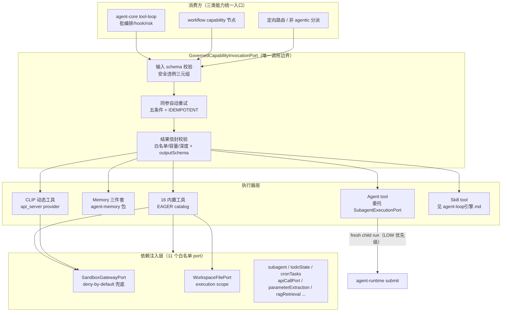
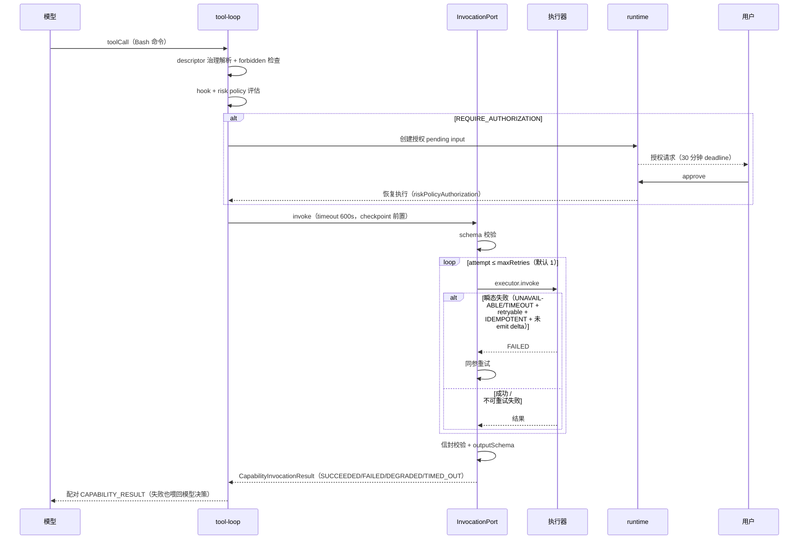
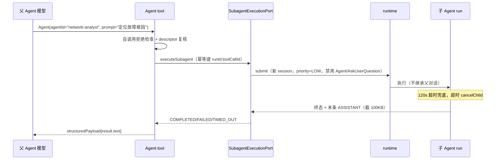

# NextAgent agent-capability 工具体系实现设计文档

> 版本: 1.0 | 日期: 2026-08-25 | 基于源码 `agent-capability`（tools/execution/catalog/builtins/agents/clip）、`agent-runtime/src/lifecycle/subagent-execution-port.ts`、`agent-memory/src/memory-tools.ts`、`agent-platform-gateway-local/src/sandbox/`
>
> 工具批处理编排（agent-core tool-loop 侧）见 `docs/agent-loop引擎.md` 第 3.7 节；Skill 工具详见 `docs/agent-loop引擎.md`。本文聚焦 capability 侧的工具框架、调用边界、内置工具清单与 SubAgent 系统。

---

## 目录

1. [背景与目标](#1-背景与目标)
2. [上下文：系统定位、术语与规格导航](#2-上下文系统定位术语与规格导航)
3. [架构总览](#3-架构总览)
4. [关键不变量与状态机](#4-关键不变量与状态机)
5. [defineTool 框架与依赖注入](#5-definetool-框架与依赖注入)
6. [内置工具清单](#6-内置工具清单)
7. [能力目录 CapabilityCatalog](#7-能力目录-capabilitycatalog)
8. [调用边界：GovernedCapabilityInvocationPort](#8-调用边界governedcapabilityinvocationport)
9. [Agent Tool 与 SubAgent 系统](#9-agent-tool-与-subagent-系统)
10. [Sandbox 边界：Bash/Python 执行链](#10-sandbox-边界bashpython-执行链)
11. [CLIP / API-backed 工具](#11-clip--api-backed-工具)
12. [安全设计](#12-安全设计)
13. [DFX：可观测、容量与可测试性](#13-dfx可观测容量与可测试性)
14. [关键数据结构与契约](#14-关键数据结构与契约)
15. [错误处理与降级](#15-错误处理与降级)
16. [附录 A：核心文件索引](#附录-a核心文件索引)
17. [附录 B：默认配置参数汇总](#附录-b默认配置参数汇总)

---

## 1. 背景与目标

### 1.1 问题定义

工具体系是模型与外部世界（文件系统、shell、远端 API、子智能体）之间的**唯一执行通道**，它必须同时满足：

- **统一治理**：Tool/Skill/Agent 三类能力如果各自走调用路径，risk policy、schema 校验、审计、重试就无法一致施加——历史上"MCP 直连、内置特殊路径"式架构正是在这里失守。
- **安全隔离**：模型输出是不可信输入（工具参数、命令、路径都是模型生成的）；动态执行（shell/python）绝不能用宿主进程权限。
- **故障语义收敛**：工具失败必须以安全错误（SafeError）回给模型继续决策，而不是让整个 run 崩溃；同时容量超限、schema 违约要 fail-closed。
- **可扩展**：业务团队新增一个工具（自定义 Tool、CLIP API 工具）不应修改内核。

### 1.2 设计目标

1. **一种 Capability，一条调用边界**：三类能力统一 descriptor、统一 invoke、统一结果信封（CapabilityInvocationResult + SafeError）。
2. **依赖注入而非全局单例**：工具经 11 个白名单依赖名（ToolDependencies）声明所需 port，装配期静态判定可用性（缺依赖 → UNAVAILABLE 而非运行时崩溃）。
3. **动态执行强制沙箱**：Bash/Python 一律经 SandboxGatewayPort；沙箱不可用时 deny-by-default fail-closed，无宿主回退。
4. **SubAgent 隔离委托**：子代理 fresh-context（不继承父对话）、LOW 优先级、禁用递归委托与用户交互工具——委托是有界子任务，不是权限放大。
5. **同参自动重试只对幂等能力**：五条件全满足（status/category/retryable/IDEMPOTENT/未 emit delta）才重试，默认 1 次上限 5。

### 1.3 非目标

- **不拥有工具批编排**：批内并行/串行决策、forbidden/allowSubagents 检查、hook 与 risk policy 触发点在 agent-core tool-loop（见 `docs/agent-loop引擎.md` §15.7）。
- **不做 per-tool 重试预算**：工具失败结果直接喂回模型决策（tool-loop 哲学：收敛由 maxTurns 唯一保证）；同参重试只处理瞬态基础设施故障。
- **不做远程 Agent 执行**：`SubagentExecutionPort` 只允许 BUNDLED/LOCAL_DIRECTORY provider（`REMOTE_AGENT_EXECUTION_UNSUPPORTED`）。
- **不做工具热插拔**：catalog 治理视图每次 resolution 重算，但工具注册在启动期完成。

### 1.4 关键取舍记录

| 取舍 | 决策 | 理由 |
|------|------|------|
| 结果容量超限按 replayPolicy 分话术 | IDEMPOTENT 提示可安全重放；非幂等提示"可能已产生副作用、勿原样重放"（executor.ts:383-391） | 无法判断副作用是否已发生时，把风险信息交给模型而不是替它做决定 |
| 同参重试禁止在 emit delta 后 | deltaCalled=false 是重试前置条件（:610-642） | 结果已流式外发后重试会产生重复输出 |
| 子 run 禁用 Agent + AskUserQuestion | submit.ts:1302-1315 | 防递归委托失控；子代理面向模型不面向用户（用户交互只在顶层） |
| 子代理调度固定 LOW 优先级 | subagent-execution-port.ts:83 | 顶层请求优先收敛；子任务不应抢占主对话资源 |
| CLIP 非 query primitive 标 NON_IDEMPOTENT | clip-tool-source.ts:487 | 无法证明写操作幂等时按非幂等处理（安全默认） |
| sandbox risk policy 评估器异常 → POLICY_FAILED 失败 | sandbox-execution-port.ts:238-251 | 治理依赖不可用时 fail-closed，不静默放行 |
| describe 截断 512 字符 / schema hint 900 字符 | tool-catalog.ts:59 | 模型可见提示预算受控（与上下文工程预算门联动） |

---

## 2. 上下文：系统定位、术语与规格导航

### 2.1 系统定位与上下游

```
agent-core tool-loop（批编排、hook、risk policy、checkpoint）
        │ 唯一调用方（CapabilityInvocationPort.invoke）
        ▼
┌───────────────────────────────────────────────────────┐
│ agent-capability（本文）                                │
│ defineTool SPI → BuiltinToolCatalog（EAGER）             │
│ → GovernedCapabilityInvocationPort（校验/重试/信封）     │
│ → 各执行器（16 内置 + CLIP + Agent/Skill 委托）          │
└───┬───────────┬───────────┬───────────┬───────────────┘
    │           │           │           │
    ▼           ▼           ▼           ▼
Sandbox-    workspace-  agent-      agent-runtime
GatewayPort FilesPort   memory      （SubagentExecutionPort
（local 实现/ （execution （memory     创建 child run；=
 deny-by-    workspace  tools 三件套） LOW 优先级排队）
 default）    resolver）  所在包）
```

- **上游**：agent-core tool-loop 是唯一调用方（descriptor 解析后传入 resolvedDescriptor）；catalog 治理输入来自各 discovery。
- **下游**：沙箱经 gateway-local 实现（本地）/ deny-by-default 兜底；SubAgent 委托回 runtime 提交 child run（形成核心-运行时环回，经 port 契约打破包依赖）。
- **同级协作**：Skill 工具的资源投影复用 workspaceFiles 依赖；CLIP 工具的搜索披露与 ToolSearch 协同（见 `docs/agent-loop引擎.md` §7）。

### 2.2 术语表

| 术语 | 定义 |
|------|------|
| capability | Tool/Skill/AGENT 三类能力的统称，以 CapabilityDescriptor 进入 catalog |
| replayPolicy | 能力重放声明：IDEMPOTENT（同参重放安全）/ NON_IDEMPOTENT |
| disclosurePolicy | 披露策略：EAGER / DEFERRED（ToolSearch 发现）/ HIDDEN |
| ToolDependencies | 11 个白名单注入依赖（sandbox/workspaceFiles/skillSources/ragRetrieval/subagentExecution/todoState/workflowExecution/cronTasks/apiCallPort/parameterExtraction/guardrail） |
| 结果信封 | CapabilityInvocationResult 四态（SUCCEEDED/FAILED/DEGRADED/TIMED_OUT）+ structuredPayload/generatedMessages/contextPatch/safeError |
| SafeError | 跨边界安全错误：code/category（9 类）/message/retryable/safeDetails，唯一失败外显形态 |
| 安全结果错误类型 | Tool 内主动抛出的三类错误（Degraded/Failed/TimedOut），executor 捕获后映射为对应结果态 |
| SubagentExecutionPort | runtime 拥有的子代理执行端口：创建 fresh-context child session/run 并等待终态 |
| fresh context | 子代理全新会话，不继承父对话消息；prompt 必须自包含 |
| CLIP | clip_server provider 暴露的外部系统 API 工具（describe→descriptor、execute→HTTP） |
| deny-by-default | 沙箱不可用时的 fail-closed 兜底 adapter（disabled/unconfigured/unsupported-platform/remote-unavailable/prerequisite-missing 五种 reason） |

### 2.3 权威规格导航

| 主题 | 权威 spec |
|------|-----------|
| capability 统一治理、结果信封、同参重试、失败分类 | `capability-catalog`、`actionable-execution-failure` |
| 冲突解决 | `conflict-resolution` |
| Tool SPI、同轮并行、描述 guidance | `builtin-tool-framework` |
| 各内置工具 | `bash-tool`、`python-tool`、`read-tool`、`write-tool`、`edit-tool`、`glob-tool`、`grep-tool`、`file-operation-tools`、`file-search-tools`、`command-script-tools`、`cross-platform-executable-semantics`、`todo-write-tool`、`ask-user-question-tool`、`ask-user-question-trigger-policy`、`tool-search-tool`、`memory-tools`、`rag-tool` |
| sandbox 边界与 deny-by-default | `sandbox-runtime`、`sandbox-deny-by-default-adapter` |
| Agent tool 与子代理 | `agent-tool`、`invoked-agent-discovery` |
| CLIP / API-backed | `api-backed-tool-source`、`capability-source-configuration` |
| 幂等契约（replay policy、稳定键） | `idempotency-contract` |
| 跨模块失败处置白盒入口 | design `openspec/designs/architecture/capability-invocation-and-failure-disposition.md` |

Feature/Function 追溯：F-5.1、F-5.2、F-5.6、F-5.7、F-3.4；FN-5.1 ~ FN-5.17、FN-5.25、FN-3.10。

---

## 3. 架构总览

### 3.1 组件视图

```
┌─────────────────────────────────────────────────────────────────────┐
│ agent-core tool-loop（见 docs/agent-loop引擎.md §15.7）            │
│   resolveToolCallDescriptor → forbidden/allowSubagents 检查          │
│   → BEFORE_CAPABILITY_INVOKE hook → risk policy → checkpoint         │
│   → capabilityInvocation.invoke(args, timeout, signal)               │
└──────────────┬──────────────────────────────────────────────────────┘
               ▼
┌──────────────调用边界 ③─────────────────────────────────────────────┐
│ GovernedCapabilityInvocationPort.invoke（execution/executor.ts:212） │
│   resolveMaxRetries → descriptor 解析 → 输入 schema 校验(Ajv)        │
│   → executor 选择 → invokeWithBoundary（同参自动重试循环）           │
│   → normalizeResult（信封校验 + 容量 + outputSchema 校验）           │
└──────────────┬──────────────────────────────────────────────────────┘
               ▼
┌──────────────执行器 ④───────────────────────────────────────────────┐
│ BuiltinToolsExecutor（executor.ts:63）                               │
│   tool.execute(input, {context, deps, signal})                       │
│   ├─ 16 内置工具（builtins/，EAGER catalog）                          │
│   ├─ Memory 三件套（agent-memory，search/detail/add）                 │
│   ├─ CLIP 动态工具（clip/，api_server provider）                      │
│   ├─ Agent tool → SubagentExecutionPort.submit（子 run）             │
│   └─ Skill tool（见 AgentLoop执行引擎.md §7）                         │
│ 错误映射: ToolDegradedResultError→DEGRADED / ToolFailedResultError   │
│         →FAILED / ToolTimedOutResultError→TIMED_OUT                  │
└──────────────┬──────────────────────────────────────────────────────┘
               ▼ 依赖注入（ToolDependencies，tool-spi.ts:224-238）
   sandbox / workspaceFiles / skillSources / ragRetrieval /
   subagentExecution / todoState / workflowExecution / cronTasks /
   apiCallPort / parameterExtraction
               ▼
┌──────────────Sandbox 边界────────────────────────────────────────────┐
│ createWorkspaceBackedSandboxExecutionPort                            │
│   risk policy（builtin-risk-policy）→ SandboxGatewayPort.execute     │
│   local 实现 / deny-by-default adapter（fail-closed）                 │
└─────────────────────────────────────────────────────────────────────┘
```

### 3.2 逻辑视图：统一调用链分层



要点：Tool/Skill/Agent 无特殊路径——同一 descriptor 治理、同一 invoke 边界、同一结果信封（SafeError 唯一失败出口）。

### 3.3 业务流程视图

**流程 A：一次工具调用的全链治理（含授权暂停与同参重试）**



**流程 B：子代理委托（fresh-context 隔离）**



---

## 4. 关键不变量与状态机

### 4.1 核心不变量

| # | 不变量 | 强制点 |
|---|--------|--------|
| T1 | 一切模型可调用能力必须经 catalog 治理可见后才可 invoke | resolveCapability/resolveForInvocation（catalog.ts:103-161） |
| T2 | 结果信封严格闭合：顶层字段白名单、节点 ≤10,000、深度 ≤64、字节 ≤2,560,000 | validateCapabilityInvocationResult（result-schema.ts:18-36, 76-140） |
| T3 | 非空业务 payload 未过 outputSchema → 整体替换为 CAPABILITY_OUTPUT_INVALID，不公开 violations | normalizeResult（executor.ts:413-419, 444-469） |
| T4 | 同参重试五条件缺一不可（signal 未中止/FAILED或TIMED_OUT/UNAVAILABLE或TIMEOUT/retryable/IDEMPOTENT/未 emit delta） | shouldRetrySameArguments（executor.ts:610-642） |
| T5 | emit 过 result delta 的 attempt 永不重试 | delta 通道（executor.ts:644-676） |
| T6 | 依赖缺失的工具在装配期即 UNAVAILABLE，不进入运行时 | hasRequiredDependencies（tool-catalog.ts:252-254） |
| T7 | 子 run 不可调用 Agent/AskUserQuestion 且 allowSubagents=false | effectiveRoutingConstraints（submit.ts:1302-1315） |
| T8 | Agent tool 自调用被拒 | SELF_INVOCATION_REJECTED（agent-tool.ts:47-53） |
| T9 | 沙箱不可用 → deny-by-default fail-closed，无宿主回退 | deny-by-default-sandbox.ts:57-69 |
| T10 | 沙箱 risk policy 非 ALLOW 即拒（DENY/DEGRADED/POLICY_FAILED/REQUIRE_AUTHORIZATION 各自映射安全错误） | runSandbox（sandbox-execution-port.ts:181-195, 268-315） |
| T11 | 模型输出永不被信任为身份/scope 来源：arguments 只做 schema 校验，scope 全部来自请求坐标 | executor 构造（executor.ts:87-123） |

### 4.2 结果状态机

CapabilityInvocationResult 四态与来源：

```
executor.invoke
   ├─ 正常返回 TOutput → SUCCEEDED（信封校验+outputSchema 通过）
   ├─ ToolDegradedResultError ──────────► DEGRADED（必须有非空 structuredPayload，否则 OUTPUT_INVALID）
   ├─ ToolTimedOutResultError ──────────► TIMED_OUT
   ├─ ToolFailedResultError / SafeError → FAILED
   ├─ signal.aborted ───────────────────► CANCELED（Skill 用 ABORTED）
   └─ 未知异常 → 日志 exception_captured → FAILED(CAPABILITY_EXECUTION_FAILED)
        │
        └─（FAILED/TIMED_OUT 且满足 T4 五条件）─ 同参重试（≤maxRetries，默认 1）
              └─ 重试耗尽 → 返回最终失败结果（喂回模型决策，不终止 run）
```

### 4.3 SubAgent 委托生命周期

```
Agent tool invoke
  → 自调用检查(T8) → descriptor 复核（AGENT/AVAILABLE/modelInvocable）
  → SubagentExecutionPort.executeSubagent
      → runtime.submit（fresh child session，priority=LOW，parent 坐标透传）
      → waitForTerminal（订阅 child timeline 终态事件）
           ├─ REQUEST_COMPLETED → COMPLETED（取末条 ASSISTANT，截 100KB）
           ├─ REQUEST_FAILED    → FAILED
           ├─ REQUEST_CANCELED  → CANCELED → FAILED(CANCELED)
           └─ timeout(120s 默认) → TIMED_OUT + cancelChild（幂等键 :cancel 后缀）
```

### 4.4 关键并发与竞态场景

| 场景 | 机制 | 结果 |
|------|------|------|
| 同批工具并行执行（tool-loop 决策） | Promise.allSettled + 有序 finalize turns；ToolSearch+Skill 配对强制串行 | 结果顺序确定；Skill 能看到同批激活 |
| 子代理超时与 child 终态竞速 | setTimeout 超时触发 cancelChild；流断开用 getActiveRun+recoverInactiveRunTerminal 恢复 | 不悬挂；终态幂等 |
| 沙箱后台任务与 run 结束竞速 | 后台任务生命周期独立于 run（kill 显式、完成静默） | 终态事件可晚于 run 结束（timeline 注释） |
| catalog 治理视图重算 | 每次 resolution 重新走 discovery（EAGER listAll/SEARCH search） | binding 变化在下次调用生效 |

---

## 5. defineTool 框架与依赖注入

### 5.1 defineTool 签名

**文件**: `packages/agent-capability/src/tools/tool-spi.ts:319-359`

```typescript
export function defineTool<
  TInput extends JsonObject = JsonObject,
  TOutput extends JsonObject = JsonObject,
  TConfig extends JsonObject = JsonObject,
>(definition: {
  readonly name: CapabilityId;
  readonly displayName?: string;
  readonly locales?: CapabilityLocales;
  readonly description: string;
  readonly inputSchema: JsonObject;    // 手写 JSON Schema
  readonly outputSchema: JsonObject;
  readonly configSchema?: JsonObject;
  readonly requiredDependencies?: readonly ToolDependencyName[];
  readonly replayPolicy?: CapabilityReplayPolicy;
  readonly disclosurePolicy?: CapabilityDisclosurePolicy;
  readonly returnsCapabilityResult?: boolean;
  readonly observability?: ToolObservabilityDefinition;
  configure?: (config: TConfig, deps?: ToolDependencies) => Tool<TInput, TOutput, TConfig>;
  execute: (input: TInput, options?: ToolExecuteOptions) => Promise<TOutput | CapabilityInvocationResult>;
}): ToolDefinition<TInput, TOutput, TConfig>
```

实现（:339-358）是纯投影：拆成 `metadata`（可选字段条件展开）与 `tool`（可选 configure + 必选 execute）。`ToolMetadata`（:275-288）= name/displayName?/locales?/description/inputSchema/outputSchema/configSchema?/requiredDependencies?/replayPolicy?/disclosurePolicy?/returnsCapabilityResult?/observability?。

### 5.2 依赖注入（ToolDependencies，:224-238）

```typescript
export interface ToolDependencies {
  readonly approval?: never;              // type-level deny
  readonly sandbox?: SandboxExecutionPort;
  readonly guardrail?: GuardrailGatewayPort;
  readonly workspaceFiles?: WorkspaceFilePort;
  readonly skillSources?: SkillSourceRegistry;
  readonly ragRetrieval?: RagRetrievalGateway;
  readonly ragDefaultIndexes?: readonly string[];
  readonly subagentExecution?: SubagentExecutionPort;
  readonly todoState?: TodoStatePort;
  readonly workflowExecution?: WorkflowExecutionToolPort;
  readonly cronTasks?: CronTaskPort;
  readonly apiCallPort?: ApiCallPort;
  readonly parameterExtraction?: ParameterExtractionPort;
}
```

`ToolDependencyName`（:35-46）共 11 个白名单名。依赖可用性在 catalog 装配时静态判定：`hasRequiredDependencies`（`tools/tool-catalog.ts:252-254`）——`requiredDependencies` 每项都必须非 undefined，否则 descriptor 标 `UNAVAILABLE + TOOL_DEPENDENCY_MISSING`（:112-114）。

`ToolExecutionContext`（:240-267）：identityContext/agentId/agentVersion/sessionId/requestId/runId/requestContextId/stepId/toolCallId/locale/timeoutMs + 可选 capabilityResolver/emitPolicyApplied/emitResultDelta/toolSearchSkillSearchEnabled/discoveredSkills/attachmentPaths/flowVariables。

### 5.3 安全结果错误类型（:361-422）

- `ToolDegradedResultError`：`structuredPayload + reasonCode + safeMessage?` → executor 映射 DEGRADED。
- `ToolFailedResultError`：`structuredPayload + code + category + retryable + safeMessage? + safeDetails?` → FAILED。
- `ToolTimedOutResultError`：`structuredPayload + code + retryable?` → TIMED_OUT。

### 5.4 BuiltinToolsExecutor（capability 适配器）

**文件**: `execution/executor.ts:63-192`

```
invoke(descriptor, request, signal, runtimeContext):
  1. signal.aborted → CANCELED 结果（Skill 用 'ABORTED'）              (:74-76)
  2. catalog.resolveExecutable(capabilityId)
     无 executable → CAPABILITY_UNAVAILABLE                            (:77-85)
  3. tool.execute(request.arguments, {context, deps, signal})          (:87-123)
     context 含 timeoutMs、capabilityResolver、emitPolicyApplied、
     emitResultDelta（envelope 校验 :105-115）、discoveredSkills、attachmentPaths
  4. 输出是 CapabilityInvocationResult → 透传；否则包装 SUCCEEDED       (:124-127)
  5. catch 错误映射（见 §2 图）；其他异常 → 日志
     capability.execution.exception_captured + executionFailedResult    (:171-189)
  6. 结果附加 toolDiagnostics（metadata.observability.safeCompletionDiagnostics）
                                                                      (:523-560)
```

`BuiltinToolCatalog`（`tools/tool-catalog.ts:62-94`，discoveryMode EAGER）构造时：未知工具配置检查（:155-162）、规划工具二选一（`todo-write` 模式剔除 `Task*`，`task-tools` 模式剔除 `TodoWrite`，:164-176）、重名检查（:178-186）、`configureTool`（依赖缺失/config 校验失败/configure 抛异常 → UNAVAILABLE，:100-128）、descriptor 投影（:130-153，replayPolicy 缺省 NON_IDEMPOTENT，kind TOOL，version '1'，modelInvocable true）。描述文本上限 512（:59）。

---

## 6. 内置工具清单

注册入口：`packages/agent-capability/src/builtins/index.ts:29-50`（`createBuiltinToolDefinitions`），provider `builtinToolsProvider = { providerId: 'builtin-tools', providerKind: 'BUNDLED' }`（:22）。

### 6.1 agent-capability 内置工具（16 个）

| # | capabilityId | replayPolicy | requiredDependencies | 定义位置 |
|---|---|---|---|---|
| 1 | `Read` | IDEMPOTENT | [workspaceFiles] | builtins/read/read-tool.ts:9-18 |
| 2 | `Write` | NON_IDEMPOTENT | [workspaceFiles] | builtins/write/write-tool.ts:9-19 |
| 3 | `Glob` | IDEMPOTENT | [workspaceFiles] | builtins/glob/glob-tool.ts:10-18 |
| 4 | `Grep` | IDEMPOTENT | [workspaceFiles] | builtins/grep/grep-tool.ts:10-18 |
| 5 | `Bash` | NON_IDEMPOTENT | [sandbox, workspaceFiles] | builtins/bash/bash-tool.ts:88-97 |
| 6 | `Python` | NON_IDEMPOTENT | [sandbox] | builtins/python/python-tool.ts:16-25 |
| 7 | `Edit` | NON_IDEMPOTENT | [workspaceFiles] | builtins/edit/edit-tool.ts:29-36 |
| 8 | `Rag` | IDEMPOTENT | [ragRetrieval] | builtins/rag/rag-tool.ts:18-26 |
| 9 | `Skill` | NON_IDEMPOTENT | [skillSources, workspaceFiles] | builtins/skill-tool.ts:20-46 |
| 10 | `AskUserQuestion` | NON_IDEMPOTENT | （无，runtime 拦截为 pending-input） | builtins/ask-user-question/ask-user-question-tool.ts:15-30 |
| 11 | `Agent` | NON_IDEMPOTENT | [subagentExecution] | builtins/agent/agent-tool.ts:9-26 |
| 12 | `ToolSearch` | IDEMPOTENT | （无） | builtins/tool-search-tool.ts:62-74 |
| 13 | `TodoWrite` | IDEMPOTENT | [todoState] | builtins/todo-write/todo-write-tool.ts:10-20 |
| 14 | `Workflow` | NON_IDEMPOTENT | [workflowExecution] | builtins/workflow/workflow-tool.ts:15-29 |
| 15 | `ApiCall` | NON_IDEMPOTENT | [skillSources, apiCallPort, parameterExtraction] | builtins/api-call-tool.ts:15-51 |
| 16 | `Cron` | NON_IDEMPOTENT | [cronTasks] | builtins/cron/cron-tool.ts:13-28 |

- `returnsCapabilityResult: true`：Agent（agent-tool.ts:22）、Skill、ToolSearch、Workflow、ApiCall。
- 多数工具 `disclosurePolicy: {mode:'EAGER'}`；Skill/ToolSearch/AskUserQuestion 未显式声明（搜索/延迟披露类）。
- 展示名：`builtins/presentation-names.ts:3-27`（如 Read→'读取文件'）。
- 规划工具切换 `planningToolCallingMode: 'todo-write' | 'task-tools'`，默认 `'todo-write'`（tool-catalog.ts:24, 70）。

### 6.2 Memory 三件套（agent-memory 包）

**文件**: `packages/agent-memory/src/memory-tools.ts`（provider `{providerId: 'memory-tools', providerKind: 'BUNDLED'}`，:47-48；装配入口 `createMemoryToolsProvider` :102-109，由 `agent-app/src/composition/memory-maintenance-composition.ts:99` 接入）：

| 工具 | replayPolicy | 定义位置 | 关键默认 |
|---|---|---|---|
| `search_memory` | IDEMPOTENT | :304-354 | limit ?? 20、minConfidence ?? 0.3 |
| `get_memory_detail` | IDEMPOTENT | :356-408 | 最多 20 个 id |
| `add_memory` | NON_IDEMPOTENT | :410-429+ | 结构化写入 |

### 6.3 CLIP-backed 动态工具

由 `ClipBackedToolDiscovery.listAll` 生成 descriptor（`clip/clip-tool-source.ts:174-235`），`replayPolicy: primitive === 'query' ? 'IDEMPOTENT' : 'NON_IDEMPOTENT'`（:487）。

---

## 7. 能力目录 CapabilityCatalog

**核心实现**: `packages/agent-capability/src/catalog/catalog.ts:62-506`（`StaticCapabilityCatalog`，同时实现 `CapabilityCatalog` 与 `CapabilityCurrentViewPort`）。

> 完整可见视图计算与冲突解决算法见 `docs/agent-loop引擎.md` §7（Skill 与 Tool 共用同一治理管道）；本节只列工具侧要点。

- 注册 API：`register()`（:144-146）、`registerDiscovery()`（:148-154，按 discoveryMode 分桶）、`registerSkillSourceDiscovery()`（:175-177）。
- `resolveForInvocation()`（:156-161）：startup descriptors 过滤 `capabilityId 匹配 && AVAILABLE`，交给 `conflictResolver.resolve()`（默认 `UniqueCapabilityConflictResolver` :56-60：唯一才通过）。
- `listCurrent`（:108-142）：要求 eager/search 发现器实现 `listCurrent`，按 kind/capabilityId 排序。
- 治理优先级（:523-540）：runtime-generated-local=1 < agent-owned-local=2 < BUNDLED builtin=3 < system-local=4 < 其他=5。
- 证据沉淀（:404-433）：`LOCAL_SKILL_DUPLICATE_REJECTED`、`LOCAL_SKILL_SHADOWED_BY_AGENT`、`LOCAL_AGENT_REGISTERED`、`SKILLHUB_SKILL_SHADOWED` 等。

---

## 8. 调用边界：GovernedCapabilityInvocationPort

**文件**: `packages/agent-capability/src/execution/executor.ts:212-422`

```
invoke(request, signal, runtimeContext):                                (:218-314)
├─ signal.aborted → canceledResult                                      (:223-225)
├─ resolveMaxRetries(request.maxRetries)                                (:226, 36-44)
│    缺省 1；[0,5] 内整数有效；越界归 0                                 (:33-34)
├─ descriptor 解析（request.resolvedDescriptor 优先）                    (:229-244)
│    失败 → executionFailedResult('DESCRIPTOR_RESOLUTION')
├─ descriptor === undefined → CAPABILITY_UNAVAILABLE                    (:245-251)
├─ descriptor.capabilityId ≠ request.capabilityId → EXECUTOR_SELECTION   (:252-265)
├─ 输入 schema 校验 collectInputViolations(inputSchema, args)            (:266-292)
│    （Ajv 错误→安全 violation 三元组，无原始值泄漏，
│      invocation/validation-violations.ts:18-31；WeakMap 缓存编译器
│      invocation/schema-validation.ts:10-39）
│    有违例 → inputInvalidResult
├─ executor 选择 executorFactory.create({descriptor})                    (:293-312)
│    （StaticCapabilityExecutorFactory :194-206：按 providerId+kind 匹配，
│      多于一个匹配抛 CapabilityConfigurationError）
└─ invokeWithBoundary(...)                                              (:313, 316-378)
   循环（attempt = retryCount + 1）:
   ├─ 每 attempt 建 delta 通道 createAttemptDeltaChannel                (:330, 644-676)
   │  （emit 后不可重试；attempt settle 后 emit 抛错）
   ├─ executor.invoke(...) → normalizeResult                            (:333-337)
   │  异常捕获 → 日志 + executionFailedResult('CAPABILITY_EXECUTION')   (:338-358)
   ├─ shouldRetrySameArguments 判定（条件全部满足才同参重试）             (:362, 610-642):
   │    · signal 未中止
   │    · status ∈ {FAILED, TIMED_OUT}
   │    · safeError.category ∈ {UNAVAILABLE, TIMEOUT}
   │    · safeError.retryable === true
   │    · descriptor.replayPolicy === 'IDEMPOTENT'
   │    · safeError.code ≠ 'CAPABILITY_RESULT_UNKNOWN'
   │    · 本 attempt 未 emit 过 result delta
   ├─ retryCount < maxRetries 才继续；日志 capability.retry.same_arguments
   └─ 返回 normalized
```

**normalizeResult**（:380-421）：

```
normalizeResult(raw, descriptor):
├─ validateCapabilityInvocationResult（严格信封校验，result-schema.ts:76-140+）
│    顶层字段白名单（:18-28）；节点上限 10_000、深度 64、字节容量
│    capabilityResultJsonCapacity = 2_560_000（result-builders.ts:6）
├─ 容量超限：IDEMPOTENT 给"可安全重放"话术；
│    非幂等给"可能已产生副作用、勿原样重放"话术                        (:383-391)
├─ Workflow 专属 metadata 白名单校验                                    (:407-409, 424-438)
├─ DEGRADED 且 structuredPayload 为空 → outputInvalidResult             (:410-412)
└─ outputSchema 存在且应校验 → Ajv 校验，失败 → outputInvalidResult
     + 日志 capability.output.validation_failed                        (:413-419, 444-469)
```

**超时控制**：invoke 边界不实现超时——`request.timeoutMs` 注入 `ToolExecutionContext.timeoutMs`（executor.ts:99）由各工具/sandbox 执行限时；上游默认 `defaultCapabilityTimeoutMs = 600_000`（`agent-core/src/tools/tool-loop.ts:129`，`BEFORE_CAPABILITY_INVOKE` hook 可覆盖，tool-loop.ts:787, 794）。

**hook 与 risk policy 的位置**：在 agent-core tool-loop（`BEFORE_CAPABILITY_INVOKE` :775-792 / `AFTER_CAPABILITY_INVOKE` :1270+；risk policy 评估 :796-817 与 descriptor 缺失路径 :706-727）；sandbox 侧独立 risk policy 见 §8。

**同参自动重试上限**：默认 1 次（共 2 次尝试）、最大可配 5（executor.ts:33-34）；agent-core tool-loop 发起 invoke 时未传 maxRetries（tool-loop.ts:910-928）。

---

## 9. Agent Tool 与 SubAgent 系统

### 9.1 Agent descriptor（governed AGENT descriptor）

**文件**: `packages/agent-capability/src/agents/agent-discovery.ts`

- providers：`builtin-agents`（BUNDLED，:9）、`local-agents`（LOCAL_DIRECTORY，top-level，EAGER，:10, 143）、`local-subagents`（LOCAL_DIRECTORY，parent-subagent，SEARCH，:11, 142-143）。
- `BuiltinAgentDiscovery.listAll`（:91-113）：读 `listBuiltinAgentAssemblies`，逐个映射 descriptor，产出 readiness 证据（`BUILTIN_AGENT_REGISTERED` / `BUILTIN_AGENT_CANDIDATE_INVALID` 等）。
- `LocalAgentDiscovery.search`（:164-201，parent-subagent 作用域）/ `listCurrent`（:203-232）。
- **descriptor 映射规则** `mapAssemblyToDescriptor`（:328-350）：`agentId/agentVersion` 匹配 `/^[A-Za-z0-9][A-Za-z0-9._-]{0,127}$/`（:76）；产出 `{capabilityId: agentId, kind: 'AGENT', provider, version, displayName, description, modelInvocable: agentInvocation !== 'NONE', availabilityStatus: agentInvocation === 'NONE' ? 'UNAVAILABLE' : 'AVAILABLE'}`；Ajv 闭合校验（:77, 349）。

### 9.2 Agent tool 执行

**文件**: `packages/agent-capability/src/builtins/agent/agent-tool.ts`

- 描述（:12-16）：委托"一个具体、有界、自包含"的子任务；**子 Agent 全新上下文，不继承父对话**，prompt 必须自包含；不能自调用；只有 `status: completed` 携带成功结果。
- 输入校验 `validateInput`（:89-121）：只允许 `agentId + prompt`；prompt 上限 8192 字节（`agent-schemas.ts:3`）。
- 自调用拒绝：`agentId === context.agentId → SELF_INVOCATION_REJECTED`（:47-53）。
- descriptor 复核：`capabilityResolver.resolveCapability({kind:'AGENT', capabilityId})`，必须 `kind===AGENT && AVAILABLE && modelInvocable===true`，否则 `AGENT_NOT_AVAILABLE`（:54-69）。
- 委托：`subagentExecution.executeSubagent({...})`（:70-85），请求含 targetAgentId/targetAgentVersion?/targetProviderKind/prompt/parentSessionId/parentRunId/parentRequestId/parentToolCallId/identityContext/locale（默认 'zh-CN'）/idempotencyKey = `deriveCapabilityInvocationIdempotencyKey(runId, toolCallId)`（`agent-common/src/index.ts:431-433`）。
- 结果映射 `mapSubagentResult`（:123-169）：COMPLETED（无 safeError）→ SUCCEEDED + `structuredPayload { agentId, status:'completed', result:{ text: truncateUtf8(terminalText, 100_000) } }`；TIMED_OUT → TIMED_OUT；CANCELED → FAILED(CANCELED)；COMPLETED 但带 safeError → `AGENT_CHILD_RESULT_INVALID`（:171-173）。

### 9.3 SubagentExecutionPort（runtime 侧）

**文件**: `packages/agent-runtime/src/lifecycle/subagent-execution-port.ts`

```
RuntimeSubagentExecutionPort.executeSubagent(request):               (:61-123)
  1. providerKind 只允许 BUNDLED / LOCAL_DIRECTORY
     否则 REMOTE_AGENT_EXECUTION_UNSUPPORTED                          (:62-64)
  2. 解析目标 assembly（assemblyRegistry.active/require）
     超时 = assembly.runtimeSettings.requestTimeoutMs ?? 120_000 ms   (:16, 67-71)
  3. runtime.submit({...}) 创建 child run:                            (:72-84)
     inputText = request.prompt; attachmentIds = []（无附件）
     parentSessionId/parentRunId/parentRequestId 透传
     priority: 'LOW'（调度优先级降低）                                 (:83)
     idempotencyKey = request.idempotencyKey
  4. waitForTerminal（:125-199）:
     streamEvents 订阅 child timeline（REQUEST_COMPLETED/FAILED/CANCELED）
     setTimeout(timeoutMs) 到期 → TIMED_OUT 并 cancelChild
     流断开 → getActiveRun + recoverInactiveRunTerminal 恢复终态       (:229-248)
  5. 终端文本恢复 terminalText（:212-287）:
     listMessages(limit 100, includeCapabilityResults false)
     取最后一条 ASSISTANT 消息，截断到 100_000 字节                    (:17, 286)
  6. cancelChild（:201-210）:
     RequestControlCommand{action:'CANCEL', idempotencyKey: `${key}:cancel`}
```

### 9.4 Fresh context 与子 run 工具限制

- **fresh context**：child 是全新 session——`submit()` 无 sessionId 时 createSession（`agent-runtime/src/lifecycle/submit.ts:1289-1297`），携带 parent 坐标建立 lineage。
- **child-run 工具拒绝清单**（`submit.ts:1302-1315` `effectiveRoutingConstraints`）：

```typescript
if (parentRunId === undefined) return constraints;
const forbidden = new Set<string>(['Agent', 'AskUserQuestion',
  ...(constraints?.forbiddenCapabilityIds ?? [])]);
return { ...(constraints ?? {}), forbiddenCapabilityIds: [...forbidden], allowSubagents: false };
```

即子 run 禁用 `Agent`（防递归委托）与 `AskUserQuestion`（子代理不能向用户提问），且 `allowSubagents: false`。执行点在 agent-core tool-loop：`CAPABILITY_FORBIDDEN_BY_ROUTING_CONSTRAINT`（tool-loop.ts:691-699）、`SUBAGENT_FORBIDDEN_BY_ROUTING_CONSTRAINT`（:736-744）。

- **调度优先级**：`priorityRank`（submit.ts:4166-4168）：HIGH=3 / NORMAL=2 / LOW=1；submit 默认 NORMAL（:1080）；subagent 固定 LOW。

---

## 10. Sandbox 边界：Bash/Python 执行链

### 10.1 链路

```
Bash tool（builtins/bash/bash-tool.ts:150-281 executeBash）
Python tool（builtins/python/python-tool.ts:31-116 executePython）
   ↓ deps.sandbox（SandboxExecutionPort，tool-spi.ts:147-158）
createWorkspaceBackedSandboxExecutionPort（builtins/sandbox/sandbox-execution-port.ts:115-144）
   ↓ risk policy 评估（:146-216）
   ↓ SandboxGatewayPort.execute（agent-contracts/src/gateway/index.ts:2385-2393）
```

### 10.2 Bash pre-validation（进入 sandbox 前）

- 命令分词 `parseBashCommand`（`bash-policy.ts:8-11`，手写 tokenizer :13-47）；未闭合引号或空命令 → `COMMAND_NOT_ALLOWED`（AUTHORIZATION，:49-57）。
- 双模式（command-string / argv）：`parseBashInputForModelCorrection`（bash-tool.ts:428-457），argv 模式要求 command 仅一个可执行。
- env 白名单：仅 `PYTHONPATH`（`MODEL_ALLOWED_ENV_KEYS`，bash-tool.ts:36，≤4096 字符）；`NEXTAGENT_USER_ID/USER_NAME/CHAT_ID/CONVERSATION_ID` 由运行时注入（`AUTO_INJECTED_ENV_KEYS` :38；`injectIdentityEnvironment` :579-614）。
- Python 解释器调用约束：禁止 REPL、`-c`、`-`、非法 `-m`；仅允许 `python <script.py>` / `python -m dotted.module` / `python --version`（:629-651）。
- curl 自动加 `--max-time 600`（:40, 186-189）。
- Skill 相对脚本路径改写 `resolveSkillRelativeScriptArgs`（:283-314），歧义时 `SKILL_RESOURCE_PATH_AMBIGUOUS`。
- 超时 `resolveTimeoutMs = min(requested(默认 600_000), trustedTimeoutMs, 600_000)`（:117-122）；输出上限 stdout/stderr 各 1,000,000 字节（:204-205）。
- 后台模式：`run_in_background` 需 `backgroundExecutionEnabled`（:160-170）；1 秒宽限窗判断命令是否立即退出（:34, 216-220）；超时自动转后台 `TIMEOUT_AUTO_BACKGROUND`（:274-276）；流式输出 `runShellStreaming`（SSE/NDJSON 自动探测 :236-255）。

### 10.3 Python pre-validation

- `timeout_ms = min(requested(默认 120_000), maxTimeoutMs=120_000, trustedTimeoutMs)`（python-tool.ts:10-11, 150-161）。
- `args` ≤100 项（:14, 130-137）、总字节 ≤8192（:12, 138-146）；输出上限各 1 MB（:13, 84-85）。
- guardrail：`deps.guardrail.checkNl2Python` 可选代码安全检查（:57-77）。
- 沙箱提交：内联代码写入 temp 目录 `randomUUID().py`，注入 Python 3.6 `subprocess.run` 兼容前导（sandbox-execution-port.ts:30-49, 341-371）。

### 10.4 WorkspaceBackedSandboxExecutionPort（risk policy + gateway 适配）

**文件**: `builtins/sandbox/sandbox-execution-port.ts`

- `runSandbox`（:146-216）：
  1. Python 提交物准备（:154-157）。
  2. 摘要受限操作 `summarizeSandboxOperation`（:218-236）：`operationKind:'SANDBOX_EXECUTION'`、`riskLevel:'MEDIUM'`、`operationId: ${executable}:${command}`。
  3. 风险策略评估（policyId `builtin-risk-policy` v1，:177-180；评估器异常 → `POLICY_FAILED`/`RISK_POLICY_EVALUTION_FAILED`，:238-251）。
  4. 非 `ALLOW` → `emitPolicyApplied` + `toRiskPolicyError`（:181-195, 268-315；DENY→POLICY_DENIED、DEGRADED→UNAVAILABLE、POLICY_FAILED→INTERNAL、REQUIRE_AUTHORIZATION→POLICY_DENIED）。
  5. 组装 `SandboxExecutionRequest`（:317-339：executionId=randomUUID、filesystem 来自 `workspaceFiles.sandboxFilesystem`、environment 注入 PYTHONPATH + FILE_PATHS）。
  6. `gateway.execute` / `executeWithStdoutChunks`（:196-201）；safeError 映射 `toSandboxCapabilitySafeError`（:428-483：denied/unsupported-executable→COMMAND_NOT_ALLOWED、unsafe-path→CAPABILITY_PATH_REJECTED、CANCELED、UNAVAILABLE 透传 retryable）。
- 后台执行（本地部署）：`startBackgroundShell`（:506-532）、`runShellBackgroundable`（:534-583，`raceBackgroundableCompletion` 竞速超时）；后台记录 `BackgroundTaskRecord`（:585-666），stdout/stderr 落盘 `tool-results/${taskId}.stdout.txt`（:628-629）；输出解码 UTF-8→GBK 回退（:715-726）。背景不可用时降级 `SANDBOX_BACKGROUND_UNAVAILABLE`（:134-142）。

### 10.5 SandboxGatewayPort 契约与 deny-by-default

- `SandboxGatewayPort`（`agent-contracts/src/gateway/index.ts:2385-2393`）：`execute` 必选；`startBackground?` 可选；`BackgroundCapableSandboxPort`（:2402-2405）追加 `killBackground`。
- `SandboxExecutionRequest`（:2355-2366）：executionId/requestRunId/executable('bash'|'python')/command/args/filesystem/environment/timeoutMs/stdoutLimitBytes/stderrLimitBytes。
- `SandboxExecutionResult`（:2368-2378）：executionId/exitCode?/stdout/stderr/stdoutTruncated/stderrTruncated/timedOut/durationMs/safeError?。
- **deny-by-default adapter**（`agent-platform-gateway-local/src/sandbox/deny-by-default-sandbox.ts`）：`createDenyByDefaultSandboxGateway`（:50-52）；reason 枚举 `disabled | unconfigured | unsupported-platform | remote-unavailable | prerequisite-missing`（:4）；对应 safeError 码 `SANDBOX_DISABLED / SANDBOX_UNCONFIGURED / SANDBOX_UNSUPPORTED_PLATFORM / SANDBOX_REMOTE_UNAVAILABLE(retryable:true) / SANDBOX_PREREQUISITE_MISSING`（:12-48）；execute 直接返回空输出 + safeError（:57-69）——**fail-closed 安全兜底**。

---

## 11. CLIP / API-backed 工具

### 11.1 CLIP provider 发现

**文件**: `packages/agent-capability/src/clip/clip-tool-source.ts`

- provider 识别：`providerKind === 'CUSTOM' && providerType === 'clip_server'`（:16, 130-132）。
- 配置校验 `validateClipSourceOptions`（:134-162）：`customOptions.enabled === true`、clipPathRef/endpointRef 安全 ref、timeoutMs 正整数、retry.maxAttempts ∈ [1,3]（默认 1）。
- 发现器 `ClipBackedToolDiscovery`（EAGER，:164-332）：`listAll`（:174-235）= `runner.listTools` → 逐个 `describeTool` → `parseOrNormalizeClipToolFact` → descriptor（:283-302；tool-search 模式时 `modelInvocable: false` + `disclosurePolicy: {mode:'DEFERRED', searchHint}`）；`resolve(capabilityId)`（:237-281，带缓存）。
- 执行器 `ClipToolExecutor`（:334-410）：注入 trusted headers（chatId=requestId, conversationId=sessionId, x-user-id=subjectId, x-user-name=displayName，:361-366）；结果不符输出契约 → `CLIP_RESULT_INVALID`。
- describe 归一化（:444-488）：从 capability 条目读 target_id/ref/operation/params/body_required；primitive 缺省 `'query'`。

### 11.2 sandbox CLIP 命令 runner

**文件**: `clip/sandbox-clip-command-runner.ts`

- `createSandboxClipCommandRunner`（:26-111）：`listTools` = `clipc list --status all --limit 1000 --json --show-id`（:33-56）；`describeTool` = `clipc describe <target> <ref>`（:57-73）；`executeTool` = 流式 `executeWithStdoutChunks` 或 `execute`（:74-109）。
- 沙箱请求参数：stdout 1,000,000 / stderr 16,384 字节（:113-151）；remote sandbox 时参数 POSIX shell 引号包裹（:153-158）。
- 预留 trace 头：`traceparent/tracestate/x-task-event-id`（clip-tool-source.ts:17）。

---

## 12. 安全设计

### 12.1 Owner Scope 与 Agent Scope 强制点

| 事实/操作 | scope 来源 | 强制点 |
|-----------|-----------|--------|
| 能力调用 | CapabilityInvocationRequest 携带 identityContext + agentId/agentVersion + session/request/run 坐标 | 契约必填（capability/index.ts:609-627）；工具只能读，不能改写 |
| 工具执行上下文 | ToolExecutionContext 投影请求坐标 | executor.ts:87-123（arguments 与 scope 分离） |
| 沙箱执行 | filesystem 来自 workspaceFiles.sandboxFilesystem（execution scope 派生） | sandbox-execution-port.ts:317-339 |
| CLIP 调用 | trusted headers：chatId=requestId、conversationId=sessionId、x-user-id=subjectId、x-user-name=displayName | clip-tool-source.ts:361-366（host 侧注入，非模型参数） |
| 子代理 | parentSessionId/parentRunId/parentRequestId 透传建立 lineage；child 是独立 owner-scoped session | subagent-execution-port.ts:72-84 |
| 幂等键 | deriveCapabilityInvocationIdempotencyKey(runId, toolCallId) | agent-common:431-433；幂等键必须脱敏（spec idempotency-contract） |

### 12.2 不可信输入边界

| 边界 | 不可信内容 | 防护 |
|------|-----------|------|
| 模型工具参数 | arguments JSON | Ajv 输入 schema 校验（违例→安全三元组，无原始值泄漏）；工具级输入上限（args 数量/字节/深度） |
| Bash command | 模型生成命令串/argv | 手写 tokenizer（未闭合引号拒绝）；argv 模式单可执行；env 白名单仅 PYTHONPATH；解释器调用白名单（禁 REPL/-c/-、仅 script.py/-m/--version）；curl 强制 --max-time 600 |
| Python code/args | 模型生成代码与参数 | args ≤100 项/8,192 字节；guardrail 可选 checkNl2Python；沙箱内执行（temp 随机文件） |
| 文件路径（模型给出） | read/write/edit/glob/grep 目标 | normalizeModelPath 两层校验（见 docs/agent-loop引擎.md §13.2） |
| CLIP describe 结果 | 远端工具元数据 | parseOrNormalizeClipToolFact 校验；描述截断；schema hint 有界（900 字符/16 字段/深度 4） |
| 能力 contextPatch | 能力产生的补丁 | 未知 allowedTool → CAPABILITY_CONTEXT_PATCH_DENIED（context engine 侧） |

### 12.3 敏感数据流与最小暴露

- **宿主执行细节不出网关**：`Host Execution Details Belong To The Gateway Adapter`（spec `bash-tool`）——工具层只见 sanitized 结果。
- **stdout/stderr 有界**：Bash/Python 各 1,000,000 字节 + truncated 标志；CLIP stderr 16,384。
- **结果容量话术**：非幂等能力超容量时结果携带"可能已产生副作用、勿原样重放"提示，不携带原始内容。
- **credential 窄脱敏**：工具诊断日志中的 credential/token 键与内联 secret 模式由 agent-log 统一脱敏（见 docs/agent-observability可观测设计.md §8）。

### 12.4 权限模型（工具侧）

三层递进，全部在 invoke 之前或之中施加：

1. **catalog 治理可见性**（能不能被模型看到）：discovery → binding 过滤 → conflict 解决 → AVAILABLE。
2. **路由约束**（这次调用允不允许）：forbiddenCapabilityIds 命中 → CAPABILITY_FORBIDDEN_BY_ROUTING_CONSTRAINT；allowSubagents=false 且 AGENT → SUBAGENT_FORBIDDEN（tool-loop 侧）。
3. **risk policy**（这个具体操作放不放行）：工具准备阶段 + 沙箱前置双重评估（ALLOW/DENY/REQUIRE_AUTHORIZATION/DEGRADED/POLICY_FAILED）；REQUIRE_AUTHORIZATION 经 pending input 授权后凭 riskPolicyAuthorization 恢复（见 docs/agent-runtime任务控制恢复.md §7）。

外部安全护栏（guardrail）经 GuardrailGatewayPort 唯一出口获得一致风险决策（spec `risk-policy-enforcement`、`guardrail-gateway`）。

---

## 13. DFX：可观测、容量与可测试性

### 13.1 可观测信号（本能力产出）

| 信号 | 类型 | 来源 |
|------|------|------|
| `capability.execution.exception_captured` | 结构化日志 | executor.ts:171-189 |
| `capability.retry.same_arguments` | 结构化日志 | executor.ts:362-375 |
| `capability.output.validation_failed` | 结构化日志 | executor.ts:444-469 |
| `CAPABILITY_STARTED/COMPLETED/FAILED/TIMED_OUT/CANCELED/DENIED/SECURITY_FAILED/POLICY_BLOCKED` | observation event / timeline 事件 | timeline-observation-mapper.ts:344-890 |
| `POLICY_APPLIED` timeline 事件（含 builtin-risk-policy 证据） | timeline 事件 | tool-loop.ts:932-950 |
| `tool.payload.captured`（toolInput/toolOutput special fields） | 本地诊断日志（runtime_diagnostic） | tool-loop.ts:1342-1351（见 docs/agent-observability可观测设计.md §8） |
| 工具级低基数指标（capability_invocation_total/duration） | metrics | metric-descriptors（见 docs/agent-observability可观测设计.md §9） |

### 13.2 容量与性能

| 维度 | 值/约束 | 来源性质 |
|------|---------|---------|
| 结果 JSON 容量 | 2,560,000 字节 / 10,000 节点 / 深度 64 | 固定常量 |
| 同参重试 | 默认 1 次，最大 5 | 固定常量 |
| 工具调用超时（上游默认） | 600,000 ms | tool-loop 常量（hook 可覆盖） |
| Bash 超时/输出 | 600,000 ms / stdout+stderr 各 1 MB | 固定常量 |
| Python 超时 | 120,000 ms（默认=上限） | 固定常量 |
| 子代理超时 | 120,000 ms（assembly runtimeSettings 可覆盖） | 固定常量 |
| 子代理结果文本 | 100,000 字节 | 固定常量 |
| 工具描述 | 512 字符 | 固定常量 |
| 端到端 Submit/Cancel/Retry 延迟、TTFT | 性能门禁约束 | spec `ts-performance-test-gate` |

### 13.3 可测试性与验证入口

```bash
# 单元/契约：工具契约、沙箱 negative、重试矩阵、结果信封校验、子代理
npm test
npm run test:contract

# 沙箱绕过/路径逃逸 negative（架构与安全断言）
npm run lint:architecture

# 规格一致性
openspec validate --all --strict
```

关键回归面：同参重试五条件矩阵、结果容量/深度超限话术分叉、outputSchema 违约替换、依赖缺失 UNAVAILABLE、子 run 禁用清单、沙箱 deny-by-default、Bash env/解释器白名单 negative、CLIP 结果契约。

### 13.4 扩展点

| 扩展 | 方式 | 边界 |
|------|------|------|
| 自定义 Tool | `defineTool`（手写 JSON Schema input/output + execute），configRoot provider 注册（CUSTOM kind） | 必须声明 requiredDependencies；缺依赖装配期 UNAVAILABLE；结果必须过信封校验 |
| 新内置工具 | 加入 createBuiltinToolDefinitions 列表 | 走同一 catalog 治理；描述 ≤512 |
| CLIP 新源 | clip_server provider 配置（endpoint/clipPath ref） | describe 结果过归一化；非 query primitive 按非幂等 |
| 新沙箱实现 | 实现 SandboxGatewayPort（可选 BackgroundCapableSandboxPort） | deny-by-default 仍是缺省兜底；不可用必须 fail-closed |

---

## 14. 关键数据结构与契约

```typescript
// agent-contracts/src/capability/index.ts:580-597
CapabilityDescriptor = { capabilityId, kind: 'TOOL'|'SKILL'|'AGENT', provider,
  version?, displayName, locales?, description, modelInvocable?,
  availabilityStatus: 'AVAILABLE'|'DISABLED'|'UNAVAILABLE', availabilityReason?,
  disclosurePolicy?, compatibility?, inputSchema?, outputSchema?,
  replayPolicy?: 'NON_IDEMPOTENT'|'IDEMPOTENT', metadata? }

// agent-capability/src/tools/tool-spi.ts:310-317
ToolDefinition = { metadata: ToolMetadata<TConfig>, tool: Tool<TIn, TOut, TConfig> }

// agent-contracts/src/capability/index.ts:777-787
CapabilityInvocationResult = { status: 'SUCCEEDED'|'FAILED'|'DEGRADED'|'TIMED_OUT',
  structuredPayload, generatedMessages, contextPatch?, resultRef?,
  artifactRefs, safeError?, fallbackTriggered?, metadata? }

// agent-common/src/index.ts:411-417
SafeError = { code, message, category: AgentErrorCategory, retryable: boolean,
  safeDetails?: JsonObject }
// category 全集（result-schema.ts:7-17）：
// VALIDATION | AUTHORIZATION | POLICY_DENIED | NOT_FOUND | CONFLICT |
// UNAVAILABLE | TIMEOUT | CANCELED | INTERNAL

// agent-contracts/src/capability/index.ts:609-627
CapabilityInvocationRequest = { invocationId, capabilityId, resolvedDescriptor?,
  toolCallId?, arguments, sessionId, requestId, runId, requestContextId, stepId,
  identityContext, locale?, agentId, agentVersion, timeoutMs, maxRetries?,
  idempotencyKey? }

// agent-contracts/src/capability/index.ts:650-674
SubagentExecutionRequest = { targetAgentId, targetAgentVersion?, targetProviderKind,
  prompt, parentSessionId, parentRunId, parentRequestId, parentToolCallId,
  identityContext, locale?, idempotencyKey }
SubagentExecutionResult = { status: 'COMPLETED'|'FAILED'|'TIMED_OUT'|'CANCELED',
  childSessionId?, childRunId?, terminalText?, safeError? }
SubagentExecutionPort = { executeSubagent(request, signal?) }

// agent-contracts/src/capability/index.ts:822-828
CapabilityInvocationPort = { invoke(request, signal, runtimeContext?) }

// agent-contracts/src/gateway/index.ts:2385-2405
SandboxGatewayPort = { execute(request, signal?), startBackground?(request) }
BackgroundCapableSandboxPort extends SandboxGatewayPort = { killBackground(taskId) }

// agent-contracts/src/capability/index.ts:758-764
CapabilityContextPatch = { allowedTools?, deniedTools?, discoveredSkills?,
  modelId?, modelOptions? }

// agent-contracts/src/capability/index.ts:676-699
ParameterExtractionPort = { extractParams(request, signal) =>
  { status: 'SUCCEEDED'|'FAILED'|'TIMED_OUT', parameters?,
    safeErrorCode?, safeErrorMessage? } }
```

---

## 15. 错误处理与降级

| 错误 | 触发条件 | 处理 | 位置 |
|---|---|---|---|
| `CAPABILITY_UNAVAILABLE` | descriptor 缺失或不可用 | 合成失败结果喂回模型 | executor.ts:77-85, 245-251 |
| `CAPABILITY_EXECUTION_FAILED` | executor 异常 | 日志 + 安全失败结果 | executor.ts:338-358 |
| 输入校验失败 | Ajv 违例 | 安全 violation 三元组（无原始值泄漏） | executor.ts:266-292 |
| 结果容量超限 | >2,560,000 字节 | 按 replayPolicy 给不同重放话术 | executor.ts:383-391 |
| outputSchema 校验失败 | 非 empty payload 违约 | `outputInvalidResult`，不公开 violations | executor.ts:413-469 |
| 同参重试 | UNAVAILABLE/TIMEOUT + retryable + IDEMPOTENT + 未 emit delta | 默认 1 次（≤5） | executor.ts:610-642 |
| `SELF_INVOCATION_REJECTED` | Agent tool 自调用 | 拒绝 | agent-tool.ts:47-53 |
| `AGENT_NOT_AVAILABLE` | AGENT descriptor 不可用/不可调用 | 拒绝 | agent-tool.ts:54-69 |
| `AGENT_CHILD_RESULT_INVALID` | child COMPLETED 但带 safeError | FAILED | agent-tool.ts:171-173 |
| `REMOTE_AGENT_EXECUTION_UNSUPPORTED` | subagent providerKind 非 BUNDLED/LOCAL_DIRECTORY | 拒绝 | subagent-execution-port.ts:62-64 |
| `CAPABILITY_FORBIDDEN_BY_ROUTING_CONSTRAINT` / `SUBAGENT_FORBIDDEN_BY_ROUTING_CONSTRAINT` | 子 run 调用 Agent/AskUserQuestion | 批内拒绝 | tool-loop.ts:691-699, 736-744 |
| `COMMAND_NOT_ALLOWED` | 命令分词失败/解释器非法/sandbox denied | AUTHORIZATION | bash-policy.ts:49-57; bash-tool.ts:629-651 |
| `POLICY_DENIED` / `POLICY_FAILED` | risk policy DENY/评估异常 | 安全失败 | sandbox-execution-port.ts:268-315 |
| sandbox deny-by-default | adapter 不可用 | fail-closed 空输出 + safeError | deny-by-default-sandbox.ts:57-69 |
| `SANDBOX_BACKGROUND_UNAVAILABLE` | 本地背景执行不可用 | 降级 | sandbox-execution-port.ts:134-142 |
| `CLIP_CONFIG_INVALID` / `CLIP_RUNNER_UNAVAILABLE` / `CLIP_DESCRIPTOR_INVALID` / `CLIP_EXECUTION_UNAVAILABLE` / `CLIP_RESULT_INVALID` | CLIP 各环节失败 | 分类失败 | clip-tool-source.ts:19-20 |
| `MISSING_REQUIRED_PARAMS` / `PARAMETER_EXTRACTION_TIMEOUT` | ApiCall 参数缺失/抽取超时 | 失败结果 | api-call-tool.ts:479-498, 383-452 |
| 401/403 → UNAUTHORIZED；≥400 → UNAVAILABLE；超时 → TIMEOUT | ApiCall HTTP 失败 | 分类映射 | api-call-tool.ts:9-10 |

---

## 附录 A：核心文件索引

| 文件 | 职责 |
|------|------|
| `packages/agent-capability/src/tools/tool-spi.ts` | defineTool、ToolDependencies、执行上下文、安全错误类型 |
| `packages/agent-capability/src/tools/tool-catalog.ts` | BuiltinToolCatalog（EAGER discovery、configure、descriptor 投影） |
| `packages/agent-capability/src/execution/executor.ts` | GovernedCapabilityInvocationPort + BuiltinToolsExecutor + 重试/校验 |
| `packages/agent-capability/src/execution/result-schema.ts` | 结果信封校验（白名单/容量/深度） |
| `packages/agent-capability/src/execution/result-builders.ts` | 结果构造器（容量常量） |
| `packages/agent-capability/src/invocation/schema-validation.ts` | Ajv 编译缓存 |
| `packages/agent-capability/src/invocation/validation-violations.ts` | 安全违例投影 |
| `packages/agent-capability/src/catalog/catalog.ts` | StaticCapabilityCatalog |
| `packages/agent-capability/src/catalog/conflict-resolution.ts` | 冲突解决 |
| `packages/agent-capability/src/builtins/index.ts` | 16 内置工具注册 |
| `packages/agent-capability/src/builtins/agent/agent-tool.ts` | Agent tool |
| `packages/agent-capability/src/agents/agent-discovery.ts` | AGENT descriptor 发现 |
| `packages/agent-capability/src/builtins/bash/` | Bash 工具 + policy 分词 |
| `packages/agent-capability/src/builtins/python/python-tool.ts` | Python 工具 |
| `packages/agent-capability/src/builtins/sandbox/sandbox-execution-port.ts` | sandbox 执行端口（risk policy 适配） |
| `packages/agent-capability/src/clip/clip-tool-source.ts` | CLIP 发现与执行 |
| `packages/agent-capability/src/clip/sandbox-clip-command-runner.ts` | clipc 命令 runner |
| `packages/agent-memory/src/memory-tools.ts` | Memory 三件套 |
| `packages/agent-runtime/src/lifecycle/subagent-execution-port.ts` | Subagent 执行端口 |
| `packages/agent-platform-gateway-local/src/sandbox/deny-by-default-sandbox.ts` | deny-by-default 兜底 |
| `packages/agent-contracts/src/capability/index.ts` | capability 公共契约 |
| `packages/agent-contracts/src/gateway/index.ts` | SandboxGatewayPort 等契约 |

## 附录 B：默认配置参数汇总

### capability/executor 层

| 参数 | 值 | 位置 |
|------|-----|------|
| 能力默认重试次数 | 1（最大可配 5，非法归 0） | executor.ts:33-44 |
| 结果 JSON 容量 | 2,560,000 字节 | result-builders.ts:6 |
| 结果节点数/深度上限 | 10,000 / 64 | result-schema.ts:35-36 |
| Tool 描述长度上限 | 512 | tool-catalog.ts:59 |
| displayName 长度上限 | 256 | tool-catalog.ts:206-209 |
| 工具默认超时（调用侧） | 600,000 ms | tool-loop.ts:129 |
| Run 默认超时 | 1,800,000 ms（可被 assembly.runtimeSettings.requestTimeoutMs 覆盖） | submit.ts:150 |

### 各工具

| 工具 | 参数 | 值 | 位置 |
|---|---|---|---|
| Read | limit 默认/上限 | 2000 / 2000 行 | read-schemas.ts:14 |
| Read（port 层） | 单文件文本预算 / 工具结果回读 | 256,000 / 65,536 字节 | workspace-file-port.ts:45-46, 1348 |
| Glob | 返回上限/深度/brace 组合 | 500 / 10 / 32 alternatives、256 组合、20,000 inspected | workspace-file-port.ts:47-51 |
| Grep | 默认/最大结果数 / 单文件读 / 总读 / 行长 | 100/500 / 512 KB / 32 MB / 4096 code units | workspace-file-port.ts:52-58 |
| Grep/Glob/Bash | pattern/path maxLength | 4096 | grep-schemas.ts:8-16 |
| Bash | 超时（默认=上限） | 600,000 ms | bash-tool.ts:117-122 |
| Bash | stdout/stderr 上限 | 各 1,000,000 字节 | bash-tool.ts:204-205 |
| Bash | command/args 项数/单 arg 长度 | 4096 / 100 / 16,384 | bash-schemas.ts:13, 19-20 |
| Bash | 后台宽限窗 / curl max-time | 1,000 ms / 600 s | bash-tool.ts:34, 40 |
| Python | 超时默认=上限 | 120,000 ms | python-tool.ts:10-11 |
| Python | args 数量/字节 / stdout/stderr | 100 / 8,192 / 各 1 MB | python-tool.ts:12-14, 84-85 |
| Rag | query maxLength / topK 默认-上限 / indexes | 2048 / 5-10 / 最多 5 | rag-schemas.ts:30-38 |
| Rag | 单结果 content maxLength | 12,000 | rag-schemas.ts:56 |
| TodoWrite | todos 条数 / 每项字段 maxLength | 100 / 500 | todo-write-schemas.ts:10-24 |
| ToolSearch | 默认 limit / 上限 / query maxLength | 20 / 100 / 256 | tool-search-tool.ts:8-10 |
| Skill | args 字节/深度 / inline body | 8,192/8 / 65,536 | skill-tool.ts:8-11 |
| Agent | prompt 上限 / 结果文本上限 / agentId | 8,192 / 100,000 字节 / 128 | agent-schemas.ts:3-4, 11 |
| AskUserQuestion | questions / options / prompt&option maxLength | 1-3 / 2-15 / 500 | ask-user-question-schemas.ts:7, 57-58, 90 |
| Workflow | recipeName / inputText / 变量数 | 128 / 100,000 / 64 | workflow-schemas.ts:24-26 |
| Cron | prompt / cron 表达式 / 每 scope 任务上限 | 10,000 / 256 / 50 | cron-schemas.ts:3-4; agent-common:457 |
| Memory | search limit / minConfidence / detail id 数 | 20 / 0.3 / ≤20 | memory-tools.ts:334-336, 362 |
| ApiCall | $ref 解析深度 | 5 | api-call-tool.ts:824 |
| CLIP | stdout/stderr / list limit / retry maxAttempts | 1,000,000/16,384 / 1000 / [1,3] | sandbox-clip-command-runner.ts:125-126; clip-tool-source.ts:149-157 |

### SubAgent

| 参数 | 值 | 位置 |
|------|-----|------|
| 子代理默认超时 | 120,000 ms（assembly.runtimeSettings.requestTimeoutMs 可覆盖） | subagent-execution-port.ts:16, 71 |
| 子代理提交优先级 | LOW（HIGH=3/NORMAL=2/LOW=1） | subagent-execution-port.ts:83; submit.ts:4166-4168 |
| 终端文本截断 | 100,000 字节 | subagent-execution-port.ts:17, 286 |
| 终端消息恢复分页 limit | 100 | subagent-execution-port.ts:261 |
| 子 run 禁用工具 | Agent、AskUserQuestion，且 allowSubagents=false | submit.ts:1309-1314 |
