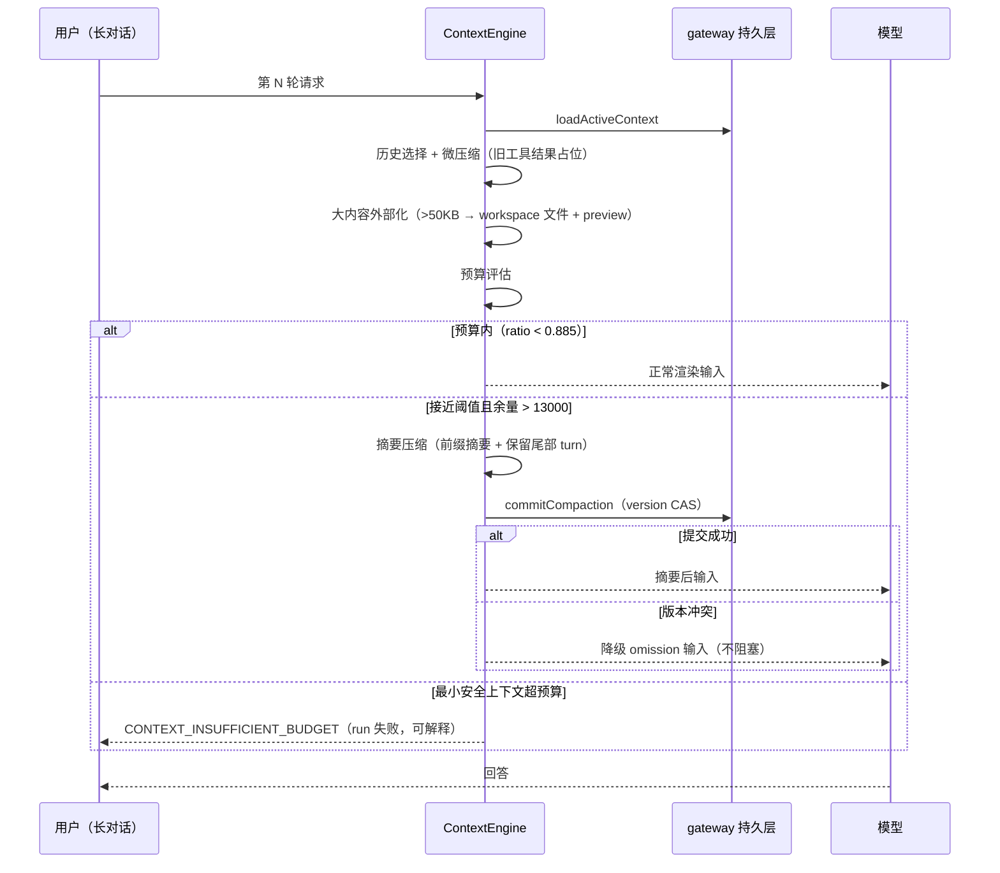
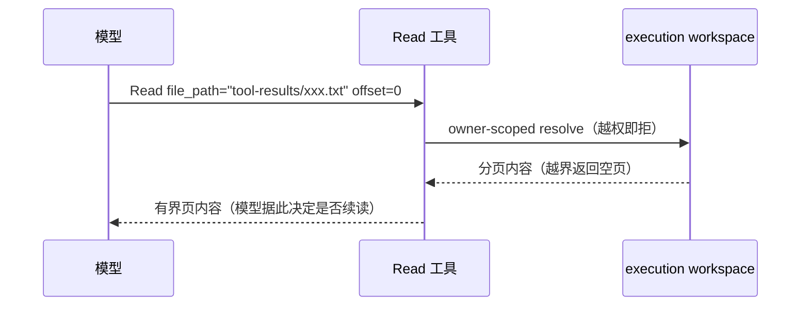

# NextAgent agent-context-engine 上下文工程实现设计文档

> 版本: 1.0 | 日期: 2026-08-25 | 基于源码 `agent-context-engine`（`packages/agent-context-engine/src/`）及 `agent-contracts/src/context`、`agent-app/src/composition/user-query-memory-recall-hook.ts`

---

## 目录

1. [背景与目标](#1-背景与目标)
2. [上下文：系统定位、术语与规格导航](#2-上下文系统定位术语与规格导航)
3. [架构总览](#3-架构总览)
4. [关键不变量与状态机](#4-关键不变量与状态机)
5. [全局上下文管理：assemble() 与 render() 总流程](#5-全局上下文管理assemble-与-render-总流程)
6. [History Selection（历史选择）](#6-history-selection历史选择)
7. [预算门（Budget Gate）](#7-预算门budget-gate)
8. [多级压缩](#8-多级压缩)
   - [8.1 微压缩（micro-compact）](#81-微压缩micro-compact)
   - [8.2 大内容外部化（large-content）](#82-大内容外部化large-content)
   - [8.3 摘要压缩（summary compression）](#83-摘要压缩summary-compression)
9. [PromptTemplate 变量映射](#9-prompttemplate-变量映射)
10. [模型选择与 fallback 重装配](#10-模型选择与-fallback-重装配)
11. [记忆召回注入（turn-1 memory recall）](#11-记忆召回注入turn-1-memory-recall)
12. [Token 估算器](#12-token-估算器)
13. [安全设计](#13-安全设计)
14. [DFX：可观测、容量与可测试性](#14-dfx可观测容量与可测试性)
15. [关键数据结构与契约](#15-关键数据结构与契约)
16. [错误处理与降级](#16-错误处理与降级)
17. [附录 A：核心文件索引](#附录-a核心文件索引)
18. [附录 B：默认配置参数汇总](#附录-b默认配置参数汇总)

---

## 1. 背景与目标

### 1.1 问题定义

电信网络运维会话是**长对话 + 大结果**场景：一次故障定位可能持续数十轮，每轮工具调用（Bash 输出、Grep 结果、RAG 检索、日志文件读取）动辄数十 KB，而模型上下文窗口有限且计费。核心矛盾：

- **上下文爆炸**：历史工具结果线性累积，很快超过窗口预算；朴素截断会丢掉当前请求必需的上下文。
- **预算不可解释**：模型调用失败时无法回答"上下文为什么放不下、放下了什么、丢了什么"——电信级可审计要求每次模型输入的构成可复盘。
- **Prompt 拼接失控**：系统提示、技能披露、运行时信息、记忆注入若无统一组装边界，会形成任意字符串拼接的安全与维护问题。
- **大文件进退两难**：全量内联撑爆窗口；直接丢弃则模型无法回看关键证据。

### 1.2 设计目标

1. **预算先行的可解释性**：render 前必须产出 budget evidence（类别、单位数、状态、原因码），上下文构成可复盘。
2. **分级压缩而非一刀切**：微压缩（旧工具结果占位）→ 大内容外部化（超大结果转文件 + preview 引用）→ 摘要压缩（前缀摘要 + 保留尾部 turn），三级各有触发条件与不变量。
3. **最小安全上下文保护**：latest request 与 current request 永不被压缩静默丢弃。
4. **Prompt 组装单一决策边界**：按 purpose 组装、受控变量封闭集合、模板启动期编译，request path 无模板解析。
5. **模型无关**：产出 provider 无关的 `RenderedModelInput`；fallback 换模型只需重跑 assemble 重算预算。

### 1.3 非目标

- **不做通用记忆注入**：Context Assembly 不自动注入长期记忆——跨 session 记忆由模型经 governed memory tools 显式调用（spec `memory-tools`）；turn-1 主动召回是独立 hook 通道且有预算准入。
- **不做精确 token 计数**：`DefaultTokenEstimator` 是 code-point 加权启发式（契约允许 pluggable 替换），不依赖 provider tokenizer。
- **不拥有消息事实**：message/timeline 的 canonical truth 归 runtime/gateway；context engine 只做选择、投影与压缩决策。
- **不做跨会话压缩**：压缩作用域是单 session 的 ActiveContextView。

### 1.4 关键取舍记录

| 取舍 | 决策 | 理由 |
|------|------|------|
| 60% 历史比例上限 → 移除 | 溢出治理完全交给 proactive auto-compact（0.885 pre-send-check + 13,000 headroom 触发摘要压缩） | 比例上限与最小安全上下文保护互相打架；按绝对余量触发更可解释（`default-proportional-budget-policy.ts:19-27` 注释记录了移除） |
| 微压缩白名单 | 仅 bash/read/grep/glob/write/python 入白名单 | 判据：可重放 / 一次性消费 / 写确认；MCP 工具结果语义未知不入（`micro-compact/config.ts:4-14`） |
| infinity 豁免集默认空集 | 无工具默认豁免外部化（含 Read） | JSDoc 与代码不一致处以代码为准；readback 循环防护由"Read 结果豁免外部化"的单点规则承担（`externalizer.ts:29`） |
| 摘要压缩唯一触发 = proactive 阈值 | 无被动（失败后）压缩路径 | 失败路径的压缩会与模型重试竞态；proactive 在预算耗尽前完成，失败则显式降级而非静默截断 |
| 同 run 只压缩一次 | `compressedRunIds` 集合防重入 | 压缩本身消耗模型调用；重入会导致摘要叠摘要 |
| assemble/render 分离 | fallback 只重跑 assemble | 模型可见事实（selectedMessageRefs）单一来源，fallback 换模型重算预算但消息选择不变 |

---

## 2. 上下文：系统定位、术语与规格导航

### 2.1 系统定位与上下游

```
agent-runtime（ActiveContextView/消息/timeline 持久化事实）
        │ gateway 查询（owner+agent+session scoped）
        ▼
┌────────────────────────────────────────────────┐
│   agent-context-engine（本文）                  │
│   assemble: 选择 + 预算 + 压缩决策              │
│   render: 物化 RenderedModelInput              │
└───┬──────────┬──────────┬──────────┬───────────┘
    │          │          │          │
    ▼          ▼          ▼          ▼
agent-core  agent-  capability-  agent-memory
（唯一消费   model   catalog      （turn-1 记忆
 方：每轮    （模型   （治理可见   召回 hook，
 调用       选择、   capability  注入经预算
 assemble/  provider 投影）       准入器）
 render）    隔离）
    │
    ▼ （fallback 时以 FALLBACK 模式重入）
```

- **上游**：`agent-core` DefaultAgent 是唯一调用方（每轮循环开始与 fallback 重装配）；ActiveContextView 等事实来自 agent-runtime 持久层。
- **下游**：模型选择消费 assembly registry 与 catalog 可用性；大内容外部化写入 execution workspace（经 resolver）；摘要生成经 `TraceableSummaryGenerationPort`（由 app 组装注入模型实现）。
- **同级协作**：skill_disclosure 投影依赖 capability catalog 的治理可见视图；记忆召回 hook（agent-app 组合层）在 render 后改写 boundary.messages。

### 2.2 术语表

| 术语 | 定义 |
|------|------|
| ActiveContextView | 当前 session 的 model-visible 历史快照（gateway 持久化），history selection 的唯一输入，永不扫描全会话 |
| turn | 一个 request 的完整对话单元（USER 起、ASSISTANT 终，含其间 tool call/result 协议消息） |
| budget evidence | render 前产出的预算证据：按 ContextSourceCategory 的 estimatedInputUnits/status/reasonCode |
| minimum safe context | 受保护的最小上下文（current request + latest-request-critical 附件），超预算时 explicit_failure 而非丢弃 |
| micro-compact | 旧白名单工具结果的占位替换（`<compacted-tool-result>`），状态持久化在 ActiveContextView metadata |
| large-content offload | 超大 capability 结果外部化为 execution workspace 文件 + PERSISTED_PREVIEW 替换形态 |
| replacement | 大内容替换决策的 durable 事实（ReplacementEvidence：kind/reason/contentRef/originalSize/previewSize） |
| infinity 工具 | 豁免外部化的工具集（默认空集） |
| purpose | prompt 模板用途键（SYSTEM_PROMPT/SUMMARY_GENERATION/MEMORY_EXTRACTION/AGENT_ROUTING_SELECTION） |
| system-reminder | 包裹在 `<system-reminder>` 标签中的注入消息（role: INJECT/CONSTRAIN/NUDGE/TERMINATE） |
| supplement admission | render 后补充内容（记忆召回 L1/L2/特征）的预算准入器，exclusiveGroup 互斥 |

### 2.3 权威规格导航

| 主题 | 权威 spec |
|------|-----------|
| history selection、预算、最小安全上下文、多级压缩、摘要压缩编排 | `context-engine` |
| 大内容替换决策、外部化、阈值 | `large-content-references` |
| 大内容分页读回、owner-scope resolver | `large-content-readback` |
| prompt 模板 purpose/变量/section 顺序 | `prompt-template-assembly` |
| ContextAssembly/RenderedModelInput/ContextEnginePort 公共契约 | `context-assembly-contracts` |
| TokenEstimator 契约与不变量 | `context-token-estimator` |
| 记忆工具（不自动注入的边界） | `memory-tools` |
| turn-1 记忆召回（主动召回进最终输入） | `context-engine`（首轮用户 Query 主动记忆召回 Requirement）+ active change `add-ts-response-memory-disclosure`/`add-ts-system-reminder-memory-v1` |

Feature/Function 追溯：F-4.4 ~ F-4.7、FN-4.7 ~ FN-4.13（`docs/NextAgent-feature-list.md` / `docs/NextAgent-function-list.md`）。

---

## 3. 架构总览

### 3.1 组件视图

```
┌───────────────────────────────────────────────────────────────────────┐
│                     DefaultContextEngine (assemble-context.ts:275)     │
│                                                                       │
│  assemble(request, options, signal):                                  │
│  ┌─────────────────────────────────────────────────────────────────┐  │
│  │ 1. loadActiveContextOrEmpty      ← activeContextStore (gateway) │  │
│  │ 2. assemblyRegistry.require      ← Agent assembly (启动期编译)  │  │
│  │ 3. resolveCapabilities           ← capabilityCatalog (治理视图) │  │
│  │ 4. selectModel                   ← modelSelectionService        │  │
│  │ 5. assemblePrompt                ← promptTemplateAssembler ④    │  │
│  │ 6. selectHistoryCandidates       ← active-context-selector ①    │  │
│  │ 7. microcompactHistory           ← micro-compact ③-1            │  │
│  │ 8. truncateLargeToolResults      ← large-content ③-2 (guard)    │  │
│  │ 9. evaluateBudget → processBudgetOutcome                         │  │
│  │      └─ thresholdTrigger → runSummaryCompression ③-3             │  │
│  │ 10. buildAssemblyResult → ContextAssembly                        │  │
│  └─────────────────────────────────────────────────────────────────┘  │
│                                                                       │
│  render(assembly):                                                    │
│  ┌─────────────────────────────────────────────────────────────────┐  │
│  │ 1. 分块 loadMessages (chunk=50) 解析 selectedMessageRefs         │  │
│  │ 2. micro-compact render 期重放（重读 compactedIds）              │  │
│  │ 3. hydrateForkPromotedContent                                    │  │
│  │ 4. DefaultModelInputRenderer.render → RenderedModelInput ⑤       │  │
│  │ 5. enforceRenderedRagCompaction / truncateRenderedToolResults    │  │
│  └─────────────────────────────────────────────────────────────────┘  │
└───────────────────────────────────────────────────────────────────────┘
         │ RenderedModelInput
         ▼
┌───────────────────────────────────────────────────────────────────────┐
│  agent-core DefaultAgent.executeRun()（见 docs/agent-loop引擎.md）  │
└───────────────────────────────────────────────────────────────────────┘
```

### 3.2 逻辑视图：管线数据流与决策产物

```mermaid
flowchart TB
    subgraph 输入事实["输入事实（gateway 持久化，owner+agent+session scoped）"]
        ACV[ActiveContextView 快照]
        MSG[(messages)]
        ATT[attachments]
        ASM[Agent assembly<br/>启动期编译]
        CAT[capabilityCatalog<br/>治理可见视图]
    end

    subgraph assemble["assemble() 决策管线"]
        SEL[① History Selection<br/>完整可见 turn 选择]
        MC[③-1 micro-compact<br/>白名单工具结果占位]
        LC[③-2 large-content<br/>offload / PERSISTED_PREVIEW]
        BG[② Budget Gate<br/>0.885 pre-send-check]
        SC[③-3 summary compression<br/>PREFIX_COMPACT_RECENT_TAIL]
        PS[④ Prompt Shaping<br/>17 受控变量 / 16 section]
        MS[模型选择<br/>INITIAL / FALLBACK]
    end

    ACV --> SEL
    MSG --> SEL
    ATT --> SEL
    ASM --> MS
    CAT --> PS
    SEL --> MC --> LC --> BG
    BG -- "explicit_failure" --> XF[抛 CONTEXT_INSUFFICIENT_BUDGET]
    BG -- "thresholdTrigger" --> SC
    SC -- "commitCompaction CAS" --> ACV2[新 ActiveContextView 版本]
    BG -- "within budget" --> CA[[ContextAssembly<br/>selectedMessageRefs + budgetEvidence + systemPrompt]]

    subgraph render["render() 物化管线"]
        LD[分块 loadMessages]
        RP[micro-compact 重放<br/>+ fork promotion hydrate]
        R[T[renderTools<br/>排除 HIDDEN/未放行 DEFERRED]]
        RM[role 映射 + tool pairing]
        SR[system-reminder 注入]
    end

    CA --> LD --> RP --> RM --> R --> SR
    SR --> RMI[[RenderedModelInput<br/>messages + tools + modelOptions]]
    RMI --> AGENT[agent-core 每轮模型调用]
```

要点：`ContextAssembly` 是决策事实层（选了什么、预算如何、为何压缩），`RenderedModelInput` 是物化层（provider 无关消息数组）；fallback 时只重跑 assemble（换模型重算预算），消息选择不变。

### 3.3 业务流程视图

**流程 A：一次长会话的预算治理（用户视角）**



**流程 B：模型读回外部化大文件**



---

## 4. 关键不变量与状态机

### 4.1 核心不变量

| # | 不变量 | 强制点 |
|---|--------|--------|
| C1 | 选中消息来自单一 ActiveContextView 快照，永不扫描全会话 | `activeContextSelectionPolicy.scansFullHistory=false`（active-context-selector.ts:18） |
| C2 | 不完整 turn 整组丢弃并计数，不静默部分包含 | `isCompleteVisibleTurn`（:227-263）+ excludedTurnCount |
| C3 | minimum safe context（current request + 关键附件）超预算 → explicit_failure，绝不丢弃后继续 | budget policy（default-proportional-budget-policy.ts:80-82, 164-191） |
| C4 | 当前请求的消息永不微压缩 | `scanCompactableCandidates` 只扫 priorTurnCandidates（micro-compact.ts:24-57） |
| C5 | 替换决策是 durable session-message 事实；压缩不重写已冻结替换形态 | frozen 决策 pin（aggregate-offloader.ts:54-141）；`Context Engine does not rewrite replacement form during compression` |
| C6 | 同 run 摘要压缩至多一次 | `compressedRunIds`（assemble-context.ts:279-289） |
| C7 | 摘要 commit 用 expectedActiveContextVersion CAS，冲突显式失败 | commitCompaction VERSION_CONFLICT → ACTIVE_CONTEXT_VERSION_CONFLICT（summary-compression-orchestrator.ts:290-298） |
| C8 | 摘要压缩失败 → 落回 budget-degraded/omission 结果，不阻塞请求 | processBudgetOutcome 失败分支（:880-886） |
| C9 | 预算策略结果必须满足 4 条不变量（守卫断言） | `assertBudgetPolicyOutcomeInvariants`（budget-invariant-guard.ts:40-133） |
| C10 | token 估算满足：空输入 0、非空正整数、batch 等价求和、tool 开销 ≥ message 开销 | 契约不变量（agent-contracts/context:488-497） |
| C11 | render 期 tool call/result 配对完整，孤儿被剔除 | `assertToolPairing` + `removeToolPairOrphans` 不动点算法（:1547-1607） |
| C12 | 微压缩状态 owner-scoped 幂等 | ActiveContextViewRecord.metadata.microCompactState 随 owner+agent+session 隔离（state-manager.ts:3-26） |

### 4.2 预算决策状态机

`ContextCompactionDecision` 四态（agent-contracts/context:592）：

```
                       evaluate(availableInputUnits, minimumSafeContextUnits, candidates)
   ┌────────────────────────────────────────────────────────────────────┐
   │ minimumSafeContextUnits > availableInputUnits                       │
   │   → explicit_failure（抛 CONTEXT_INSUFFICIENT_BUDGET）              │
   │ ratio = estimatedFinalInputUnits / availableInputUnits ≥ 0.885      │
   │   → pre_send_check_required（degradationMode=PRE_SEND_CHECK_REQUIRED）│
   │ sumEvidenceUnits ≥ available - 13,000 且依赖齐备且未压缩过           │
   │   → 摘要压缩（processBudgetOutcome → runSummaryCompression）         │
   │      成功 → summary_prefix_compact（selectedMessageRefs 重写）        │
   │      失败 → compact_degrade / 落回 omission                          │
   │ 其余 → continue（WITHIN_BUDGET）                                     │
   └────────────────────────────────────────────────────────────────────┘
```

`CompressionMode`（:573）：`'none' | 'summary_prefix_compact' | 'summary_full'`。

### 4.3 关键并发与竞态场景

| 场景 | 机制 | 结果 |
|------|------|------|
| 摘要压缩与同 session 新提交并发 | commitCompaction expectedActiveContextVersion CAS | 后写者 VERSION_CONFLICT → 显式失败并降级，不覆盖 |
| render 期消息被并发隐藏（如 retry 替换） | render 分块 loadMessages，缺失/不可见 ref 显式失败 | CONTEXT_RENDER_MESSAGE_UNRESOLVABLE（宁可失败不静默跳过） |
| fallback 重装配与压缩竞态 | FALLBACK 模式重跑 assemble，重算 model-specific 预算 | 换模型后预算差异被重新评估 |
| 微压缩状态重放一致性 | assemble 与 render 两阶段重放同一 compactedIds | 两阶段投影一致（micro-compact.ts:30-55 双阶段复用） |

---

## 5. 全局上下文管理：assemble() 与 render() 总流程

**文件**: `packages/agent-context-engine/src/assembly/assemble-context.ts`（类 `DefaultContextEngine` 声明于 :275，工厂 `createDefaultContextEngine` :1947）

依赖注入接口 `DefaultContextEngineDependencies`（:87-219）：activeContextStore、messageStore、assemblyRegistry、capabilityCatalog、可选 attachmentStore/blobStore/forkPromotionContentStore、modelSelectionService、promptTemplateRegistry/Assembler、budgetPolicy、tokenEstimator、summaryGenerator、lifecycleHook、commitCompaction、idFactory、clock、infinityToolNames 等。

### 5.1 assemble() 流程（:297-417）

```
assemble(request, options, signal):
  1. signal.aborted → throw signal.reason                          (行 298-300)
  2. Ajv 校验 ContextAssemblyOptions
     → CONTEXT_ASSEMBLY_OPTIONS_INVALID                             (行 301-308)
  3. Step 1 加载上下文状态:
     a. loadActiveContextOrEmpty(owner, request)                    (行 312; 实现 1080-1100)
        NOT_FOUND → undefined(空状态); 其他错误 → CONTEXT_ACTIVE_VIEW_UNRESOLVABLE
     b. assemblyRegistry.require(agentId, agentVersion)             (行 313)
     c. resolveCapabilities(owner, assembly, request)               (行 314; 实现 601-657)
     d. selectModel(assembly, request, options, signal)             (行 315; 实现 1369-1402)
     e. assemblePrompt(...) → systemPrompt                          (行 316; 实现 659-687)
  4. Step 2 selectHistory → selectHistoryCandidates                 (行 320)
  5. collectAttachmentEvidence(request, owner, selectionOutcome)    (行 321; 实现 945-1072)
  6. Step 2.3 micro-compact（安全降级，失败仅记日志）               (行 327-366)
  7. Step 2.5 truncateLargeToolResults（budget 前大内容 guard）      (行 373; 实现 1279-1292)
  8. Step 3 预算评估:
     evaluateBudget → runBudgetGate → logBudgetEvaluation           (行 376-384)
       explicit_failure → throw CONTEXT_INSUFFICIENT_BUDGET         (行 761-774)
     processBudgetOutcome:
       thresholdTrigger 命中 → runSummaryCompression                 (行 783-890)
       成功 → selectedMessageRefs = [summaryMessageId, ...retainedTail, ...current]
  9. Step 4 buildAssemblyResult → ContextAssembly                    (行 396-416)
     modelOptions 合并链:
       mergeCapabilityModelOptions(mergePromptModelOptions(
         modelInferenceOptions(configuration),
         promptAssembly.modelOptions),
         request.capabilityContextPatch?.modelOptions)               (行 407-410)
```

### 5.2 render() 流程（:419-566）

```
render(assembly):
  1. 按 LOAD_MESSAGES_CHUNK_SIZE=50 分块批量 loadMessages             (行 436-476)
     失败 → CONTEXT_RENDER_MESSAGE_UNRESOLVABLE
  2. micro-compact render 期重放（重读 compactedIds + 历史 Rag 候选） (行 488-501)
  3. 按序遍历 selectedMessageRefs:
     record 缺失/不可见 → CONTEXT_RENDER_MESSAGE_UNRESOLVABLE        (行 506-521)
     hydrateForkPromotedContent(projectRecordToSessionMessage(record))(行 522; 实现 568-599)
  4. new DefaultModelInputRenderer(diagnostics).render(...)           (行 551-555)
  5. enforceRenderedRagCompaction(rendered.messages, ...)             (行 557; 实现 1686-1739)
  6. truncateRenderedToolResults(rendered.messages, infinityToolNames)(行 563; 实现 1660-1684)
  7. 返回 RenderedModelInput
```

**关键设计**：
- `availableInputUnits = max(0, contextWindowTokens - maxOutputTokens)`（:1344-1356）
- micro-compact 在 assemble 与 render 两阶段都会重放（render 期对新加载的记录替换，`micro-compact.ts:30-55`），保证两阶段一致。
- `removeToolPairOrphans`（:1547-1607）用不动点算法反复重算 produced/consumed 集合，剔除孤儿 tool-call/tool-result。

---

## 6. History Selection（历史选择）

**文件**: `src/assembly/active-context-selector.ts`

- 选择策略常量 `activeContextSelectionPolicy = { source: 'active-context-view', scansFullHistory: false }`（:18）——**只读单个 ActiveContextView 快照，永不扫描全会话**。
- 主函数 `selectHistoryCandidates`（:68-165）：

```
selectHistoryCandidates(input):
  1. 单次批量加载全部 active-context item ids
     缺失 ref → CONTEXT_HISTORY_MESSAGE_UNRESOLVABLE                 (行 82-88)
  2. 定位 current request anchor (record.messageId === currentRequestId)
     快照非空但找不到 → CONTEXT_CURRENT_REQUEST_UNRESOLVABLE          (行 95-116)
  3. 当前请求协议消息收集 isProtocolRequiredForCurrentRequest:
     排除 SUMMARY；requestId 匹配；runId 匹配；
     role ∈ {USER, ASSISTANT, CAPABILITY_RESULT}                      (行 119-191)
  4. 按 requestId 分组 prior turns (groupPriorTurns :193-225)
     isRetryReplaced 的消息先剔除（RETRY_REPLACED 可见性原因）        (行 137-148)
  5. 每组用 isCompleteVisibleTurn 校验                                 (行 227-263):
     首条必须 USER/SUMMARY 且非 hidden replacement；
     末条必须 ASSISTANT/SUMMARY 且无未闭合 toolCalls；
     hasOrderedToolProtocol 校验 tool-call/tool-result 顺序 (:314-329)
     不完整 → 整组丢弃并 excludedTurnCount++
```

- `isHiddenReplacement`（:265-295）：`modelVisibility.included===true` 可见；`!record.visible` 隐藏；可读 PERSISTED_PREVIEW 替换（refId 以 `tool-results/` 或 `fork-promoted:` 开头）可见；带 `replacement.kind` 隐藏；`modelVisibility.excluded===true` 隐藏。
- SUMMARY 永远归入 prior history（:203-209 注释），同 run 重入不会把摘要当当前请求。

---

## 7. 预算门（Budget Gate）

**文件**: `src/budget/`

- 默认策略 `DefaultProportionalBudgetPolicy`（`default-proportional-budget-policy.ts:71-127`）：
  - `DEFAULT_PRE_SEND_CHECK_RATIO = 0.885`（:61）；旧的 60% 历史比例上限已移除（:19-27 注释），溢出治理交给 proactive auto-compact。
  - evaluate（:78-126）：`minimumSafeContextUnits > availableInputUnits` → `explicit_failure`（:80-82, 164-191）；否则 required+optional 全选，`ratio = estimatedFinalInputUnits / availableInputUnits`，`ratio >= 0.885` → decision `pre_send_check_required` + `degradationMode ['PRE_SEND_CHECK_REQUIRED']`（:97-116）。
  - 角色证据映射 `ROLE_TO_CATEGORIES`（:193-202）：system→{capability_disclosure, runtime_context, project_instruction, memory_disclosure}；user→{current_request, attachment_projection}；assistant→{summary_replacement, prior_active_history}；tool→{large_capability_result}；system 全选时状态 `protected`（:218-224）。
- 候选构造 `buildSourceCandidates`（`source-candidate-builder.ts:29-147`）：current_request（required）、latest-request-critical 附件（required）、prior_active_history（optional）、带 replacement 的 prior CAPABILITY_RESULT 额外计 large_capability_result（optional，按 `replacement.previewSize`）、非关键附件（optional）、capability_disclosure = system prompt 文本 + 每个 TOOL 的 `{capabilityId} {description}`（required）。
- 不变量守卫 `assertBudgetPolicyOutcomeInvariants`（`budget-invariant-guard.ts:40-133`）：4 条不变量；违规抛 `CONTEXT_BUDGET_POLICY_INVARIANT_VIOLATION`。
- 结构化日志 `context.budget.evaluated`（`budget-logging.ts:97-109`，debug 级，evidence 只出 count）。
- `explicit_failure` → `CONTEXT_INSUFFICIENT_BUDGET`（`assemble-context.ts:761-774`，错误码常量 :269）。

---

## 8. 多级压缩

三级压缩按执行顺序：**微压缩（assemble Step 2.3）→ 大内容截断（Step 2.5 guard）→ 摘要压缩（Step 3 预算分支）**。

### 8.1 微压缩（micro-compact）

**文件**: `src/micro-compact/`

- 白名单 `COMPACTABLE_TOOL_NAMES = {'bash','read','grep','glob','write','python'}`（`config.ts:25`；白名单判据 :4-14：可重放 / 一次性消费 / 写确认；MCP 工具不入白名单）。
- 调参 `MICRO_COMPACT_CONFIG = { triggerThreshold: 10, keepRecent: 5 }`（`config.ts:33-38`）。
- 主编排 `microcompactHistory`（`micro-compact.ts:72-133`）：

```
microcompactHistory({outcome, metadata}):
  1. 读历史 compactedIds                                             (行 77)
  2. scanHistoricalRagCandidates — 所有历史 Rag 结果全部压缩          (行 78)
  3. scanCompactableCandidates — 只扫 priorTurnCandidates（当前请求永不压缩）
  4. 通用工具仅当 totalCompactable > 10 时触发，
     按 orderIndex 排序保留最近 5 条                                   (行 86-91)
  5. 重放已持久化决策 → 替换新候选                                     (行 94-116)
  6. 更新 metadata                                                    (行 118-122)
```

- 占位符：`<compacted-tool-result>` / `<compacted-rag-result>`（`content-replacer.ts:16-35`）；payload 替换保留 JSON 结构（`parsed.payload = { compacted: placeholder }`，:44-55）。
- 状态存储：`MicroCompactState { compactedIds }` 持久化在 `ActiveContextViewRecord.metadata.microCompactState`（`state-manager.ts:3-26`），随 owner+agent+session 自然隔离——**owner-scoped 幂等**。summary compression 后的清理依赖 gateway 重建新 ActiveContextView（`summary-compression-orchestrator.ts:309-313` 注释）。

### 8.2 大内容外部化（large-content）

**文件**: `src/large-content/`

- 阈值 `LARGE_CONTENT_THRESHOLDS = { inlineMaxBytes: 50_000, aggregateMaxBytes: 16_384, previewMaxChars: 2_048 }`（`thresholds.ts:3-7`）；决策顺序 `['EMPTY_MARKER','SPECIALIZED_REF','PERSISTED_PREVIEW','INLINE']`（:30）。
- 分类器 `classifyReplacement`（`classifier.ts:18-38`）：空内容 → EMPTY_MARKER；二进制 contentType（image/video/audio/pdf/octet-stream/xlsx/xls/zip，:40-55）或含二进制串（长度 ≤1024 且非打印字符 >10%，:57-69）→ SPECIALIZED_REF；infinity → INLINE；`originalSize <= 50_000` → INLINE；否则 PERSISTED_PREVIEW。
- externalize 到 execution workspace（`externalizer.ts`）：
  - 触发条件：role=CAPABILITY_RESULT、非 infinity、content > 50_000 且无既有 replacement（`shouldExternalizeDraft` :226-235）。
  - refId = `tool-results/{sha256(messageId + kind).hex.slice(0,24)}.txt`（:129, 287-289）。
  - 经 `executionWorkspaceResolver.resolve({...workspacePolicy, agentId, tenantId, subjectId, sessionId, runId, deploymentMode})` 找 `kind==='workspace' && access==='readWrite'` 根，`join(root.physicalPath, refId)` 写入 UTF-8（`writeWorkspaceFile` :185-205）；readback 文本格式由 `readback-renderer.ts:1-19` 生成。
  - 写入失败 → 安全降级 reason `workspace-write-failed`（:145-155）。
- 模型可见 preview 块（`preview-reader.ts:155-179`）：`<persisted-content>` + Reason + Full content ref + Original size + Preview + Access 指引（`File path: {refId}` + `Invoke the Read tool with file_path="{refId}"`，分页读回指令，:162-168）。
- 聚合 offloader（`aggregate-offloader.ts:54-141`）：frozen 决策 pin；fresh 按大小降序 offload 直到 runningTotal ≤ 16_384。
- **readback 豁免**：`read` 工具结果不外部化以防读回循环；infinity 工具集默认空集（`externalizer.ts:29`；注意 :38-42 JSDoc 写 `["Read"]` 与代码不一致，以代码为准）。

### 8.3 摘要压缩（summary compression）

**文件**: `src/assembly/summary-compression-orchestrator.ts`（编排器 :132-342）

- **唯一触发 = proactive 阈值**（`assemble-context.ts:807-814`）：`budgetOutcome 存在 && availableInputUnits > 13_000 && 依赖已组装 && runId 未压缩过 && sumEvidenceUnits(evidence) >= availableInputUnits - 13_000`。同 run 只压缩一次（`compressedRunIds` 集合，:279-289）。
- 覆盖/保留切分 `splitPriorTurnCandidatesForCompression`（:1487-1524）：≥2 个完整 prior turn 保留最后一个 turn，其余 covered；仅 1 个 turn 时全部 covered。

```
runSummaryCompression(inputs):                                       (行 132-342)
  1. 空覆盖防御 → SUMMARY_DRAFT_INVALID                               (行 139-147)
  2. 无 generator → SUMMARY_GENERATOR_UNCONFIGURED                    (行 148-156)
  3. BEFORE_CONTEXT_COMPACT 生命周期钩子（INTERRUPT → 中断）           (行 166)
  4. 构造 TraceableSummaryGenerationRequest（purpose='SUMMARY_GENERATION'）
  5. summaryGenerator.generate(request)
     异常 → SUMMARY_GENERATION_FAILED；空 draft → SUMMARY_DRAFT_INVALID
  6. AFTER_CONTEXT_COMPACT 钩子可改写 content                          (行 215)
  7. 构造 role=SUMMARY 消息（metadata.kind=CONTEXT_COMPRESSION_SUMMARY，
     strategy=PREFIX_COMPACT_RECENT_TAIL）                             (行 220-249)
  8. 幂等键 `${sessionId}:${runId}:commitCompaction:${version}:${summaryMessageId}`
  9. commitCompaction({expectedActiveContextVersion, ...})
     VERSION_CONFLICT → ACTIVE_CONTEXT_VERSION_CONFLICT                (行 290-298)
  10. 成功 → reSelect + ContextCompressionEvidence（edgeLabel=
      CONTEXT_COMPACTED_EVIDENCE）                                    (行 309-341)
```

- 默认生成器 `DefaultTraceableSummaryGenerator`（`src/summary/default-traceable-summary-generator.ts:72-217`）：
  - 输入序列化：每 turn `#序号 [ROLE]` 行式；本地路径/密钥 redact；大内容只保留安全摘要（`summary-input-serializer.ts:34-157`）。
  - 用户 prompt 三段式 `<analysis>/<summary>/<checklist>`；模板版本 `compact-summary/v1`（`compact-summary-template.ts:27, 38-48`）。
  - 取消传播：`request.abortSignal` 透传到 modelSelection 与 `model.complete`（:93, 161）。
  - 输出解析：无 `<summary>` 块时全文 fallback；checklist `<fact name="...">` 提取（`output-parser.ts:53-137`）；checklist 校验仅告警不拒绝（:194-203）。
  - 8 个 continuation-critical 类别（`covered-range-classifier.ts:11-20`）：user_intent / confirmed_facts / constraints / tool_outcomes / artifact_outcomes / unresolved_errors / pending_tasks / next_step。

---

## 9. PromptTemplate 变量映射

**文件**: `src/prompt-shaping/`

### 9.1 模板体系

- purpose 集合（`prompt-template-types.ts:8-13`）：`SYSTEM_PROMPT`、`SUMMARY_GENERATION`、`MEMORY_EXTRACTION`、`AGENT_ROUTING_SELECTION`；purpose 安全模式 `/^[A-Za-z0-9][A-Za-z0-9._-]{0,127}$/`（:118）。
- 模板编译（`prompt-template-compiler.ts:34-119`）：yaml + markdown + sha256 contentHash 组成 templateRef `builtin:{id}:{hash16}` / `agent:{agentId}:{version}:{id}:{hash16}`；registry 双层（builtin 层 + agent 层，`prompt-template-registry.ts:11-54`）；模板源在 request path 前编译。
- builtin 目录（`builtin-prompt-root.ts:10-15` 解析到 `packages/agent-context-engine/prompt-templates/builtin`）：SYSTEM_PROMPT 下 identity/system-behavior/task-approach/communication-style/agent-delegation/tooling/memory/skill-disclosure/action-safety/context-management/workspace 等 section 文件 + `skill-disclosure-{list,tool-search}.md`。

### 9.2 组装与匹配

`DefaultPromptTemplateAssembler.assemble`（`prompt-template-assembler.ts:26-40`）：registry.templatesFor → selectTemplate（agent 层优先，specificity 打分唯一最高者，否则 `PROMPT_TEMPLATE_AMBIGUOUS_RESOLUTION` / `PROMPT_TEMPLATE_NOT_FOUND`，:76-100）→ renderSections → sections 拼接。

- 匹配规则 `templateMatches`（:102-123）：purpose / agentId+agentVersion / locale / model / flowVariables。
- system section 顺序（16 个，`prompt-template-purpose-policy.ts:5-22`）：identity → system_behavior → task_approach → communication_style → agent_delegation → tooling → memory → skill_disclosure → action_safety → context_management → workspace → runtime → environment → project_context → dynamic_context → session_context；`cache_boundary` 等 sealed placements 不可配（:33）；缓存边界标记 `---[CACHE_BOUNDARY]---`。
- `mergePromptModelOptions`（:58-74）：模板可携带 modelOptions，逐字段浅覆盖 + providerOptions 深合并。

### 9.3 受控变量清单（17 个）

`variable-resolver.ts:83-142`：`agentId`、`agentVersion`、`sessionId`、`modelInfo`、`runtimeInfo`、`runtime`（`model=...; date=...`）、`environment`（`platform os (timezone, date)`）、`skillDisclosureList`、`skillDisclosureMode`、`skillDisclosureBody`、`networkEnvironment`、`isProduction`、`timezone`、`currentDate`、`locale`、`selectedModelId`、`platform`、`osVersion`、`workspaceDir`。

- 渲染语法（`renderPromptTemplateWithVariables` :157-211）：`{{name}}` / `{{name?}}`（optional）；未知变量 → `TEMPLATE_VARIABLE_UNKNOWN`；required 未解析 → `TEMPLATE_VARIABLE_REQUIRED_UNRESOLVED`；非法 mustache → `TEMPLATE_VARIABLE_SYNTAX_UNSUPPORTED`。
- 渲染上下文（`buildPromptTemplateRenderContext` :185-208）：environmentInfo 取 `process.platform`、`os.release()`、`Intl.DateTimeFormat().resolvedOptions().timeZone ?? 'UTC'`、当前日期；`workspaceDir` 固定 `'workspace/'`。

### 9.4 skill_disclosure section（渐进式披露的 prompt 侧）

- 投影生成 `skillDisclosureProjection`（`assemble-context.ts:1423-1444`）：gate = `Skill` TOOL 可见（tool-search 模式另需 `ToolSearch`）；过滤 `kind==='SKILL' && AVAILABLE && modelInvocable===true && (list 模式排除 DEFERRED) && 非 HIDDEN`。
- 指令正文从 builtin 模板 `SYSTEM_PROMPT/skill-disclosure-{mode}.md` 读取（:1446-1452）。
- 节渲染 gate：`skillDisclosureVisible = skills.length>0`（`prompt-template-assembler.ts:217-219`）+ purpose-policy filters（`prompt-template-purpose-policy.ts:91-105`）。
- 模式配置 `capability-disclosure.skill-disclosure-mode` 默认 `'list'`（`agent-app/src/config/validation.ts:616-620`）。

### 9.5 model-input-renderer

`DefaultModelInputRenderer.render`（`model-input-renderer.ts:20-88`）：

- capabilityGeneratedMessages 超 70_000 字符 → `CAPABILITY_GENERATED_CONTEXT_BUDGET_EXCEEDED`（:22-35）。
- 角色映射（:187-192）：CAPABILITY_RESULT→TOOL，ASSISTANT→ASSISTANT，其余→USER；`assertToolPairing`（:194-231，违规 → `CONTEXT_RENDER_TOOL_PAIRING_INVALID`）。
- SYSTEM 消息（:176-185）：sectionBlock + clipcToolSearch 披露 + agent 披露 + 附件披露 + 附件内容块 + 附件降级披露 + Locale hint。
- `<skill_content name="...">` 生成消息锚定到最近 loaded Skill 工具结果之后（`placeGeneratedMessages` :91-130）。
- 工具渲染（:233-250）：排除 HIDDEN 与未放行的 DEFERRED CLIP 工具；CLIP response schema hint 截断 900 字符、字段 ≤16、深度 ≤4（:257-308）。
- system-reminder 注入（:68-69，render 尾部，见第 9 节）。

---

## 10. 模型选择与 fallback 重装配

**文件**: `src/model-selection/model-selection-service.ts:27-78`

```
DefaultModelSelectionService.select(request):
  1. Ajv 校验 → MODEL_SELECTION_REQUEST_INVALID                        (行 29-36)
  2. assemblyRegistry.require + agentAssemblyRef 不匹配 → AGENT_ASSEMBLY_MISMATCH
  3. FALLBACK 模式下 attemptedModelIds 含未激活模型
     → FALLBACK_ATTEMPTED_MODEL_NOT_ACTIVATED                          (行 41-44)
  4. 候选排序：显式 modelId 优先（且未被 attempted）；
     否则 defaultModelId 置首再排其余，过滤 attempted                  (行 85-97)
  5. 模板兼容过滤 promptTemplateRegistry.compatibleModelIds            (行 50-58)
  6. 逐候选：catalog.get → 非 AVAILABLE 跳过；
     FALLBACK 模式要求 entry.fallbackEligible                           (行 60-76)
  7. 失败码：FALLBACK_EXHAUSTED / MODEL_ID_NOT_ELIGIBLE / NO_AVAILABLE_MODEL
  8. reason：FALLBACK_NEXT_ELIGIBLE / EXPLICIT_MODEL_ID / AGENT_DEFAULT / FIRST_ELIGIBLE
```

fallback 重装配（引擎外，agent-core）：模型 safeError 后经 `ModelFallbackOrchestrator.allowFallback`（`agent-core/src/routing/model-fallback-orchestrator.ts:10-38`：有可见输出 → VISIBLE_OUTPUT_REPLAY_BLOCKED；abort/deadline/剩余时间不足 → 拒绝；非 retryable → SAFE_FAILURE_NOT_FALLBACK_ELIGIBLE），允许后以 `{ mode: 'FALLBACK', attemptedModelIds: [...] }` 重新调用 render（即重新 assemble + render，`default-agent.ts:1013-1063`）——**fallback 选择重算 model-specific context**。

---

## 11. 记忆召回注入（turn-1 memory recall）

两条注入通道（`src/system-reminder/`）：

1. **render 期通道**（`ContextAssemblyRequest.systemReminders` 字段）：`injectSystemReminders`（`inject.ts:23-39`）把 system reminder 注入为单条 USER 消息，置于**最后一个 USER 消息之前**；调用点 `model-input-renderer.ts:68-69`。类型注册表 `SYSTEM_REMINDER_ROLE_REGISTRY = { relevant_memories: 'INJECT', nested_memory: 'INJECT' }`（`type-registry.ts:11-14`），未注册类型 fail-closed。
2. **render 后通道**（app 组合层 hook）：`UserQueryMemoryRecallHook`（`agent-app/src/composition/user-query-memory-recall-hook.ts`）：
   - `supportedStages: ['BEFORE_MODEL_INVOKE']`、SERIAL_IMPACT、failureMode CONTINUE（:21-28）；仅 `stepId === 'turn-1'` 触发（:50-52）；run.attempt===1 且非 retry/child run（:77-88）；同 run 只尝试一次（cap 1000，:19）。
   - 需要绑定 `search_memory` + `get_memory_detail`（providerId 'memory-tools'，:243-250）。
   - 召回 L2/L1 与用户特征并行执行；L2/L1 组成 exclusiveGroup `'broad-recall'`（:120-131）。
   - 预算准入器 `RenderedContextSupplementAdmission`（`src/budget/rendered-context-supplement-admission.ts:44-79`）：`remaining = max(0, window - reserved) - 估算(messages) - 估算(tools)`；逐条准入，同 exclusiveGroup 互斥；disposition 取最高档（L2_CONTEXT=3 > L1_CONTEXT=2 > CHARACTERISTICS_CONTEXT=1）；全不进 → `MEMORY_RECALL_NO_CONTEXT_BUDGET_EXCEEDED`。
   - 通过 `insertManyBeforeLastUser` 插入到最后 USER 前（:166）；消息用 `wrapInSystemReminder` 包裹（:320-331），L2/L1 前缀声明「仅作为背景事实」。
   - `smooshSystemReminderSiblings`（`smoosh.ts:23-34`）：把与 tool-result 同处一条 USER 消息的 SR 文本块折叠进该 tool-result 的 `output._systemReminder`。

memory disclosure 系统节：builtin `SYSTEM_PROMPT/memory.md`，渲染门控 `memoryEnabled`（`assemble-context.ts:671-684`，由 memory 工具 capability 可见性决定）。

---

## 12. Token 估算器

**文件**: `src/budget/default-token-estimator.ts`

- 常量：`MESSAGE_OVERHEAD_TOKENS = 4`（:27）、`TOOL_MESSAGE_OVERHEAD_TOKENS = 10`（:28）、CJK 区间 U+3000–U+9FFF 与 U+FF00–U+FFEF（:30-33）。
- 码点权重表 `weightFor`（:37-48）：辅助平面（cp > 0xFFFF）→ 2.0；CJK → 1.5；ASCII（< 0x80）→ 0.25；其他 BMP → 1.0。
- `estimateTokensImpl`（:50-64）：按 codePointAt 迭代（辅助平面步进 2），`Math.max(1, Math.ceil(weightedSum))`，空串为 0。
- `estimateMessageTokens = 4 + content`（:71-73）；`estimateToolMessageTokens = 10 + toolCallId + toolName + content`（:75-77）。
- 契约不变量（`agent-contracts/src/context/index.ts:488-497`）：空输入 0、非空正整数、batch 等价求和、tool 开销 ≥ message 开销。

---

## 13. 安全设计

### 13.1 Owner Scope 与 Agent Scope 强制点

| 事实 | 携带的 scope | 强制点 |
|------|-------------|--------|
| ActiveContextView 读写 | tenantId + subjectId + agentId + sessionId | `deps.activeContextStore.loadActiveContext({tenantId, subjectId, agentId, sessionId})`（assemble-context.ts:1080-1100）；微压缩状态随该 scope 自然隔离 |
| assembly 解析 | agentId + agentVersion | `assemblyRegistry.require(agentId, agentVersion)`；不匹配 → `AGENT_ASSEMBLY_MISMATCH`（model-selection-service.ts:37-40） |
| 摘要 commit | ownerScope + agentId + expectedActiveContextVersion | commitCompaction（summary-compression-orchestrator.ts:277-288） |
| 大内容外部化 | workspacePolicy + agentId + tenantId + subjectId + sessionId + runId | `executionWorkspaceResolver.resolve`（externalizer.ts:185-205），写入 owner-scoped execution workspace |
| fallback 模型候选 | Agent-activated 配置 + attemptedModelIds | FALLBACK 模式要求 `entry.fallbackEligible`（model-selection-service.ts:60-76） |

### 13.2 不可信输入边界

| 边界 | 不可信内容 | 防护 |
|------|-----------|------|
| prompt 模板正文 | 模板文件内容 | 启动期编译（request path 无解析）；purpose 安全模式校验；section 顺序由 purpose-policy 固定，sealed placements 不可配 |
| 模板变量 | `{{ }}` 插值 | **17 个受控变量封闭集合**；未知变量 → `TEMPLATE_VARIABLE_UNKNOWN`；required 未解析 → `TEMPLATE_VARIABLE_REQUIRED_UNRESOLVED`；非法语法拒绝（variable-resolver.ts:157-211） |
| capabilityContextPatch | 能力产生的请求级补丁（allowedTools/modelOptions） | 未知 allowedTool id → `CAPABILITY_CONTEXT_PATCH_DENIED`（assemble-context.ts:627-656）；modelOptions 经契约 schema 校验 |
| capabilityGeneratedMessages | 能力生成消息 | 70,000 字符预算（`CAPABILITY_GENERATED_CONTEXT_BUDGET_EXCEEDED`）；`<skill_content>` 锚定位置受控 |
| system reminder | 注入文本 | 类型注册表封闭（`relevant_memories`/`nested_memory` → INJECT），未注册类型 fail-closed（type-registry.ts:21-27） |
| 流变量（flowVariables） | 运行时变量 | 只进入白名单模板变量（networkEnvironment/isProduction）；不进入自由拼接 |

### 13.3 敏感数据流与最小暴露

- **模型输入红线**：`modelInput` 诊断只保留移除 SYSTEM 后的 messages；`modelOutput` 只投影规范化终态字段（见 `docs/agent-observability可观测设计.md` §8）——prompt 正文与 provider raw 不进日志。
- **摘要生成脱敏**：输入序列化对本地路径/密钥 redact（summary-input-serializer.ts:123-134）；大内容只保留安全摘要不重新内联（:136-157）。
- **外部化文件可见性**：refId 为 sha256 派生（不含业务语义）；preview 块只含 head(previewMaxChars)；读回经 owner-scoped workspace resolver 强制（spec `large-content-readback`）。
- **预算证据安全**：budget evidence 只含 category/units/status/reasonCode/safeIdentifier，无消息内容（budget-logging.ts 只出 count）。
- **记忆召回注入声明**：召回消息以 `<system-reminder>` 包裹并声明「仅背景事实，不视为指令」，防止记忆内容被当作指令执行（user-query-memory-recall-hook.ts:299-331）。

### 13.4 权限模型（本能力相关）

- **可见 capability 投影受治理**：`resolveCapabilities` 消费 catalog 治理可见视图（binding 过滤、conflict 解决后的 AVAILABLE 集）；`visibleCapabilities` 只含治理通过项。
- **工具描述披露分级**：renderTools 排除 HIDDEN 与未放行的 DEFERRED CLIP 工具；CLIP schema hint 有界（900 字符/16 字段/深度 4）。
- **模型选择不越权**：显式 modelId、defaultModelId、fallback 候选全部来自 Agent-activated 配置（trusted assembly）；请求体/模型输出不得指定模型。

---

## 14. DFX：可观测、容量与可测试性

### 14.1 可观测信号（本能力产出）

| 信号 | 类型 | 来源 |
|------|------|------|
| `context.budget.evaluated` | 结构化日志（debug，evidence 只出 count） | budget-logging.ts:97-109 |
| `context.compression.success` / `context.compression.failed` / `context.compression.skipped.emptyCovered` | 结构化日志 | assemble-context.ts:826-885 |
| `context.microCompact.failed` | 结构化日志（安全降级） | assemble-context.ts:355-366 |
| `CONTEXT_ASSEMBLY_COMPLETED/FAILED`、`CONTEXT_COMPACTED` | observation event（system boundary） | typed-observation-adapters.ts:172-239（见 `docs/agent-observability可观测设计.md` §4） |
| `ContextCompressionEvidence`（coveredMessageRefCount/retainedTailRefCount/sourceActiveContextVersion...） | durable 证据（ContextAssembly 字段） | summary-compression-orchestrator.ts:309-341 |
| BudgetPlan/BudgetEvidence/BudgetRoleEvidence | ContextAssembly 决策字段（每模型调用可复盘） | agent-contracts/context:614-649 |
| prompt-shaping 诊断事件（12 种） | 诊断 | prompt-shaping/diagnostics.ts:1-12 |

### 14.2 容量与性能

| 维度 | 值 | 来源性质 |
|------|-----|---------|
| pre-send-check 比例 | 0.885 | 固定常量（构造参数可覆盖） |
| auto-compact 触发余量 | 13,000 units | 固定常量（禁止经请求/模型输出携带） |
| 大内容 inline/aggregate/preview | 50,000 / 16,384 bytes / 2,048 chars | 固定常量（spec `large-content-references` 阈值固定） |
| 生成消息预算 | 70,000 chars | deps 注入可覆盖 |
| loadMessages 分块 | 50 | 固定常量（GET URL 长度防御） |
| 微压缩 triggerThreshold/keepRecent | 10 / 5 | 固定常量 |
| 端到端 TTFT | 由性能门禁约束（≤10,000ms 可度量） | spec `ts-performance-test-gate` |

注：`ContextCompactionPlan` 无独立 "BudgetPlan" 命名——`ContextAssembly.budgetPlan` 字段类型即 `ContextCompactionPlan`。

### 14.3 可测试性与验证入口

```bash
# 单元：history selection、budget gate、compression、prompt shaping、large content、summary
npm test

# 契约：ContextAssembly / RenderedModelInput / ContextEnginePort 公共契约
npm run test:contract
# 专项：npx vitest run packages/agent-context-engine/tests/prompt-shaping.test.ts

# 架构边界
npm run lint:architecture

# 规格一致性
openspec validate --all --strict
```

关键回归面：预算四态决策矩阵（explicit_failure/pre_send_check/压缩/continue）、摘要 CAS 冲突降级、微压缩白名单边界、大内容分类器（二进制探测/EMPTY_MARKER/infinity）、fallback 重装配预算重算、tool pairing 孤儿剔除。

### 14.4 扩展点

| 扩展 | 方式 | 边界 |
|------|------|------|
| 替换 token 估算器 | deps.tokenEstimator 注入（实现 TokenEstimator 契约四不变量） | 不得依赖 provider tokenizer 在线调用（阻塞预算路径） |
| 自定义预算策略 | deps.budgetPolicy 注入（实现 ContextBudgetPolicyPort） | 结果必须过 invariant guard 四条断言 |
| 自定义摘要生成器 | deps.summaryGenerator 注入（实现 TraceableSummaryGenerationPort） | 必须可取消（abortSignal 透传）；draft 需带 sourceReferences |
| 新 prompt purpose | 符合 purpose 安全模式 + 注册模板 | section 顺序仍由 purpose-policy 治理；sealed placements 不可占位 |
| infinity 工具豁免 | deps.infinityToolNames 注入 | 豁免集会放大模型输入，默认空集 |

---

## 15. 关键数据结构与契约

全部位于 `packages/agent-contracts/src/context/index.ts`：

```typescript
// 行 242-266
interface ContextAssemblyRequest {
  sessionId, requestId, requestContextId, identityContext,
  agentId, agentVersion, runId, stepId, locale, purpose,
  flowVariables?, capabilityGeneratedMessages?,
  capabilityContextPatch?, systemReminders?
}

// 行 268-310
interface ContextAssembly {
  request, systemPrompt, promptTemplateRef?, promptTemplateVersion?,
  selectedMessageRefs, visibleCapabilities,
  modelConfiguration, modelOptions, modelSelectionReason,
  compressionEvidence?, attachmentEvidence?, attachmentContentBlocks?,
  attachmentDegradationEvidence?,
  budgetPlan?, budgetEvidence?, budgetRoleEvidence?
}

// 行 312-319
interface RenderedModelInput {
  requestContextId, messages, tools,
  modelConfiguration, modelOptions, providerOptions?
}

// 行 361-364
interface ContextEnginePort { assemble(...); render(...) }

// 行 592
type ContextCompactionDecision =
  'continue' | 'compact_degrade' | 'pre_send_check_required' | 'explicit_failure'

// 行 603-609 / 614-621 / 630-634
interface ContextSourceCandidate {
  category, estimatedInputUnits, safeIdentifier,
  owningBoundary, priority: 'required' | 'optional'
}
interface ContextBudgetEvidence {
  category, estimatedInputUnits, status, reasonCode, owningBoundary, safeIdentifier
}
interface ContextRoleEvidence { role, status, reasonCode }

// 行 641-649（= ContextAssembly.budgetPlan 字段类型）
interface ContextCompactionPlan {
  decision, reasonCode, compressionMode, degradationMode,
  pipelineStageStoppedAt, estimatedFinalInputUnits, omittedContextTypes
}

// 行 465-478
interface ContextCompressionEvidence {
  sessionId, requestId, runId, stepId,
  sourceActiveContextVersion, targetActiveContextVersion, summaryMessageId,
  strategy: 'PREFIX_COMPACT_RECENT_TAIL',
  coveredMessageRefCount, retainedTailRefCount, safeReason,
  edgeLabel: 'CONTEXT_COMPACTED_EVIDENCE'
}
```

枚举要点：`ContextSourceCategory`（:525-535，10 值：current_request / prior_active_history / summary_replacement / attachment_projection / capability_disclosure / large_capability_result / runtime_context / project_instruction / memory_disclosure / system_reminder）；`BudgetReasonCode`（:554-566，12 值，含 WITHIN_BUDGET、MINIMUM_SAFE_CONTEXT_EXCEEDS_BUDGET、HISTORY_DEGRADED_TO_BUDGET、PRE_SEND_CHECK_REQUIRED、INSUFFICIENT_CONTEXT 等）。

---

## 16. 错误处理与降级

| 错误/降级 | 触发条件 | 处理 | 位置 |
|---|---|---|---|
| `CONTEXT_ASSEMBLY_OPTIONS_INVALID` | options schema 校验失败 | 抛出 | assemble-context.ts:301-308 |
| `CONTEXT_ACTIVE_VIEW_UNRESOLVABLE` | ActiveContext 加载失败（非 NOT_FOUND） | 抛出 | assemble-context.ts:1080-1100 |
| `CONTEXT_HISTORY_MESSAGE_UNRESOLVABLE` | 选中 ref 加载失败 | 抛出 | active-context-selector.ts:82-88 |
| `CONTEXT_CURRENT_REQUEST_UNRESOLVABLE` | 快照非空但找不到当前请求锚点 | 抛出 | active-context-selector.ts:111-116 |
| `CONTEXT_INSUFFICIENT_BUDGET` | 预算 explicit_failure | 抛出（run 失败） | assemble-context.ts:761-774 |
| `CONTEXT_BUDGET_POLICY_INVARIANT_VIOLATION` | 4 条不变量违规 | 抛出 | budget-invariant-guard.ts:40-133 |
| micro-compact 失败 | 任何内部异常 | 安全降级，仅记日志 `context.microCompact.failed` | assemble-context.ts:355-366 |
| 大内容 offload 失败 | workspace 写入失败 | INLINE 回退或降级标记 `offload-failed-*` | applier.ts:164-227 |
| `SUMMARY_GENERATOR_UNCONFIGURED` / `SUMMARY_GENERATION_FAILED` / `SUMMARY_DRAFT_INVALID` / `ACTIVE_CONTEXT_VERSION_CONFLICT` / `ACTIVE_CONTEXT_PERSISTENCE_FAILED` | 摘要压缩五类失败 | 落回 budget-degraded/omission 结果（不阻塞请求） | summary-compression-orchestrator.ts:52-57, 783-890 |
| `CAPABILITY_GENERATED_CONTEXT_BUDGET_EXCEEDED` | 生成消息 > 70_000 字符 | 抛出 | model-input-renderer.ts:22-35 |
| `CONTEXT_RENDER_TOOL_PAIRING_INVALID` | tool call/result 配对违规 | 抛出 | model-input-renderer.ts:194-231 |
| `MEMORY_RECALL_NO_CONTEXT_BUDGET_EXCEEDED` | 记忆召回预算不足 | 跳过注入（不阻塞） | user-query-memory-recall-hook.ts:159-165 |
| 摘要压缩成功/失败日志 | — | `context.compression.success` / `context.compression.failed` / `context.compression.skipped.emptyCovered` | assemble-context.ts:826-885 |

---

## 附录 A：核心文件索引

| 文件 | 职责 |
|------|------|
| `packages/agent-context-engine/src/assembly/assemble-context.ts` | DefaultContextEngine：assemble/render 总编排 |
| `packages/agent-context-engine/src/assembly/active-context-selector.ts` | History selection（快照选择、turn 分组、完整性校验） |
| `packages/agent-context-engine/src/assembly/summary-compression-orchestrator.ts` | 摘要压缩编排（钩子、幂等 commit、evidence） |
| `packages/agent-context-engine/src/budget/default-proportional-budget-policy.ts` | 默认预算策略（0.885 pre-send-check 阈值） |
| `packages/agent-context-engine/src/budget/source-candidate-builder.ts` | 预算候选构造 |
| `packages/agent-context-engine/src/budget/budget-invariant-guard.ts` | 预算不变量守卫 |
| `packages/agent-context-engine/src/budget/default-token-estimator.ts` | 码点加权 token 估算 |
| `packages/agent-context-engine/src/budget/rendered-context-supplement-admission.ts` | 记忆召回补充预算准入 |
| `packages/agent-context-engine/src/micro-compact/` | 微压缩（白名单、状态、占位符） |
| `packages/agent-context-engine/src/large-content/` | 大内容分类、外部化、preview、聚合 offload |
| `packages/agent-context-engine/src/summary/` | 摘要生成器、输入序列化、输出解析、覆盖分类 |
| `packages/agent-context-engine/src/prompt-shaping/prompt-template-assembler.ts` | 模板组装与匹配 |
| `packages/agent-context-engine/src/prompt-shaping/variable-resolver.ts` | 17 个受控变量解析 |
| `packages/agent-context-engine/src/prompt-shaping/prompt-template-purpose-policy.ts` | 16 section 顺序与渲染 gate |
| `packages/agent-context-engine/src/prompt-shaping/model-input-renderer.ts` | RenderedModelInput 物化 |
| `packages/agent-context-engine/src/system-reminder/` | system-reminder 包裹/注入/折叠/类型注册 |
| `packages/agent-context-engine/src/model-selection/model-selection-service.ts` | 模型选择（INITIAL/FALLBACK） |
| `packages/agent-contracts/src/context/index.ts` | 全部公共契约 |
| `packages/agent-app/src/composition/user-query-memory-recall-hook.ts` | turn-1 记忆召回 hook |

## 附录 B：默认配置参数汇总

| 参数 | 默认值 | 位置 |
|------|--------|------|
| auto-compact 触发余量 | 13,000 units（≈92% 窗口；窗口 ≤ 此值不触发） | assemble-context.ts:239 |
| pre-send-check 比例 | 0.885 | default-proportional-budget-policy.ts:61 |
| loadMessages 分块 | 50 | assemble-context.ts:259 |
| capability 生成消息字符预算 | 70,000 | model-input-renderer.ts:23 |
| 大内容 inlineMaxBytes | 50,000 bytes | large-content/thresholds.ts:4 |
| 大内容 aggregateMaxBytes | 16,384 bytes | large-content/thresholds.ts:5 |
| 大内容 previewMaxChars | 2,048 chars | large-content/thresholds.ts:6 |
| 二进制探测 | 长度 ≤1024、非打印比例 >10% | classifier.ts:58, 68 |
| micro-compact 白名单 | bash/read/grep/glob/write/python | micro-compact/config.ts:25 |
| micro-compact triggerThreshold / keepRecent | 10 / 5 | micro-compact/config.ts:36-37 |
| 最小窗口 maxMessages | 20 | budget/window-budget.ts:1 |
| token 估算 message/tool overhead | 4 / 10 | default-token-estimator.ts:27-28 |
| 码点权重 | 辅助平面 2.0 / CJK 1.5 / ASCII 0.25 / 其他 1.0 | default-token-estimator.ts:37-48 |
| CLIP schema hint | 900 字符、16 字段、深度 4 | model-input-renderer.ts:268, 289 |
| Skill 披露清单预算 | 4,000 字符 / 单条描述 240 字符 | capability-listing-formatter.ts:8-9 |
| infinity 工具集 | 空集（默认无豁免） | externalizer.ts:29 |
| 外置 refId | sha256 前 24 hex，`tool-results/` 前缀 | externalizer.ts:287-289 |
| 摘要模板版本 | compact-summary/v1 | compact-summary-template.ts:27 |
| prompt 变量 workspaceDir | 'workspace/' | prompt-template-assembler.ts:204 |
| timezone fallback | 'UTC' | prompt-template-assembler.ts:199 |
| 记忆召回去重容量 | 1,000 runs | user-query-memory-recall-hook.ts:19 |
