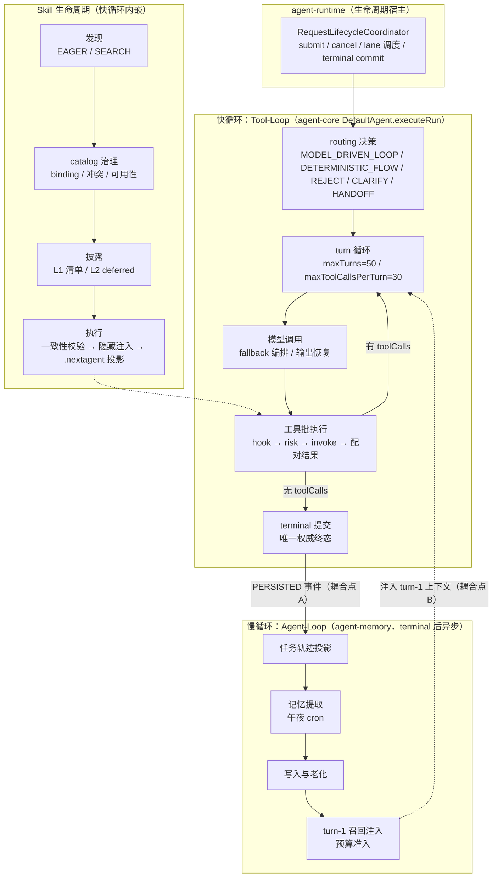
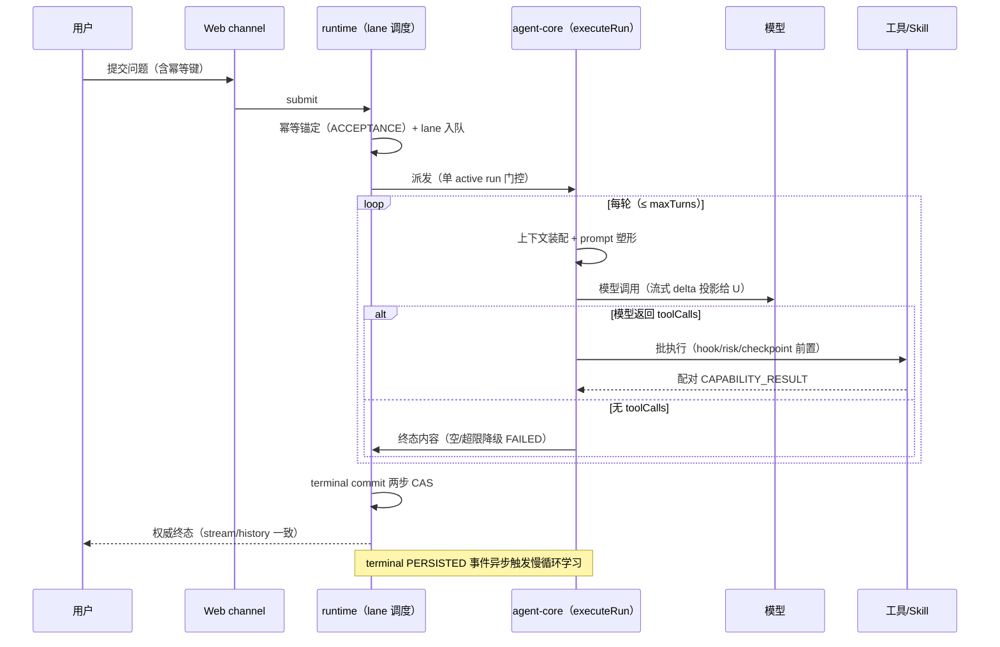
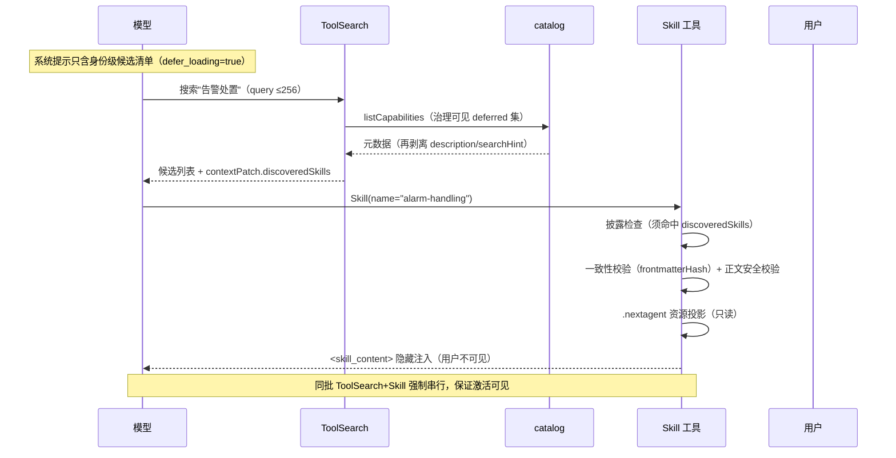

# NextAgent agent-loop 引擎实现设计文档

> 版本: 1.1 | 日期: 2026-08-25 | 合并自 `agent-core主循环.md`（v1.0，Skill 的选择、执行与渐进式加载）与 `agent-loop-design.md`（v1.0，2026-08-17，主循环全景与记忆学习慢循环）
> 基于源码 `agent-core`、`agent-runtime`、`agent-memory`、`agent-capability`（skills/catalog/builtins/skillhub）、`agent-context-engine` 及 `docs/agent-loop.html`
>
> 相关文档：[agent-context-engine上下文工程](./agent-context-engine上下文工程.md)、[agent-workflow执行引擎](./agent-workflow执行引擎.md)、[agent-capability工具体系](./agent-capability工具体系.md)、[agent-runtime任务控制恢复](./agent-runtime任务控制恢复.md)、[agent-observability可观测](./agent-observability可观测设计.md)。本文覆盖 agent-loop 引擎全景：主循环（Tool-Loop 快循环）、Skill 的选择/执行/渐进式加载、记忆学习慢循环（Agent-Loop）与两层循环耦合。

---

## 目录

1. [背景与目标](#1-背景与目标)
2. [上下文：系统定位、术语与规格导航](#2-上下文系统定位术语与规格导航)
3. [架构总览](#3-架构总览)
4. [关键不变量与状态机](#4-关键不变量与状态机)
5. [Skill 发现：五类来源与 Discovery 工厂](#5-skill-发现五类来源与-discovery-工厂)
6. [SKILL.md Manifest 解析](#6-skillmd-manifest-解析)
7. [Catalog 治理：可见视图与冲突解决](#7-catalog-治理可见视图与冲突解决)
8. [渐进式加载：分级加载模型](#8-渐进式加载分级加载模型)
9. [Skill 执行：Skill tool 内联注入](#9-skill-执行skill-tool-内联注入)
10. [Skill 资源受控访问（.nextagent 投影）](#10-skill-资源受控访问nextagent-投影)
11. [定向 Skill 路由（$skill: 指令）](#11-定向-skill-路由skill-指令)
12. [非 agentic Skill：ApiCall 直连分派](#12-非-agentic-skillapicall-直连分派)
13. [安全设计](#13-安全设计)
14. [DFX：可观测、容量与可测试性](#14-dfx可观测容量与可测试性)
15. [Tool-Loop：任务执行快循环](#15-tool-loop任务执行快循环)
16. [Agent-Loop：记忆学习慢循环](#16-agent-loop记忆学习慢循环)
17. [两层循环耦合](#17-两层循环耦合)
18. [生命周期钩子](#18-生命周期钩子)
19. [关键数据结构与契约](#19-关键数据结构与契约)
20. [错误处理与降级](#20-错误处理与降级)
21. [并发与取消](#21-并发与取消)
22. [关键数据结构与契约（Skill 侧）](#22-关键数据结构与契约skill-侧)
23. [错误处理与降级（Skill 侧）](#23-错误处理与降级skill-侧)
- [附录 A：核心文件索引](#附录-a核心文件索引)
- [附录 B：默认配置参数汇总](#附录-b默认配置参数汇总)

---
## 1. 背景与目标

### 1.1 问题定义

Skill 体系要解决的核心矛盾是**"能力规模 × 提示预算 × 治理安全"三者的张力**：

- **能力规模**：电信运维领域知识（告警处置、割接流程、参数核查）以 Skill（SKILL.md + 资源文件）形式沉淀，跨 builtin/system/agent-owned/SkillHub 四类来源，规模可达数百上千；全部内联进系统提示不可行。
- **提示预算**：每个 Skill 正文可能数万字节；描述符全量曝光会挤占上下文预算（见 `docs/agent-context-engine上下文工程.md` 预算门）。
- **治理安全**：Skill 是不可信内容（作者写的正文、目录里的资源文件）；"发现即授权"会导致同名遮蔽、越权工具、路径逃逸、SkillHub 恶意包等风险。

配套诉求：**定向直达**（`$skill:xxx` 指令跳过模型搜索直接执行）、**非 agentic 分派**（纯 API 调用 Skill 不进模型 loop）、**运行时补货**（SkillHub 缺失 Skill 在 run 内获取）。

### 1.2 设计目标

1. **发现 ≠ 授权**：所有 Skill descriptor 必须经 catalog 治理（binding 过滤、冲突解决、可用性判定）后才对模型可见。
2. **渐进式加载四级递进**：L0 catalog 元数据 → L1 prompt 摘要披露 → L2 ToolSearch request-local 激活 → L3 SkillHub 运行时获取；每级只加载上一级的增量。
3. **正文注入隐藏化**：inline 正文作为模型可见、用户隐藏的单一注入（`<skill_content>` 包裹），不产生对话可见消息。
4. **一致性可验证**：frontmatterHash + skillVersion 锚定源事实，正文加载时校验，源变更即拒绝。
5. **资源访问两层校验**：源侧（发现期路径/目录白名单）+ 工具侧（模型访问期 root/manifest 校验），`.nextagent` 投影只读。

### 1.3 非目标

- **不做 Skill fork 执行**：`context: fork` 一律拒绝（`SKILL_CONTEXT_UNSUPPORTED`）；frontmatter `agent` 字段仅声明性（运行时无 fork 子会话执行实现）。
- **不拥有工具执行边界**：Skill tool 经统一 `CapabilityInvocationPort`（见 `docs/agent-capability工具体系.md` §6），无特殊路径。
- **不做 Skill 热更新通知**：源变更在下次加载时通过一致性校验失败暴露（`SKILL_SOURCE_CHANGED`），无主动失效推送。
- **ToolSearch 不做语义检索**：keyword/自然语言匹配基于元数据打分（relevanceScore），无向量检索。

### 1.4 关键取舍记录

| 取舍 | 决策 | 理由 |
|------|------|------|
| 同 scope 重复 → 全部 REJECT（而非先到先得） | conflict-resolution.ts:21-29 | 无稳定 source-fact 身份证明时无法裁决，宁可全部不可见并留证据，避免"加载顺序决定行为" |
| 治理优先级 agent-owned(2) > builtin(3) > system-local(4) | catalog.ts:523-540 | Agent 作者对同名 Skill 的定制应覆盖内置/系统默认；runtime-generated(1) 最高因其确定性来源 |
| disclosure 默认 list 模式（非 tool-search） | validation.ts:616-620 | 小规模下全量清单更直接；tool-search 是规模化选项（万级工具场景） |
| 披露搜索结果再剥离 description/searchHint | tool-search-tool.ts:321-336 | defer_loading 语义：搜索阶段只给身份，正文细节必须经 Skill tool 治理加载 |
| ToolSearch+Skill 同批强制串行 | tool-loop.ts:1426-1429 | 保证 Skill 看到同批 ToolSearch 写入的 discoveredSkills；并行会导致激活竞态 |
| replan 语义不建快照冻结机制 | service.ts:83 + catalog 惰性 resolution | catalog 每次 resolution 重新 search，获取天然只在下一次生效；显式冻结会引入额外的快照失效复杂度 |
| SkillHub 安装 quarantine + rename 原子提交 | remote-skill-content-installer.ts:90-110 | 崩溃时 staged 目录不污染 installed 视图；旧版本隔离可回滚 |

---

## 2. 上下文：系统定位、术语与规格导航

### 2.1 系统定位与上下游

```
  configRoot/skills（system）      agents/{agentId}/skills（agent-owned）
  builtins/skills（BUNDLED）        managedInstallRoot（SkillHub 安装）
  execution workspace/generatedSkills（runtime-generated）
        │ ① 发现（discovery 工厂按 provider 路由）
        ▼
┌────────────────────────────────────────────────────┐
│  agent-capability（本文）                            │
│  discovery → skill-manifest 解析 → catalog 治理      │
│  Skill tool 执行 / ToolSearch / skillhub 获取        │
└───┬──────────────┬──────────────┬───────────────────┘
    │              │              │
    ▼              ▼              ▼
agent-context-  agent-core    agent-platform-
engine（L1      （tool-loop   gateway-remote
 披露投影、     request-local （SkillHub 远端
 allowedTools   activation    内容获取）
 合并）         串行化）
```

- **上游**：Skill 内容来自四类源目录 + SkillHub 远端；`agent-app` 组合层注入 configRoot/workspaceRoot/agentPackageSourceLocator。
- **下游**：治理可见视图被 context engine（披露投影）、agent-core（resolver/路由）消费；Skill 资源投影写入 execution workspace `.nextagent`。
- **同级协作**：Skill tool 与 ToolSearch 都是 builtin Tool（经统一调用边界）；定向路由在 agent-core routing 阶段。

### 2.2 术语表

| 术语 | 定义 |
|------|------|
| discovery mode | EAGER（启动/列表期全量产出 descriptor）与 SEARCH（按 criteria 即时产出）两类发现模式 |
| sourceScope | Skill 来源域：builtin / system-local / agent-owned-local / runtime-generated-local |
| frontmatterHash | SKILL.md frontmatter 部分的 sha256，一致性 token；加载正文时与 loadingFact 比对 |
| loadingFact | 发现期记录的源事实（manifestFile/frontmatterHash/skillVersion），正文加载的锚定依据 |
| disclosurePolicy | descriptor 披露策略：EAGER（默认可见）/ DEFERRED（须 ToolSearch 发现）/ HIDDEN（模型不可见） |
| discoveredSkills | request-local 已发现 Skill id 集合（ToolSearch contextPatch 写入），DEFERRED Skill 的放行凭证 |
| skillProjectionKey | `.nextagent/skills/{key}` 的 16 位 hex 派生键（sha256 of providerId\0skillName\0skillVersion） |
| deferred 候选 | 系统 prompt `<available-skills>` / `<available-clipc>` 中仅含身份元数据的条目（defer_loading=true） |
| 定向路由（targetSkill） | `$skill:` 指令解析出的 routing constraint，由服务端产生（Web 请求体禁止携带） |
| 非 agentic Skill | frontmatter `_naie_agentic_loop_flag=false` 声明的 Skill：加载后直连 ApiCall，不进模型 loop |

### 2.3 权威规格导航

| 主题 | 权威 spec |
|------|-----------|
| manifest 契约（frontmatter 字段、typed metadata、诊断、扩展边界） | `skill-manifest-contract` |
| builtin Skill 源（BUNDLED provider、默认注入、显式禁用） | `builtin-skill-source` |
| 本地 Skill 源（EAGER/SEARCH、configRoot、治理优先级） | `local-skill-source` |
| SkillHub 远端源（normalized folders、installed facts、完整性） | `skillhub-source` |
| 运行时获取回路（replan、snapshot 冻结、生成 Skill 激活） | `runtime-skill-acquisition-loop` |
| Skill tool、inline 注入、隐藏 ApiCall 分派 | `skill-tool`、`skill-driven-api-call` |
| Skill 资源访问（execution roots、.nextagent、两层校验） | `skill-resource-access` |
| 正文泄漏校验 | `skill-body-validation` |
| ToolSearch 渐进式加载 | `tool-search-tool` |
| 定向路由与指令 | `targeted-skill-routing`、`directive-capability-routing` |
| catalog 治理 | `capability-catalog`、`conflict-resolution` |

Feature/Function 追溯：F-5.3、F-5.5、FN-5.18 ~ FN-5.24、FN-5.26。

---

## 3. 架构总览

### 3.1 Skill 治理管线（发现→治理→披露→执行）

```
┌─────────────────────────────── 发现（①）──────────────────────────────┐
│                                                                       │
│  builtin-skills(EAGER/BUNDLED)   local-skills-system(EAGER)           │
│  local-skills-agent-owned(SEARCH) local-skills-runtime-generated(SEARCH)│
│  SKILL_HUB(SEARCH, gateway-backed)                                    │
│         │ DefaultCapabilityDiscoveryFactory.create (discovery.ts:65)  │
│         ▼                                                             │
│  ┌────────────────── Catalog 治理（②）──────────────────┐             │
│  │ StaticCapabilityCatalog.buildVisibleView              │             │
│  │  startup descriptors + EAGER listAll                  │             │
│  │  + SEARCH search（binding/默认启用过滤）               │             │
│  │  → 按 capabilityId 分组 → resolveGovernedGroup        │             │
│  │    （冲突 REJECT / 遮蔽 SHADOW / 优先级胜出）          │             │
│  └──────────────┬────────────────────────────────────────┘             │
└─────────────────┼─────────────────────────────────────────────────────┘
                  ▼ 治理可见 descriptor（AVAILABLE / DEFERRED / HIDDEN）
┌─────────────────披露（③）──────────────────────────────────────────────┐
│  list 模式:  system prompt skill_disclosure section（全量清单）         │
│  tool-search 模式: deferred 候选 + ToolSearch 提示                     │
│  （assemble-context.ts:1423-1452 skillDisclosureProjection）            │
└─────────────────┬──────────────────────────────────────────────────────┘
                  ▼
┌─────────────────执行（④）──────────────────────────────────────────────┐
│  模型调用 ToolSearch（L2） → contextPatch{discoveredSkills} → 下一轮    │
│  模型调用 Skill(name) → checkSkillDisclosure → loadCanonicalBodyView   │
│    → validateInlineBody → projectSkillResources(.nextagent)            │
│    → <skill_content> 正文随 CAPABILITY_RESULT 隐藏注入                 │
│  $skill: 指令 → targetSkill constraint → TargetedSkillRouter 直接加载  │
│  acquire_skill（L3） → ACQUIRED_REQUIRES_REPLAN → 下次 resolution 生效 │
└────────────────────────────────────────────────────────────────────────┘
```

### 3.2 两层循环全景图（快循环与慢循环）

```
┌──────────────────────────────────────────────────────────────────┐
│                        agent-runtime                             │
│  ┌──────────────────────────────────────────────────────────┐    │
│  │ RequestLifecycleCoordinator (submit.ts)                  │    │
│  │  - submit() → lane queue → executeQueuedWorkCorrelated() │    │
│  │  - 设置 cancel + checkpoint                              │    │
│  │  - 调用 agent.execute(run, context, signal)              │    │
│  │  - commitExecutionTerminal()                             │    │
│  └──────────────┬───────────────────────────────────────────┘    │
│                 │                                                │
│  ┌──────────────▼───────────────────────────────────────────┐    │
│  │ agent-core                                                │    │
│  │  ┌────────────────────────────────────────────────────┐  │    │
│  │  │ DefaultAgent.executeRun()                          │  │    │
│  │  │  for round = initialTurn..maxTurns:                │  │    │
│  │  │    1. BEFORE_PLANNING hook                         │  │    │
│  │  │    2. render() → contextEngine.assemble()          │  │    │
│  │  │    3. executeModelTurn() → model.stream()          │  │    │
│  │  │    4. 有 toolCalls? → executeToolCallsInOrder()    │  │    │
│  │  │    5. 无 toolCalls → BEFORE_AGENT_TERMINAL → 提交  │  │    │
│  │  └────────────────────────────────────────────────────┘  │    │
│  └──────────────────────────────────────────────────────────┘    │
└──────────────────────────────────────────────────────────────────┘
                              │
                    terminal commit 事件
                              │
                              ▼
┌──────────────────────────────────────────────────────────────────┐
│                        agent-memory (Agent-Loop)                  │
│  ┌──────────────┐  ┌──────────────┐  ┌──────────────┐  ┌───────┐ │
│  │ ① 轨迹投影   │→│ ② 记忆提取   │→│ ③ 写入+强化  │→│④recall│ │
│  │ Trajectory   │  │ Extraction   │  │ Corroborate  │  │ Hook  │ │
│  │ Worker       │  │ Scheduler    │  │ + Aging      │  │       │ │
│  └──────────────┘  └──────────────┘  └──────────────┘  └───┬───┘ │
│       ↑ 非阻塞           ↑ 午夜 cron      ↑ 午夜 cron     │      │
│       │                                                      │      │
└───────┼──────────────────────────────────────────────────────┼──────┘
        │                                                      │
        │                                             注入 turn-1 context
        │                                                      │
┌───────┼──────────────────────────────────────────────────────┼──────┐
│  ┌────┴──────────────────────────────────────────────────────▼──┐  │
│  │              agent-context-engine                            │  │
│  │  assemble() → history selection → budget → render            │  │
│  └──────────────────────────────────────────────────────────────┘  │
└────────────────────────────────────────────────────────────────────┘
```

### 3.3 逻辑视图：引擎分层与循环耦合



### 3.4 业务流程视图

**流程 A：一次用户请求从提交到终态（主业务流）**



**流程 B：渐进式加载——模型按需激活 deferred Skill**



---

## 4. 关键不变量与状态机

### 4.1 核心不变量

| # | 不变量 | 强制点 |
|---|--------|--------|
| S1 | 发现 != 授权：descriptor 必须经 catalog 治理（binding 过滤、冲突解决、可用性判定）后才对模型可见 | buildVisibleView（catalog.ts:183-232） |
| S2 | 同 scope（providerId）重复 -> 全部 REJECT，不允许先到先得 | resolveConflictGroup（conflict-resolution.ts:21-29） |
| S3 | 跨 scope 冲突按治理优先级裁决（runtime-generated=1 < agent-owned=2 < builtin=3 < system-local=4 < 其他=5），败方 SHADOW 留证据 | getGovernedPriority（catalog.ts:523-540） |
| S4 | 正文加载一致性：frontmatterHash + skillVersion 与发现期 loadingFact 一致才放行，否则 SKILL_SOURCE_CHANGED | loadCanonicalBodyView（skill-discovery.ts:546-567） |
| S5 | inline 正文是单一隐藏注入：随 CAPABILITY_RESULT structuredPayload 持久化，对话投影置空、stream STATUS_ONLY | skill-tool.ts:329-355 |
| S6 | DEFERRED/非 model-invocable Skill 必须命中 request-local discoveredSkills 才可加载 | checkSkillDisclosure（skill-tool.ts:396-422） |
| S7 | Skill contextPatch（allowedTools/deniedTools/modelId/modelOptions）须经授权才生效，不得超出当前 Agent binding | assertCapabilityAllowedToolsAuthorized（tool-loop.ts:2728-2762） |
| S8 | ToolSearch 与 Skill 同批出现时强制串行（保证激活可见性） | requiresRequestLocalToolSerialization（tool-loop.ts:1426-1429） |
| S9 | 获取（acquire）只在下一次 capability resolution 生效；当前模型调用的能力快照不热变更 | catalog 惰性 resolution + ACQUIRED_REQUIRES_REPLAN（spec runtime-skill-acquisition-loop） |
| S10 | .nextagent 投影只读且 manifest 校验通过才可被模型访问（verifiedSkillRoots） | resolveSkillResourcePath（workspace-file-port.ts:427-468） |
| S11 | targetSkill 只能由服务端指令解析产生，Web 请求体禁止携带 | request-dto.ts:13 + requests.ts:2227 |
| S12 | 非 agentic 信号不得与其他工具混合同批（NON_AGENTIC_BATCH_CONFLICT） | default-agent.ts:674-681 |

### 4.2 Skill 生命周期状态

```
源目录/SkillHub --发现--> descriptor（含 disclosurePolicy）--治理--> 可见视图
     |                      |                                   |
     |                      | rejected/degraded --> 诊断证据（不进视图）
     |                      |
     |   L1: skill_disclosure section（EAGER 清单）
     |   L2: ToolSearch --> contextPatch.discoveredSkills（request-local）
     |   L3: acquire_skill --> 安装（staged->quarantine 旧版->rename）--> 下次 resolution
     |                      |
     v                      v
  加载正文（一致性校验 S4）--> <skill_content> 隐藏注入（S5）--> 资源投影（S10）
     |
     |-- agentic：正文进上下文，模型按正文行事（正文不是治理边界）
     +-- 非 agentic（_naie_agentic_loop_flag=false）：解析 api 命令 -> ApiCall 直连（S12）
```

### 4.3 关键并发与竞态场景

| 场景 | 机制 | 结果 |
|------|------|------|
| 同名 Skill 多源并存 | 治理优先级 + SHADOW 证据 | 单一胜出者对模型可见；败方可追溯 |
| ToolSearch 与 Skill 同批调用 | 批内串行（S8） | Skill 能看到同批激活，无竞态 |
| 投影并发（同 Skill 多 run） | .locks/{key} 目录锁（等待 5s/轮询 25ms） | 单写者；超时可重试失败 |
| SkillHub 安装与读取并发 | staging + rename 原子提交 + 进程内写队列（index） | 读者只见完整安装；索引原子 |
| Skill 源文件被运行中修改 | 加载时 frontmatterHash 校验（S4） | SKILL_SOURCE_CHANGED 拒绝，不用半新半旧内容 |

---

## 5. Skill 发现：五类来源与 Discovery 工厂

### 5.1 Discovery 工厂路由

**文件**: `packages/agent-capability/src/discovery/discovery.ts:65-181`（`DefaultCapabilityDiscoveryFactory.create`）

| Provider | providerKind | Mode | 实现类 | 行号 |
|---|---|---|---|---|
| `builtin-tools` | BUNDLED | EAGER | `createToolCatalog`（内置工具目录） | discovery.ts:67-80 |
| `builtin-skills` | BUNDLED | EAGER | `BuiltinSkillDiscovery` | discovery.ts:81-87 |
| `local-skills-system` | LOCAL_DIRECTORY | EAGER | `LocalSkillDiscovery({sourceScope:'system-local'})` | discovery.ts:99-108 |
| `local-skills-agent-owned` | LOCAL_DIRECTORY | SEARCH | `LocalSkillDiscovery({sourceScope:'agent-owned-local'})` | discovery.ts:109-118 |
| `local-skills-runtime-generated` | LOCAL_DIRECTORY | SEARCH | `LocalSkillDiscovery({sourceScope:'runtime-generated-local'})` | discovery.ts:119-128 |
| `SKILL_HUB` | — | SEARCH | `withSkillHubAcquisitionCapability(new SkillHubDiscovery(...))` | discovery.ts:159-175 |

### 5.2 BuiltinSkillDiscovery（EAGER，随包内置）

**文件**: `packages/agent-capability/src/builtins/skill-discovery.ts:49-159`

- resourceRoot = `src/builtins/skills`（`builtins/index.ts:25`，当前含 `skills/skill-creator/SKILL.md`）。
- `listAll()`（:63-159）：readdir → 跳过非目录/`.` 开头/不匹配 `safeCandidatePattern = /^[a-z0-9]+(?:-[a-z0-9]+)*$/u`（:46）→ `defaultSkillDocumentService.parseMetadataViewFromFile`（:105-109）→ rejected 记 `BUILTIN_SKILL_MANIFEST_INVALID`（:120-135）→ 成功记 `BuiltinSkillLoadingFact`（含 `sourceIdentity: builtin-skills:{id}:{version}`、`frontmatterHash`，:137-145），并经 `descriptorWithSourceMetadata`（:314-335）注入 descriptor.metadata.sourceMetadata。

### 5.3 LocalSkillDiscovery（system EAGER / agent-owned、runtime-generated SEARCH）

**文件**: `packages/agent-capability/src/local/skill-discovery.ts:82-722`

- `listAll()`（:109-132）：仅 `EAGER + system-local + systemSkillsRoot !== undefined` 时扫描；结果用 `systemLocalScanCache` 缓存（:630-666）。
- `search(criteria)`（:134-223）：
  - agent-owned：`agentPackageSourceLocator.locate(criteria)`（:169）→ `join(agentPackageRoot, 'skills')` → `scanRoot`（:185）→ 按 requestedCapabilityId/modelInvocable 过滤。
  - runtime-generated：`runtimeGeneratedSkillRootLocator.locate(criteria)`（:207）→ `scanRoot`。
- `scanRoot()`（:308-402）：候选目录名校验 → SKILL.md 解析 → `LocalSkillLoadingFact`（manifestFile、frontmatterHash、skillVersion）存入 `loadingFacts` Map（key: `providerId\0skillName\0skillVersion`，:728-730）。
- `loadCanonicalBodyView()`（:505-576）：按 loadingFact 找 manifestFile → 加载 body → **frontmatterHash 与 skillVersion 一致性校验**（:546-567，不一致返回 undefined，Skill tool 报 `SKILL_SOURCE_CHANGED`）。

### 5.4 路径解析与 Discovery 注册

- `configRoot / workspaceRoot`：`packages/agent-app/src/config/paths.ts:22-82`（`createRuntimePaths`）——`systemSkillsRoot = paths.skillRoot ?? 'skills'`（:30）、`runtimeWorkspaceRoot = workspaceRoot/execution`（:34）；skills/agents 根与 data/execution/shared-data 互斥校验（:50-64）。
- Discovery 注册：`createCapabilitySubsystem`（`subsystem.ts:147-243`）组装 internal providers（:267-277）→ `StaticCapabilityCatalog([], {eagerDiscoveries, searchDiscoveries, skillSourceDiscoveries, skillHubSourceAuthorization})`（:219-224）。
- **SkillSourceDiscovery**：`isSkillSourceDiscovery`（判 `loadCanonicalBodyView` 存在，subsystem.ts:498-506）筛选；catalog 提供 `resolveSkillSourceDiscovery(providerId)`（`catalog/catalog.ts:179-181`），经 `skillSources` registry（subsystem.ts:172-176）注入 ToolDependencies 供 Skill tool 使用。

---

## 6. SKILL.md Manifest 解析

**文件**: `packages/agent-capability/src/skills/skill-manifest.ts`

### 6.1 Frontmatter 字段清单（`SkillFrontmatter`，:32-48）

| frontmatter 字段 | 内部字段 | 默认 | 校验位置 |
|---|---|---|---|
| `name` | name | 必填 | :425-457（≤64 字符，`/^[a-z0-9]+(?:-[a-z0-9]+)*$/`，须等于目录名） |
| `description` | description | 必填 | :458-477（含汉字 1024 / 纯英文 4096 上限） |
| `license` / `compatibility` | — | 可选 | :478-496（≤1024 / ≤500） |
| `allowed-tools`（或 legacy `tools`，互斥） | allowedTools | 可选 | :497-514 + `parseOptionalToolConstraint` :1188-1230 |
| `disallowed-tools` | deniedTools | 可选 | :515-522 |
| `context` | context | `'inline'` | `parseContext` :1133-1158（inline/fork） |
| `agent` | agent | 可选 | :527-556（≤128；声明 agent 且显式 inline → `AGENT_REQUIRES_FORK_CONTEXT`；agent 存在而 context 缺省归一化为 fork，:633-636） |
| `user-invocable` | userInvocable | **false** | :557-565 |
| `model-invocable` | modelInvocable | **true** | :566-574 |
| `model`（顶层） | model | 可选 | `parseModelDeclarations` :1232-1321（`UNSAFE_MODEL_DECLARATION` 防凭据） |
| `metadata.version` | version | 可选 | :584-605（`/^[A-Za-z0-9][A-Za-z0-9._+-]{0,63}$/`） |
| `metadata.modelOptions` | modelOptions | 可选 | :1275-1313（JSON 字符串，Ajv 校验，不得含 model 键） |
| `metadata.*` | sourceMetadata | 可选 | `parseMetadataWithExtension` :1323-1377（array 键仅 exclusiveWith/compatibleWith/tags） |
| `metadata.extension.*` | extension | 可选 | :624-631 + :1323-1377（扩展键白名单 `api_header_params`，:1524-1526；深度 3、32KB、键 128、值 512，:1514-1517） |

- 解析器为自研扁平 YAML 子集（`parseFlatFrontmatter` :827-892，支持 `|`/`>` 块标量、嵌套对象/数组、内联列表）；仅接受 UTF-8（`decodeSkillDocumentBytes` :253-282，否则 `SKILL_MD_UNSUPPORTED_ENCODING`）；frontmatter 读取上限 64KB（:364, 391-393）。

### 6.2 Validation outcome 三态

`SkillFrontmatterParseResult`（:58-67）：`'accepted' | 'degraded' | 'rejected'`；rejected 携带 `SkillManifestDiagnostic[]`（`{reasonCode, severity INFO|WARNING|ERROR, outcome, message ≤240, providerId?, skillName?}`，:130-159）。诊断 reasonCode 全集在 `agent-contracts/src/capability/index.ts:42-58`。

### 6.3 typed SkillMetadata 与一致性 token

- contracts 定义：`SkillMetadataSchema`（`agent-contracts/src/capability/index.ts:79-128`，TypeBox）：`metadataKind: 'nextagent.skill'` + context/userInvocable/modelInvocable + 可选 agent/allowedTools/deniedTools/model/modelOptions/sourceMetadata/extension。
- descriptor 映射 `mapSkillFrontmatterToDescriptor`（:673-716）→ `CapabilityDescriptor{kind:'SKILL', availabilityStatus:'AVAILABLE', modelInvocable, metadata}`；本地化 displayName 取 `sourceMetadata['zh-name']/['en-name']`（:718-738）。
- 一致性 token `consistencyToken`（:810-825）：frontmatter 部分的 sha256 即 `frontmatterHash`，`skillVersion` 缺省 `'unversioned'`——正文加载时校验两者一致才放行。

---

## 7. Catalog 治理：可见视图与冲突解决

**文件**: `packages/agent-capability/src/catalog/catalog.ts`、`conflict-resolution.ts`

### 7.1 可见视图构建（`buildVisibleView`，catalog.ts:183-232）

```
buildVisibleView(requestedCapabilityId?):
  1. listStartupDescriptors()            # 静态 + 每个 EAGER discovery.listAll()   (:442-460)
  2. disabledKeys = bindings.filter(enabled===false)                            (:194)
  3. searchCandidates = searchBoundProviders()   # SEARCH 源且被 binding 绑定     (:263-305)
  4. defaultCandidates = startup ∩ isDefaultEnabledDescriptor                    (:508-514)
  5. defaultSearchCandidates = searchDefaultEnabledProviders()                  (:234-261)
     # agent-owned/runtime-generated local skills、local-subagents、local-recipe 默认可见 (:551-559)
  6. explicitCandidates = startup 中被 enabled binding 显式引用者                (:200-209)
  7. 过滤：disabled / 非 AVAILABLE / modelInvocable 不匹配                       (:210-221)
  8. 按 capabilityId 分组 → resolveGovernedGroup(group)                          (:222-231)
```

- **默认启用集**（免 binding）：`builtin-tools`(TOOL)、`builtin-skills`(SKILL)、`local-skills-system`(SKILL)。
- **绑定启用**：SEARCH 源中非默认者，产出 descriptor 须被 `capabilityId+kind+providerId` 三元组 binding 匹配（:292-303）；SKILL_HUB 整源授权后全量采纳（`isSkillHubSourceAuthorized` :387-399 + `createSkillHubAssemblySourceAuthorization`，subsystem.ts:92-102）。
- Skill descriptor 不在启动时注册进静态数组——每次 `listAvailable/resolve` 由 discovery 即时产出（EAGER `listAll()` / SEARCH `search()`）。

### 7.2 冲突/遮蔽解决（`resolveConflictGroup`，conflict-resolution.ts:13-48）

1. 单候选 → 直接胜出（:17-19）。
2. **同 scope（providerId）重复 → 全部 REJECT**（:21-29）。
3. 跨 scope：优先级不同 → `pickByPriority` 胜出，其余 SHADOW（:42-47）；优先级相同 → 无 winner，全部 SHADOW（:33-40）；tie-break 按 providerId 字典序（:50-61）。

治理优先级 `getGovernedPriority`（catalog.ts:523-540）：

```
runtime-generated-local = 1 < agent-owned-local = 2（local agent 同级 2）
  < builtin(BUNDLED) = 3 < system-local = 4 < 其他 = 5        # 数字小者优先
```

证据落账（`resolveGovernedGroup` :401-440）：REJECT→`LOCAL_SKILL_DUPLICATE_REJECTED`，SHADOW→`LOCAL_SKILL_SHADOWED_BY_AGENT`，winner→`LOCAL_SKILL_REGISTERED`。启动期另有 `collectSkillScanReport()`（:462-505）汇总各源 scan 证据（app 层输出 `skill.scan.completed/degraded` 日志）。

---

## 8. 渐进式加载：分级加载模型

### 8.1 L0/L1 EAGER 发现与披露

系统 prompt `skill_disclosure` section 投影（`agent-context-engine/src/assembly/assemble-context.ts:1423-1452`）：

- gate：`Skill` TOOL 可见，且 tool-search 模式还要求 `ToolSearch` TOOL 可见，否则返回空列表（:1432-1434）。
- 列表过滤：`kind==='SKILL' && AVAILABLE && modelInvocable===true && (list 模式排除 DEFERRED) && 非 HIDDEN`（:1435-1442）。
- 指令正文读取 builtin 模板 `SYSTEM_PROMPT/skill-disclosure-{mode}.md`（:1446-1452）：
  - `skill-disclosure-list.md`：直接调用 `Skill` 工具的行为规范。
  - `skill-disclosure-tool-search.md`：ToolSearch 提示（deferred Skills 用 keyword/自然语言/`*` 列表发现；`defer_loading=true` 语义；须先 `Skill(name=capability_id)` 再执行正文）。
- 变量解析（`variable-resolver.ts:110-123`）：`skillDisclosureList`（`- {capabilityId}: {description}` 行列表）、`skillDisclosureMode`、`skillDisclosureBody`。
- 模式配置 `capability-disclosure.skill-disclosure-mode` 默认 `'list'`（`agent-app/src/config/validation.ts:616-620`）。

### 8.2 L2 ToolSearch 与 request-local activation

**文件**: `packages/agent-capability/src/builtins/tool-search-tool.ts`

- **搜索索引来源**：无独立索引——运行时直接拉取治理可见投影：`resolver.listCapabilities({ modelInvocable: false })`（:95），resolver 由 `createCatalogBackedRuntimeCapabilityResolver` 提供（`agent-core/src/tools/runtime-capability-resolver.ts:11-63`）。候选 = 当前 governed 视图中非模型可调用（deferred）的 TOOL/SKILL descriptors，再过滤 `AVAILABLE && modelInvocable!==true && disclosurePolicy.mode!=='HIDDEN'`（:106-115）。
- 安全元数据投影 `toSafeMetadata`（:308-319）：仅 capability_id/displayName/kind/providerId/searchHint/description；**返回前再剥离**（`projectSearchResults` :321-336）——SKILL 与 CLIPC 结果去掉 description/searchHint（defer_loading 语义）。
- 排序：空 query 或 `'*'` → 字典序（:439-446）；否则 keyword 全 term 命中（:385-389）+ `relevanceScore`（:400-433：id 精确 100 / name 精确 90 / 前缀与包含递减 / description 5）。
- **request-local activation 数据结构**：结果 `contextPatch = { allowedTools: [TOOL ids], discoveredSkills: [SKILL ids] }`（:118-127）。存取链路：

```
ToolSearch contextPatch
  → RequestLocalCapabilityState（agent-core/src/tools/tool-loop.ts:161-164，
    DefaultAgent.executeRun 每请求创建一次，default-agent.ts:150）
  → applyRequestLocalResultEffects 合并 patch（tool-loop.ts:2771-2821）
  → invokePreparedToolCall 把 discoveredSkills 传入 invocation runtime context
    （tool-loop.ts:996-999）
  → executor.ts:116-119 透传到 ToolExecutionContext.discoveredSkills
  → Skill tool 披露检查读取（skill-tool.ts:412）
  模型侧：assemble-context.ts:627-656 按 allowedTools 逐 id resolve 追加可见工具，
  剔除 deniedTools；未知 id 抛 CAPABILITY_CONTEXT_PATCH_DENIED
```

- **ToolSearch+Skill 串行化**：`requiresRequestLocalToolSerialization`（tool-loop.ts:1426-1429）——批内首个 `ToolSearch` 之后还存在 `Skill` 调用 → 批执行转 `SERIAL`（tool-loop.ts:478-489），保证 Skill 能看到同批 ToolSearch 写入的 discoveredSkills。
- 生成消息：`<available-skills>`（:137-149，`capability_id=... | name=... | kind=SKILL` + `defer_loading=true`）与 `<available-clipc>`（:151-163）。

### 8.3 L3 SkillHub 运行时获取

- **acquire_skill 工具**（`skillhub/skillhub-acquisition-tool.ts:10-47`）：IDEMPOTENT；input `requested_capability_id|query|provider_id`（anyOf 前两者）；descriptor 注入经 `withSkillHubAcquisitionCapability`（`skillhub-acquisition-discovery.ts:6-61`，EAGER 披露并入 search/listCurrent 结果）。
- **获取服务**（`skill-acquisition/skill-acquisition-service.ts`）：
  - `acquire()`（:28-60）：入参归一 + 同 key 结果缓存。
  - `tryAcquire()`（:62-84）：resolveCapability 或 listCapabilities 关键词搜索（relevance :167-192）；非 SKILL_HUB provider → `REJECTED`；非 AVAILABLE/非 modelInvocable/HIDDEN → `UNAUTHORIZED`；成功 → **`ACQUIRED_REQUIRES_REPLAN`**，消息 "Skill acquired; rebuild the capability snapshot before use."（:83）。
- **download/install**（`skillhub/skillhub-source.ts`）：
  - `SkillHubDiscovery.search()`（:132-186）先 `synchronizeRemoteContent()`（:72-130）：`listCandidates` → `validateRemoteCandidate` → `fetchContent`（staging 到 `managedInstallRoot/staging`）→ `installer.installContent`。
  - `RemoteSkillContentInstaller.installContent`（`remote-skill-content-installer.ts:37-116`）：staged 目录安全检查（无符号链接、仅根 SKILL.md、文件数/字节数上限、nlink=1，:118-179）→ 旧版本移入 quarantine → `rename` 原子提交到 `installed/{installId}` → `index.merge([fact])`。
  - 索引 `remote-skill-content-index.json`（`skillhub-installed-index.ts:10-113`，tmp+rename 原子写；fact key 为 `tenantId\0subjectId\0agentId\0agentVersion\0agentAssemblyRef\0providerId\0skillId`）。
  - body 加载（:263-290）按 `(skillId, sourceIdentity, frontmatterHash)` 匹配 index fact，不一致拒绝。
- **replan 语义的实现方式**：无独立 snapshot 冻结代码——语义由 (a) `ACQUIRED_REQUIRES_REPLAN` outcome；(b) catalog 每次 resolution 重新走 search（含 SkillHub 的 synchronize+install），获取天然只在**下一次** capability resolution 生效；(c) `contextPatch.discoveredSkills` 使获得 Skill 立即可被 Skill tool 调用（acquisition-tool.ts:91），三处共同承担。

---

## 9. Skill 执行：Skill tool 内联注入

**文件**: `packages/agent-capability/src/builtins/skill-tool.ts`

工具定义（:20-46）：name `'Skill'`，`requiredDependencies: ['skillSources','workspaceFiles']`，`replayPolicy: 'NON_IDEMPOTENT'`，input 仅 `name`（1..128）与 `args`（object）。

### 9.1 invoke 流程（`executeSkillTool`，:48-394）

```
executeSkillTool(input, options):
  1. 输入校验（args ≤8192 字节、深度 ≤8、仅 name/args 字段）          (:470-526)
  2. 路径式名字拒绝 → SKILL_NOT_AVAILABLE                              (:57-64)
  3. capabilityResolver.resolveCapability({kind:'SKILL', capabilityId})
     非 AVAILABLE 拒绝                                                 (:65-68)
  4. 披露检查 checkSkillDisclosure（:396-422）:
     HIDDEN → 拒；
     DEFERRED 或 modelInvocable!==true → 必须命中 options.context.discoveredSkills，
     否则 SKILL_NOT_DISCOVERED；
     例外：runtime-generated 源（:428-430）与 generated- 前缀源（:424-426）免发现
  5. readSkillMetadata → fork 上下文直接拒绝
     SKILL_CONTEXT_UNSUPPORTED（category UNAVAILABLE）                  (:90-97)
  6. skillSources.resolveSkillSource(providerId)
     → loadCanonicalBodyView（settleWithTimeout 默认 30,000ms）
     frontmatterHash/version 不匹配 → SKILL_SOURCE_CHANGED             (:226-242)
     descriptor 不匹配 → SCOPE_MISMATCH                                (:243-259)
  7. body 安全校验 validateInlineBody（:528-562）:
     非空、≤65,536 字节、无控制字符、无 U+FFFD、
     无宿主路径泄漏（hostPathLeakagePattern :564）
     + 嵌套 skill_content 边界拒绝（:264-271）
  8. 资源投影 prepareSkillResourcesForProjection
     → workspaceFiles.projectSkillResources（见第 8 节）                (:280-328)
  9. inline 正文注入构造（:329-354）:
     skillBody = `<skill_content name="${escapeAttribute(capabilityId)}">
                  ${resourcePrefix}${body}
                  </skill_content>`
     structuredPayload = { name, status: 'loaded', body: skillBody }
 10. contextPatch（:583-598）: metadata 声明的 allowedTools/deniedTools/
     modelId/modelOptions → 请求级补丁（tool-loop 侧经
     assertCapabilityAllowedToolsAuthorized 授权，tool-loop.ts:2728-2762）
```

### 9.2 隐藏注入位置

正文随 `structuredPayload.body` 存入 Skill 工具结果（:347-355 注释：对话投影对 CAPABILITY_RESULT content 置空、stream envelope 以 STATUS_ONLY 投影 Skill 结果——即**模型可见、用户隐藏**）。`generatedMessages: []`（:355）——现行主路径不再产生单独 USER 消息；legacy 通路见 `targeted-skill-router.ts:328-362`（`appendGeneratedUserMessage visible:false + metadata.modelVisibility.included:true, reason:'SKILL_BODY'`，幂等键 `{runId}:skill-content:{id}`）。

---

## 10. Skill 资源受控访问（.nextagent 投影）

**文件**: `packages/agent-capability/src/builtins/workspace-files/workspace-file-port.ts`

### 10.1 Execution roots 派生（`resolveView`，:230-257）

- legacy 模式 roots：`workspace`(readWrite)、`.nextagent`→systemResources(read)、`temp/{runId}`(readWrite)、`generated-skills`(readWrite)（:251-255）。
- resolver 模式（`runtimeWorkspaceRoot` 存在时）经 `executionWorkspaceResolver.resolve` 按 workspacePolicy 派生（另含 sharedData root）；默认 workspaceDir 投影 `'workspace/'`（:248）。

### 10.2 .nextagent 投影（`projectSkillResources`，:483-611）

- `skillProjectionKey = sha256('nextagent.skill-projection.v1' \0 providerId \0 skillName \0 skillVersion).hex.slice(0,16)`（`deriveSkillProjectionKey` :2063-2074）。
- 模型可见路径 `.nextagent/skills/{key}/{skillName}/`（:492）；物理路径 `{systemResources.physicalPath}/skills/{key}/{skillName}`（:493-495）；manifest `.projection.json`（schemaVersion `nextagent.skill-projection.v6`，:64）。
- 并发控制：`.locks/{key}` 目录锁，等待 5000ms / 轮询 25ms（:510-522）；超时 → `CAPABILITY_PATH_REJECTED/CONFLICT`（Skill tool 侧映射为可重试，skill-tool.ts:308-321）。
- 写入流程：staging `.staging/{operationKey}` → 逐资源读取校验 → 写入并记录 `{relativePath, kind, sizeBytes, sha256}` → `verifyProjectionTree` → 原子 `rename` 提交 + 写 manifest → LRU 缓存 committed root（:523-609）。

### 10.3 两层路径校验

**第一层（源侧，发现/加载时）**：`skills/skill-source-discovery.ts`
- 允许的顶层目录 `allowedResourceRoots = {scripts, references, assets, api}`（:43）。
- 上限：`maxProjectedResources=200`、`maxResourceDepth=8`、`maxRelativePathLength=240`、`maxResourceBytes=1_000_000`（:44-47）。
- `isSafeResourcePath`（:137-151）拒绝绝对路径/盘符/控制字符/`..`/URI scheme；`hasBlockedResourceDirectory`（:153-162）拒绝 node_modules/.git 等；符号链接与 nlink>1 跳过。

**第二层（工具侧，模型访问时）**：`builtins/workspace-files/workspace-file-paths.ts`
- `normalizeModelPath`（:81-106）：反斜杠归一、剥 `/work/` 前缀、拒绝非法路径；首段决定 root。
- `resolveTarget`（:16-50）：**systemResources 只读**（:31-33）；`.nextagent/skills/...` 须命中 `isAuthorizedSkillPath`（verifiedSkillRoots = 本 run 已投影且 manifest 校验通过的 skill 根集合，`resolveSkillResourcePath` workspace-file-port.ts:427-468）。
- `assertContained`（:132-139）：物理路径不得逃逸 root。

---

## 11. 定向 Skill 路由（$skill: 指令）

- **指令解析**（`agent-core/src/routing/capability-directive-parser.ts`）：`directivePattern = /\$(skill|workflow):(\S*)/gu`（:11）；`normalizeCapabilityDirectiveInput`（:48-83）解析出 skill 指令 → `routingConstraints.targetSkill = name`（并删 targetRecipe）；指令文本从输入剥离；剥离后有效问题为空 → `CAPABILITY_DIRECTIVE_EFFECTIVE_QUESTION_EMPTY`。
- **Web 通道禁止客户端直接设置**：`agent-channel-web/src/schemas/request-dto.ts:13`（Omit targetSkill/targetRecipe）+ `routes/requests.ts:2227` 显式拒绝——targetSkill 只能由服务端指令解析产生。
- **路由执行**（`agent-core/src/routing/targeted-skill-router.ts:38-163`）：
  - 校验（`assertPreferredSkillAllowed` :165-219）：forbiddenCapabilityIds 命中 → `ROUTING_PREFERRED_SKILL_FORBIDDEN`；model-only → `ROUTING_PREFERRED_SKILL_MODEL_ONLY`；deadline 已过 → `ROUTING_PREFERRED_SKILL_DEADLINE_EXCEEDED`。
  - 合成 toolCall（`directed-skill:{id}`，:101-104）→ `capabilityInvocation.invoke`（:125-151），**关键豁免**：`discoveredSkills: [targetSkill.capabilityId]`（:149）+ 单能力 resolver，使 deferred/非 model-invocable 的目标 Skill 也能被 Skill tool 加载；`timeoutMs: 30_000`（:140）。
  - 调用点（`default-agent.ts`）：每请求构造 router（:154-159）；DETERMINISTIC_FLOW 的 skillName override（:161-171）；`BEFORE_MODEL_INVOKE` 恢复阶段按 routingConstraints 触发（:173-182）。

---

## 12. 非 agentic Skill：ApiCall 直连分派

- **检测声明**：frontmatter `metadata.extension['_naie_agentic_loop_flag'] === 'false'`（skill-tool.ts:117-119）。关联扩展键：`_naie_pass_through_flag`（跳过参数提取）、`api_header_params`、`api_request_params`。
- **Skill tool 非 agentic 分支**（skill-tool.ts:116-194）：仍加载 body，`parseApiCommand`（:849-864）解析 ` ```api ` 代码块中的 `-name X [-hiro Y]`；成功返回 `structuredPayload{skillName, apiCommand, ...}` + `metadata.nonAgenticApiCall: true`，不带 contextPatch。
- **信号传递**：`tool-loop.ts:2796-2801` 把 structuredPayload 写入 `context.flowVariables['nonAgenticApiCall']`。
- **ApiCall 隐藏执行**（`agent-core/src/agent/default-agent.ts`）：
  - 主路径（:659-890）：工具批后检测 flowVariable → 与其他工具混合抛 `NON_AGENTIC_BATCH_CONFLICT`（:674-681）→ 合成 `ApiCall` toolCall（:683-686）→ `capabilityInvocation.invoke`（:700-761，timeout 为 deadline 或 600,000ms）→ 结果消息 + CAPABILITY_COMPLETED → 删除 flowVar → 终端提交（terminalContent = JSON 序列化 structuredPayload）。
  - 恢复路径（:273-405）：round 开始前检测已存在的 flowVariable（pending-input 恢复场景），跳过模型调用直接执行 ApiCall。
- **ApiCall tool 本体**（`builtins/api-call-tool.ts:15-51`，依赖 skillSources/apiCallPort/parameterExtraction）：模型直呼时自动补全 Skill 身份（优先 `flowVariables.activeSkillContext`，:97-145）；读 Skill 资源 `api/{apiName}.yaml`（:268-340）；Swagger 2.0 解析（:703-820，`$ref` 展开深度 5）；缺失必填参数经 `parameterExtraction.extractParams`（:361-453）由模型抽取；`query` 缺失自动回填 userQuestion（:458-470）；SSE 流式（:553-613）或普通调用（:614-680）。
- **ParameterExtractionPort**：`agent-contracts/src/capability/index.ts:676-699`（`extractParams(request, signal) => {status SUCCEEDED|FAILED|TIMED_OUT, parameters?, safeErrorCode?, safeErrorMessage?}`）。

---

## 13. 安全设计

### 13.1 Owner Scope 与 Agent Scope 强制点

| 事实/操作 | 携带的 scope | 强制点 |
|-----------|-------------|--------|
| agent-owned Skill 发现 | agentId（经 agentPackageSourceLocator） | `LocalSkillDiscovery.search`（skill-discovery.ts:169-185），目录定位按 agent 包根 |
| runtime-generated Skill | execution workspace（agent 隔离策略） | `runtimeGeneratedSkillRootLocator` 经 executionWorkspaceResolver 取 generatedSkills 根（subsystem.ts:508-564） |
| SkillHub installed facts | tenantId\0subjectId\0agentId\0agentVersion\0agentAssemblyRef\0providerId\0skillId | fact key（skillhub-installed-index.ts:115-117），安装记录天然 owner+agent scoped |
| SkillHub 源授权 | active assembly 的 SKILL binding 且 enabled | `createSkillHubAssemblySourceAuthorization`（subsystem.ts:92-102） |
| binding 启用 | capabilityId+kind+providerId 三元组 | catalog.ts:292-303（非默认 SEARCH 源产出须被 binding 匹配） |
| Skill 资源投影 | run 级 execution scope | `resolveSkillResourcePath` 逐根 validateCommittedSkillRoot（workspace-file-port.ts:427-468），verifiedSkillRoots 是本 run 已验证集合 |

### 13.2 不可信输入边界

| 边界 | 不可信内容 | 防护 |
|------|-----------|------|
| SKILL.md frontmatter | Skill 作者声明（name/description/allowed-tools/extension 等） | 自研扁平 YAML 子集解析（无全量 YAML 依赖）；UTF-8 强制；64KB 上限；字段长度/模式校验；`UNSAFE_MODEL_DECLARATION` 防凭据注入；扩展键白名单 `api_header_params`（深度 3/32KB/键 128/值 512） |
| SKILL.md 正文（body） | Skill 作者文本 | `validateInlineBody`：非空、≤65,536 字节、无控制字符、无 U+FFFD、无宿主路径泄漏（hostPathLeakagePattern）；嵌套 `<skill_content>` 边界拒绝 |
| Skill 资源文件 | 源目录内任意文件 | 源侧第一层：allowedResourceRoots={scripts,references,assets,api}、isSafeResourcePath（拒绝对路径/../scheme）、hasBlockedResourceDirectory（node_modules/.git 等）、符号链接与 nlink>1 跳过、数量/深度/路径/单文件四上限 |
| 模型访问路径 | 模型给出的 file path | 工具侧第二层：normalizeModelPath（拒绝绝对/盘符/scheme/..）、systemResources 只读、`.nextagent/skills/...` 须命中 verifiedSkillRoots、assertContained 物理路径不逃逸 |
| ToolSearch 查询 | 模型生成的 query/filters | query ≤256、filters 标量 ≤128、limit 1..100；结果再剥离 description/searchHint |
| Skill tool args | 模型生成的 args | ≤8192 字节、深度 ≤8、仅 name/args 字段 |
| SkillHub 远端包 | 远端下载内容 | validateRemoteCandidate + staged 目录安全检查（无符号链接、仅根 SKILL.md、文件数/字节数上限、nlink=1）+ quarantine 隔离 + rename 原子提交 + 下载包完整性校验（spec `skillhub-source`） |
| `$skill:` 指令 | 用户输入文本 | 名字模式 `^[A-Za-z0-9._-]+$`；多个不同指令 → ambiguous 拒绝；**Web 请求体 Omit targetSkill/targetRecipe 并显式拒绝**（requests.ts:2227），只由服务端解析产生 |

### 13.3 敏感数据流与最小暴露

- **正文注入对用户隐藏**：`<skill_content>` 随 CAPABILITY_RESULT structuredPayload 持久化，对话投影 content 置空、stream envelope STATUS_ONLY 投影——模型可见、用户不可见（skill-tool.ts:347-355）。
- **搜索结果最小化**：toSafeMetadata 只投影 capability_id/displayName/kind/providerId/searchHint/description 五字段，且 SKILL/CLIPC 结果在返回前再剥离 description/searchHint。
- **凭据防线**：model declaration 校验拒绝凭据样式内容（`UNSAFE_MODEL_DECLARATION`）；`api_header_params` 值在 ApiCall 执行时从受控 flowVariables（requestHeaders）取值，不在正文/日志中出现。
- **诊断安全**：discovery/manifest 诊断只有 reasonCode/severity/message（≤240），不含正文内容。

### 13.4 权限模型（Skill 侧）

- **Skill 声明 → 请求级补丁受授权**：Skill metadata 的 allowedTools/deniedTools/modelId/modelOptions 变成 contextPatch 前，经 tool-loop 侧 `assertCapabilityAllowedToolsAuthorized` 授权（tool-loop.ts:2728-2762）；Skill 不能授予超出当前 Agent binding 的能力。
- **DEFERRED 放行凭证**：DEFERRED/非 model-invocable Skill 必须命中 `discoveredSkills`（request-local），定向路由的豁免（targeted-skill-router.ts:149）也只对单个目标 Skill 生效。
- **治理可见性分层**：EAGER（默认启用集免 binding）/ binding 启用 / SkillHub 整源授权三档；HIDDEN 永不出现在披露与搜索中。

---

## 14. DFX：可观测、容量与可测试性

### 14.1 可观测信号（本能力产出）

| 信号 | 类型 | 来源 |
|------|------|------|
| `skill.scan.completed/degraded` | 结构化日志（启动期 scan 汇总） | capability-composition.ts:259-280 |
| `LOCAL_SKILL_REGISTERED/DUPLICATE_REJECTED/SHADOWED_BY_AGENT` 等治理证据 | catalog governance evidence | catalog.ts:404-433 |
| `BUILTIN_SKILL_*` / `LOCAL_SKILL_*` readiness 证据码 | readiness evidence | skill-discovery.ts:18-39 |
| Skill 工具调用事件（CAPABILITY_STARTED/COMPLETED） | timeline 事件（经统一调用边界） | 见 `docs/agent-capability工具体系.md` §6 |
| `skill_disclosure` section 渲染 | prompt 塑形诊断（12 种事件） | prompt-shaping/diagnostics.ts |

### 14.2 容量与性能

| 维度 | 值/约束 | 来源性质 |
|------|---------|---------|
| ToolSearch 默认/最大 limit | 20 / 100 | 固定常量 |
| ToolSearch query 上限 | 256 字符 | 固定常量 |
| Skill inline body 上限 | 65,536 字节 | 固定常量 |
| 技能清单投影预算 | 4,000 字符 / 单条描述 240 字符 | options 可覆盖（capability-listing-formatter） |
| Skill 资源 数量/深度/路径/单文件 | 200 / 8 / 240 / 1 MB | 固定常量 |
| 投影并发锁 | 等待 5,000ms / 轮询 25ms | 固定常量 |
| SkillHub 内容 | 256 KB / 128 文件 | 固定常量 |
| deferred 候选清单 | 无显式上限（全量过滤投影） | 已知开放点：超大规模需配 tool-search 模式 |

### 14.3 可测试性与验证入口

```bash
# 单元/契约：skill manifest、catalog 治理、Skill tool、ToolSearch、skillhub、定向路由
npm test
npm run test:contract

# 架构边界（private import、capability 边界）
npm run lint:architecture

# 规格一致性
openspec validate --all --strict
```

关键回归面：冲突解决三态矩阵（单候选/同 scope 重复/跨 scope 优先级）、frontmatter 解析边界（编码/长度/模式/unsafe 声明）、body 校验（控制字符/路径泄漏/嵌套边界）、ToolSearch 剥离语义、`.nextagent` 两层路径校验 negative、SkillHub staged 安全检查、指令解析（ambiguous/effective-question-empty）。

### 14.4 扩展点

| 扩展 | 方式 | 边界 |
|------|------|------|
| 新增 Skill（无代码） | 放入对应源目录（system skills/ 或 agents/{agentId}/skills/） | 须过 manifest 契约；同名冲突走治理优先级 |
| 新增 Skill 来源 | 实现 discovery（EAGER/SEARCH），注册进 createCapabilitySubsystem | 产出必须经 catalog 治理；SEARCH 源默认不可见须 binding |
| 新披露模式 | builtin 模板 skill-disclosure-{mode}.md + skillDisclosureMode 类型扩展 | 投影 gate 仍由 context engine 控制 |
| SkillHub 新远端 | remoteAccess 适配（gateway-backed） | 返回必须 normalized folders；installed facts provider-neutral |

---
---

两层正交循环全景（合并自原 agent-loop-design 概述）

NextAgent 的 Agent Loop 由**两层正交循环**构成：

| 循环 | 名称 | 时间尺度 | 驱动方式 | 所在包 |
|------|------|----------|----------|--------|
| 快循环 | **Tool-Loop** | 单次 RequestRun 内 · ms~min | 模型驱动（ReAct 模式） | `agent-core` + `agent-runtime` |
| 慢循环 | **Agent-Loop** | 跨 session / 跨日 · min~天 | 数据驱动（轨迹→提取→召回） | `agent-memory` + `agent-app` |

**核心关系**：Tool-Loop 的输出（terminal commit 结果 + 证据等级）是 Agent-Loop 的学习输入；Agent-Loop 的输出（长期记忆）通过 recall 注入下一个 Tool-Loop 的起点（turn-1 的 `BEFORE_MODEL_INVOKE`）。两者通过两个明确的耦合点闭合，其余各自独立。

---

## 15. Tool-Loop：任务执行快循环

### 15.1 入口：RequestLifecycleCoordinator

**文件**: `packages/agent-runtime/src/lifecycle/submit.ts`

`RequestLifecycleCoordinator` 是 Tool-Loop 的最外层编排器，实现 `RuntimeCommandPort`、`RuntimeEventStreamPort`、`RuntimeSessionPort` 三个接口。

**核心依赖**:
- `AgentInstanceManager`：管理 Agent 实例生命周期
- `LifecycleHookStageExecutor`：执行生命周期钩子
- `RuntimeOwnedAgentRunStatePort`：管理 run 状态（beginRun/finishRun）

**提交流程**:
1. `submit(command)` 接收 `SubmitRequestCommand`
2. 命令被放入 lane-based 调度队列（`QueuedRunWork`）
3. 调度器 `wakeScheduler` 出队并调用 `executeQueuedWorkCorrelated()`

### 15.2 调度：lane-based 队列与 executeQueuedWorkCorrelated

**文件**: `packages/agent-runtime/src/lifecycle/submit.ts` (line 4115)

`executeQueuedWorkCorrelated()` 是实际驱动 Tool-Loop 执行的核心函数：

```
executeQueuedWorkCorrelated(work):
  1. 验证 run 状态（ACCEPTED）
  2. setTimeout 设置 request 超时
  3. runState.beginRun(run) → 启动 run
  4. agent.execute(run, context, signal) → 调用 Agent 执行
  5. runState.finishRun(run) → 获取最终输出
  6. commitExecutionTerminal() → 持久化终端结果
```

**关键设计**:
- 同一 session 的请求按 lane 排队，保证同一 session 内请求的顺序执行
- 不同 session 的请求可并行执行
- `AbortSignal` 从 submit 层贯穿到 model/tool 所有异步边界

### 15.3 主循环：DefaultAgent.executeRun

**文件**: `packages/agent-core/src/agent/default-agent.ts` (line 125)

`DefaultAgent extends BaseAgent` 是 Tool-Loop 的主循环实现。`executeRun()` 方法按以下顺序执行：

#### 阶段 0：执行前准备

```
resolveAttachmentRefs → resolveAttachmentPaths → decideRouting → translateRoutingDecision
```

- `decideRouting()` 调用 `decideAgentRoutingPolicy()` 返回路由决策：
  - `MODEL_DRIVEN_LOOP`：标准 Tool-Loop
  - `DETERMINISTIC_FLOW`：确定性流程
  - `REJECT` / `CLARIFY` / `HUMAN_HANDOFF`：非模型驱动路径
- `translateRoutingDecision()` 解析接受的 assembly，提取 `maxTurns`、`maxToolCallsPerTurn` 等配置

#### 阶段 1：主循环体

```typescript
for (let round = initialTurn; round <= maxTurns; round++) {
  // ① BEFORE_PLANNING 钩子
  invokeLifecycleHook('BEFORE_PLANNING', planningBoundary);

  // ② 最后轮降级 guard
  if (round === maxTurns) {
    emitDegradationNotice('TOOL_ROUND_LIMIT_EXCEEDED');
    addMetaUserMessage('已达最大轮次，请总结');
    forceToolChoice('NONE');
  }

  // ③ 调模型
  const modelResult = await executeModelTurn(context, round);

  // ④ 判断：有 tool call？
  if (modelResult.toolCalls && modelResult.toolCalls.length > 0) {
    // ⑤ 执行工具
    const toolResult = await executeToolCallsInOrder(modelResult.toolCalls);
    if (toolResult.pendingInput) return { status: 'PENDING_INPUT' };
    // ⑥ 结果喂回上下文 → 继续下一轮
  } else {
    // ⑦ 无 tool call → 终端流程
    todoTerminalGuard();           // 检查未完成 TodoWrite
    assertTerminalContentReady();  // 验证内容
    invokeLifecycleHook('BEFORE_AGENT_TERMINAL');
    emitDelta('LLM_CONTENT_DELTA', { final: true });
    return; // → COMPLETED
  }
}
```

**关键参数**:

| 参数 | 默认值 | 说明 |
|------|--------|------|
| `maxTurns` | 50 | 最大循环轮次，唯一计数收敛边界 |
| `maxToolCallsPerTurn` | 30 | 每轮最多允许的工具调用数 |
| `initialTurn` | 动态 | 初轮为 0，恢复时从上次轮次+1 |

**终止条件**:
1. 模型返回无 tool call（自然收敛）
2. 达到 `maxTurns`（强制降级轮：`toolChoice='NONE'` 仅总结）
3. 取消信号触发
4. 模型不可恢复失败

### 15.4 路由决策

**文件**: `packages/agent-core/src/agent/default-agent.ts` (line 1115)

路由决策在循环开始前执行一次，决定整个执行路径：

```
decideRouting() → decideAgentRoutingPolicy()
  ├── 检查 targeted skill 配置
  ├── 检查 routing constraints
  ├── 评估模型能力
  └── 返回 RoutingDecision
       ├── MODEL_DRIVEN_LOOP: 标准 Tool-Loop
       ├── DETERMINISTIC_FLOW: 确定性流程
       ├── REJECT: 拒绝执行
       ├── CLARIFY: 需要澄清
       └── HUMAN_HANDOFF: 转人工
```

`translateRoutingDecision()` 将路由决策解析为：
- 接受的 assembly（Agent 配置快照）
- `maxTurns` / `maxToolCallsPerTurn`
- 能力绑定列表
- 模型 profile

### 15.5 上下文装配

**文件**: `packages/agent-context-engine/src/assembly/assemble-context.ts` (line 273)

`DefaultContextEngine` 实现 `ContextEnginePort`，在每轮循环开始时被调用。

#### assemble() 流程

```
assemble(run, context):
  1. loadActiveContextOrEmpty()         // 加载或创建空上下文
  2. assemblyRegistry.require()         // 解析 Agent assembly
  3. resolveCapabilities()              // 列出可调用能力
  4. selectModel()                      // 选择模型
  5. assemblePrompt()                   // 组装 system prompt
  6. selectHistory()                    // 选择历史消息
     ├── 按 requestId 分组为完整 turn
     ├── 包含当前 request 记录
     └── 包含前序 turn 候选
  7. microcompactHistory()              // 压缩旧工具结果
  8. truncateLargeToolResults()         // 截断超大结果
  9. evaluateBudget()                   // 预算评估
     ├── runBudgetGate()
     ├── explicit_failure → 抛出 CONTEXT_INSUFFICIENT_BUDGET
     └── processBudgetOutcome() → 摘要压缩
  10. 返回 ContextAssembly
```

#### render() 流程

```
render(assembly):
  1. batch-load 所有选中的 message refs
  2. 应用 micro-compact placeholder 替换
  3. 投影 Record → SessionMessage
  4. DefaultModelInputRenderer.render() → RenderedModelInput
```

### 15.6 模型调用

**文件**: `packages/agent-core/src/model/model-route-execution.ts` (line 45)

`executeModelRoute()` 是模型调用的核心函数，包含以下子流程：

#### 主流程

```
executeModelTurn(context, round):
  1. render() → 获取 RenderedModelInput
  2. flattenModelRequest() → 构建 ModelInvocationRequest
  3. executeModelRoute() → 调用模型
     ├── RunBoundModelInvocation.stream()
     │   ├── 发射 LLM_CONTENT_DELTA（实时投影）
     │   ├── 发射 LLM_THINKING_DELTA（推理过程）
     │   ├── 累积 content buffering
     │   └── 返回 ModelFinalResult
     ├── 安全错误 → 模型 fallback orchestrator
     │   ├── fallback 允许 → 重新 render + 换模型
     │   └── fallback 不允许 → 不可恢复错误
     └── 返回 ModelTurnResult
```

#### 输出恢复子循环

`executeModelRoute()` 内部包含两个恢复子循环：

1. **文本溢出恢复**：当输出超过 `maxModelVisibleChars` 时
   - 发射 `DEGRADATION_NOTICE: MODEL_TEXT_LIMIT_EXCEEDED`
   - 截断并继续

2. **不完整输出恢复**：
   - **Escalation**：增加 `maxOutputTokens` 重新请求
   - **Continuation**：请求模型从断点继续
   - 恢复失败 → 发射 `DEGRADATION_NOTICE` + 抛出

3. **空输出 guard**：模型返回空输出且无 tool call → 合成 `MODEL_EMPTY_OUTPUT` 安全错误

#### RunBoundModelInvocation

**文件**: `packages/agent-core/src/model/run-bound-model-invocation.ts` (line 11)

包裹单次模型调用，提供：
- `MODEL_INVOCATION_STARTED` / `COMPLETED` / `FAILED` 时间线事件
- 计时指标（duration、firstContentLatency）
- 输入/输出日志（受 canonical logging 约束）
- `beforeTerminal` 回调（在终端事件前持久化推理）

### 15.7 工具执行

**文件**: `packages/agent-core/src/tools/tool-loop.ts` (line 173)

`executeToolCallsInOrder()` 是工具执行的全流程编排器。

#### 阶段 1：Assist 消息持久化

持久化或复用 assistant tool-use 消息，确保工具调用有完整的消息上下文。

#### 阶段 2：AskUserQuestion 预检

在工具执行前，验证所有 `AskUserQuestion` 调用的输入合法性。

#### 阶段 3：工具调用批处理

```
executeToolCallBatch(toolCalls):
  ├── 分离 AskUserQuestion 调用（单独处理）
  └── executeOrdinaryToolCallBatch(ordinaryCalls)
```

#### 阶段 4：批处理准备（prepareToolCall）

对每个工具调用：
1. `resolveCapabilityDescriptor()`：从 catalog 解析能力描述符
2. 检查 `forbiddenCapabilityIds` 约束
3. 检查 `allowSubagents` 约束
4. 调用 `BEFORE_CAPABILITY_INVOKE` 生命周期钩子
5. 评估风险策略（`RiskPolicyEvaluator`）
6. 保存 checkpoint `CAPABILITY_BEFORE_CALL`

如果任何准备步骤失败，该批次所有工具获得合成失败结果。

#### 阶段 5：批处理执行

```
执行策略:
  ├── 单个工具 → 串行执行
  ├── 多个工具 → 默认并行执行
  │   ├── ToolSearch + Skill 配对 → 强制串行
  │   └── 其他 → 并行 + 有序 finalize
  └── createOrderedFinalizerTurns() 保证结果顺序
```

#### 阶段 6：单个工具调用（invokePreparedToolCall）

1. 发射 `CAPABILITY_STARTED` 事件
2. 调用 `capabilityInvocation.invoke()`：
   - 传入参数、超时、回调
   - `emitResultDelta` 回调：流式结构化 delta
   - `emitPolicyApplied` 回调：策略应用事件
3. 返回 `CapabilityResult`

#### 阶段 7：结果处理

```
成功路径:
  ├── assertCapabilityResultSafe()     // 验证结果安全
  ├── authorizeCapabilityModelPatch()  // 授权上下文补丁
  ├── AFTER_CAPABILITY_RESULT 钩子
  ├── 发射结构化 delta
  └── 发射 CAPABILITY_COMPLETED

失败路径:
  ├── safe error projection
  ├── 发射 DEGRADATION_NOTICE
  └── 发射 CAPABILITY_COMPLETED (失败状态)

超时路径:
  ├── 额外 CAPABILITY_RESULT_DELTA（workflow timeout）
  └── 发射 CAPABILITY_COMPLETED
```

**关键设计**:
- Tool、Skill、Agent 都是 Capability 类型，走统一流程，无特殊路径
- `modelInvocable=true` 的 Capability 才能被模型直接调用
- 工具结果直接喂回 context.messages，供下一轮模型调用

### 15.8 终端提交

**文件**: `packages/agent-runtime/src/terminal/terminal-commit.ts` (line 49)

```
commitTerminalOutcome(run, terminalMessage):
  1. 验证内容
     ├── 空内容 → MODEL_FINAL_CONTENT_EMPTY
     └── 超长内容 → TERMINAL_MESSAGE_LIMIT_EXCEEDED
  2. 保存 TERMINAL_COMMIT_PENDING checkpoint
  3. 更新 run terminalCommitState = 'PENDING'
  4. requestRunStore.commitTerminal()
     ├── ALREADY_COMMITTED → 幂等返回
     └── FAILED → 标记 run 为 FAILED
```

终端提交后，持久化的 `PERSISTED` terminal event 触发 Agent-Loop 的轨迹投影。

---

## 16. Agent-Loop：记忆学习慢循环

Agent-Loop 由四个子系统组成，全部运行在 terminal commit 关键路径之外，失败只 emit 诊断。

### 16.1 任务轨迹投影

**触发时机**: terminal timeline event listener 观察到 `PERSISTED` terminal event（COMPLETED/FAILED/CANCELED）

**流程**:
```
terminal event (PERSISTED) → TaskTrajectoryWorker
  ├── enqueue（微任务队列）
  ├── 后台 build TaskTrajectoryRecord
  │   ├── goal: 任务目标
  │   ├── actions: 工具调用序列
  │   └── outcomeEvidence: 结果 + 证据等级
  └── 写入 trajectory store
```

**默认参数**:

| 参数 | 默认值 | 说明 |
|------|--------|------|
| batch | 10 | 批处理大小 |
| concurrency | 2 | 并发数 |
| maxPending | 1000 | 最大待处理数 |
| retry | 2 | 重试次数 |
| catchUpInterval | 60s | 补建间隔 |

**跳过条件**: event 非 PERSISTED、非终端事件、坐标字段缺失、pending 满（DROPPED）

**关键设计**: listener 只产生轻量 build intent，通过 `queueMicrotask` 异步 drain，不阻塞 terminal commit。

### 16.2 记忆提取

**触发时机**: cron 每日午夜 `0 0 0 * * ?`，也可 `triggerNow('manual')` 手动触发

**流程**:
```
MemoryExtractionScheduler:
  1. 查询 lookbackDays=7 天内的轨迹
  2. 策略提取：
     ├── RULE_FIRST: 规则提取（模式匹配）
     └── LLM 策略: 模型提取复杂模式
  3. 生成候选记忆：
     ├── FACTUAL: 事实性知识
     ├── CONCEPTUAL: 概念性知识
     ├── PROCEDURAL: 程序性知识
     └── USER_CHARACTERISTICS: 用户特征
  4. 过 guardrail admission
  5. 写入 LongTermMemoryRecord
```

**默认参数**:

| 参数 | 默认值 | 说明 |
|------|--------|------|
| lookbackDays | 7 | 回溯天数 |
| maxCycleTrajectories | 20 | 每周期最大轨迹数 |
| maxCandidates | 50 | 最大候选记忆数 |
| timeout | 60s | 提取超时 |
| strategy | RULE_FIRST | 提取策略 |

**跳过条件**: memory disabled、extraction disabled、config INVALID、已在运行（ALREADY_RUNNING）

### 16.3 写入与融合强化

**触发时机**: 与记忆提取同 cron 周期（每日午夜）

#### 4.3.1 Corroboration 强化

跨 session 重复发现同一知识时，confidence 累加：
- 每次 corroboration：+0.1 confidence
- 最多 2 次，累计 +0.2 封顶

#### 4.3.2 证据分级

仅 `VERIFICATION` 或 `USER_CONFIRMATION` 级的成功结果生成 `PROCEDURAL` 记忆。低证据等级（如 `TOOL_STATUS`）只生成 `FACTUAL` 记忆。

#### 4.3.3 Aging 维护

**默认参数**:

| 参数 | 默认值 | 说明 |
|------|--------|------|
| decayStaleDays | 30 | 未访问多少天后开始衰减 |
| archiveRetentionDays | 90 | 归档后保留天数 |
| decayFactor | 0.05 | 每周期衰减系数 |
| reviveBoost | 0.1 | 被访问时恢复系数 |
| batchLimit | 1000 | 每周期处理记忆数上限 |
| timeout | 30s | 维护超时 |

**衰减与淘汰流程**:
```
confidence 衰减:
  30 天不访问 → 每周期 -0.05
  confidence 降为 0 → ARCHIVED
  归档 90 天 → 物理删除

Revive 激活:
  被 get_memory_detail L2 访问 → confidence +0.1
  ARCHIVED → ACTIVE
  lastAccessedAt 更新，重置衰减计时
```

### 16.4 召回注入

**触发时机**: 下一次 RequestRun 的 turn-1，`BEFORE_MODEL_INVOKE` 钩子

**文件**: `packages/agent-memory/src/hooks/user-query-memory-recall-hook.ts` (line 45)

**流程**:
```
UserQueryMemoryRecallHook:
  1. 准入检查：
     ├── 非 turn-1 → 跳过
     ├── attempt ≠ 1 / retry / 子 run → 跳过
     ├── assembly 无 memory bindings → 跳过
     ├── root message 无效 → 跳过
     └── 已 attempt 过（attemptedRunIds cap 1000）→ 跳过
  2. L1 broad search（limit=10, minConf=0.3）
  3. L2 detail search（concurrency=3）
  4. USER_CHARACTERISTICS recall（limit=10）
  5. token budget 准入
     ├── 超 budget → 跳过
     └── 优先级：L2 > L1 > 特征
  6. insertManyBeforeLastUser() 注入 context
  7. claimRecallAttempt() 标记已 recall
```

**关键设计**:
- 只在 turn-1 且 attempt=1 触发一次，不污染 retry 或子 run
- 记忆作为**背景事实**注入，声明「仅背景，不视为指令」
- 插入在最后一条 user message 之前，不干扰用户指令

### 16.5 实时写入旁路（add_memory）

除异步后台路径外，模型可在 Tool-Loop 内主动调用 `add_memory` 工具，直接写入长期记忆。

**两条写入路径对比**:

| 维度 | 实时触发路径 | 异步后台路径 |
|------|-------------|-------------|
| 触发者 | 模型在 Tool-Loop 内调用 `add_memory` | 系统从轨迹中提取 |
| 触发时机 | 当前 request 的某一轮 | terminal event → trajectory → 午夜 cron |
| 写入延迟 | **立即**（当前 request 内完成） | **跨日**（最迟下一个午夜 cron） |
| 所在循环 | Tool-Loop（同步阻塞 terminal commit） | Agent-Loop（关键路径外） |
| guardrail | `admitMemoryContent` 知识安全校验 | `admitMemoryContent` 知识安全校验 |
| 幂等键 | `runId + toolCallId` | `sha256(scope:candidateIdentity)` |
| 记忆类型 | 模型构造：FACTUAL/CONCEPTUAL/PROCEDURAL/CHARACTERISTICS | 系统提取：规则 + LLM 策略 |

**关键设计**: `add_memory` / `search_memory` / `get_memory_detail` 作为 `kind='TOOL'`、`modelInvocable=true` 的 Capability，走标准 `resolveToolCallDescriptor → risk → hook → invoke → project` 流程，没有特殊路径。

---

## 17. 两层循环耦合

### 耦合点 A：学习输入（Tool-Loop → Agent-Loop）

```
Tool-Loop terminal commit (COMMITTED)
  → PERSISTED terminal event
  → TaskTrajectoryWorker listener
  → enqueue trajectory build
  → Agent-Loop 学习输入
```

**关键约束**:
- 非阻塞：listener 只产生轻量 build intent，`queueMicrotask` 异步 drain
- 失败只 emit 诊断，不改变已提交的 RequestRun / timeline
- catch-up 机制补建漏掉的 committed run

### 耦合点 B：recall 注入（Agent-Loop → Tool-Loop）

```
Agent-Loop 长期记忆
  → UserQueryMemoryRecallHook
  → turn-1 BEFORE_MODEL_INVOKE 钩子
  → insertManyBeforeLastUser() 注入
  → Tool-Loop 下一轮 context
```

**关键约束**:
- 只在 turn-1 触发一次
- 通过 `RenderedContextSupplementAdmission` 按 token budget 准入
- 超 budget 跳过
- 声明「仅背景事实，不视为指令」

---

## 18. 生命周期钩子

**9 个生命周期阶段**（按执行顺序）:

| 阶段 | 触发时机 | 典型用途 |
|------|---------|---------|
| `BEFORE_REQUEST_ACCEPT` | 请求被 accept 前 | 安全校验、请求改写 |
| `BEFORE_PLANNING` | 每轮循环开始 | 计划注入、上下文改写 |
| `BEFORE_MODEL_INVOKE` | 模型调用前 | 记忆召回、上下文补充 |
| `AFTER_MODEL_RESULT` | 模型返回后 | 结果后处理、过滤 |
| `BEFORE_CAPABILITY_INVOKE` | 工具执行前 | 工具参数校验、风险控制 |
| `AFTER_CAPABILITY_RESULT` | 工具执行后 | 结果改写、副作用处理 |
| `BEFORE_CONTEXT_COMPACT` | 上下文压缩前 | 自定义压缩策略 |
| `AFTER_CONTEXT_COMPACT` | 上下文压缩后 | 压缩结果验证 |
| `BEFORE_AGENT_TERMINAL` | 终端提交前 | 最终校验、追加工具调用 |

**钩子执行器**: `LifecycleHookStageExecutor` (line 105)

```
invokeStage(stage, boundary):
  ├── 分离钩子类型
  │   ├── trusted terminal: 可信终端钩子
  │   ├── ordinary observe-only: 观察型（并行）
  │   └── ordinary impact: 影响型（串行）
  ├── observe-only: Promise.allSettled（并行）
  ├── impact: 串行执行，mutation 应用到 boundary
  ├── DENY/BLOCK → LifecycleHookInterruptionError
  ├── PEND → 创建 pending input + throw
  └── trusted terminal: 最后执行
```

**钩子效果类型**:
- `OBSERVE`: 只读，不修改上下文
- `TRANSFORM`: 可修改 boundary
- `CONTROL`: 可中断流程（DENY/BLOCK/PEND）

---

## 19. 关键数据结构与契约

### 19.1 Agent 接口

```typescript
// packages/agent-contracts/src/runtime/index.ts
interface Agent {
  execute(
    run: RequestRun,
    context: RequestContext,
    signal: AbortSignal
  ): Promise<AgentExecutionOutcome>;
}

type AgentExecutionOutcome =
  | { status: 'COMPLETED' }
  | { status: 'PENDING_INPUT', pendingInput: PendingInput };
```

### 19.2 RequestRun

```typescript
interface RequestRun {
  runId: string;
  requestId: string;
  sessionId: string;
  agentId: string;
  agentVersion: string;
  agentAssemblyRef: string;
  status: RunStatus;
  attempt: number;
  retryOfRunId?: string;
  parentRunId?: string;
  terminalCommitState?: 'PENDING' | 'COMMITTED' | 'FAILED';
}
```

### 19.3 RequestContext

```typescript
interface RequestContext {
  turnIndex: number;
  lifecycleStage: RuntimeLifecycleStage;
  toolCallStates: Map<string, ToolCallState>;
  flowVariables: Record<string, unknown>;
  routingDecision: RoutingDecision;
  // ... 不可变上下文
}
```

### 19.4 ContextAssembly

```typescript
interface ContextAssembly {
  systemPrompt: string;
  selectedMessageRefs: MessageRef[];
  modelConfiguration: ModelConfiguration;
  budgetPlan: BudgetPlan;
  compressionEvidence?: CompressionEvidence;
  degradationEvents: DegradationEvent[];
  processingEvidence: ProcessingEvidence;
}
```

### 19.5 ModelFinalResult

```typescript
interface ModelFinalResult {
  content: string | null;
  reasoning: string | null;
  toolCalls: ToolCall[] | null;
  finishReason: string;
  usage: ModelUsage;
  safeError?: SafeError;
}
```

### 19.6 CapabilityResult

```typescript
interface CapabilityResult {
  status: 'SUCCESS' | 'FAILURE' | 'TIMEOUT' | 'PENDING_INPUT';
  output?: unknown;
  safeError?: SafeError;
  structuredDeltas?: StructuredDelta[];
  modelPatch?: ContextPatch;
  nextAction?: NextAction;
}
```

---

## 20. 错误处理与降级

### 20.1 模型层错误

| 错误类型 | 处理策略 |
|---------|---------|
| 模型不可用 | 模型 fallback orchestrator → 换模型重试 |
| 输出超限 | `MODEL_TEXT_LIMIT_EXCEEDED` → 截断 + 继续 |
| 不完整输出 | Escalation（增加 token）→ Continuation（续写） |
| 空输出 | 合成 `MODEL_EMPTY_OUTPUT` safe error |
| 不可恢复错误 | 终止 Tool-Loop，terminal commit 为 FAILED |

### 20.2 工具层错误

| 错误类型 | 处理策略 |
|---------|---------|
| 工具未找到 | 合成失败结果，喂回模型 |
| 工具执行失败 | 合成失败结果（含 safe error），喂回模型 |
| 工具超时 | 合成超时结果，喂回模型 |
| 工具被禁止 | 跳过执行，合成失败结果 |

**关键设计**: 工具失败的结果直接喂回模型，由模型决定下一步。不做 per-tool 重试预算。

### 20.3 循环层错误

| 错误类型 | 处理策略 |
|---------|---------|
| `maxTurns` 超限 | 降级轮：`toolChoice='NONE'`，仅总结 |
| 上下文预算不足 | `CONTEXT_INSUFFICIENT_BUDGET` → 终止 |
| 取消信号 | 传播到所有异步边界，终止 |
| 钩子 DENY/BLOCK | `LifecycleHookInterruptionError` → 终止 |

---

## 21. 并发与取消

### 21.1 Lane-based 调度

- 同一 session 的请求按 lane 排队，保证顺序执行
- 不同 session 的请求可并行执行
- 通过 `QueuedRunWork` 管理队列

### 21.2 取消传播

- `AbortSignal` 从 `submit` 层贯穿到所有异步边界
- 模型调用：`invocation.stream(signal)`
- 工具执行：`capabilityInvocation.invoke(args, timeout, signal)`
- 上下文装配：`contextEngine.assemble(run, context, signal)`

### 21.3 工具并行执行

- 多个工具默认并行执行
- `ToolSearch + Skill` 配对强制串行（`requiresRequestLocalToolSerialization`）
- 通过 `createOrderedFinalizerTurns` 保证结果顺序

---

## 22. 关键数据结构与契约（Skill 侧）

```typescript
// agent-contracts/src/capability/index.ts:79-128（TypeBox Schema）
SkillMetadata = {
  metadataKind: 'nextagent.skill', context: 'inline' | 'fork',
  userInvocable: boolean, modelInvocable: boolean,
  agent?, allowedTools?, deniedTools?, model?, modelOptions?,
  sourceMetadata?（string/string[]，keys ≤128、值 ≤512）,
  extension?（递归值 ≤512、数组 ≤64 项）
}

// :580-597
CapabilityDescriptor = {
  capabilityId, kind: 'TOOL'|'SKILL'|'AGENT', provider, version?,
  displayName, locales?, description, modelInvocable?,
  availabilityStatus: 'AVAILABLE'|'DISABLED'|'UNAVAILABLE',
  availabilityReason?, disclosurePolicy?, compatibility?,
  inputSchema?, outputSchema?, replayPolicy?, metadata?
}

// :635-638
CapabilityDisclosurePolicy = { mode: 'EAGER'|'DEFERRED'|'HIDDEN', searchHint? }

// :758-775
CapabilityContextPatch = { allowedTools?, deniedTools?, discoveredSkills?, modelId?, modelOptions? }

// :777-787
CapabilityInvocationResult = {
  status: 'SUCCEEDED'|'FAILED'|'DEGRADED'|'TIMED_OUT',
  structuredPayload, generatedMessages, contextPatch?,
  resultRef?, artifactRefs, safeError?, fallbackTriggered?, metadata?
}

// agent-core/src/tools/tool-loop.ts:161-164
RequestLocalCapabilityState = { generatedMessages: CapabilityGeneratedMessage[], contextPatch?: CapabilityContextPatch }

// agent-contracts/src/runtime/index.ts:77-90
RoutingConstraints = { targetSkill?, targetRecipe?, forbiddenCapabilityIds?(≤64),
  executionMode?: 'default'|'model-only', locale?, allowHumanInput?, allowSubagents? }

// agent-capability/src/skill-acquisition/skill-acquisition-contract.ts:6-25
SkillAcquisitionResult = { outcomeCode（6 值）, requiresReplan, providerKind?,
  providerId?, skillId?, message(≤256) }
```

---

## 23. 错误处理与降级（Skill 侧）

| 错误码 | 触发条件 | 处理 | 位置 |
|---|---|---|---|
| `SKILL_NOT_AVAILABLE` | 路径式名字或非 AVAILABLE | 合成失败结果喂回模型 | skill-tool.ts:57-68 |
| `SKILL_NOT_DISCOVERED` | DEFERRED Skill 未命中 discoveredSkills | 合成失败结果（模型须先 ToolSearch） | skill-tool.ts:396-422 |
| `SKILL_CONTEXT_UNSUPPORTED` | `context: fork`（运行时不支持 fork 执行） | UNAVAILABLE 拒绝 | skill-tool.ts:90-97 |
| `SKILL_SOURCE_CHANGED` | frontmatterHash/version 与 loadingFact 不一致 | 拒绝加载（防源被篡改） | skill-tool.ts:226-242 |
| `SCOPE_MISMATCH` | descriptor 与源不匹配 | 拒绝 | skill-tool.ts:243-259 |
| body 安全校验失败 | 空正文/超限/控制字符/U+FFFD/宿主路径泄漏/嵌套 skill_content | 拒绝 | skill-tool.ts:528-562, 264-271 |
| 投影锁冲突 | `.locks/{key}` 等待 5000ms 超时 | `CAPABILITY_PATH_REJECTED/CONFLICT`（Skill tool 映射可重试） | workspace-file-port.ts:510-522 |
| `LOCAL_SKILL_DUPLICATE_REJECTED` | 同 providerId 重复 | catalog 全组 REJECT | conflict-resolution.ts:21-29 |
| `LOCAL_SKILL_SHADOWED_BY_AGENT` | 跨 scope 冲突败方 | SHADOW（模型不可见，留证据） | conflict-resolution.ts:42-47 |
| `ROUTING_PREFERRED_SKILL_FORBIDDEN` / `_MODEL_ONLY` / `_DEADLINE_EXCEEDED` | 定向路由约束校验 | 拒绝定向加载 | targeted-skill-router.ts:165-219 |
| `CAPABILITY_DIRECTIVE_EFFECTIVE_QUESTION_EMPTY` | 指令剥离后无有效问题 | submit 期拒绝 | capability-directive-parser.ts:69-77 |
| `NON_AGENTIC_BATCH_CONFLICT` | 非 agentic 信号与其他工具混合同批 | 抛出 | default-agent.ts:674-681 |
| acquire `REJECTED` / `UNAUTHORIZED` / `INSTALL_FAILED` | 非 SkillHub 源 / 不可见或隐藏 / 安装失败 | 分类失败结果 | skill-acquisition-service.ts:62-113 |
| `SEARCH_UNAVAILABLE` / `INVALID_INPUT` | ToolSearch resolver 缺失 / 输入非法 | 合成失败结果 | tool-search-tool.ts:85-102, 187-286 |

---

## 附录 A：核心文件索引

**Skill 生命周期与渐进式加载（原 agent-core主循环）**

| 文件 | 职责 |
|------|------|
| `packages/agent-capability/src/discovery/discovery.ts` | Discovery 工厂路由 |
| `packages/agent-capability/src/builtins/skill-discovery.ts` | builtin Skill EAGER 发现 |
| `packages/agent-capability/src/local/skill-discovery.ts` | system/agent-owned/runtime-generated Skill 发现 |
| `packages/agent-capability/src/skills/skill-manifest.ts` | SKILL.md frontmatter 解析 |
| `packages/agent-capability/src/skills/skill-source-discovery.ts` | Skill 资源源侧安全校验 |
| `packages/agent-capability/src/catalog/catalog.ts` | CapabilityCatalog 可见视图 |
| `packages/agent-capability/src/catalog/conflict-resolution.ts` | 冲突/遮蔽解决 |
| `packages/agent-capability/src/builtins/skill-tool.ts` | Skill wrapper tool 执行 |
| `packages/agent-capability/src/builtins/tool-search-tool.ts` | ToolSearch 渐进式加载 |
| `packages/agent-capability/src/builtins/workspace-files/workspace-file-port.ts` | .nextagent 资源投影 |
| `packages/agent-capability/src/builtins/workspace-files/workspace-file-paths.ts` | 工具侧路径校验 |
| `packages/agent-capability/src/skillhub/skillhub-source.ts` | SkillHub 远端源与安装 |
| `packages/agent-capability/src/skillhub/skillhub-acquisition-tool.ts` | acquire_skill 工具 |
| `packages/agent-capability/src/skill-acquisition/skill-acquisition-service.ts` | 获取服务 |
| `packages/agent-capability/src/builtins/api-call-tool.ts` | 非 agentic ApiCall 工具 |
| `packages/agent-core/src/routing/capability-directive-parser.ts` | $skill:/$workflow: 指令解析 |
| `packages/agent-core/src/routing/targeted-skill-router.ts` | 定向 Skill 路由 |
| `packages/agent-context-engine/src/assembly/assemble-context.ts` | skill_disclosure 披露投影 |
| `packages/agent-app/src/config/paths.ts` | configRoot/workspaceRoot 解析 |

**Agent-Loop（记忆慢循环）核心文件**

| 文件 | 职责 |
|------|------|
| `packages/agent-runtime/src/lifecycle/submit.ts` | 入口编排、调度、终端提交 |
| `packages/agent-runtime/src/lifecycle/dispatcher.ts` | Run 状态转换（ACCEPTED→EXECUTING） |
| `packages/agent-runtime/src/lifecycle/lifecycle-hook-stage-executor.ts` | 生命周期钩子执行器 |
| `packages/agent-runtime/src/terminal/terminal-commit.ts` | 终端提交持久化 |
| `packages/agent-core/src/agent/base-agent.ts` | Agent 抽象基类 |
| `packages/agent-core/src/agent/default-agent.ts` | Tool-Loop 主循环实现 |
| `packages/agent-core/src/model/model-route-execution.ts` | 模型调用与恢复 |
| `packages/agent-core/src/model/run-bound-model-invocation.ts` | 单次模型调用包装 |
| `packages/agent-core/src/model/model-request-builder.ts` | 模型请求构建 |
| `packages/agent-core/src/tools/tool-loop.ts` | 工具执行全流程 |
| `packages/agent-context-engine/src/assembly/assemble-context.ts` | 上下文装配与渲染 |
| `packages/agent-contracts/src/runtime/index.ts` | 运行时契约定义 |
| `packages/agent-contracts/src/model/index.ts` | 模型契约定义 |
| `packages/agent-memory/src/workers/task-trajectory-worker.ts` | 轨迹投影 |
| `packages/agent-memory/src/schedulers/memory-extraction-scheduler.ts` | 记忆提取 |
| `packages/agent-memory/src/hooks/user-query-memory-recall-hook.ts` | 记忆召回注入 |

## 附录 B：默认配置参数汇总

**主循环与记忆慢循环（原 agent-loop-design）**

| 参数 | 默认值 | 所属模块 |
|------|--------|---------|
| `maxTurns` | 50 | Tool-Loop |
| `maxToolCallsPerTurn` | 30 | Tool-Loop |
| trajectory batch | 10 | Agent-Loop ① |
| trajectory concurrency | 2 | Agent-Loop ① |
| trajectory maxPending | 1000 | Agent-Loop ① |
| extraction lookbackDays | 7 | Agent-Loop ② |
| extraction maxCycleTrajectories | 20 | Agent-Loop ② |
| extraction maxCandidates | 50 | Agent-Loop ② |
| extraction timeout | 60s | Agent-Loop ② |
| aging decayStaleDays | 30 | Agent-Loop ③ |
| aging archiveRetentionDays | 90 | Agent-Loop ③ |
| aging decayFactor | 0.05 | Agent-Loop ③ |
| aging reviveBoost | 0.1 | Agent-Loop ③ |
| aging batchLimit | 1000 | Agent-Loop ③ |
| recall L1 limit | 10 | Agent-Loop ④ |
| recall L1 minConf | 0.3 | Agent-Loop ④ |
| recall L2 concurrency | 3 | Agent-Loop ④ |
| recall characteristics limit | 10 | Agent-Loop ④ |
| recall attemptedRunIds cap | 1000 | Agent-Loop ④ |

**Skill 生命周期与渐进式加载（原 agent-core主循环）**

| 参数 | 默认值 | 位置 |
|------|--------|------|
| ToolSearch 默认/最大 limit | 20 / 100 | tool-search-tool.ts:8-9 |
| ToolSearch query 最大长度 | 256 | tool-search-tool.ts:10 |
| Skill tool name / args / inline body 上限 | 128 / 8192 字节(深度 8) / 65,536 字节 | skill-tool.ts:8-11, 28 |
| Skill body 加载超时 | 30,000 ms（directed 路由同值） | skill-tool.ts:205; targeted-skill-router.ts:140 |
| SKILL.md frontmatter 读取上限 | 64 KB | skill-manifest.ts:364 |
| name / description(CJK) / description(EN) 上限 | 64 / 1024 / 4096 | skill-manifest.ts:355, 368-369 |
| sourceMetadata key/value 上限 | 128 / 512 | skill-manifest.ts:1458-1463 |
| extension 深度/大小/key/值 | 3 / 32 KB / 128 / 512 | skill-manifest.ts:1514-1517 |
| Skill 资源 数量/深度/路径长/单文件 | 200 / 8 / 240 / 1 MB | skill-source-discovery.ts:44-47 |
| 投影 文件数/物理路径长/锁等待/轮询 | 200 / 240 / 5000 ms / 25 ms | workspace-file-port.ts:62-66 |
| 投影/文件 LRU 缓存 | 1024 | workspace-file-port.ts:60 |
| SkillHub 内容 字节/文件数 | 256 KB / 128 | skillhub-source.ts:39-40 |
| acquire_skill capability_id/query/provider_id/message | 128/256/128/256 | skillhub-acquisition-tool.ts:16-20 |
| targetSkill 长度 / forbiddenCapabilityIds 项数 | 128 / 64 | agent-contracts/runtime/index.ts:75, 81 |
| maxTurns / maxToolCallsPerTurn 缺省 | 50 / 30 | default-agent.ts:140-141 |
| 非 agentic ApiCall 超时 | deadline 剩余或 600,000 ms | default-agent.ts:734 |
| 披露模式默认 | list（skill/tool/clipc 三项） | agent-app/config/validation.ts:616-620 |
| deferred 候选清单上限 | 无显式上限（全量过滤投影） | assemble-context.ts:1435-1442 |