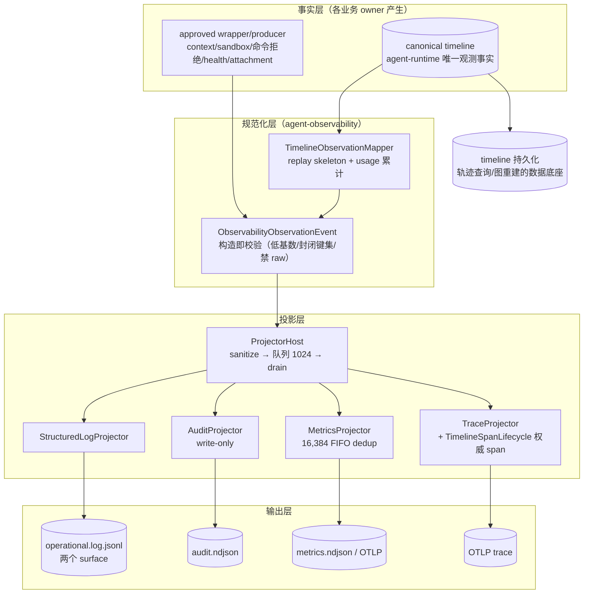
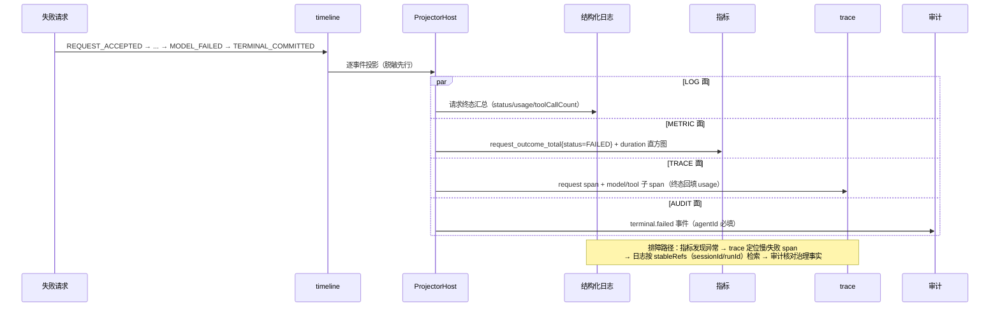
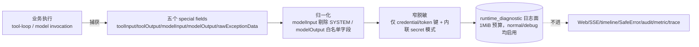
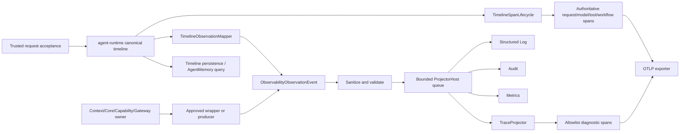

# NextAgent agent-observability 可观测设计文档

> 版本: 1.1 | 日期: 2026-08-25 | 合并自 `agent-observability可观测.md`（v1.0，实现视角：observation stream、五个投影面、special fields 脱敏）与《智能体执行轨迹设计文档》（目标态视角：轨迹骨架、inventory 全量清单、上报策略、查询与图重建，inventory 基线 2026-08-20 origin/main@db2572a04）
> 基于源码 `agent-observability`（`packages/agent-observability/src/`）、`agent-log`、`agent-memory/src/task-trajectory-worker.ts`、`agent-app/src/composition/observability-composition.ts`
>
> 相关文档：[agent-loop引擎](./agent-loop引擎.md)、[agent-runtime任务控制恢复](./agent-runtime任务控制恢复.md)、[agent-capability工具体系](./agent-capability工具体系.md)、[agent-context-engine上下文工程](./agent-context-engine上下文工程.md)。本文 §1-§19 为实现设计（事件产生与校验、投影面、脱敏、DFX），§20-§31 为执行轨迹目标态设计（骨架、清单、上报、查询重建），两视角互补。
>
> 权威行为以 `openspec/` 为准，当前实现以 `packages/` 和测试为准。本文不新增 Web API、stream event、runtime command、observability signal 或持久化 contract；后续若新增轨迹类型、字段、上报面或存储行为，必须先通过 OpenSpec change 定义 owner、schema、安全边界和验证方式。

---

## 目录

1. [背景与目标](#1-背景与目标)
2. [上下文：系统定位、术语与规格导航](#2-上下文系统定位术语与规格导航)
3. [架构总览](#3-架构总览)
4. [关键不变量](#4-关键不变量)
5. [Observation Event：产生与校验](#5-observation-event产生与校验)
6. [发射方清单与事件类型](#6-发射方清单与事件类型)
7. [Projector Host：统一流转](#7-projector-host统一流转)
8. [五个投影面](#8-五个投影面)
9. [结构化日志与两个 Surface](#9-结构化日志与两个-surface)
10. [本地诊断 Special Fields 与脱敏](#10-本地诊断-special-fields-与脱敏)
11. [Metrics](#11-metrics)
12. [Trace 链路](#12-trace-链路)
13. [Audit](#13-audit)
14. [任务轨迹学习输入（TaskTrajectory）](#14-任务轨迹学习输入tasktrajectory)
15. [健康检查](#15-健康检查)
16. [安全设计](#16-安全设计)
17. [DFX：容量与可测试性](#17-dfx容量与可测试性)
18. [关键数据结构与契约](#18-关键数据结构与契约)
19. [错误处理与降级](#19-错误处理与降级)
20. [轨迹目标态设计](#20-轨迹目标态设计)
21. [关键概念与边界（轨迹视角）](#21-关键概念与边界轨迹视角)
22. [总体架构（轨迹视角）](#22-总体架构轨迹视角)
23. [可观测轨迹生成逻辑](#23-可观测轨迹生成逻辑)
24. [统一轨迹数据模型](#24-统一轨迹数据模型)
25. [轨迹列表](#25-轨迹列表)
26. [轨迹上报策略](#26-轨迹上报策略)
27. [轨迹查询与图重建](#27-轨迹查询与图重建)
28. [典型场景和效果](#28-典型场景和效果)
29. [安全、容量与可靠性约束](#29-安全容量与可靠性约束)
30. [验证与验收](#30-验证与验收)
31. [参考实现与规格](#31-参考实现与规格)
- [附录 A：核心文件索引](#附录-a核心文件索引)
- [附录 B：默认配置参数汇总](#附录-b默认配置参数汇总)

---
## 1. 背景与目标

### 1.1 问题定义

智能体系统的可观测面临三个特有矛盾，传统"业务模块直接写日志"的模式无法解决：

- **可见性与泄密的矛盾**：智能体的执行内容（prompt、模型输出、工具参数/结果、provider 原始错误）恰是最需要诊断的内容，也恰是绝不能进日志/审计/指标的内容（电信级脱敏要求）。需要一套"安全事件"模型区分"能投影的事实"与"原始诊断"。
- **多面一致性的矛盾**：日志、指标、trace、审计、执行轨迹如果各自采集，会出现同一事实在不同面口径不一（时间戳、关联键、状态语义漂移）。复盘一次失败请求需要跨面拼接时对不上。
- **观测代价的矛盾**：可观测不能阻塞业务——terminal commit 不能因为日志写失败而失败；但审计是证据面，写失败又不能静默。需要分面的失败语义。

配套诉求：**执行轨迹复盘**（Agent 为什么这样决策：上下文组装、能力选择、sandbox 执行、首个可见内容的时序）、**学习输入**（post-terminal 任务轨迹供记忆提取）、**跨服务追踪**（任务通道事件与请求链路关联）。

### 1.2 设计目标

1. **单一事实源，多面投影**：observation event 是唯一采集形态；五个投影面消费同一流，关联键（stableRefs）统一。
2. **构造即安全**：事件在构造点即校验（低基数、长度、封闭键集、禁 raw payload），投影前再全局脱敏，投影侧还有二次 allowlist——三层防线。
3. **观测永不阻塞业务**（audit 除外）：所有发射/投影失败降级为计数或诊断，不改变业务结果；audit 是唯一显式抛错的证据面。
4. **本地诊断唯一原始面**：五个 special fields（toolInput/toolOutput/modelInput/modelOutput/rawExceptionData）只进本地 runtime_diagnostic 日志，normal/debug 均启用且不可配置关闭。
5. **复利学习输入**：terminal commit 后的任务轨迹投影（非阻塞微任务），为记忆提取供数。

### 1.3 非目标

- **不做业务查询面**：audit 是 write-only（无查询 API）；LOG/METRIC 文件不是数据库。
- **不替代 timeline**：runtime timeline event 是 runtime 拥有的唯一观测事实；observation stream 是它的受控投影，不新增权威事件（spec `trace-log-linking`）。
- **不做实时告警**：metric 的 `event` 字段可用于外部 alerting，但本系统不内建告警引擎（文档早期澄清过"告警"能力域在系统内不存在）。
- **不做全量 body 脱敏保证**：assistant markdown 渲染等前端面的 sanitization 不属于本体系。

### 1.4 关键取舍记录

| 取舍 | 决策 | 理由 |
|------|------|------|
| 稳定业务标识为主关联键（非 traceId） | stableRefs（sessionId/requestRunId/timelineEventId 等） | traceId/spanId 不进核心契约（spec `otel-observability-adapter`）；业务标识跨重启/跨系统稳定，日志检索友好 |
| 16,384 FIFO metric dedup | 重复样本直接跳过（skipped_policy_denied） | 同一事实多发射方（timeline + adapter）会重复计数；有界去重防内存膨胀，代价是极端高基数下丢最旧 |
| audit 写失败抛错 vs 静默 | 抛错（不静默） | 审计是合规证据面；静默丢失不可接受（但仍在业务事务外，不回滚业务） |
| 指标低基数强制 | label 必须匹配 descriptor allowlist + `[A-Z0-9_.:-]{1,128}` | 高基数字段（requestId）会击穿 OTel 后端 |
| LOCAL 指标历史 vs 只 REMOTE OTLP | LOCAL 写 bounded ndjson 快照，REMOTE 用官方 OTLP exporter 无本地回退 | LOCAL 无采集后端仍需历史复盘；REMOTE 无 endpoint 显式 DEGRADED 而非假导出 |
| special fields 窄脱敏（非全文盲替换） | 只对 credential/token 键结构与内联 secret 模式替换 | AGENTS.md 约束：五个 special fields 的 prompt/路径/命令/stdout 不按敏感信息脱敏，只窄匹配凭据 |
| TaskTrajectory 非阻塞微任务 | queueMicrotask drain + catch-up 扫描 | terminal commit 关键路径外；崩溃漏掉的 committed run 由 catch-up 补建 |

---

## 2. 上下文：系统定位、术语与规格导航

### 2.1 系统定位与上下游

```
runtime/core/context/capability/model/attachment/memory/app
   （发射方：全部 try/catch advisory）
        │ createObservationEvent（构造即校验）
        ▼
┌───────────────────────────────────────────────────────┐
│ agent-observability（本文）                             │
│ ProjectorHost（脱敏/队列/drain）                        │
│ → LOG / AUDIT / METRIC / TRACE 四投影 + 轨迹 mapper     │
└───┬──────────────┬──────────────┬──────────────────────┘
    │              │              │
    ▼              ▼              ▼
agent-log       agent-platform-  OTel SDK
（单物理 writer； gateway-local   （BatchSpanProcessor；
 file+console    （audit 文件族； metrics LOCAL 历史 /
 广播；两个       metrics ndjson） REMOTE OTLP）
 surface）
        ▲
        │ terminal PERSISTED 事件（学习输入触发）
agent-memory（task-trajectory worker → SQLite trajectory store）
```

- **上游**：全部业务包经 wrapper/adapter 发射（不直接 import 投影面）；timeline 是最重要的发射源（canonical 事实优先）。
- **下游**：agent-log 物理写入；gateway-local 的 audit 文件族；OTel exporter；agent-memory 的轨迹学习链。
- **同级协作**：trace-log 关联依赖 timeline inlinePayload.trace 快照；健康指标由 health evaluator 直写 registry。

### 2.2 术语表

| 术语 | 定义 |
|------|------|
| observation event | ObservabilityObservationEvent：带 boundary/operation/outcome/ownerScope/稳定引用的安全观测事实 |
| boundary | 六类观测边界：request_lifecycle / model_invocation / capability_invocation / gateway_call / health_probe / system |
| surface | 投影面：LOG / AUDIT / METRIC / TRACE / HEALTH（枚举含 HEALTH 但无独立 projector） |
| projector | 消费 observation 的投影器：covers() 判覆盖 + project() 投影 + 五种 outcome |
| stableRefs | 稳定业务标识集合（sessionId/requestRunId/timelineEventId/capabilityInvocationId 等 10 键，允许 8 个） |
| DiagnosticCandidate | 诊断候选：SAFE / LOW_CARDINALITY / HIGH_CARDINALITY / SENSITIVE 四分类，脱敏与投影策略的依据 |
| special fields | 五个本地诊断字段（toolInput/toolOutput/modelInput/modelOutput/rawExceptionData），只在 runtime_diagnostic surface 保留 |
| replay skeleton | 从 timeline 事件序列重建执行骨架（含 duration/usage 回填）的映射器产物 |
| TTFT | time to first token：submit 到首个可见内容的时延（model_ttft_seconds） |
| previewSpanIds | WORKFLOW_NODE span 的前驱 span 链（来自 predecessorNodeExecutionIds） |
| write-only gateway | audit 的 append-only 契约：只有 appendAuditEvent，无查询接口 |

### 2.3 权威规格导航

| 主题 | 权威 spec |
|------|-----------|
| 观察流/trace-log 关联/timeline 唯一事实 | `trace-log-linking` |
| 结构化日志 | `structured-logging` |
| runtime 日志与两个 surface、special fields | `runtime-logging` |
| 脱敏策略 | `redaction-policy` |
| 指标 | `agent-runtime-metrics` |
| OTel adapter / OTLP trace 导出 | `otel-observability-adapter`、`otel-trace-export` |
| 审计事件契约 / audit sink | `audit-event-contract`、`audit-sink` |
| 能力调用审计 | `invocation-audit` |
| 执行轨迹 | `agent-execution-trajectory`（+ ADR agent-execution-trajectory-safe-diagnostics） |
| 内部生命周期可观测 | `internal-lifecycle-observability` |
| 任务事件与追踪关联 | `task-event-trace-correlation` |
| 健康检查 | `system-health-check` |
| 任务轨迹学习输入 | `task-trajectory` |
| 日志滚动基础 | `local-file-roll` |
| 可观测边界架构 | design `openspec/designs/architecture/observability-boundaries.md` |

Feature/Function 追溯：F-7.1 ~ F-7.6、FN-7.1 ~ FN-7.11、FN-8.8。

---

## 3. 架构总览

### 3.1 组件视图

```
┌────────────────────────── 发射方（advisory，绝不改变业务结果）────────┐
│ runtime timeline 事件 → TimelineObservationMapper（canonical 优先）   │
│ runtime 命令拒绝 → RuntimeCommandWrapper                              │
│ context engine / sandbox gateway → typed-observation-adapters         │
│ cron / memory config / app lifecycle / health → app-observation-adapters│
│ attachment intake / task trajectory worker 诊断                       │
└──────────────┬────────────────────────────────────────────────────────┘
               ▼ createObservationEvent（构造即校验）
┌─────────────────────────────────────────────────────────────────────┐
│ ObservabilityObservationEvent                                        │
│ { boundary, operation, outcome, ownerScope, occurredAt, durationMs?,│
│   firstContentLatencyMs?, usage?, safeSummary?, stableRefs?,         │
│   diagnosticSnapshot? }                                              │
└──────────────┬────────────────────────────────────────────────────────┘
               ▼ acceptObservation
┌─────────────────────────────────────────────────────────────────────┐
│ ObservabilityProjectorHost（linking/projector-host.ts:45-107）       │
│  1. sanitizeObservation（全局脱敏 + trace 关联迁移）                  │
│  2. 队列（容量 1024；满则 onObservationDropped 降级）                 │
│  3. 微任务 drain → 逐条 projectToSurfaces                            │
│  4. 每个 projector: covers() → project()；结果经 onProjectionResult   │
└──┬──────────┬──────────┬──────────┬─────────────────────────────────┘
   ▼ LOG      ▼ AUDIT    ▼ METRIC   ▼ TRACE
┌─────────┐ ┌─────────┐ ┌─────────┐ ┌──────────────────────────────┐
│Struct-  │ │Audit    │ │Metrics  │ │TraceProjector +              │
│uredLog  │ │Projector│ │Projector│ │TimelineSpanLifecycle         │
│Projector│ │(write-  │ │(16,384  │ │(权威 span: request/model/    │
│(请求终态│ │only     │ │FIFO     │ │ tool/workflow_node; preview- │
│汇总)    │ │gateway) │ │dedup)   │ │ SpanIds; W3C 传播)           │
└────┬────┘ └────┬────┘ └────┬────┘ └──────────────────────────────┘
     ▼           ▼           ▼
 agent-log 单物理 writer      OTel SDK
 (observation_derived +       (LOCAL 历史 / REMOTE OTLP)
  runtime_diagnostic 两 surface)
```

### 3.2 逻辑视图：观测分层与数据流



要点：单一事实源（timeline + approved producer）→ 单一规范化 carrier → 多面投影；关联键是 stableRefs（业务标识），不是 traceId。

### 3.3 业务流程视图

**流程 A：一次失败请求的跨面复盘（运维排障视角）**



**流程 B：本地诊断 special fields 的受控记录（仅 runtime_diagnostic surface）**



---

## 4. 关键不变量

| # | 不变量 | 强制点 |
|---|--------|--------|
| O1 | 观测永不阻塞业务：一切发射、投影、持久化失败降级为诊断/计数；唯一例外是 audit sink（显式抛错但不回滚业务） | 全部 wrapper try/catch（typed-observation-adapters.ts:320-326 等） |
| O2 | observation 顶层禁止 traceId/spanId 键；主关联键是稳定业务标识 | bannedKeyPattern（redaction.ts:38）；stableRefs 白名单 8 键（:26-35） |
| O3 | 事件构造即校验：低基数 token、safeSummary ≤512、duration 非负、firstContentLatencyMs 仅 model_invocation 终态且 ≤ duration、usage 封闭键集、禁 raw payload | createObservationEvent（observation.ts:90-143） |
| O4 | 事件投影前必过全局脱敏；投影侧另有二次 allowlist | sanitizeObservation（projector-host.ts:74-98）+ diagnostic-projection-policy |
| O5 | timeline event 是 runtime 拥有的唯一观测事实；observation 不新增权威事件 | spec `trace-log-linking`（runtime timeline 唯一事实 Requirement） |
| O6 | metric label 低基数且封闭：必须匹配 descriptor allowlist + `[A-Z0-9_.:-]{1,128}` | validateMetricLabels（metrics-registry.ts:83-96）+ SDK cardinality limit 200 |
| O7 | 同一 metric 事实重复样本被 FIFO 去重（16,384 上限） | MetricsProjector（:109-136） |
| O8 | audit 是 write-only：只有 appendAuditEvent，无查询；agentId 必填 | 契约（gateway/index.ts:711-724）；GatewayAuditEventWriter 缺 agentId 抛 TypeError |
| O9 | 五个 special fields 只进 runtime_diagnostic surface（normal/debug 均启用、不可配置关闭）、不进 Web/SSE/timeline/SafeError/audit/metric/trace/ObservabilityObservationEvent | surface 门控 + 1MiB 预算（operational-writer.ts:685-694, 729-736） |
| O10 | special fields 窄脱敏：只匹配 credential/token 键与内联 secret 模式，prompt/路径/命令/stdout 不脱敏 | isCredentialKey / isRawToolCredentialOrTokenKey / RAW_TOOL_INLINE_SECRET_PATTERNS |
| O11 | trace 层级受控：span 名仅三个 allowlist；TIMELINE_LIFECYCLE 权威 span 不被 TraceProjector 重复创建 | covers 排除（trace-projector.ts:74-81） |
| O12 | 请求终态强制关闭其子 span（reason=REQUEST_TERMINATED） | closeRequestChildren（timeline-span-lifecycle.ts:373-382） |
| O13 | 模型输入诊断不含 SYSTEM 消息、Tool descriptors、modelId；输出诊断只含规范化终态字段 | normalizeModelInput/Output（operational-writer.ts:1212-1241） |
| O14 | 轨迹学习输入只在 terminal COMMITTED 且有可见内容时构建；幂等键 task-trajectory:{runId} | builder 跳过条件 + worker（task-trajectory-worker.ts:159-169） |

---

## 5. Observation Event：产生与校验

**文件**: `packages/agent-observability/src/linking/observation.ts`

```typescript
// :35-49
interface ObservabilityObservationEvent {
  spanOwner?: 'TIMELINE_LIFECYCLE';
  boundary: ObservationBoundary;        // 六类边界（:4）
  operation: string;
  outcome: ObservationOutcome;          // :6
  ownerScope: TrustedOwnerScope;        // tenantId/subjectId/agentId/agentVersion（:9-14）
  occurredAt: EpochMillis;
  durationMs?: number;
  firstContentLatencyMs?: number;
  usage?: ObservationModelUsage;
  safeSummary?: string;                 // ≤512
  safeReasonCode?: string;
  stableRefs?: StableObservationRefs;   // 8 个稳定业务标识（:16-27）
  diagnosticSnapshot?: ObservabilityContext;
}
```

- `ObservationBoundary`（:4）：`'request_lifecycle' | 'model_invocation' | 'capability_invocation' | 'gateway_call' | 'health_probe' | 'system'`。
- `ObservationOutcome`（:6）：`'success' | 'failure' | 'timeout' | 'canceled' | 'denied' | 'degraded'`。
- `StableObservationRefs`（:16-27）：sessionId / requestRunId / cronTaskId / cronTriggerId / requestContextId / requestId / messageId / timelineEventId / capabilityInvocationId / auditEventId——**稳定业务标识是主关联键**；observation 顶层禁止 traceId/spanId 键。
- **构造即校验** `createObservationEvent`（:64-67，校验 :90-143）：低基数 token 模式 `[A-Z0-9_.:-]{1,128}`、safeSummary ≤512、duration 非负有限、`firstContentLatencyMs` 只允许 model_invocation 终态且 ≤ durationMs、usage 封闭键集、禁止 raw payload 字段（禁止键正则 :136-143）。
- 降级证据构造器 `createBoundedObservabilityDegradationEvidence`（:69-88）：缺 ownerScope/occurredAt 时返回 undefined——降级证据不完整就丢弃、不阻塞业务。

---

## 6. 发射方清单与事件类型

| 发射方 | 位置 | 事件 |
|---|---|---|
| Timeline 观察 mapper | `trajectory/timeline-observation-mapper.ts:36-116`（接线 `agent-app/src/composition/request-runtime-composition.ts:234-269`） | runtime timeline 事件 → observation（canonical 事实优先） |
| Runtime 命令拒绝 wrapper | `runtime/runtime-command-wrapper.ts:98-125`（拒绝构造 :147-197） | submit/cancel/retry/edit/answer 失败：`REQUEST_REJECTED` / `REQUEST_CONTROL_REJECTED` / `PENDING_INPUT_REJECTED` / `RESERVE_SUBMIT_REJECTED` |
| Context engine wrapper | `trajectory/typed-observation-adapters.ts:71-87`（`createObservedContextEngine`） | `CONTEXT_ASSEMBLY_COMPLETED/FAILED` |
| Sandbox gateway wrapper | `typed-observation-adapters.ts:100-170`（接线 `gateway-composition.ts:543`） | `SANDBOX_EXECUTION_STARTED/COMPLETED/FAILED/DENIED/TIMED_OUT` |
| Runtime 执行状态 | `typed-observation-adapters.ts:34-69` | `REQUEST_EXECUTION_STARTED/ENDED` + activeCount |
| Cron / memory config / app 生命周期 | `runtime/app-observation-adapters.ts:76-108, 60-74, 125-139, 141-164, 166-182` | `CRON_*`、`MEMORY_CONFIG_EVALUATED`、`MODEL_PROFILE_EXCLUDED`、`APP_START/APP_SHUTDOWN`（全部 try/catch advisory） |
| 健康评估 | `app-observation-adapters.ts:184-229` | `HEALTH_EVALUATED`（boundary=health_probe） |
| Attachment intake | `agent-attachment-runtime/src/index.ts:197-230` | `ATTACHMENT_ACCEPTED/REJECTED` + sizeBucket |
| 任务轨迹 worker 诊断 | `agent-memory/src/memory-lifecycle-diagnostics.ts:149-167` | `TASK_TRAJECTORY_BUILD`（ENQUEUED/BUILT/SKIPPED/DROPPED/FAILED） |

**operation inventory（按 boundary）**：

- request_lifecycle：`REQUEST_ACCEPTED`、`TERMINAL_COMMITTED`、`REQUEST_REJECTED`、`REQUEST_CONTROL_REJECTED`、`PENDING_INPUT_REJECTED`、`RESERVE_SUBMIT_REJECTED`、`REQUEST_EXECUTION_STARTED/ENDED`、`REQUEST_FIRST_CONTENT_DELIVERED`、`USER_INPUT_REQUIRED/RECEIVED/TIMEOUT/CANCELED`。
- model_invocation：`MODEL_INVOCATION_STARTED/COMPLETED/FAILED`、`MODEL_CREDENTIAL_FAILED`、`MODEL_QUOTA_FAILED`、`MODEL_SECURITY_FAILED`、`MODEL_STREAM_FIRST_VISIBLE_CONTENT`。
- capability_invocation：`CAPABILITY_STARTED/COMPLETED/FAILED/TIMED_OUT/CANCELED/DENIED/SECURITY_FAILED/POLICY_BLOCKED`。
- gateway_call：`SANDBOX_EXECUTION_*`。
- health_probe：`HEALTH_EVALUATED`。
- system：`POLICY_ALLOWED/POLICY_DENIED/POLICY_FAILED/POLICY_APPLIED`、`HOOK_INVOKED`、`CONTEXT_ASSEMBLY_*`、`CONTEXT_COMPACTED`、`DEGRADATION_NOTICE`、`BACKGROUND_TASK_*`、`ATTACHMENT_*`、`CRON_*`、`MEMORY_*`、`MODEL_PROFILE_EXCLUDED`、`APP_*`、`TASK_TRAJECTORY_BUILD`、`LANE_DRAIN_*`、`RECOVERY_SCAN_*`、`ROUTING_DECISION`、`SAFE_ERROR_EMITTED`、`GATEWAY_OWNER_BOUNDARY_FAILED`、`GATEWAY_CREDENTIAL_FAILED`。

---

## 7. Projector Host：统一流转

**文件**: `packages/agent-observability/src/linking/projector-host.ts:45-107`

```
createObservabilityProjectorHost(projectors, options):
  acceptObservation(event):
    1. sanitizeObservation(event) 脱敏 + transferLocalLogCorrelation 迁移 trace 关联
       (:74-98)  # 脱敏抛错直接丢弃（:78-83）
    2. 队列容量 queueCapacity ?? 1024（:51）
       队列满 → 对所有 projector 调 onObservationDropped
       + 记 degraded/PROJECTOR_FAILED（:85-95）
    3. scheduleDrain（微任务）→ drainQueue 逐条 projectToSurfaces:
       每个 projector 先 covers()，不覆盖记 skipped_not_covered，
       project 抛错记 degraded/PROJECTOR_FAILED（:125-159）
    4. 每个投影结果经 onProjectionResult 回调记录
       （接线为 createProjectionMetricsRecorder，写
        projector_projection_total 与 observability_degradation_total 指标）
    5. drain/close 默认超时 5000ms，超时抛 OBSERVABILITY_PROJECTOR_DRAIN_TIMEOUT
       (:99-115)
```

- Surface 类型（:6）：`'LOG' | 'AUDIT' | 'METRIC' | 'HEALTH' | 'TRACE'`。
- ProjectionOutcome（:7）：`'emitted' | 'skipped_not_covered' | 'skipped_policy_denied' | 'degraded' | 'failed_closed'`。
- HOST 装配顺序：LOG → AUDIT → METRIC → TRACE（`agent-app/src/composition/observability-composition.ts:289-313`）。HEALTH surface 枚举存在但无独立 projector（健康指标由 health evaluator 直写 registry）。

---

## 8. 五个投影面

### 8.1 StructuredLogProjector（LOG）

**文件**: `logging/structured-log-projector.ts:65-204`

- covers：mapEvent 非空（health_probe 排除，:336-338）。
- 请求终态汇总：`RequestLogSummaryAccumulator`（:107-203，容量 1024 FIFO :156-161）聚合 status/summaryStatus/usage/toolCallCount/完整性标记 PARTIAL。
- level 映射（:385-411）：enqueued/completed/skipped=debug，dropped=warn，failure/timeout=error，degraded/denied=warn。
- 事件名映射（:335-383）：`TERMINAL_COMMITTED`→request.completed/canceled/failed；`MODEL_STREAM_FIRST_VISIBLE_CONTENT`→model.stream.first_visible_content；`REQUEST_FIRST_CONTENT_DELIVERED`→request.first_content_delivered；`TASK_TRAJECTORY_BUILD` 按 status 展开；兜底 `operation.toLowerCase().replaceAll('_','.')`。

### 8.2 AuditProjector（AUDIT）

**文件**: `audit/audit-projector.ts:5-37`

- covers：auditEventName 非空（:10-12）。
- 候选必需 `auditEventId` 且（`requestRunId` 存在或事件为 `request.rejected`），否则 `failed_closed/MISSING_REQUIRED_FIELDS`（:47-53）；序列化失败 `failed_closed/SERIALIZATION_FAILED`；write 失败 `degraded/SINK_WRITE_FAILED`；LIVE_ONLY 事件不进 audit（:102-105）。
- 事件名映射（:102-195）：request.accepted/rejected、terminal.committed/failed、capability.*、model.security_failed/credential_failed/quota_failed、gateway.*、cron.*、hook.*、policy.*、attachment.*、routing.decision、safe_error.emitted。
- agentId 扩展落地：`GatewayAuditEventWriter` 在 agentId 缺失时抛 TypeError（`agent-app/src/composition/gateway-audit-event-writer.ts:16-19`）；AuditEventRecord 的 `agentId: AgentId` 必填（契约 `gateway/index.ts:711-720`）。

### 8.3 MetricsProjector（METRIC）

见第 9 节。

### 8.4 TraceProjector + TimelineSpanLifecycle（TRACE）

见第 10 节。

### 8.5 轨迹投影（第五面）

轨迹投影没有名为 "trajectory projector" 的类——**轨迹 = timeline 持久化 + TimelineObservationMapper（`timeline-observation-mapper.ts:36`）+ TaskTrajectory 存储链路**：

- **稳定 replay skeleton**（`timeline-observation-mapper.ts:36-116`），进程内状态：acceptedAtByRun、requestUsageByRun（请求级 token 累计器 :772-835）、modelStartedAtByInvocation、activeModelStepByRun、firstVisibleByInvocation、firstContentDeliveredByRun（:37-42）。
  - `REQUEST_ACCEPTED` 记录 acceptedAt 并新建 usage 累计器（:44-48）。
  - `MODEL_INVOCATION_STARTED` 记录 (runId, stepId) 起始（:49-58）。
  - `LLM_CONTENT_DELTA` / `LLM_THINKING_DELTA`：首次内容派发生成 `REQUEST_FIRST_CONTENT_DELIVERED`（duration=createdAt-acceptedAt，:61-67, 329-342）；首次可见生成 `MODEL_STREAM_FIRST_VISIBLE_CONTENT`（:68-78, 311-327）——**first visible model content 与 first content delivered 的对齐点**。
  - `MODEL_INVOCATION_COMPLETED/FAILED`：累计请求 usage、回填缺省 duration（:80-97）；失败按 safeErrorCode/Category 细分 CREDENTIAL/QUOTA/SECURITY/INVOCATION（:837-858）。
  - 终态事件：补 duration、挂请求级聚合 usage、清理 per-run 状态（:98-112）。
  - 所有观察经 `bindTimelineLogCorrelation` 绑定 inlinePayload.trace 的 traceId/spanId（:115）。
- **capability selection / sandbox execution 分离可观测**：capability 侧 `CAPABILITY_STARTED` 要求 toolCallId+capabilityId（:344-370），`CAPABILITY_COMPLETED` 经 terminal classification 细分（:360-890）；sandbox 侧独立 gateway_call 边界 wrapper（`typed-observation-adapters.ts:100-127`）——两条链路完全独立可观测。

---

## 9. 结构化日志与两个 Surface

### 9.1 StructuredLogEntry schema

**文件**: `logging/structured-log-projector.ts:9-32`

```typescript
interface StructuredLogEntry {
  occurredAt: string;                  // ISO
  level: 'debug' | 'info' | 'warn' | 'error';
  event: string;
  agentId: string; agentVersion: string;
  sessionId?; requestId?; runId?; stepId?;
  timelineEventId?; capabilityInvocationId?;
  traceId?: string; spanId?: string;
  safeReasonCode?: string;
  details?: JsonObject;
  durationMs?; firstContentLatencyMs?; usage?;
  status?: 'SUCCEEDED' | 'FAILED' | 'CANCELED';
  summaryStatus?: 'COMPLETE' | 'PARTIAL';
  toolCallCount?: number;
  diagnostic?: JsonObject;             // 仅 diagnosticDetail=debug
}
```

### 9.2 两个 Surface

- 类型：`OperationalLogSurface = 'runtime_diagnostic' | 'observation_derived'`（`agent-common/src/logging/logger.ts:5`）。
- 差异（`agent-log/src/operational-writer.ts:288-364`）：
  - **runtime_diagnostic** 才允许 raw payload special fields 与 rawExceptionData（:323, 349-351, 685-694）；trace 关联来自 AsyncLocalStorage `currentRuntimeLogCorrelation()`（:324-331）；stepId 仅 observation_derived 或 TRUSTED_RUNTIME_STEP_EVENTS 事件允许（:332-337，trusted 集合 :151-161）。
  - **observation_derived** 由 StructuredLogProjector 写入（`observability-composition.ts:167, 272-274`），trace 关联来自字段校验（:1371-1379）。
- 预算：普通条目 16KiB；runtime_diagnostic 且含 raw payload/exception 时 1MiB（:26-27, 349-351）；超预算降级为 `entry_too_large`（:356-359）。

### 9.3 单物理 writer 与文件 roll

- `OperationalLogWriter`（`agent-log/src/index.ts:33-40`）持有一个 pino logger + `createBroadcastDestination`（file sink + console sink 广播，`operational-writer.ts:569-607`）；全局 provider 绑定 `bindRuntimeLoggerProvider`（`agent-common/src/logging/logger.ts:59-80`），未绑定时 noop（:40-45）。
- 文件 sink：`createLocalFileRoll` naming='sequence'（:530-551）；sink 降级/恢复经 bounded reporter 上报（:609-648）。
- console sink：pino destination dest=1 sync=false maxLength=4MiB（:553-567）。
- roll 默认（`agent-app/src/config/validation.ts:575-583`）：file.name 默认 `nextagent-operational.log.jsonl`、rotation.maxFileSizeMiB 30、retentionDays 7、maxArchiveFiles 10；level 默认 info、diagnosticDetail 默认 normal（:569-571）。
- writer 常量（:25-40）：DESTINATION_BUFFER_BYTES 4MiB、MAX_FIELD_COUNT 64、MAX_ARRAY_ITEMS 16、MAX_DEPTH 6、MAX_STRING_BYTES 1024。

---

## 10. 本地诊断 Special Fields 与脱敏

### 10.1 五个字段与门控

- `RAW_RUNTIME_PAYLOAD_FIELDS = ['toolInput','toolOutput','modelInput','modelOutput']`（`operational-writer.ts:169`）；`rawExceptionData` 单独处理（:653-659, 729-731）。
- 门控：仅 `runtime_diagnostic` surface 且 depth=0 才保留，否则替换为 `'<omitted:policy>'`（:733-736）。
- 1MiB 预算判定 `hasLocalDiagnosticDetail`（:685-694）。

### 10.2 发射方

- `toolInput/toolOutput`：`agent-core/src/tools/tool-loop.ts:1342-1351`（事件 `tool.payload.captured`）；字段构造 `runtimeToolInputLogFields`（:1940-1945）与 `runtimeToolOutputLogFields`（:1947-1964，剥离 generatedMessages、只附 count/Kinds）。
- `modelInput/modelOutput`：`agent-core/src/model/run-bound-model-invocation.ts:95-119`——`model.payload.input_captured` / `output_captured` / `failed`。
- `rawExceptionData`：agent-log 在 caught error 上自动提取（:653-659）；提取器 `runtimeRawExceptionData`（`agent-common/src/index.ts:239-290`：AgentError 分支含 code/category/retryable/safeDetails/cause；通用分支含 name/message/stack/cause/own fields；循环引用返回 `{value:'[Circular]'}`）。

### 10.3 归一化与窄匹配脱敏

- **归一化**（:1202-1241）：`modelInput` 仅保留 messages 数组并**过滤 SYSTEM 角色**；`modelOutput` 仅保留 `MODEL_OUTPUT_FIELDS`（content/toolCalls/finishReason/incompleteOutputReason/usage/safeError，:170）；toolInput/toolOutput 经 `normalizeRawToolPayload`（:1136-1181）。
- **窄匹配 credential/token 键脱敏**（结构化键命中才替换，不做全文盲替换）：
  - 普通字段 `isCredentialKey`（:842-852）：CREDENTIAL_SEGMENTS（password/secret/credential/authorization/cookie 等，:126-137）命中、单段 token/tokens、TOKEN_PREFIX_SEGMENTS（api/access/auth/refresh/bearer/id，:138）前缀+token、api+key 组合。
  - raw payload 内 `isRawToolCredentialOrTokenKey`（:854-879）：按最后一段判断 + `RAW_TOOL_SECRET_VALUE_SUFFIXES`（value/values）组合（:183-184）。
- **内联 secret 值脱敏**：`RAW_TOOL_INLINE_SECRET_PATTERNS`（:185-192，sk- 前缀、Bearer、`(password|api[-_]?key|...|token|secret)\s*[:=]`）→ `<redacted:credential>`；字符串截断 16KiB+512 lookahead（:1183-1194）。
- **通用字符串脱敏** `SECRET_VALUE_PATTERNS`（:162-168，含 Windows 盘符与 POSIX 路径 → `<omitted:policy>`）；异常链清洗（:1243-1288）；pino 层 redact 兜底（:245-248）。

### 10.4 全局 observation 脱敏（sanitizeObservation）

**文件**: `logging/redaction.ts:50-67`

- candidate 键过 `bannedKeyPattern`（:37-38，覆盖 prompt/toolArgs/toolResult/secret/credential/traceId 等）即丢；SENSITIVE 分类丢弃（:99）。
- LOW 值必须匹配 `/^[A-Z0-9_.:-]{1,128}$/iu`（:39, 133-141）；bounded array 仅 6 个键且 ≤100 项、≤4096 字节（:41-48, 111-121）。
- safeSummary 命中禁词替换 `REDACTED_BY_POLICY`（:169-177）；stableRefs 仅 8 个允许键（:26-35, 69-78）。
- 投影侧二次 allowlist：`linking/diagnostic-projection-policy.ts`——`MODEL_DIAGNOSTIC_KEYS` 白名单（:3-20）、`MODEL_IDENTITY_KEYS` 永不投影（:22）、safeErrorCode/safeErrorCategory 只进 metrics 不进 log/trace（:23, 26-28）。

---

## 11. Metrics

**文件**: `metrics/metrics-registry.ts`、`metric-descriptors.ts`

- **Registry**：`MetricsRegistry`（increment/observe，:26-29）；OTel 实现 `createMetricsRegistry`（:39-58，meter `nextagent-runtime/1.0.0`）；instrument 按 descriptor 一次性创建（:145-154）；label allowlist 校验（:83-96，不合法 `degraded/INVALID_METRIC_LABEL`）。
- **16,384 FIFO dedup**（`MetricsProjector.project` :109-136）：dedupKey 命中即 `skipped_policy_denied/DUPLICATE_METRIC_SAMPLE`；emitted 后 `dedupOrder.length >= 16_384` 时 shift 驱逐最旧。dedupKey = metricFactKey 候选 > capabilityInvocationId > timelineEventId + name + labels JSON（:357-361）。
- **descriptor-owned**：`METRIC_DESCRIPTORS`（`metric-descriptors.ts:81-303`），每个含 name/kind/unit/allowedLabels/valueSource/acquisitionSource（timeline | typed_adapter | projector_host | health_evaluator | configuration）；SDK 视图按 descriptor 生成 allowlist processor + cardinality limit 200（`metrics-sdk.ts:62-75`）。
- **LOCAL / REMOTE**：
  - LOCAL：`LocalMetricHistoryExporter`（`local-metric-history-exporter.ts:35-123`）写 `nextagent-metrics.ndjson`（roll 30MiB/7 天/10 归档/8MiB buffer；快照 schema `NextAgentMetricSnapshotV1` cumulative；单行 4MiB 上限）。
  - REMOTE：`createRemoteOtlpMetricExporter`（`agent-remote-deployment/src/index.ts:225-241`，OTLP，endpoint 从 env 解析）；无 endpoint → registry 初始 DEGRADED（metrics-sdk.ts:36-47）。
- **核心指标清单**：
  - 请求：`request_outcome_total`、`request_duration_seconds`、`request_phase_duration_seconds`（accepted/queued/executing/terminal_commit）、`request_first_content_latency_seconds`、`request_token_count`、`request_active_concurrency`、`request_abnormal_termination_total`。
  - 超时/流控/策略：`operation_timeout_total`、`model_flow_control_total`、`policy_decision_total`。
  - 模型：`model_invocation_total`、`model_invocation_duration_seconds`、`model_token_usage_total`、`model_token_count`、`model_output_token_rate`、**`model_ttft_seconds`**（TTFT，:188）、`model_chunk_latency_seconds`、`model_total_latency_seconds`。
  - 能力/附件/网关：`capability_invocation_total`、`capability_invocation_duration_seconds`、`attachment_intake_*`、`gateway_call_*`。
  - 自观测：`observability_degradation_total`、`projector_projection_total`、`configuration_evaluation_total`、`health_probe_*`。
- **TTFT 采集链**：`MODEL_STREAM_FIRST_VISIBLE_CONTENT` observation durationMs → `model_ttft_seconds`（metrics-registry.ts:570-574）；模型输出速率 = outputTokens/(duration-firstContentLatency)（:494-514）。

---

## 12. Trace 链路

### 12.1 TraceProjector

**文件**: `linking/trace-projector.ts:60-141`（tracer 默认 `nextagent-observability`）

- **受控 Span 层级**：covers 排除 `spanOwner==='TIMELINE_LIFECYCLE'`（权威 Span 由 TimelineSpanLifecycle 生成，不重复建 span，:74-81）；span 名仅三个 allowlist：REQUEST_DIAGNOSTIC_OPERATIONS（:20-27）、SYSTEM_TRACE_OPERATIONS（含 LANE_DRAIN_*/RECOVERY_SCAN_* 前缀，:29-44）、GATEWAY_TRACE_OPERATIONS（SANDBOX_EXECUTION_*，:46-52）。
- Span 构造：startSpan（kind=INTERNAL，startTime=occurredAt-duration，:94-103）；span event `observability.authoritative_fact`（:113）；状态映射（:222-230）。
- observation_type 语义：属性 `langfuse.observation.type`（:166）由 observationTypeFor 决定（system+POLICY_* → guardrail，否则 span，:208-213）；timeline 侧 `nextagent.observation_type` ∈ request/model/tool/workflow_node（timeline-span-lifecycle.ts:645-656）与 SpanKind CLIENT(MODEL/CAPABILITY)/INTERNAL。
- 属性：`nextagent.boundary/operation/outcome/reason_code/duration_ms/usage.*/owner.*`、`session.id`、`user.id` + `nextagent.diag.<key>`（LOW/SAFE 标量，排除 traceparent/tracestate，:163-206）；span link 来自 traceparent 解析（:232-254）。

### 12.2 W3C Trace Context 传播与权威 Span

**文件**: `linking/timeline-span-lifecycle.ts`

- 入站 carrier 解析 `parseIncomingCarrier`（:688-705，traceparent `00-{32hex}-{16hex}-{2hex}`，tracestate 严格校验 :707-741，≤32 成员）。
- 出站 header 注入 `outboundHeaders`（:148-163）：剥离旧 trace 头后注入当前 ACTIVE span 的 traceparent/tracestate/eventId。
- **权威 Span 生命周期**：`classifyTimeline`（:481-523，REQUEST/MODEL/WORKFLOW_NODE/CAPABILITY 的 START/TERMINAL/INTERMEDIATE/REQUEST_SNAPSHOT）；span 名 `nextagent.request|model|tool|workflow_node`（:658-660）；TOMBSTONE_TTL 120s、MAX_PREDECESSORS 128（:23-24）；workflow 前驱 previewSpanIds（:312-345）；终态属性/usage 回填（:592-627）；请求终止强制关闭子 span（:373-382）。
- OTLP 基础设施：NodeTracerProvider + BatchSpanProcessor（delay 5000ms / batch 8，`otel-trace-infrastructure.ts:24-71`）；GenAI 语义映射 `nextagent.*`→`gen_ai.*`（`trace-export-diagnostics.ts:34-124`）。
- **trace-log linking**：主关联键是 stableRefs（稳定业务标识）；observation 顶层禁止 traceId/spanId。trace↔log 桥：timeline inlinePayload.trace 快照（:549-558）→ `bindTimelineLogCorrelation`（`local-log-correlation.ts:10-19`）→ sanitize 前 `transferLocalLogCorrelation` 迁移（projector-host.ts:81）→ StructuredLogEntry 落 traceId/spanId 字段。执行作用域内 `withExecutionRef` → AsyncLocalStorage（`agent-common/src/logging/logger.ts:49-57`），runtime_diagnostic 写日志时自动附关联。

---

## 13. Audit

- `AuditEvent` 接口（`audit/audit-event.ts:6-17`）：auditId、eventName、tenantId、subjectId、`agentId?`（可选=扩展点）、requestRunId?、capabilityInvocationId?、safeSummary、attributes、occurredAt；`AuditEventWriter` 仅 write（:19-21）。
- **write-only gateway**：契约 `AuditEventStoreGateway` 仅 `appendAuditEvent`（`agent-contracts/src/gateway/index.ts:722-724`）；`AuditEventRecord extends OwnerScoped` 且 agentId 必填（:711-720）。
- **LOCAL 文件族**：`FileAuditEventStoreGateway`（`agent-platform-gateway-local/src/audit/file-audit-event-store.ts:25-73`）；policy（:86-96）：`nextagent-audit.ndjson`、30MiB、7 天、10 归档、4MiB buffer、date-sequence；schemaVersion 1 包裹（:98-117）；**write 失败抛错**（audit 是证据面，失败即失败，不静默）。
- 装配：`observability-composition.ts:301-302`（gatewayAuditStore → GatewayAuditEventWriter → AuditProjector）。

---

## 14. 任务轨迹学习输入（TaskTrajectory）

**文件**: `packages/agent-memory/src/task-trajectory-worker.ts` + `task-trajectory-builder.ts`

### 14.1 TaskTrajectoryRecord 结构（契约 `agent-contracts/src/gateway/index.ts:1463-1487`）

- owner：tenantId/subjectId/agentId；标识：taskTrajectoryId/sessionId/requestId/requestRunId。
- 分类：taskKind、trajectoryBuildStatus、taskOutcomeStatus、outcomeEvidenceLevel。
- goal：goalSummary、constraintSummaries。
- observations：`TaskTrajectoryObservation[]`（kind: REQUEST_FACT/TOOL_RESULT/DIAGNOSTIC/USER_CONFIRMATION/VERIFICATION/TERMINAL_STATUS + summary + sourceRefs + observedAt，:1441-1446）。
- actions：`TaskTrajectoryAction[]`（kind: MODEL_RESPONSE/TOOL_INVOCATION/CONFIG_APPLY/VERIFICATION/USER_INPUT/OTHER + status + startedAt/completedAt，:1453-1461）。
- outcome：outcomeSummary?、outcomeEvidenceRefs、failureSummary?。
- Builder 填充（`task-trajectory-builder.ts:118-143`）：goalSummary 固定 `Committed <status> request run.`（:130）；taskKind 推断（:384-393：CONFIG_CHANGE/TROUBLESHOOTING/GENERAL_TASK）；outcome 证据分级（:333-382：VERIFICATION > USER_CONFIRMATION > TOOL_STATUS > MODEL_CLAIM，取消/失败为 NONE）。

### 14.2 Worker 批处理

```
enqueue: 去重键 tenantId:subjectId:agentId:sessionId:requestRunId (:197-199)
  超 maxPending(1000) → DROPPED/TASK_TRAJECTORY_PENDING_LIMIT    (:79-82)
  queueMicrotask 触发 drain                                        (:85-88)
drainOnce: pending 空时 catch-up 扫描（listBuildCandidates）       (:109-138)
  取 batch、删 pending、按 concurrency 执行（runWithConcurrency）  (:90-107)
processItem: BUILT → saveTaskTrajectory（幂等键 task-trajectory:<runId>）
  → BUILT/TASK_TRAJECTORY_BUILT；失败且 retryable → 重试            (:159-169)
跳过条件（builder）:
  run 不存在 → TASK_TRAJECTORY_SOURCE_NOT_FOUND                    (:78-80)
  terminalCommitState !== 'COMMITTED' → TASK_TRAJECTORY_NOT_TERMINAL(:81-83)
  无可见 USER 消息且无 CAPABILITY 事件 → TASK_TRAJECTORY_NOT_APPLICABLE(:106-112)
```

触发接线：terminal PERSISTED timeline 事件 → enqueue（`request-runtime-composition.ts:278-308`）；worker 状态 → `TASK_TRAJECTORY_BUILD` observation（`memory-maintenance-composition.ts:221-240`）。持久化：SQLite store（`sqlite-task-trajectory-store.ts`）。

---

## 15. 健康检查

**文件**: `health/health-evaluator.ts`

- `createHealthEvaluator`（:47-76）：primary 单 probe `runtime_authority`（critical=true，**timeoutMs=250**，:49-54）；deep 遍历 options.probes（空则退回 primaryProbe，:64-74）。
- 深度 probe 实际超时：session gateway 1000ms（`agent-session/src/services/session-gateway-health-probe.ts:25`）、model provider 1000ms（`agent-model/src/health-probe.ts:39`）、capability catalog 1000ms（`agent-capability/src/health-probe.ts:27`）。
- 超时/中止/异常处理 `runProbe`（:93-124）：超时 `HEALTH_PROBE_TIMEOUT`、父中止 `HEALTH_PROBE_ABORTED`、异常 `HEALTH_PROBE_FAILED`；critical DOWN、非 critical DEGRADED。
- 聚合规则（:83-91）：critical DOWN → DOWN；任一 DEGRADED 或非 critical DOWN → DEGRADED；否则 UP。
- **health-owned metrics**：`recordHealthProbeMetrics`（:169-181）直写 `health_probe_total`（counter）与 `health_probe_duration_seconds`（histogram），labels={endpoint, status, component}。
- 文本/token 脱敏（:158-167）；观察包装 `createObservedHealthEvaluator`（app-observation-adapters.ts:184-229）+ 诊断 `health.state.changed` / `health.probe.subsystem_failed`（`health-composition.ts:50-110`）。

---

## 16. 安全设计

本文第 10 节（本地诊断 Special Fields 与脱敏）就是本能力安全机制的主体；本节补充 Owner/Agent Scope 与不可信边界总览。

### 16.1 Owner Scope 与 Agent Scope 强制点

| 事实 | scope | 强制点 |
|------|-------|--------|
| observation event | ownerScope: tenantId/subjectId/agentId/agentVersion（必填） | 构造即校验（observation.ts:90-143）；缺失降级证据直接丢弃 |
| StructuredLogEntry | agentId/agentVersion 必填；session/request/run/step 可选 | toStructuredLogEntry（structured-log-projector.ts:244-274） |
| AuditEventRecord | extends OwnerScoped 且 agentId 必填（run 可用时携带 trusted Agent Scope） | 契约（gateway/index.ts:711-720）；spec `audit-event-contract` |
| TaskTrajectoryRecord | owner: tenantId/subjectId/agentId | 契约（gateway/index.ts:1463-1487） |
| metric resource | 仅 allowlist：service.name/service.version/nextagent.deployment.mode | local-metric-history-exporter.ts:281-290 |

### 16.2 不可信输入边界

| 边界 | 不可信内容 | 防护 |
|------|-----------|------|
| 观测诊断候选 | 业务模块塞入的任意字段 | DiagnosticCandidate 四分类；SENSITIVE 丢、HIGH_CARDINALITY 不投影、LOW 需匹配模式、bounded array 六键上限 |
| safeSummary | 可能包含业务内容的摘要 | ≤512 字符 + 禁词替换 REDACTED_BY_POLICY |
| timeline inlinePayload | 事件负载 | mapper 只投影受控子集（argumentProjectionStatus 等低基数字段）；raw 内容不进 observation |
| 入站 trace headers | traceparent/tracestate 格式 | 严格格式校验（tracestate ≤32 成员、成员值 ≤256） |
| CLIP/远端响应 | 外部系统返回 | observation 只记 outcome/reasonCode/duration；响应正文不进任何 surface |

### 16.3 敏感数据流全景（三层防线）

```
业务事实（prompt/模型输出/工具结果/凭据/provider raw）
   │ 第一层：构造即校验 —— observation 携带的只有安全字段与 stableRefs
   │ 第二层：全局脱敏 —— sanitizeObservation（bannedKeyPattern/SENSITIVE/低基数/禁词）
   │ 第三层：投影二次 allowlist —— MODEL_DIAGNOSTIC_KEYS / REQUEST_TERMINAL_METRICS_ONLY_KEYS
   ▼
LOG/METRIC/TRACE/AUDIT（永远安全面）

本地诊断例外通道（受控）：toolInput/toolOutput/modelInput/modelOutput/rawExceptionData
   → 仅 runtime_diagnostic surface + 窄 credential/token 脱敏 + 1MiB 预算 + 不进其他任何面
```

### 16.4 权限模型（本能力相关）

- 观测数据的消费边界：audit 无查询 API（write-only）；metrics/trace 经 OTel 出口受部署模式配置控制（REMOTE endpoint 来自 env/SecretReference，spec `otel-trace-export`）。
- 诊断详情分级：diagnosticDetail 配置只控制 LOG 的 debug 档候选渲染（structured-log-projector.ts:314-333），special fields 的记录不受该配置关闭（AGENTS.md 技术约束）。

---

## 17. DFX：容量与可测试性

（可观测信号本身即本文主题，第 6/9/11/12 节已覆盖信号清单；本节只补容量约束与验证入口。）

### 17.1 容量与性能约束

| 维度 | 值 | 来源性质 |
|------|-----|---------|
| projector host 队列 / drain 超时 | 1024 / 5000ms | 固定常量 |
| 请求终态汇总容量 | 1024（FIFO 驱逐） | 固定常量 |
| metric dedup / 导出间隔 / cardinality | 16,384 / 60s / 200 | 固定常量 |
| 日志条目预算 | 16KiB（普通）/ 1MiB（runtime raw） | 固定常量 |
| 三类文件 roll（log/metrics/audit） | 30MiB / 7 天 / 10 归档 | app 配置默认（validation.ts:575-583 等） |
| trace 批处理 | delay 5000ms / batch 8 | 固定常量 |
| 轨迹 worker | batch 10 / concurrency 2 / pending 1000 / retry 2 | 固定常量（上限可配） |
| primary / deep health probe | 250ms / 各 1000ms | 固定常量 |
| TTFT 可度量性 | ≤10,000ms、低基数标签 | spec `ts-performance-test-gate` |

### 17.2 可测试性与验证入口

```bash
# 单元/契约：observation 构造校验、脱敏 negative、各 projector、metrics dedup、audit fail-closed
npm test
npm run test:contract

# 架构边界（观测面私有路径、包边界）
npm run lint:architecture

# 规格一致性
openspec validate --all --strict
```

关键回归面：脱敏三层防线 negative（bannedKey/SENSITIVE/高基数）、special fields 窄脱敏不误伤（credentialRef/tokenCount 正常字段保留）、timeline→observation 映射（usage 累计/duration 回填/first content 对齐）、audit fail-closed（缺字段/序列化失败/write 失败）、metrics dedup 与 label 校验、健康聚合规则（critical DOWN / partial DEGRADED）、轨迹 worker 跳过条件。

### 17.3 扩展点

| 扩展 | 方式 | 边界 |
|------|------|------|
| 新投影面 | 实现 ObservabilityProjector（covers+project），注册进 host | 必须消费已脱敏流；失败语义遵循 O1 |
| 新指标 | METRIC_DESCRIPTORS 增加 descriptor | label 必须 allowlist 化、低基数；SDK 视图自动生成 |
| 新 observation operation | 发射方新增 operation 值 | 需低基数；投影映射表同步维护 |
| 插件诊断 artifact | DeveloperDiagnosticArtifactSink（NDJSON，独立文件族） | 本地 only；见 spec `plugin-developer-diagnostic-artifacts` |

---

## 18. 关键数据结构与契约

```typescript
// linking/observation.ts
ObservabilityObservationEvent     (:35-49)
ObservationBoundary / ObservationOutcome / TrustedOwnerScope / StableObservationRefs
                                  (:4 / :6 / :9-14 / :16-27)

// linking/projector-host.ts
ObservabilitySurface = 'LOG'|'AUDIT'|'METRIC'|'HEALTH'|'TRACE'   (:6)
ProjectionOutcome = 'emitted'|'skipped_not_covered'|'skipped_policy_denied'
                  |'degraded'|'failed_closed'                     (:7)
ObservabilityProjector / ObservabilityProjectorHost              (:15-20, 22-26)

// logging/structured-log-projector.ts:9-32
StructuredLogEntry

// metrics/metric-descriptors.ts:34-51 / metrics-registry.ts:17-29
MetricDescriptor（Counter/Histogram 联合）/ MetricSample / MetricsRegistry

// audit/audit-event.ts:6-21
AuditEvent / AuditEventWriter

// agent-contracts/src/gateway/index.ts
AuditEventRecord (extends OwnerScoped, agentId 必填)              (:711-720)
TaskTrajectoryRecord / Observation / Action                       (:1463-1487, :1441-1461)

// agent-log/src/index.ts:5-40
OperationalRuntimeLoggingPolicy / OperationalLogWriter

// agent-common/src/logging/logger.ts
OperationalLogSurface ('runtime_diagnostic'|'observation_derived')(:5)
RuntimeLogCorrelation                                            (:32-35)

// health/health-evaluator.ts:15-38
HealthCheckResponse / HealthProbe / HealthEvaluator

// agent-memory/src/task-trajectory-worker.ts:10-29
TaskTrajectoryWorkerStatus / WorkerDiagnostic / TaskTrajectoryWorker
```

---

## 19. 错误处理与降级

| 降级/失败 | 触发条件 | 处理 | 位置 |
|---|---|---|---|
| 构造校验失败 | observation 违反低基数/长度/usage 约束 | 构造时拒绝（fail-fast） | observation.ts:90-143 |
| 脱敏抛错 | sanitizeObservation 异常 | 直接丢弃（不阻塞业务） | projector-host.ts:78-83 |
| 队列满 | >1024 待投影 | onObservationDropped + `degraded/PROJECTOR_FAILED` | projector-host.ts:85-95 |
| projector 抛错 | 单 surface 投影异常 | `degraded/PROJECTOR_FAILED`（其余 surface 继续） | projector-host.ts:152-157 |
| drain 超时 | >5000ms | `OBSERVABILITY_PROJECTOR_DRAIN_TIMEOUT` | projector-host.ts:115 |
| 发射方异常 | 所有 wrapper | try/catch advisory，绝不改变业务结果 | typed-observation-adapters.ts:320-326 等 |
| 降级证据不完整 | 缺 ownerScope/occurredAt | 丢弃证据（不阻塞） | observation.ts:69-88 |
| metric 重复 | FIFO dedup 命中 | `skipped_policy_denied/DUPLICATE_METRIC_SAMPLE` | metrics-registry.ts:109-136 |
| metric label 非法 | 不在 descriptor allowlist | `degraded/INVALID_METRIC_LABEL` | metrics-registry.ts:83-96 |
| REMOTE 无 endpoint | OTLP 未配置 | registry 初始 DEGRADED | metrics-sdk.ts:36-47 |
| audit 缺字段 | 无 auditEventId/requestRunId | `failed_closed/MISSING_REQUIRED_FIELDS` | audit-projector.ts:47-53 |
| audit write 失败 | sink 写入异常 | `degraded/SINK_WRITE_FAILED`（**抛错不静默**） | file-audit-event-store.ts:73 |
| 日志超预算 | >16KiB / 1MiB | 降级 `entry_too_large` | operational-writer.ts:356-359 |
| trace exporter 失败 | OTLP 导出异常 | 诊断日志（不阻塞） | trace-export-diagnostics.ts:6-26 |
| 轨迹 pending 满 | >1000 | DROPPED/TASK_TRAJECTORY_PENDING_LIMIT | task-trajectory-worker.ts:79-82 |
| 轨迹保存失败 | retryable | 重试（≤2 次，退避 100ms） | task-trajectory-worker.ts:159-169 |

**核心不变量：可观测永远不阻塞业务**——所有发射、投影、持久化失败都降级为诊断事实或计数，terminal commit 与主路径不受影响；唯一例外是 audit sink（证据面 write 失败显式抛错，但仍不回滚业务事务）。

---

---

以下 §20-§31 为执行轨迹目标态设计（原《智能体执行轨迹设计文档》全文并入；inventory 基线 2026-08-20 的 origin/main@db2572a04，生产 producer、timeline mapper、projector coverage 或 app composition 变化时须同步刷新 25.3、25.4 节及该基线）。
## 20. 轨迹目标态设计

执行轨迹必须同时满足以下目标：

1. **可复盘**：能够回答一次请求经历了哪些关键阶段、调用了什么类型的能力、何时开始产生可见内容、最终为何成功或失败。
2. **单一事实源**：执行事实由 owning runtime/domain boundary 产生，observability 只投影，不根据日志文本反推业务真相。
3. **安全**：只记录稳定引用和有界安全摘要，不记录原始思维链、prompt、模型输出、Tool 输入输出、附件正文、路径、凭据或 provider raw payload。
4. **非阻塞**：轨迹生成、投影或远程上报失败不得改变 request lifecycle、stream delivery、capability execution 或 terminal commit。
5. **可关联**：优先使用稳定业务引用串联主路径；Trace ID/Span ID 仅用于分布式调用关系，不成为业务主键或状态推进依据。
6. **可治理**：每类事实只有一个 owner，同类事件使用同一 carrier、同一脱敏策略和同一失败原则。

## 21. 关键概念与边界（轨迹视角）

| 概念 | 定义 | Owner | 是否为业务真相 |
| --- | --- | --- | --- |
| Canonical timeline | Request、Model、Capability、Hook、Policy、用户输入和终态等运行事实的有序事件流 | `agent-runtime` | 是 |
| Agent execution trajectory | 从 timeline 和 approved owner observation 形成的安全复盘骨架 | 事实由各业务 owner 产生，`agent-observability` 统一投影 | 是安全复盘视图，不是新状态机 |
| `ObservabilityObservationEvent` | LOG、AUDIT、METRIC、TRACE 共用的进程内规范化 carrier | `agent-observability` | 否，是事实投影输入 |
| OTEL Trace | 从权威执行区间和 allowlist 辅助事实生成的分布式调用视图 | `agent-observability` | 否，是外部观测投影 |
| Structured Log | 按稳定 refs 检索和人工复盘的安全结构化日志 | `agent-observability` | 否，是诊断投影 |
| Audit | 对安全、授权、策略、关键状态变化的持久审计记录 | `agent-observability` + gateway store | 是审计事实，但不替代 timeline |
| Metrics | 从统一 observation 派生的低基数聚合统计 | `agent-observability` | 否，是聚合观测 |
| `TaskTrajectoryRecord` | 供长期记忆、自学习使用的任务轨迹数据 | `agent-memory` | 是另一领域事实，不等同于 OTEL Trace 或执行轨迹日志 |

必须保持以下边界：

- `agent-runtime` 拥有 request lifecycle、scheduler、cancellation、checkpoint、terminal commit 和 canonical timeline。
- `agent-core` 拥有 Agent 内部路由、编排和 capability selection 事实。
- `agent-context-engine` 拥有 context assembly、预算、窗口选择、压缩和 prompt shaping 决策。
- `agent-capability` 与 sandbox gateway 分别拥有 capability 生命周期和受控执行结果。
- `agent-observability` 拥有 observation schema、脱敏、关联、投影、Trace SDK 和 Metrics SDK。
- `agent-channel-web` 只做 transport 和 stream projection，不拥有轨迹真相。
- `agent-memory` 只保存其自身拥有的长期记忆/任务轨迹，不反向成为 runtime lifecycle owner。

## 22. 总体架构（轨迹视角）



设计核心是“一条事实主链，多种受控投影”：

- 已有 canonical timeline fact 时，必须优先从 timeline 映射 observation；不得由 wrapper 再发一份同义事件。
- 只有 context assembly、sandbox gateway 等无法从 timeline 安全取得完整阶段事实的边界，才允许 composition-time wrapper 或 approved producer 直接生成 observation。
- LOG、AUDIT、METRIC、TRACE 都消费同一个 `ObservabilityObservationEvent`，不得新增 Trace 专用总线、Audit 专用业务回调或 direct-to-sink 路径。
- 权威执行 Span 由 `TimelineSpanLifecycle` 生成；`TraceProjector` 不得为同一阶段再创建第二套 Span。

## 23. 可观测轨迹生成逻辑

### 23.1 第一步：冻结可信执行坐标

Request acceptance 时由可信 channel/auth 和 app composition 建立执行坐标：

- Owner Scope：`tenantId`、`subjectId`；
- Agent Scope：`agentId`、`agentVersion`；
- 运行引用：`sessionId`、`requestId`、`requestRunId`、`requestContextId`；
- 阶段引用：`timelineEventId`、`capabilityInvocationId`，以及仅在局部执行中使用的 `stepId`。

Owner Scope 和 Agent Scope 不得来自客户端 metadata、模型输出或 capability 参数。Accepted 后，不得重新按默认 Agent 或全局配置选择执行路径。

### 23.2 第二步：业务 owner 产生事实

事实产生分为两类：

1. **Canonical timeline fact**
   - Request、Model、Capability、Hook、Policy、用户输入和 terminal 等运行事实由 runtime 写入 timeline。
   - Timeline event 按 session 使用单调 `sequence`，写入受 Owner Scope 和 Agent Scope 双重约束。
   - Terminal event 与 RequestRun 终态通过 composite transaction 原子提交，避免“终态已返回但轨迹缺失”或重复终态事件。

2. **Approved owner observation**
   - `CONTEXT_ASSEMBLY_COMPLETED/FAILED`：由 context engine wrapper 在 assembly 返回或安全失败时生成。
   - `SANDBOX_EXECUTION_*`：由 sandbox gateway wrapper 在受控执行开始、完成、拒绝、超时或失败时生成。
   - 不允许 observability 层通过解析自由文本日志推断这些事实。

稳定规格要求 `CAPABILITY_SELECTED` 由 `agent-core` 在 descriptor 已选定、执行器尚未启动时生成；但当前生产代码尚未接入该 producer，因此它属于目标骨架而不是当前 operation inventory。现状复盘只能使用 `CAPABILITY_STARTED` 证明执行边界已经开始，不能据此反推独立的 capability selection 时刻。

### 23.3 第三步：生成权威执行 Span

`TimelineSpanLifecycle` 直接消费 canonical timeline：

- `REQUEST_ACCEPTED` 创建 Request Span；
- `MODEL_INVOCATION_STARTED` 创建 Model Span；
- `CAPABILITY_STARTED` 根据 payload 创建 Tool 或 Workflow Node Span；
- 对应 terminal event 关闭 Span 并设置 outcome、duration 和安全 reason code；
- Request 终止时仍未结束的子 Span 以 `REQUEST_TERMINATED` 失败关闭；
- timeline write 失败只关闭新建 Span 并记录安全失败，不覆盖 persistence 的原始业务结果。

权威层级固定为：

```text
nextagent.request
├── nextagent.model
├── nextagent.tool
└── nextagent.workflow_node
```

Model、Tool、Workflow Node 都是 Request 的直接子级。Workflow handler 内部的模型或 capability 调用复用当前 Workflow Node Span，不再生成平行 Span。`START`/`END` 脚手架不创建独立 Span。

### 23.4 第四步：Timeline 映射为统一 observation

`TimelineObservationMapper` 对 timeline event 做规范化：

- 将 timeline type 映射为 `boundary + operation + outcome`；
- 填充可信 Owner/Agent Scope 和稳定 refs；
- 只投影已经存在的 `durationMs`、usage、first visible latency 和 safe reason，不估算、不补零；
- 对 started/terminal 事件按 `requestRunId`、`stepId` 或 `capabilityInvocationId` 做有界进程内配对；
- 第一条合法 `LLM_CONTENT_DELTA` 产生每次模型调用的 `MODEL_STREAM_FIRST_VISIBLE_CONTENT`，同时可产生每个 request 的 `REQUEST_FIRST_CONTENT_DELIVERED`；`LLM_THINKING_DELTA` 不触发可见内容轨迹；
- 映射失败或 observation 发布失败不得阻塞 timeline append 和 request lifecycle。

Timeline 已拥有权威 Span 的 observation 必须标记 `spanOwner=TIMELINE_LIFECYCLE`，使 `TraceProjector` 跳过重复 Span。

### 23.5 第五步：统一校验、脱敏和排队

所有 observation 进入 `ObservabilityProjectorHost` 前必须：

1. 校验 operation/reason code 为有界低基数字段；
2. 校验 duration、first-content latency 和 usage 的合法范围；
3. 执行统一安全脱敏；
4. 删除禁止进入观测面的 raw payload；
5. 放入容量为 1024 的进程内有界队列。

队列满、序列化失败或 projector 抛错时，返回/记录 bounded degradation outcome；主业务调用不等待恢复，不回滚业务事实。

### 23.6 第六步：按 surface 投影

同一 observation 依次由 covered projector 消费：

- `StructuredLogProjector`：输出安全结构化日志和 request terminal summary；
- `AuditProjector`：只将审计 allowlist 中的事件写入 audit store；
- `MetricsProjector`：生成低基数 counter/histogram；
- `TraceProjector`：只为 allowlist 辅助事实创建 Span；
- 未 covered 的 surface 返回 `skipped_not_covered`，不视为失败。

一个 surface 的失败不得阻止其他 surface 处理同一 observation，也不得把 sink failure 再反馈到同一 projector 形成递归失败环。

## 24. 统一轨迹数据模型

### 24.1 Observation 最小模型

```ts
interface ObservabilityObservationEvent {
  spanOwner?: 'TIMELINE_LIFECYCLE';
  boundary:
    | 'request_lifecycle'
    | 'model_invocation'
    | 'capability_invocation'
    | 'gateway_call'
    | 'health_probe'
    | 'system';
  operation: string;
  outcome: 'success' | 'failure' | 'timeout' | 'canceled' | 'denied' | 'degraded';
  ownerScope: {
    tenantId: string;
    subjectId: string;
    agentId: string;
    agentVersion: string;
  };
  occurredAt: number;
  durationMs?: number;
  firstContentLatencyMs?: number;
  usage?: {
    inputTokens?: number;
    outputTokens?: number;
    totalTokens?: number;
  };
  safeSummary?: string;
  safeReasonCode?: string;
  stableRefs?: {
    sessionId?: string;
    requestRunId?: string;
    requestContextId?: string;
    requestId?: string;
    messageId?: string;
    timelineEventId?: string;
    capabilityInvocationId?: string;
    auditEventId?: string;
  };
}
```

### 24.2 关联键规则

| 引用 | 用途 | 约束 |
| --- | --- | --- |
| `sessionId` | 会话内 timeline 和 history 归属 | 必须同时校验 Owner Scope 与 Agent Scope |
| `requestRunId` | 一次执行复盘主键 | 执行轨迹的首要稳定关联键 |
| `requestId` | 用户请求消息关联 | 不替代 run identity |
| `requestContextId` | context assembly 和运行上下文关联 | 只来自 runtime-owned context |
| `capabilityInvocationId` | Capability started/terminal 配对 | 不使用 capability 名称代替 |
| `timelineEventId` | 事件幂等、日志去重和诊断 | 不作为跨事件父子关系 |
| `traceId`/`spanId` | 分布式调用树和跨系统关联 | 不作为业务主键、幂等键、权限或恢复依据 |
| `taskEventId` | 受控的外部任务业务关联 | 只在 Trace 启用且由可信入口接收时传播 |

## 25. 轨迹列表

### 25.1 首版执行复盘骨架

| 顺序 | 轨迹点 | 事实 owner | 关键安全字段 | 复盘价值 |
| --- | --- | --- | --- | --- |
| 1 | `REQUEST_ACCEPTED` | `agent-runtime` | run/session/request refs、Agent Scope | 确认请求已被可信 runtime 接受 |
| 2 | `CONTEXT_ASSEMBLY_COMPLETED` | `agent-context-engine` | budget decision、compression mode、omitted/degradation counts、estimated input units | 解释为何压缩、降级或继续执行 |
| 3 | `CAPABILITY_SELECTED` | `agent-core` | capability id/kind、toolCallId、selection reason code | 区分“选择了什么”与“执行结果如何” |
| 4 | `SANDBOX_EXECUTION_COMPLETED` 或安全终态变体 | sandbox gateway | executable/command kind、outcome、reason code、duration | 解释受控执行是否成功、拒绝或超时 |
| 5 | `MODEL_STREAM_FIRST_VISIBLE_CONTENT` | timeline observation mapper | requestRunId、step correlation、latency | 对齐内部执行与用户首次看到内容的时刻 |
| 6 | `TERMINAL_COMMITTED` | `agent-runtime` | terminal status、duration、usage summary、safe reason | 确认最终业务真相已原子提交 |

该骨架只描述安全代理性决策，不记录原始思维链。多轮 Model/Capability 执行可重复出现第 2～5 类轨迹点，并始终通过 `requestRunId` 串联。

本表是稳定规格定义的目标骨架。当前生产链路是否实际产生对应 operation，以 25.3 节的现状 inventory 为准。

### 25.2 Canonical timeline 事件清单

| 分组 | 事件 |
| --- | --- |
| Request lifecycle | `REQUEST_ACCEPTED`、`PLANNING_STARTED`、`REQUEST_COMPLETED`、`REQUEST_FAILED`、`REQUEST_CANCELED`、`REQUEST_SUPERSEDED` |
| Model lifecycle | `MODEL_INVOCATION_STARTED`、`MODEL_INVOCATION_COMPLETED`、`MODEL_INVOCATION_FAILED` |
| Streaming | `LLM_THINKING_DELTA`、`LLM_CONTENT_DELTA`、`CAPABILITY_RESULT_DELTA`、`TOOL_STRUCTURED_DELTA` |
| Capability lifecycle | `CAPABILITY_STARTED`、`CAPABILITY_COMPLETED` |
| Attachment / Context / Policy / Hook | `ATTACHMENT_ACCEPTED`、`ATTACHMENT_REJECTED`、`CONTEXT_COMPACTED`、`POLICY_APPLIED`、`HOOK_INVOKED` |
| User input | `USER_INPUT_REQUIRED`、`USER_INPUT_RECEIVED`、`USER_INPUT_TIMEOUT`、`USER_INPUT_CANCELED` |
| Background work | `BACKGROUND_TASK_STARTED`、`BACKGROUND_TASK_COMPLETED`、`BACKGROUND_TASK_FAILED` |
| Degradation | `DEGRADATION_NOTICE` |

Timeline persistence 与 Web 可见性是两个独立维度：调用中的 thinking/content/result delta 可以只用于 live projection；需要持久化的最终累计 thinking 或 lifecycle event 必须遵循 timeline persistence policy，不能由 channel 自行决定。

### 25.3 当前生产接入的 Observation operation 全量清单

本节按生产代码的真实 call site、timeline mapper 和 app composition 枚举当前可进入统一 `ObservabilityProjectorHost` 的全部 operation，共 63 个。测试专用 operation、只有 projector coverage 但没有 producer 的 operation、独立 operational logger event，以及未接入统一 observation stream 的 legacy callback 不计入这 63 个。

表中：

- “统一 LOG”指 `StructuredLogProjector`；Health 自己的 operational state-change 日志不算统一 LOG 投影。
- “Audit”只表示当前 `AuditProjector.auditEventName()` 实际 coverage，不把未被调用的常量表或目标规格当作已落地。
- “Metric”包含 MetricsProjector 投影和明确标注的 owner 直接计量。
- “Trace”区分 timeline lifecycle 管理的权威 Span 与 `TraceProjector` 创建的辅助 Span。
- 条件字段缺失时，covered surface 仍可能安全跳过或降级；“是”表示存在当前生产投影路径，不表示每一条输入都必然输出。

| Boundary | 当前 operation | 当前事实来源 | 统一 LOG | Audit | Metric | Trace |
| --- | --- | --- | --- | --- | --- | --- |
| `request_lifecycle` | `REQUEST_ACCEPTED` | persisted timeline | 是 | `request.accepted` | accepted phase | 权威 Request Span 开始 |
| `request_lifecycle` | `TERMINAL_COMMITTED` | persisted request terminal timeline | 是 | `terminal.committed` | request outcome/duration/token/terminal phase | 权威 Request Span 终止 |
| `request_lifecycle` | `REQUEST_FIRST_CONTENT_DELIVERED` | 每个 run 首条合法 `LLM_CONTENT_DELTA` 派生 | 是 | — | request first-content latency | — |
| `request_lifecycle` | `REQUEST_EXECUTION_STARTED`、`REQUEST_EXECUTION_ENDED` | runtime execution-state adapter | 是 | — | queue phase/active concurrency | — |
| `request_lifecycle` | `REQUEST_REJECTED` | RuntimeCommand wrapper 捕获 submit/retry/edit rejection | 是 | `request.rejected` | — | request diagnostic 辅助 Span |
| `request_lifecycle` | `REQUEST_CONTROL_REJECTED`、`PENDING_INPUT_REJECTED` | RuntimeCommand wrapper 捕获 cancel/pending-answer rejection | 是 | — | — | request diagnostic 辅助 Span |
| `request_lifecycle` | `RESERVE_SUBMIT_REJECTED` | RuntimeCommand wrapper 捕获 reservation rejection | 是 | — | — | — |
| `request_lifecycle` | `POLICY_APPLIED` | legacy `POLICY_APPLIED` timeline payload | 是 | — | — | request diagnostic 辅助 Span |
| `request_lifecycle` | `USER_INPUT_REQUIRED`、`USER_INPUT_RECEIVED`、`USER_INPUT_TIMEOUT`、`USER_INPUT_CANCELED` | timeline mapper | 是 | — | — | — |
| `model_invocation` | `MODEL_INVOCATION_STARTED` | persisted timeline | 是 | — | — | 权威 Model Span 开始 |
| `model_invocation` | `MODEL_INVOCATION_COMPLETED`、`MODEL_INVOCATION_FAILED` | persisted timeline terminal | 是 | — | model invocation/duration/usage/rate | 权威 Model Span 终止 |
| `model_invocation` | `MODEL_CREDENTIAL_FAILED`、`MODEL_QUOTA_FAILED`、`MODEL_SECURITY_FAILED` | `MODEL_INVOCATION_FAILED` 按 safe code/category 分类 | 是 | 对应 `model.*_failed` | model invocation/duration/usage/rate | 同一权威 Model Span 终止 |
| `model_invocation` | `MODEL_STREAM_FIRST_VISIBLE_CONTENT` | 每次 model invocation 首条合法 `LLM_CONTENT_DELTA` 派生 | 是 | — | model TTFT | 不创建独立 Span |
| `capability_invocation` | `CAPABILITY_STARTED` | persisted timeline | 是 | — | — | 权威 Tool/Workflow Span 开始 |
| `capability_invocation` | `CAPABILITY_COMPLETED` | persisted `CAPABILITY_COMPLETED` terminal | 是 | — | capability invocation/duration | 权威 Tool/Workflow Span 终止 |
| `capability_invocation` | `CAPABILITY_FAILED` | `CAPABILITY_COMPLETED` 按 status 分类 | 是 | — | — | 同一权威 Tool/Workflow Span 终止 |
| `capability_invocation` | `CAPABILITY_TIMED_OUT`、`CAPABILITY_CANCELED` | `CAPABILITY_COMPLETED` 按 status/category 分类 | 是 | — | capability invocation/duration/timeout | 同一权威 Tool/Workflow Span 终止 |
| `capability_invocation` | `CAPABILITY_DENIED`、`CAPABILITY_POLICY_BLOCKED`、`CAPABILITY_SECURITY_FAILED` | `CAPABILITY_COMPLETED` 按 safe category/code 分类 | 是 | 对应 `capability.*` | capability invocation/duration | 同一权威 Tool/Workflow Span 终止 |
| `gateway_call` | `SANDBOX_EXECUTION_STARTED`、`SANDBOX_EXECUTION_COMPLETED`、`SANDBOX_EXECUTION_FAILED`、`SANDBOX_EXECUTION_DENIED`、`SANDBOX_EXECUTION_TIMED_OUT` | observed sandbox gateway wrapper | 是 | — | gateway call/duration/timeout | gateway diagnostic 辅助 Span |
| `system` | `POLICY_ALLOWED`、`POLICY_DENIED`、`POLICY_FAILED` | canonical `POLICY_APPLIED` timeline payload 分类 | 是 | 对应 `policy.*` | policy decision（需要合法 `operationKind`） | guardrail 辅助 Span |
| `system` | `HOOK_INVOKED` | `HOOK_INVOKED` timeline 的完整 hook result 投影 | 是；日志名按 outcome 映射为 completed/failed/timed_out/canceled | `hook.invoked` | — | system diagnostic 辅助 Span |
| `system` | `CONTEXT_COMPACTED`、`DEGRADATION_NOTICE` | timeline mapper | 是 | — | — | — |
| `system` | `BACKGROUND_TASK_STARTED`、`BACKGROUND_TASK_COMPLETED`、`BACKGROUND_TASK_FAILED` | timeline mapper | 是 | — | — | — |
| `system` | `ATTACHMENT_ACCEPTED`、`ATTACHMENT_REJECTED` | attachment intake owner observation；timeline mapper 也可从同名 timeline event 产生 | 是 | 对应 `attachment.*` | attachment intake/duration | system diagnostic 辅助 Span |
| `system` | `ATTACHMENT_CLEANUP_COMPLETED`、`ATTACHMENT_CLEANUP_REJECTED`、`ATTACHMENT_CLEANUP_FAILED` | attachment cleanup owner observation | 是 | — | — | — |
| `system` | `CONTEXT_ASSEMBLY_COMPLETED`、`CONTEXT_ASSEMBLY_FAILED` | observed context-engine wrapper | 是 | — | — | — |
| `system` | `CRON_TASK_CREATED`、`CRON_TASK_DELETED`、`CRON_TRIGGER_ACCEPTED` | cron mutation/delivery composition | 是 | 对应 `cron.*` | — | — |
| `system` | `MEMORY_CONFIG_EVALUATED`、`MEMORY_DESCRIPTION_OVERRIDE_EVALUATED` | memory config composition | 是 | — | `configuration_evaluation_total` 由 owner 直接计量 | 在 Trace allowlist 中，但当前无 run parent，通常降级且不发 Span |
| `system` | `MODEL_PROFILE_EXCLUDED` | model configuration diagnostics | 是 | — | — | — |
| `system` | `MEMORY_AGING_CYCLE`、`MEMORY_EXTRACTION_CYCLE`、`TASK_TRAJECTORY_BUILD` | memory maintenance/worker diagnostics | 是 | — | — | — |
| `system` | `MEMORY_AGING_LIFECYCLE`、`MEMORY_EXTRACTION_WRITE`、`MEMORY_EXTRACTION_USER_CHARACTERISTICS_REJECTED` | memory lifecycle governance observation | 是 | — | — | — |
| `health_probe` | `HEALTH_EVALUATED` | observed health evaluator | 否 | — | `health_probe_total`、`health_probe_duration_seconds` 由 evaluator 直接计量 | — |

当前 63 个 operation 按 boundary 计数如下：

| Boundary | 数量 |
| --- | ---: |
| `request_lifecycle` | 14 |
| `model_invocation` | 7 |
| `capability_invocation` | 8 |
| `gateway_call` | 5 |
| `system` | 28 |
| `health_probe` | 1 |
| **合计** | **63** |

### 25.4 已定义但当前没有 production producer 的 operation

以下名称可能出现在稳定规格、adapter 类型、Audit/Trace allowlist 或 Metrics 映射中，但当前生产 call site 不会把它们送入统一 observation stream，因此不得列为“当前已生成轨迹”：

| Operation | 当前状态 |
| --- | --- |
| `CAPABILITY_SELECTED` | 稳定执行轨迹规格要求的目标点；当前无 production producer |
| `APP_START`、`APP_SHUTDOWN` | adapter 类型和 emitter 已实现，但当前 app composition 无调用点；`APP_SHUTDOWN` 虽在 Trace allowlist 中仍不会产生 |
| `TERMINAL_FAILED` | Audit/Trace coverage 存在；当前 terminal timeline 统一映射为 `TERMINAL_COMMITTED + outcome` |
| `HOOK_COMPLETED`、`HOOK_FAILED` | Audit/Trace coverage 存在；当前 hook timeline 统一生成 `HOOK_INVOKED + outcome` |
| `POLICY_EVALUATED` | Audit/Trace coverage 存在；当前 producer 只生成 `POLICY_ALLOWED/DENIED/FAILED` 或 legacy `POLICY_APPLIED` |
| `ROUTING_DECISION`、`SAFE_ERROR_EMITTED` | Audit/Trace coverage 存在；当前无 production producer |
| `GATEWAY_OWNER_BOUNDARY_FAILED`、`GATEWAY_CREDENTIAL_FAILED` | Audit coverage 存在；当前无统一 observation producer |
| `LANE_DRAIN_*`、`RECOVERY_SCAN_*` | TraceProjector 接受此前缀；当前无 production producer |
| `MODEL_STREAM_VISIBLE_CHUNK`、`MODEL_STREAM_COMPLETED`、`MODEL_STREAM_FAILED`、`MODEL_STREAM_NO_FIRST_TOKEN` | Metrics 映射存在；当前无 production producer |
| `CAPABILITY_NOT_FOUND` | 目标 capability Audit vocabulary 中存在；当前 timeline mapper 不产生该独立 operation |

`UPLOAD_TEMP`、`MOVE_TO_FORMAL`、`DELETE_TEMP` 属于 staged-upload runtime 的可选 legacy `auditObserver` vocabulary；当前 app composition 未注入该 observer，它们也不经过统一 observation/projector 链路，因此不计入上述 63 个 operation。

### 25.5 OTEL 权威执行 Span 清单

| Span | 开始事件 | 终止事件 | SpanKind | 关联键 |
| --- | --- | --- | --- | --- |
| `nextagent.request` | `REQUEST_ACCEPTED` | Request 四类 terminal event | `INTERNAL` | `requestRunId` |
| `nextagent.model` | `MODEL_INVOCATION_STARTED` | `MODEL_INVOCATION_COMPLETED/FAILED` | `CLIENT` | `stepId` |
| `nextagent.tool` | `CAPABILITY_STARTED` | `CAPABILITY_COMPLETED` | `CLIENT` | `toolCallId` |
| `nextagent.workflow_node` | `CAPABILITY_STARTED` | `CAPABILITY_COMPLETED` | `INTERNAL` | `nodeExecutionId` |

### 25.6 OTEL 辅助 Span allowlist

| Boundary | Operations |
| --- | --- |
| Request diagnostic | `REQUEST_REJECTED`、`TERMINAL_COMMITTED`、`TERMINAL_FAILED`、`REQUEST_CONTROL_REJECTED`、`PENDING_INPUT_REJECTED`、`POLICY_APPLIED` |
| System | `HOOK_INVOKED/COMPLETED/FAILED`、`POLICY_EVALUATED/ALLOWED/DENIED/FAILED`、`ATTACHMENT_ACCEPTED/REJECTED`、`ROUTING_DECISION`、`SAFE_ERROR_EMITTED`、`APP_SHUTDOWN`、`MEMORY_CONFIG_EVALUATED`、`MEMORY_DESCRIPTION_OVERRIDE_EVALUATED`、`LANE_DRAIN_*`、`RECOVERY_SCAN_*` |
| Gateway | `SANDBOX_EXECUTION_STARTED/COMPLETED/FAILED/DENIED/TIMED_OUT` |

System/Gateway 辅助 observation 必须能通过 `requestRunId` 找到 Request Span，否则不上报并产生 `REQUEST_TRACE_CONTEXT_UNAVAILABLE` 降级结果。Request diagnostic 可以在找不到 parent 时创建独立诊断 Span，但不得进入权威 span registry。

以下高频或非区间事件不单独生成 Span：stream delta、first visible marker、context compaction、user input marker、background task marker、task trajectory build 和 memory lifecycle 事件。它们仍可进入 LOG、METRIC 或 AUDIT。

### 25.7 目标 Audit coverage 清单

| 类别 | Audit event |
| --- | --- |
| Request / terminal | `request.accepted`、`request.rejected`、`terminal.committed`、`terminal.failed` |
| Capability | `capability.started`、`capability.completed`、`capability.failed`、`capability.timed_out`、`capability.canceled`、`capability.not_found`、`capability.security_failed`、`capability.policy_blocked`、`capability.denied` |
| Model security | `model.security_failed`、`model.credential_failed`、`model.quota_failed` |
| Gateway security | `gateway.owner_boundary_failed`、`gateway.credential_failed` |
| Hook / Policy | `hook.invoked/completed/failed`、`policy.evaluated/allowed/denied/failed` |
| Attachment / Routing / Error | `attachment.accepted/rejected`、`routing.decision`、`safe_error.emitted` |
| Cron | `cron.task_created`、`cron.task_deleted`、`cron.trigger_accepted` |

`LIVE_ONLY` observation 不进入 Audit。Audit 缺少 `auditEventId`、必要 run ref 或 writer 不可用时必须 failed-closed/degraded，但不得阻断业务主路径。

该表定义治理目标 inventory，不代表每个 owner producer 在任意版本或部署模式下都已启用。只有权威 timeline fact 或 approved wrapper 已提供完整可信输入时，对应 Audit event 才能写出；不得为了补齐清单而合成业务事实。

### 25.8 Metrics 清单

| 领域 | Metrics |
| --- | --- |
| Request | `request_outcome_total`、`request_duration_seconds`、`request_phase_duration_seconds`、`request_first_content_latency_seconds`、`request_token_count`、`request_active_concurrency`、`request_abnormal_termination_total` |
| Timeout / Policy | `operation_timeout_total`、`policy_decision_total` |
| Model | `model_invocation_total`、`model_invocation_duration_seconds`、`model_token_usage_total`、`model_token_count`、`model_output_token_rate`、`model_ttft_seconds`、`model_chunk_latency_seconds`、`model_total_latency_seconds`、`model_flow_control_total` |
| Capability | `capability_invocation_total`、`capability_invocation_duration_seconds` |
| Attachment / Gateway | `attachment_intake_total`、`attachment_intake_duration_seconds`、`gateway_call_total`、`gateway_call_duration_seconds` |
| Observability self-monitoring | `observability_degradation_total`、`projector_projection_total` |
| Configuration / Health | `configuration_evaluation_total`、`health_probe_total`、`health_probe_duration_seconds` |

Metrics label 必须来自封闭低基数集合。`tenantId`、`subjectId`、`sessionId`、`requestRunId`、`stepId`、`modelId`、`providerId`、路径和自由文本不得成为 label。

## 26. 轨迹上报策略

### 26.1 本地投影策略

| Surface | 策略 | 主要用途 |
| --- | --- | --- |
| Structured Log | observation 经脱敏后进入有界队列，按事件输出；terminal 时生成 COMPLETE/PARTIAL summary | 开发排障、单次 run 复盘 |
| Audit | 只处理 allowlist，写入 gateway-owned audit store | 合规、安全和关键决策审计 |
| Metrics | observation 转换为低基数 counter/histogram | 容量、时延、错误率和 SLO 告警 |
| Trace | timeline lifecycle 生成权威 Span，TraceProjector 生成 allowlist 辅助 Span | 分布式调用链和阶段耗时分析 |

ProjectorHost 默认队列容量为 1024。队列满时丢弃当前 observation，并为各 surface 记录 degradation 结果；不得反压或阻塞业务线程。应用关闭时最多等待 5 秒 drain/close，超时只影响观测完整性。

Structured Log 由 `observability.logging` 配置，默认在 `paths.logDirectory` 下形成 `nextagent-observability.log` 复盘视图。`diagnosticDetail=debug` 也只能增加已批准的低风险字段，不能关闭安全脱敏。

Local Audit 使用独立 gateway-owned 文件族 `<paths.logDirectory>/nextagent-audit.<YYYY-MM-DD>.<sequence>.ndjson`：达到 30 MiB 或跨进程本地日边界时滚动，关闭段以 gzip 归档，保留 7 个 elapsed days，最多保留 10 个归档。Audit 采用 at-least-once、duplicate-tolerant 语义；消费者使用可信 scope + `auditId` 去重，不宣称 exactly-once。Remote Audit 由 remote gateway adapter 上报，不回退到本地 Audit 文件、SQLite、operational log 或 Metrics。

### 26.2 OTEL Trace 远程上报

System config 使用 `observability.tracing`：

```yaml
observability:
  tracing:
    enabled: true
    endpoint: env:OTEL_EXPORTER_OTLP_TRACES_ENDPOINT
    authPkRef: env:OTEL_AUTH_PK
    authSkRef: env:OTEL_AUTH_SK
    serviceName: nextagent
```

策略如下：

| 配置状态 | 行为 |
| --- | --- |
| `enabled=false` | 关闭进程内 Trace、timeline enrichment、W3C propagation 和远程 exporter |
| `enabled=true` 且无 exporter 配置 | 只启用进程内 Trace，不远程发送 |
| exporter 三项完整 | 初始化 OTLP/HTTP JSON exporter |
| exporter 配置不完整 | 配置校验失败，不启动 exporter |
| SecretReference 解析或 exporter 初始化失败 | 保留可用的进程内 Trace，停止远程上报并记录安全原因 |

远程 Trace 使用 `BatchSpanProcessor`：

- 批处理延迟：5 秒；
- 单批最大 Span 数：8；
- Resource：`service.name` 和可选 `service.version`；
- 传播协议：W3C `traceparent` / `tracestate`；
- 凭据由 `AppCredentialResolver` 解析，不写入日志、Trace、SafeError 或 timeline。

本设计不定义基于业务内容的采样规则。上报范围由启用配置、权威 Span inventory、辅助 allowlist、低基数字段策略和有界队列共同控制。

### 26.3 Metrics 上报

Metrics 使用周期 exporter：

- 上报周期：60 秒；
- 单次导出超时：10 秒；
- 单 view 聚合 cardinality 上限：200；
- 只允许 descriptor 声明的 labels；
- exporter 失败进入 `DEGRADED`，恢复后回到 `READY`，不影响 request admission 的业务真相。

Local 模式写入 `<logDirectory>/nextagent-metrics.ndjson` 的 date-sequence 滚动文件，单文件 30 MiB、保留 7 天、最多 10 个归档文件。Remote 模式由配置的 exporter 负责发送。

### 26.4 Timeline 与产品轨迹查询

Timeline 是执行轨迹查询的数据源，不通过 Observability exporter 反向恢复。AgentMemory 对外提供：

```text
POST /rest/naie/memory/runtime-traces
```

查询支持 `traceId` 或业务 `condition`，并可附带 `spanId`、Owner/Agent scope、时间范围和 `limit`。服务端按 `traceId + spanId` 分组返回 timeline event 查询投影。

产品轨迹服务与 AgentMemory 各自保存自己的事实：

- AgentMemory 保存 NextAgent timeline；
- 产品轨迹服务保存 NextAgent 之外的外部调用链；
- 产品 Trajectory Query Aggregator 并行查询两者后按 `traceId` 合并；
- 不在两个系统间复制一份 NextAgent timeline，也不让 AgentMemory 依赖产品轨迹服务。

### 26.5 失败与降级矩阵

| 失败点 | 行为 | 不得发生 |
| --- | --- | --- |
| observation schema/redaction 失败 | 丢弃不安全 observation，记录有界降级 | 抛 raw payload、阻断业务 |
| ProjectorHost 队列满 | 丢弃当前 observation，增加 degradation metric | 反压 request lifecycle |
| Structured log sink 不可用 | `SINK_UNAVAILABLE` | 改变 terminal outcome |
| Audit writer 失败 | `SINK_WRITE_FAILED`，其他 surface 继续 | 递归生成同类 Audit 失败事件 |
| Trace parent 缺失 | 跳过 System/Gateway Span，`REQUEST_TRACE_CONTEXT_UNAVAILABLE` | 创建错误 root 或伪造 parent |
| OTLP exporter 失败 | 停止/降级远程上报，保留可用进程内 Trace | 泄漏 endpoint、credential、raw exporter error |
| Metrics exporter 失败 | readiness 标记 `DEGRADED`，后续成功可恢复 | 丢失业务结果或阻止 terminal commit |
| Timeline persistence 失败 | runtime 按 persistence contract 安全失败 | 用日志或 Span 冒充已持久化事实 |

## 27. 轨迹查询与图重建

轨迹图必须同时表达两种关系：

1. 标准调用关系：`parentSpanId -> spanId`；
2. Workflow 实际控制流：`previewSpanIds[*] -> spanId`。

重建规则：

1. 先按 `traceId` 分区，禁止跨 trace 建边。
2. trace 内按 `spanId` 分组，同一 Span 的 timeline event 按 `sequence` 优先、`createTime` 次优排序。
3. 使用 `parentSpanId` 建立调用树；父节点不在查询窗口时保留 unresolved parent，不把当前节点伪装成 root。
4. 使用 `previewSpanIds` 叠加 workflow 前驱关系；缺失前驱保留 unresolved predecessor。
5. `nodeId` 只用于业务展示，同一个 workflow node 在循环、重试或 subflow 中可以对应多个实际 Span，禁止按 `nodeId` 合并。
6. 重复边去重；self-loop、非法 Span ID 和跨 trace 前驱拒绝建边；检测到环时标记降级，避免前端无限遍历。
7. 运行中轨迹允许部分可见，展示层不得把缺失节点解释为成功或完整。

建议展示完整性状态：

| 状态 | 含义 |
| --- | --- |
| `LIVE_PARTIAL` | Request 仍在运行，节点和边可能增加 |
| `FINAL` | Request 已终态，已提交轨迹不再增加 |
| `HISTORICAL` | 返回压缩/历史保留区的轨迹 |
| `DEGRADED` | 数据源不可用、字段冲突或图关系校验失败 |

## 28. 典型场景和效果

### 28.1 告警根因分析工作流

场景：用户要求分析某网元告警。Agent 先查询活动告警，再关联性能指标并给出根因判断。

典型轨迹：

```text
REQUEST_ACCEPTED
CONTEXT_ASSEMBLY_COMPLETED
CAPABILITY_SELECTED(query-alarm)
CAPABILITY_STARTED(query-alarm)
SANDBOX_EXECUTION_COMPLETED
CAPABILITY_COMPLETED(query-alarm)
CAPABILITY_SELECTED(analyze-alarm)
CAPABILITY_STARTED(analyze-alarm)
MODEL_INVOCATION_STARTED
MODEL_STREAM_FIRST_VISIBLE_CONTENT
MODEL_INVOCATION_COMPLETED
CAPABILITY_COMPLETED(analyze-alarm)
TERMINAL_COMMITTED
```

效果：

- 运维人员可确认 Agent 先取数、后分析，而不是直接生成结论；
- `parentSpanId` 展示调用层级，`previewSpanIds` 展示 query → analyze 的真实前驱关系；
- Capability 和 Model duration 能定位耗时阶段；
- 不暴露告警正文、设备凭据、Tool 参数或模型推理正文。

### 28.2 模型首字延迟过高

场景：Request 已接受，但用户长时间看不到任何输出。

检查顺序：

1. `request_phase_duration_seconds` 判断排队还是执行阶段耗时；
2. `CONTEXT_ASSEMBLY_COMPLETED` 判断 context budget/compression 是否异常；
3. `nextagent.model` Span 和 `model_invocation_duration_seconds` 判断模型调用耗时；
4. `model_ttft_seconds` 与 `request_first_content_latency_seconds` 区分模型首字慢和 channel 首次交付慢；
5. 若只有 `LLM_THINKING_DELTA`，不会误报 first visible content。

效果：可把“用户觉得慢”分解为排队、上下文装配、模型首字、流式交付四段，而不记录用户输入或模型正文。

### 28.3 高风险 Tool 被策略拒绝

场景：Agent 选择执行网络配置修改 Tool，但策略要求授权或直接拒绝。

典型轨迹：

```text
CAPABILITY_SELECTED
POLICY_APPLIED / POLICY_DENIED
CAPABILITY_POLICY_BLOCKED 或 CAPABILITY_DENIED
TERMINAL_COMMITTED
```

效果：

- Structured Log 解释选择与拒绝发生在哪个阶段；
- Audit 保存 `policy.denied` 和 `capability.policy_blocked/denied`；
- `policy_decision_total` 支持统计拒绝率；
- Trace guardrail Span 可与 Request Span 关联；
- 不记录原始命令、设备密码或授权 token。

### 28.4 Sandbox 超时或执行失败

场景：诊断脚本在 sandbox 内超时。

典型轨迹：

```text
CAPABILITY_SELECTED
SANDBOX_EXECUTION_STARTED
SANDBOX_EXECUTION_TIMED_OUT
CAPABILITY_TIMED_OUT
REQUEST_FAILED 或受控降级后继续
```

效果：

- `gateway_call.SANDBOX_EXECUTION_TIMED_OUT` 辅助 Span 定位受控执行阶段；
- `operation_timeout_total{boundary="gateway"}` 支持告警；
- Audit/Log 只保存 command kind、duration 和 safe reason code；
- stdout、stderr、host path 和 raw exception 不进入外部观测面。

### 28.5 用户取消、重试与恢复

场景：长任务被取消，或进程重启后 runtime 恢复未完成 run。

预期效果：

- Request Span 以 `canceled` 或安全 failure 结束，不保持悬挂；
- recovery scan 使用既有 run/timeline/checkpoint 事实，不从 Trace 或日志推断状态；
- terminal composite write 和 idempotency 防止重复 assistant message、timeline event 或 Audit；
- retry/edit 产生新的 run identity；合法 task correlation 只能按受控锚点规则继承；
- Fork 不复制来源 taskEventId 作为新运行身份。

### 28.6 Agent/Owner Scope 越界访问

场景：错误请求尝试读取另一租户、用户或 Agent 的轨迹。

预期效果：

- Timeline query 同时校验 `tenantId + subjectId + agentId`；
- scope mismatch 返回空结果/安全失败，不泄漏“目标是否存在”；
- gateway owner boundary failure 可进入 Audit；
- Trace ID 不绕过 Owner Scope 或 Agent Scope 校验。

### 28.7 观测平台不可用

场景：OTLP Collector 或 Metrics exporter 暂时不可达。

预期效果：

- Agent 请求继续执行和提交 terminal truth；
- 已启用的进程内 Trace 和本地 timeline 尽可能保留；
- exporter readiness 进入 `DEGRADED`，恢复后自动回到 `READY`；
- `observability_degradation_total` 和 operational safe reason 提供告警依据；
- 不把 exporter failure 反馈成业务失败，也不形成递归 Audit/Trace 风暴。

## 29. 安全、容量与可靠性约束

### 29.1 禁止字段

以下内容不得进入 Web API、SSE、WebSocket、timeline 查询投影、SafeError、Audit、Metric、Trace 或普通 structured observation：

- raw prompt、raw model output、reasoning、stream delta；
- raw Tool args/result、命令正文、stdout、stderr；
- 附件正文、credential、secret、认证 token；
- provider raw error/body、endpoint、header value；
- 本地路径、sandbox path、stack trace；
- 开放式高基数标签或自由文本 reason。

本地 operational runtime diagnostic 的 canonical `toolInput`、`toolOutput`、`modelInput`、`modelOutput` 和 `rawExceptionData` 是受控例外，只能留在本地诊断面，并继续受专门的字段、深度、数组、单值和单日志大小限制；不得进入执行轨迹外部上报面。

### 29.2 容量控制

- Timeline delta 按 persistence policy 区分 `LIVE_ONLY` 和 `PERSISTED`，避免高频流式内容全部入库。
- ProjectorHost 使用有界队列，不允许无限内存增长。
- Trace 只覆盖四类权威执行区间和显式 allowlist 辅助事实。
- Metrics 使用封闭标签集合和 cardinality limit。
- Audit 只覆盖长期审计价值事件，不把全部 trajectory 点持久化。
- 查询 `limit` 范围为 1～500，默认 100；时间范围和 scope 必须在服务端校验。

### 29.3 可靠性原则

- 业务事实先于观测投影；不得用 Span/Log 成功替代 timeline/terminal commit 成功。
- Timeline append 使用幂等键；terminal event 与 run/message 通过 composite transaction 原子提交。
- Observability 失败始终是 bounded degradation，不修改 request outcome。
- 缺失关联字段时省略或降级，不生成 placeholder ID。
- duration、usage、first-content latency 只投影真实值，不估算、不补零。

## 30. 验证与验收

| 验收目标 | 验证方式 |
| --- | --- |
| 单次 Request 可按稳定 refs 复盘 | 构造多轮 Model/Capability 流程，断言骨架顺序和相同 `requestRunId` |
| Capability selection 与 execution 可区分 | 断言 `CAPABILITY_SELECTED` 早于 capability/sandbox terminal |
| First visible marker 准确 | thinking delta 不触发；首条 content delta 只触发一次 per-model/per-request marker |
| 权威 Span 不重复 | 同一 timeline lifecycle 只生成一个 request/model/tool/workflow Span |
| Parent/control-flow 重建正确 | 验证 `parentSpanId` 和 `previewSpanIds`，触发跨 trace、自环和环路 negative cases |
| 安全字段不泄漏 | 注入 prompt、output、Tool payload、path、credential、raw error，断言所有外部 surface 均不存在 |
| Scope 隔离 | 使用错误 tenant/subject/agent 查询，断言返回空或安全失败 |
| 上报失败不阻塞 | 模拟 queue full、log/audit/exporter failure，断言 terminal truth 不变且有 degradation evidence |
| Metrics 低基数 | 断言 descriptor exact labels，拒绝 run/model/provider 等高基数标签 |
| Timeline 幂等与终态原子性 | 重放同一幂等键、模拟 transaction rollback，断言无重复 terminal/event/message |

文档或实现变更后的基础门禁：

```text
npm run build
npm test
npm run test:contract
npm run lint:architecture
openspec validate --all --strict
```

只修改本文时可按文档影响范围裁剪代码测试，但必须检查链接、术语、事件名和 OpenSpec 一致性，并明确说明未运行项。

## 31. 参考实现与规格

- [Agent execution trajectory spec](../openspec/specs/agent-execution-trajectory/spec.md)
- [Trace/log linking spec](../openspec/specs/trace-log-linking/spec.md)
- [OTEL trace export spec](../openspec/specs/otel-trace-export/spec.md)
- [Task event trace correlation spec](../openspec/specs/task-event-trace-correlation/spec.md)
- [OTEL Trace 事件与上报指南](./developer/25-otel-trace-reporting.md)
- [Observability Metrics 指标清单](./developer/22-observability-metrics.md)
- [Runtime Trace OpenAPI](./runtime-traces.openapi.yaml)
- `packages/agent-observability/src/trajectory/timeline-observation-mapper.ts`
- `packages/agent-observability/src/trajectory/typed-observation-adapters.ts`
- `packages/agent-observability/src/linking/timeline-span-lifecycle.ts`
- `packages/agent-observability/src/linking/projector-host.ts`
- `packages/agent-observability/src/linking/trace-projector.ts`
- `packages/agent-observability/src/logging/structured-log-projector.ts`
- `packages/agent-observability/src/audit/audit-projector.ts`
- `packages/agent-observability/src/metrics/metric-descriptors.ts`

## 附录 A：核心文件索引

| 文件 | 职责 |
|------|------|
| `packages/agent-observability/src/linking/observation.ts` | observation 事件契约与构造即校验 |
| `packages/agent-observability/src/linking/projector-host.ts` | 统一投影 host（队列/脱敏/drain） |
| `packages/agent-observability/src/trajectory/timeline-observation-mapper.ts` | timeline → observation（replay skeleton） |
| `packages/agent-observability/src/trajectory/typed-observation-adapters.ts` | context/sandbox/执行状态 wrapper |
| `packages/agent-observability/src/runtime/runtime-command-wrapper.ts` | 命令拒绝观察 |
| `packages/agent-observability/src/runtime/app-observation-adapters.ts` | cron/memory/app/health 观察 |
| `packages/agent-observability/src/logging/structured-log-projector.ts` | LOG 投影（含请求终态汇总） |
| `packages/agent-observability/src/logging/redaction.ts` | 全局脱敏 |
| `packages/agent-observability/src/linking/diagnostic-projection-policy.ts` | 投影侧二次 allowlist |
| `packages/agent-observability/src/metrics/metrics-registry.ts` | METRIC 投影 + FIFO dedup |
| `packages/agent-observability/src/metrics/metric-descriptors.ts` | 指标描述符主权 |
| `packages/agent-observability/src/metrics/local-metric-history-exporter.ts` | LOCAL 指标历史 |
| `packages/agent-observability/src/linking/trace-projector.ts` | TRACE 投影 |
| `packages/agent-observability/src/linking/timeline-span-lifecycle.ts` | 权威 Span 生命周期 + W3C 传播 |
| `packages/agent-observability/src/linking/otel-trace-infrastructure.ts` | OTel provider/exporter |
| `packages/agent-observability/src/audit/audit-projector.ts` | AUDIT 投影 |
| `packages/agent-observability/src/health/health-evaluator.ts` | 健康评估 |
| `packages/agent-log/src/operational-writer.ts` | 单物理 writer + special fields 归一化/脱敏 |
| `packages/agent-memory/src/task-trajectory-worker.ts` | 轨迹学习输入 worker |
| `packages/agent-memory/src/task-trajectory-builder.ts` | 轨迹构建 |
| `packages/agent-app/src/composition/observability-composition.ts` | 投影面装配 |

## 附录 B：默认配置参数汇总

| 参数 | 值 | 位置 |
|------|-----|------|
| projector host 队列容量 | 1024 | projector-host.ts:51 |
| drain/close 超时 | 5000 ms | projector-host.ts:99-102 |
| 请求汇总容量 | 1024（FIFO 驱逐） | structured-log-projector.ts:156 |
| safeSummary 上限 | 512 字符 | observation.ts:95-97 |
| 低基数 token 模式 | `[A-Z0-9_.:-]{1,128}` | observation.ts:131 |
| bounded array（6 键） | ≤100 项、≤4096 字节 | redaction.ts:41-48 |
| metrics FIFO dedup | 16,384 | metrics-registry.ts:125 |
| metrics 导出间隔/超时/cardinality | 60s / 10s / 200 | metrics-sdk.ts:49-54, 65 |
| metrics forceFlush/shutdown | 10,000 ms | metrics-sdk.ts:80-81 |
| metrics 快照单行上限 / buffer | 4 MiB / 8 MiB | local-metric-history-exporter.ts:12-13 |
| metrics roll（LOCAL） | nextagent-metrics.ndjson / 30MiB / 7 天 / 10 归档 | local-metric-history-exporter.ts:136-146 |
| 结构化日志 roll 默认 | nextagent-operational.log.jsonl / 30MiB / 7 天 / 10 归档 | validation.ts:575-583 |
| 日志 destination buffer | 4 MiB | operational-writer.ts:25 |
| 日志条目预算 | 16 KiB（普通）/ 1 MiB（runtime raw） | operational-writer.ts:26-27 |
| 日志字段数/数组/深度/字符串 | 64 / 16 / 6 / 1024B | operational-writer.ts:28-32 |
| raw 字符串上限 | 16 KiB（+512B lookahead） | operational-writer.ts:33-35 |
| 异常链/帧/检查预算 | 4 节点 / 5 帧 / 64KiB | operational-writer.ts:38-40 |
| trace BatchSpanProcessor | delay 5000ms / batch 8 | otel-trace-infrastructure.ts:67 |
| timeline tombstone TTL / 前驱上限 | 120,000 ms / 128 | timeline-span-lifecycle.ts:23-24 |
| tracestate 限制 | ≤512 字符、≤32 成员、成员值 ≤256 | timeline-span-lifecycle.ts:707-741 |
| audit roll（LOCAL） | nextagent-audit.ndjson / 30MiB / 7 天 / 10 归档 / 4MiB buffer | file-audit-event-store.ts:10-14, 86-96 |
| primary health probe 超时 | 250 ms | health-evaluator.ts:53 |
| deep probe 超时（session/model/capability） | 各 1000 ms | 各 health-probe.ts |
| 轨迹 worker batch/concurrency/pending/retry/backoff/catchUp | 10/2/1000/2/100ms/60s（上限 100/16/10000/10/60s/1h） | task-trajectory-worker.ts:52-66 |
| 轨迹 builder 读取上限 | 消息 50 / 事件 100 / request facts 10 / llm-note 160 字符 | task-trajectory-builder.ts:50-53 |
| 开发者诊断 artifact | nextagent-plugin-diagnostic.ndjson / 30MiB / 3 天 / 10 归档 | developer-diagnostic-artifact-writer.ts:9-15 |