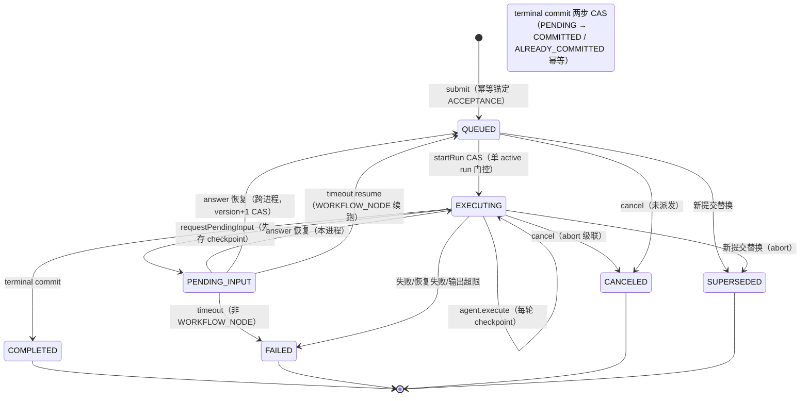
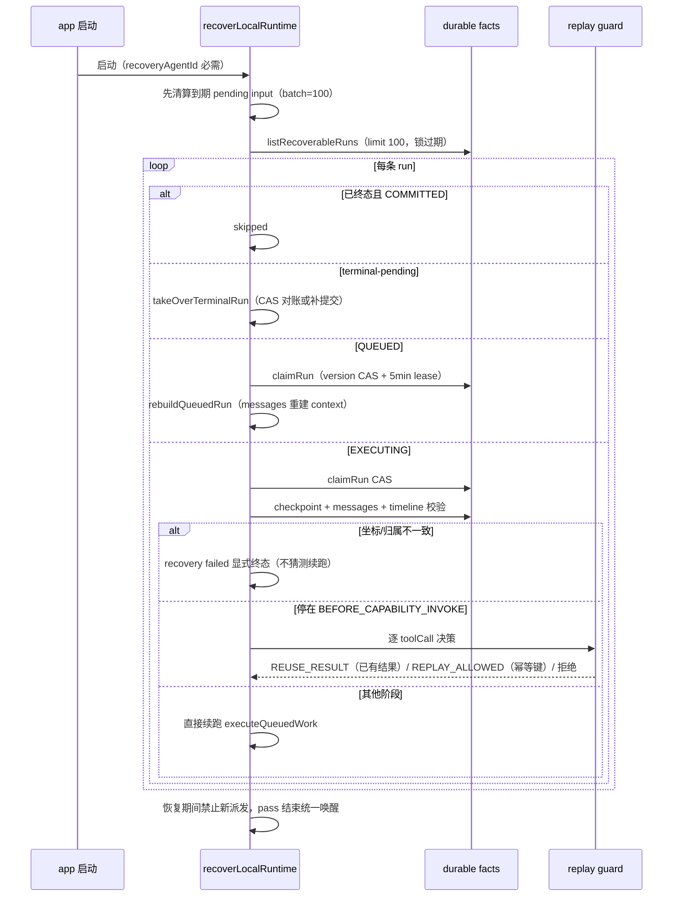

# NextAgent agent-runtime 任务控制与恢复实现设计文档

> 版本: 1.0 | 日期: 2026-08-25 | 基于源码 `agent-runtime/src/lifecycle/submit.ts`（RequestLifecycleCoordinator，7124 行）、`checkpoints/`、`recovery/`、`terminal/`、`agent-run-state-port.ts`、`agent-channel-web/src/routes/requests.ts`、`agent-platform-gateway-local/src/db/sqlite-gateway-core.ts`
>
> 主循环执行见 `docs/agent-loop引擎.md`；本文聚焦任务（RequestRun）的可控制（提交/取消/重试/编辑重提/超时/幂等）与可恢复（重启恢复/checkpoint/replay guard/terminal commit）。

---

## 目录

1. [背景与目标](#1-背景与目标)
2. [上下文：系统定位、术语与规格导航](#2-上下文系统定位术语与规格导航)
3. [架构总览](#3-架构总览)
4. [关键不变量与状态机](#4-关键不变量与状态机)
5. [提交与 Lane 调度](#5-提交与-lane-调度)
6. [取消（cancel）](#6-取消cancel)
7. [重试（retry）](#7-重试retry)
8. [编辑重提（edit-resubmit）](#8-编辑重提edit-resubmit)
9. [Pending Input 生命周期](#9-pending-input-生命周期)
10. [Checkpoint](#10-checkpoint)
11. [启动恢复（recovery）](#11-启动恢复recovery)
12. [Terminal Commit](#12-terminal-commit)
13. [幂等锚点事实表](#13-幂等锚点事实表)
14. [后台任务](#14-后台任务)
15. [安全设计](#15-安全设计)
16. [DFX：可观测、容量与可测试性](#16-dfx可观测容量与可测试性)
17. [关键数据结构与契约](#17-关键数据结构与契约)
18. [错误处理与降级](#18-错误处理与降级)
19. [附录 A：核心文件索引](#附录-a核心文件索引)
20. [附录 B：默认配置参数汇总](#附录-b默认配置参数汇总)

---

## 1. 背景与目标

### 1.1 问题定义

电信级长时任务的运行时必须回答四个问题，而每个问题都有失败模式：

| 问题 | 失败模式（不允许发生的） |
|------|------------------------|
| 用户提交后断连/重复点击 | 重复副作用（重复执行工具、重复写库） |
| 用户中途要停 | 取不掉（信号无法穿透模型/工具异步边界）、或取消后旧输出继续流出污染会话 |
| 进程崩溃/重启 | run 永久卡在 executing（僵尸任务）、或恢复时盲目重放工具造成重复副作用 |
| 多用户多会话并发 | 会话内状态竞争（同 session 两个 run 交叉写消息） |

此外电信运维对话普遍存在**长等待**（人工确认可能数十分钟）与**长任务**（割接检查超过模型轮次上限），要求暂停/恢复与后台化是一等能力而非异常路径。

### 1.2 设计目标

1. **每个 accepted request 恰有一个权威终态**：terminal commit 两步 CAS + ALREADY_COMMITTED 幂等；stream、RequestRun、visible history 三方一致。
2. **命令级幂等锚定**：submit/cancel/retry/edit 各有幂等键与语义，重复命令返回首次结果、语义冲突显式报错。
3. **取消全链路可传播**：AbortSignal 从 submit 层贯穿 agent-core/model/tool/sandbox；取消后 late output 被抑制（终稿豁免）。
4. **恢复以 durable facts 为准**：bounded recovery pass 只信 checkpoint + messages + timeline；不安全即显式 recovery failed terminal path，不猜测续跑。
5. **重放安全**：IDEMPOTENT capability 结果复用（REUSE_RESULT），非幂等能力默认不重放。
6. **同 session 串行**：lane 调度 + 单 active run 门控，跨 session 按优先级并行。

### 1.3 非目标

- **不做 PaaS 多实例 lease 恢复**：本地单实例 bounded recovery；多实例由 claim lease 防双主但恢复语义是本地的（spec `local-runtime-recovery` 明确不声明多实例能力）。
- **不做后台持续恢复**：恢复只在启动时执行一次 bounded pass；运行中不扫描僵尸 run。
- **不做会话内并发**：同 session 单 active run 是硬约束（需要并行请开新会话或 fork）。
- **不拥有请求执行语义**：模型调用、工具编排归 agent-core；本文只管生命周期、状态与持久化协调。

### 1.4 关键取舍记录

| 取舍 | 决策 | 理由 |
|------|------|------|
| 单协调器巨类（7124 行） vs 拆分 | 全部生命周期逻辑集中在 RequestLifecycleCoordinator | lane 队列/执行态/恢复/幂等的耦合本质上是同一状态机的不同切面；拆分会引入跨对象状态同步（代价已在 spec `session-lane-scheduling` ADR 讨论） |
| cancel 幂等锚 TERMINAL_COMMIT（非 ACCEPTANCE） | 取消的锚定事实是"终态提交"本身 | 取消命令的副作用就是终态；锚 ACCEPTANCE 会让"取消一个尚未取消的 run"与"重复取消"无法区分 |
| retry 复用 root 用户消息（requestId 不变） | 旧 attempt 消息隐藏（visible=false）而非删除 | 审计要求保留历史；model context 排除旧 attempt 由可见性过滤实现（context engine 消费） |
| late output 抑制豁免 `final:true` 终稿 | 取消中仍放行最终内容 delta | 取消命令自身触发的收尾内容（如 'Request canceled by user.'）需要到达前端 |
| bg-notify-\<taskId\> 续跑移除（2026-07-14 归档 change） | 后台任务完成静默（只发 timeline 事件） | 续跑 submit 会按 latest-replacement 规则 SUPERSEDE 原请求，产生用户不可预期的会话翻转 |
| 恢复扫描 limit 默认 100（clamp 1000） | bounded pass | 无界扫描会拖慢启动；残余 run 留在 durable 状态由下次重启或人工处理 |
| replay guard 只对 IDEMPOTENT capability 放行重放 | REUSE_RESULT 优先 | 非幂等工具（写操作）重放的重复副作用不可接受；宁可 recovery failed |

---

## 2. 上下文：系统定位、术语与规格导航

### 2.1 系统定位与上下游

```
agent-channel-web / agent-channel-task（命令入口）
        │ RuntimeCommandPort（submit/cancel/retryLatest/editLatest/answerPendingInput）
        ▼
┌───────────────────────────────────────────────────────┐
│ agent-runtime（本文）RequestLifecycleCoordinator        │
│  lane 调度 → executeQueuedWork → agent.execute          │
│  pending input deadline timer → 恢复 pass → 终态提交    │
└───┬────────────────┬───────────────┬───────────────────┘
    │                │               │
    ▼                ▼               ▼
agent-core       agent-platform-  agent-app
（Agent 执行；    gateway-local    （启动恢复接线、
 SubagentExec-    （SQLite:        background 完成
 utionPort 回环   request_runs/   回调、AI 日志
 提交 child run）  checkpoints/    postTerminal）
                  pending_inputs）
```

- **上游**：Web/task channel 经 port 契约提交命令；app composition 在启动时触发恢复与 pending input 处理。
- **下游**：全部持久化经 gateway-local SQLite（幂等锚点列、version CAS、claim lease）；对 agent-core 只暴露 beginRun/finishRun/requestPendingInput/saveCheckpoint 回调面。
- **同级协作**：context engine 消费 retry/edit 产生的可见性事实；可观测层消费 timeline 事件（见 `docs/agent-observability可观测设计.md`）。

### 2.2 术语表

| 术语 | 定义 |
|------|------|
| lane | 按 streamKey(tenant, subject, agent, session) 划分的串行调度队列；同 lane 内 FIFO + 单 active run |
| attempt | 同一 request 的第 N 次执行（retry 递增；attempt=1 为首次） |
| supersession | 新提交使同 lane 内旧 queued/executing run 直接进入 SUPERSEDED 终态 |
| terminal commit | 权威终态提交：两步 CAS（PENDING 过渡 + commitTerminal），事务内同写 message/activeContext/timeline |
| idempotency anchor | 幂等事实的锚定类型：ACCEPTANCE（受理事实）或 TERMINAL_COMMIT（终态事实） |
| pending input | runtime-owned 暂停点（QUESTION/CONFIRMATION/AUTHORIZATION/HUMAN_HANDOFF），带 deadline |
| producerRef | pending input 生产者（LIFECYCLE_HOOK/WORKFLOW_NODE/CAPABILITY_INVOCATION），决定超时恢复路径 |
| claim lease | 恢复期的 run 租约（lockedBy + lockExpiresAt + version CAS），防双实例接管同一 run |
| replay guard | 恢复期工具重放决策器：REUSE_RESULT（复用已持久化结果）/ REPLAY_ALLOWED（幂等可重放）/ 拒绝 |
| late output suppression | 取消后丢弃后续流事件（豁免 final:true 终稿）的执行期抑制 |
| guardBlockedRunIds | input guard 拦截轮的内存标记，驱动 terminal 消息 visible=false |

### 2.3 权威规格导航

| 主题 | 权威 spec |
|------|-----------|
| 最小内核（submit/terminal 一致性、架构约束） | `ts-minimal-agent-kernel` |
| lane 串行调度、单 active run、supersession | `session-lane-scheduling` |
| 取消（状态分类、级联、late output、幂等） | `request-cancel` |
| 重试（attempt、可见性替换、context 排除） | `request-retry` |
| 编辑重提（preflight、durable replacement） | `request-edit-resubmit` |
| pending input 生命周期（deadline、恢复、late answer） | `human-pending-input-core`、`human-pending-input-timeout`、`question-pending-input`、`confirmation-pending-input`、`authorization-pending-input`、`human-handoff` |
| Web 命令幂等 | `ts-web-command-idempotency` |
| 幂等契约（replay policy、稳定键） | `idempotency-contract` |
| 本地恢复（bounded pass、claim、recovery failed path） | `local-runtime-recovery` |
| 恢复重放守卫 | `runtime-recovery-idempotency-guard` |
| 终态可见性 | `ts-run-status-visibility`、`ts-stream-history-consistency` |
| checkpoint/会话 store | `gateway-store-provider-ownership` |
| 后台任务完成通知 | `background-task-completion` |
| 可靠性行为契约（在建） | active change `add-ts-reliability-test-gate`（spec-only） |

Feature/Function 追溯：F-2.1 ~ F-2.8、F-11.1 ~ F-11.5；FN-2.1 ~ FN-2.16、FN-11.1 ~ FN-11.10。

---

## 3. 架构总览

### 3.1 组件视图

```
┌────────────────────────────────────────────────────────────────────┐
│ Web channel（agent-channel-web/routes/requests.ts）                 │
│   POST /requests | /sessions/:id/requests → submit                  │
│   POST /sessions/:id/cancel → cancel                                │
│   POST /sessions/:id/retry → retryLatest                            │
│   POST /sessions/:id/requests/latest/edit → editLatest              │
│   answer pending input → answerPendingInput                         │
└──────────────┬─────────────────────────────────────────────────────┘
               ▼
┌────────────────────────────────────────────────────────────────────┐
│ RequestLifecycleCoordinator（submit.ts:363）                         │
│                                                                    │
│  内存态: pendingLaneWork Map<laneKey, QueuedRunWork[]>   (:369)     │
│         drainingLanes/blockedLanes Set                   (:370-371) │
│         executingRuns Map<runId, ExecutingRunState>       (:372)    │
│         guardBlockedRunIds（内存、非持久）                 (:375-381)│
│  laneKey = streamKey(tenant, subject, agent, session)    (:6664)    │
│                                                                    │
│  调度循环: wakeScheduler → runSchedulerLoop                         │
│    while (executing + inflight < maxConcurrent):                   │
│      reserveNextWork（跨 lane 按优先级选队首）                      │
│      dispatchReservedWork（单 session 单 active run 门控）          │
│        → startRun（CAS 置 EXECUTING）→ executeQueuedWork            │
│                                                                    │
│  执行: executeQueuedWorkCorrelated                                  │
│    setTimeout(requestTimeoutMs) → controller.abort()                │
│    runState.beginRun → agent.execute(run, context, signal)          │
│    终态分支: canceling/canceled→CANCELED; PENDING_INPUT→挂起;        │
│             正常→COMPLETED/FAILED/SUPERSEDED                        │
│    → commitExecutionTerminal                                       │
└──────────────┬─────────────────────────────────────────────────────┘
               ▼ 持久层（agent-platform-gateway-local SQLite）
   request_runs（幂等锚点列 + version CAS + claim lease）
   checkpoints / pending_inputs / messages / timeline events
               ▲
┌──────────────┴─────────────────────────────────────────────────────┐
│ 启动恢复 recoverLocalRuntime（submit.ts:2386）                       │
│   先清算到期 pending input → listRecoverableRuns（limit 100..1000）  │
│   terminal-pending → takeOverTerminalRun                           │
│   QUEUED/ACCEPTED/PLANNING → claim CAS → rebuildQueuedRun          │
│   EXECUTING → claim CAS → checkpoint 校验 → replay guard / 续跑     │
│   失败 → failRecoveredRun（recovery failed terminal path）          │
└────────────────────────────────────────────────────────────────────┘
```

### 3.2 逻辑视图：run 生命周期状态机全景



崩溃恢复覆盖：QUEUED 丢失（rebuildQueuedRun）、EXECUTING 崩溃（claim lease → checkpoint 校验 → replay guard/续跑）、terminal-pending（takeOverTerminalRun 接管）；不安全即 recovery failed 显式终态。

### 3.3 业务流程视图

**流程 A：用户取消一个执行中的请求（信号级联 + late output 抑制）**

```mermaid
sequenceDiagram
    participant U as 用户
    participant W as Web channel
    participant R as runtime
    participant A as agent 执行
    participant M as 模型/工具

    U->>W: 取消（幂等键，锚定 TERMINAL_COMMIT）
    W->>R: cancel
    R->>R: 状态分类（非 latest / terminal-pending / 已终态 → 分类拒绝）
    R->>A: executing.canceling = true; controller.abort()
    Note over A,M: AbortSignal 级联穿透模型流/工具/sandbox
    M-->>A: abort 异常
    A-->>R: 收敛 CANCELED
    R->>R: late output 抑制（豁免 final:true 终稿）
    R->>R: pending input 联动置 CANCELED
    R->>R: commitTerminal('Request canceled by user.', CANCELED)
    R-->>U: 终态（不含内部错误详情）
```

**流程 B：进程崩溃后的启动恢复**



---

## 4. 关键不变量与状态机

### 4.1 核心不变量

| # | 不变量 | 强制点 |
|---|--------|--------|
| R1 | 每个 accepted request 恰有一个权威终态 | terminal commit 两步 CAS + ALREADY_COMMITTED（terminal-commit.ts:127-188; sqlite:2196-2234） |
| R2 | 同 session 单 active run：dispatch 前检查 terminalPendingRun/executingRun，持久层 executingRuns>1 抛 LANE_EXECUTION_BLOCKED | dispatchReservedWork（submit.ts:4078-4138）; sqlite-gateway-core.ts:2109-2118 |
| R3 | run 状态推进全部经 version CAS（startRun/saveRun/claimRun/commitTerminal） | dispatcher.ts:6-20; sqlite CAS 实现 |
| R4 | 幂等键重复返回首次结果，语义冲突显式失败（SEMANTIC_CONFLICT） | loadRunByIdempotencyAnchor（submit.ts:6673-6714） |
| R5 | pending input 创建前必须先落 checkpoint（恢复坐标先行） | acceptPendingInput（agent-run-state-port.ts:346-364） |
| R6 | pending 超时永不等同批准/授权/答案（timeout terminal 语义独立） | timeoutPendingInput（submit.ts:2930-3037）；spec `human-pending-input-timeout` |
| R7 | 恢复只信 durable facts：checkpoint 坐标/归属/版本不一致 → recovery failed，不猜测续跑 | recoveryCheckpointFailureCode（submit.ts:4760-4812） |
| R8 | 只有具备稳定幂等键的 IDEMPOTENT capability 才允许恢复重放；已有结果优先复用 | replay guard（tool-replay-guard.ts:68-113） |
| R9 | 恢复期禁止新调度派发（recoveryDispatchGated），pass 结束统一唤醒 | submit.ts:2400, 2472-2476 |
| R10 | 取消终态内容不得包含内部错误描述；无流式正文统一为固定文案 | spec `request-cancel`；cancel 终端 content 选择 |
| R11 | late output 抑制不吞 final:true 终稿 | shouldSuppress 豁免（agent-run-state-port.ts:112-122） |
| R12 | 终态消息上限 150,000 字符、空内容降级 FAILED（附 DEGRADATION_NOTICE） | terminal-commit.ts:87-108 |

### 4.2 RunStatus 状态机

```
          submit                    startRun(CAS)                agent.execute 返回
  ────► QUEUED ─────────────────────► EXECUTING ───────────────────────┬────► COMPLETED
           │                              │  │                        │
           │ cancel(queued)               │  │ timeout(30min 默认)     ├────► FAILED
           ▼                              ▼  ▼                        │     （outputExceeded/异常/恢复失败）
        CANCELED ◄── canceling+abort ────┘  TIMED_OUT?                 │
           ▲                                 （经 abort 收敛为 CANCELED/FAILED）│
           │ supersede（新提交替换）                                    ├────► CANCELED
           ▼                                                            │     （cancel 命令终态）
        SUPERSEDED ◄── replaceOlderLaneWork（queued 直提/executing abort）│
                                                                        └────► PENDING_INPUT 挂起
                                                                              （answer 恢复/timeout 终态）
```

TerminalCommitState：`NOT_STARTED → PENDING → COMMITTED`（失败 → FAILED；恢复期可见 RETRYING 门控态）。

### 4.3 关键并发与竞态场景

| 场景 | 机制 | 结果 |
|------|------|------|
| 同 idempotencyKey 并发 submit | saveRun VERSION_CONFLICT → DUPLICATE_IDEMPOTENCY_KEY_CONFLICT；重放返回既有 run | 无重复副作用 |
| 双实例同时恢复同一 run | claimRun version CAS + lockedBy/lockExpiresAt lease（TTL 5min） | 只有一个实例接管；另一个 skipped |
| cancel 与终态提交竞速 | terminal-pending 状态分类（REQUEST_CANCEL_TERMINAL_PENDING retryable）+ ALREADY_COMMITTED 幂等 | 不产生第二终态 |
| 同 session 并发提交 | assertNoActivePendingInput + 调度侧单 active run 门控 + supersession 替换旧 work | 会话内严格串行 |
| pending input 回答与超时竞速 | answer 前检查 isPendingInputDue（已过期先执行 timeout 再拒绝） | late answer 被拒（PENDING_INPUT_TIMED_OUT） |
| 恢复期间新请求到达 | recoveryDispatchGated 阻断调度唤醒 | pass 完成后统一 wakeScheduler，无交叉执行 |
| 跨进程 pending input 答案恢复 | resolved.updatedAt ≠ answeredAt 分叉 → durable checkpoint 重建路径 | run 置回 QUEUED 重入队，不丢答案 |

---

## 5. 提交与 Lane 调度

### 5.1 submit 流程（`submit.ts:1037-1241`）

```
submit(command):
  1. 校验 idempotencyKey 非空 → SUBMIT_IDEMPOTENCY_REQUIRED      (:1038-1046)
  2. 解析/创建 session；agentId 不匹配 → SUBMIT_AGENT_SCOPE_MISMATCH (:1049-1061)
  3. priority = command.priority ?? 'NORMAL'                      (:1080)
  4. assertNoActivePendingInput → PENDING_INPUT_ACTIVE_CONFLICT   (:1093; 实现 2559-2585)
  5. assertSchedulerCapacity（全局队列深度门控）                    (:1094)
  6. requestId/runId/requestContextId：优先 reservedRequest 坐标    (:1097-1099)
  7. revalidateAttachmentAuthorities
     → REQUEST_SUBMIT_ATTACHMENT_UNAVAILABLE                      (:1100-1107)
  8. loadRunByIdempotencyAnchor(ACCEPTANCE) 命中 → 返回已有 run     (:1109-1122)
  9. 构造 RequestRun{status:'QUEUED', version:1,
     terminalCommitState:'NOT_STARTED', attempt:1}                 (:1127-1143)
     + RequestContext{agentTurnIndex:0, activeStepId:'turn-1',
       nextLifecycleStage:'BEFORE_MODEL_INVOKE',
       flowVariables:{input_question,...}}                         (:1144-1166)
 10. BEFORE_REQUEST_ACCEPT lifecycle hook                          (:1167-1178)
 11. persistUserMessage（幂等键 `${idempotencyKey}:root-message`）  (:1179; 实现 5900-5923)
 12. requestRunStore.saveRun(toRunRecord(run), {idempotencyKey, semantic})
     VERSION_CONFLICT → DUPLICATE_IDEMPOTENCY_KEY_CONFLICT          (:1184-1192)
     record.runId ≠ 新 runId（幂等重放）→ 返回既有 run               (:1196-1203)
 13. saveCheckpoint('RUN_ACCEPTED')                                (:1205)
 14. emitCanonical REQUEST_ACCEPTED {attempt:1, status:'QUEUED'}   (:1206-1211)
 15. guardBlockRefusal 分支：直接 commitTerminal COMPLETED          (:1223-1229)
 16. startSessionTitleGeneration（fire-and-forget）                 (:1230)
 17. replaceOlderLaneWork（supersede 旧队列/执行中 run）             (:1231)
 18. enqueueWork + 返回 {sessionId, requestId, runId, attempt:1}    (:1232-1233)
```

### 5.2 调度循环（单 lane 串行 + 跨 lane 优先级）

- `wakeScheduler`（:4021-4030）清空 blockedLanes，启动 `runSchedulerLoop`（:4032-4047）：`while (executingRuns.size + inflightCount < maxConcurrentRuns())` 内 `reserveNextWork()` + `dispatchReservedWork()`。
- `reserveNextWork`（:4049-4076）：跳过 draining/blocked lane；跨 lane 按 `priorityRank`（HIGH=3 / NORMAL=2 / LOW=1，:4166-4168）选队首；选中后 lane 加入 drainingLanes、inflightCount += 1。
- `dispatchReservedWork`（:4078-4138）：**单 session 单 active run 拒绝（调度侧）**——加载 `loadSessionLaneSnapshot`（:4090-4095），若 `terminalPendingRun !== undefined` 或存在其它 executingRun，把 work unshift 回队首并 blockLane（:4096-4101）；若 run 不在 durable queuedRuns（已被 cancel/supersede）则丢弃（:4103-4107）；否则 `startRun`（CAS 置 EXECUTING，`dispatcher.ts:6-20`，冲突抛 `RUN_START_CONFLICT`）。
- 持久层单 executing 不变量：`loadSessionLaneSnapshot` 中 `executingRuns.length > 1` 抛 `LANE_EXECUTION_BLOCKED`（`sqlite-gateway-core.ts:2109-2118`）。
- `maxConcurrentRuns` 未配置默认 Infinity（:4161-4164）；`assertSchedulerCapacity`（:2538-2557）：全局队列深度 ≥ maxPendingQueueDepth 时抛 `SCHEDULER_QUEUE_CAPACITY_EXHAUSTED`（retry 场景 `REQUEST_RETRY_QUEUE_UNAVAILABLE`）。

### 5.3 latest submit replacement / supersession

`replaceOlderLaneWork`（:4888-4910）：对 lane 快照中所有其它 queuedRuns：`removePendingWork` + `commitSupersededQueuedRun`（提交 `SUPERSEDED` 终态，内容 `'Request superseded by a newer request.'`，:4925-4939）；若存在其它 executingRun 且在本进程内：`executing.superseded = true; executing.controller.abort()`（:4903-4909），执行结束时提交 SUPERSEDED（:4243-4244）。

### 5.4 request 超时

`executeQueuedWorkCorrelated`（:4188-4365）：`timeout = setTimeout(() => executionState.controller.abort(), assembly.runtimeSettings.requestTimeoutMs ?? defaultRequestTimeoutMs)`（:4210）；`defaultRequestTimeoutMs = 1_800_000`（30 分钟，:150）；非 resume 时先 `saveCheckpoint('STEP_STARTED')`（:4211-4213），`runState.beginRun` → `agent.execute(run, context, controller.signal)`（:4214-4216）。终态分支（:4217-4347）：canceling/canceled → CANCELED；PENDING_INPUT → 挂起等待；正常 → COMPLETED / FAILED(outputExceeded) / SUPERSEDED；异常 → LIFECYCLE_HOOK_PENDING / 授权 pending / FAILED；finally 清 timeout、leaveExecutingRun、wakeScheduler（:4348-4364）。

---

## 6. 取消（cancel）

**流程**（`submit.ts:1533-1629`；入口 `POST sessions/:sessionId/cancel` → `runtime.cancel({action:'CANCEL', expectedLatestRequestId, idempotencyKey})`，routes/requests.ts:1401-1424）：

1. **幂等（TERMINAL_COMMIT 锚点）**：`loadRunByIdempotencyAnchor(command, agentId, 'TERMINAL_COMMIT', cancelCommandSemantic, 'REQUEST_CANCEL_IDEMPOTENCY_CONFLICT')`（:1546-1556），命中即返回 accepted。
2. **可取消状态分类**（:1563-1593）：
   - `expectedLatestRequestId ≠ latestRequestId` → `REQUEST_CANCEL_NOT_LATEST`
   - `terminalCommitState ∈ {PENDING, RETRYING}` → `REQUEST_CANCEL_TERMINAL_PENDING`（retryable）
   - 已终态 → `REQUEST_CANCEL_ALREADY_TERMINAL`
   - target 不存在 → `REQUEST_CANCEL_NOT_FOUND`
3. **executing 分支**（:1597-1603）：`executing.canceling = true`；记录 cancelIdempotencyKey/Semantic；`executing.controller.abort()`（AbortSignal 级联到 agent.execute）。终态提交在 executeQueuedWorkCorrelated 的 cancel 分支完成（:4217-4235 / :4275-4293），cancelIdempotencyKey 作为 terminal commit 幂等键传入。
4. **queued 分支**（:1604-1616）：`removePendingWork`（:4912-4923）→ `commitCanceledRun`（:4941-4981）：`commitTerminal(..., 'Request canceled by user.', 'CANCELED', {idempotencyKey...})`，随后复核 durable 状态——已 CANCELED+COMMITTED → markRunTerminalized；仍 PENDING/RETRYING → 等待恢复；其它终态 → `REQUEST_CANCEL_ALREADY_TERMINAL`；否则 `REQUEST_CANCEL_COMMIT_UNAVAILABLE`。
5. **late output suppression（取消后输出抑制）**：`runState` 构造时注入 `shouldSuppress: (run) => executing?.canceling || executing?.canceled || executing?.terminalized`（:421-424）；抑制逻辑（`agent-run-state-port.ts:112-122`）取消中丢弃事件，但**豁免 `LLM_CONTENT_DELTA final:true` 的终稿内容**；`guardBlockedRunIds` 驱动 terminal 消息 `visible=false`。
6. **pending input 联动**：`cancelActivePendingForRun`（:1617；实现 2587-2619）将 active pending input 置 CANCELED（幂等键 `${command.idempotencyKey}:pending-input-cancel:${pendingInputId}`），并发 `USER_INPUT_CANCELED` 事件。

取消边界常量 `runtimeCancellationBoundary = { propagatesAbortSignal: true, exposesUserCancelRoute: false }`（`lifecycle/cancellation.ts:1`）。

---

## 7. 重试（retry）

**流程**（`submit.ts:1631-1879`；入口 `POST sessions/:sessionId/retry`，routes/requests.ts:1426-1450）：

1. **幂等（ACCEPTANCE 锚点）**（:1644-1673）：命中后校验是"继承 attempt（attempt=1 且无 retryOfRunId）"或"普通 retry（attempt>1 且有 retryOfRunId）"且 requestId 匹配，否则 `REQUEST_RETRY_IDEMPOTENCY_CONFLICT`；`isRetryQueueUnavailableRun` 探测旧的失败兜底 run（:1663-1670；实现 5500-5522：FAILED+COMMITTED 且内容 `'Request failed safely: REQUEST_RETRY_QUEUE_UNAVAILABLE'`）。
2. **retryable 状态分类**（:1696-1722）：terminalCommitState PENDING/RETRYING → `REQUEST_RETRY_TERMINAL_PENDING`（retryable）；非终态或未 COMMITTED → `REQUEST_RETRY_NOT_TERMINAL`；`attempt >= 1 + 5` → `REQUEST_RETRY_LIMIT_EXCEEDED`；非 latest → `REQUEST_RETRY_NOT_LATEST`。
3. **新 attempt 创建**（:1749-1767）：新 runId（前缀 `run-retry`）、新 requestContextId（`context-retry`）、**requestId 复用 root 用户消息**（:1725）；`attempt = source.attempt + 1`；`retryOfRunId = source.runId`；taskEventId 透传。
4. **旧 attempt 历史可见性替换**（:1872；实现 5349-5367）：`cleanupSupersededRunAnnotations`（:5369-5393，删除旧 run 批注）+ `hideReplacedAttemptMessages`（:4983-5013）：对旧 run 的全部非 USER 消息 `hideMessage(reason:'RETRY_REPLACED', ...)`——**model context 排除被替换 attempt 输出即通过 visible=false**（上下文装配只取 visible 消息）；hide 失败降级发 `REQUEST_RETRY_VISIBILITY_UNAVAILABLE` DEGRADATION_NOTICE。
5. **attachment 复校验**（:1734-1748；实现 5425-5498）：逐个加载附件，校验 session/request/run 归属 + `validationStatus='ACCEPTED'` + `availabilityStatus='AVAILABLE'`，失败抛 `REQUEST_RETRY_ATTACHMENT_UNAVAILABLE`。
6. 保存/入队（:1804-1877）：saveRun（retry 语义）→ saveCheckpoint('RUN_ACCEPTED') → enqueueWork（startDispatch:false；入队失败 commitTerminal FAILED `'Request failed safely: REQUEST_RETRY_QUEUE_UNAVAILABLE'`）→ REQUEST_ACCEPTED 事件 → 可见性替换 → wakeScheduler。

---

## 8. 编辑重提（edit-resubmit）

**流程**（`submit.ts:1881-2059`；入口 `POST sessions/:sessionId/requests/latest/edit`，routes/requests.ts:1452-1511）：

1. **幂等锚点（ACCEPTANCE）**（:1891-1902）：命中 existingEditRun 则补可见性后返回。
2. **preflight latest**（:1905-1924）：lane 快照无 latest（且非可继承 fork 源）→ `EDIT_LATEST_NOT_FOUND`；`expectedLatestRequestId ≠ latestRequestId` → `EDIT_LATEST_NOT_LATEST`。
3. **新 root 用户消息 append（durable）**（:2007；实现 5900-5923）：新 requestId（前缀 `request-edit`）/runId（`run-edit`）/requestContextId（`context-edit`），USER 消息幂等键 `${idempotencyKey}:root-message`；saveRun 作为 durable replacement（VERSION_CONFLICT → `EDIT_LATEST_IDEMPOTENCY_CONFLICT`）。
4. 流程要点：`assertSchedulerCapacity`（:1904）；attachment 复校验（:1931-1938）；BEFORE_REQUEST_ACCEPT hook（:1989-2006）；saveCheckpoint('RUN_ACCEPTED')（:2032）；REQUEST_ACCEPTED 事件含 `editedFromRequestId`（:2033-2047）；guardBlockRefusal 分支直接 COMPLETED 终态 + 隐藏源消息（:2048-2054）；正常路径 replaceOlderLaneWork + enqueueWork（:2055-2056）。
5. **旧 root 消息替换**：`hideEditedSourceRequestMessages`（:2057；实现 5333-5347）——`hideRequestMessages(requestId: expectedLatestRequestId, reason:'EDIT_REPLACED', ...)` 将旧 root 消息整体隐藏。

---

## 9. Pending Input 生命周期

- **requestPendingInput**（`agent-run-state-port.ts:292-306` → `acceptPendingInput` :308-425）：同 session 已有 active pending → `PENDING_INPUT_ACTIVE_CONFLICT`（:323-341）；**先保存 checkpoint**（CAPABILITY_BEFORE_CALL 默认触发，幂等键 `${run.runId}:pending-input-checkpoint:${pendingInputId}`，:346-364）；创建 `PendingInputRecord{status:'PENDING'}`（:383-403）；发 `USER_INPUT_REQUIRED` 事件（:405-420）；finally `onPendingInputCreated(timeoutAt)`（:421-423）。
- **deadline**：默认 30 分钟（`pendingInputDefaultTimeoutMs` :59）；显式上限 24 小时（:60-61）；`acceptedPendingInputTimeoutAt`（:496-521）：显式 timeoutAt 直接用；AskUserQuestion 配置可用则用配置（须 0 < t ≤ 24h）；否则 30 分钟默认。questions ≤ 20（:533）。
- **deadline-driven single-flight timer**（submit.ts）：
  - `notifyPendingInputCreated`（:2778-2784）→ `considerPendingInputTimeoutWake` → `armPendingInputTimeoutTimer`（:2792-2812，单 timer + unref）。
  - `processPendingInputTimeoutFacts`（:2814-2860）**single-flight**：已在跑则置 reconcile 标志复用同一 promise；失败指数退避 `min(1s * 2^attempt, 30s)`（:2862-2866）。
  - `runPendingInputTimeoutPass`（:2868-2928）：以 **batch=100** 分页 `listUnresolvedPendingInputTimeoutFacts`（按 `timeoutAt, pendingInputId` cursor）；到期的 `timeoutPendingInput`，未到期记录最小 nextTimeoutAt；批间 setImmediate 让路。
  - `timeoutPendingInput`（:2930-3037）：resolve TIMED_OUT（幂等键 `${requestRunId}:pending-input-timeout:${pendingInputId}`）；发 `USER_INPUT_TIMEOUT`；**WORKFLOW_NODE 来源走 resumePendingInputTimeout 续跑**（:3014-3015，实现 3534+）；否则 commitTerminal FAILED `'Request failed safely: PENDING_INPUT_TIMEOUT'`（:3017-3030）。
- **startup recovery**：`startPendingInputTimeoutProcessing`（:2760-2776）由 app 启动调用（`agent-app/src/composition/app-lifecycle-composition.ts:112`，在 recoverLocalRuntime 之后）；恢复扫描也先 `processPendingInputTimeoutFacts()`（:2408）。
- **late-answer rejection**（`answerPendingInput`，:2061-2384）：已 CANCELED → `PENDING_INPUT_CANCELED`；已 TIMED_OUT → `PENDING_INPUT_TIMED_OUT`；已过期 → 先执行 timeout 再拒绝。resolve 幂等（`['pending-input-resolve-v1', id, 'RECEIVED', answers]` 语义）。
- **本进程 vs 跨进程恢复分叉**（:2210-2382）：`resolved.record.updatedAt === answeredAt`（本进程刚写入）→ 按 producerRef 分类：确认 reject → terminalize；授权 deny → terminalize；授权 approve → `resumeAuthorizedRun`（:3103-3184：从 checkpoint+messages 重建 context，重排 QUEUED 并 enqueueWork，flowVariables 注入 riskPolicyAuthorization）；human handoff 终答 → terminalize；否则 `resumePendingRun`。否则（跨进程/恢复）：加载 durableRun + checkpoint，用 `stageFromCheckpoint` 确定恢复阶段，`reconstructRecoveryContext` 重建（flowVariables 注入 `pendingHookResume`）；BEFORE_AGENT_TERMINAL 阶段直接补提交终态；否则 run 置回 QUEUED（version+1 CAS）并 enqueueWork。

---

## 10. Checkpoint

**文件**: `packages/agent-runtime/src/checkpoints/checkpoint-calls.ts`（+ noop store :3-11）

- **触发原因清单**（`agent-common/src/index.ts:153-161`）：`RUN_ACCEPTED | STEP_STARTED | CAPABILITY_BEFORE_CALL | CAPABILITY_AFTER_RETURN | CONTEXT_COMPACTED | TERMINAL_COMMIT_PENDING | TERMINAL_COMMITTED | TERMINAL_PENDING_COMMIT_TAKEOVER`。
- **保存** `saveRuntimeCheckpoint`（:5-42）：先 loadActiveContext（失败容忍），构造 `CheckpointRecord`（runVersion = run.version、agentTurnIndex = context.agentTurnIndex、lastSequence 恒 0、activeContextVersion、flowVariables）；默认幂等键 `${run.runId}:checkpoint:${triggerReason}:${run.version}:${context.agentTurnIndex}`（:38-39）。
- 保存点位置：submit/retry/edit 的 RUN_ACCEPTED（:1205, :1836, :2032）、派发 STEP_STARTED（:4212）、terminal 前置 TERMINAL_COMMIT_PENDING（`terminal-commit.ts:109`、submit.ts:5942）、pending input 前置（agent-run-state-port.ts:346-355）。
- **阶段映射（恢复坐标）** `stageFromCheckpoint`（:4844-4852）：`CAPABILITY_BEFORE_CALL/AFTER_RETURN → BEFORE_CAPABILITY_INVOKE`；`TERMINAL_COMMIT_PENDING → BEFORE_AGENT_TERMINAL`；其余 → `BEFORE_MODEL_INVOKE`。
- **最小 Agent turn 恢复坐标**：`reconstructRecoveryContext`（:4703-4758）用 `checkpoint.agentTurnIndex` 作为恢复 turn（:4721），校验 `0 ≤ agentTurnIndex ≤ maxTurns`（默认 50，:4724），恢复 `activeStepId = 'turn-${agentTurnIndex+1}'`（:4752）、`flowVariables = checkpoint.flowVariables`（:4756）。

---

## 11. 启动恢复（recovery）

主流程 `recoverLocalRuntime`（`submit.ts:2386-2477`），由 `app-lifecycle-composition.ts:144-157`（best-effort）触发：

```
recoverLocalRuntime(options):
  recoveryAgentId 必需（RECOVERY_AGENT_SCOPE_UNAVAILABLE）            (:2387-2396)
  limit = clamp(options.limit ?? 100, 1, 1000)                        (:2397)
  lockedBy = options.lockedBy ?? 'runtime-recovery-${uuid}'           (:2398)
  lockTtlMs = options.lockTtlMs ?? 300_000（5 分钟 lease）             (:2399)
  recoveryDispatchGated = true（恢复期间禁止调度派发）                  (:2400)
  await processPendingInputTimeoutFacts()  # 先清算到期 pending input  (:2408)
  records = requestRunStore.listRecoverableRuns({agentId, now, limit})(:2409)
  for record in records:
    已 terminal 且 COMMITTED → skipped++                               (:2411-2414)
    terminalCommitState ∈ {PENDING, RETRYING}
      → takeOverTerminalRun(record) 失败则 failed++                    (:2416-2421)
    status ∈ {QUEUED, ACCEPTED, PLANNING}
      → claimRecoverableRun(CAS claim) 未抢到 skipped++
        否则 rebuildQueuedRun → rebuiltQueued++                        (:2422-2431)
    status == 'EXECUTING'
      → 有 active pending input → skipped++（等待 answer/timeout）
        claim CAS → recoverClaimedExecutingRun 失败则 failed++         (:2432-2452)
    单条异常 → failRecoveredRun(record, code)，failed++                (:2455-2468)
  finally: recoveryDispatchGated = false; wakeScheduler()              (:2472-2476)
```

- `listRecoverableRuns` SQL（`sqlite-gateway-core.ts:2165-2194`）：`lock_expires_at IS NULL OR <= now`，且（非终态 + commit_state ∈ NOT_STARTED/PENDING/RETRYING）或（终态 + PENDING/RETRYING），按 updated_at ASC。
- **claim lease**：`claimRun({expectedVersion, lockedBy, lockExpiresAt: now + ttl})`；SQLite 事务内 version CAS + 写锁定列（:2133-2149）。
- **EXECUTING 恢复** `recoverClaimedExecutingRun`（:4436-4552）：
  1. checkpoint 缺失 → `RECOVERY_MISSING_CHECKPOINT`
  2. assembly 解析失败 → `RECOVERY_MISSING_ASSEMBLY`
  3. messages（includeHidden，limit 100）+ timeline events（limit 1000）+ activeContext 加载
  4. `recoveryCheckpointFailureCode`（:4760-4812）：checkpoint 坐标不匹配 / stage 不一致 / runVersion 越界 / lastSequence 超前 / activeContextVersion 超前 → `RECOVERY_CHECKPOINT_MISMATCH`；消息/事件 owner 不匹配或 BEFORE_CAPABILITY_INVOKE 无 assistant tool-use 消息 → `RECOVERY_CAPABILITY_RESULT_INCONSISTENT`
  5. stage = BEFORE_AGENT_TERMINAL → takeOverTerminalRun；BEFORE_CAPABILITY_INVOKE → **replay guard**；否则直接续跑 executeQueuedWork。
- **replay guard**（`recovery/tool-replay-guard.ts:68-113`）：事实校验 `validateRecoveryFacts`（:115-155）；每个 toolCall：已有 CAPABILITY_RESULT 消息 → **REUSE_RESULT**（幂等复用）；CAPABILITY_AFTER_RETURN 却无结果 → `RECOVERY_CAPABILITY_RESULT_INCONSISTENT`；descriptor 不可解析 → `RECOVERY_CAPABILITY_DESCRIPTOR_UNAVAILABLE`；幂等键不可得 → `RECOVERY_IDEMPOTENCY_KEY_UNAVAILABLE`；否则 **REPLAY_ALLOWED**（携带稳定幂等键 `deriveCapabilityInvocationIdempotencyKey(runId, toolCallId)` = `${runId}:${toolCallId}`，`agent-common/src/index.ts:431-433`）。
- **recovery failed terminal path**：`failRecoveredRun`（:4814-4842）——`commitTerminal(..., 'Request failed safely during local runtime recovery: ${code}', 'FAILED', ...)`（保留原 terminalCommitIdempotencyKey 维持幂等）。
- terminal-pending 接管 `takeOverTerminalRun`（:4554-4586）：timeline 已有 terminal 事件则 CAS 对账；否则补提交；`failIfTerminalStillUnstable`（:4621-4633）兜底失败。

---

## 12. Terminal Commit

**文件**: `packages/agent-runtime/src/terminal/terminal-commit.ts`

```
commitTerminalOutcomeWithHookResultSnapshot(run, ...):            (:70-206)
  1. guardBlocked 与 guardBlockedVisible 互斥                        (:81-83)
  2. COMPLETED 且内容为空 → DEGRADATION_NOTICE(MODEL_FINAL_CONTENT_EMPTY)
     + 降级 FAILED                                                   (:87-97)
  3. COMPLETED 且 content > 150_000 字符
     → DEGRADATION_NOTICE(TERMINAL_MESSAGE_LIMIT_EXCEEDED) + FAILED   (:98-108)
  4. saveCheckpoint('TERMINAL_COMMIT_PENDING')                        (:109)
  5. pending = {…run, terminalCommitState:'PENDING', version+1}
     saveRun(pending, {expectedVersion: run.version})   # CAS 第一步   (:110-122)
  6. terminalIdempotencyKey = options.idempotencyKey
     ?? `${run.runId}:terminal-commit`                                (:111)
  7. commitTerminal({expectedVersion: pending.version, ...})          (:127-185)
  8. ALREADY_COMMITTED → 返回 undefined（幂等短路，不重复写消息/事件）(:186-188)
  9. 非 COMMITTED → saveRun({terminalCommitState:'FAILED', status:'FAILED',
     version+1}, CAS) → 返回 undefined                                (:189-203)
 10. COMMITTED → 返回 terminalEvent                                   (:205)
```

- `TerminalCommitState = 'NOT_STARTED' | 'PENDING' | 'RETRYING' | 'COMMITTED' | 'FAILED'`（`agent-common/src/index.ts:103`；运行时主流程显式使用前四态之外还有 RETRYING 出现在恢复门控判断中）。
- **SQLite CAS 实现**（`sqlite-gateway-core.ts:2196-2234`）：事务内：run 缺失 → NOT_FOUND；已 COMMITTED → **ALREADY_COMMITTED**；version 不匹配 → VERSION_CONFLICT；否则置终态 + version+1，并在**同一事务内** saveMessageSync + appendActiveContextItemSync + appendTimelineEventSync（:2223-2231）——复合持久化单事务完成。
- 协调器包装 `commitTerminal`（submit.ts:5930-6035）：可选 BEFORE_AGENT_TERMINAL terminal hook；成功后 markRunTerminalized + 发布 terminal 事件 + postTerminalCallback（fire-and-forget）；返回 undefined（远端 oversized 等失败）时发 **LIVE_ONLY fallback terminal 事件**避免前端卡死（:6018-6034）。
- 执行边界包装 `commitExecutionTerminal`（:4367-4405）：失败 → markRunTerminalized + fallback 事件 + 抛 `TerminalCommitBoundaryError`。

---

## 13. 幂等锚点事实表

- 锚点类型 `RequestRunIdempotencyAnchor = 'ACCEPTANCE' | 'TERMINAL_COMMIT'`（`agent-contracts/src/gateway/index.ts:930`）。
- 事实表实现：`request_runs` 表列 `idempotency_key / idempotency_semantic / terminal_commit_idempotency_key / terminal_commit_idempotency_semantic`（契约 :859-860；建列 `sqlite-gateway-core.ts:6203-6219`）。查询：ACCEPTANCE 按 `idempotency_key` 列（:6170-6184）；TERMINAL_COMMIT 按 `terminal_commit_idempotency_key` 列（:6186-6201）；语义不匹配 → SEMANTIC_CONFLICT。
- 运行时封装 `loadRunByIdempotencyAnchor`（submit.ts:6673-6714）。

| 命令 | 锚点 | 语义函数 | 存储键 |
|---|---|---|---|
| submit（:1109-1122, 1180-1183） | ACCEPTANCE | `submitIdempotencySemantic`（:6724-6747，JSON 全量命令字段；含 taskEventId 时折叠 `task-event-v1:sha256:...`） | `request_runs.idempotency_key` |
| cancel（:1546-1556） | **TERMINAL_COMMIT** | `cancelCommandSemantic`（:6763-6773） | `terminal_commit_idempotency_key` |
| retry（:1644-1651, 1804-1807） | ACCEPTANCE | `retryCommandSemantic`（:6775-6785） | `idempotency_key` |
| editLatest（:1891-1898, 2008-2011） | ACCEPTANCE | `editLatestCommandSemantic`（:6787-6799） | `idempotency_key` |
| reserveSubmit（:966-1031） | intake reservation | `reserveSubmitCommandSemanticHash`（:6749-6761，sha256） | attachment intake 表 |
| capability 调用 | — | — | `${runId}:${toolCallId}`（agent-common:431-433） |
| checkpoint | — | — | `${runId}:checkpoint:${reason}:${version}:${turnIndex}` |
| terminal commit（默认） | — | — | `${runId}:terminal-commit`（terminal-commit.ts:111） |
| pending input resolve | — | `['pending-input-resolve-v1/v2', id, status, answers(, kinds)]`（:4002-4011） | pendingInputStore resolve options |
| pending input timeout | — | `['pending-input-resolve-v1', id, 'TIMED_OUT']` / `['pending-input-timeout-terminal-v1', id]` | `${runId}:pending-input-timeout(terminal):${id}` |
| root USER 消息 | — | — | `${idempotencyKey}:root-message`（:5921） |

通用约束：`IDEMPOTENCY_KEY_MAX_LENGTH = 256`（`agent-common/src/index.ts:442-449`，超长折叠 sha256）。作用域均为 tenant+subject+agent+session。

---

## 14. 后台任务

- 时间线事件类型 `BACKGROUND_TASK_STARTED | BACKGROUND_TASK_COMPLETED | BACKGROUND_TASK_FAILED`（`agent-common/src/index.ts:131-133`）。
- **自然完成回调（当前实现，静默、无续跑）**：`buildBackgroundCompletionCallback`（`agent-app/src/composition/background-completion.ts:113-130`）——`backgroundTaskStore.markCompleted` 后 `emitBackgroundTaskTerminal`（:53-84，best-effort）；注释明确 "Completion is silent w.r.t. the agent (no continuation run)"（:104-112）。
- **bg-notify-<taskId> 续跑机制：当前源码中不存在**（全仓库无 `bg-notify` 字符串）。历史行为记录于 `openspec/changes/archive/2026-07-14-fix-background-task-completion-continuation/`（曾以该幂等锚定续跑 submit，因按 latest-replacement 规则 SUPERSEDE 原请求而被移除）。
- kill 路径也不通知：`agent-app/src/composition/channel-composition.ts:362-378`（kill → `sandboxGateway.killBackground` + `store.markKilled`）。

---

## 15. 安全设计

### 15.1 Owner Scope 与 Agent Scope 强制点

| 事实/操作 | scope | 强制点 |
|-----------|-------|--------|
| lane 键 | streamKey(tenantId, subjectId, agentId, sessionId) | submit.ts:6664-6671（调度隔离的物理边界） |
| 幂等锚点查询 | tenant+subject+agent+session 作用域 | loadRunByIdempotencyAnchor（submit.ts:6673-6714） |
| submit agent 校验 | session.agentId 与命令不匹配 → SUBMIT_AGENT_SCOPE_MISMATCH | submit.ts:1049-1061 |
| 恢复作用域 | recoveryAgentId 必需；listRecoverableRuns 按 agentId 过滤 | submit.ts:2387-2409 |
| pending input 事实查询 | Agent-scoped 稳定 keyset（1..1000） | gateway 契约（gateway/index.ts:1720-1729） |
| checkpoint | CheckpointRecord extends OwnerScoped | 契约（gateway/index.ts:1609-1623） |
| 子代理提交 | parent 坐标透传 + child 独立 owner-scoped session | subagent-execution-port.ts:72-84 |

### 15.2 不可信输入边界

| 边界 | 不可信内容 | 防护 |
|------|-----------|------|
| Web 请求体 | idempotencyKey、inputText、routingConstraints | channel 层 schema 校验（TypeBox/Ajv，spec `web-channel-input-security`）；targetSkill/targetRecipe 服务端才可产生；idempotencyKey 长度 ≤256（超长折叠 sha256） |
| expectedLatestRequestId | 客户端声明的"最新请求"坐标 | 与 durable lane 快照比对，不符即 NOT_LATEST/STALE 拒绝（防操作错对象） |
| pending input 答案 | 用户提交的 answer 内容 | answerPendingInput 状态机校验 + resolve 语义幂等；answers 进入 flowVariables 前为结构化字段 |
| resumeState（workflow） | 恢复状态 JSON | recipe 匹配校验（WORKFLOW_RESUME_RECIPE_MISMATCH）；见 `docs/agent-workflow执行引擎.md` §17 |

### 15.3 敏感数据流与最小暴露

- **取消终态内容固定化**：canceled 终态消息统一 `Request canceled by user.`，不携带执行阶段错误描述（R10）；恢复失败终态 `Request failed safely during local runtime recovery: ${code}` 只含错误码。
- **guardBlocked 轮隐藏**：input guard 拒绝轮的 terminal 消息 visible=false + modelVisibility 排除标记（内存 guardBlockedRunIds 驱动）。
- **幂等键脱敏**：幂等键含业务坐标（runId 等），按 spec `idempotency-contract` 必须脱敏后才可入日志。
- **timeline 事件安全投影**：本文产生的全部事件经统一 observation 脱敏管道（见 `docs/agent-observability可观测设计.md` §8）。

### 15.4 权限模型（本能力相关）

- **命令授权前置**：所有命令入口（Web/task channel）先过 channel/auth 边界获得 trusted identity，runtime 只消费可信身份（不读请求体身份字段）。
- **authorization pending input**：REQUIRE_AUTHORIZATION 风险决策创建授权暂停；approve 后凭 flowVariables.riskPolicyAuthorization 恢复执行——授权绑定单次受限操作（spec `authorization-pending-input`）。
- **恢复接管权**：claim lease 是"谁有权恢复"的互斥凭证；lease 过期后其他实例可接管（TTL 5 分钟平衡崩溃检测与误接管）。

---

## 16. DFX：可观测、容量与可测试性

### 16.1 可观测信号（本能力产出）

| 信号 | 类型 | 来源 |
|------|------|------|
| `REQUEST_ACCEPTED/TERMINAL_COMMITTED/REQUEST_EXECUTION_STARTED/ENDED/REQUEST_FIRST_CONTENT_DELIVERED/USER_INPUT_*` | timeline 事件（canonical） | emitCanonical 系列（submit.ts） |
| `REQUEST_REJECTED/REQUEST_CONTROL_REJECTED/PENDING_INPUT_REJECTED/RESERVE_SUBMIT_REJECTED` | observation event（命令拒绝） | runtime-command-wrapper.ts:147-197 |
| `RECOVERY_SCAN_*`、`LANE_DRAIN_*` | observation event（system boundary，trace 投影） | 恢复与 lane 观察 |
| `runtime.run.turn_completed`、`runtime.subagent.submitted/settled/exception_captured` | runtime 日志 | submit.ts / subagent-execution-port.ts |
| 内部生命周期观察（scheduler 状态转移、lane drain、恢复、terminal 降级、shutdown） | observation event | spec `internal-lifecycle-observability` |
| 请求级指标（request_outcome_total/duration/phase_duration/first_content_latency/active_concurrency/abnormal_termination） | metrics | metric-descriptors（见 `docs/agent-observability可观测设计.md` §9） |

### 16.2 容量与性能

| 维度 | 值/约束 | 来源性质 |
|------|---------|---------|
| request 超时 | 1,800,000 ms（30min；assembly runtimeSettings 可覆盖） | 固定常量 |
| 每 request 重试上限 | 5（attempt ≤6） | 固定常量 |
| pending input deadline | 默认 30min，显式上限 24h | 固定常量 |
| pending input 扫描批 / 退避 | 100 / 1s 指数退避上限 30s | 固定常量 |
| 恢复扫描 limit / claim lease TTL | 100（clamp 1000）/ 300,000 ms | 固定常量 |
| maxConcurrentRuns / maxPendingQueueDepth | 未配置 Infinity / 不限 | scheduler 配置 |
| 事件 replay 预算 | 批 1000 / 总 10000 / 时长 30s | 固定常量 |
| 订阅者 / 订阅队列 | 10 / 1000（硬上限 2000） | 固定常量 |
| Submit/Cancel/Retry 响应延迟、Lane 并发正确性、TTFT | 性能门禁 | spec `ts-performance-test-gate` |

### 16.3 可测试性与验证入口

```bash
# 单元/契约：lane 调度、cancel/retry/edit 幂等、恢复分类、replay guard、terminal CAS
npm test
npm run test:contract

# 恢复门禁（release 配置）
npx vitest run --config vitest.config.release.ts tests/agent-kernel/

# 架构边界
npm run lint:architecture

# 规格一致性
openspec validate --all --strict
```

关键回归面：幂等锚点四命令矩阵（重放/语义冲突）、双实例 claim 竞争、terminal-pending 接管、replay guard 三态、late answer 拒绝、supersession 替换、guardBlocked 隐藏轮、恢复失败显式终态。

### 16.4 扩展点

| 扩展 | 方式 | 边界 |
|------|------|------|
| 新运行时命令 | RuntimeCommandPort 增加方法 + 幂等锚点语义 | 必须先有 OpenSpec change；命令幂等键与作用域进锚点事实表 |
| 自定义恢复策略 | 替换 recoverLocalRuntime options（limit/lockedBy/lockTtlMs） | bounded 语义与 recoveryDispatchGated 不变量不可绕过 |
| pending input 新 kind | producerRef + kind 扩展 | 必须走 requestPendingInput 桥（runtime-owned）；deadline 语义复用 |

---

## 17. 关键数据结构与契约

```typescript
// agent-contracts/src/runtime/index.ts:332-352
RequestRun = { runId, sessionId, requestId, agentId, agentVersion, agentAssemblyRef,
  attempt, retryOfRunId?, parentRunId?, parentRequestId?, priority?,
  status: RunStatus, version, terminalCommitState,
  lockedBy?, lockExpiresAt?, deadlineAt?, createdAt, updatedAt }

// :1190-1208
RuntimeCommandPort = { reserveSubmit?, submit, cancel, retryLatest, editLatest,
  answerPendingInput, hideRunMessages? }

// agent-contracts/src/gateway/index.ts:1609-1623
CheckpointRecord (extends OwnerScoped) = { agentId, checkpointId, sessionId,
  requestId, runId, requestContextId, runVersion, agentTurnIndex,
  triggerReason, lastSequence, activeContextVersion, flowVariables, savedAt }

// :1687-1704
PendingInputRecord = { agentId, pendingInputId, requestRunId, sessionId, requestId,
  requestContextId, checkpointId, kind, request: PendingInputRequestRecord,
  producerRef: PendingInputProducerRef, status, createdAt, updatedAt,
  authorizationScope?, responseAnswers?, responseAnswerKinds? }

// :920-928
SessionLaneSnapshot = { latestRequestId?, latestRun?, executingRun?,
  queuedRuns, terminalPendingRun? }

// gateway:1668-1678
PendingInputProducerRef = LIFECYCLE_HOOK | WORKFLOW_NODE{recipeName,nodeId,nodeType,executionId}
  | CAPABILITY_INVOCATION

// submit.ts:335-345（内部）
ExecutingRunState = { controller: AbortController, superseded, canceling, canceled,
  pendingInput, terminalized, cancelIdempotencyKey?, cancelIdempotencySemantic? }
```

---

## 18. 错误处理与降级

| 错误码 | 触发条件 | 位置 |
|---|---|---|
| `SUBMIT_IDEMPOTENCY_REQUIRED` | submit 无幂等键 | submit.ts:1038-1046 |
| `SUBMIT_AGENT_SCOPE_MISMATCH` | session agentId 不匹配 | submit.ts:1049-1061 |
| `PENDING_INPUT_ACTIVE_CONFLICT` | 同 session 已有 active pending | submit.ts:1093; agent-run-state-port.ts:323-341 |
| `SCHEDULER_QUEUE_CAPACITY_EXHAUSTED` / `REQUEST_RETRY_QUEUE_UNAVAILABLE` | 队列深度门控 | submit.ts:2538-2557 |
| `DUPLICATE_IDEMPOTENCY_KEY_CONFLICT` | saveRun VERSION_CONFLICT | submit.ts:1184-1192 |
| `REQUEST_CANCEL_NOT_LATEST` / `_TERMINAL_PENDING`(retryable) / `_ALREADY_TERMINAL` / `_NOT_FOUND` / `_COMMIT_UNAVAILABLE` | cancel 状态分类 | submit.ts:1563-1616 |
| `REQUEST_RETRY_TERMINAL_PENDING` / `_NOT_TERMINAL` / `_LIMIT_EXCEEDED` / `_NOT_LATEST` / `_IDEMPOTENCY_CONFLICT` | retry 状态分类 | submit.ts:1644-1722 |
| `REQUEST_RETRY_ATTACHMENT_UNAVAILABLE` / `REQUEST_EDIT_ATTACHMENT_UNAVAILABLE` | 附件复校验失败 | submit.ts:5425-5498 |
| `REQUEST_RETRY_VISIBILITY_UNAVAILABLE` | 旧 attempt 隐藏失败 | DEGRADATION_NOTICE 降级（不阻塞）submit.ts:5360-5365 |
| `EDIT_LATEST_NOT_FOUND` / `EDIT_LATEST_NOT_LATEST` | edit preflight | submit.ts:1905-1924 |
| `PENDING_INPUT_CANCELED` / `PENDING_INPUT_TIMED_OUT` / `PENDING_INPUT_RESUME_UNAVAILABLE` | late answer / 恢复缺事实 | submit.ts:2083-2122, 2260+ |
| `RECOVERY_AGENT_SCOPE_UNAVAILABLE` / `_MISSING_CHECKPOINT` / `_MISSING_ASSEMBLY` / `_MISSING_MESSAGES` / `_CHECKPOINT_MISMATCH` / `_CAPABILITY_RESULT_INCONSISTENT` / `_CAPABILITY_DESCRIPTOR_UNAVAILABLE` / `_IDEMPOTENCY_KEY_UNAVAILABLE` | 恢复各失败类 | submit.ts:2387-2477, 4436-4552 |
| recovery failed terminal | 无法安全恢复 | `Request failed safely during local runtime recovery: ${code}` 显式失败 | submit.ts:4814-4842 |
| `MODEL_FINAL_CONTENT_EMPTY` / `TERMINAL_MESSAGE_LIMIT_EXCEEDED` | 终态内容空/超 150k | DEGRADATION_NOTICE + 降级 FAILED | terminal-commit.ts:87-108 |
| `ALREADY_COMMITTED` | 终态已提交 | 幂等短路（不重复写） | terminal-commit.ts:186-188; sqlite:2203-2205 |
| `RUN_START_CONFLICT` / `LANE_EXECUTION_BLOCKED` | 派发 CAS / 单 executing 不变量 | dispatcher.ts:6-20; sqlite:2109-2118 |
| LIVE_ONLY fallback terminal 事件 | terminal commit 返回 undefined（远端 oversized 等） | 前端不卡死 | submit.ts:6018-6034 |

---

## 附录 A：核心文件索引

| 文件 | 职责 |
|------|------|
| `packages/agent-runtime/src/lifecycle/submit.ts` | RequestLifecycleCoordinator：submit/cancel/retry/edit/pendingInput/recovery/scheduler 全部逻辑 |
| `packages/agent-runtime/src/lifecycle/agent-run-state-port.ts` | pending input 接受、事件抑制、deadline |
| `packages/agent-runtime/src/lifecycle/dispatcher.ts` | startRun CAS（ACCEPTED→EXECUTING） |
| `packages/agent-runtime/src/lifecycle/cancellation.ts` | 取消边界常量 |
| `packages/agent-runtime/src/checkpoints/checkpoint-calls.ts` | checkpoint 保存 |
| `packages/agent-runtime/src/recovery/tool-replay-guard.ts` | 恢复 replay guard（REUSE/REPLAY 决策） |
| `packages/agent-runtime/src/terminal/terminal-commit.ts` | 终态提交两步 CAS |
| `packages/agent-channel-web/src/routes/requests.ts` | Web 命令入口 |
| `packages/agent-platform-gateway-local/src/db/sqlite-gateway-core.ts` | 持久层（claim/commitTerminal/幂等锚点查询） |
| `packages/agent-app/src/composition/app-lifecycle-composition.ts` | 启动恢复与 pending input 处理接线 |
| `packages/agent-contracts/src/runtime/index.ts` / `gateway/index.ts` | 运行时与 gateway 契约 |

## 附录 B：默认配置参数汇总

| 参数 | 值 | 位置 |
|------|-----|------|
| request 超时 `defaultRequestTimeoutMs` | 1,800,000 ms（30 min；assembly.runtimeSettings.requestTimeoutMs 可覆盖） | submit.ts:150 |
| 每 request 最大重试 `maxRetryAttemptsPerRequest` | 5（attempt 上限 6） | submit.ts:152 |
| pending input 扫描批 | 100 | submit.ts:153 |
| pending input 扫描重试退避 | 初始 1s 指数退避，上限 30s | submit.ts:154-155 |
| pending input 默认 deadline | 30 min | agent-run-state-port.ts:59 |
| pending input 显式 deadline 上限 | 24 h | agent-run-state-port.ts:60-61 |
| pending input questions 上限 | 20 | agent-run-state-port.ts:533 |
| 恢复扫描 limit | 默认 100，clamp 1..1000 | submit.ts:2397 |
| 恢复 claim lease TTL | 300,000 ms（5 min） | submit.ts:2399 |
| maxConcurrentRuns | 未配置 = Infinity | submit.ts:4161-4164 |
| maxPendingQueueDepth | 未配置 = 不限 | submit.ts:2542-2545 |
| Agent maxTurns 恢复校验默认 | 50 | submit.ts:4724 |
| 恢复 replay 事件批 maxReplayBatchEvents | 1000 | submit.ts:272 |
| timeline 读取超时 / 订阅者空闲 / 跨 pod 轮询 | 5s / 300s / 2s（150 polls） | submit.ts:273-281 |
| maxReplayTotalEvents / maxReplayDurationMs | 10000 / 30s | submit.ts:273-281 |
| 终态消息上限 maxTerminalMessageChars | 150,000 | terminal/failure-normalizer.ts:3 |
| close 等待 timeoutMs | 5,000 ms | submit.ts:2493 |
| 事件历史分页 limit | 1..1000 | runtime/index.ts:448 |
| 幂等键长度上限 | 256 字符（超长折叠 sha256） | agent-common/src/index.ts:442 |
| 每流订阅者上限 / 订阅队列 | 10 / 1000（硬上限 2000） | submit.ts:274-276 |
