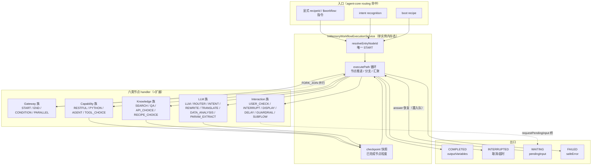
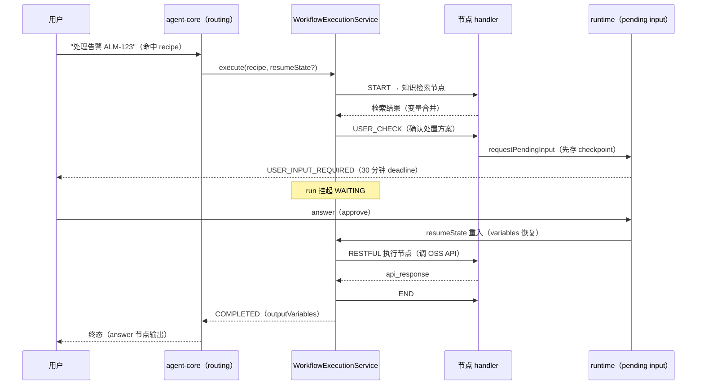
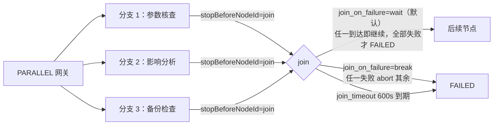

# NextAgent agent-workflow 执行引擎实现设计文档

> 版本: 1.0 | 日期: 2026-08-25 | 基于源码 `agent-workflow`（`packages/agent-workflow/src/`）、`agent-contracts/src/core`、`agent-core/src/agent/default-agent.ts`（runtime 桥）、`agent-app/src/composition/workflow-composition.ts`（模式选择）、`agent-observability/src/linking/timeline-span-lifecycle.ts`（previewSpanIds）

---

## 目录

1. [背景与目标](#1-背景与目标)
2. [上下文：系统定位、术语与规格导航](#2-上下文系统定位术语与规格导航)
3. [架构总览](#3-架构总览)
4. [关键不变量与状态机](#4-关键不变量与状态机)
5. [执行服务入口：execute() 主流程](#5-执行服务入口execute-主流程)
6. [executePath 路径循环与引擎状态机](#6-executepath-路径循环与引擎状态机)
7. [节点 Handler 注册表](#7-节点-handler-注册表)
8. [条件分支与表达式引擎](#8-条件分支与表达式引擎)
9. [并行网关（fork/join）](#9-并行网关forkjoin)
10. [重试与超时](#10-重试与超时)
11. [Loop 与 Batch 执行](#11-loop-与-batch-执行)
12. [Checkpoint 持久化与 Resume](#12-checkpoint-持久化与-resume)
13. [Pending Input 桥接](#13-pending-input-桥接)
14. [远程执行模式](#14-远程执行模式)
15. [Recipe 加载与 RECIPE Capability](#15-recipe-加载与-recipe-capability)
16. [Workflow Tool Port 与事件契约](#16-workflow-tool-port-与事件契约)
17. [安全设计](#17-安全设计)
18. [DFX：可观测、容量与可测试性](#18-dfx可观测容量与可测试性)
19. [关键数据结构与契约](#19-关键数据结构与契约)
20. [错误处理与降级](#20-错误处理与降级)
21. [附录 A：核心文件索引](#附录-a核心文件索引)
22. [附录 B：默认配置参数汇总](#附录-b默认配置参数汇总)

---

## 1. 背景与目标

### 1.1 问题定义

电信网络运维任务中存在大量**多步骤、有固定编排结构的业务流程**（告警处置 SOP、割接前检查、故障定位问卷、节能策略配置审核等）。这类任务的痛点：

- **纯模型驱动 loop 的不确定性**：步骤顺序、必经检查点、失败分支处置是业务强约束，交给模型自由编排会引入不可复现的执行路径，无法满足电信级可审计要求。
- **人工交互与自动执行的混合**：流程中间需要用户确认（User Check）、授权（Authorization）、追问参数（reflection），单纯的前端表单或模型 pending 都无法把"暂停点"纳入流程图本身。
- **既有业务资产的复用**：外部系统 API（OSS/BOS）、知识检索、LLM 推理需要以节点形式组合，而不是每个 Agent 重新写 tool 编排代码。

Workflow 执行引擎的解法：**Recipe DSL 把编排声明为数据**（FlowGraph + 节点输入输出映射），引擎按图执行，模型只在 LLM 族节点内被调用——编排确定性与模型智能解耦。

### 1.2 设计目标

1. **确定性执行**：同一 recipe + 同一输入变量，节点调度顺序、分支选择、事件序列可复现。
2. **单实例内存态，恢复靠 checkpoint**：不做常驻引擎状态，进程内状态全部是 executePath 局部变量；持久化只有"已完成节点"快照，崩溃后从快照重跑当前节点。
3. **六类节点族覆盖电信运维全场景**：gateway（流程控制）、capability（外部系统/脚本）、interaction（人工介入）、knowledge（知识/API 选择）、llm（模型推理）+ 扩展节点。
4. **本地/远程同一契约**：`WorkflowExecutionMode` 只影响 `WorkflowExecutionService` 实例构造来源，`execute()` 签名与行为契约不因模式变化。
5. **编排策略显式化**：recipe 匹配（显式 recipeId 或 intent recognition）、`$workflow:` 指令、boot recipe 都经 agent-core routing 显式决策，workflow 不自行抢流量。

### 1.3 非目标

- **不做通用 BPMN 引擎**：无事务补偿、无跨实例分布式编排、无 human task 队列；人工介入经 runtime-owned pending input（见 `docs/agent-runtime任务控制恢复.md` §7），不是独立工作台。
- **不做 durable event sourcing**：durable workflow event history 是 active change `add-ts-workflow-event-history`（PAUSED）的目标，当前 checkpoint 快照不是事件溯源。
- **不做多实例高可用**：单实例内存态是明确取舍；PaaS 多实例 lease 恢复不在本引擎范围。
- **不拥有 request lifecycle**：scheduler、cancel、terminal commit 归 `agent-runtime`（见 `docs/agent-runtime任务控制恢复.md`）。

### 1.4 关键取舍记录

| 取舍 | 决策 | 理由 |
|------|------|------|
| 内存态 vs 常驻引擎状态 | 内存态 + checkpoint 快照 | 引擎状态与持久化解耦：写快照失败只发 diagnostic 事件不阻塞执行（`engine/index.ts:1160-1173`）；恢复粒度是"节点"，实现简单且可验证 |
| checkpoint 粒度 | 已完成节点（nodeId+variables），无 attempt 级 | attempt 级恢复需要重放工具副作用，违背"capability 最终失败不重放"的统一失败处置；节点重跑配合 replay guard（runtime 侧）已足够安全 |
| 重试退避 | 契约保留 `backoff: fixed\|exponential`，引擎只实现固定 delay（`engine/index.ts:789`） | 已知差距：差异化退避未实现，归一化为 `{maxRetries, delay}`；需要指数退避的业务在 recipe 层用 loop 节点表达 |
| join 策略 | 无 ALL/ANY 枚举，由 `join_on_failure: break\|wait` 承载（break≈ALL、wait≈ANY） | 减少契约表面积；break/wait 语义从失败处置视角命名，比 ALL/ANY 更贴近 recipe 作者心智 |
| 取消后的 rollback | 可选 ControlPolicy，rollback 失败只 warn 不改变 INTERRUPTED 终态（`engine/index.ts:1113-1122`） | 取消的权威终态是 INTERRUPTED；rollback 是补偿尝试，失败不能让"已取消"变成"失败" |
| LoopBatchMutex | 无运行时互斥锁，loader 阶段拒绝同节点同时声明 loop 与 batch（`workflow-recipe-loader.ts:421-429`） | 静态互斥在加载期发现冲突，比运行时锁更早失败、可诊断 |
| `onError` 字段 | 引擎已废弃，改用 exception 分支 + ControlPolicy rollback（`engine/index.ts:256-265`） | legacy 字段语义与 ControlPolicy 重叠，normalize 阶段直接 throw 强制迁移 |

---

## 2. 上下文：系统定位、术语与规格导航

### 2.1 系统定位与上下游

```
                    ┌─────────────────────────────┐
                    │  agent-core DefaultAgent    │
                    │  （routing → 命中 recipe    │
                    │   → 调 WorkflowExecution    │
                    │   Tool，agent execution 阶段）│
                    └──────────┬──────────────────┘
                               │ 上游：唯一调用方
        ┌──────────────────────▼──────────────────────┐
        │        agent-workflow（本文）                 │
        │  WorkflowExecutionService(local/remote)      │
        │  workflow-recipe-loader（RECIPE capability） │
        │  workflow-tool-port（builtin Tool 包装）      │
        └──┬──────────┬──────────┬──────────┬─────────┘
           │          │          │          │ 下游依赖（全部经注入）
           ▼          ▼          ▼          ▼
   agent-capability  agent-  agent-runtime   agent-platform-
   （LLM/capability  model    （pending input gateway-remote
    节点经            （LLM    桥、checkpoint （远程模式
    Capability-       节点经   桥经 runtime    fetch gateway）
    InvocationPort）  ModelIn- 选项注入）
                     vocationPort）
```

- **上游**：`agent-core` 是唯一执行入口（`workflow-routing` spec 的 Dispatch Boundary Requirement 约定 agent-core 消费方行为不因模式变化）；前端不直接触达引擎，经 Web 请求 → runtime → agent-core 间接到达。
- **下游**：引擎不依赖具体 provider SDK；LLM/knowledge/capability 节点统一经 `CapabilityInvocationPort`，pending input 与 checkpoint 经 runtime 注入的回调（JSON 进 JSON 出），远程模式经 `agent-platform-gateway-remote` 的 fetch gateway。
- **同级协作**：`agent-observability` 消费引擎事件做 previewSpanIds 前驱链投影；`agent-app` 组合层做模式选择与实例注入。

### 2.2 术语表

| 术语 | 定义 |
|------|------|
| Recipe | 用 RecipeDefinition DSL 声明的一张工作流图（FlowGraph + runtime 配置 + 输入输出 schema），以 `RECIPE` capability 形式进入 catalog 被治理发现 |
| FlowGraph | `Record<WorkflowSafeId, WorkflowNodeDef>`，节点表 + `next` 邻接表达边 |
| boot recipe | recipe 启动即执行的默认入口（`type: 'boot-recipe'`），经 Boot Recipe Routing 命中 |
| nodeExecutionId | 单次节点执行实例 id（`node-${uuid}`），previewSpanIds 前驱链的关联单位 |
| resumeState | checkpoint 快照的反序列化形态（`WorkflowExecutionResumeState`），携带 nodeId/variables/loopContext 恢复执行 |
| ControlPolicy | 取消补偿策略：`cancel.rollbackNode`（回滚起点）+ `cancelTimeout`（回滚限时） |
| producerRef=WORKFLOW_NODE | pending input 的生产者标识（recipeName/nodeId/nodeType/executionId），runtime 据此区分超时恢复路径 |
| join_on_failure | 并行网关失败策略：`break`（任一失败 abort 其余，≈ALL）/ `wait`（等全部落定，全部失败才失败，≈ANY） |
| previewSpanIds | 观测投影：当前 WORKFLOW_NODE span 的前驱 span 列表（来自 predecessorNodeExecutionIds），trace 中的流程因果关系 |
| output_parser | 节点输出投影配置（type/level/show_content），是控制投影而非业务输出 |
| visibleDelta | 事件携带的受控前端增量（channel: CONTENT/THINKING/CHART/TABLE/DSL，≤150,000 字符） |

### 2.3 权威规格导航

行为语义以 `openspec/specs/` 归档 stable spec 为准；本文实现描述与 spec 冲突时以 spec 为准。

| 主题 | 权威 spec |
|------|-----------|
| 执行引擎、checkpoint/resume、节点重试/超时、ControlPolicy、loop、取消 | `workflow-execution-engine` |
| Recipe DSL、节点 DTO、RetryPolicy、NodeBatchConfig、visibleDelta 限制、失败处置统一 | `workflow-contracts` |
| recipe 匹配与分发、`$workflow:` 指令、boot recipe、Dispatch Boundary | `workflow-routing`、`directive-capability-routing` |
| 六类节点族 | `workflow-gateway-nodes`、`workflow-parallel-gateway`、`workflow-capability-nodes`、`workflow-interaction-nodes`、`workflow-knowledge-nodes`、`workflow-llm-nodes` |
| 扩展节点 | `workflow-agent-loop-tool`、`workflow-restful-sse`、`workflow-rag-gateway` |
| 远程执行模式与 Remote Scope Integrity | `workflow-remote-execution-mode` |
| recipe 加载与 RECIPE capability 发现 | `workflow-package` |
| output parser 投影契约 | `workflow-output-parser-contract` |
| durable event history（在建，PAUSED） | `workflow-event-history`（active change `add-ts-workflow-event-history`） |
| 编排策略（规划中，未启动） | active change `add-ts-workflow-orchestration-policy` |

Feature/Function 追溯：`docs/NextAgent-feature-list.md` F-9.1 ~ F-9.7；`docs/NextAgent-function-list.md` FN-9.1 ~ FN-9.22。

---

## 3. 架构总览

### 3.1 组件视图

```
┌─────────────────────────────────────────────────────────────────────┐
│ agent-core DefaultAgent                                             │
│   routing 命中 recipe（targetRecipe / boot-recipe）                   │
│   → DefaultAgent.executeWorkflow（agent execution 阶段）              │
│     ├─ saveCheckpoint 桥（workflowExecutionState 写入 flowVariables）│
│     └─ requestPendingInput 桥（producerRef=WORKFLOW_NODE）           │
└──────────────┬──────────────────────────────────────────────────────┘
               ▼
┌─────────────────────────────────────────────────────────────────────┐
│ WorkflowExecutionService（execute(request, signal, observer, runtime)）│
│ ┌─────────────────────────────────────────────────────────────────┐ │
│ │ InMemoryWorkflowExecutionService（本地模式，默认）                │ │
│ │   resolveRecipeDefinition → 版本校验                              │ │
│ │   parseWorkflowResumeState → entryNodeId                         │ │
│ │   createScopedAbortSignal（recipe.runtime.timeout）               │ │
│ │   executePath: while currentNodeId:                              │ │
│ │     handler = nodeCatalog.handlers[node.type]                    │ │
│ │     executeNode → saveNodeCheckpoint → resolvePathTransition     │ │
│ │   （CONDITION → BRANCH / PARALLEL → FORK_JOIN / END → TERMINAL）  │ │
│ └─────────────────────────────────────────────────────────────────┘ │
│ ┌─────────────────────────────────────────────────────────────────┐ │
│ │ RemoteWorkflowExecutionService（远程模式）                        │ │
│ │   gateway.execute() → AsyncIterable<StreamItem>                  │ │
│ │   for await: event → observer.emitEvent；result/failure → 终结   │ │
│ │   WAITING → 本地 requestPendingInput 桥接                         │ │
│ └─────────────────────────────────────────────────────────────────┘ │
└──────────────┬──────────────────────────────────────────────────────┘
               ▼ 事件双通道（engine/index.ts:1194-1197）
    emitEvent 回调（持久化 timeline） + observer.emitEvent（实时投影）
               ▼
┌─────────────────────────────────────────────────────────────────────┐
│ WorkflowRuntimeEventProjector（agent-core）→ RunTimelineEvent        │
│ TimelineSpanLifecycle → previewSpanIds 前驱链投影                    │
└─────────────────────────────────────────────────────────────────────┘
```

- 工厂入口 `createWorkflowExecutionService()`（`engine/index.ts:74-79`）：`options.implementation` 存在则直接返回，否则 `new InMemoryWorkflowExecutionService(options)`。
- 构造器默认值（:90-117）：`nodeCatalog` 默认 `defaultWorkflowNodeCatalog`，自定义时与默认 handlers **合并**（:102-110）；`createExecutionId` 默认 `workflow-${randomUUID()}`；`createNodeExecutionId` 默认 `node-${randomUUID()}`。

### 3.2 逻辑视图：节点分类与执行拓扑



要点：引擎状态全部是 executePath 局部变量；持久化只经 checkpoint 快照；WAITING 经 runtime-owned pending input 挂起，恢复时以 resumeState 重入。

### 3.3 业务流程视图

**流程 A：运维 SOP 从 recipe 命中到终态（含人工确认暂停）**



**流程 B：并行分支执行与 join 失败策略**



---

## 4. 关键不变量与状态机

### 4.1 核心不变量

| # | 不变量 | 强制点 |
|---|--------|--------|
| W1 | 恰好一个 START 节点作为唯一入口 | `resolveEntryNodeId` 抛 `WORKFLOW_ENTRY_NODE_UNRESOLVED`（engine/index.ts:1218-1232） |
| W2 | 同一 execute() 内节点执行顺序遵循 FlowGraph 依赖；dependsOn 未完成不得执行 | `assertDependenciesSatisfied`（:1256-1278） |
| W3 | pending input 创建与 checkpoint 保存原子成对：先存 checkpoint（STEP_STARTED）再创建 pending（producerRef=WORKFLOW_NODE） | default-agent.ts:1366-1423 |
| W4 | capability 最终失败只进入显式 exception，不重放最终结果 | `CapabilityNodeExecutionError` 短路（engine/index.ts:784-785）；spec `workflow-contracts` |
| W5 | 取消的权威终态是 INTERRUPTED；rollback 成败不改变该终态 | applyCancelPolicy（:1055-1128） |
| W6 | rollback 路径不写 checkpoint（skipCheckpoint:true），避免污染恢复坐标 | :1102 |
| W7 | 同一节点不得同时声明 loopConfig 与 batchConfig | loader 期 `WORKFLOW_BATCH_LOOP_CONFLICT`（workflow-recipe-loader.ts:421-429） |
| W8 | 网关节点（START/END/CONDITION/PARALLEL）不重试、不 checkpoint、无超时 | :516-519, :1147 |
| W9 | recipe 可信根校验：目录 realpath 不得逃逸 agentsRoot | `assertTrustedRecipeDirectory/FilePath`（workflow-recipe-loader.ts:296-322） |
| W10 | remote 模式下 scope 字段（agentId/agentVersion/agentAssemblyRef/sessionId/requestId/runId/requestContextId/identityContext）不被远端响应覆盖 | `preserveScope` 白名单复制（remote-execution-service.ts:231-245）；spec `workflow-remote-execution-mode` Remote Scope Integrity |

### 4.2 执行状态机

`WorkflowPathResult` 五态（engine/index.ts:61-67）：

```
                 ┌──────────── handler 返回 pendingInput
                 ▼
 COMPLETED ──► WAITING ──(answer 恢复，注入 answers)──► 继续 executePath
    │              │
    │              └─(timeout，无 checkpoint)──► FAILED(PENDING_INPUT_TIMEOUT)
    │              └─(timeout，有 checkpoint)──► 重新入队 resume
    │
    ├─(分支到达 join/stopBefore)─► COMPLETED（fork 分支语境）
    ├─(signal.aborted)──────────► INTERRUPTED ──(ControlPolicy rollback)
    │                                             └─► INTERRUPTED（不变）
    ├─(节点软失败 NODE_FAILED)──► FAILED
    └─(END/next 空)────────────► TERMINAL
```

`WorkflowExecutionResult.status` 对外四态（COMPLETED/FAILED/INTERRUPTED/WAITING）由 execute() 收敛（:197-206）；`WorkflowNodeResult.status` 四态（NODE_COMPLETED/NODE_FAILED/NODE_SKIPPED/NODE_WAITING）是节点级投影。

### 4.3 关键并发与竞态场景

| 场景 | 机制 | 结果 |
|------|------|------|
| 并行分支共享变量 | 分支启动时快照共享输入变量（:434-463），输出按分支声明顺序合并（:467-472） | 分支间不写冲突；后写者按顺序覆盖 |
| join_timeout 与分支执行竞速 | setTimeout abort branchController（:425-428） | 在途分支收到 abort → INTERRUPTED，join 整体 FAILED |
| 同 run 恢复与再次崩溃 | resumeState 携带 nodeId/variables，重新 executePath | 从已完成节点后继续；当前节点重跑（配合 runtime replay guard 复用幂等 capability 结果） |
| 取消与节点执行竞速 | recipeSignal 级联 + executePath 每轮检查 signal.aborted（:233-235, :315-317） | 节点边界处中断；能力调用内部由 AbortSignal 传播 |
| 多请求并发执行同一 recipe | 引擎无跨调用共享状态（executePath 局部变量） | 天然隔离；持久化竞争由 runtime 侧 checkpoint 幂等键兜底 |

---

## 5. 执行服务入口：execute() 主流程

**文件**: `packages/agent-workflow/src/engine/index.ts:119-210`

```
execute(request, signal, observer?, runtime?):
  startedAt = now(); executionId = createExecutionId()
  recipe = resolveRecipeDefinition(request)                     // :127
  if recipe.version != request.recipeVersion:
    throw WORKFLOW_RECIPE_VERSION_MISMATCH                       // :128-136
  observer.registerExecutionRecipe?.(executionId, recipe)        // :146-151
  resumeState = parseWorkflowResumeState(request.resumeState)    // :154
  if resumeState != nil && resumeState.recipeName != recipe.recipeName:
    throw WORKFLOW_RESUME_RECIPE_MISMATCH                        // :155-163
  entryNodeId = resumeState?.nodeId ?? resolveEntryNodeId(recipe)
    // resolveEntryNodeId 要求恰好 1 个 START 节点
    // 否则 WORKFLOW_ENTRY_NODE_UNRESOLVED（:1218-1232）
  recipeSignal = createScopedAbortSignal(signal,
                 recipe.runtime?.timeout * 1000)                 // :165-166
  try:
    path = executePath({从 entryNodeId 起,
      variables = resumeState?.variables ?? initializeVariables(request)})
    if path.state == 'INTERRUPTED' && recipeSignal.signal.aborted:
      path = applyCancelPolicy(...)                              // :180-196
    return WorkflowExecutionResult {                             // :197-206
      executionId, status: FAILED|INTERRUPTED|WAITING|COMPLETED,
      outputVariables: path.variables, nodeResults,
      startedAt, completedAt: now(), pendingInput?（WAITING 时序列化 JSON）}
  finally: recipeSignal.dispose()                                // :207-209
```

- `initializeVariables`：inputText 注入 `input_question` 变量（:1306-1310）。
- `createScopedAbortSignal`（:1452-1487）：AbortController + parent 级联 + 可选超时定时器，暴露 `didTimeout` 标志。
- **事件双通道发射** `emitWorkflowEvent`（:1194-1197）= `await this.emitEvent(event)`（构造期注入的持久化回调）+ `await observer?.emitEvent(event)`。本地模式"事件流"即 observer 回调逐条推送（无 AsyncIterable 缓冲）；AsyncIterable 形态仅存在于远程 gateway 流（`remote-execution-service.ts:55-81`）。

---

## 6. executePath 路径循环与引擎状态机

**文件**: `engine/index.ts:212-333`

```
executePath({currentNodeId, variables, nodeResults, signal,
             stopBeforeNodeId?, resumeState?, skipCheckpoint?,
             rollbackMode?, loopContext?, predecessorNodeExecutionIds?}):
  while currentNodeId != undefined:
    if signal.aborted: return INTERRUPTED                          // :233-235
    if stopBeforeNodeId == currentNodeId:
      return COMPLETED + nextNodeId          // fork/join 分支汇聚用  :236-238
    node = requireNode(recipe, currentNodeId)
      // 缺失抛 WORKFLOW_NODE_NOT_FOUND（:1243-1255）
    if node.loopConfig?.loopEndNode == currentNodeId && loopContext == nil:
      loopOutcome = executeLoopPath(...)      // 见第 9 节             :240-275
      COMPLETED 时继续 currentNodeId = loopOutcome.nextNodeId，否则直接返回
    assertDependenciesSatisfied(recipe, nodeId, node, nodeResults)
      // dependsOn 未 NODE_COMPLETED 抛 WORKFLOW_DEPENDENCY_NOT_SATISFIED
                                                                   // :276, 1256-1278
    execution = executeNode({...})                                 // :277-290
    nodeResults.push(execution.nodeResult)                         // :291
    variables = mergeVariables(variables, execution.outputVariables)
      // mergeVariables 剥离 output_parser（:1296-1301）             // :292
    if execution.nodeExecutionId != nil:
      predecessorNodeExecutionIds = [nodeExecutionId]              // :293-295
    if !skipCheckpoint: saveNodeCheckpoint(...)                    // :296-308
    if execution.pendingInput != nil: return WAITING + pendingInput// :309-311
    if execution.terminalState != nil: return terminalState        // :312-314
    if signal.aborted: return INTERRUPTED                          // :315-317
    {variables, nextNodeId} = resolvePathTransition(transition)
      // TERMINAL/CONTINUE/BRANCH/FORK_JOIN 分派（:335-401）         // :318-330
  return TERMINAL                                                  // :332
```

- `WorkflowPathResult` 5 态（:61-67）：`'COMPLETED' | 'TERMINAL' | 'FAILED' | 'INTERRUPTED' | 'WAITING'`。
- END 节点 handler 返回 `{transition: {kind:'TERMINAL'}}`（`nodes/index.ts:45`）；next 为空时 `defaultTransition` 返回 TERMINAL（`engine/index.ts:1284-1294`）。
- **ControlPolicy（cancel + rollback）** `applyCancelPolicy`（:1055-1128）：
  - `recipe.runtime?.controlPolicy` 的 `cancel.rollbackNode` 为空 → 记日志 `workflow.cancel_no_rollback`，直接返回 INTERRUPTED（:1064-1075）。
  - 取第一个 rollback 节点 id；`cancelTimeout`（秒）→ 独立 AbortController + setTimeout（:1077-1082）。
  - 以 `skipCheckpoint: true, rollbackMode: true` 重新 executePath 从 rollbackNodeId 走到底（:1092-1104）；rollback 路径中 capability 失败被短路为 FAILED 不重试（:792-800）。
  - 成功/失败最终都返回 `INTERRUPTED`（:1113, :1122）；rollback 失败仅 warn 日志不改变状态。

---

## 7. 节点 Handler 注册表

### 7.1 注册与分发

- `WorkflowNodeCatalog` 接口（`nodes/types.ts:72-74`）：`handlers: Readonly<Partial<Record<WorkflowNodeType, WorkflowNodeHandler>>>`。
- Handler 签名（:70）：输入 `WorkflowNodeHandlerContext`（:32-47：executionId/request/recipe/nodeId/nodeExecutionId/node/variables/attempt/signal/emitOutputDelta/resumeState/requestPendingInput/observer），输出 `WorkflowNodeHandlerResult`（:62-68：status/outputVariables/diagnostic/transition/pendingInput）。
- 分发点：`executeNode` 内 `this.nodeCatalog.handlers[input.node.type]`（`engine/index.ts:559`）。
- **默认目录** `defaultWorkflowNodeCatalog`（`nodes/index.ts:42-147`）：START/END/DISPLAY/GUARDRAIL/KNOWLEDGE_SEARCH/KNOWLEDGE_QA/API_CHOICE/RECIPE_CHOICE/USER_CHECK/INTERRUPT/SUBFLOW/DELAY/CONDITION/PARALLEL（其中 KNOWLEDGE_*/API_CHOICE/RECIPE_CHOICE/GUARDRAIL/SUBFLOW 为"不可用边界"版本，传空 options 抛 UNAVAILABLE）。
- **运行时目录** `createWorkflowNodeCatalog(options)`（`nodes/index.ts:149-172`）：在默认之上叠加 LLM 族（LLM/LLM_ROUTER/INTENT_RECOGNITION/QUESTION_REWRITING/TRANSLATION/DATA_ANALYSIS/PARAM_EXTRACT→executeLlmNode）、TOOL_CHOICE、RESTFUL、PYTHON、AGENT 及带 options 的 knowledge/guardrail/subflow 实现。

### 7.2 Handler 输入输出一览

| Handler | 文件:行号 | 输入（node.inputs 关键字段） | 输出 outputVariables 关键字段 |
|---|---|---|---|
| CONDITION（排他网关） | nodes/index.ts:56-95 | `next.{nodeId}.condition` | 无 output；返回 `{transition:{kind:'BRANCH'}}` |
| PARALLEL（并行/包容网关） | nodes/index.ts:96-145 | `inputs.join_node / join_on_failure / join_timeout` | 单分支→BRANCH，多分支→FORK_JOIN |
| USER_CHECK | nodes/interaction-nodes.ts:112-199 | `kind`(QUESTION/CONFIRMATION/AUTHORIZATION/HUMAN_HANDOFF)、`question/prompt/tips`、`action_type`、`options/fields`、`timeoutAt` | 恢复态：`user_check_result/selectedOption/answer_values`；未恢复：pendingInput |
| INTERRUPT | nodes/interaction-nodes.ts:303-351 | 节点 `timeout` | `interrupt_result{resumed,pendingInputId,...}, resumed` |
| DISPLAY | nodes/interaction-nodes.ts:30-80 | `content/text/message` + presentation.outputParser | `display_content_result{content,projected,type}` |
| DELAY | nodes/interaction-nodes.ts:81-96 | `delay_time`（秒） | `delay_result{completed,delayMs}` |
| GUARDRAIL | nodes/interaction-nodes.ts:353-415 | `policyId`、`guardrailType`、`content` | `guardrail_result(bool), guardrail_response{decision,safeReason}` |
| SUBFLOW（子 recipe） | nodes/interaction-nodes.ts:417-537 | `recipe_name`、`inputMapping/outputMapping` | `sub_recipe_result, recipe_result（answer 节点输出）, node_record_info`；嵌套深度 ≤3 |
| KNOWLEDGE_SEARCH | nodes/knowledge-nodes.ts:47-69 | `rag_index`、`query`、`rank_topN/vs_topN/es_topN` | `knowledge_search_result / recall_result` |
| KNOWLEDGE_QA | nodes/knowledge-nodes.ts:111-198 | 同上 + `model`、`qa_examples` | `knowledge_qa_result, llm_completion, knowledge_diagnostic` |
| API_CHOICE | nodes/knowledge-nodes.ts:200-343 | `open_api_recall/rag_index/candidateApis/query` | `api_name` |
| RECIPE_CHOICE | nodes/knowledge-nodes.ts:344-437 | `candidateRecipes` | 选中 recipe 名 |
| LLM 族 | nodes/llm-nodes.ts:47-156 | `prompt_template/model/data`、输出 schema | 类型化校验后的 payload；流式 delta 经 emitOutputDelta |
| RESTFUL | nodes/capability-nodes.ts:129-190 | `api_name`、`stream_type=sse`、batchConfig、`fm_extract_parameter` | `api_response（含 _trace）、invocation_trace、poll_results、batch_results` |
| PYTHON | nodes/capability-nodes.ts:395-468 | `script`、任意变量入参 | `python_result（stdout 智能解析）` |
| AGENT | nodes/capability-nodes.ts:470-506 | `agent_name`、`input_question` | `agent_result, child_chat_id?` |
| TOOL_CHOICE | nodes/capability-nodes.ts:508-626 | `candidateTools/taskDescription/query` | `tool_choice_result{selectedToolId,mappedArguments}` |

- 能力调用统一走 `buildCapabilityInvocationRequest`（`nodes/shared.ts:438-463`，默认 timeout 30s、携带 retry maxRetries）与 `capabilityResultPayload`（:465-477，FAILED/TIMED_OUT 抛 `CapabilityNodeExecutionError`）。

---

## 8. 条件分支与表达式引擎

- CONDITION handler（`nodes/index.ts:56-95`）：遍历 `node.next` 分支，逐个 `evaluateBranchCondition(branch.condition, variables)`，命中返回 `{kind:'BRANCH', nextNodeId}`；最后一个"空 condition"分支作为 fallback（`resolveExclusiveFallback` :204-215）；全部不匹配抛 `WORKFLOW_EXCLUSIVE_GATEWAY_NO_MATCH`。
- 通用 fallback：`resolveWorkflowBranchTransition`（:174-202），供 `defaultTransition` 与 `resolveErrorTransition`（exception 分支，`engine/index.ts:1430-1444`）复用。
- 条件表达式引擎：`tokenizeCondition`（:330-410，支持 `== != < <= > >= && ||`、字符串/数字/布尔/null、括号、点路径标识符）+ 递归下降 `ConditionParser`（:412-492，parseOr→parseAnd→parseComparison→parsePrimary）；变量解析 `resolveVariablePath`（`nodes/shared.ts:195-208`）。

---

## 9. 并行网关（fork/join）

- Fork 发起：PARALLEL handler 产出 FORK_JOIN transition（`nodes/index.ts:131-145`）；joinNodeId 默认推断 = 各选中分支 BFS 可达集合中**第一个共同的 END 节点**（`resolveParallelJoinNodeId` :246-271，可达集 `collectReachableNodeIds` :273-291），无共同 join 抛 `WORKFLOW_PARALLEL_GATEWAY_JOIN_UNRESOLVED`。
- Join 参数解析 `resolveParallelGatewayInputs`（:223-244）：`join_node`（显式）、`join_on_failure`（`'break'|'wait'`，默认 wait）、`join_timeout`（DSL 秒 ×1000；默认 600_000ms，常量 `DEFAULT_JOIN_TIMEOUT_MS` `nodes/index.ts:21`）。
- **执行实现** `executeConcurrentForkJoin`（`engine/index.ts:403-491`）：

```
executeConcurrentForkJoin({branchNodeIds, joinNodeId, joinOnFailure, joinTimeout, ...}):
  branchController = 级联父取消的 AbortController                     (:421-423)
  joinTimeout 到期 → branchController.abort()                        (:425-428)
  所有分支同时启动（共享同一输入变量），各自:
    executePath({currentNodeId: branch, stopBeforeNodeId: joinNodeId,
                 signal: branchController.signal})                    (:434-463)
  await Promise.allSettled(branchPromises)                           (:465)
  join 策略（无显式 ALL/ANY 枚举，语义由 join_on_failure 承载）:
    failureCount > 0 && (joinOnFailure=='break' || failureCount >= 分支数)
      → FAILED   # break≈ALL（任一失败 abort 其余），wait≈ANY（全部失败才失败）
                                                                     (:476-478)
  输出变量按分支声明顺序合并                                         (:467-472)
  join 后 predecessorNodeExecutionIds = 各分支末端 nodeExecutionId flatMap
                                                                     (:483)
```

- 分支失败判定（:451-462）：`result.state !== 'COMPLETED' || result.nextNodeId !== joinNodeId` 或抛异常。

---

## 10. 重试与超时

- **Retry 解析** `resolveWorkflowRetryPolicy`（`nodes/shared.ts:781-801`）：优先级 `node.retry`（结构化 RetryPolicy）→ `node.retryPolicy`（legacy）→ `recipe.runtime.defaultRetry`；归一化 `{maxRetries, delay?}`；非法值归 0。
- **注意**：引擎重试循环只用 `maxRetries + delay`（`engine/index.ts:789` 固定 `delay((retryPolicy.delay ?? 0) * 1000)`）；**`backoff: fixed|exponential` 在契约与 loader 中存在但引擎未实现差异化退避**。
- 网关节点（START/END/CONDITION/PARALLEL）强制 `maxRetries: 0`（`engine/index.ts:516-519`）。
- 重试判定 `shouldRetry`（:1446-1451）：`attempt <= maxRetries && (didTimeout || !isAbortError)`；capability 最终失败（`CapabilityNodeExecutionError`）不重试（:784-785）。重试前更新 `attemptPredecessors`（:786-788）。
- **Node Timeout**：`executeNode` 内 `createScopedAbortSignal(input.signal, node.timeout * 1000)`（:556-557，网关节点无超时）；超时 abort 后 `didTimeout=true` → `WORKFLOW_NODE_TIMEOUT`（category TIMEOUT, retryable true）（:730-735, :1327-1336）；超时计入可重试条件。
- 能力调用级默认：`nodeTimeoutMs(node, 30_000)`（`nodes/shared.ts:401-403`）；模型调用 `nodeTimeoutMs(node, modelConfig.timeoutMs)`（`nodes/llm-nodes.ts:434`）。

---

## 11. Loop 与 Batch 执行

### 11.1 多节点 Loop（`executeLoopPath`，engine/index.ts:857-1029）

- 入口：executePath 检测 `node.loopConfig.loopEndNode === currentNodeId && loopContext === undefined`（:240-275）。
- `maxIterations = loopCardinality ?? (有 condition 或 dataItem ? 1000 : 1)`（:882）；数据驱动：`loopInputDataItem` 解析为数组否则 `WORKFLOW_LOOP_INPUT_NOT_ARRAY`（:883-898）；数组长度覆盖 maxIterations（:900）。
- 每轮注入 `loopElementVariable`（:908-910）并构造 `WorkflowLoopContext{loopId, iteration, elementIndex, collectedResults}`（:911-916）。
- **单节点自环**（loopStartNode==loopEndNode）直接 executeNode（:922-960）；**多节点循环体** `executePath({currentNodeId: loopStartNode, stopBeforeNodeId: loopEndNodeId, loopContext})`（:961-981）。
- 每轮 `collectLoopResult`（:1031-1053：List push 值 / Map push `{key, value}`）；`loopCompletionCondition` 命中即 break（异常 → `WORKFLOW_LOOP_CONDITION_INVALID`，:984-1004）；`loopTimeCycle` 轮间 sleep（:1005-1010）；结束写回 `loopResultVariable`（Map 转 Object，:1012-1023）。
- **LoopBatchMutex**：无同名运行时锁——它是 loader 阶段互斥校验（同节点同时声明 loopConfig 与 batchConfig → `WORKFLOW_BATCH_LOOP_CONFLICT` 拒绝加载，`workflow-recipe-loader.ts:421-429`）；`validateLoopConfigs` 校验 loopEndNode/loopStartNode 一致性（:794-808）。

### 11.2 Batch 执行（`nodes/batch.ts`）

- `readBatchConfig`（:33-66）：默认 elementVariable=`'element'`、batchSize=10、parallelism 默认 5（clamp ≤20）、mode 默认 serial、failStrategy 默认 continue、resultMerge 默认 append。
- `executeBatch`（:68-149）：batch 级 AbortController（abort 策略首个失败取消在途请求）；serial 按 chunk 顺序；parallel 用 `mapWithConcurrency` worker 池（:183-205）；batchAborted 返回 `NODE_FAILED`（:146）。

---

## 12. Checkpoint 持久化与 Resume

- **保存** `saveNodeCheckpoint`（`engine/index.ts:1130-1174`）：三重前置——`recipe.runtime?.persistence?.checkpoint !== true` 跳过（:1141）；`runtime.saveCheckpoint` 缺失跳过（:1144）；网关节点跳过（:1147）。快照内容 `WorkflowExecutionResumeState{executionId, recipeName, nodeId, nodeType, variables, loopContext?}`（:1150-1157）；写失败仅发 `NODE_COMPLETED + diagnostic.reasonCode=WORKFLOW_CHECKPOINT_WRITE_FAILED` 事件（:1160-1173）。rollback 路径 `skipCheckpoint:true`（:1102）。
- **契约 runtime 桥**（`agent-core/src/agent/default-agent.ts:1424-1443`）：`saveCheckpoint` 把 resumeState 写入 flowVariables 的 `workflowExecutionState` 键（键常量 :66），再 `runState.saveCheckpoint(run, context, 'STEP_STARTED')`。
- **恢复**：
  - 入口解析 `parseResumeState`（`pending-input-shared.ts:66-92`，executionId 缺省合成 `workflow-resume:{recipeName}:{nodeId}`，透传 pendingInputId/answers/loopContext）；execute() 校验 recipe 匹配后 `entryNodeId = resumeState.nodeId`、variables 从 resumeState 恢复（`engine/index.ts:164-179`）。
  - 运行时侧 `readWorkflowResumeState`（`default-agent.ts:1586-1611`）读 `workflowExecutionState` + `workflowPendingResume`；答案恢复由 `attachWorkflowPendingResume`（`agent-runtime/src/lifecycle/submit.ts:3496-3512`）写入；恢复执行时删除该键（`default-agent.ts:1396`）。
  - WAITING→resume 后节点行为：USER_CHECK/INTERRUPT 用 `readWorkflowPendingAnswer`（`interaction-nodes.ts:749-767`）读 answers 继续；RESTFUL 参数反问用 `readReflectionAnswer`（`capability-nodes.ts:57-63`）。

---

## 13. Pending Input 桥接

- 共享解析/序列化：`pending-input-shared.ts`——`parsePendingInputActivation`（:100-117，kind ∈ QUESTION/CONFIRMATION/AUTHORIZATION/HUMAN_HANDOFF）、`pendingInputActivationToJson`（:139-170）等。
- 引擎侧桥：`executeNode` 把 `runtime.requestPendingInput`（JSON 进 JSON 出）包装为类型化调用，非法返回抛 `WORKFLOW_PENDING_INPUT_BRIDGE_INVALID`（`engine/index.ts:573-591`）；handler 返回 pendingInput → executePath 返回 WAITING（:309-311）→ execute 返回 `result.pendingInput`（:205）。
- **生产者侧实现**（`default-agent.ts:1366-1423`）：解析 activation → 写 `workflowExecutionState` 到 flowVariables（:1379-1395）→ `runState.requestPendingInput(run, context, intent, { producerRef: {kind:'WORKFLOW_NODE', recipeName, nodeId, nodeType, executionId}, checkpointTrigger:'STEP_STARTED' })`（:1397-1412）。
- `PendingInputProducerRef` 契约：`agent-contracts/src/gateway/index.ts:1668-1678`（LIFECYCLE_HOOK | WORKFLOW_NODE | CAPABILITY_INVOCATION）。
- **超时 resume 语义**：
  - timeoutAt 来源：USER_CHECK 的 `inputs.timeoutAt` 或 `node.timeout*1000`（`interaction-nodes.ts:292-302`）；INTERRUPT 的 `node.timeout`（:340-341）。
  - 到期后 runtime 扫描（`submit.ts:3014-3016`）对 WORKFLOW_NODE producer 走 `resumePendingInputTimeout`（:3532-3613）：无 checkpoint → FAILED(PENDING_INPUT_TIMEOUT)；有 checkpoint → `attachWorkflowPendingTimeoutResume`（仅写 pendingInputId 无 answers）+ `routingConstraints.targetRecipe` 重新入队执行。
  - 引擎侧超时表现：USER_CHECK 恢复但无 answers 时 `throwUserCheckTimeout` 抛 `WORKFLOW_NODE_TIMEOUT`（`interaction-nodes.ts:201-209`）；INTERRUPT 同理（:321-334）。

---

## 14. 远程执行模式

- 模式类型 `WorkflowExecutionMode = 'local' | 'remote'`（`agent-contracts/src/core/index.ts:425`）。
- **模式选择**（`agent-app/src/composition/workflow-composition.ts:112-128`）：gateway 配置 `adapterKind==='workflow-execution' && selectionState==='enabled'` 且 `deploymentMode==='REMOTE'`，或显式 `workflowExecutionMode === 'remote'`；remote 时优先 endpoint 构造 fetch gateway，否则要求注入 `workflowRemoteExecutionGateway`；local 用 `createWorkflowExecutionService(factoryOptions)`；有自定义 `workflowExecutionServiceFactory` 时优先。上层装配 `create-app.ts:832-838`。
- **RemoteWorkflowExecutionService**（`remote-execution-service.ts`）：
  - `execute()`（:33-120）：入口已 abort → INTERRUPTED；`stream = gateway.execute(request, signal)`（:57）；启动失败按 abort 分派 INTERRUPTED/`WORKFLOW_REMOTE_UNAVAILABLE`（:122-140）；`for await` 消费流：event→observer.emitEvent（:66-70），result→终结（:73-76），failure→handleFailure（:78-80）；流消费抛错→abort 则 INTERRUPTED，否则 `WORKFLOW_REMOTE_INVALID_RESPONSE`（:82-101）；无终止项→INVALID_RESPONSE（:103-117）。
  - WAITING 桥接（:142-190）：无 runtime 回调 → `WORKFLOW_REMOTE_PENDING_INPUT_RUNTIME_MISSING`；`bridgePendingInput`（:192-207）调本地 `runtime.requestPendingInput`，失败 → `WORKFLOW_REMOTE_PENDING_INPUT_BRIDGE_INVALID`。
  - failure→SafeError 映射（:219-229）：TIMEOUT→TIMEOUT(retryable)、UNAUTHORIZED→AUTHORIZATION、其余 UNAVAILABLE。
  - `preserveScope`（:231-245）白名单复制结果字段；合成结果 `interruptedResult`/`failedResult`（:247-277）。
- **workflow-remote-bridge.ts**：
  - `adaptFetchWorkflowRemoteGateway`（:24-46）：TypeBox `Value.Check` 校验后反序列化（ISO→Date，:64-88），校验失败 yield `WORKFLOW_REMOTE_INVALID_RESPONSE`。
  - `EndpointFetchGateway`（:113-154）：POST `{endpoint}/workflow/execute`，`accept: text/event-stream`，信号桥接；HTTP 非 2xx 按 401/403→UNAUTHORIZED、408/504→TIMEOUT、其余 UNAVAILABLE（:253-261）。
  - SSE 解析（:156-251）：`\n\n` 帧分隔，`event:`/`data:` 行，event|result|failure 三类。
  - 取消传播：fetch controller 链（:124-131）+ 流消费中 `signal.aborted` 检查（:83-86）。

---

## 15. Recipe 加载与 RECIPE Capability

**文件**: `packages/agent-workflow/src/workflow-recipe-loader.ts`

- `WorkflowRecipeDefinitionSource`（:45-111）：按 agent 懒加载——`require(agentId, recipeName)` 先查 per-agent LRU 缓存（上限 `RECIPE_CACHE_LIMIT=100`，:26/:85-90），未命中 `loadRecipeIndexDirectory({agentsRoot}/{agentId}/recipes)`（:108-110）→ 懒加载全量；找不到抛 `RECIPE_NOT_FOUND`，校验失败抛 `RECIPE_INVALID`。
- 启动期加载：`createRecipeDefinitionSourceForAssemblies`（:113-120）与 `attachRecipeCapabilitiesToAssemblies`（:122-130，对每个 assembly 调 `recipeSource.list` 触发目录扫描）。
- 目录扫描（:182-263）：递归 `.yaml/.yml`，跳过符号链接；可信根校验 `assertTrustedRecipeDirectory/FilePath`（:296-322，realpath 防逃逸）。
- **RECIPE capability 发现**：`listRecipeCapabilityDescriptors`（:132-161）把每个 recipe 映射为 `CapabilityDescriptor{capabilityId=recipeName, kind:'WORKFLOW', provider=localRecipeProvider{providerId:'local-recipes', providerKind:'LOCAL_DIRECTORY'}, disclosurePolicy:{mode:'EAGER'}, replayPolicy:'NON_IDEMPOTENT', metadata.metadataKind='nextagent.recipe'}`；`createRecipeCapabilityProvider`（:163-180）包装为 SEARCH/LIST_CURRENT discovery。
- 归一化：`normalizeRecipeDefinition`（:338-384，1.0 `{name,nodes}` → v2 `{recipeName,flowGraph}`）、`normalizeNodeDefinition`（:388-447，type 别名映射 :524-618，如 `parallel-gateway|inclusive-gateway→PARALLEL`、`exclusive-gateway→CONDITION`）、`normalizeLoopConfig`（:689-735）、`normalizeBatchConfig`（:620-649）、`normalizeRuntimeConfig`（:737-792，legacy controlPolicy 字段直接 throw :752-757）。

---

## 16. Workflow Tool Port 与事件契约

**文件**: `packages/agent-workflow/src/workflow-tool-port.ts`

- `WorkflowExecutionToolPort` 接口（:29-37）；工厂 `createWorkflowToolPort`（:47-94）：
  - `resolveRecipeDefinition` 失败 → `FAILED('RECIPE_NOT_FOUND')`；构造 `WorkflowExecutionRequest` → `createTimelineObserver` → `execute` → `mapWorkflowResult`；异常按 abort 区分 `WORKFLOW_ABORTED`/`WORKFLOW_EXECUTION_ERROR`。
  - Timeline observer（:96-114）：仅当 `context.emitResultDelta` 存在；`registerExecutionRecipe` 记录子 recipe（支持 SUBFLOW 嵌套投影）；每个事件转成 `{workflowRecipe: 序列化投影, workflowExecutionEvent: 序列化事件}` 经 emitResultDelta 透传。recipe 投影只保留 id/type/next/description/outputParser/presentation/身份 inputs（:116-145）。
  - 结果映射 `mapWorkflowResult`（:187-259）：COMPLETED→SUCCEEDED（answer 节点输出 + answerPreviews，密钥字段过滤）；INTERRUPTED→FAILED(WORKFLOW_INTERRUPTED)；WAITING→SUCCEEDED(status:'waiting', pendingInput 摘要)；FAILED→FAILED（取最后一个节点 safeError）。answer 节点定位 `resolveSubRecipeAnswerNodeId`（`nodes/shared.ts:323-355`）。
- **事件类型**（`agent-contracts/src/core/index.ts:292`）：`NODE_STARTED | NODE_COMPLETED | NODE_FAILED | NODE_SKIPPED | NODE_WAITING | NODE_OUTPUT_DELTA`。发射点：NODE_STARTED（非 END、handler 前，:541-555）；NODE_OUTPUT_DELTA（handler emitOutputDelta 或兜底一条，:592-628）；NODE_COMPLETED/SKIPPED/WAITING（:706-722）；NODE_FAILED（软失败 :661-674 与异常 :752-765）；loop 专属失败（:885-897, :990-1002）。
- **previewSpanIds 投影**（`agent-observability/src/linking/timeline-span-lifecycle.ts`）：WORKFLOW_NODE span 的 `resolvePredecessors`（:312-345）读事件 `inlinePayload.predecessorNodeExecutionIds`，逐个查同 runId 的 WORKFLOW_NODE span 映射为 spanId 列表；上限 `MAX_PREDECESSORS=128`（:24）；依赖引擎侧 `executionCorrelation.withExecutionRef({kind:'WORKFLOW_NODE', executionId: nodeExecutionId})`（`engine/index.ts:598-608`）。
- 观测事件二次投影：`agent-core/src/agent/workflow-runtime-event-projector.ts`（把 WorkflowExecutionEvent 转为 RunTimelineEvent）。

---

## 17. 安全设计

### 17.1 Owner Scope 与 Agent Scope 强制点

引擎的所有持久化事实与调用请求都携带双层 scope，来源与强制点：

| Scope 字段 | 来源 | 引擎侧强制 |
|------------|------|-----------|
| `tenantId` / `subjectId`（Owner Scope） | `WorkflowExecutionRequest.identityContext`（上游 trusted channel/auth 注入） | 透传到 capability 调用与 checkpoint 桥；引擎自身不校验（runtime/gateway 层强制） |
| `agentId` / `agentVersion` / `agentAssemblyRef`（Agent Scope） | 可信 app composition / 已持久化 RequestRun | `WorkflowExecutionRequest` 必填；recipe 解析经 assembly 绑定（workflow-recipe-loader per-agent 懒加载） |
| `sessionId` / `requestId` / `runId` / `requestContextId` | runtime 提交坐标 | 事件与 checkpoint 快照携带，保证轨迹可归属 |

关键规则（spec `workflow-remote-execution-mode` Remote Scope Integrity）：**remote 模式下上述 scope 字段 MUST 来自可信 app composition 或已持久化领域对象，MUST NOT 被远端响应覆盖**——实现为 `preserveScope` 白名单复制（`remote-execution-service.ts:231-245`：结果只复制白名单业务字段，scope 字段不从响应重建）。

### 17.2 不可信输入边界

| 边界 | 不可信内容 | 防护 |
|------|-----------|------|
| recipe YAML 文件 | 磁盘上的 recipe 定义（含 type 别名、node inputs） | 可信根校验（realpath 防逃逸，loader :296-322）；递归 .yaml 白名单；符号链接跳过；Ajv `RecipeDefinitionSchema` 闭合校验；loop/batch 互斥拒绝 |
| recipe `inputText` / `inputVariables` | 用户输入 | `initializeVariables` 注入 `input_question`（:1306-1310）；变量经 `resolveVariablePath` 点路径解析，不 eval；条件表达式走自研 tokenizer + 递归下降 parser（`nodes/index.ts:330-492`），**无 eval/new Function** |
| 节点 `inputs`（DSL 声明） | recipe 作者声明的参数 | 结构化字段消费（无拼接执行）；能力调用参数经 `buildCapabilityInvocationRequest` 走统一 schema 校验 |
| remote gateway 响应 | 远端返回的事件/结果 JSON | TypeBox `Value.Check` 闭合校验（bridge :24-46）；失败 yield `WORKFLOW_REMOTE_INVALID_RESPONSE`；scope 字段白名单复制（§17.1） |
| 模板渲染（template-engine） | recipe 变量插值 | `{{ }}` 受控插值；循环总迭代上限 10（template-engine/index.ts:3）防无限展开 |

### 17.3 敏感数据流与最小暴露

- **模型输入隔离**：LLM 节点 prompt 组装在 `nodes/llm-nodes.ts` 内完成，超预算压缩（`WORKFLOW_LLM_BUDGET_EXCEEDED`）；workflow 专用 RAG gateway 与通用 RagRetrievalGateway 平行（Request/Result 独立），本地语料按 trusted workspace scope 隔离。
- **输出投影收口**：`output_parser` 是控制投影配置；`visibleDelta` 只允许五类 channel 且 content ≤150,000 字符（spec `workflow-contracts`）；recipe 投影到前端只保留 id/type/next/description/outputParser/presentation/身份 inputs（`workflow-tool-port.ts:116-145`），业务变量不整体外泄。
- **safeError 唯一失败出口**：节点失败统一经 `CapabilityNodeExecutionError` → `WorkflowNodeResult.safeError`；raw provider 错误不进事件/变量。
- **密钥与凭据**：引擎不接触 credential；RESTFUL 节点的 header 参数来自可信 Skill 扩展声明（`api_header_params` 白名单键），经 agent-capability 侧处理（见 `docs/agent-loop引擎.md` §12）。

### 17.4 权限模型（本能力相关）

- recipe 以 `RECIPE` capability 进入 catalog，受统一 capability governance（发现 → binding 过滤 → 冲突解决）约束；`$workflow:` 指令产生的 `targetRecipe` constraint 在 routing 层校验（Web 请求体不携带 target 指令，只由服务端解析产生）。
- workflow pending input 的 authorization kind 复用 runtime-owned 授权边界（authorization 只绑定一个受限操作），producerRef=WORKFLOW_NODE 使授权范围限定在节点语境。
- 节点能力调用经统一 `CapabilityInvocationPort`，继承 forbiddenCapabilityIds / risk policy 治理（见 `docs/agent-capability工具体系.md` §6）。

---

## 18. DFX：可观测、容量与可测试性

### 18.1 可观测信号（本能力产出）

| 信号 | 类型 | 来源 |
|------|------|------|
| `NODE_STARTED/NODE_COMPLETED/NODE_FAILED/NODE_SKIPPED/NODE_WAITING/NODE_OUTPUT_DELTA` | timeline 事件（双通道：emitEvent 持久化 + observer 实时） | engine/index.ts（发射点见 §16） |
| `WORKFLOW_NODE` span（`nextagent.workflow_node`）+ previewSpanIds 前驱链 | trace | timeline-span-lifecycle.ts:645-660 |
| 节点尝试关联生命周期 / 权威开始顺序 | timeline 事件语义 | spec `workflow-execution-engine` 两个 Requirement |
| checkpoint 写失败 `WORKFLOW_CHECKPOINT_WRITE_FAILED` | NODE_COMPLETED diagnostic.reasonCode | engine/index.ts:1160-1173 |
| `workflow.cancel_no_rollback` / rollback 失败 warn | runtime 日志 | engine/index.ts:1064-1122 |

消费方式：`WorkflowRuntimeEventProjector`（agent-core）把事件转 RunTimelineEvent 进统一 observation stream → LOG/METRIC/TRACE/AUDIT 投影（见 `docs/agent-observability可观测设计.md`）；前端 process panel 消费事件投影（见 spec `ts-run-status-visibility`）。

### 18.2 容量与性能

| 维度 | 值/约束 | 来源 |
|------|---------|------|
| 单节点能力调用超时兜底 | 30,000 ms | nodes/shared.ts:401-403 |
| 并行 join_timeout 默认 | 600,000 ms（10 min） | nodes/index.ts:21 |
| recipe 缓存 | per-agent LRU 100 | workflow-recipe-loader.ts:26 |
| 子 recipe 嵌套深度 | 3 | interaction-nodes.ts:28 |
| loop 迭代上限 | loopCardinality ≤1000 | agent-contracts core :183 |
| batch parallelism | 1-20（默认 5） | agent-contracts core :215 |
| LLM prompt 预算 | max(512, contextWindowTokens×3) 字符 | llm-nodes.ts:447-484 |
| 端到端时效 | Submit/Cancel/Retry 延迟、TTFT 可度量性由性能门禁约束 | spec `ts-performance-test-gate`（TTFT ≤10,000ms、低基数标签） |

已知容量取舍：单实例内存态意味着并发 workflow 数受进程内存限制，无跨实例分片；`add-ts-reliability-test-gate`（spec-only 在建）将补充边界行为契约。

### 18.3 可测试性与验证入口

```bash
# 单元/契约：节点 handler、引擎状态机、并行/loop/batch、重试超时
npm test
npm run test:contract

# 构建与架构边界
npm run build
npm run lint:architecture

# 规格一致性
openspec validate --all --strict
```

- spec 验收场景映射：`workflow-execution-engine` 的 checkpoint/resume/ControlPolicy/cancel 时序 Requirement 均有对应测试（见 spec-to-design-map 验证入口列）。
- 关键回归面：executePath 状态机五态转移、join 失败策略矩阵、resume recipe 匹配校验、remote 模式 scope 白名单复制。

### 18.4 扩展点

| 扩展 | 方式 | 边界 |
|------|------|------|
| 新节点类型 | 实现 `WorkflowNodeHandler`，注册进 `createWorkflowNodeCatalog(options)`（nodes/index.ts:149-172 运行时目录叠加） | handler 不得自带持久化或 pending input 自管；pending input 必须走 `context.requestPendingInput` 桥 |
| 自定义执行服务 | `options.implementation` 直接注入（engine/index.ts:74-79） | 必须实现 `WorkflowExecutionService` 契约（execute 签名不变） |
| 远程 gateway | 注入 `workflowRemoteExecutionGateway` 或提供 endpoint | 响应必须过 TypeBox 校验 + scope 白名单 |
| 新 recipe | 放入 `{agentsRoot}/{agentId}/recipes/`，无需改代码 | 受 schema 校验与 loop/batch 互斥约束；以 RECIPE capability 被发现 |

---

## 19. 关键数据结构与契约

全部位于 `packages/agent-contracts/src/core/index.ts`：

```typescript
// :87-96
RetryPolicy = { maxAttempts?: Integer≥0, backoff?: 'fixed'|'exponential', delay?: Integer≥0 }

// :98-115
CancelPolicy = { rollbackNode?: Record<WorkflowSafeId, WorkflowBranchDef> }
ControlPolicy = { cancel?: CancelPolicy, cancelTimeout?: Integer≥1（秒） }

// :117-135
RuntimeConfig = { timeout?, incremental?, persistence?: { checkpoint? },
                  defaultRetry?, controlPolicy? }

// :180-197
WorkflowLoopConfig = { loopId, loopCardinality(1-1000), loopCompletionCondition,
  loopInputDataItem, loopElementVariable, loopTimeCycle,
  loopEndNode, loopStartNode, loopResultVariable,
  loopResultType: 'List'|'Map', loopResultKey, loopResultValue }

// :208-220
WorkflowBatchConfig = { batchInputDataItem, batchElementVariable, batchSize(≥1),
  batchMode: 'serial'|'parallel', batchFailStrategy: 'continue'|'abort',
  batchParallelism(1-20), batchResultMerge: 'append'|'map' }

// :222-245
WorkflowNodeDef = { type, description, inputs, outputs, dependsOn, retry,
  timeout(秒,Integer≥1), presentation, outputParser, retryPolicy, onError,
  exception, loopConfig, batchConfig, next }

// :247-254
FlowGraph = { nodes: Record<WorkflowSafeId, WorkflowNodeDef> }

// :265-288
RecipeDefinition = { type: 'recipe'|'boot-recipe', recipeName(≤255), version,
  displayName, locales, description, domain, scene, lang, flowGraph, runtime,
  inputs, metadata, presentation, priority, inputSchema, outputSchema }

// :308-323
WorkflowExecutionRequest = { recipeName, recipeVersion, inputText?, inputVariables,
  executionMetadata?, identityContext, agentId, agentVersion, agentAssemblyRef?,
  sessionId, requestId, runId, requestContextId, resumeState? }

// :325-334
WorkflowNodeResult = { nodeId, nodeType,
  status: 'NODE_COMPLETED'|'NODE_FAILED'|'NODE_SKIPPED'|'NODE_WAITING',
  output?, safeError?, retryCount, startedAt, completedAt }

// :336-344
WorkflowExecutionResult = { executionId,
  status: 'COMPLETED'|'FAILED'|'INTERRUPTED'|'WAITING',
  outputVariables, nodeResults, startedAt, completedAt, pendingInput? }

// :302-306
WorkflowVisibleDelta = { channel: 'CONTENT'|'THINKING'|'CHART'|'TABLE'|'DSL',
  content, level? }

// :413-423
WorkflowExecutionService = { execute(request, signal, observer?,
  runtime?: { requestPendingInput, saveCheckpoint? }) }
```

引擎内部类型：`WorkflowNodeTransition`（`nodes/types.ts:49-60`：CONTINUE/BRANCH/FORK_JOIN/TERMINAL 四态）；`WorkflowNodeCatalog`（:72-74）。

---

## 20. 错误处理与降级

| 错误码 | 触发条件 | 位置 |
|---|---|---|
| `WORKFLOW_RECIPE_VERSION_MISMATCH` / `WORKFLOW_RESUME_RECIPE_MISMATCH` | recipe 版本/resume 状态不匹配 | engine/index.ts:128-163 |
| `WORKFLOW_ENTRY_NODE_UNRESOLVED` | START 节点数 ≠ 1 | engine/index.ts:1218-1232 |
| `WORKFLOW_NODE_NOT_FOUND` | 节点 id 缺失 | engine/index.ts:1243-1255 |
| `WORKFLOW_DEPENDENCY_NOT_SATISFIED` | dependsOn 未完成 | engine/index.ts:1256-1278 |
| `WORKFLOW_EXCLUSIVE_GATEWAY_NO_MATCH` | 条件全不匹配且无 fallback | nodes/index.ts:56-95 |
| `WORKFLOW_PARALLEL_GATEWAY_JOIN_UNRESOLVED` | 无共同 join 节点 | nodes/index.ts:246-271 |
| `WORKFLOW_NODE_TIMEOUT` | 节点超时（含 USER_CHECK/INTERRUPT 超时 resume 防御性抛出） | engine/index.ts:1327-1336; interaction-nodes.ts:201-209 |
| `WORKFLOW_LOOP_INPUT_NOT_ARRAY` / `WORKFLOW_LOOP_CONDITION_INVALID` | loop 输入/条件非法 | engine/index.ts:885-897, 990-1002 |
| `WORKFLOW_BATCH_LOOP_CONFLICT` | 同节点同时声明 loop 与 batch（loader 拒绝） | workflow-recipe-loader.ts:421-429 |
| `WORKFLOW_CHECKPOINT_WRITE_FAILED` | checkpoint 写失败（不阻塞，仅 diagnostic 事件） | engine/index.ts:1160-1173 |
| `WORKFLOW_PENDING_INPUT_BRIDGE_INVALID` | pending input 桥接返回非法 | engine/index.ts:573-591 |
| `WORKFLOW_REMOTE_UNAVAILABLE` / `WORKFLOW_REMOTE_INVALID_RESPONSE` | 远程启动失败/响应非法 | remote-execution-service.ts:122-140, 82-117 |
| `WORKFLOW_REMOTE_PENDING_INPUT_RUNTIME_MISSING` / `_BRIDGE_INVALID` | 远程 WAITING 桥接失败 | remote-execution-service.ts:149-179 |
| `RECIPE_NOT_FOUND` / `RECIPE_INVALID` | recipe 缺失/校验失败 | workflow-recipe-loader.ts:61-79 |
| `CapabilityNodeExecutionError` | capability 最终失败（不重试，统一上升显式 exception） | nodes/shared.ts:465-477 |
| rollback 失败 | rollback 路径 capability 失败 | 短路 FAILED 不重试（:792-800），整体仍返回 INTERRUPTED 仅 warn |

---

## 附录 A：核心文件索引

| 文件 | 职责 |
|------|------|
| `packages/agent-workflow/src/engine/index.ts` | InMemoryWorkflowExecutionService：execute/executePath/executeNode/fork-join/loop/cancel-policy/checkpoint |
| `packages/agent-workflow/src/nodes/index.ts` | 默认节点目录 + CONDITION/PARALLEL + 表达式引擎 |
| `packages/agent-workflow/src/nodes/types.ts` | Handler/Context/Result/Catalog 契约 |
| `packages/agent-workflow/src/nodes/interaction-nodes.ts` | USER_CHECK/INTERRUPT/DISPLAY/DELAY/GUARDRAIL/SUBFLOW |
| `packages/agent-workflow/src/nodes/knowledge-nodes.ts` | KNOWLEDGE_SEARCH/QA、API_CHOICE、RECIPE_CHOICE |
| `packages/agent-workflow/src/nodes/llm-nodes.ts` | LLM 族节点 |
| `packages/agent-workflow/src/nodes/capability-nodes.ts` | RESTFUL/PYTHON/AGENT/TOOL_CHOICE |
| `packages/agent-workflow/src/nodes/batch.ts` | Batch 执行（serial/parallel worker pool） |
| `packages/agent-workflow/src/nodes/shared.ts` | 能力调用构造、重试解析、answer 节点定位 |
| `packages/agent-workflow/src/pending-input-shared.ts` | pending input 解析/序列化 |
| `packages/agent-workflow/src/remote-execution-service.ts` | 远程执行服务 |
| `packages/agent-workflow/src/workflow-remote-bridge.ts` | fetch gateway 适配 + SSE 解析 |
| `packages/agent-workflow/src/workflow-recipe-loader.ts` | recipe 加载/归一化/RECIPE capability |
| `packages/agent-workflow/src/workflow-tool-port.ts` | Workflow builtin Tool 包装 |
| `packages/agent-core/src/agent/default-agent.ts` | runtime 桥（checkpoint/pending input） |
| `packages/agent-app/src/composition/workflow-composition.ts` | 执行模式选择 |
| `packages/agent-observability/src/linking/timeline-span-lifecycle.ts` | previewSpanIds 前驱投影 |

## 附录 B：默认配置参数汇总

| 参数 | 默认值 | 位置 |
|------|--------|------|
| 并行网关 join_timeout | 600,000 ms（10 min；DSL 输入秒 ×1000） | nodes/index.ts:21, 225, 242 |
| join_on_failure | 'wait' | nodes/index.ts:225, 240 |
| 节点能力调用超时兜底 | 30,000 ms | nodes/shared.ts:401-403 |
| Python 沙箱超时 / stdout/stderr 限制 | 30,000 ms / 各 1,000,000 bytes | capability-nodes.ts:430-444 |
| 引擎节点重试兜底（网关强制 0） | `{maxRetries: 0}` | engine/index.ts:516-519 |
| 重试 delay | 0 秒（固定 delay，无指数退避实现） | engine/index.ts:789 |
| loop 默认迭代上限 | 有 condition/dataItem=1000，否则 1 | engine/index.ts:882 |
| loopCardinality 契约上限 | 1000 | agent-contracts core :183 |
| batch batchSize / parallelism / mode / failStrategy / resultMerge | 10 / 5（≤20）/ serial / continue / append | nodes/batch.ts:56-64 |
| 子 recipe 嵌套深度上限 | 3 | interaction-nodes.ts:28 |
| recipe 缓存（per agent LRU） | 100 | workflow-recipe-loader.ts:26 |
| knowledge rank_topN / vs_topN / es_topN | 1（≤10）/ 10（≤20）/ 10（≤20） | knowledge-nodes.ts:35-38 |
| LLM prompt 预算 | max(512, contextWindowTokens*3) 字符，超限压缩，仍超抛 WORKFLOW_LLM_BUDGET_EXCEEDED | llm-nodes.ts:447-484 |
| answer preview 截断 | 4000 字符 | workflow-tool-port.ts:271 |
| pendingInput 摘要 | 最多 10 问题 × 10 选项 | workflow-tool-port.ts:367-370 |
| 模板引擎循环总迭代上限 | 10 | template-engine/index.ts:3 |
| RESTFUL 轮询缺省 | poll_interval/overtime/singleOvertime 缺省 0 秒；on_poll_error 默认 terminate | capability-nodes.ts:262-265 |
| predecessor 投影上限 | 128（MAX_PREDECESSORS） | timeline-span-lifecycle.ts:24 |
| guardrail 内容摘要 | ≤160 字符 | interaction-nodes.ts:794-796 |
| cancelTimeout | 无默认（契约最小 1 秒，未配置不设额外超时） | engine/index.ts:1077-1082 |
