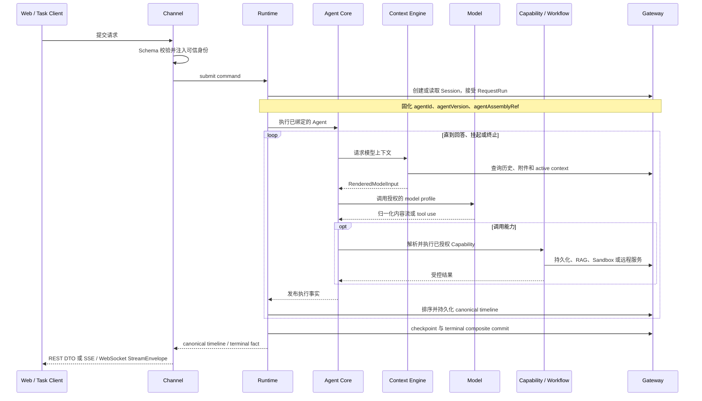

# NextAgent 系统架构

本文介绍 NextAgent 当前代码所实现的系统架构，帮助使用者理解系统如何运行，帮助 Agent、Skill、平台集成和内核开发者判断改动应落在哪一层。

本文是架构导读，不替代规格。行为和边界的权威来源依次为根目录 `AGENTS.md`、`openspec/specs/`、`openspec/designs/` 和已生效的 OpenSpec change。文中“当前实现”以仓库代码和配置为准；尚未形成完整产品能力的方向会明确标注边界。

## 1. 系统定位

NextAgent 是面向电信网络运维场景的 TypeScript 智能体框架。它把模型推理、会话和请求生命周期、Tool/Skill/Agent/Workflow 能力治理、知识与长期记忆、人机协同、受控执行、持久化恢复和可观测审计组织在一条可验证的主路径上。

系统同时服务三类角色：

- 直接使用智能体的网络运维人员：通过 Web 界面完成故障诊断、巡检分析、配置核查、知识问答和报告生成。
- 对接网管、告警、编排等系统的集成方：通过 Task Channel 和回调进行异步机机调用。
- 开发 Agent、Skill、Tool、Plugin 和平台适配器的开发者：在受控扩展边界内装配领域能力，避免分叉通用内核。

架构由两层产品模型组成：

| 层次 | 解决的问题 | 主要载体 |
| --- | --- | --- |
| Generic Agent Kernel | Agent 如何安全、可靠、可恢复地运行 | Runtime、Session、Context、Model、Capability、Gateway ports、Observability contracts |
| Network Agent Assembly | 当前网络 Agent 使用什么模型、提示词、能力和策略 | `application.yaml`、`agent.yaml`、Prompt、Skill、Plugin、Hook、Policy |

领域差异应优先通过 Agent Assembly 表达。只有当现有配置和扩展点无法表达新的通用行为时，才修改核心 contract 或 kernel，并先建立 OpenSpec change。

## 2. 总体架构

```text
┌─────────────────────────────────────────────────────────────┐
│                 入口适配层 (Entry Adapter Layer)           │
│  ┌─────────────┐  ┌─────────────┐  ┌─────────────┐        │
│  │  Web UI     │  │     IM      │  │    A2A      │        │
│  │  (本版本)   │  │  (预留)     │  │  (本版本)     │        │
│  └─────────────┘  └─────────────┘  └─────────────┘        │
│  ┌─────────────┐  ┌─────────────┐                         │
│  │ AgentLink   │  │ EventCenter │                         │
│  │  (本版本)     │  │  (Task)     │                         │
│  └─────────────┘  └─────────────┘                         │
└─────────────────────────────────────────────────────────────┘
                              │
                              ▼
┌─────────────────────────────────────────────────────────────┐
│                  运行时核心 (Runtime Kernel)                 │
│  ┌──────────────────────────────────────────────────────┐  │
│  │              运行时内核 (Runtime Kernel)               │  │
│  │  - 请求生命周期管理                                     │  │
│  │  - 准入控制                                            │  │
│  │  - 会话级串行控制                                        │  │
│  │  - 终态结果提交保证                                     │  │
│  │  - RunTimelineEvent 发布、持久化策略和通道事件转换策略       │  │
│  └──────────────────────────────────────────────────────┘  │
│                                                              │
│  ┌─────────────┐  ┌─────────────┐  ┌─────────────┐        │
│  │ 会话运行时   │  │ 上下文引擎   │  │ 查询策略    │        │
│  │ Session     │  │ Context     │  │ Query       │        │
│  │ Runtime     │  │ Engine      │  │ Policy      │        │
│  └─────────────┘  └─────────────┘  └─────────────┘        │
└─────────────────────────────────────────────────────────────┘
                              │
                              ▼
┌─────────────────────────────────────────────────────────────┐
│                   控制器层 (Controller Layer)                 │
│  ┌──────────────────────────────────────────────────────┐  │
│  │       ModelDrivenAgent ｜ WorkflowDrivenAgent         │  │
│  │  - 请求级业务循环                                       │  │
│  │  - 步骤级模型路由                                       │  │
│  │  - 能力调用决策                                         │  │
│  │  - 流式 tool_use 解析                                  │  │
│  └──────────────────────────────────────────────────────┘  │
└─────────────────────────────────────────────────────────────┘
                              │
                              ▼
┌─────────────────────────────────────────────────────────────┐
│                    能力层 (Capability Layer)                 │
│  ┌─────────────┐  ┌─────────────┐  ┌─────────────┐          │
│  │ 内置能力    │  │ 注册能力     │  │ 远程能力    │          │
│  │ Built-in   │  │ Registered  │  │ Remote     │          │
│  │ Skills/    │  │ Skills/    │  │ AgentReg/  │          │
│  │ Tools/     │  │ Tools/     │  │ SkillHub/  │          │
│  │ Invoked    │  │ Invoked    │  │ MCP        │          │
│  │ Agents     │  │ Agents     │  │            │          │
│  └─────────────┘  └─────────────┘  └─────────────┘          │
└─────────────────────────────────────────────────────────────┘
                              │
                              ▼
┌─────────────────────────────────────────────────────────────┐
│                   平台层 (Platform Layer)                    │
│  ┌─────────────┐  ┌─────────────┐  ┌─────────────┐          │
│  │ 模型网关    │  │ 平台网关    │  │ 身份网关    │          │
│  │ Model       │  │ Platform    │  │ Identity    │          │
│  │ Gateway     │  │ Gateway     │  │ Gateway     │          │
│  └─────────────┘  └─────────────┘  └─────────────┘          │
└─────────────────────────────────────────────────────────────┘
```

> 图中的 Web UI 与 EventCenter/Task 对应当前仓库可直接验证的 Web、Task Channel。A2A 和 AgentLink 保留既有总体架构中的集成位置与版本标识，其具体部署是否已经交付必须以部署侧适配器、OpenSpec 和集成验收证据为准，不能仅由本仓库 package 推断；IM 仍是预留入口。

这张图表达四个关键事实：

1. Channel 只适配协议、可信身份和公开 DTO，不拥有请求生命周期。
2. `agent-runtime` 是所有请求命令和 canonical timeline 的唯一 owner。
3. `agent-core` 决定 Agent 内部业务路由与编排，Runtime 不做网络领域语义判断。
4. `agent-app` 是唯一 composition root；具体实现通过启动期装配进入系统，不在业务包内临时拼装。

### 2.1 最小内核

这里必须区分两个容易混淆的概念：

- **逻辑最小内核**：不依赖具体入口、UI、存储驱动和平台服务，仍能保持一次 Agent 请求的核心语义与不变量。
- **最小可运行产品切片**：在逻辑内核之外，加上一个 Channel、具体 Gateway、可观测实现和 composition host，形成可启动、可验证的产品路径。OpenSpec `ts-minimal-agent-kernel` 定义的是这一产品切片，因此其中出现 `agent-channel-web` 和 SQLite Gateway，不表示它们拥有内核语义。

逻辑最小内核由以下 owner 共同组成：

| 内核职责 | Owner package | 不可替代的不变量 |
| --- | --- | --- |
| 跨模块词汇与端口 | `agent-common`、`agent-contracts` | 所有实现只经 public contract 协作，不能用 private import 建立隐藏耦合 |
| 请求与会话事实 | `agent-runtime`、`agent-session` | admission、same-session lane、RequestRun、canonical timeline、history、checkpoint、恢复和唯一 terminal commit |
| Agent 执行 | `agent-core` | Agent 内部 routing、模型/tool loop 和业务编排；不复制 Runtime 状态机 |
| 模型输入与调用 | `agent-context-engine`、`agent-model` | 上下文预算与渲染、Provider 隔离、stream/tool-use 归一化和安全错误映射 |
| 能力治理 | `agent-capability` | Tool、Skill、Agent 的发现、绑定、授权、输入校验、调用和结果约束 |

最小内核的黑盒目标只有一条：在可信 Owner Scope 与 Agent Scope 下接受请求，使用 acceptance 时固化的 Agent Assembly 完成 context render、model/capability execution，产生 canonical timeline，并把唯一终态与可见 history 一致地提交。只要这条不变量不变，Channel、UI、Plugin、Gateway 实现和部署位置都可以替换。

以下模块是形成当前最小产品路径所需的**外壳或适配器**，但不属于逻辑最小内核：

| 外壳/适配器 | 当前作用 | 为什么不进入内核 |
| --- | --- | --- |
| `agent-app` | 唯一 composition root、配置冻结、ready gate 和 lifecycle host | 只装配 owner，不拥有请求或能力业务语义 |
| `agent-channel-web` 或 `agent-channel-task` | 接入协议、可信身份、schema validation 和公开投影 | 可整包替换，不能拥有 RequestRun lifecycle 或 canonical truth |
| `agent-platform-gateway-local` / `agent-platform-gateway-remote` | 持久化、Sandbox、RAG 和远端平台 adapter | 内核只依赖 Gateway port，不依赖 driver 或远端协议 |
| `agent-observability` | Log、Audit、Metric、Trace、Health 的安全投影 | 观测既有事实，不能改变请求结果或形成第二状态机 |
| `frontend/agent-web` / `agent-app-frontend-hosting` | 浏览器交互投影和可选静态资源托管 | 不拥有可信身份、Scope、history 或 persistence |

`agent-attachment-runtime`、`agent-memory` 和 `agent-workflow` 是当前已实现的受治理子系统，但分别通过附件、长期记忆和 recipe/node 边界接入主路径；它们不扩大 Runtime 的最小生命周期 owner，也不能成为另一套 terminal 或 history owner。

### 2.2 后端可扩展点

后端扩展遵循“先声明、后装配、再授权”的顺序。仓库正式包名是 `agent-channel-web`，不是 `agent-web-channel`；它是后端 Channel adapter，不是前端服务。

| 后端扩展点 | 适用场景 | 当前载体与接入方式 | 不可突破的边界 |
| --- | --- | --- | --- |
| Agent Assembly | 修改 Agent 身份、Prompt、模型授权、能力绑定、runtime settings 和 Hook/Policy 激活 | Agent package `agent.yaml`、`prompts/` 和资源；由 `agent-app` 编译为冻结的 `AgentAssembly` | 只能声明和激活能力，不能携带可信身份、物理部署路径或运行期状态 |
| Capability | 新增电信领域 Tool、Skill、子 Agent 或确定性 Recipe | Provider contribution 进入 `agent-capability` catalog；Recipe 进入 `agent-workflow` | 必须经过 binding、schema、风险、Sandbox、审计和结果治理，不能直接取得宿主进程权限 |
| Startup Plugin | 新增受信 TypeScript capability provider、routing policy 或 lifecycle hook | 本地 `plugin.json` + 单文件 ESM bundle；使用 `agent-plugin-sdk` 编写，在 `application.yaml` 显式列出，由 `agent-app` 启动期加载 | 只允许已开放 contribution；不支持 request-time hot load、远端下载、自动安装或绕过 owner 执行 |
| Channel adapter | 新增 Web、Task 或其他北向接入协议 | `agent-channel-web`、`agent-channel-task` 或后续同形 package，由 `agent-app` 通过 public factory 注册 | 只拥有 transport、schema、可信身份接入和 DTO/stream projection，不能拥有 lifecycle、history 或 persistence |
| Auth adapter | 对接部署环境的认证与可信身份来源 | Channel auth contribution；当前 `agent-channel-web-auth-local` 仅服务 localhost configured-auth | Owner Scope 必须来自可信 auth/channel boundary，不能来自请求 body、模型或 Capability 参数 |
| Gateway/Model provider | 替换持久化、RAG、Sandbox、Workflow、平台 API 或模型 Provider | `agent-platform-gateway-local`、`agent-platform-gateway-remote`、Model Provider，通过 public port 注入 | Adapter 只能实现端口，不能改变 DO/Record/DTO、Scope、幂等、terminal commit 或 Runtime 状态机 |
| Observability exporter | 接入 Log、Audit、Metric、Trace 和 Health 后端 | `agent-observability` projector/exporter 或部署侧 sink | 只能投影已成立事实，必须执行安全约束，失败不得改写业务结果 |

Startup Plugin 的权限链是固定的：

```text
plugin artifact 被加载
        ↓ 只形成启动期 contribution snapshot
Agent Assembly 显式激活 provider / policy / hook
        ↓ 只形成当前 Agent 的授权事实
Capability / Core / Runtime owner 在自己的受控边界执行
```

插件被加载不等于 Agent 获得调用权限：

- capability provider 交给 `agent-capability`，Tool 还必须匹配 `AgentAssembly.capabilityBindings`。
- routing policy 交给 runtime policy registry，并仅在 `agent-core` 的开放 routing point 执行；当前只开放 `agentRoutingPolicy`。
- lifecycle hook 交给 startup hook registry，并仅由 `agent-runtime` 按已定义 stage、effect、order 和 timeout 执行。

新增 Agent 行为优先使用 Agent package、Tool/Skill/Agent/Recipe；只有需要受信 TypeScript 代码贡献时才使用 Startup Plugin。新增入口协议实现 Channel adapter，替换平台能力实现 Gateway/Model provider。不得用 Plugin 模拟 Channel、用 Channel 承载业务状态，或用远端 Gateway 反向拥有 Runtime 生命周期。

### 2.3 前端服务

前端服务由“浏览器应用制品”和“可选后端静态托管”两部分组成。`agent-channel-web` 提供前端调用的后端 API，但它本身不属于前端服务。

| 组成 | Owner | 当前职责 |
| --- | --- | --- |
| 前端源码 | `frontend/agent-web` | React chat workspace、组件交互、local view state，以及 local、immersive、collaborative 三种宿主投影 |
| 正式前端制品 | `@nextagent/agent-web` | 构建后的 HTML、JavaScript、CSS、PIU assets 和 `@nextagent/agent-web/hosting` manifest；版本与根产品版本一致 |
| 静态托管 adapter | `agent-app-frontend-hosting` | 注册前端静态资源 route 和 SPA fallback；不定义 API 或前端业务状态 |
| 前端调用的后端 API | `agent-channel-web` | REST、SSE、WebSocket、bootstrap 和 public DTO projection；仍是后端 Channel adapter |
| 一体化入口 | `agent-app/entrypoints/with-frontend` | 在标准后端装配完成后，于 ready 前接入正式前端制品和静态托管 adapter |

前端服务有两种正式部署方式：

| 方式 | 部署路径 | 约束 |
| --- | --- | --- |
| 前后端分离 | `backend-only` 提供后端 API；`@nextagent/agent-web` 静态制品由独立 Web 容器或产品宿主托管，并把 `/api/**`、SSE/WS 指向同一后端 | 前端托管位置不能改变 API、identity、Scope、stream 或 history 语义 |
| 一体化托管 | `with-frontend` 在同一 NextAgent 服务中托管正式静态制品，同时复用标准 Web Channel | 只是增加静态资源与 SPA fallback；不能形成第二套 API、Runtime 或会话状态 |

`dev:watch` 中的 Vite dev server + `backend-only` `/api` proxy 只是源码开发服务，不是第三种生产架构。local、immersive、collaborative 也只是同一前端应用的三种宿主投影，不是三套前端服务：它们必须复用同一个 Chat Workspace、后端 bootstrap/transport contract 和 canonical history。

前端只拥有浏览器渲染、交互和临时 view state。request lifecycle、trusted identity、Owner Scope、Agent Scope、canonical stream/history、Capability authority 和 persistence 全部属于后端；URL、localStorage、浏览器环境变量或 UI 控件不得成为这些事实的权威来源。

### 2.4 服务化方式

NextAgent 当前采用“**内核进程内模块化，平台能力端口服务化**”的方式，而不是把每个 npm package 直接拆成微服务：

```text
Web / Task / Product Host
          │
          ▼
Channel Adapter ── public DTO / stream projection
          │ runtime-facing ports
          ▼
agent-app composed kernel process
Runtime ─ Core ─ Context ─ Model ─ Capability
          │ async Gateway / Provider ports
          ▼
LOCAL adapters                 REMOTE platform services
SQLite / files / sandbox       Model / RAG / Sandbox / Workflow / PaaS
```

当前支持的服务与交付形态如下：

| 形态 | 进程/制品边界 | 适用场景 | 保持不变的内核边界 |
| --- | --- | --- | --- |
| LOCAL backend service | `backend-only` 启动 NextAgent 后端；`agent-channel-web` / Task Channel 暴露北向服务，前端可独立托管 | 本地部署、独立 API 服务、前后端分离 | Runtime lifecycle、Scope、timeline 和 terminal commit 均在同一个 composed app 中 |
| LOCAL integrated service | `with-frontend` 在同一后端额外注册构建后的 agent-web 静态资源和 SPA fallback | 一体化安装包 | 与 backend-only 使用同一内核和 API；静态托管不获得业务 ownership |
| REMOTE/hybrid deployment | `agent-remote-deployment` 装配远端 Gateway/Model client；当前参考实现仍组合部分本地 SQLite/support provider | 平台服务、PaaS 或客户系统集成 | 只替换 port 后的实现；不得改变 Channel contract、accepted assembly、Runtime 状态机和安全边界 |
| Embedded product host | 产品宿主调用 `agent-app` public factory，并注入明确的 Channel、Provider 和可信 host contribution | 产品内嵌、定制认证或平台壳集成 | `agent-app` 仍是唯一 composition root，宿主不能在 app ready 后追加第二套装配路径 |

服务化的北向边界是 Web/Task Channel，南向边界是 async Gateway/Model/Capability provider port。`agent-runtime`、`agent-core`、`agent-session`、`agent-context-engine` 之间当前是进程内 contract 调用；若把其中任一 owner 独立成网络服务，会引入新的失败、幂等、一致性和恢复语义，必须先通过 OpenSpec 重新定义，不能仅把 package 换成 RPC。

REMOTE 表示某些平台能力可以通过远端 adapter 提供，不表示当前所有持久化事实、scheduler、lease 或 recovery 已天然分布式化。多实例部署必须额外证明共享持久化、same-session lane 协调、terminal composite write、timeline replay/接续和恢复 owner 均成立；参考 adapter 或 HTTP client 的存在本身不是该证明。

## 3. 一次请求如何运行

### 3.1 请求主路径



请求接受时，Runtime 将 `agentId`、`agentVersion` 和 `agentAssemblyRef` 固化到 `RequestRun`。接受后的 Runtime、Core、Context、Model、Capability 和 Gateway 查询不得重新回退到默认 Agent，这保证重试、恢复和长任务执行期间使用同一份 Agent 装配事实。

同一 Session 的请求通过 same-session lane 协调，不同 Session 可以在受控并发预算内运行。取消和超时通过 Runtime 持有的 cancellation context 向 Agent、Model、Capability 和可取消的远程 Gateway 边界传播。

### 3.2 事件、流和历史是三种不同事实

| 数据 | Owner | 用途 |
| --- | --- | --- |
| `RunTimelineEvent` | `agent-runtime` | 请求执行过程的 canonical timeline、恢复和审计来源 |
| `StreamEnvelope` | Channel projection | 面向 Web/Task 客户端的可见传输投影，不是持久化业务真相 |
| `SessionMessage` | Session/Gateway 主路径 | 会话历史和再次打开会话时的对话事实源 |

SSE 与 WebSocket 消费同一条 Runtime timeline，并使用同一套安全 projection。断开流连接不会取消请求，也不会改变 RequestRun 状态；历史页面不依赖完整保留 transport stream。

终态只有在要求的消息、timeline、状态和关联事实通过 terminal commit 成功写入后才对外可见。长期记忆提取、aging 和其他后台学习任务不阻塞该提交边界。

### 3.3 人机协同

澄清、问题、确认、授权和人工接管统一进入 pending-input 生命周期。它们挂起并恢复同一个 RequestRun，而不是新建一套 Channel 私有状态机或把后续回答误建成新的 root request。

## 4. 核心模块与所有权

当前根 npm workspace 包含 26 个后端 package。它们按所有权分组如下。

### 4.1 契约与基础

| Package | 当前职责 |
| --- | --- |
| `agent-common` | 跨多个 contract subpath 共享的稳定标量词汇、ID、错误和最小 logging contract |
| `agent-contracts` | Runtime、Session、Context、Model、Capability、Gateway、Channel、Assembly、Observability 等跨包 public contract |
| `agent-local-file-roll` | Node-only 文件轮转技术基础，只服务获准的日志、指标历史和审计文件 owner |
| `agent-log` | 本地 operational/runtime diagnostic writer |

`agent-common` 不承载 DO、DTO、Record、port 或业务服务；跨 package 只允许通过 public exports 和 `agent-contracts`/`agent-common` 协作，禁止 private path import。

### 4.2 请求与业务执行

| Package | 当前职责 |
| --- | --- |
| `agent-runtime` | request admission、RequestRun 生命周期、same-session lane、cancellation、checkpoint、pending input 协调、recovery、terminal commit、canonical timeline |
| `agent-session` | Session/Message 领域服务、历史与 conversation read model、标题、推荐问题、收藏/标注/分享等会话侧服务 |
| `agent-core` | Agent 内部路由、模型驱动 loop、tool loop、fallback、风险策略接入和 capability 结果投影 |
| `agent-context-engine` | 上下文候选选择、预算、窗口、压缩、大内容外置、Prompt Template 选择与最终模型输入渲染 |
| `agent-model` | 模型 Provider SDK 隔离、调用前置条件、stream/tool-use 归一化和 provider error 安全映射 |

`agent-core` 当前内置：

- `default-agent`：默认对外电信网络 Agent，绑定受治理的子 Agent 和长期记忆工具。
- `network-explorer`：不可直接由用户调用的只读证据采集 Agent，禁止 Write、Bash、Python、Skill 和 AskUserQuestion。

### 4.3 能力、工作流与后台知识

| Package | 当前职责 |
| --- | --- |
| `agent-capability` | Capability catalog、source discovery、冲突处理、输入校验和执行；统一承载 Tool、Skill 和 Agent |
| `agent-workflow` | Workflow recipe loader、执行引擎、路由以及 gateway、parallel、capability、interaction、knowledge、LLM 节点适配 |
| `agent-attachment-runtime` | 上传配额、媒体类型与内容校验、暂存、引用解析和 cleanup |
| `agent-memory` | 长期记忆查询/写入、显式 memory tools、task trajectory、异步 extraction 和 aging |

Capability “可发现”不代表“可调用”。Agent 必须通过 `agent.yaml.capabilityBindings` 显式绑定，Runtime/Core 还会结合当前 Agent Scope、request routing constraints 和风险策略决定本次请求是否可执行。

动态 shell、Python、脚本或模型生成代码必须经过 Sandbox Gateway。Capability 实现不得直接借用 NextAgent 宿主进程权限绕过该边界。

### 4.4 Channel 与前端交付

| Package/目录 | 当前职责 |
| --- | --- |
| `agent-channel-common` | Channel 间共享的 identity、stream projection 和 delivery 基础 |
| `agent-channel-web` | Fastify Web API、runtime bootstrap、public DTO、SSE/WS 投影 |
| `agent-channel-web-auth-local` | 可选的 localhost configured-auth adapter；不进入 IAM/REMOTE 认证路径 |
| `agent-channel-task` | 面向后台系统的异步任务、callback 和 WebSocket 接入 |
| `frontend/agent-web` | React 浏览器 UI、chat workspace、会话/进程/附件/记忆/定时任务等交互投影 |
| `agent-app-frontend-hosting` | 后端拥有的前端静态资源托管契约和 route fallback |
| `agent-dev-workbench` | 本地开发工作台和前端开发辅助 |

浏览器 UI 支持 local、immersive、collaborative 三种产品宿主构建。Collaborative 模式通过 PIU 注入复用同一个 Chat Workspace；宿主差异仅处理容器、主题、语言、可信用户上下文和布局，不形成平行的请求生命周期、会话真相或权限模型。

后端不得直接 import `frontend/agent-web` 源码。`with-frontend` 形态只消费构建后的 `@nextagent/agent-web` 包、`@nextagent/agent-web/hosting` public export 和静态产物。

### 4.5 Gateway、部署和 Composition

| Package | 当前职责 |
| --- | --- |
| `agent-platform-gateway-local` | Kysely/SQLite 业务表、本地文件/blob、受限 Sandbox、RAG、Cron、后台任务与维护调度 |
| `agent-platform-gateway-remote` | Remote Provider 和 model、RAG、Sandbox、SkillHub、workflow、问题推荐等参考 adapter |
| `agent-remote-deployment` | REMOTE 部署参考装配、远程 client binding 和启动/健康证据 |
| `agent-app` | 唯一 composition root：加载配置并装配 Agent、Model、Gateway、Capability、Workflow、Memory、Channel、Hook/Policy 和 Observability |
| `agent-plugin-sdk` | 启动期可信本地 Plugin authoring、scaffold、developer hook trace 和 context monitor |
| `agent-test-kit` | Plugin/Capability 等扩展的公共测试支持 |
| `agent-observability` | Observation redaction、structured logging、audit、metric、trace、health 和安全错误归一化 |

`agent-platform-gateway-local` 使用 request run、session、message、attachment、active context、timeline、checkpoint、pending input、memory、trajectory、todo、annotation、share 和 cron 等专用事实表。领域数据不落入通用 `records(store,key,json)` 表。

REMOTE 当前是可替换 Gateway 和参考部署装配边界。代码已提供若干 HTTP/reference adapter，但不应据此推断所有 PaaS 服务、多实例恢复或分布式 Workflow 能力已经完整交付；具体部署能力以对应 OpenSpec 和集成实现为准。

## 5. 数据、契约与安全边界

### 5.1 双 Scope 隔离

主路径必须同时满足：

- **Owner Scope**：由 Channel/Auth 的可信身份产生，以 `tenantId`、`subjectId` 隔离用户和租户运行数据。
- **Agent Scope**：由可信 app composition、hosted-agent selection 或已持久化的 `Session.agentId` 产生，以 `agentId` 隔离 Agent 配置、模型授权、能力绑定和 Agent-owned 数据。

请求体、查询参数、模型输出、Capability 参数和客户端 metadata 都不能覆盖这两个 Scope。已有 Session 的提交可以先按 Owner Scope 查到 `Session.agentId`，但随后必须与当前可信 Agent Scope 一致。

### 5.2 DO、DTO、Record、Row

```text
Domain Object / internal read model
        ↓ Channel projection
Public Web / Task DTO

Domain Object
        ↓ explicit mapper
Gateway *Record
        ↓ gateway-local private mapper
SQLite row / driver entity
```

- 领域服务暴露领域对象或内部 read model。
- Channel 只暴露 public DTO；`displayTitle`、`lastActivityAt`、`cursor`、`nextCursor` 等 Web alias 只出现在 projection 层。
- Gateway port 只接收或返回 `*Record`；Record 不得进入 Web response 或领域服务 public return。
- SQLite row 和 driver entity 只存在于 gateway-local 私有实现。
- 写入控制信息如 `idempotencyKey`、`expectedVersion` 属于 write options/command metadata，不塞进事实 Record。

### 5.3 幂等与事务

简单写入采用 `Record + write options`。幂等写入以业务锚点事实表为默认模型，并在 Owner Scope、Agent Scope 和 session/request/run 坐标上建立 scoped uniqueness；重复 key 返回首次锚点结果且不重复副作用。

跨多个主路径事实的原子提交由 Gateway 暴露单一 composite write，并在 gateway-local 的一个数据库事务内完成。Runtime/Application 组装业务语义 Record，Gateway 只负责 row mapping、CAS、sequence/ordinal、唯一约束、幂等和事务。

### 5.4 不可信边界与可观测安全

HTTP、stream、配置、环境变量、Gateway response、持久化 JSON、Capability 输入输出都先经过 runtime schema validation。慢边界使用 async contract，并在可取消时传播 `AbortSignal` 或等价 cancellation context。

可观测主路径将已成立事实投影到 Log、Audit、Metric、Trace 和 Health。默认禁止输出 prompt、模型原始输出、stream delta、Tool 原始输入输出、附件内容、raw provider/gateway error、credential、token、本地路径和开放式高基数字段。可观测失败不能创建第二套业务状态机或改写 RequestRun 结果。

## 6. 装配、配置与扩展

系统在启动期完成配置校验和装配，运行中不热更新 Plugin registry、Hook、Policy 等核心 snapshot。Agent Assembly 可以通过受控 registry refresh 发布新版本，但已 accepted request 始终使用 acceptance 时固化的 `agentAssemblyRef`。

| 扩展面 | 适用场景 | 关键约束 |
| --- | --- | --- |
| `application.yaml` | 部署、路径、Channel、Auth、Model Profile、Gateway、Sandbox、Plugin/Provider 选择 | 启动期校验；秘密使用 env/file reference |
| Agent package `agent.yaml` | Agent 身份、模型授权、能力绑定、runtime settings、资源和 Hook/Policy 激活 | `agentId` 是 Scope，不来自请求体 |
| Prompt Template | 不同 purpose 的系统提示、总结、记忆提取等模型输入 | 由 Context Engine 选择和渲染 |
| Tool / Skill / Agent / Recipe | 电信领域动作、操作规程、专家 Agent 和确定性流程 | 进入统一 catalog、授权、校验、审计和 Sandbox 治理 |
| Startup Plugin | 本地可信 Tool Provider、Routing Policy、Lifecycle Hook 等代码扩展 | 仅启动期加载，不支持 request-time 任意代码热插拔 |
| Gateway Provider | 替换本地或远程持久化、RAG、Sandbox、模型和平台服务 | 通过 public contract 注入，由 `agent-app` 选择和装配 |

默认系统配置位于 `packages/agent-app/config/default-system.yaml`。默认对外 Agent 和只读子 Agent 分别位于：

- `packages/agent-core/src/builtin-agents/default-agent/agent.yaml`
- `packages/agent-core/src/builtin-agents/network-explorer/agent.yaml`

## 7. 运行与交付形态

第 2.4 节定义服务化边界；当前代码提供以下后端产品入口：

| 入口 | 用途 |
| --- | --- |
| `agent-app/entrypoints/backend-only` | 仅后端服务 |
| `agent-app/entrypoints/with-frontend` | 后端加构建后的 agent-web 静态托管 |
| `agent-app/entrypoints/local-configured-auth` | localhost-only 的可选配置认证形态 |
| `agent-platform-gateway-local/entrypoints/local` | 使用本地 Gateway、Sandbox、RAG、Cron 和维护调度的装配 |
| `agent-remote-deployment` | 使用远程参考 adapter 的部署装配 |

LOCAL 默认使用 SQLite 工作/长期记忆 store、本地文件与受限 Sandbox。REMOTE 可以按 gateway kind 注入远端实现，但当前 `agent-remote-deployment` 仍是本地与远端 provider 的组合装配，不应表述为所有状态均已远端化；部署模式变化不能改变 Runtime lifecycle、public contract、Scope 校验或 Channel stream 语义。

## 8. 架构验证

仓库通过不同层级的门禁验证架构，而不是只依赖单元测试：

```bash
npm run build
npm test
npm run test:contract
npm run lint:architecture
openspec validate --all --strict
```

涉及前端时，还需在 `frontend/agent-web` 运行对应 build、测试和必要的多宿主/E2E gate。根 workspace、前端 package、OpenSpec 和发布包各有独立验证边界。

架构测试重点防止：

- Channel、前端或 Gateway 获取 RequestRun lifecycle ownership。
- 跨 package private import 和实现层反向依赖。
- Owner Scope/Agent Scope、Sandbox 或 schema validation 被绕过。
- DTO、Record、SQLite row 跨层泄漏。
- Runtime、Core、Workflow、Memory 形成互相竞争的状态机。
- 测试 fixture、mock/no-op provider 进入产品路径。

## 9. 当前边界

- Web 和 Task Channel 已实现；其他入口若要进入产品路径，必须先定义 OpenSpec contract，不能复制 Runtime lifecycle。
- Plugin 是 trusted、startup-only 扩展面；SkillHub 的运行时发现/获取不等同于远端任意代码加载。
- Workflow 已有 recipe、engine 和节点族，但不拥有 Runtime lifecycle、terminal commit 或 pending-input store；完整分布式调度、durable workflow history 和多实例恢复不应从当前实现中推断。
- 长期记忆已包含显式工具、trajectory、extraction 和 aging，但不自动注入 Context，也不阻塞 terminal commit。
- 本地恢复面向单实例进程恢复；共享状态、多实例 lease/接续能力以具体部署规格和实现证据为准。
- 前端只拥有浏览器投影、交互和本地 view state；canonical history、trusted identity、Scope authority 和持久化都属于后端。

## 10. 延伸阅读

- [项目总览](../README.md)
- [开发者架构导读](./developer/02-architecture.md)
- [前端文档入口](./frontend/README.md)
- [OpenSpec 总览](../openspec/overview.md)
- [稳定架构设计](../openspec/designs/architecture/)
- [规格到设计映射](../openspec/designs/spec-to-design-map.md)
- [Web API 清单](./apis/agent-web-api-list.md)
- [Task Channel API](./apis/task-channel-api.md)
