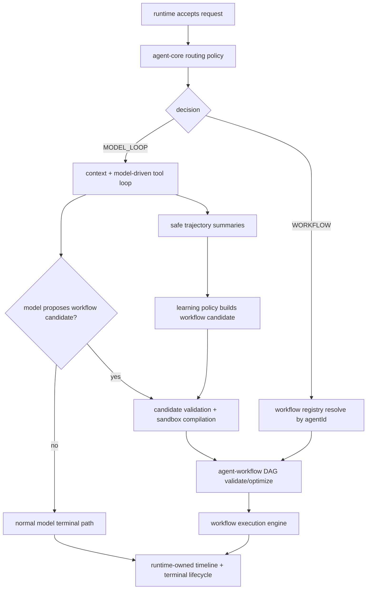

## 背景和现状（Context）

NextAgent 已经有一组 workflow active changes：`add-ts-workflow-engine-contracts` 冻结最小 workflow contract，`add-ts-workflow-execution-engine` 承接单实例内存执行，`add-ts-workflow-routing` 处理显式 recipe dispatch，`add-ts-workflow-gateway-nodes` 和 `add-ts-workflow-parallel-gateway` 分别处理基础 gateway 与后续并行 gateway，`add-ts-workflow-package-composition` 建立 `agent-workflow` package 和 startup wiring。

这些 change 都是局部能力，尚未定义高一层的 orchestration policy：同一个 Agent 请求何时走高性能预置 workflow，何时走模型驱动 loop；智能体开发者如何提供受控 routing 规则或完整 policy；模型在复杂任务中如何规划出可执行 workflow；多次成功执行的 model loop 如何通过自学习沉淀为 workflow；YAML DSL 和模型生成 TS workflow 如何进入同一 engine；DAG 优化如何不破坏电信运维任务的确定性和审计性。

当前稳定 `agent-routing-core` 已明确 routing policy 位于 Agent Core 内部，且 runtime/channel 不拥有业务路由。本 change 继续沿用该边界：runtime 只拥有 request lifecycle、scheduler、cancellation、timeline 和 terminal commit；Agent Core 拥有请求 handling path 选择；`agent-workflow` 拥有 workflow source 处理、DAG plan 和 engine adapter。

## 目标和非目标（Goals / Non-Goals）

**目标：**
- 支持 `WORKFLOW` 与 `MODEL_LOOP` 两种 handling mode，并保持 model loop 为未命中默认路径。
- 支持开发者配置 ordered routing rules，也支持 trusted Agent package 提供完整 routing policy implementation。
- 支持模型在复杂电信任务中规划 workflow candidate，经治理后转为 deterministic workflow 执行。
- 支持从多次成功、路径稳定的 model loop 执行轨迹中自学习生成 workflow candidate，经治理发布后供后续相似请求直接走 workflow。
- 为 workflow DAG 提供验证和优化边界，包括入口校验、边校验、拓扑计划、可并行识别和安全诊断。
- 统一 YAML DSL workflow 与 TS workflow source：两者都 canonicalize 为同一 workflow contract，并由同一 engine 执行。
- 明确 Agent Scope、Owner Scope、sandbox、安全观测和 fallback 规则。

**非目标：**
- 不新增 Web API、runtime command 或客户端 DTO。
- 不新增 recipe/workflow durable store、workflow event durable table、snapshot、resume、distributed scheduler 或 recovery。
- 不在本 change 实现完整 BPMN 语义、rollback/degrade branch、跨实例并发 join、长事务补偿或可视化编排 UI。
- 不让 `agent-model`、runtime、channel 或 gateway adapter 拥有 workflow routing 语义。
- 不允许模型生成代码或开发者 policy code 直接在宿主进程执行。

## 设计决策（Decisions）

1. **Agent Core 是 mode selection owner。**
   Agent Core 在 runtime acceptance 后、context assembly/model invocation/workflow execution 前执行 routing policy。policy 输出只能是受控 decision：执行已注册 workflow、进入 model loop、或 safe fail-closed。这样保持业务路由不进入 runtime/channel，也避免 workflow engine 自己反向决定是否执行。

2. **workflow target 必须按当前 `agentId` 解析。**
   WORKFLOW capability catalog 查询与 recipe definition source 查询必须带当前 Agent Scope。即使不同 Agent 有同名 workflow，也只能命中当前 frozen Agent assembly 可见的 workflow。Owner Scope 继续来自 runtime/channel 可信 identity。

3. **routing rules 与 complete policy 使用同一个输出 vocabulary。**
   ordered rules 是最小常用配置；complete policy 是高级扩展。二者都必须返回同一个 controlled routing decision，Agent Core 统一做 output validation、target resolution、fallback 和 safe diagnostics。放弃让 complete policy 直接调用 workflow engine，因为那会绕过 registry、scope、fallback 和 observability。

4. **complete policy implementation 是 trusted package code，但仍受 controlled SPI 限制。**
   policy 输入只包含 runtime-accepted input text、frozen assembly、workflow metadata、governed capability view、locale、identity summary 和 cancellation context。policy 不接收 raw prompt、raw model output、raw capability args/result、host path 或 provider payload。若 policy implementation 是动态 TS source，必须通过 sandbox gateway 编译/执行。

5. **模型规划 workflow 分两阶段：candidate 与 accepted workflow。**
   模型只能产出 workflow candidate。candidate 必须经过 schema validation、capability governance、DAG validation、sandbox compilation 和 safe diagnostic mapping。只有 accepted canonical workflow 才能进入 engine。放弃“模型直接发起节点执行”的方案，因为它无法保证确定性、审计和失败原子性。

6. **model loop 到 workflow 的自学习分三阶段：观察、候选、发布。**
   `agent-memory` / task trajectory 相关能力只记录安全的执行轨迹摘要和 governed capability refs，不记录 raw prompt、raw model output 或 raw capability payload。学习策略在发现同一 Agent 下多次成功且路径稳定的任务后，生成 learned workflow candidate。candidate 必须复用 model-planned workflow 的 validation、sandbox compilation、DAG validation 和 publication 流程。只有发布后的 learned workflow 才能进入 registry 并被 routing policy 选择。放弃“成功几次后自动直接启用”的方案，因为这会绕过治理、版本和安全审查。

7. **YAML DSL 与 TS workflow 统一到 canonical workflow module。**
   预置 workflow 的用户可见 authoring 格式是 YAML DSL；启动期或首次使用前编译成 canonical TS workflow module。模型生成 workflow 使用 TS source candidate。两者都 canonicalize 为 `RecipeDefinition` / `FlowGraph` 等现有 workflow contract，再交给同一个 engine。放弃为 YAML 和 TS 分别维护两套 engine，以避免行为漂移。

8. **DAG optimizer 只做语义保持优化。**
   optimizer 在 `agent-workflow` 内部生成 execution plan：拓扑排序、不可达节点检查、条件边检查、可并行节点标记、side-effect barrier 标记。side-effecting node 的依赖顺序不得被改变。并行执行是否真正发生，仍受 engine 和 gateway node change 的能力约束；optimizer 不提前承诺分布式并发。

9. **动态 TS 编译与执行只走 sandbox gateway boundary。**
   模型生成 TS workflow source、动态 developer policy source 和需要执行的动态 workflow code 都不得 `import()` 到 host process。sandbox 输出只能是 canonical workflow JSON/module summary 和 safe diagnostics。host 只消费校验后的 canonical representation。

10. **fallback 是 policy 行为，不是隐式补救。**
   workflow target missing、workflow validation failure、workflow runtime failure 是否回退 model loop，必须由 trusted policy fallback 配置或明确 spec 场景决定。默认 fail-closed 或使用 model loop 仅适用于未命中 routing rule，不适用于已经选择但失败的 workflow。

11. **当前实现差距。**
    现有 active changes 覆盖 registry、显式 routing、engine、gateway node 和 package skeleton 的一部分；本 change 新增的 complete policy SPI、model-planned workflow candidate、loop-to-workflow learning、YAML->TS compiler、TS source sandbox compilation、DAG optimizer 和统一 canonicalization 尚未实现。

## 目标架构

## 主要接口边界

### Routing Policy

`agent-core` 内部定义 workflow-aware routing service。它消费：
- runtime-accepted request facts：accepted input text、session/run/request ids、locale、identity summary、cancellation signal。
- frozen Agent assembly facts：`agentId`、`agentVersion`、`agentAssemblyRef`、routing config、workflow bindings。
- governed workflow metadata：workflow id/name/version/display metadata、declared telecom domain/scene、safe tags。
- governed capability view：仅用于判断 workflow 依赖是否当前 Agent 可见，不作为 capability execution authority。

输出：
- `MODEL_LOOP`
- `WORKFLOW` with `recipeName` / `workflowId` and fallback policy
- safe policy error

### Workflow Source Pipeline

YAML DSL source:
1. `agent-app` startup 或 first-use loader 发现可信 workflow file。
2. `agent-workflow` YAML parser 做 schema validation 和 path/source safety。
3. YAML compiler 生成 canonical TS workflow module。
4. canonicalizer 输出 workflow contract。
5. registry 按 `agentId` 注册 workflow metadata 和 canonical graph。

TS workflow source:
1. 模型或 trusted package 提供 TS source candidate。
2. sandbox gateway 执行 compilation/typecheck/static policy checks。
3. host 接收 canonical workflow output，不接收可执行 host module。
4. canonicalizer、DAG validator 和 optimizer 复用同一路径。

Learned workflow source:
1. model loop 正常完成后，task trajectory / memory path 异步接收安全轨迹摘要，不阻塞 request terminal commit。
2. learning policy 对同一 Agent 下相似任务的成功轨迹做稳定性判断。
3. 命中学习条件后生成 learned workflow candidate。
4. candidate 进入与 model-planned workflow 相同的 validation、sandbox compilation、DAG validation 和 publication 流程。
5. 发布后的 learned workflow 注册到当前 Agent 的 workflow registry，后续 routing policy 才能选择。

### DAG Plan

DAG validator/optimizer 归 `agent-workflow`，输入 canonical `FlowGraph`，输出内部 `WorkflowExecutionPlan`。该 plan 不成为 public Web DTO，不持久化为 gateway Record。首版 plan 至少承载：
- 唯一 start node。
- node id 集合和 edge adjacency。
- topological levels。
- side-effect barrier。
- branch condition safe summary。
- parallelizable group 标记。
- safe diagnostic summary。

## 质量属性设计（Quality Attributes）

| 质量属性 | 设计结论 | 验证入口 |
|---|---|---|
| 安全 | Agent/Owner Scope 只来自 runtime 和 frozen assembly；workflow source、policy output、模型 candidate 和 learned candidate 不得覆盖。学习输入只能是 safe trajectory summary。动态 TS 编译/执行走 sandbox gateway；观测只输出 safe summary。 | contract tests；sandbox negative tests；architecture dependency tests；code review |
| 性能/容量 | 高频典型问题通过预置 workflow 跳过 initial model planning loop；稳定重复的 model loop 可沉淀为 learned workflow，后续减少重复规划；YAML 可启动期编译并缓存 canonical graph；DAG plan 可缓存到内存 registry。模型/学习 candidate 编译设超时和大小上限，避免长尾任务拖垮主路径。 | workflow integration benchmark；compiler cache unit tests；timeout tests；learning promotion tests |
| 可靠性/恢复 | 本 change 不引入 durable workflow recovery；执行仍使用现有 runtime cancellation 和 terminal lifecycle。学习过程异步进行，不阻塞 request terminal commit。workflow target missing、validation failure 和 runtime failure 明确 fail-closed 或 policy fallback。 | routing fallback tests；workflow failure characterization tests；cancel tests；learning async tests |
| 可维护性 | `agent-core` 只负责 routing/fallback，`agent-workflow` 负责 source/canonical/DAG/engine，`agent-app` 负责 composition，`agent-model` 不拥有 workflow semantics。 | `npm run lint:architecture`；package boundary tests；OpenSpec review |
| 可测试性 | 每层都有 deterministic 输入输出：policy decision、source compilation、canonical graph、DAG plan、engine result。模型 candidate 用 fixture 模拟，不依赖真实 provider。 | unit/contract/integration tests；golden YAML fixture tests；negative DAG tests |
| 审计/可追溯性 | routing decision、candidate accept/reject、compiler result、DAG optimization summary 和 workflow execution lifecycle 都只发布安全摘要和稳定 refs，不记录 raw prompt/model/tool payload。 | observability contract tests；redaction tests；trace assertion tests |

## 验证映射（Verification Map）

| 约束 | Task | 验证入口 |
|---|---|---|
| Agent Core 选择 `WORKFLOW` 或 `MODEL_LOOP` | 1.1, 4.1 | integration tests |
| workflow target 按当前 `agentId` registry 解析 | 1.2, 4.2 | contract / integration tests |
| routing rules 与 complete policy 统一 decision validation | 1.3, 1.4, 4.3 | unit / integration tests |
| invalid policy output fail closed | 1.5, 4.4 | negative tests |
| model workflow candidate 不直接执行 | 2.1, 4.5 | contract / security tests |
| repeated model loop 只能生成 learned candidate，不能直接执行 | 2A.1, 2A.2 | learning / security tests |
| published learned workflow 通过 registry 和 routing 进入 workflow path | 2A.3, 4.2 | integration tests |
| TS candidate 编译走 sandbox gateway | 2.2, 4.6 | sandbox boundary tests；architecture tests |
| YAML DSL 编译到 canonical TS workflow | 2.3, 4.7 | golden fixture tests |
| YAML 与 TS canonical graph 走同一 engine | 2.4, 4.8 | integration tests |
| DAG invalid case 执行前拒绝 | 3.1, 4.9 | DAG negative tests |
| DAG optimizer 保持 side-effect order | 3.2, 4.10 | characterization tests |
| safe diagnostics 不含敏感字段 | 3.3, 4.11 | redaction / observability tests |
| package 边界不泄漏 runtime/channel/gateway owner | 5.1 | `npm run lint:architecture` |
| OpenSpec 全量有效 | 6.1 | `openspec validate --all --strict` |

## 文档承载决策（Documentation Ownership）

- 行为契约：`openspec/specs/workflow-orchestration-policy/spec.md` 主承载 workflow/loop 双模式、routing policy、model-planned workflow、loop-to-workflow learning、DAG optimization、YAML/TS 统一执行行为；`openspec/specs/agent-routing-core/spec.md` 主承载 Agent routing policy 对 workflow/model loop decision 的行为。
- 架构和跨模块设计：`openspec/designs/architecture/workflow-orchestration-policy.md` 主承载跨模块流程、policy 边界、fallback、安全和观测；`openspec/designs/architecture/workflow-contracts.md` 只补充 canonical workflow 与 engine 边界。
- 模块设计：`openspec/designs/modules/agent-core.md` 主承载 routing owner；`openspec/designs/modules/agent-workflow.md` 主承载 compiler、canonicalizer、DAG optimizer 和 engine adapter；`openspec/designs/modules/agent-memory.md` 主承载自学习轨迹摘要和 learning policy 边界；`openspec/designs/modules/agent-app.md` 主承载 startup composition。
- ADR：`openspec/designs/adr/workflow-yaml-ts-unified-engine.md` 主承载 YAML/TS 统一 engine 的长期技术决策。
- 导航：`openspec/designs/spec-to-design-map.md` 补充 capability 到 architecture/modules/ADR/验证入口的映射。

## 风险与取舍（Risks / Trade-offs）

- [风险] complete policy implementation 可能变成绕过治理的脚本入口 -> 缓解方式：只允许 controlled SPI 输入输出，动态 TS 必须走 sandbox，Agent Core 统一验证 decision。
- [风险] 模型生成 TS workflow 带来代码执行风险 -> 缓解方式：模型输出只作为 candidate；host 不直接 import；sandbox 只返回 canonical workflow 和 safe diagnostics。
- [风险] 自学习把偶然成功的 model loop 误沉淀为 workflow -> 缓解方式：只从多次成功且路径稳定的 safe trajectory summary 生成 candidate，并要求治理发布后才能路由。
- [风险] YAML DSL 与 TS source 双 authoring 可能产生语义漂移 -> 缓解方式：二者统一 canonicalization 和同一 engine，测试以 canonical graph 和 engine result 为验收。
- [风险] DAG optimization 可能改变有副作用节点顺序 -> 缓解方式：首版 optimizer 只做保守优化，side-effecting node 默认 barrier，只有无依赖且无共享变量写入的节点才标记可并行。
- [风险] 与现有 active workflow changes 范围重叠 -> 缓解方式：本 change 只承接 orchestration policy 和统一 source pipeline，已有 engine/gateway/routing/package change 保持局部 owner。

## 迁移计划（Migration Plan）

无数据迁移。发布采用增量启用：
1. 保持现有 model loop 默认路径不变。
2. 对已有 YAML recipe 先走 startup validation 和 canonicalization dry-run，只记录 safe diagnostics。
3. 为单个测试 Agent 启用 workflow routing rules。
4. 启用 complete policy SPI 前先通过 sandbox/architecture/security tests。
5. 模型规划 workflow 默认关闭，由 Agent 配置显式启用。
6. loop-to-workflow learning 默认只生成候选，不自动发布；自动发布必须由后续受控策略显式开启。

回滚策略：禁用 workflow-aware routing policy、model-planned workflow 和 loop-to-workflow learning 开关后，请求回到 model loop 默认路径；已加载的内存 workflow registry 可在进程重启后清空，不涉及持久化回滚。

## 归档前更新基线（Baseline Promotion Plan）

- `openspec/specs/workflow-orchestration-policy/spec.md`：新增本 change 的可验证行为契约，包括 loop-to-workflow learning。
- `openspec/specs/agent-routing-core/spec.md`：补充 workflow/model loop decision 与 complete policy implementation 行为。
- `openspec/overview.md`：补充电信高频典型问题走 deterministic workflow、长尾泛化问题走 model loop 的产品背景。
- `openspec/designs/architecture/workflow-orchestration-policy.md`：提炼跨模块流程、policy 输入输出、loop-to-workflow learning、fallback、安全和观测。
- `openspec/designs/architecture/workflow-contracts.md`：提炼 canonical workflow source pipeline 与 engine 边界。
- `openspec/designs/modules/agent-core.md`：补充 workflow-aware routing policy owner。
- `openspec/designs/modules/agent-workflow.md`：新增或补充 workflow compiler、canonicalizer、DAG optimizer、engine adapter 职责。
- `openspec/designs/modules/agent-memory.md`：补充 loop-to-workflow learning 的安全轨迹摘要、自学习策略和不阻塞 terminal commit 的边界。
- `openspec/designs/modules/agent-app.md`：补充 Agent package workflow/routing startup wiring。
- `openspec/designs/adr/workflow-yaml-ts-unified-engine.md`：记录 YAML DSL 编译到 TS canonical workflow、TS candidate 通过同一 engine 执行的决策。
- `openspec/designs/spec-to-design-map.md`：补充导航。

## 待确认问题（Open Questions）

- 模型生成 TS workflow source 的最大源码大小、编译超时和执行超时需要在实现前按 sandbox gateway 能力给出具体数值。
- YAML DSL 中历史 `loop`、`exception`、`sub-recipe` 等高级语义是否在首版 canonicalizer 中全部支持，还是按 node 类型分阶段启用，需要在任务拆分时明确。
- loop-to-workflow learning 的“多次成功”和“路径稳定”判定阈值需要在实现前由 trusted learning policy 给出具体配置或默认值。
