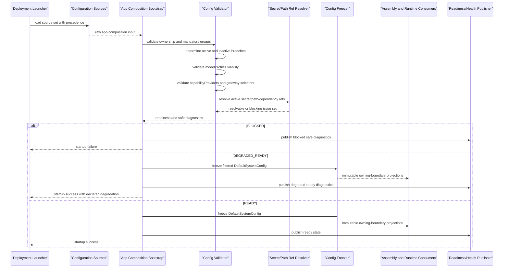

## 背景和现状（Context）

本 change 只收敛一件事：**app composition configuration 如何在系统进入 ready 前被读取、校验、冻结，并向后续装配与运行时暴露稳定输入。**

它不定义某个 provider SDK、数据库驱动、框架注解或具体实现语言结构；也不重复定义 model invocation、gateway adapter 业务语义或 secret resolver 的底层实现。

## 目标和非目标（Goals / Non-Goals）

### 目标

- 定义唯一触发机制：app configuration validation/freeze 在启动阶段同步完成。
- 定义 configuration ownership 分层和稳定配置组。
- 定义固定的校验顺序、blocking 与 degraded-ready 边界。
- 定义 app-internal 配置对象收敛策略：`RawDefaultSystemConfig` 只作为源配置输入，`DefaultSystemConfig` 作为启动期验证后的唯一完整配置事实，health/release 只消费最小安全投影 `ConfigValidationEvidence`。
- 定义配置失败与安全诊断输出，不允许静默丢弃、静默吞错或请求期重新解释源配置。

### 非目标

- 不定义 TS 文件结构、类名、框架注解、目录布局或 runtime library 选型。
- 不定义 model provider 字段细则、capability provider 详细优先级、gateway adapter 具体 endpoint 语义或 secret 解密算法。
- 不提供 runtime hot reload、在线配置修改或无需重启的动态装配能力。

## 选定方案（Chosen Design）

### 启动期时序图

### 1. 触发机制：ready 前同步执行，位于请求生命周期之外

app configuration validation/freeze 必须由 app startup/bootstrap 触发，并且发生在：

- 第一个 request submit 之前；
- 第一个 stream/history/readiness 对外可见之前；
- runtime、channel、model、gateway、capability 和 Agent assembly 完成对外 serving 之前。

该流程：

- 不由用户动作触发；
- 不由后台 job 周期触发；
- 不在请求生命周期中的 planning、execution、checkpoint、terminal 或 replay 阶段触发；
- 必须同步完成，成功后系统才能进入 `READY` 或 `DEGRADED_READY`。

### 2. 配置 ownership 分层

系统配置必须分成三层，并按 ownership 校验：

- `framework/runtime config`
  - 由宿主运行时和框架消费；
  - 只为 app startup 提供运行环境和配置源加载能力；
  - 不定义业务模型、Agent 装配或 capability/gateway 语义。
- `app composition config`
  - 由 `agent-app` 读取和校验；
  - 决定 deployment branch、paths、identity、channel、hosted agent、model profile、capability provider、gateway adapter 等装配输入；
  - 形成本 change 的冻结产物。
- `Agent package config`
  - 描述某个 Agent 的业务定义；
  - 只能引用 app composition 已验证的资源和 profile；
  - 不反向覆盖 app composition 的 deployment、channel、gateway 或 secret policy。

跨层规则：

- framework key 不得被 app composition contract 重新拥有；
- Agent package 不得携带原始 provider secret、gateway credential 或 framework-owned runtime knob；
- downstream 模块不得自行拼接跨层配置得到第二份事实来源。

### 3. 稳定配置组和输入前置条件

本 change 只冻结首版 app composition 的稳定配置组：

- `deployment`
- `paths`
- `identity`
- `channel`
- `hostedAgent`
- `modelProfiles`
- `capabilityProviders`
- `gateway`

本 change 拥有的 mandatory group 最小语义固定为：

- `deployment`：明确选择当前 deployment mode；
- `paths`：提供当前启动所需且经过边界校验的 runtime path roots；
- `identity`：明确选择 auth/identity mode，并只引用可信 identity composition 输入；
- `channel`：明确选择 transport 和当前启动所需的 bind/listen 输入；
- `hostedAgent`：提供可解析的 active Agent ref。

`modelProfiles`、`capabilityProviders` 和 `gateway` 的字段细则、enabled/disabled 规则与 entry criticality 由各自 owning change 定义；本 change 只组合其启动校验结果。

最小输入与前置条件：

- 部署提供的已解析配置源集合；
- 当前 deployment branch 所需的 app composition 配置；
- `agent-common` 中可复用的 `SecretReference` grammar；
- `agent-app` 当前已有的 config schema、validator、resource registry 和 composition input；
- 各组 required/selected/disabled 状态；
- 被选中分支所需的 secret refs、path refs、resource refs 和 active agent ref。

前置条件：

- configuration source precedence 已经固定；
- 不可信外部输入仍停留在配置源边界，尚未进入 runtime public contract；
- 需要进入运行态的 secret 只允许以 `env:` 或 `file:` reference 形式出现；
- 本次 change 不要求依赖可达性健康探针完成，但要求 selected critical refs 在 ready 前完成最小可解析性校验。

### 4. 核心判断顺序

app configuration validation/freeze 必须按以下顺序执行，不得把判断留到实现阶段：

1. 读取并合并 configuration source set，得到单次启动的 raw app composition input。
2. 校验 ownership 分层，拒绝 framework-owned、app-owned、Agent-owned 配置互相越界。
3. 校验 `deployment`、`paths`、`identity`、`channel`、`hostedAgent` 这些 top-level mandatory groups 的最小结构和必填字段。
4. 根据 `deployment` 与 selected adapter/source branch，确定哪些配置分支属于本次启动的 active branch，哪些属于 inactive branch。
5. 对 active branch 执行 full validation；对 inactive branch 只要求结构可解析，不要求依赖可服务。
6. 校验 `modelProfiles` 基线，确认至少存在一个 viable enabled profile，并生成下游可消费的 restart-scoped model profile registry 输入。
7. 校验 `capabilityProviders` 和 `gateway` 的 app-level selector、enabled/disabled 状态、reference 形态和最小安全约束，不在本 change 中重新定义它们的业务解析规则。
8. 对 active branch 中必需的 secret reference、path reference 和 selected dependency ref 执行可解析性校验。
9. 汇总 safe diagnostics，判定结果是 `READY`、`DEGRADED_READY` 还是 `BLOCKED`。
10. 若结果非 `BLOCKED`，冻结 `DefaultSystemConfig`，并按需生成 `ConfigValidationEvidence` 安全投影，随后才允许进入 app composition 和 readiness publishing。

附加规则：

- entry 的 `critical` / `non-critical` 分类必须由对应配置组 owning change 的稳定 schema 明确定义；本 change 不允许 validator 根据失败类型、顺序或运行时可达性临时猜测 criticality；
- `deployment`、`paths`、`identity`、`channel`、`hostedAgent` 的最小 shape 由本 change 固定；`modelProfiles`、`capabilityProviders`、`gateway` 的字段细则和 criticality 由各自 owning change 定义并在启动校验时组合；
- disabled entry 可以保留在源配置中，但不得进入 validated runtime config；
- inactive branch 不得因为依赖不可达而阻断当前 deployment branch；
- active critical branch 失败时必须 `BLOCKED`；
- 非 critical entry 只有在被明确从 `DefaultSystemConfig` 剔除、且剩余 viable set 仍成立时，才允许 `DEGRADED_READY`。

### 5. 输出与副作用

成功或降级成功时，流程至少输出：

- validated `DefaultSystemConfig`
- readiness state: `READY` 或 `DEGRADED_READY`
- safe diagnostics
- release/readiness 安全投影 `ConfigValidationEvidence`

允许的副作用：

- 结构化 startup/config validation 日志；
- health/readiness 可消费的 safe diagnostics；
- 后续消费方按唯一映射获得派生输入：Agent assembly 使用 `AgentAssemblyRegistry`；model 使用由 `DefaultSystemConfig.modelProfiles` 构造的 restart-scoped `ModelProfileRegistry`；gateway 使用 app composition 注入的 gateway port；capability 使用 capability catalog/provider registry；`agent-app` 使用 `ConfigValidationEvidence` 发布 readiness 并构造 release 输入；
- 用于 release qualification 的 `ConfigValidationEvidence` 引用。

不允许的副作用：

- 触发请求执行、模型生成、capability 调用或业务写路径；
- 生成用户可见聊天消息；
- 生成 checkpoint、pending input、memory record、learning event；
- 输出 raw secret、raw path、raw provider body、framework exception 或未脱敏配置值。

### 6. 状态 / 产物契约

#### `RawDefaultSystemConfig` 与 `DefaultSystemConfig`（agent-app internal）

语义：

- `RawDefaultSystemConfig` 是配置源解析后的输入 DTO，不得作为 validated runtime fact 使用；
- `DefaultSystemConfig` 是 `agent-app` 在单次进程生命周期内持有的唯一完整 app-level configuration fact；
- `DefaultSystemConfig` 不作为跨 package public contract，不直接传递给 runtime、model、gateway、context 或 assembly。

`DefaultSystemConfig` 最小语义：

- deployment mode
- runtime paths
- local auth/identity config
- channel config
- hosted agent ref
- validated model profiles
- validated capability providers
- selected gateway config
- noop boundary config
- release/readiness evidence input

限制：

- 只保留 safe config value、resource ref、selected branch 和 secret reference；
- 不保留 raw secret value；
- 不保留 framework-private config object；
- 不保留可写句柄。

#### `ConfigValidationEvidence`

语义：

- 一次启动期配置校验的最小安全投影；
- 供 startup、health/readiness 和 release qualification 读取；
- 不复制完整配置，不定义第二套 validated config fact。

最小字段：

- `readinessState`
- safe issue summaries
- declared degradation summaries
- optional evidence refs
- `evaluatedAt`

#### Readiness state

稳定状态：

- `READY`
- `DEGRADED_READY`
- `BLOCKED`

语义：

- `READY`: active critical branches 全部通过；
- `DEGRADED_READY`: 至少一个 non-critical active entry 被剔除，但剩余 viable set 满足当前 deployment branch 的最小运行前提；
- `BLOCKED`: 当前 deployment branch 缺少必需输入、critical branch 无法成立，或 safe validation 无法完成。

#### Safe diagnostics

语义：

- 结构化配置诊断语义；
- 是 startup/health/release 的安全诊断，不是新的业务事实，也不要求新增独立 public DTO。

最小语义：

- reason code
- scope / field ref
- safe message
- readiness impact

安全限制：

- 只能输出 safe field ref、reason code 和脱敏摘要；
- 不得包含 raw secret、raw local path、credential content、未授权对象内容或 provider-native diagnostics。

### 7. 流程接入

该 change 接入主流程的位置：

- 上游：configuration source loading / secret reference grammar / deployment launch input
- 当前流程：startup bootstrap validation and freeze
- 下游：
  - app composition
  - Agent assembly resolution
  - model profile selection baseline
  - capability provider enablement baseline
  - gateway adapter selection baseline
  - readiness/health projection
  - release qualification

消费规则：

- `agent-app` 负责创建和持有完整 `DefaultSystemConfig`；
- 下游消费路径固定为：
  - Agent assembly 只消费 `AgentAssemblyRegistry`；
  - model 只消费由 `DefaultSystemConfig.modelProfiles` 构造的 restart-scoped `ModelProfileRegistry`；
  - gateway consumer 只消费由 `agent-app` 注入的 gateway port；
  - capability consumer 只消费 capability catalog/provider registry；
  - `agent-app` readiness publisher 与 release input builder 只消费 `ConfigValidationEvidence`；
- 下游不得在上述固定映射之间自由选择第二种投影，不直接消费完整 `DefaultSystemConfig`，也不重新读取源配置；
- future configuration changes 只能扩展 `agent-app` 内部配置模型或对应 owner 已定义的窄投影，不得建立第二套源配置读取旁路。

### 8. 失败与降级

失败必须显式、fail closed：

- 缺少 mandatory top-level group：`BLOCKED`
- ownership 越界：`BLOCKED`
- active critical branch 缺少 viable config：`BLOCKED`
- active secret reference/path reference 无法解析：`BLOCKED`
- inactive branch 不可用：记录 safe diagnostic，不阻断当前 branch
- non-critical active entry 被剔除但剩余 viable set 仍成立：`DEGRADED_READY`

不得出现：

- 静默忽略 invalid active config
- 静默回落到未声明默认 provider / gateway
- 请求期首次发现配置错误
- 在 safe error、日志或 readiness 中暴露 raw secret / raw path / raw exception

## 典型场景示例（Representative Scenarios）

### 场景 1：本地单分支完整可用，进入 READY

输入摘要：

- `deployment=LOCAL`
- `channel.transport=SSE`
- active gateway branch 选择本地 adapter
- `modelProfiles` 至少包含一个 enabled 且 viable 的 profile
- active Agent ref 可解析
- active branch 所需 secret/path refs 全部可解析

检查结果：

1. ownership 检查通过；
2. mandatory groups 完整；
3. active branch 为本地分支；
4. enabled model profile set 成立；
5. active refs 可解析；
6. 无 blocking issue，无 declared degradation。

输出：

- readiness state 为 `READY`
- 冻结完整 `DefaultSystemConfig`
- 下游 assembly/runtime 只消费上述固定 owning-boundary projection

### 场景 2：非关键 active entry 失效，进入 DEGRADED_READY

输入摘要：

- 当前 deployment branch 可由一个 primary enabled model profile 独立成立
- 另一个 fallback-only profile 的 credential ref 不可解析
- 该 fallback profile 不是当前最小可运行集合的一部分

检查结果：

1. primary enabled profile 仍然 viable；
2. fallback-only profile 被识别为 invalid active non-critical entry；
3. validator 记录 safe diagnostic 和 degradation reason；
4. freezer 将该 entry 从 `DefaultSystemConfig` 中剔除。

输出：

- readiness state 为 `DEGRADED_READY`
- `DefaultSystemConfig` 中不包含失效 fallback entry
- readiness/health 输出 safe diagnostics，说明剔除对象和 reason code

### 场景 3：唯一可运行 profile 失效，进入 BLOCKED

输入摘要：

- 当前 active branch 只有一个 enabled model profile
- 该 profile 的 secret reference 不可解析，或 provider kind 不合法，或 profile 本身无效

检查结果：

1. mandatory groups 虽然完整；
2. modelProfiles viability 检查失败；
3. active branch 无 viable enabled profile；
4. 不允许进入 freeze-success path。

输出：

- readiness state 为 `BLOCKED`
- startup 返回 safe configuration failure
- 不发布可服务 ready state
- 不向 downstream 提供可用 runtime config projection

### 场景 4：inactive branch 不可用，但不阻断当前启动

输入摘要：

- 当前 deployment 选择本地分支
- remote-only gateway branch 或 remote-only provider branch 配置不完整
- 当前 active local branch 完整可运行

检查结果：

1. validator 将 remote-only branch 识别为 inactive；
2. inactive branch 仅做结构可解析检查；
3. inactive branch failure 只生成 non-blocking diagnostic。

输出：

- 当前 local startup 仍可 `READY` 或 `DEGRADED_READY`
- inactive branch 的问题不会提升为当前启动 blocker

## 实现约束（Implementation Constraints）

- 只描述目标态行为，不定义实现语言、框架注解、类名或目录层级。
- 完整 app composition config、raw config DTO、validation draft 和 validated `DefaultSystemConfig` 保持在 `agent-app` 内部。
- 本 change 不新增 `agent-contracts/configuration`，不迁移 `agent-contracts/app` owning surface，也不修改冻结核心契约。
- `ConfigValidationEvidence` 是 `agent-app` 内部 release/readiness 安全投影，包含 readiness state、safe issues、declared degradations、可选 evidence refs 和 evaluatedAt；`agent-app` 用它发布 readiness 并构造 release input。实际 candidate startup 只向 package/E2E handoff 暴露指向该证据的 opaque `configValidationEvidenceRef`，release input builder 负责解引用；package、E2E gate 与 qualification 不复制或定义替代 config evidence shape，不要求 health implementation package 或其他实现包反向依赖 `agent-app`。
- 确有新的跨 package 消费需求时必须通过独立 contract refinement change，不得在实施阶段选择新的投影路径。
- `SecretReference` grammar 复用核心契约，不能再发明第二套 secret 表达。
- future model/capability/gateway/secret changes 只能细化各自子域，不得推翻本 change 的 startup trigger、freeze ownership 和 readiness boundary。

## 长期设计文档更新（Baseline Design Updates）

- `openspec/designs/architecture/configuration-boundary.md`
- `openspec/designs/modules/agent-app.md`
- `openspec/designs/architecture/product-builds.md`
- `openspec/designs/spec-to-design-map.md`

## 待确认问题（Open Questions）

无。目标态策略已经固定为：**startup-only、ownership-first、active-branch validation、freeze-before-ready。**
