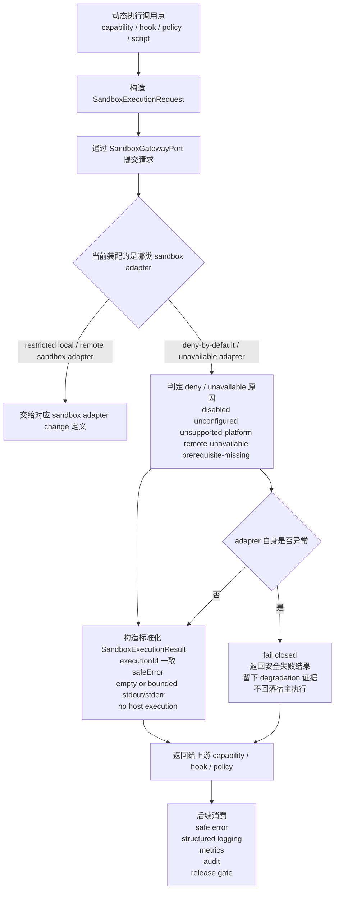

## 背景和现状（Context）

本 change 只收敛 sandbox deny-by-default / unavailable adapter 的最小安全契约，不扩展 `agent-platform-gateway-local` 的 restricted local sandbox，也不定义真实 shell/python 执行语义。

架构已经要求所有动态执行都必须通过 sandbox gateway boundary；核心契约已经冻结 `SandboxExecutionRequest`、`SandboxExecutionResult` 和 `SandboxGatewayPort`。本 change 负责把“restricted local / remote sandbox 不可用时，系统如何安全拒绝或显式不可用”写成稳定规格。

## 目标和非目标（Goals / Non-Goals）

### 目标

- 明确 deny-by-default adapter 的触发机制、输入前置、输出结果和失败降级语义。
- 明确 `agent-app` 在哪些装配条件下必须选择 deny-by-default / unavailable adapter。
- 明确 deny-by-default adapter 不执行任何宿主命令，但仍通过标准 sandbox contract 返回可诊断结果。
- 明确拒绝/不可用结果如何被 capability、risk policy、audit、日志和 metrics 消费。

### 非目标

- 不定义真实本地受限 sandbox 的实现策略。
- 不定义 Windows Git Bash、Linux shell、Python interpreter 的成功执行语义。
- 不引入新的 dynamic execution DTO、扩展字段或新的公共 port。
- 不把 deny-by-default adapter 伪装成 restricted local / remote sandbox 能力。

## 第一性原理（First Principle）

当系统无法提供可用 restricted local / remote sandbox 时，最安全的行为不是“尽量执行”，而是“仍然通过统一 gateway boundary 接住请求，并以可诊断、可验证、无副作用的方式拒绝或声明不可用”。

## 黑盒目标（Blackbox Goal）

无论请求来自 tool、skill-owned script、hook、policy 还是其他动态执行触发点，只要当前运行态没有可用的 restricted local sandbox、remote sandbox 或其他明确装配的可执行 sandbox adapter，系统都通过 `SandboxGatewayPort` 返回稳定的 deny/unavailable 结果，绝不回落到宿主进程直接执行，同时给下游留下可诊断的安全结果。

## 触发机制（Triggering Mechanisms）

### 1. 启动装配阶段触发

在 `agent-app` 启动装配时，local 运行态可以选择 restricted local sandbox 作为默认 `SandboxGatewayPort` 实现。只要当前运行态满足以下任一条件，就必须选择 deny-by-default / unavailable sandbox adapter：

- local 运行态的 restricted local sandbox 被显式禁用、未配置、不可用或平台不受支持；
- 远端 sandbox gateway 未启用、未配置或配置无效；
- 当前平台不在首版受支持范围内；
- 运行配置明确要求禁用动态执行；
- 安全基线要求在未通过 readiness 前拒绝所有动态执行。

这是启动期同步装配决策，不依赖后台 job 或运行中探测补救。

### 2. 请求执行阶段触发

在 request lifecycle 内，只要某个 capability、hook、policy 或脚本执行路径提交 `SandboxExecutionRequest`，且当前装配的是 deny-by-default / unavailable adapter，该 adapter 必须同步处理本次请求并返回拒绝或不可用结果。

### 3. 不由预算检查单独触发

deny-by-default adapter 不是预算决策器。预算、风险或授权逻辑可以在上游决定“是否允许走到 sandbox”，但一旦请求进入 deny-by-default adapter，它只负责按标准 contract 返回拒绝/不可用结果。

## 输入与前置条件（Inputs and Preconditions）

每次 deny-by-default sandbox 决策至少依赖以下输入：

- 已形成的 `SandboxExecutionRequest`；
- 当前 `requestRunId`、`tenantId`、`subjectId`；
- `executionId`、`executable`、`command`、`args`；
- 当前运行配置中的 sandbox mode 或 adapter selection；
- 当前平台与可用性状态；
- 当前 trusted identity context 和 owner scope；
- 已完成的上游 risk / authorization / routing 决策结果（若有）。

### 前置条件

1. 所有动态执行请求必须先形成 `SandboxExecutionRequest`，不得绕过 gateway 直接调宿主执行器。
2. `executionId`、`requestRunId`、`tenantId`、`subjectId`、`executable`、`command`、`timeoutMs`、stdout/stderr limit 缺一不可。
3. deny-by-default adapter 不得读取或推断新的业务上下文来决定是否执行；它只消费当前已知请求和装配状态。
4. 若系统既没有装配可用 restricted local sandbox，也没有装配可用 remote sandbox 或其他明确可执行 sandbox adapter，则 deny-by-default adapter 是唯一合法兜底值。

## 输出与副作用（Outputs and Side Effects）

### 成功路径

这里的“成功”指的是：sandbox 拒绝/不可用决策被按标准 contract 成功返回。

返回结果必须满足：

- 返回一个标准化 `SandboxExecutionResult`；
- `executionId` 与请求一致；
- 不产生实际宿主执行；
- 通过 `safeError` 或等价安全结果明确表达 deny / unavailable 原因；
- `stdout` / `stderr` 为受控、空或安全摘要结果，不包含宿主敏感信息；
- `timedOut=false`，除非拒绝路径自身在上游超时控制中被标记；
- `durationMs` 表示本次拒绝/不可用判断耗时，而不是命令执行耗时。

### 副作用

deny-by-default adapter 允许产生以下副作用：

- 输出标准化 `SandboxExecutionResult`；
- 形成可被 structured logging、metrics、audit 或 release gate 消费的拒绝/不可用诊断事实；
- 更新 sandbox 可用性观测状态。

deny-by-default adapter 不得产生以下副作用：

- 启动 shell、python、脚本、容器或远端执行；
- 访问宿主任意文件系统、任意环境变量、任意网络或凭据；
- 改写 request lifecycle、terminal truth、session truth 或 capability truth；
- 伪造命令已真实运行过的 stdout/stderr/exitCode。

## 核心判断逻辑（Core Decision Rules）

每次请求按以下固定顺序判断：

1. 判断调用方是否通过 `SandboxGatewayPort` 提交了完整 `SandboxExecutionRequest`。
2. 判断当前运行态装配的是 deny-by-default / unavailable adapter 还是 restricted local / remote sandbox adapter。
3. 若当前不是 deny-by-default adapter，则本 change 不定义后续可执行 sandbox 语义。
4. 若当前是 deny-by-default / unavailable adapter，则判断拒绝原因属于：
   - 安全默认拒绝；
   - 配置缺失或未启用；
   - 平台不支持；
   - 远端 gateway 不可用；
   - 解释器 / shell 前置条件不成立。
5. 基于该原因构造标准化 `SandboxExecutionResult`，以 `safeError` 表达 deny / unavailable 结果。
6. 返回结果并留下可诊断的 observability / audit 证据。

不允许在 deny-by-default 路径上尝试“先执行再捕获失败”，也不允许回落到宿主 child process、shell、Python runtime 或本地路径探测来验证是否能执行。

## 状态 / 产物契约（State and Artifact Contracts）

### SandboxExecutionRequest

这是本 change 消费的唯一执行输入。其语义是：

- 表达一次动态执行请求；
- 由上游 capability / hook / policy / script 调用点形成；
- 不是执行结果，也不是审计事实。

### SandboxExecutionResult

这是本 change 产生的稳定产物。其语义是：

- 表达一次 sandbox gateway 对动态执行请求的标准化响应；
- 在 deny-by-default 路径上，它表达“已拒绝”或“当前不可用”，而不是“已执行完成”；
- 不是 timeline event、session message、artifact、checkpoint、pending input、memory record 或 learning event。

### 生命周期

- `SandboxExecutionRequest` 在动态执行被请求时创建；
- deny-by-default adapter 接收请求后同步返回 `SandboxExecutionResult`；
- 返回结果随后被 capability / policy / runtime 继续消费；
- 本 change 不持久化 execution result 本身，也不要求形成独立 durable record。

### 消费方

首版允许以下消费方使用 deny/unavailable 结果：

- capability 调用链；
- hook / policy 调用链；
- structured logging、metrics、audit；
- health/readiness 与 release gate；
- 后续安全测试门禁。

### 可追溯性与安全限制

每次结果必须能追溯到：

- `executionId`
- `requestRunId`
- owner scope
- `executable`
- deny / unavailable reason

但同时必须满足：

- 不暴露宿主路径、PATH 搜索细节、环境变量值、凭据或本地存在性探测细节；
- 不输出伪造的命令结果正文；
- 不把平台能力探测转化为可被未授权方利用的宿主信息泄漏。

## 流程接入（Flow Integration）

deny-by-default adapter 接入以下主流程：

### 关键流程图

### 1. 动态执行主链

`Capability / Hook / Policy / Script call site -> SandboxGatewayPort -> deny-by-default adapter -> caller`

在这条链路中，deny-by-default adapter 只负责安全拒绝或声明不可用，不负责决定调用方下一步业务策略。

### 2. 装配主链

`agent-app -> platform gateway selection -> sandbox adapter selection`

在这条链路中，`agent-app` 根据运行模式、配置和平台支持情况装配 deny-by-default / unavailable adapter 或 restricted local / remote sandbox adapter。

### 3. 后续消费

返回结果可被：

- capability / hook / policy 转换为用户可见 safe error 或内部失败结果；
- observability 记录为 deny/unavailable 诊断；
- release gate 或 security test 判断“是否存在绕过 sandbox 的执行路径”。

## 失败与降级（Failure and Degradation）

### 失败降级决策表

| 场景 | 处理策略 | 不允许发生的事 |
|---|---|---|
| 可用 restricted local / remote sandbox 未装配 | 使用 deny-by-default adapter 返回标准 deny/unavailable 结果 | 回落到宿主直接执行 |
| 远端 sandbox gateway 配置缺失或不可达 | 返回 unavailable safe result；主流程按上游策略继续 | 静默跳过动态执行；假装成功执行 |
| 平台不支持 | 返回 unsupported-platform safe result | 通过路径探测、环境变量或 PATH 细节暴露宿主信息 |
| 解释器 / shell 前置条件不成立 | 返回 unavailable / prerequisite-missing safe result | 自行尝试调用宿主 shell/python 验证 |
| deny-by-default adapter 自身处理异常 | fail closed，返回安全失败结果并留下 degradation 证据 | 吞错后继续执行宿主命令 |
| 输出裁剪或 safe error 生成失败 | 退化为更小的 generic safe error / reason code | 输出 raw path、raw stderr、raw environment 或凭据 |

### 1. adapter 自身异常

- deny-by-default adapter 必须 fail closed；
- 主流程得到安全失败结果；
- 系统留下显式 degradation 证据；
- 不允许因 adapter 异常转为直接执行。

### 2. 配置缺失 / 依赖缺失

- 返回标准 unavailable 结果；
- 不得静默忽略；
- release gate、health/readiness 或日志可以据此表达当前运行态不具备可用 restricted local / remote sandbox 能力。

### 3. 上游超时 / 预算不足

- deny-by-default adapter 不自行扩展预算；
- 由上游 timeout / cancellation 语义控制本次请求；
- 不允许 adapter 通过后台重试或延后执行补偿。

## 验收策略（Acceptance Strategy）

本 change 至少覆盖以下验收面：

- 正常路径：未装配可用 restricted local / remote sandbox 时，所有动态执行请求都通过 `SandboxGatewayPort` 返回 deny/unavailable 标准结果；
- 边界路径：平台不支持、远端未配置、解释器缺失、配置显式禁用；
- 失败路径：adapter 自身异常、safe error 生成失败、上游取消；
- 降级路径：返回可诊断安全结果且不改写主业务真相，也不绕过到宿主执行。

## 一致性审视（Consistency Review）

本 change 与已冻结 architecture / core contracts 的一致性如下：

- 与 `establish-ts-backend-architecture` 一致：动态执行继续只能通过 sandbox gateway boundary 进入；本地运行态允许使用 restricted local sandbox 作为默认实现，并在该实现不可用时使用 unavailable / deny-by-default 兜底实现。
- 与 `establish-ts-core-contracts` 一致：只消费和返回既有 `SandboxExecutionRequest`、`SandboxExecutionResult`、`SandboxGatewayPort`，不新增 execution trace、extra public fields 或新的 gateway port。

### Consistency Note

`establish-ts-backend-architecture` 对 sandbox contract 的目标描述中提到 gateway 返回结果应具备 normalized result、safe error、resource usage 和 audit refs；但当前已冻结的 `establish-ts-core-contracts` 只为 `SandboxExecutionResult` 提供 `executionId`、`exitCode?`、`stdout`、`stderr`、`timedOut`、`durationMs` 和 `safeError?`。

本 change 默认服从当前已冻结 core contract，因此 deny-by-default / unavailable adapter 只承诺返回现有 `SandboxExecutionResult` 能表达的最小安全结果，不额外定义 resource usage 或 audit refs 字段。

如后续需要把 sandbox result 正式扩展为包含 resource usage 或 audit refs，必须先通过独立 contract refinement change 收敛 architecture 与 core contract 的字段口径，再进入实现型 change。

当前未发现必须先发起 contract refinement change 的冲突点。
