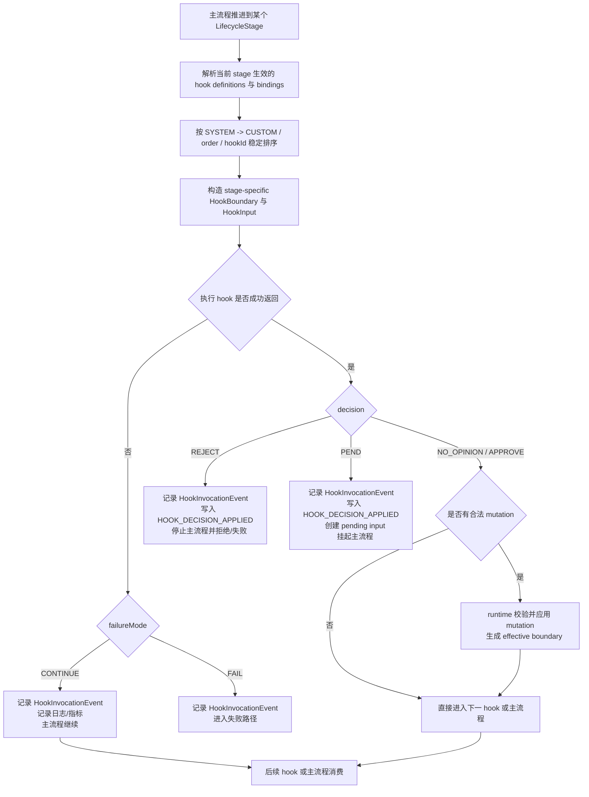
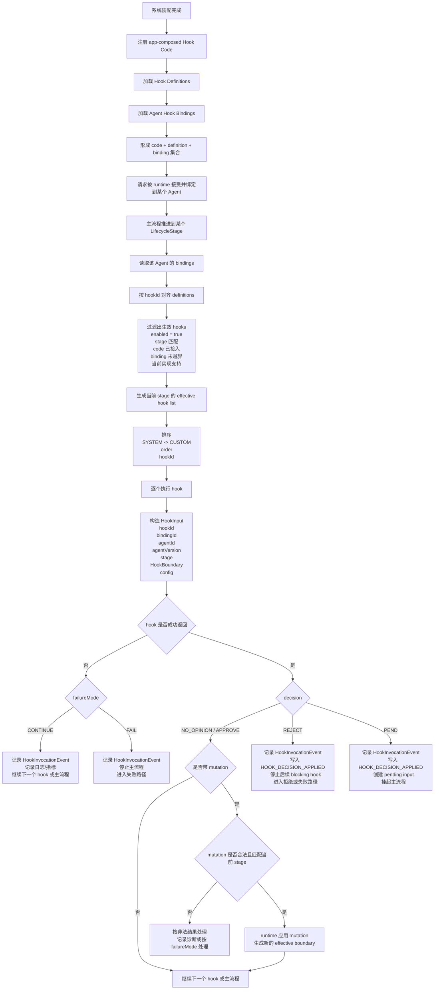

## 背景和现状（Context）

本 change 只收敛 lifecycle hook 的最小执行规格：hook 处理逻辑由 app composition 接入的 TypeScript hook 代码承载，配置只声明接入时机、顺序和超时，并在启动期冻结，不扩展为开放式插件生态，也不把 hook 变成新的业务真相来源。

当前核心契约已经定义：

- lifecycle stage vocabulary 由 runtime 拥有；
- `HookBoundary` 和 `BoundaryMutation` 是跨 stage 的统一基类语义；
- `HookResult` 只表达 runtime 必须处理的控制信号和边界修改；
- `RequestContext.nextLifecycleStage` 用于恢复时重建下一可执行治理边界。

本 change 要做的，是把这些契约收敛成一个可落地、可验证、不会越界的执行模型。

## 目标和非目标（Goals / Non-Goals）

### 目标

- 明确 lifecycle hook 在 request lifecycle 中由哪些同步边界触发。
- 明确 hook 代码如何通过 app composition 接入，并由 runtime 在绑定 stage 调用。
- 明确每次 hook 执行需要的输入对象、前置状态和安全上下文。
- 明确 hook 如何输出 `decision`、`pendingInputIntent`、`mutation` 与 `HookInvocationEvent`。
- 明确 hook 与 pending input、checkpoint、terminal commit、metrics、logging 和 audit 的接入关系。
- 明确 hook 执行失败时如何 fail safe、如何留下显式 degradation 证据、如何不改写业务真相。

### 非目标

- 不定义开放式 hook marketplace、远端 hook、脚本 hook 或热加载机制；首版 hook 代码只能由 app composition 显式接入。
- 不支持 Python、Java、shell、Wasm 或其他非 TypeScript hook 语言；首版 hook code 必须是 TS 后端编译产物的一部分。
- 不定义新的通用 `PolicyPort`，risk policy 仍由独立 change 负责。
- 不把 risk policy 注册为 lifecycle hook definition / Agent hook binding，也不通过 hook executor 执行 risk policy。
- 不让 hook 拥有 RequestRun lifecycle、checkpoint truth、terminal commit 或 channel projection truth。
- 不要求每次 hook invocation 成为 canonical timeline event 或用户可见 stream event。
- 不约束具体运行时实现结构、文件组织形式或技术栈内的代码分层方式。

## 第一性原理（First Principle）

lifecycle hook 的唯一职责，是在 runtime-owned request lifecycle 的固定治理边界上，基于当前边界事实表达：

- 对流程是否继续的意见；
- 对当前 stage 边界是否允许做受控修改；
- 若需要阻断或挂起，给出安全且可观测的控制结果。

它负责“在何处判断、如何表达判断、如何被 runtime 消费”，不负责“重写 request 真相”。

## 黑盒目标（Blackbox Goal）

当请求进入 lifecycle 的固定治理边界时，系统能够按稳定顺序执行已绑定的内置 hook，并基于 hook 输出：

- 继续主流程；
- 拒绝当前流程；
- 挂起并创建 pending input；
- 对当前 boundary 形成受控 mutation；
- 或在 hook 超时、失败、非法返回时执行显式降级。

同时，每次 hook 调用都要留下结构化观测事实，且任何 hook 结果都不能越过 runtime 的边界校验直接改写 request truth。

配置的黑盒效果只到“接入哪段 TypeScript hook 代码、在哪些 stage、按什么顺序和超时执行”为止；具体处理逻辑由接入的 hook 代码执行，runtime 不把配置解释成业务规则 DSL，也不根据配置代替 hook 代码做策略判断。启动完成后，当前 Agent 的 effective hook code registration、definition 和 binding 集合必须冻结；单个 request 执行中不得重新读取配置或改变生效 hook 集合。

## 边界（Boundary）

- 负责：hook definition/binding 分离、触发阶段、输入边界、执行顺序、decision/mutation 处理、HookInvocationEvent、失败降级
- 不负责：risk policy 自身规则、risk policy 执行、pending input 领域对象细节、checkpoint durable schema、terminal commit 细节、stream event 产品面
- contract 边界：stage-specific boundary/mutation 归 `agent-contracts/runtime`；本 change 不新增 `agent-contracts/hook`、不新增通用 policy contract、也不改变 `LifecycleHookPort` 的 owning surface。
- 代码接入边界：hook 代码是 app-composed TypeScript implementation，通过 `hookId` 与 definition/binding 对齐；runtime 不从配置文件、远端地址、脚本文件、Python/Java 类、shell 命令或模型输出动态加载 hook 代码。
- 工程接入边界：首版 hook implementation 由 `agent-app` composition 在启动期显式 import/register 并冻结。runtime 不扫描工程目录、不按配置路径 `import()` 任意文件，也不从 Agent package 目录动态加载 hook code。

## 当前冻结的核心实现策略（Current Strategy To Freeze）

首版冻结以下策略：

1. 固定 lifecycle stage 集合
2. hook code registration、definition 与 binding 分离
3. `SYSTEM` 早于 `CUSTOM`
4. `BLOCKING` 同步顺序执行并顺序归约
5. runtime 校验 mutation 合法性并生成 effective boundary
6. 每次 hook invocation 产生结构化观测事实
7. lifecycle 改变时只产生 timeline-only evidence，不默认进入用户可见 stream
8. hook code registration / definition / binding 在启动期由 app composition 冻结，request 执行中只读该冻结快照

## Stage Boundary / Mutation 最小清单

首版只定义 runtime 可以安全构造和校验的最小 typed boundary/mutation。所有 boundary 都必须只包含当前 stage 已成立的事实、稳定 refs、低敏 safe summary、计数、状态枚举或 policy-neutral flags；不得携带 raw prompt、raw model output、tool args/result、附件正文、secret、credential、本地路径、完整 `RequestRun` 或裸 `tenantId` / `subjectId`。

| Stage | Boundary 最小事实 | 允许的 Mutation |
|---|---|---|
| `BEFORE_REQUEST_ACCEPT` | requested agent/version、locale、attachment count、idempotency presence、safe request class | none |
| `BEFORE_PLANNING` | request/run/session refs、agent/version、locale、accepted input safe summary、attachment refs summary | none |
| `BEFORE_MODEL_INVOKE` | request/run/session refs、agent/version、context assembly refs、model profile id、tool disclosure summary、safe model request summary | none |
| `AFTER_MODEL_RESULT` | request/run/session refs、agent/version、model profile id、safe usage summary、tool call count、safe assistant output summary | none |
| `BEFORE_CAPABILITY_INVOKE` | request/run/session refs、agent/version、capability id/kind/provider kind、capability input safe summary、idempotency/replay summary | none |
| `AFTER_CAPABILITY_RESULT` | request/run/session refs、agent/version、capability invocation id、status、safe result summary、artifact ref summary | none |
| `BEFORE_CONTEXT_COMPACT` | request/run/session refs、agent/version、context item count、token/budget summary、candidate summary refs | none |
| `AFTER_CONTEXT_COMPACT` | request/run/session refs、agent/version、compaction status、new context summary ref、token/budget summary | none |
| `BEFORE_TERMINAL_EVENT` | request/run/session refs、agent/version、terminal status、safe terminal summary、safe error summary、artifact/message ref summary | `TerminalEventMutation`：仅允许替换 safe terminal summary 或要求 runtime 使用 safe failure result |

`none` 表示该 stage 首版不接受 mutation。首版只消费 `BEFORE_TERMINAL_EVENT` 的 `TerminalEventMutation`；其他 mutation contract 仍保留在 `agent-contracts/runtime` 作为后续 change 的冻结 vocabulary，但当前 executor 必须把它们视为非法结果并按 `failureMode` 处理。`PEND` 也不是所有 stage 的通用能力：首版只允许在 `BEFORE_CAPABILITY_INVOKE` 与 `BEFORE_TERMINAL_EVENT` 返回 `PEND`；其他 stage 若返回 `PEND`，runtime 必须视为非法结果并按 `failureMode` 处理。

这些 typed boundary/mutation 是 `HookBoundary` / `BoundaryMutation` 的 runtime-owned 具体子类型；实现不得把它们放入 capability、channel、observability 或 gateway owning surface。后续若需要增加字段或新 mutation kind，必须通过对应 OpenSpec change/refinement 说明 owner、字段安全性和验证路径。

## 触发机制（Triggering Mechanisms）

### 1. 由 request lifecycle 的权威同步边界触发

hook 只能由以下 lifecycle stage 触发：

- `BEFORE_REQUEST_ACCEPT`
- `BEFORE_PLANNING`
- `BEFORE_MODEL_INVOKE`
- `AFTER_MODEL_RESULT`
- `BEFORE_CAPABILITY_INVOKE`
- `AFTER_CAPABILITY_RESULT`
- `BEFORE_CONTEXT_COMPACT`
- `AFTER_CONTEXT_COMPACT`
- `BEFORE_TERMINAL_EVENT`

这些触发发生在 request lifecycle 内部的同步治理边界上，不依赖后台 job、离线恢复扫描或补采逻辑。

### 2. 由当前主流程推进触发，而不是独立调度触发

hook 不是单独的后台调度器。它只有在上游主流程已经推进到对应 lifecycle stage 时，才会被 runtime 同步调用。

### 3. `PEND` 由 hook 输出触发后续 pending input 流程

当某个 `BLOCKING` hook 返回 `decision=PEND` 时，runtime 在当前 stage 停止后续 hook 和主流程，并创建真正的 pending input。pending input 的产生是 hook 结果的后续副作用，不是 hook 自己直接创建领域对象。

### 4. 恢复时只回到已冻结的可恢复 stage

如果请求在可恢复边界后恢复执行，runtime 只能根据已持久化的恢复坐标回到核心契约已经冻结的可恢复 `nextLifecycleStage`，即：

- `BEFORE_MODEL_INVOKE`
- `BEFORE_CAPABILITY_INVOKE`
- `BEFORE_TERMINAL_EVENT`

恢复流程只在这些可恢复 stage 重新接入 hook 执行；其他 lifecycle stage 仍然可以在正常主流程中触发 hook，但不作为恢复落点。

## 分批落地策略（Phased Rollout）

为了避免一次性跨越 runtime、core、pending input 和 terminal commit 的所有高风险面，首版实现按两批冻结。

### Phase A：runtime 当前直接拥有的边界先落地

第一批先打通 runtime 当前已经直接拥有的 lifecycle boundary：

- `BEFORE_REQUEST_ACCEPT`
- `BEFORE_MODEL_INVOKE`
- `BEFORE_TERMINAL_EVENT`

这一批必须首先冻结：

- hook registration / definition / binding 的启动期冻结快照；
- `SYSTEM -> CUSTOM -> order -> hookId` 的稳定顺序；
- timeout / throw / unavailable / invalid result 的统一 fail-open 处理；
- `HookInvocationEvent` 与 timeline-only `HOOK_DECISION_APPLIED`；
- terminal `REJECT` 与最小 mutation 归约。

Phase A 的目标是先替换现有 noop placeholder，把 runtime-owned executor 变成真实执行边界，而不是一次性要求所有 stage 同时可用。

### Phase B：core 邻接边界通过 runtime-owned executor 接入

第二批再推进当前紧邻 `agent-core` / capability / context 路径、但仍必须保持 runtime ownership 的边界：

- `BEFORE_CAPABILITY_INVOKE`
- `AFTER_CAPABILITY_RESULT`
- `AFTER_MODEL_RESULT`
- `BEFORE_CONTEXT_COMPACT`
- `AFTER_CONTEXT_COMPACT`
- `BEFORE_PLANNING`

这一批的固定约束是：

- `agent-core`、capability、context 只组装当前 stage 已成立的 boundary facts；
- hook 排序、timeout、execution-failure fail-open、decision/mutation interpretation、pending input 创建与 lifecycle evidence 仍由 runtime-owned executor 完成；
- 不允许把 hook 语义判断下沉到 `agent-core`、capability executor、context engine 或 channel projection。

若某个 stage 还缺少稳定 boundary facts，应先补齐 boundary assembly，再开放该 stage 的 hook 执行；不得以 `boundary: {}` 或未定义 payload 进入 executor。

## 输入与前置条件（Inputs and Preconditions）

每次 hook 执行至少需要以下输入：

- `hookId`
- `bindingId?`
- `agentId`
- `agentVersion`
- 当前 `stage`
- 与该 stage 对应的 typed `HookBoundary`
- 可选的 binding `config`

`config` 只能作为接入参数传给 hook 代码；runtime 不解释其中的业务策略，也不得根据 `config` 代替 hook code 生成 decision 或 mutation。当前 change 的规范性行为由 hook code 返回的 `HookResult` 决定。

### 前置条件

1. 当前 request 已经推进到该 lifecycle stage。
2. 对应的 boundary 事实已经成立并可被安全表达。
3. 当前 Agent 已解析出有效 hook bindings，并且对应 `hookId` 已在 app composition 中接入可调用 TypeScript hook code。
4. 当前 Agent 的 effective hook code registration、definition 和 binding 快照已在启动期冻结。
5. runtime 已具备 trusted identity、request refs 和 owner scope 所需的安全上下文，但这些上下文只允许通过 stage-specific boundary 暴露给 hook。
6. hook 执行不得依赖新的模型调用、跨 owner 探测或未声明的外部事实。
7. `NON_BLOCKING` hook 的输入与 `BLOCKING` hook 一样受约束，但其结果不得控制流程。
8. 若 stage 需要 checkpoint 或 pending input 接续能力，对应依赖必须已完成最小契约接入。

### `PEND` 的额外前置条件

当某个 stage 允许 `decision=PEND` 时，除上述通用前置条件外，还必须满足：

1. runtime 能在挂起前保存与该 stage 对齐的 checkpoint；
2. pending input store 已可用，且能写入 owner-scoped、agent-scoped pending input truth；
3. runtime 能在 pending input 被回答后，根据保存的 checkpoint 与 `nextLifecycleStage` 重新排队恢复执行；
4. 如果上述任一条件不满足，runtime 不得把请求伪装成“已成功挂起”，而必须显式失败或降级。

## 输出与副作用（Outputs and Side Effects）

### 成功路径

hook 成功执行后，可能产生：

- `decision=NO_OPINION` 或 `APPROVE`，主流程继续；
- `decision=REJECT`，主流程停止并走请求失败或拒绝路径；
- `decision=PEND`，主流程停止并创建 pending input；
- 合法 `mutation`，runtime 生成 updated effective boundary 并交给后续 hook 或当前主流程继续消费；
- 一条 `HookInvocationEvent`；
- 对应的结构化日志与 hook 指标。

### 副作用

允许的副作用：

- 记录 hook invocation 观测事实；
- 在 request lifecycle 被 hook 改变时写入 timeline-only `HOOK_DECISION_APPLIED`；
- 在 `PEND` 场景下创建后续 pending input 所需的 runtime 控制后果；
- 在允许的 stage 生成更新后的 effective boundary。

不允许的副作用：

- 直接写入 RequestRun terminal truth；
- 直接创建或改写 checkpoint truth；
- 直接修改 channel state、stream envelope 或 session history；
- 越过 runtime 校验直接改写 boundary；
- 把 hook invocation event 当作业务持久化对象查询真相。

## 核心判断逻辑（Core Decision Rules）

每次 stage 内的 hook 处理必须按以下固定顺序执行：

1. 从启动期冻结的 snapshot 解析当前 Agent 在该 stage 生效的 hook definitions、bindings 和 app-composed TypeScript hook code registration。
2. 过滤掉未启用、未绑定到当前 stage 或不满足系统支持边界的 hook。
3. 按固定顺序排序：`SYSTEM` 先于 `CUSTOM`；同 kind 内按 `order`，再按 `hookId`。
4. 对每个 `BLOCKING` hook，构造 stage-specific boundary 与 hook input。
5. 在 binding 或 definition 指定的超时内执行该 `hookId` 对应的 hook code。
6. 若 hook 超时、抛错、不可用或返回非法结果，则统一记录失败观测事实并继续主流程；执行异常本身不得停止请求。
7. 若 hook 正常返回：
   - `NO_OPINION` / `APPROVE`：若带合法 mutation，则先由 runtime 校验并应用 mutation，再进入下一个 `BLOCKING` hook 或主流程；
   - `REJECT`：停止后续 `BLOCKING` hook 和主流程，走拒绝/失败路径；
   - `PEND`：停止后续 `BLOCKING` hook 和主流程，创建 pending input；
8. 若 `REJECT` 或 `PEND` 与 mutation 同时出现，以控制信号为准，不应用 mutation。
9. 若 hook 为 `NON_BLOCKING`：
   - 允许记录观测结果；
   - 若返回 decision 或 mutation，runtime 记录诊断并忽略这些控制输出；
   - 不阻断主流程。
10. 每次 invocation 都必须形成 `HookInvocationEvent`，并输出日志与指标。

## 唯一实施路径（Implementation Path）

首版只允许以下实现路径：

1. `agent-runtime` 实现 hook executor：在 runtime-owned lifecycle boundary 构造 stage-specific boundary，解析 definition/binding，排序并执行 `LifecycleHookPort`，校验 mutation，消费 `decision` / `pendingInputIntent`，生成 `HookInvocationEvent` 和 `HOOK_DECISION_APPLIED`。
2. `agent-app` 作为 composition root：在启动期显式装配并冻结 TypeScript hook code registration、hook definitions、Agent hook bindings 和 `LifecycleHookPort` 实现；默认本地装配可以继续提供 no-op provider，但执行路径必须真实调用同一个 runtime executor。
3. `agent-core` 只提供当前 stage 已成立的 model/capability/context boundary facts；不得拥有 hook ordering、decision interpretation、pending input creation 或 timeline evidence。
4. `agent-observability` 只通过 observed wrapper、日志、指标和可选 audit sink 消费 `HookInvocationEvent`；不得把 observability sink 写入失败反向变成 lifecycle truth。
5. `agent-channel-web` 不参与 hook 执行，不新增用户可见 `StreamEventType`，只继续投影 runtime canonical timeline 中已有且允许投影的事实。
6. risk policy enforcement 不接入 hook executor，不注册为 hook definition，也不通过 Agent hook binding 开启。

## 状态 / 产物契约（State and Artifact Contracts）

### HookInvocationEvent

本 change 的核心稳定产物是 `HookInvocationEvent`。其语义是：

- 表达某次 hook invocation 的结构化观测事实；
- 不是新的业务真相对象；
- 不是 canonical timeline event；
- 不是 checkpoint、pending input、artifact、summary、memory record 或 learning event。

它至少应包含：

- request 关联 refs：`requestRunId`、`sessionId`、`requestId`
- hook 关联 refs：`hookId`、`bindingId?`
- Agent 关联 refs：`agentId`、`agentVersion`
- `stage`
- invocation `status`
- 时间信息
- `decision`
- `safeReason` 或 `error`
- `mutationSummary`

其中 `requestId` 就是当前 run 的 root user message id。首版 contract 与实现应统一使用 `requestId` 作为该字段命名，避免再引入平行的 `rootMessageId` 词汇。

### lifecycle 改变证据

当 hook 改变 request lifecycle 时，runtime 还会产生 timeline-only `HOOK_DECISION_APPLIED`。其语义是：

- 记录 request lifecycle 已被 hook 改变；
- 只用于运行事实与恢复/诊断链路；
- 首版不要求投影为用户可见 stream event。

### pending input 关联

当 hook 产生 `PEND` 时，本 change 不直接定义 pending input 对象本身，但要求：

- `pendingInputIntent` 是创建 pending input 的唯一控制信号来源；
- 创建出的 pending input 必须可追溯回该次 hook invocation；
- pending input truth 仍由对应 pending input change 拥有。

### pending input 恢复闭环

首版实现中，`PEND` 不仅要求“能创建 pending input”，还要求存在最小恢复闭环：

1. hook 返回 `PEND + pendingInputIntent`；
2. runtime 先保存与当前 recoverable stage 对齐的 checkpoint；
3. runtime 创建 pending input truth，并写入 `USER_INPUT_REQUIRED` 与 `HOOK_DECISION_APPLIED`；
4. request 主流程停止，不进入 terminal commit；
5. pending input 被正式回答后，runtime 写入既有 `USER_INPUT_RECEIVED` 事实；
6. runtime 依据 checkpoint 与 `nextLifecycleStage` 重新排队，从最近 recoverable stage 继续执行。

恢复语义固定为继续同一个 `requestRunId`、`requestId` 与 attempt；pending input 回答不是新提交、不是 retry，也不是新的 request acceptance。

如果第 2-6 步中任一步无法建立，本 change 视为 `PEND` 路径未完成，不得把“只创建 pending input 但无法恢复”记为已实现。

### 生命周期与安全限制

- `HookInvocationEvent` 在每次 invocation 结束时形成；
- 它可被日志、指标、audit sink 或 operator 诊断消费；
- 它不得包含 raw prompt、raw model output、tool args/result、附件正文、secret、credential、完整 boundary、完整 mutation 或完整 hook input/result。

## 流程接入（Flow Integration）

### 关键流程图



### 1. 请求主链路

`Channel -> Runtime -> Agent Loop -> Context -> Model / Capability -> Runtime terminal`

hook 接入在 runtime-owned lifecycle 边界中，由 runtime 调用；Agent loop、context、model、capability 只提供当前 stage 已成立的 boundary 事实。

### 2. 治理主链路

`Runtime lifecycle boundary -> Hook execution -> Runtime decision handling -> Observability / PendingInput / Timeline-only evidence`

hook 的结果由 runtime 统一消费。后续 release gate 等 hook 治理能力应复用这一执行框架，而不是自建另一套 hook 执行模型。risk policy enforcement 是相邻治理能力，只能复用 runtime、pending input、timeline 和 observability 边界，不得作为 lifecycle hook、hook binding 或 hook executor 插件实现。

### 2.1 core 邻接边界的 owner 规则

对于 `BEFORE_CAPABILITY_INVOKE`、`AFTER_CAPABILITY_RESULT`、`AFTER_MODEL_RESULT`、`BEFORE_CONTEXT_COMPACT` 等虽然紧邻 `agent-core` / capability / context 路径、但又必须受 lifecycle hook 治理的边界，owner 规则固定如下：

- `agent-core` / capability / context 只组装当前 stage 已成立的 boundary facts；
- runtime-owned executor 接收这些 facts，解析 frozen snapshot，执行 hook code，并消费 decision/mutation；
- `agent-core` 不得自行解释 `REJECT` / `PEND` / mutation，也不得自行决定是否创建 pending input 或写入 `HOOK_DECISION_APPLIED`；
- 相邻模块若需要继续主流程，只能消费 runtime 返回的 effective boundary 或 runtime 明确给出的继续/停止结果。

### 3. 恢复与后续消费

- 恢复流程通过 `nextLifecycleStage` 回到相应 hook 边界；
- pending input 消费方通过 `pendingInputIntent` 与 hook invocation 建立关联；
- observability 消费方通过 `HookInvocationEvent`、结构化日志和指标消费执行事实；
- audit sink 可以消费 hook invocation 观测事实，但不改变 hook 真相 ownership。

## 典型实例（Typical Examples）

### 1. 标准终态输出安全 hook 用例

这个用例展示首版最小 hook 的标准承载方式：hook code 位于打包后运行根目录 `hooks/`，与 `bin/`、`config/` 平级；配置只声明接入时机和运行参数；处理逻辑由 TypeScript hook code 执行；启动期冻结后由 runtime 在 `BEFORE_TERMINAL_EVENT` 调用。

首版所有 hook 都收紧同一条运行原则：hook 自身执行失败必须 fail-open。也就是说，`failureMode` 仍保留在 contract shape 中，但 runtime 对 timeout、throw、missing registration 或 invalid result 一律只记录失败观测并继续主流程，不能把请求打成失败。真正允许终止流程的，仍然只有 hook 正常返回的控制决策，例如 `REJECT` 或受支持 stage 的 `PEND`。

```text
packaged-runtime-root/
  bin/
  config/
  hooks/
    terminal-output-safety-check.ts
```

```ts
// hooks/terminal-output-safety-check.ts
import type { HookInput, HookResult } from "@nextagent/agent-contracts/runtime";

type TerminalOutputBoundary = {
  readonly terminalStatus: "COMPLETED" | "FAILED" | "CANCELED";
  readonly terminalSummary: string;
  readonly safeErrorSummary?: string;
};

export async function terminalOutputSafetyCheck(
  input: HookInput<TerminalOutputBoundary>,
): Promise<HookResult> {
  const { terminalSummary, safeErrorSummary } = input.boundary;
  const summary = `${terminalSummary}\n${safeErrorSummary ?? ""}`;

  if (summary.includes("secret") || summary.includes("/home/")) {
    return {
      decision: "REJECT",
      safeReason: "terminal_output_boundary_violation",
    };
  }

  return {
    decision: "APPROVE",
  };
}
```

```yaml
lifecycleHooks:
  code:
    - hookId: terminal-output-safety-check
      implementation: app-composed:terminalOutputSafetyCheck
      sourceModule: hooks/terminal-output-safety-check.ts

  definitions:
    - hookId: terminal-output-safety-check
      name: Terminal Output Safety Check
      source: system
      kind: SYSTEM
      supportedStages:
        - BEFORE_TERMINAL_EVENT
      executionMode: BLOCKING
      failureMode: FAIL
      defaultOrder: 200
      defaultTimeoutMs: 1000

  agentBindings:
    - bindingId: telecom-agent-terminal-safety
      agentId: telecom-network-agent
      hookId: terminal-output-safety-check
      enabled: true
      stages:
        - BEFORE_TERMINAL_EVENT
      timeoutMs: 800
      config:
        blockUnsafeOutput: true
```

黑盒效果：

1. 启动期 `agent-app` 显式注册 `terminal-output-safety-check` 对应的 TypeScript hook code。
2. 启动期冻结 code registration、definition 和 Agent binding。
3. 请求推进到 `BEFORE_TERMINAL_EVENT` 时，runtime 构造 terminal boundary 并调用该 hook code。
4. hook code 只读取 stage-specific boundary 和 config，不读取 RequestRun 全对象、不访问 channel/gateway/capability 私有状态。
5. 若 hook 返回 `APPROVE`，terminal flow 继续。
6. 若 hook 返回 `REJECT`，runtime 停止 terminal 写出或进入安全失败路径，形成 `HookInvocationEvent`，并写入 timeline-only `HOOK_DECISION_APPLIED`。

这个用例不允许 runtime 根据 `sourceModule` 动态 import；`sourceModule` 只是帮助定位源码。实际可调用函数必须已经由 app composition 在启动期注册。

### 2. 典型配置和代码接入实例

下面给出一份首版语义下的典型配置示意，用来说明 TypeScript hook code registration、definition、binding 和运行时生效边界的关系。

这只是非规范性示意，不冻结具体配置文件层级或序列化格式；规范冻结的是 TypeScript hook implementation 源码位于打包后根目录下的 `hooks/`，由 app composition 在启动期显式接入并冻结、definition 声明稳定属性、binding 声明接入时机和运行参数。

```yaml
lifecycleHooks:
  code:
    - hookId: terminal-output-safety-check
      implementation: app-composed:terminalOutputSafetyCheck
      sourceModule: hooks/terminal-output-safety-check.ts
    - hookId: capability-observer
      implementation: app-composed:capabilityObserver
      sourceModule: hooks/capability-observer.ts

  definitions:
    - hookId: terminal-output-safety-check
      name: Terminal Output Safety Check
      source: system
      kind: SYSTEM
      supportedStages:
        - BEFORE_TERMINAL_EVENT
      executionMode: BLOCKING
      failureMode: FAIL
      defaultOrder: 200
      defaultTimeoutMs: 1000

    - hookId: capability-observer
      name: Capability Observer
      source: system
      kind: CUSTOM
      supportedStages:
        - BEFORE_CAPABILITY_INVOKE
        - AFTER_CAPABILITY_RESULT
      executionMode: NON_BLOCKING
      failureMode: CONTINUE
      defaultOrder: 500
      defaultTimeoutMs: 800

  agentBindings:
    - bindingId: telecom-agent-terminal-safety
      agentId: telecom-network-agent
      hookId: terminal-output-safety-check
      enabled: true
      stages:
        - BEFORE_TERMINAL_EVENT

    - bindingId: telecom-agent-capability-observer
      agentId: telecom-network-agent
      hookId: capability-observer
      enabled: true
      stages:
        - BEFORE_CAPABILITY_INVOKE
        - AFTER_CAPABILITY_RESULT
      timeoutMs: 500
```

这份实例体现的规则是：

- code registration 由 app composition 把 `hookId` 绑定到可调用 hook code；
- `sourceModule` 是非规范性说明，帮助定位源码；runtime 不按该字段动态 import；
- definition 提供 hook 的稳定根属性；
- binding 只做 Agent 范围内的接入时机、顺序和超时收窄；
- `SYSTEM` hook 仍先于 `CUSTOM` hook；
- `NON_BLOCKING` hook 即使启用，也不拥有阻断流程的权力。

### 3. 典型 hook 示例

首版最典型的 `BLOCKING` hook，是 `BEFORE_TERMINAL_EVENT` 阶段的“终态输出安全检查 hook”。

它的目标是：

- 在 terminal event 写入前检查待输出的安全摘要是否满足当前 stage 的输出边界；
- 如果输出摘要满足安全边界，则允许 terminal flow 继续；
- 如果输出摘要不满足安全边界，则拒绝 terminal 写出或要求 runtime 进入安全失败路径。

这个 hook 的处理逻辑由 `terminal-output-safety-check` 对应的 app-composed hook code 实现；配置只决定它接入 `BEFORE_TERMINAL_EVENT`。该 hook code 在黑盒上会做以下判断：

1. 读取当前 `BEFORE_TERMINAL_EVENT` boundary 中的 terminal status、安全输出摘要和 safe error 摘要。
2. 校验该摘要不包含 raw prompt、raw model output、raw tool args/result、secret、credential 或本地路径。
3. 若摘要满足安全边界，则返回 `APPROVE`。
4. 若摘要不满足安全边界，则返回 `REJECT` 并携带 stable `safeReason`。

典型返回形态如下：

允许继续：

```yaml
decision: APPROVE
safeReason: null
mutation: null
```

直接拒绝：

```yaml
decision: REJECT
safeReason: terminal_output_boundary_violation
mutation: null
```

它不会自己执行 capability，也不会直接改写 request truth。它只负责给 runtime 一个受控的治理判断。

### 4. 典型执行流程

下面给出 definition、binding、stage resolution 和 hook 执行串起来的一条完整典型流程：



这条流程体现的核心原则是：

- hook code 由 app composition 以 TypeScript implementation 显式接入；
- code/definition/binding 在启动期形成冻结快照；
- definition 声明 hook 稳定属性；
- binding 决定 Agent 在哪些 stage 接入该 hook；
- runtime 在进入具体 lifecycle stage 时解析并执行生效 hook code；
- hook 自己只表达治理判断，真正的 lifecycle 后果始终由 runtime 负责。

## 失败与降级（Failure and Degradation）

### 失败降级决策表

| 失败场景 | 降级策略 | 不允许发生的事 |
|---|---|---|
| hook 超时 | 记录 timeout 观测事实并继续主流程 | 静默忽略；无限等待 |
| hook 抛错或不可用 | 记录 safe diagnostics 并继续主流程 | 输出 raw exception、secret 或未脱敏输入 |
| hook 返回非法结果 | 视为 hook failure，记录失败观测并继续主流程 | 把非法结果当成合法 control signal |
| `NON_BLOCKING` hook 返回 decision / mutation | 记录诊断并忽略控制结果；主流程继续 | 让 `NON_BLOCKING` hook 实际阻断流程 |
| mutation 与当前 stage 不匹配 | 拒绝应用 mutation；按非法结果处理 | 越权修改 boundary |
| `REJECT` / `PEND` 同时带 mutation | 忽略 mutation，仅执行控制信号 | 既挂起/拒绝又部分应用 mutation |
| pending input 创建失败 | 当前 request 不得伪装成已挂起成功；必须走显式失败或安全降级路径 | 静默丢弃 `PEND` 结果 |
| observability 输出失败 | 保留主流程正确性，留下可诊断 degradation evidence | 反向改写 request lifecycle |

### 1. hook 超时、异常、不可用

- 记录 `HookInvocationEvent(status=TIMEOUT|FAILED)`；
- 主流程继续；
- 不得静默吞错。

### 2. mutation 非法或不匹配

- runtime 必须拒绝应用该 mutation；
- 该结果视为非法 hook result；
- 不得把未经校验的 mutation 注入后续主流程。

### 3. `PEND` 路径降级

- 若 pending input 无法被正式创建，系统不得伪装为已成功挂起；
- 必须显式暴露失败或降级结果；
- 不得让 request 进入“既未继续、也未挂起、也未失败”的不一致状态。

### 4. 观测路径失败

- 结构化日志、指标或 audit sink 的下游失败不得反向改写 hook 决策结果；
- 但必须留下最小可诊断证据，避免静默丢失。

## 待确认问题（Open Questions）

无。首版 hook 执行边界已经收敛为 app-composed TypeScript hook code、启动期冻结配置、固定 stage、同步 `BLOCKING` 执行和显式观测输出；配置只声明接入时机，不承载业务处理策略。
