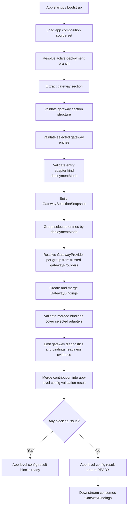

## 背景和现状（Context）

本 change 收敛一件事：**gateway 能力如何在启动期从配置选择、provider 注入、bindings 创建到 readiness / package evidence 形成一条可验证产品路径。**

它不定义 gateway port 的业务语义，不定义模型调用、ToolBank 调用、Memory / RAG 检索策略，也不定义某个 remote dependency 的协议细节，也不拥有 vendor endpoint / `baseUrl` / credential reference 等私有 access baseline 字段语义。它回答“每个 gateway entry 选择哪个 gateway provider、provider 如何被 trusted entrypoint 注入、`agent-app` core composition 如何通过 SPI resolve 并创建/合并 bindings、下游应消费什么冻结产物和 readiness evidence”。

## 与相邻 change 的边界（Adjacent Change Boundaries）

### `add-ts-app-config-schema`

- 拥有全局 configuration lifecycle：source precedence、部署 source set 选择、统一 validation / freeze 触发、全局 `READY / DEGRADED_READY / BLOCKED` 产物与总 diagnostics。
- 本 change 提供 gateway section 的 adapter selection 字段语义、entry 判定、section snapshot、provider SPI、provider resolve 和 bindings readiness evidence。
- gateway section 的校验结果必须并入 app-level configuration validation result，不得形成第二套全局 config result 体系。

### `add-ts-secret-configuration-boundary`

- 拥有 `SecretReference` grammar、解析安全边界、脱敏规则和 raw secret 禁止泄漏规则。
- 本 change 不涉及 credential reference。gateway entry 的 credential 校验属于后续 remote dependency / platform gateway change。
- 本 change 不重新定义 secret grammar、secret resolution 协议或 secret-safe diagnostics 规则。

### Concrete local / remote gateway provider packages

- 本 change 拥有 `GatewayProvider` SPI、provider registry resolve、entrypoint 注入协议和 bindings readiness evidence。
- `agent-platform-gateway-local` 或 vendor remote gateway package 拥有 concrete provider implementation。remote gateway package 后续可以覆盖 SkillHub、RAG、sandbox 等多个 adapter；local gateway package 仍可覆盖 sqlite、本地 sandbox、本地 scheduled maintenance 等 adapter。
- endpoint / `baseUrl` / credential reference 校验、dependency readiness 深度探针、remote dependency reachability dashboard、ToolBank / Memory / RAG 具体适配协议属于 concrete provider package 或后续 remote dependency change。

### Local / remote product entrypoints

- 本 change 拥有 entrypoint 装配协议：entrypoint import concrete provider，并通过 `createNextAgentApp({ gatewayProviders })` 或 `createComposedApp({ gatewayProviders })` 注入。
- 官方 local entrypoint 由 `agent-platform-gateway-local/entrypoints/local` 拥有，可以依赖 `agent-app` composition API，并负责为 sync local startup / testing harness 注入 local fallback factories。
- remote entrypoint 由外仓 vendor package 拥有，可以依赖 `agent-app` composition API，并必须显式要求调用方 / vendor package 传入完整 remote provider 与 app-required binding factories；仓内 `agent-platform-gateway-remote` 仅作为 remote provider / adapter implementation reference，可提供 stores、sandbox、RAG retrieval、scheduled maintenance 等 binding assembly 参考，不导出零参可启动入口。
- `agent-app` core composition 不得 import concrete local / remote provider factory 或 concrete gateway package；product entrypoint / package runner 可以 import 其目标部署模式所需的 concrete provider / fallback factory 并注入。
- package startup launcher 可以读取已验证 `default-system.yaml` 的 `deployment.mode` 和 `deployment.deploymentEntrypointRefs`，并与 package manifest 的 deployment entrypoint map 合并后选择 LOCAL 或 REMOTE 启动脚本；launcher 不按包名约定自动 import concrete local / remote provider，entrypoint module specifier 必须来自已校验的 deployment config 或 package manifest。

## 黑盒目标（Blackbox Goal）

系统在启动装配阶段接收 trusted `GatewayProvider[]`，读取 gateway 配置组，按每个 selected gateway entry 的 `deploymentMode` 和 `adapterKind` 锁定 provider，冻结 `GatewaySelectionSnapshot`，通过 `GatewayRegistry` 为每组 entry resolve provider，并分别调用 `provider.create(context)` 创建 partial `GatewayBindings`，再合并为 app-level `GatewayBindings`。该锁定由部署配置在启动期同步完成，不在运行时动态选择或回退；selection snapshot、每个 provider 的 bindings readiness 和 safe diagnostics 一并进入 app-level validation、health/readiness 和 package evidence。

## 边界（Boundary）

- 负责：产品配置字段定义、启动期同步校验、adapter selection、per-entry deploymentMode、`GatewayProvider` SPI、trusted provider 注入、provider registry resolve、bindings readiness、冻结快照、package evidence、fail-fast 边界
- 不负责：全局 config lifecycle、全局 readiness 产物、secret grammar / resolution、vendor endpoint / `baseUrl` / credential reference 等 access baseline、gateway port 业务语义、concrete provider 协议、ToolBank / Memory / RAG 检索或执行策略、model invocation、capability conflict、dependency readiness 深度探针、运行时动态 adapter 切换或回退
- owner：`agent-app` 主责，platform gateway packages 强相关协作

## 核心实现策略（Core Implementation Strategy）

- gateway 配置解释集中在启动边界完成，而不是分散到请求期和 adapter 内部。
- source configuration 完全省略 `gateway` section 时，系统应用默认 sqlite gateway 配置，使单进程本地部署无需显式 gateway entry 即可启动；显式配置 `gateway` section 时仍按完整规则校验，不静默回退。
- adapter selection 是 per-entry / per-port 静态部署配置锁定：local / remote provider 共享同一 `GatewayProvider` SPI，部署配置为每个 gateway entry 选定唯一生效 provider；同一 app 可同时注入 local provider 与 remote provider，分别承载不同 adapter，运行时不动态切换或回退。
- `agent-app` core composition 只 import SPI type 和结构化 composition option，不 import concrete local / remote gateway package；local provider 和 local fallback factories 由 `agent-platform-gateway-local` 的 product entrypoint 或 testing harness 显式 import 后注入，remote provider / bindings / factories 由外仓 remote entrypoint 显式注入。
- provider registry 在 gateway freeze 后按 selected entry 分组 resolve provider；每组 `provider.create(context)` 成功返回 bindings 且合并后的 bindings 覆盖全部 selected adapter 后，主路径才允许进入 ready。
- provider `create(context)` 只按传入该 provider 的 selected gateway entries 创建对应 bindings；未选择的 adapter kind 不得被创建为副作用。首轮可前移的 config-owned bindings 包含 sqlite stores、sandbox、scheduled maintenance 和 provider 可直接提供的 RAG retrieval port；需要 active Agent Scope / workspace policy 的 local RAG construction 可保持 agent-aware app composition 路径。
- 下游模块只消费冻结产物和 gateway ports，不重复读取源配置。
- local provider 必须满足首版本地 release 的完整运行前提；remote provider 由外部 entrypoint 注入，必须以“可配置、可诊断、可证明 bindings readiness”的方式进入产品路径。
- `deployment.mode` 只选择 package manifest 中已声明的启动入口；REMOTE entrypoint 缺失、不可加载或不导出约定启动函数时必须阻断 ready，且不得 fallback 到 LOCAL entrypoint。

## 实现流程（Implementation Flow）

流程分段如下：

1. app startup / bootstrap 先按 `app-config-schema` 的总规则读取 source set，并确定当前 active deployment branch。
2. gateway change 从总配置输入中提取 `gateway` section，只处理本 section 的 adapter selection 字段语义和 entry 判定。
3. 先完成 section 结构校验，再对所有 selected gateway entries 执行稳定 adapter kind、唯一性和 per-entry `deploymentMode` 校验。
4. 每个 gateway entry 进入运行时 selection baseline；首版不定义 disabled selection 分支。
5. selected entries 依次校验 adapter selection 和 entry 判定。
6. 每个 selected entry 被判定为 `enabled`。
7. 基于判定结果生成 `GatewaySelectionSnapshot`。
8. `GatewayRegistry` 根据冻结选择按 selected entry 的 `deploymentMode` 分组，并从 trusted `gatewayProviders` 中为每组 resolve 唯一 provider。
9. `agent-app` 分别调用 provider `create(input)` 创建 partial `GatewayBindings`，合并 bindings，并校验每个 provider bindings shape、deployment mode 与 merged bindings coverage。
10. gateway change 产出 gateway section diagnostics contribution 和 bindings readiness evidence，并把它们并入 app-level configuration validation result。
11. app-level configuration validation 依据 aggregated result 决定当前启动是 blocked 还是 ready。
12. 只有在 gateway selection freeze 和 bindings readiness 完成后，后续依赖 gateway port 的模块才允许消费 `GatewayBindings`。

这个流程的关键约束是：

- gateway change 不直接发布全局 ready state；
- gateway change 不直接实现 concrete provider 或业务模块，只定义 SPI、冻结后的 gateway section 输入和 bindings handoff；
- gateway change 不在请求生命周期中重新执行；
- gateway entry 判定失败必须通过 app-level diagnostics 暴露，而不是留到首个请求再暴露。

## 触发机制（Trigger）

触发机制固定如下：

- 由 app startup / bootstrap 触发；
- 发生在 app-level configuration freeze 完成之前；
- 发生在 gateway provider 被 resolve、`GatewayBindings` 被创建、Agent assembly 对外 serving、以及第一个 request 被接收之前；
- 不由用户动作触发；
- 不由后台 job 周期触发；
- 不在请求生命周期中的 planning、model invoke、capability invoke、checkpoint、terminal 或 replay 阶段触发；
- 当前进程启动中必须同步完成。

## 输入与前置条件（Inputs / Preconditions）

最小输入：

- 已解析的 app composition source set
- 当前 deployment branch 下的 `gateway` 配置组
- app composition 已完成的 source set 选择结果
- trusted `GatewayProvider[]` composition input
- downstream 将要消费的 gateway section snapshot contract

每个 gateway entry 的最小配置关注点：

- `gatewayId`
- `adapterKind`
- `enabled`
- `deploymentMode`

前置条件：

- `add-ts-app-config-schema` 已定义启动期 validation / freeze 的总体边界
- app configuration source precedence 已固定
- 当前 deployment branch 已经确定
- 上层模块尚未进入请求处理阶段

## 关键约束（Key Constraints）

- gateway 配置负责 adapter selection、per-entry deploymentMode、provider resolve 和安全校验。
- 同一 `adapterKind` 在 gateway source set 内至多出现一次；adapter selection 是 per-port 静态锁定，不允许同一 adapter kind 配置多个 entry。
- gateway 配置拥有 gateway section 的 adapter selection 字段语义、entry 判定、provider resolve 和 bindings readiness，不拥有全局 config state。
- 上层模块只能依赖 gateway ports，不得读取具体 adapter 配置。
- adapter 私有配置字段、SDK 类型、连接池对象或 client implementation 细节不得进入跨模块 public contract。
- selected gateway entry 校验失败必须显式贡献 blocking issue 给 app-level diagnostics，不允许静默跳过。
- `agent-app` core composition 不得 import concrete local / remote provider factory 或 concrete gateway package；具体 provider 只能由 entrypoint / package runner 通过 trusted composition input 注入。
- 某 selected entry 对应 deploymentMode 的 provider 缺失、重复、deployment mode 不匹配、`create()` 失败或返回 invalid bindings 时必须阻断 ready，且不得 fallback。
- package launcher 必须依据 `deployment.mode` 选择 deployment config / manifest 合并后的 declared deployment entrypoint；REMOTE 缺 entrypoint 时不得启动 LOCAL entrypoint。
- gateway implementation 源码不得依赖 `agent-app`；唯一例外是 gateway package 的 `src/entrypoints/**` product entrypoint subpath 和 public testing wrapper 可以依赖 `agent-app` composition API。

## 核心判断逻辑（Rule Order）

启动期 gateway configuration 校验必须按以下顺序执行：

1. 读取并抽取 active app composition branch 下的 gateway 配置集合。
2. 校验 gateway 配置组结构可解析，且每个 entry 至少具备 `gatewayId`、`adapterKind` 和 `deploymentMode`。
3. 校验 `gatewayId` 非空且在当前 gateway source set 内唯一。
4. 校验 `adapterKind` 必须属于当前产品允许的稳定选择集合，并且当前 app composition 已注册对应 adapter。
5. 校验同一 `adapterKind` 在 gateway source set 内至多出现一次。
6. 根据 entry `deploymentMode` 确定该 entry 必须由 LOCAL provider 还是 REMOTE provider 承载；配置层不按 product deployment mode 排除 remote entry。
7. 每个 gateway entry 进入 enabled runtime snapshot；首版不使用 `enabled=false` 排除 gateway entry。
8. 根据 adapter registration 将每个 entry 判定为 `enabled`；任一 selected entry 校验失败，gateway section 贡献 blocking issue。
9. 生成 `GatewaySelectionSnapshot`。
10. 从 trusted `gatewayProviders` 中 resolve provider；若缺失、重复或 deployment mode 不匹配，gateway section 贡献 blocking issue。
11. 调用 provider `create(input)` 创建 `GatewayBindings`；若失败或返回 invalid bindings，gateway section 贡献 blocking issue。
12. 生成 gateway section diagnostics contribution 和 bindings readiness evidence。
13. 只有在 gateway section 冻结和 bindings readiness 通过后，下游 gateway adapter composition、model / capability / memory 相关模块才允许消费这些配置事实。

附加规则：

- local adapter 必须能独立支撑首版本地 release 的完整运行前提。
- local provider 按 selected entries 按需创建 sqlite stores、sandbox 和 scheduled maintenance bindings；RAG binding 需要 active agent scope，因此仍由 `agent-app` 在 assembly 确定后创建。
- 各 adapterKind 对应的 gateway provider 由 local entrypoint 或外仓 remote entrypoint 装配；仓内 remote package 仅提供 provider / adapter implementation reference。`gateway` section 只声明 adapter selection，具体接入参数仍由各自 provider package 消费。`skillhub` 可作为 remote adapterKind 进入冻结产物，但实际协议与调用由 capability source 和 provider package 装配决定。
- 本 change 不定义 remote dependency 的深度可达性探针，也不定义 endpoint / credential 校验；只定义配置层的 adapter selection、最小可解析性和 readiness baseline。
- 本 change 不判断业务侧是否真正调用某个 remote dependency；只判断当前部署是否允许其进入启动后的依赖基线。
- adapter selection 由部署配置静态决定；选定 adapter 不可用时贡献 blocking issue，不自动切换到另一个 adapter 实现。

## 输出与副作用（Outputs / Side Effects）

成功时，流程至少输出：

- `GatewaySelectionSnapshot`
- `GatewayBindings` readiness proof
- gateway section diagnostics contribution

允许的副作用：

- startup / gateway validation 结构化日志
- app-level readiness / health 可消费的 gateway section safe diagnostics
- adapter composition 可消费的冻结 selection baseline
- package candidate evidence / startup proof 可消费的 provider id、deployment mode、gateway snapshot ref 和 bindings readiness fact
- 后续 model / capability / memory / source change 可消费的 gateway section baseline

不允许的副作用：

- 触发 request execution、model invocation、capability invocation 或 memory retrieval
- 生成用户可见聊天消息
- 生成 checkpoint、pending input、summary、memory record 或 learning event
- 输出 raw secret、raw endpoint credential、raw local path、未脱敏 provider body 或 adapter-native exception

## 状态 / 产物契约（Artifacts）

### 源配置与冻结产物的字段映射

源配置层（`RawDefaultSystemConfig.gateway`）沿用 `add-ts-app-config-schema` 已冻结的 gateway section 结构：``、`gateways[]`，每个 entry 含 `gatewayId`、`gatewayKind`、`enabled`、`deploymentMode`、`sqliteFileRef`。本 change 不新增 vendor endpoint / `baseUrl` / credential reference 等私有 access baseline；这类字段由具体 remote provider package 或后续 remote dependency change 定义。

冻结产物层使用本 change 定义的 `adapterKind` 词汇。源 `gatewayKind`（例如 `"sqlite"`、`"sandbox"`、`"scheduled-maintenance"`、`"rag-knowledge"`、`"skillhub"`）映射为产物 `adapterKind`，二者语义同形。`sqliteFileRef` 作为现有 app-config-schema 冻结字段保持原样，本 change 的 selection 校验只消费其 safe reference，不解析底层文件内容。

源配置（raw）与冻结产物（snapshot）允许不同 shape，与现有 `RawDefaultSystemConfig` / `DefaultSystemConfig` 的分层一致。本 change 不重命名源配置字段名，避免破坏已归档 `app-config-schema` 冻结的 selector 语义和现有配置文件。

### `GatewaySelectionSnapshot`

语义：

- 单次进程生命周期内冻结的 gateway adapter 选择快照；
- 表达当前部署允许哪些 gateway entries 进入装配与运行时基线。

最小字段：

- `entries`
- `validatedAt`
- `readinessState`
- `diagnosticRef`

每个 `entry` 至少包含：

- `gatewayId`
- `adapterKind`
- `enabled`
- `deploymentMode`
- `selectionState`

限制：

- 只保留 safe configuration value、selection state 和 references
- 不保留解析后的 secret value
- 不保留 adapter 私有 client 对象或连接句柄

### `GatewayProvider`

语义：

- trusted entrypoint 注入给 `agent-app` 的 gateway implementation provider；
- `agent-app` core composition 只依赖该 SPI 和结构化 composition option，不 import concrete provider factory 或 concrete gateway package。

最小字段：

- `providerId`
- `deploymentMode`
- `create(input)`

限制：

- `providerId` 必须可追溯到 startup / package evidence；
- `deploymentMode` 必须与 frozen selection 匹配；
- `create(input)` 返回 `GatewayBindings`，不得返回 raw SDK client 或 provider-private config。

### `GatewayBindings`

语义：

- selected provider 创建出的稳定 gateway port 集；
- 下游模块只能消费 bindings 内显式暴露的 gateway ports。

最小字段：

- `providerId`
- `deploymentMode`
- `readiness`
- stable gateway ports（按当前产品实际已定义 port 暴露）
- optional `close()`

限制：

- 不包含 raw endpoint、credential、local path、SDK client、connection pool 或 provider-native error body；
- bindings readiness 进入 startup proof / package candidate evidence。

### gateway section diagnostics contribution

语义：

- gateway section 对 app-level `ConfigValidationResult` / `ConfigIssue` 的结构化贡献；
- 只表达 gateway section 的 blocking 事实，不创建新的全局配置结果体系。

最小字段：

- `gatewayId`
- `issueCode`
- `severity`
- `fieldRef`
- `safeMessage`
- `affectsReadiness`

生命周期：

- 在当前启动期被汇总进 app-level configuration validation result；
- 冻结后只读，供 startup diagnostics、health / readiness 和 release evidence 使用。

## 流程接入（Flow Integration）

该 change 接入主流程的位置：

- 上游：
  - app configuration loading / validation
  - adapter registration baseline
  - app composition source selection
- 当前流程：
  - startup bootstrap gateway validation and freeze
- 下游：
  - local / remote gateway adapter composition
  - model provider、capability source、SkillHub、sandbox、Memory / RAG 等后续 change 的 gateway section baseline 消费
  - app-level readiness / health diagnostics

主线关系：

- 它属于 `Remote Gateway / Platform -> Model / Tool Capability / Context / Memory` 这条平台依赖链路；
- 它只负责把 gateway 接入配置冻结成可信输入；
- 具体模型调用语义归 model changes；
- 具体 ToolBank / capability 调用语义归 capability changes；
- 具体 Memory / RAG 检索语义归 memory changes。

## 失败处理（Failure Handling）

必须显式处理以下失败路径：

- `gateway` 配置组缺失或结构不可解析：
  - gateway section 贡献 blocking issue；完全省略 `gateway` section 时仍应用默认 sqlite gateway 配置
- `gatewayId` 在源集合内重复：
  - gateway section 贡献 blocking issue
- 同一 `adapterKind` 在源集合内出现多次：
  - gateway section 贡献 blocking issue
- adapter 未注册：
  - gateway section 贡献 blocking issue
- 某 selected entry 对应 deploymentMode 的 provider 未注入、重复或 deploymentMode 不匹配：
  - gateway section 贡献 blocking issue
- 任一 selected provider `create(input)` 失败或返回 invalid bindings：
  - gateway section 贡献 blocking issue
  - 不自动回退到 local provider
- 部署配置选定的 adapter 在运行时不可用：
  - gateway section 贡献 blocking issue
  - 不自动回退到另一个 adapter 实现
通用规则：

- 不得静默截断、静默丢弃或静默吞错
- 不得把 selected entry 校验失败延后到首个 request 再暴露
- 所有 unavailable 都必须通过 safe diagnostics、readiness evidence 或 app-level config diagnostics 表达

## 验收样例（Acceptance Examples）

### 正常路径

- 本地 release 选择 local gateway adapter，local entrypoint 注入 local provider，gateway entry 结构合法，系统冻结 selection snapshot、创建 bindings，并向 app-level validation 与 package evidence 贡献 success outcome。
- vendor remote entrypoint 同时注入 local provider 与 remote provider，例如 sqlite 由 local provider 承载、sandbox/RAG/SkillHub 由 remote provider 承载；系统按 entry 分组创建并合并 bindings，startup proof 记录 selected provider id、deployment mode 和 bindings readiness。
- vendor remote entrypoint 只选择 remote adapters 时，remote provider 成功创建 bindings，startup proof 记录 selected provider id、`REMOTE` deployment mode 和 bindings readiness。

### 失败路径

- 多个 gateway entry 共用同一 `gatewayId`；gateway section 贡献 blocking issue。
- adapter 未注册；gateway section 贡献 blocking issue。
- remote deployment 缺少 remote provider、provider deploymentMode 不匹配或 provider create 失败；gateway section 贡献 blocking issue，系统不进入 ready。
- 部署配置为某 gateway port 选定 remote adapter，但该 adapter 不可用；系统 MUST NOT 自动回退到 local adapter，而是贡献 blocking issue。

## 质量属性设计（Quality Attributes）

| 质量属性 | 设计结论 | 验证入口 |
|---|---|---|
| 安全 | gateway diagnostics 只输出 safe field ref、reason code 和脱敏摘要；不得泄露 raw secret、credential 或 adapter-native exception | gateway configuration contract tests：selection 失败诊断断言 |
| 性能/容量 | gateway 配置校验在启动期同步完成，不延迟到请求期；单次进程生命周期内 snapshot 只读，不重复校验 | bootstrap validation tests：启动耗时回归 |
| 可靠性/恢复 | selected gateway entry 失败必须贡献 blocking issue，不允许静默跳过或延后到首个请求暴露 | readiness / startup blocking integration tests：blocking 路径 |
| 可维护性 | gateway 配置语义集中在 `agent-app` 启动边界，adapter 私有字段不得进入跨模块 public contract；local / remote provider 只消费冻结产物；`agent-app` core composition 不 import concrete gateway package | architecture lint：core composition 不依赖 concrete gateway package |
| 可测试性 | 每个 gateway entry 判定结果和 provider 分组结果可通过 unit test 独立验证；校验规则顺序固定 | gateway configuration contract tests：entry 判定覆盖 |
| 审计/可追溯性 | `GatewaySelectionSnapshot` 携带 `validatedAt` 和 `diagnosticRef`，冻结后只读 | gateway configuration contract tests：snapshot 字段断言 |

## 验证映射（Verification Map）

| 约束 | Task | 验证入口 |
|---|---|---|
| gateway 配置只在启动期同步校验和冻结 | gateway configuration contract tests | bootstrap validation tests |
| selected entry 失败贡献 blocking issue | gateway configuration contract tests | readiness / startup blocking integration tests |
| remote entry 可在 local product deployment 中被 selected | gateway configuration contract tests | mixed local / remote provider startup smoke tests |
| snapshot 冻结后只读，下游不重复读取源配置 | architecture lint | concrete gateway providers 不读取原始配置 |
| adapter selection 是静态部署配置锁定，运行时不动态切换或回退 | gateway configuration contract tests | 选定 adapter 不回退断言 |
| provider 由 entrypoint 注入且 `agent-app` core composition 只依赖 SPI / structured option | composition / architecture tests | `create-app.ts` 不 import concrete gateway package |
| provider create bindings 成功后才 ready | startup integration tests | provider create failure blocks ready |
| package evidence 记录 provider / deployment mode / bindings readiness | package evidence tests | startup proof / candidate evidence assertions |

## 文档承载决策（Documentation Ownership）

归档时需更新以下长期基线文档：

- `openspec/specs/gateway-configuration/spec.md`：新增 gateway configuration 行为契约
- `openspec/designs/architecture/configuration-boundary.md`：补充 gateway section 在配置冻结链路中的位置
- `openspec/designs/contracts/platform-gateway-spi.md`：补充 `GatewayProvider`、`GatewayBindings` 和 gateway section snapshot 消费契约
- `openspec/designs/modules/agent-app.md`：补充 gateway 配置校验与 app-level validation 的集成点
- `openspec/designs/modules/agent-platform-gateway-local.md`：补充 local provider 消费冻结产物并由 gateway-local local entrypoint 注入的入口
- vendor integration guide / `openspec/designs/modules/agent-platform-gateway-remote.md`：补充仓内 remote package 仅作为 implementation reference、外仓 remote entrypoint 注入 vendor provider 的产品路径约束
- `openspec/designs/spec-to-design-map.md`：新增 gateway-configuration spec 与设计文档映射

## 风险与取舍（Risks / Trade-offs）

- [风险] gateway 校验逻辑与 app-level configuration validation 存在职责重叠 -> 本 change 只产出 gateway section diagnostics contribution，由 `add-ts-app-config-schema` 统一汇总，不创建第二套全局 config result 体系
- [风险] remote provider 未被选中但配置已存在 -> 未选中的 provider 保持可注入但不进入有效调用路径，由部署配置决定，不伪装为可用
- [风险] adapter 私有字段泄漏到跨模块边界 -> 架构约束：上层模块只消费 gateway ports 和冻结 snapshot，不得读取具体 adapter 配置；通过 dependency-cruiser 和 contract test 守护
- [取舍] endpoint / credential 校验后置到 concrete provider package 或后续 change -> 本 change 聚焦 provider SPI、selection、bindings readiness 和 evidence，避免在 remote adapter 协议尚未定义时引入 speculative access baseline
- [取舍] 启动期同步校验增加启动耗时 -> 换取配置问题在启动时暴露而非延迟到首个请求，符合电信级 fail-fast 要求

## 归档前更新基线（Baseline Promotion Plan）

行为契约：

- `openspec/specs/gateway-configuration/spec.md`：新增

设计视图：

- `openspec/designs/architecture/configuration-boundary.md`
- `openspec/designs/contracts/platform-gateway-spi.md`
- `openspec/designs/modules/agent-app.md`
- `openspec/designs/modules/agent-platform-gateway-local.md`
- vendor remote provider / external remote entrypoint integration guide
- `openspec/designs/spec-to-design-map.md`

验证入口：

- gateway configuration contract tests
- bootstrap validation tests
- readiness / startup blocking integration tests
- remote dependency unavailable smoke tests
