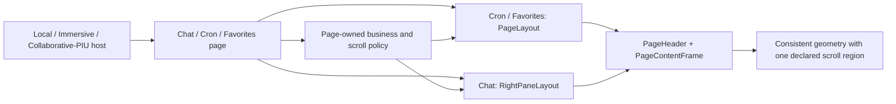

## 设计范围

| Function | 本次目标变化 | 涉及 delta specs | 设计章节 |
|---|---|---|---|
| `FN-10.35 呈现 Agent Web 页面布局` | 新增统一 Header、页面操作区域、Content、可选 docked Footer、宽度模式和滚动几何，并让会话、定时任务、收藏首批接入 | `agent-web-page-layout` | `FN-10.35 呈现 Agent Web 页面布局` |
| `FN-1.13 查看收藏列表` | 收藏页面改用不带页内返回的统一 Header，保留宿主导航和收藏内容区既有行为 | `favorite-turn-list` | `FN-1.13 查看收藏列表` |

## 存量 Requirement 迁移方案

| 来源 spec / Requirement | 目标 Function / canonical spec | 原子 delta | 其他行为与未触及 Requirements 处理 | 白盒落点 | stable spec 与导航影响 |
|---|---|---|---|---|---|
| `agent-web-right-pane-styles` / `右侧布局宽度` | `FN-10.35 呈现 Agent Web 页面布局` / `agent-web-page-layout` | 来源 `REMOVED` + 目标 `ADDED`：`页面 Content 支持 contained 与 fluid 宽度` | `右侧布局背景透明`、`免责声明文案与 Tooltip`、`SuggestedQuestions 间距调整` 原位保留；会话宽度继续为 `contained/1080px`，并扩展为首批页面统一宽度契约 | `FN-10.35 / 修改方案 / 2. 由共享内容 frame 显式承载宽度，由模板承载普通滚动几何`、`3. 将 RightPaneLayout 收敛为会话专用适配器` | 来源 stable spec 保留，不退役；归档时只移除该 Requirement，并把 spec-to-design-map 的 RightPane module 导航转向 `agent-web` module |

当前没有其他 active change 修改 `agent-web-right-pane-styles / 右侧布局宽度`；归档时必须再次确认来源和目标没有未协调的并行 delta。

`agent-web-high-frequency-questions` 的 `高频问题容器布局` 和 `welcome-state-shell 宽度放宽` 当前以 `RightPaneLayout maxWidth 1080` 解释共享内容边界。该文字是对白盒 owner 的直接引用，本 change 不改变这两个 Requirements 的输入、目标行为、输出或失败语义，因此不执行 Function/Requirement 迁移；归档刷新稳定基线时只把直接引用改为 `FN-10.35` 的 `contained/1080px` 内容边界，其他规范义务和 Scenarios 原文保留。

## `FN-10.35 呈现 Agent Web 页面布局`

### 目标与规范依据

本 Function 为 Agent Web 页面提供一个可复用、黑盒结果一致的页面骨架。实现必须统一首批页面的标题栏、内容边界和滚动几何，但不得吸收会话、Cron 或收藏的业务状态和滚动策略。

#### 本 Function 的目标 Requirements

canonical spec：`agent-web-page-layout`

- `ADDED`：`Agent Web 页面使用统一三段式布局`
- `ADDED`：`页面 Header 保持一致且在窄视口可用`
- `ADDED`：`页面 Content 支持 contained 与 fluid 宽度`
- `ADDED`：`适用页面保持单一纵向滚动边界`
- `ADDED`：`统一布局在三个宿主中保持一致`

设计约束如下：

- `PageHeader` 与 `PageContentFrame` 只拥有共享 Header 和内容宽度几何，`PageLayout` 只拥有普通页面结构、滚动容器几何和 docked Footer；业务页面继续拥有数据、操作区域、响应式交互状态和滚动策略。
- `RightPaneLayout` 继续作为会话专用适配器存在，不把 overlay composer、footer surface 测量、浮动置底入口、免责声明或 `headerSlot` 暴露为通用页面能力。
- 不新增目录层级或依赖；共享实现进入既有 `frontend/agent-web/src/components`。

### 当前实现

- `RightPaneLayout.tsx` 已拥有最接近目标的页面骨架：`48px` Header、全 main 滚动 viewport、居中内容列、docked/overlay footer、overlay footer 高度测量和 scrollbar gutter 补偿。其标题当前为 `16px/500/24px`，默认 `maxWidth` 为 `880px`，会话调用方显式传入 `1080px`。
- `ChatPage.tsx` 把 `useChatViewportController` 返回的 scroll、wheel、pointer 和 keyboard handlers 绑定到 `RightPaneLayout` 的 viewport，并使用 `footerMode="overlay"`、动态 composer 和浮动置底入口。`useChatViewportController.ts` 是会话跟随底部、用户滚动意图、历史分页和锚点恢复的现有唯一策略 owner。
- `CronTaskDashboardPage.tsx` 自建 `.cron-dashboard`、`.cron-dashboard__topbar` 和 `.cron-dashboard__main`。当前 Header 最小高度为 `56px`、水平内边距为 `24px`、标题为 `16px/650`；窄视口把 Header 和卡片头尾改为纵向排列。`.cron-dashboard__main` 自己滚动，内容列最大宽度为 `1080px`。
- `FavoriteTurnsPanel.tsx` 自建 Header、返回按钮和 body。当前 Header 为 `56px`、带底部分隔线，标题为 `20px/700`；`.favorite-turns-scroll` 默认隐藏 overflow，只在存在展开分组时启用纵向滚动。
- Local、Immersive 和 Collaborative/PIU 已直接复用 `FavoriteTurnsPanel`；Cron 页面由 `ChatWorkspace` route 和 Collaborative/PIU 左侧扩展容器复用。宿主没有各自复制业务页面组件。
- `right-pane-layout.scroll-shell.test.tsx` 已锁定完整 main viewport、scrollbar gutter、overlay footer 对齐、动态 bottom safe area 和既有 `right-pane-*` test id；Cron、收藏、local navigation 和 PIU runtime 另有组件与宿主测试。

### GAP 分析

| 规范目标 | 当前事实 | GAP |
|---|---|---|
| 三个首批页面共享 Header | 三个页面分别实现 Header，尺寸和字体不同 | 缺少单一 Header 结构与样式 owner |
| `contained|fluid` 两种内容模式 | 会话和 Cron 分别手写 `1080px`，收藏手写满宽 | 缺少统一宽度语义、默认值和 `16px` 安全内边距 |
| Header 单行且页面操作保持页面声明 | Cron 在 `760px` 以下把 Header 改为纵向，其他页面分别排列操作 | 缺少只统一 Header 几何且不接管页面操作策略的共享边界 |
| 页面只保留声明的纵向滚动区域 | RightPane、Cron、收藏分别拥有不同 overflow 结构 | 缺少显式滚动归属；迁移时存在双滚动风险 |
| 通用 Footer 仅 docked，会话 overlay 保持专用 | `RightPaneLayout` 同时包含 docked 和 overlay 两种 footer | 通用与会话专用行为尚未分层 |
| 三个宿主同形 | 收藏和 Cron 已复用组件，但布局样式仍在业务组件内 | 需要把布局 owner 上移，同时保留现有宿主入口和扩展容器 |

### 修改方案

#### 1. 新增共享布局原语与单一 `PageLayout` 页面模板

在 `frontend/agent-web/src/components/PageLayout.tsx` 新增 `PageHeader`、`PageContentFrame` 和 `PageLayout`，并在同目录增加 `PageLayout.css`；不新增子目录。`PageHeader` 唯一维护标题栏结构、主题、尺寸和操作区域位置，`PageContentFrame` 唯一维护 `contained|fluid` 内容宽度与水平安全内边距，`PageLayout` 组合这些原语，只渲染普通页面根、Header、main Content surface 和可选 docked Footer。

模板使用以下私有 TypeScript shape；这些类型属于 `agent-web` 内部组件契约，不进入 Web API 或 `agent-contracts`：

```ts
type PageContentWidth = 'contained' | 'fluid';
type PageScrollOwner = 'layout' | 'content';

interface PageBackAction {
  readonly ariaLabel: string;
  readonly onClick: () => void;
}

```

`PageHeader` 的输入固定为 `title: string`、可选 `backAction` 和可选 `actions: ReactNode`。`actions` 是页面拥有的不透明展示输入，共享 Header 只在右侧原样渲染，不解释按钮数量、优先级、菜单形态、业务状态或回调。`PageContentFrame` 的输入固定为 `contentWidth` 和 `children`。`PageLayout` 的页面级输入由上述 Header 输入、`contentWidth`、`scrollOwner`、可选 docked `footer` 和 `children` 组成；它不接收会话 viewport bindings、overlay、footer surface 测量或跟随底部状态。`contentWidth` 默认 `contained`，`scrollOwner` 默认 `layout`。`backAction` 不接受任意 leading `ReactNode`：共享 Header 固定渲染返回图标、按钮尺寸、间距和 focus 样式，只由页面提供可访问名称与回调。

`PageHeader` 使用透明背景连续呈现 `PageLayout` 或会话根容器拥有的页面背景，不单独重复绘制 `--color-chat-pane-bg`。该 token 在浅色主题中包含面向完整页面尺寸的径向渐变；若在 `48px` Header 内重新绘制，渐变会被压缩为底部浅蓝色带。共享 Header 因此显式不显示 `box-shadow`、底部分隔线或独立背景渐变，主题色仍由页面根和交互控件的共享变量提供。

`PageHeader` 使用固定单行 flex 几何：标题区域允许收缩并使用省略号，`actions` 区域按页面提供的结构呈现且不参与共享组件的状态计算。会话后台任务监视器和 Cron 的两个创建按钮均由各自页面决定其内容、顺序和交互；如果某个页面未来需要 Dropdown 或其他响应式收纳，该行为由该页面的规格、组件和测试独立定义，不扩展共享布局契约。

#### 2. 由共享内容 frame 显式承载宽度，由模板承载普通滚动几何

`contentWidth="contained"` 使用 `width: 100%`、`max-width: 1080px`、`margin-inline: auto`；`fluid` 使用 `width: 100%` 且不设置 `max-width`。两种模式的内容 frame 都使用 `padding-inline: 16px` 和 `box-sizing: border-box`。docked Footer 的内容 frame 复用相同 width mode，不另建宽度规则。

`scrollOwner="layout"` 时，`PageLayout` 在完整 main 内建立唯一 absolute-inset scroll viewport，内容 frame 位于该 viewport 内；Cron 使用此模式。`scrollOwner="content"` 时，main 使用 `overflow: hidden`，内容 frame 保持 `height: 100%` 和 `min-height: 0`，由 child 中唯一业务内容区域滚动；收藏使用此模式。

会话是兼容性适配：`RightPaneLayout` 不渲染完整 `PageLayout`，继续建立当前完整 main viewport，并在既有 DOM 中复用 `PageHeader` 与 `PageContentFrame`。`RightPaneLayout` 继续拥有 viewport bindings、overlay footer、浮动入口、bottom inset 和 scrollbar gutter；`PageLayout` 不监听、不接收也不推导会话滚动状态。会话页面根与消息 viewport 之间不得再插入普通页面 main 或第二个滚动容器。

#### 3. 将 `RightPaneLayout` 收敛为会话专用适配器

`RightPaneLayout` 保留会话专用根、main、viewport 与 overlay DOM，不组合完整 `PageLayout`。它复用 `PageHeader` 渲染统一标题栏，并把 `headerExtra` 作为不透明 `actions` 原样传入；复用 `PageContentFrame` 的 `contained` 内容边界对齐消息列、浮动入口和 composer surface，并保留现有 props 中会话仍使用的 `headerSlot`、`footer`、`scrollViewportRef`、四类 viewport handlers、`floatingOverlay`、`centerContent` 和 `shellTestId`。现有 `maxWidth` 私有 prop 及调用方的 `maxWidth={1080}` 被 `PageContentFrame` 的 `contained` 模式取代；`footerMode` 不再作为通用模板能力，当前会话路径固定保留 overlay，现有 docked 分支由普通页面的 `PageLayout` docked Footer 取代后删除，避免两个组件同时拥有 docked 语义。

适配器继续测量 overlay footer surface 高度和 scrollbar gutter，并把高度只投影为消息内容列的 `padding-bottom`。它不得根据 footer 高度、物理底部距离或其他几何信号决定是否追底，也不得直接写入会话 viewport 的绝对底部位置；跟随底部、用户滚动意图和阅读锚点继续由 `useChatViewportController` 唯一决定。`right-pane-header`、`right-pane-title`、`right-pane-actions`、`right-pane-main`、`right-pane-scroll-viewport`、`right-pane-content-column`、`right-pane-body-shell`、`right-pane-footer-overlay`、`right-pane-floating-overlay`、`right-pane-footer-surface`、`right-pane-disclaimer` 等既有 test id 和关键 DOM 相对关系保持不变，以便 characterization test 继续证明滚动行为未回归。

`ChatPage` 继续装配 `useChatViewportController` 的 handlers 和 ref，不把任何 follow/anchor/pagination 判断迁入共享布局原语。Chat 标题改用统一 `16px/500/28px` Header；`BackgroundTaskHeaderMonitor` 由会话页面作为 actions 提供。`headerSlot` 和免责声明继续由 `RightPaneLayout` 在会话专用位置渲染。

#### 4. 迁移 Cron 与收藏页面

`CronTaskDashboardPage` 使用 `PageLayout` 的 `contained + layout` 组合。标题为“定时任务管理”，无 `backAction`；页面通过 `actions` 原样提供“手动创建”和 primary 风格的“通过会话创建”两个直接按钮，并继续拥有按钮顺序、样式和回调。删除 `.cron-dashboard__topbar`、`.cron-dashboard__main`、`.cron-dashboard__content` 中已由模板拥有的高度、宽度、padding 和 overflow 规则；保留 actions、tabs、卡片、表单、执行记录和业务响应式样式。窄容器下 Header 不再切为纵向，统一布局只截断标题，不把任一 Cron 操作转换成菜单项。

`FavoriteTurnsPanel` 使用 `PageLayout` 的 `fluid + content` 组合且不提供 `backAction`。移除 `.favorite-turns-header`、页内返回按钮及只为该按钮存在的 `onBack` 契约；收藏 body 不再重复添加模板已提供的左右 `16px` padding。`.favorite-turns-scroll` 仍是唯一收藏滚动 owner：全部收起为 `overflow: hidden`，存在展开分组时为 `overflow-y: auto`。各宿主已有导航或扩展容器关闭入口继续负责退出收藏；展开定位和收藏数据行为不变。

Local、Immersive 与 PIU 继续渲染同一 `FavoriteTurnsPanel` 和 `CronTaskDashboardPage`，不在宿主入口新增布局 wrapper，以免产生嵌套 Header 或嵌套滚动容器。

#### 5. 失败与降级边界

布局没有网络、持久化或业务失败路径。`PageHeader` 不依赖尺寸观察器或页面操作描述符；标题通过 CSS 在可用宽度不足时截断，页面操作保持调用方提供的结构。业务页面必须在自身支持的容器宽度内提供可用的操作布局，其加载、空态、错误和重试继续由原页面组件渲染在 Content 内。

#### 质量属性影响

| 质量属性 | 规范依据 | 本 Function 内实现机制 | 验证关注点 |
|---|---|---|---|
| 可维护性 | `适用页面保持单一纵向滚动边界` | `PageHeader` 唯一拥有共享 Header，`PageContentFrame` 唯一拥有共享内容宽度，`PageLayout` 唯一拥有普通页面滚动几何和 docked Footer；会话策略仍由现有 controller 拥有 | 不出现重复 Header/宽度 CSS、双滚动容器或通用模板中的 chat policy |
| 可测试性 | `适用页面保持单一纵向滚动边界`、`统一布局在三个宿主中保持一致` | 用稳定布局 test id 和宿主复用测试验证同一 DOM/滚动结果 | Header 几何、页面 actions 原样投影、contained/fluid、三个页面滚动 owner 和三宿主投影均有可重复断言 |

#### 备选方案（Alternatives Considered）

- 直接扩展 `RightPaneLayout` 供所有页面使用：未选择。该组件同时拥有免责声明、overlay composer、bottom inset 和浮动置底入口，直接通用化会把会话专用语义泄漏到 Cron 与收藏页面。
- 只提取 Header，保留各页面 Content/overflow：未选择。该方案能统一字体，但不能解决内容宽度和双滚动风险，也不能形成可复用的 Header/Content/Footer 模板。
- 由共享 Header 对页面操作建立主次分类并自动收纳：未选择。按钮数量、优先级、菜单形态和业务状态属于目标页面，通用布局只提供不透明操作区域可避免平行业务决策和持续扩张 action descriptor。

## `FN-1.13 查看收藏列表`

### 目标与规范依据

收藏列表 Function 只改变标题栏的规范归属和可见结果，并移除收藏页内返回入口。查询过滤、session 分组、显式分页、正文展开、取消收藏和宿主导航仍以 `favorite-turn-list` 为权威。

#### 本 Function 的目标 Requirements

canonical spec：`favorite-turn-list`

- `MODIFIED`：`Local 与 Immersive 收藏内容视图`

### 当前实现

- `FavoriteTurnsPanel` 同时拥有收藏业务内容与独立 Header；`onBack` 只用于返回按钮回调，Local/Immersive 由 route state 提供目标，PIU 由扩展容器提供关闭或会话切换行为。
- 收藏 body 固定 `padding: 16px`，过滤区与 `.favorite-turns-scroll` 同列；只有 `.favorite-turns-scroll-expanded` 开启纵向滚动。
- `favorite-turns-panel.test.tsx` 覆盖分组、展开、过滤、分页和取消收藏；`local-favorites-navigation.test.tsx` 与 PIU runtime tests 覆盖宿主导航和容器复用。

### GAP 分析

| 规范目标 | 当前事实 | GAP |
|---|---|---|
| 收藏使用统一 Header 且不提供页内返回 | 收藏自建 `56px`、底部分隔线、`20px/700` Header 和返回按钮 | 需要删除重复 Header owner、返回按钮及其页面回调契约 |
| 收藏使用 `fluid` 内容 frame | 收藏自行占满宽度并在 body 添加 `16px` padding | 需要由模板承载宽度和安全内边距，避免双 padding |
| Header/过滤区固定，仅展开内容滚动 | 当前内部滚动语义正确，但外层迁移可能引入第二滚动容器 | 必须以 `scrollOwner="content"` 接入并锁定 overflow 层级 |

### 修改方案

`FavoriteTurnsPanel` 直接组合 `PageLayout`，使用 `title={t('sidebar.favorites')}`、`contentWidth="fluid"` 和 `scrollOwner="content"`，不传 `backAction`。收藏页面不接收任意 leading 节点，也不自定义 Header icon、字体、尺寸、背景或 divider。

收藏 tabs、filter、加载/空态/错误态、列表和分页保持在 Content frame 内。现有 body 的水平 padding 迁移到模板后，body 只保留业务需要的垂直排列和 `min-height: 0`；`.favorite-turns-scroll` 的 ref、展开定位和 overflow 切换保持不变。收藏测试通过语义化 Header 查询断言“收藏”标题从左侧内容起始位置展示且不存在页内返回操作，不断言私有组件层级。

`FavoriteTurnsPanel` 只保留 `onOpenFavorite` 页面业务回调，不再接收 `onBack`。Local 与 Immersive 继续由侧边栏或顶部宿主导航切换主内容；Collaborative/PIU 继续由 `ExpandPanel` 的容器关闭按钮收起收藏，选择收藏会话仍收起容器。该调整不得新增 URL、shell state、收藏 query state 或 PIU 容器 authority。

#### 质量属性影响

| 质量属性 | 规范依据 | 本 Function 内实现机制 | 验证关注点 |
|---|---|---|---|
| 可测试性 | 无新增黑盒质量目标；依据功能性 Requirement `Local 与 Immersive 收藏内容视图` | 保留收藏滚动元素和宿主入口，只替换 Header 与外层 content frame，并删除页内返回回调 | Header 无返回、宿主仍可退出收藏、全部收起无滚动、展开后滚动、三宿主复用均不回归 |

## 跨 Function 协作与端到端流程

`FN-10.35` 的共享布局原语和普通页面模板只消费页面提供的展示输入，不读取 `FN-1.13`、`FN-10.9` 或 `FN-1.22` 的业务数据。三个页面的集成关系如下：



- 收藏路径按 `FN-1.13` 修改方案把 `fluid + content` 选择交给模板且不声明返回操作，收藏内容区仍拥有展开滚动，退出入口仍由宿主拥有。
- Cron 页面把标题、包含两个直接按钮的 actions 和 `contained + layout` 选择交给模板，按钮顺序、样式、回调、Cron API 和页面状态不进入模板。
- 会话路径由 `RightPaneLayout` 复用 `PageHeader` 和 `PageContentFrame`；`useChatViewportController` 的输出仍只绑定到会话 viewport，`PageLayout` 不进入该 DOM 路径且共享原语不产生滚动意图。

## 跨 Function 质量属性设计（Cross-Function Quality Attributes）

| 质量属性 | 影响 Functions 与规范依据 | 共享或端到端机制 | 端到端验证 |
|---|---|---|---|
| 可维护性 | `FN-10.35` / `agent-web-page-layout`：`适用页面保持单一纵向滚动边界`；适用 `FN-1.22`、`FN-10.9`、`FN-1.13` | 共享布局原语统一几何，普通页面由 `PageLayout` 组合，会话保留专用 shell；各业务页面仍保留唯一策略 owner，同一宿主不得再包装第二层布局 | 组件与 architecture review 共同检查 owner 边界，页面测试断言唯一滚动区域 |
| 可测试性 | `FN-10.35` / `agent-web-page-layout`：`适用页面保持单一纵向滚动边界`、`统一布局在三个宿主中保持一致` | 共用 test id 语义和共享页面组件形成可重复验证入口 | component tests 验证布局与 actions 原样投影，host tests 验证复用，Playwright 验证真实 scrollbar、Cron 两个直接按钮和三页面切换 |

## 验证策略（Verification Strategy）

- unit/component 层验证 Header 精确尺寸与字体、无 divider、返回操作、页面 actions 原样投影、`contained|fluid` 内容 frame 和 docked Footer 对齐。
- characterization 层保留并扩展 RightPane scroll shell 测试，证明完整 main viewport、scrollbar gutter、overlay footer、动态 bottom safe area、floating overlay 和既有 test id 未变化。
- page component 层分别验证 Cron 只滚动 Content、窄容器不换行，以及收藏 Header 无返回、全部收起无滚动、展开后只滚动收藏内容区。
- host integration 层验证 Local、Immersive、Collaborative/PIU 继续复用同一收藏/Cron 页面，宿主既有导航或容器关闭入口仍可退出收藏，且不产生额外 Header、滚动容器、URL 或扩展容器 authority。
- browser e2e 层使用真实 DOM 尺寸和滚动高度验证三个页面的 Header、收藏无页内返回、宽度、Cron 两个直接按钮、scrollbar 位置和页面切换；会话旅程同时覆盖跟随底部时 composer 增高继续追底、用户回看时 composer 增高不抢夺位置、返回底部和锚点窗口。
- negative case 明确断言：模板不接收任意 leading 节点、不生成页面操作菜单；通用 Footer 不支持 overlay；`RightPaneLayout` 不决定会话追底；页面根不与声明滚动区域同时滚动；收藏/PIU 不创建新 URL 或弹框；布局变更不发出业务 API 请求。
- 前端 build、相关 Vitest、mode build 和 Playwright 共同作为实施完成证据；OpenSpec strict validation 证明规格和设计一致性。

## 长期基线刷新计划（Baseline Promotion Plan）

- `openspec/specs/agent-web-page-layout/spec.md`：新增 `FN-10.35` 唯一主规格并合入本 change 的 ADDED Requirements。
- `openspec/specs/agent-web-right-pane-styles/spec.md`：移除已迁入 `agent-web-page-layout` 的 `右侧布局宽度`；其他三个 legacy Requirements 原位保留，来源 spec 不退役。
- `openspec/specs/favorite-turn-list/spec.md`：合入 `Local 与 Immersive 收藏内容视图` 的目标态，移除收藏独立 Header 视觉规格。
- `openspec/designs/functions/D10-二次开发与平台集成/D10.2-集成与定制/FN-10.35-呈现AgentWeb页面布局.md` 与 `openspec/designs/functions/index.md`：新增 Function 文档及 1–4 项关键规格，把 `F-1.4`、`F-1.7`、`F-10.9` 列为覆盖特性，并把新 Function 加入索引。
- `openspec/designs/functions/D1-会话与流式交互/D1.3-对话标注与分享/FN-1.13-查看收藏列表.md`：刷新描述、处理过程和结果，不复制统一 Header 数值。
- `openspec/designs/features/D1-会话与流式交互/D1.2-会话生命周期管理/F-1.4-查看会话内容.md`、`openspec/designs/features/D1-会话与流式交互/D1.3-对话标注与分享/F-1.7-标注对话.md`、`openspec/designs/features/D10-二次开发与平台集成/D10.3-测试与扩展/F-10.9-Cron工具.md`：把 `FN-10.35` 加入组成 Functions，并分别摘要会话、收藏和定时任务页面获得的统一布局结果；`F-10.6 前端定制` 不变。
- `openspec/specs/agent-web-high-frequency-questions/spec.md`：只把 `高频问题容器布局` 与 `welcome-state-shell 宽度放宽` 中的 `RightPaneLayout maxWidth 1080` 白盒引用改为 `FN-10.35` 的 `contained/1080px` 内容边界，不改变 Requirements 的其他行为或 Scenarios。
- `openspec/overview.md`：补充 Agent Web 主内容页面以统一布局模板收敛视觉和滚动几何的长期目标。
- `openspec/designs/architecture/agent-web-host-modes.md`：补充三个宿主复用统一页面布局且宿主不增加平行业务或滚动语义的边界。
- `openspec/designs/modules/agent-web.md`：记录 `PageLayout`、`RightPaneLayout` 和 `useChatViewportController` 的职责分层以及三个首批消费者。
- ADR：无；该决策是 `agent-web` 模块内布局 owner 收敛，不形成新的跨模块长期技术取舍。
- `openspec/designs/spec-to-design-map.md`：新增 `agent-web-page-layout` 到 host-mode architecture、`agent-web` module 和前端验证入口的导航；刷新 `agent-web-right-pane-styles` 的 module 导航，避免继续描述为无模块设计的纯 CSS 变更。

## 风险与取舍（Risks / Trade-offs）

- RightPane 复用共享 Header 和内容 frame 时最容易破坏 overlay footer 高度、scrollbar gutter 或滚动 anchor。缓解方式是保留会话专用 DOM、test id 和 characterization tests，先锁定现有行为再替换共享几何原语。
- 页面 actions 作为不透明节点后，共享 Header 无法替页面修复不适合目标容器宽度的操作布局；该责任由页面规格和页面测试承担，避免把业务动作策略下沉到通用模板。
- 收藏从独立 Header/body padding 迁移后可能出现双 padding 或错误压缩收藏内容可用高度。通过内容未溢出与展开后溢出两种 DOM 尺寸测试和真实浏览器验收锁定；收藏分页数量继续由 `favorite-turn-list` 独立定义。
- 新 Function 把跨页面布局质量作为独立黑盒边界，而不是把 React 组件本身当作 Function。归档时 Function 文档只描述用户和页面开发者可观察的布局结果，组件 props 与测量实现只保留在 module design。

## 待确认问题（Open Questions）

无。
