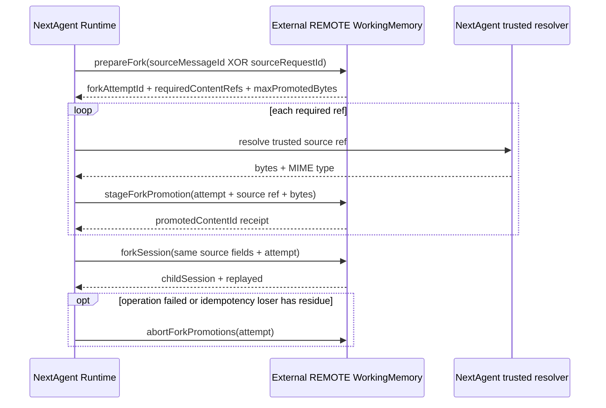

# REMOTE WorkingMemory 会话派生增量修改指导

## 1. 文档定位

本文面向已经实现旧版 `SessionForkStoreGateway` 的外部 REMOTE WorkingMemory（AgentMemory）团队，只说明 `refine-session-fork-provider-materialization` 引入的 contract 差异和新增实现逻辑。

权威来源：

- public contract、错误语义和可观察行为以 [`specs/session-fork-from-message/spec.md`](./specs/session-fork-from-message/spec.md) 为准。
- provider-private 实现顺序和原子性设计以 [`design.md`](./design.md) 为准。
- 本文只提供增量实施导航；发生冲突时以 spec、design 为准。

本文中的 WorkingMemory 指 session、message、request/run、active context、timeline/process、fork metadata 等运行状态，不是 NextAgent 长期记忆能力。

## 2. 代码仓边界

REMOTE WorkingMemory 服务端实现不在 NextAgent 代码仓交付。

NextAgent 代码仓只负责：

- 发布更新后的 `agent-contracts`。
- 修改 NextAgent Runtime 调用流程。
- 实现 LOCAL SQLite provider。
- 发布 LOCAL 与外部 REMOTE 共用的 conformance runner和fixtures。
- 提供本文档作为外部实现指导。

外部 REMOTE 团队在自己的代码仓中复用现有 gateway、reader、content store、transaction/conditional-write 和transport，只实现本文列出的增量。NextAgent 仓内不新增 REMOTE 服务端业务逻辑、AgentMemory HTTP endpoint、vendor DTO、credential 或transport adapter。

## 3. Contract 差异总览

### 3.1 新增 operations

| Operation | 作用 |
|---|---|
| `prepareFork(request, signal?)` | 读取REMOTE已有源事实，完成派生预检并返回有界required refs与opaque attempt |
| `forkSession(request, signal?)` | 重新校验源事实与staged refs，并原子创建完整child session |

### 3.2 修改 operations

| Operation | 相对旧contract的变化 |
|---|---|
| `stageForkPromotion(request, signal?)` | 从caller预构造child坐标改为`forkAttemptId + sourceSessionId + sourceMessageId + sourceRefId`绑定；result只返回receipt和provider生成的`promotedContentId` |
| `abortForkPromotions(request, signal?)` | request收窄为可信owner scope、`agentId`和`forkAttemptId`，只收敛该attempt的不可见staged residue |

### 3.3 保留 operations

以下五个operations保留原请求、结果和业务逻辑，只增加optional、非wire的`AbortSignal`最后参数：

- `loadSessionForkSource`
- `loadForkProcessSnapshotStatus`
- `hasUserMessageAfterForkAnchor`
- `loadCommittedForkPromotionContent`
- `cleanupExpiredForkPromotions`

REMOTE 不需要重写这些既有逻辑。只需在其现有远程读、内容读取或批处理边界传播cancellation/deadline；同步原子提交开始后仍以一致性为先。

### 3.4 删除 operations

以下旧operations不再属于public gateway；如新增逻辑需要，REMOTE可以将现有实现降为provider-private primitive：

- `listSessionMessagePrefixThroughAnchor`
- `loadForkedSessionByIdempotency`
- `forkSessionFromMessage`
- `listForkProcessSnapshotStatuses`

### 3.5 最终 public member 集合

更新后的 `SessionForkStoreGateway` public members 为：

1. `prepareFork`
2. `stageForkPromotion`
3. `forkSession`
4. `abortForkPromotions`
5. `loadSessionForkSource`
6. `loadForkProcessSnapshotStatus`
7. `hasUserMessageAfterForkAnchor`
8. `loadCommittedForkPromotionContent`
9. `cleanupExpiredForkPromotions`

这只是最终接口清单，不表示五个保留operations需要重新实现。

## 4. 类型变化

### 4.1 新增 public types

| 类型 | 用途 |
|---|---|
| `ForkAttemptId` | provider生成的opaque staging namespace |
| `PrepareForkRequest` | 携带可信scope、source session、单一入口字段和幂等键 |
| `PrepareForkResult` | 返回attempt、required refs和bytes上限 |
| `ForkRequiredContentRef` | NextAgent可信resolver所需的最小source坐标 |
| `StageForkPromotionResult` | 返回stage receipt与`promotedContentId` |
| `ForkSessionRequest` | 携带同一source坐标、幂等键和attempt |
| `ForkSessionResult` | success-only的`{ childSession, replayed }` |

`PrepareForkRequest`和`ForkSessionRequest`使用两个独立optional字段：

- message入口只传`sourceMessageId`。
- request入口只传`sourceRequestId`。
- 每个request必须恰好提供其中一个。

两个入口始终使用上述独立字段，不增加第三种锚点表达。

### 4.2 修改 `StageForkPromotionRequest`

目标字段只有：

- required owner scope
- `agentId`
- `forkAttemptId`
- `sourceSessionId`
- `sourceMessageId`
- `sourceRefId`
- `refType`
- `bytes`
- `mimeType`
- `sizeBytes`

不得接收caller生成的child session/message ids、status、timestamp、storage locator或`BlobRef`。

### 4.3 修改 `ForkPromotionAbortRequest`

目标字段只有required owner scope、`agentId`和`forkAttemptId`。

### 4.4 删除或私有化类型

删除或转为provider-private：

- `ListSessionMessagePrefixThroughAnchorQuery`
- `LoadForkedSessionByIdempotencyRequest`
- `ForkSessionFromMessageWriteRequest`
- `ForkSessionFromMessageWriteResult`
- `ListForkProcessSnapshotStatusesRequest`
- `ForkRunTimelineEventSnapshotDraft`
- `ForkPromotionStatus`
- `ForkPromotedContentRecord`

## 5. 新调用流程



NextAgent只解析`prepareFork`返回清单中的规范化tool-result refs。REMOTE继续只访问自己已经持久化的WorkingMemory事实以及通过stage收到的bytes，不访问NextAgent workspace或resolver。

## 6. `prepareFork` 新增逻辑

REMOTE在现有reader和幂等查询能力上新增以下流程：

1. Strict校验request、normalize `idempotencyKey`，确认两个入口字段恰好一个，并检查cancellation。
2. 使用可信owner scope、`agentId`和`sourceSessionId`读取source session；scope不匹配时不得跨scope探测。
3. 解析最终assistant message：message入口直接校验指定message；request入口必须唯一解析completed、durable、visible assistant candidate。
4. 校验最终message visible、role为assistant且回答内容非空。
5. 使用现有成功幂等查询检查首次child；完整成功锚点已存在时，返回新的attempt和空required refs，后续`forkSession`返回首次child。
6. 校验最终message对应的source run存在且terminal。
7. 通过现有内部message查询读取source session开头到最终message的完整canonical prefix；不得通过public result返回messages。
8. 校验scope、canonical顺序、message count和content bytes预算，并执行safe-projection预检。
9. 扫描content和metadata中的规范化`tool-results/<refId>`：每次出现都计入ref预算，返回前按`sourceMessageId + normalized refId`去重并确定性排序。
10. 通过现有request/run、process status和timeline读取能力校验事实完整性、event count和serialized bytes预算。
11. 生成新的opaque `forkAttemptId`，返回required refs和provider配置的`maxPromotedBytes`。

`prepareFork`不创建child ids、child facts或成功幂等锚点，也不保存prefix snapshot/ref manifest/preparation record。attempt只作为不可见promotion staging namespace。

## 7. `stageForkPromotion` 修改逻辑

在现有promotion content store基础上调整为：

1. Strict校验request；确认`sizeBytes`等于实际byte length、MIME type合法、`sourceRefId`已规范化，并检查cancellation。
2. 重新读取source session/message，确认ref确实存在于该message的content或metadata中。
3. 确认同attempt已有staging rows绑定相同owner、agent和source session。
4. 使用`owner scope + agentId + forkAttemptId + sourceMessageId + sourceRefId`作为stage唯一键。
5. 唯一键已存在时先比较digest、MIME和size，再读取stored bytes逐字节比较；完全一致返回首次receipt，否则reject promotion conflict。
6. 新ref加入前原子累计同attempt的`STAGED` bytes；超过`maxPromotedBytes`时不写入新事实。
7. 生成`promotedContentId`、持久化bytes，并原子写入或通过唯一约束竞争写入`STAGED` metadata。
8. metadata与bytes都可重新读取后才返回`StageForkPromotionResult`。

Stage完成后，content对既有`loadCommittedForkPromotionContent`仍不可见。bytes已写入但metadata失败时执行best-effort删除；provider已有orphan清理机制负责后续收敛。

## 8. `forkSession` 新增逻辑

REMOTE复用旧`forkSessionFromMessage`内部的child materialization能力，但public入口和业务计划改为provider自己生成：

1. Strict校验request、normalize幂等键、确认单一入口字段、校验attempt，并检查cancellation。
2. 重新读取source session并重新解析最终assistant message，不把prepare结果当作可信缓存。
3. 先查询成功幂等锚点；完整锚点已存在时返回首次child和`replayed=true`，不提交当前attempt。
4. 重新校验terminal run、完整prefix、预算、安全投影和ref分类。
5. 重新推导required refs，并与当前attempt下的`STAGED`集合双向精确比较；缺少、额外、重复、跨session、ref type不一致、bytes损坏或状态异常均在child可见前失败。
6. 读取相关request/run、process status和timeline facts，为每个distinct source id生成一对一child id映射。
7. 使用matching `promotedContentId`替换全部对应`tool-results/<refId>`出现位置；child messages不得残留source execution-bound ref、private locator或`BlobRef`。
8. 复用旧实现的title、fork source、safe projection、process snapshot语义，并产生与canonical active-context selector conformance一致的child context。
9. 最终提交前再次检查cancellation。
10. 在单一serializable transaction或等价原子条件写内重新检查成功幂等锚点和source有效性，然后提交child session/messages/context/fork source/process snapshots、matching promotion `COMMITTED`状态和成功幂等锚点。
11. 首次提交返回`replayed=false`；并发唯一键loser读取winner child并返回`replayed=true`。

最终提交失败时，child必须全部不可见，matching promotions保持`STAGED`。同步原子提交开始后不承诺中途abort；response丢失后以相同幂等键恢复首次child。

## 9. `abortForkPromotions` 修改逻辑

修改后的abort只接收attempt坐标：

1. 按可信owner scope、`agentId`和`forkAttemptId`查询`STAGED` rows。
2. 条件更新matching rows为`ABORTED`。
3. 对成功转换的rows best-effort删除bytes。
4. 不修改并发已转为`COMMITTED`的rows。
5. 删除失败时保留`ABORTED` metadata，继续由现有cleanup重试。
6. 重复abort不产生新副作用。

既有`cleanupExpiredForkPromotions`逻辑不变，只需能识别修改后的attempt-bound staging metadata。

## 10. Promotion 私有数据增量

在现有promotion persistence上补充或调整：

- `forkAttemptId`
- `sourceSessionId`
- `sourceMessageId`
- normalized `sourceRefId`
- `refType`
- provider-generated `promotedContentId`
- SHA-256 digest、`mimeType`、`sizeBytes`
- `STAGED | COMMITTED | ABORTED`状态及现有时间字段
- optional child session/message coordinates，仅最终提交时绑定

允许的变化为：

```text
STAGED -> COMMITTED
STAGED -> ABORTED
ABORTED -> metadata deleted after bytes are deleted or confirmed absent
```

不得abort或cleanup `COMMITTED` content。无需新增preparation table。

## 11. Ref 分类增量

| Source ref | 新流程行为 |
|---|---|
| provider已持有且可证明child可安全读取的owner+agent scoped durable ref | 复用旧规则保留或provider内重映射 |
| 规范化`tool-results/<refId>`且source run/resolver坐标完整 | prepare返回；NextAgent解析；stage保存；fork替换为`promotedContentId` |
| host/workspace path、traversal、临时执行路径 | fail closed，不创建child |
| unknown、scope不一致或无法证明child可读取的durable ref | fail closed，不原样复制 |

本change不要求REMOTE复制或重新绑定attachment row/blob。既有attachment读取规则保持不变。

## 12. 错误、幂等与取消增量

- `prepareFork`、修改后的stage/abort和`forkSession`失败均reject `AgentError`。
- `ForkSessionResult`只表达成功。
- 使用spec权威session-fork error catalog，不新增vendor错误码。
- Failure envelope执行strict schema校验；已知code的`(category, retryable)`必须与catalog精确匹配。
- 不返回raw exception、stack、endpoint、storage key、credential或diagnostic details。
- Fork成功幂等键继续使用trusted scope、source session、最终message id和normalized key；attempt不替代成功幂等键。
- Stage幂等键改为attempt+source message+source ref；同内容重试返回首次receipt，不同内容冲突。
- 最终提交前取消不留下可见child；提交后依赖成功幂等键恢复。

五个保留operations沿用现有错误语义，仅增加cancellation传播，不需要重新映射业务错误。

## 13. 外部实现建议顺序

1. 升级到发布后的`agent-contracts`并完成接口编译迁移。
2. 将四个被删除的public operations降为所需的private primitives。
3. 调整promotion metadata、stage唯一键和abort request。
4. 实现`prepareFork`。
5. 将旧child materialization逻辑迁入新增`forkSession`的provider-owned计划与原子提交。
6. 为九个public methods接入optional signal；五个保留methods不改业务逻辑。
7. 接入provider-neutral session-fork conformance runner。
8. 使用与LOCAL相同suite digest完成release candidate验收。

## 14. 增量验收清单

- [ ] 旧版五个保留读取/维护operations的结果与可见性语义无回归。
- [ ] message入口与request入口分别成功，且request恰好携带一个对应字段。
- [ ] request入口零个或多个completed assistant candidate时安全失败。
- [ ] 无required ref时可直接prepare后fork。
- [ ] tool-result ref能够discover、stage、替换，并由既有committed-content read读回相同bytes/MIME/size。
- [ ] 清单缺项、额外stage、source binding不一致或content conflict不创建child。
- [ ] host/workspace/unknown/跨scope refs fail closed。
- [ ] 六类既有派生预算边界与LOCAL结果一致。
- [ ] safe projection、title、fork source、process snapshots和active context与LOCAL规范化等价。
- [ ] 每个最终写入阶段故障后child都全部不可见。
- [ ] 同key并发只创建一个child；response loss后返回首次child且`replayed=true`。
- [ ] Abort和cleanup不修改`COMMITTED` content，删除失败可重试收敛。
- [ ] Cancellation在新增/修改operations的慢边界生效。
- [ ] Public prepare/fork request大小不随source messages、content或events增长。
- [ ] 外部REMOTE与LOCAL通过相同conformance suite digest。

## 15. 联调前置条件

NextAgent侧需要先提供：

- 已批准并发布的`agent-contracts` breaking版本。
- 当前版本的`WorkingMemoryGatewayBindings`与`adapterKind: "working-memory"`。
- 可发布的provider-neutral conformance runner、fixtures和suite digest。
- 与目标版本一致的schema和error catalog。

后续`refine-ts-agent-gateway-state-store-boundary`会在本change归档后迁移binding命名；REMOTE团队本轮不得提前切换到新的StateStore binding。
